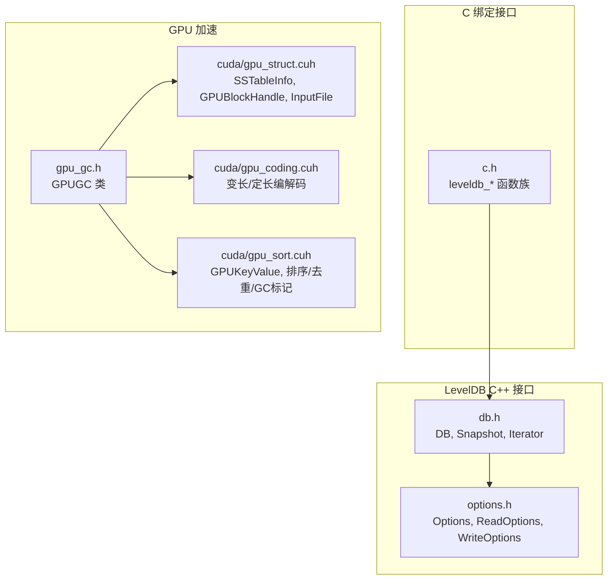
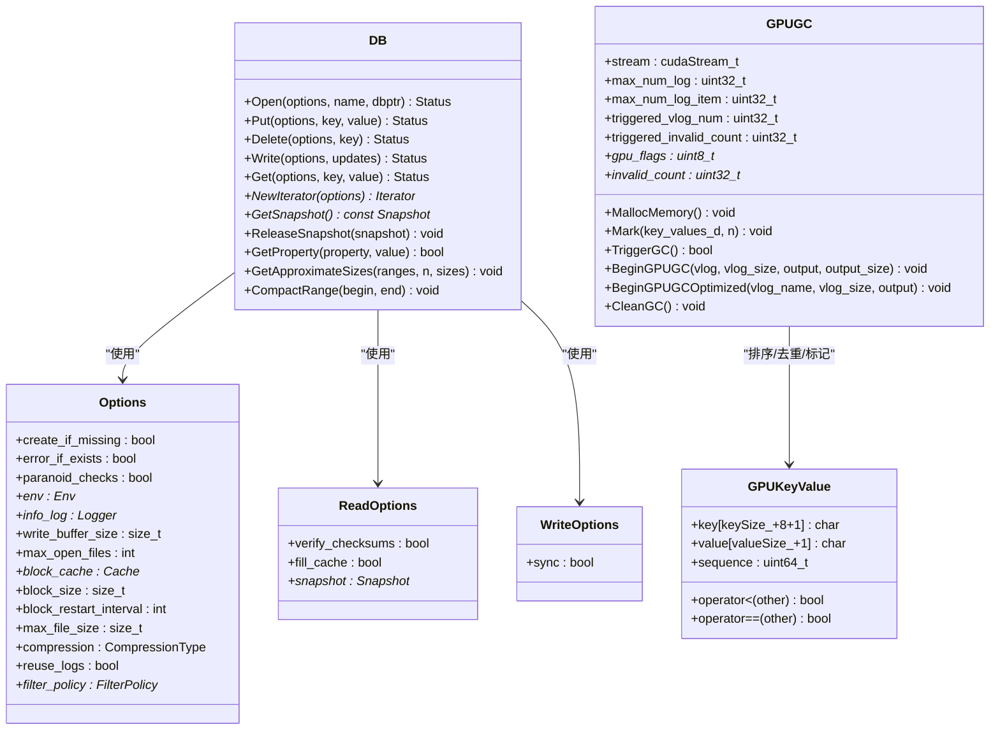
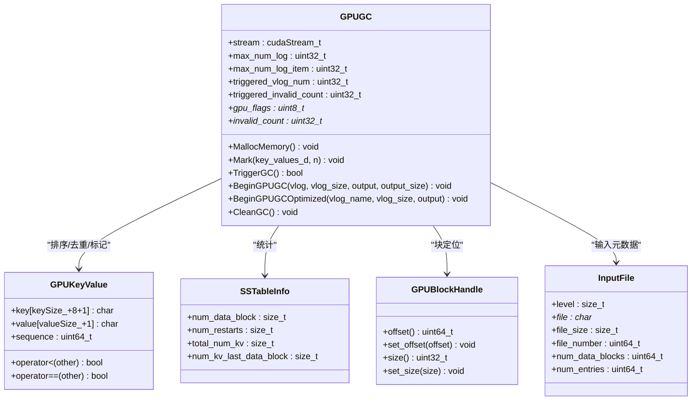
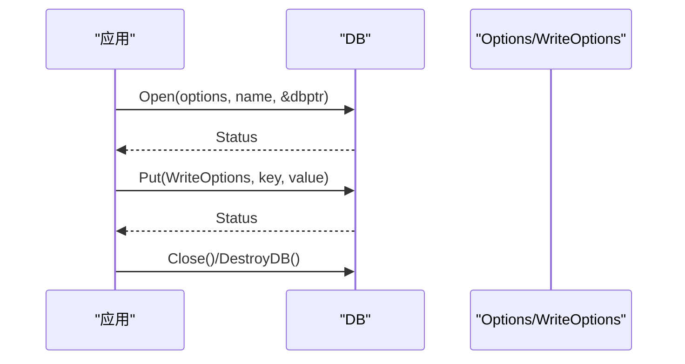
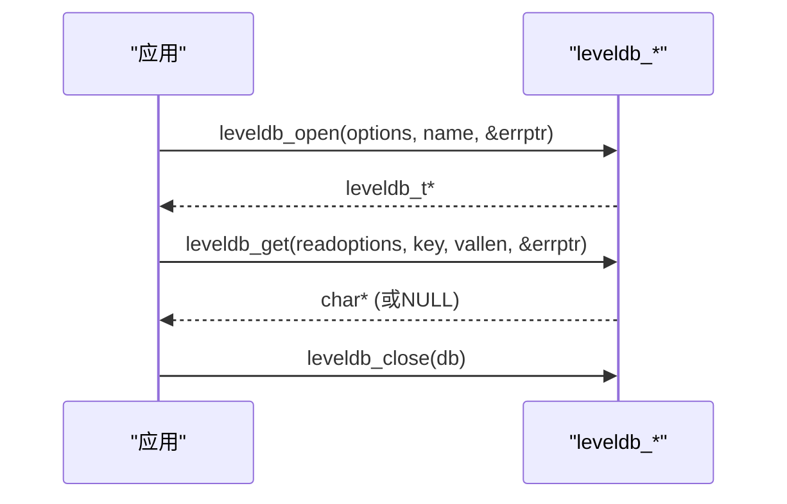
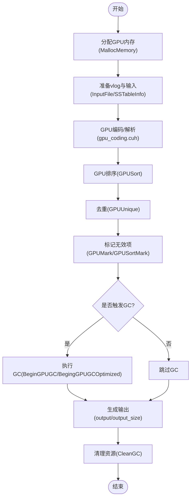
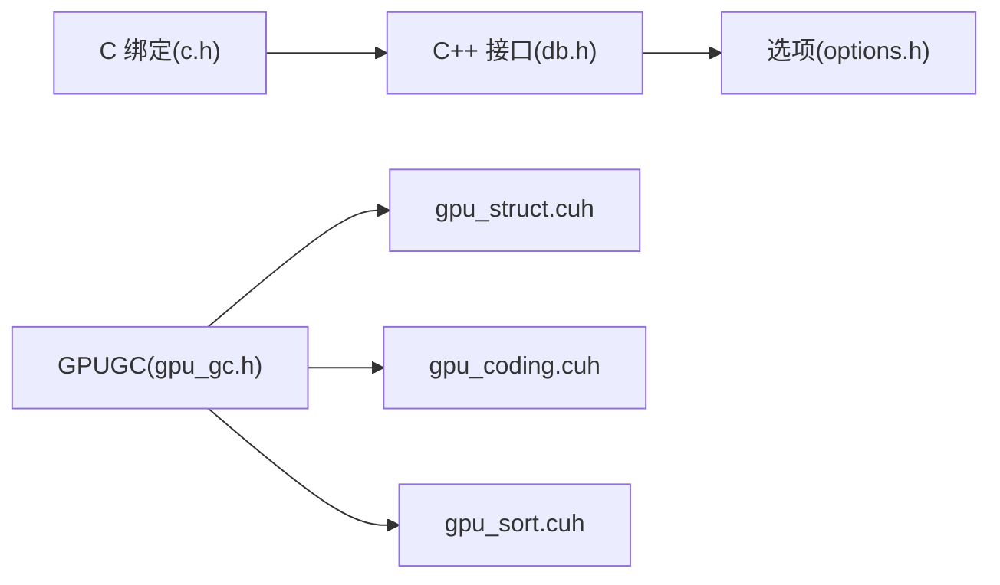

# API参考文档

<cite>
**本文引用的文件**   
- [include/leveldb/db.h](file://source/gParaKV-GC-master/include/leveldb/db.h)
- [include/leveldb/options.h](file://source/gParaKV-GC-master/include/leveldb/options.h)
- [include/leveldb/c.h](file://source/gParaKV-GC-master/include/leveldb/c.h)
- [db/gpu_gc.h](file://source/gParaKV-GC-master/db/gpu_gc.h)
- [db/cuda/gpu_struct.cuh](file://source/gParaKV-GC-master/db/cuda/gpu_struct.cuh)
- [db/cuda/gpu_coding.cuh](file://source/gParaKV-GC-master/db/cuda/gpu_coding.cuh)
- [db/cuda/gpu_sort.cuh](file://source/gParaKV-GC-master/db/cuda/gpu_sort.cuh)
</cite>

## 目录
1. [简介](#简介)
2. [项目结构](#项目结构)
3. [核心组件](#核心组件)
4. [架构总览](#架构总览)
5. [详细组件分析](#详细组件分析)
6. [依赖关系分析](#依赖关系分析)
7. [性能考量](#性能考量)
8. [故障排除指南](#故障排除指南)
9. [结论](#结论)
10. [附录：版本兼容与迁移、最佳实践、示例](#附录版本兼容与迁移最佳实践示例)

## 简介
本参考文档面向 metadata_offload 项目的 C++/CUDA API，重点覆盖以下方面：
- LevelDB 风格的 C++ 接口（数据库打开、读写、迭代、快照、压缩等）
- C 绑定接口（稳定 ABI，便于跨语言或 JNI 使用）
- CUDA 加速的垃圾回收与排序相关接口（GPU 内存管理、错误检查、调用流程）
- 配置选项与错误处理机制
- 常见用法示例路径、最佳实践、性能优化建议与调试排障方法

## 项目结构
本项目在 gParaKV-GC-master 子模块中提供 LevelDB 风格 API 与 GPU 加速能力。关键位置如下：
- C++ 公共头文件位于 include/leveldb/，定义 DB、Options、ReadOptions、WriteOptions、Snapshot、Iterator 等核心类型与操作
- C 绑定头文件 include/leveldb/c.h 暴露稳定的 C API
- GPU 相关接口集中在 db/gpu_gc.h 与 db/cuda/*.cuh 中，提供 GPU 数据结构、编码解码、排序与 GC 控制类

图表来源 
- [include/leveldb/db.h:1-171](file://source/gParaKV-GC-master/include/leveldb/db.h#L1-L171)
- [include/leveldb/options.h:1-189](file://source/gParaKV-GC-master/include/leveldb/options.h#L1-L189)
- [include/leveldb/c.h:1-271](file://source/gParaKV-GC-master/include/leveldb/c.h#L1-L271)
- [db/gpu_gc.h:1-53](file://source/gParaKV-GC-master/db/gpu_gc.h#L1-L53)
- [db/cuda/gpu_struct.cuh:1-87](file://source/gParaKV-GC-master/db/cuda/gpu_struct.cuh#L1-L87)
- [db/cuda/gpu_coding.cuh:1-80](file://source/gParaKV-GC-master/db/cuda/gpu_coding.cuh#L1-L80)
- [db/cuda/gpu_sort.cuh:1-91](file://source/gParaKV-GC-master/db/cuda/gpu_sort.cuh#L1-L91)

章节来源
- [include/leveldb/db.h:1-171](file://source/gParaKV-GC-master/include/leveldb/db.h#L1-L171)
- [include/leveldb/options.h:1-189](file://source/gParaKV-GC-master/include/leveldb/options.h#L1-L189)
- [include/leveldb/c.h:1-271](file://source/gParaKV-GC-master/include/leveldb/c.h#L1-L271)
- [db/gpu_gc.h:1-53](file://source/gParaKV-GC-master/db/gpu_gc.h#L1-L53)
- [db/cuda/gpu_struct.cuh:1-87](file://source/gParaKV-GC-master/db/cuda/gpu_struct.cuh#L1-L87)
- [db/cuda/gpu_coding.cuh:1-80](file://source/gParaKV-GC-master/db/cuda/gpu_coding.cuh#L1-L80)
- [db/cuda/gpu_sort.cuh:1-91](file://source/gParaKV-GC-master/db/cuda/gpu_sort.cuh#L1-L91)

## 核心组件
- LevelDB C++ 接口
  - DB：Open、Put、Delete、Write、Get、NewIterator、GetSnapshot、ReleaseSnapshot、GetProperty、GetApproximateSizes、CompactRange
  - Options/ReadOptions/WriteOptions：行为与性能参数、校验、缓存、同步策略
  - Snapshot：不可变快照，线程安全读取
  - Iterator：范围遍历与定位
- C 绑定接口
  - leveldb_open/close/put/delete/write/get/iterator/snapshot/compact_range/destroy_db/repair_db 等
  - 统一的 char** errptr 错误返回约定
- GPU 加速组件
  - GPUGC：GPU 侧垃圾回收编排（分配、标记、触发、清理）
  - gpu_struct.cuh：GPU 数据结构（SSTableInfo、GPUBlockHandle、InputFile）
  - gpu_coding.cuh：GPU 端变长/定长编解码工具
  - gpu_sort.cuh：GPUKeyValue 结构与排序/去重/标记算法入口

章节来源
- [include/leveldb/db.h:1-171](file://source/gParaKV-GC-master/include/leveldb/db.h#L1-L171)
- [include/leveldb/options.h:1-189](file://source/gParaKV-GC-master/include/leveldb/options.h#L1-L189)
- [include/leveldb/c.h:1-271](file://source/gParaKV-GC-master/include/leveldb/c.h#L1-L271)
- [db/gpu_gc.h:1-53](file://source/gParaKV-GC-master/db/gpu_gc.h#L1-L53)
- [db/cuda/gpu_struct.cuh:1-87](file://source/gParaKV-GC-master/db/cuda/gpu_struct.cuh#L1-L87)
- [db/cuda/gpu_coding.cuh:1-80](file://source/gParaKV-GC-master/db/cuda/gpu_coding.cuh#L1-L80)
- [db/cuda/gpu_sort.cuh:1-91](file://source/gParaKV-GC-master/db/cuda/gpu_sort.cuh#L1-L91)

## 架构总览
下图展示 LevelDB C++/C 接口与 GPU GC 组件之间的交互关系。C++ 接口负责数据面与元数据面的基本操作；GPU 组件通过 GPUGC 协调 GPU 内存、编码与排序，完成高效 GC。

图表来源 
- [include/leveldb/db.h:1-171](file://source/gParaKV-GC-master/include/leveldb/db.h#L1-L171)
- [include/leveldb/options.h:1-189](file://source/gParaKV-GC-master/include/leveldb/options.h#L1-L189)
- [db/gpu_gc.h:1-53](file://source/gParaKV-GC-master/db/gpu_gc.h#L1-L53)
- [db/cuda/gpu_sort.cuh:1-91](file://source/gParaKV-GC-master/db/cuda/gpu_sort.cuh#L1-L91)

## 详细组件分析

### LevelDB C++ 接口（DB、Options、ReadOptions、WriteOptions）
- 数据库生命周期
  - Open：根据 Options 打开或创建数据库，返回 Status
  - DestroyDB/RepairDB：销毁或修复数据库
- 数据操作
  - Put/Delete/Write：写入键值对或批量更新，支持 sync 选项
  - Get：按 ReadOptions 读取，支持校验与快照
- 遍历与快照
  - NewIterator：创建迭代器，需先 Seek 再使用
  - GetSnapshot/ReleaseSnapshot：获取/释放快照
- 统计与压缩
  - GetProperty：查询内部属性（如级别文件数、内存占用近似值等）
  - GetApproximateSizes：按 Range 估算空间占用
  - CompactRange：对指定范围进行压缩整理

章节来源
- [include/leveldb/db.h:1-171](file://source/gParaKV-GC-master/include/leveldb/db.h#L1-L171)
- [include/leveldb/options.h:1-189](file://source/gParaKV-GC-master/include/leveldb/options.h#L1-L189)

### C 绑定接口（leveldb_*）
- 设计约定
  - 所有可能失败的函数以 char** errptr 返回错误消息
  - 布尔类型为 uint8_t（0=false，非0=true）
  - 指针参数必须非空
- 主要函数族
  - 数据库：leveldb_open/close/destroy_db/repair_db
  - 读写：leveldb_put/delete/write/get
  - 迭代：leveldb_create_iterator/seek/next/prev/key/value/destroy
  - 快照：leveldb_create_snapshot/release_snapshot
  - 属性与压缩：leveldb_property_value/compact_range/approximate_sizes
  - 批写：leveldb_writebatch_create/put/delete/iterate/append/destroy
  - 选项：leveldb_options_create/set_* /destroy；read/write options set_*
  - 过滤器与比较器：leveldb_filterpolicy_create_bloom/comparator_create
  - 环境：leveldb_env_create_default/destroy
  - 工具：leveldb_free/major_version/minor_version

章节来源
- [include/leveldb/c.h:1-271](file://source/gParaKV-GC-master/include/leveldb/c.h#L1-L271)

### GPU 加速组件（GPUGC、GPU 数据结构与算法）
- GPUGC 类职责
  - MallocMemory：分配 GPU 所需内存
  - Mark：对 GPU 上的 KV 序列进行无效标记
  - TriggerGC：触发垃圾回收流程
  - BeginGPUGC/BeginGPUGCOptimized：启动基于 vlog 的 GPU GC 流程，输出结果
  - CleanGC：清理资源
  - stream：CUDA 流，用于异步执行
- GPU 数据结构
  - SSTableInfo：描述 SSTable 的文件级统计信息
  - GPUBlockHandle：块偏移与大小封装
  - InputFile：输入文件元数据（层级、文件名、大小、条目数等）
- 编码与解码
  - 变长整数与固定长度类型的 GPU 编解码函数
- 排序与去重
  - GPUKeyValue：包含 key/value/sequence，并提供比较与相等性
  - GPUSort/GPUUnique/GPUSortMark/GPUMark：GPU 侧排序、去重与标记

图表来源 
- [db/gpu_gc.h:1-53](file://source/gParaKV-GC-master/db/gpu_gc.h#L1-L53)
- [db/cuda/gpu_struct.cuh:1-87](file://source/gParaKV-GC-master/db/cuda/gpu_struct.cuh#L1-L87)
- [db/cuda/gpu_sort.cuh:1-91](file://source/gParaKV-GC-master/db/cuda/gpu_sort.cuh#L1-L91)

章节来源
- [db/gpu_gc.h:1-53](file://source/gParaKV-GC-master/db/gpu_gc.h#L1-L53)
- [db/cuda/gpu_struct.cuh:1-87](file://source/gParaKV-GC-master/db/cuda/gpu_struct.cuh#L1-L87)
- [db/cuda/gpu_coding.cuh:1-80](file://source/gParaKV-GC-master/db/cuda/gpu_coding.cuh#L1-L80)
- [db/cuda/gpu_sort.cuh:1-91](file://source/gParaKV-GC-master/db/cuda/gpu_sort.cuh#L1-L91)

### 典型调用序列（C++ 与 C 绑定）
- C++ 打开与写入

- C 绑定打开与读取

图表来源 
- [include/leveldb/db.h:1-171](file://source/gParaKV-GC-master/include/leveldb/db.h#L1-L171)
- [include/leveldb/c.h:1-271](file://source/gParaKV-GC-master/include/leveldb/c.h#L1-L271)

### GPU GC 流程（算法流程图）

图表来源 
- [db/gpu_gc.h:1-53](file://source/gParaKV-GC-master/db/gpu_gc.h#L1-L53)
- [db/cuda/gpu_coding.cuh:1-80](file://source/gParaKV-GC-master/db/cuda/gpu_coding.cuh#L1-L80)
- [db/cuda/gpu_sort.cuh:1-91](file://source/gParaKV-GC-master/db/cuda/gpu_sort.cuh#L1-L91)

## 依赖关系分析
- LevelDB C++ 接口依赖 Options/ReadOptions/WriteOptions 控制行为与性能
- C 绑定接口为上层语言或 JNI 提供稳定 ABI，屏蔽内部实现细节
- GPU 组件通过 gpu_struct.cuh 的数据结构与 gpu_coding.cuh 的编解码工具，配合 gpu_sort.cuh 的排序/去重算法，由 GPUGC 统一编排

图表来源 
- [include/leveldb/db.h:1-171](file://source/gParaKV-GC-master/include/leveldb/db.h#L1-L171)
- [include/leveldb/options.h:1-189](file://source/gParaKV-GC-master/include/leveldb/options.h#L1-L189)
- [include/leveldb/c.h:1-271](file://source/gParaKV-GC-master/include/leveldb/c.h#L1-L271)
- [db/gpu_gc.h:1-53](file://source/gParaKV-GC-master/db/gpu_gc.h#L1-L53)
- [db/cuda/gpu_struct.cuh:1-87](file://source/gParaKV-GC-master/db/cuda/gpu_struct.cuh#L1-L87)
- [db/cuda/gpu_coding.cuh:1-80](file://source/gParaKV-GC-master/db/cuda/gpu_coding.cuh#L1-L80)
- [db/cuda/gpu_sort.cuh:1-91](file://source/gParaKV-GC-master/db/cuda/gpu_sort.cuh#L1-L91)

章节来源
- [include/leveldb/db.h:1-171](file://source/gParaKV-GC-master/include/leveldb/db.h#L1-L171)
- [include/leveldb/options.h:1-189](file://source/gParaKV-GC-master/include/leveldb/options.h#L1-L189)
- [include/leveldb/c.h:1-271](file://source/gParaKV-GC-master/include/leveldb/c.h#L1-L271)
- [db/gpu_gc.h:1-53](file://source/gParaKV-GC-master/db/gpu_gc.h#L1-L53)
- [db/cuda/gpu_struct.cuh:1-87](file://source/gParaKV-GC-master/db/cuda/gpu_struct.cuh#L1-L87)
- [db/cuda/gpu_coding.cuh:1-80](file://source/gParaKV-GC-master/db/cuda/gpu_coding.cuh#L1-L80)
- [db/cuda/gpu_sort.cuh:1-91](file://source/gParaKV-GC-master/db/cuda/gpu_sort.cuh#L1-L91)

## 性能考量
- 写入性能
  - 增大 write_buffer_size 可提升批量写入吞吐，但会增加恢复时间
  - 合理设置 max_open_files 与 block_size，匹配工作集与文件系统特性
- 读取性能
  - 启用 filter_policy（如 BloomFilter）可减少磁盘读取
  - fill_cache 在大规模扫描时可关闭以减少缓存压力
- 压缩与存储
  - compression 选择影响 CPU 与 I/O 平衡；Snappy 通常足够快
  - max_file_size 影响 compaction 粒度与延迟抖动
- GPU 加速
  - 利用 GPUSort/GPUUnique/GPUMark 在 GPU 上并行处理，减少主机-设备拷贝
  - 使用 cudaStream_t 异步流水线化编码、排序与 GC 阶段
  - 注意显存容量与带宽瓶颈，避免频繁 H2D/D2H 切换

[本节为通用指导，不直接分析具体文件]

## 故障排除指南
- C++ 接口错误处理
  - 所有操作返回 Status，应检查 IsOK/IsNotFound 等状态
  - 使用 GetProperty 获取内部统计与诊断信息
- C 绑定错误处理
  - 所有函数通过 char** errptr 返回错误字符串，成功时保持原值
  - 使用 leveldb_free 释放库分配的内存
- GPU 错误检查
  - 使用 CHECK 宏检查 CUDA 调用，失败时打印错误并退出
  - 关注 cudaError_t 返回值，必要时添加更细粒度的错误捕获
- 常见问题
  - 打开失败：检查 create_if_missing/error_if_exists 配置
  - 读不到数据：确认 Key 顺序与 Comparator 一致
  - 内存不足：调整 write_buffer_size/block_cache/max_open_files
  - GPU 崩溃：检查显存分配与边界访问，确保 stream 同步点正确

章节来源
- [include/leveldb/db.h:1-171](file://source/gParaKV-GC-master/include/leveldb/db.h#L1-L171)
- [include/leveldb/c.h:1-271](file://source/gParaKV-GC-master/include/leveldb/c.h#L1-L271)
- [db/cuda/gpu_struct.cuh:1-87](file://source/gParaKV-GC-master/db/cuda/gpu_struct.cuh#L1-L87)

## 结论
metadata_offload 项目在 LevelDB 风格 API 基础上，结合 GPU 加速的 GC 与排序能力，提供了高性能、可扩展的键值存储接口。通过合理的 Options 配置与 GPU 流水线设计，可在高并发与大数据量场景下获得良好吞吐与低延迟表现。建议在工程实践中遵循本文的最佳实践与排障指南，持续监控性能指标并及时调优。

[本节为总结性内容，不直接分析具体文件]

## 附录：版本兼容与迁移、最佳实践、示例

### 版本兼容性
- LevelDB C++ 接口版本常量
  - kMajorVersion/kMinorVersion 标识当前主/次版本
- C 绑定稳定性
  - c.h 提供稳定 ABI，适合跨语言绑定与长期维护

章节来源
- [include/leveldb/db.h:1-171](file://source/gParaKV-GC-master/include/leveldb/db.h#L1-L171)
- [include/leveldb/c.h:1-271](file://source/gParaKV-GC-master/include/leveldb/c.h#L1-L271)

### 迁移指南
- 从旧版 C++ 接口迁移到新版
  - 检查 Options/ReadOptions/WriteOptions 字段变化
  - 确认 Comparator 与 Key 顺序一致性
- 从 C 绑定迁移到 C++
  - 将 leveldb_* 调用替换为 DB/Options/Iterator 对象模型
  - 使用 Status 替代 char** errptr 的错误处理

章节来源
- [include/leveldb/db.h:1-171](file://source/gParaKV-GC-master/include/leveldb/db.h#L1-L171)
- [include/leveldb/c.h:1-271](file://source/gParaKV-GC-master/include/leveldb/c.h#L1-L271)

### 最佳实践
- 写入
  - 批量使用 WriteBatch 提高吞吐
  - 按需开启 sync，权衡持久性与性能
- 读取
  - 合理使用 Snapshot 保证一致性视图
  - 大扫描关闭 fill_cache 降低缓存压力
- GPU
  - 尽量在 GPU 上完成排序与去重，减少主机-设备往返
  - 使用 Stream 组织异步任务，最大化并行度

[本节为通用指导，不直接分析具体文件]

### 常见用法示例（路径指引）
- C++ 打开与写入
  - 参考：[include/leveldb/db.h:1-171](file://source/gParaKV-GC-master/include/leveldb/db.h#L1-L171)
- C 绑定打开与读取
  - 参考：[include/leveldb/c.h:1-271](file://source/gParaKV-GC-master/include/leveldb/c.h#L1-L271)
- GPU GC 初始化与执行
  - 参考：[db/gpu_gc.h:1-53](file://source/gParaKV-GC-master/db/gpu_gc.h#L1-L53)
  - 参考：[db/cuda/gpu_sort.cuh:1-91](file://source/gParaKV-GC-master/db/cuda/gpu_sort.cuh#L1-L91)
  - 参考：[db/cuda/gpu_coding.cuh:1-80](file://source/gParaKV-GC-master/db/cuda/gpu_coding.cuh#L1-L80)

[本节仅给出文件路径，不包含代码片段]