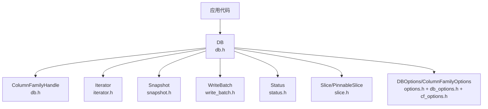
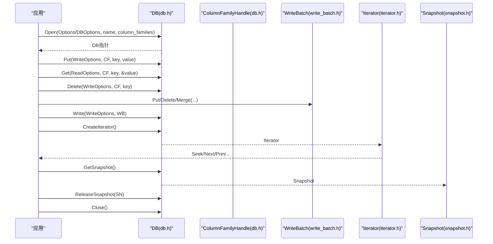
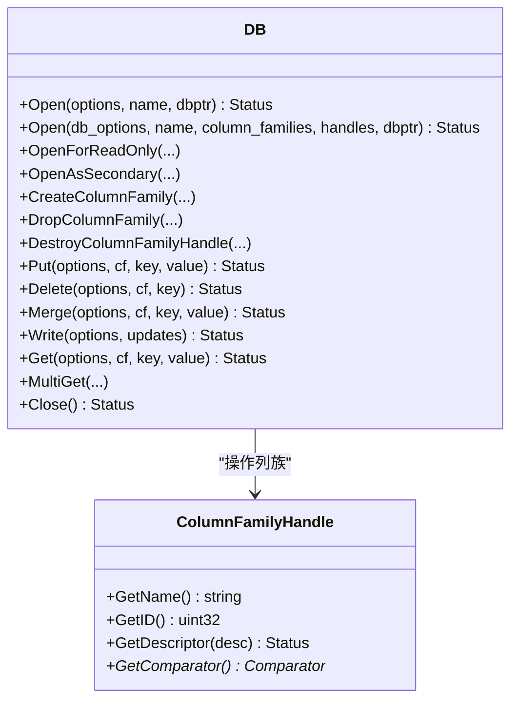
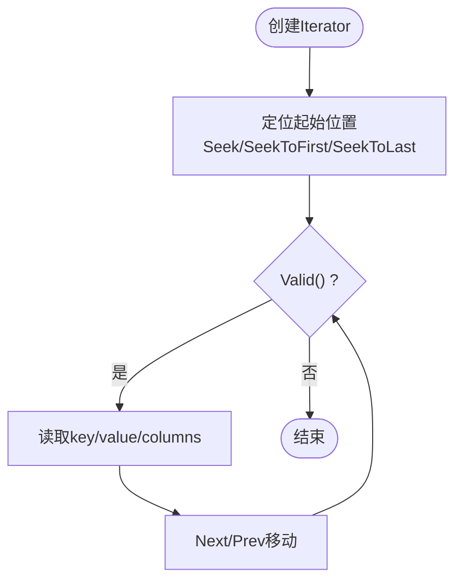
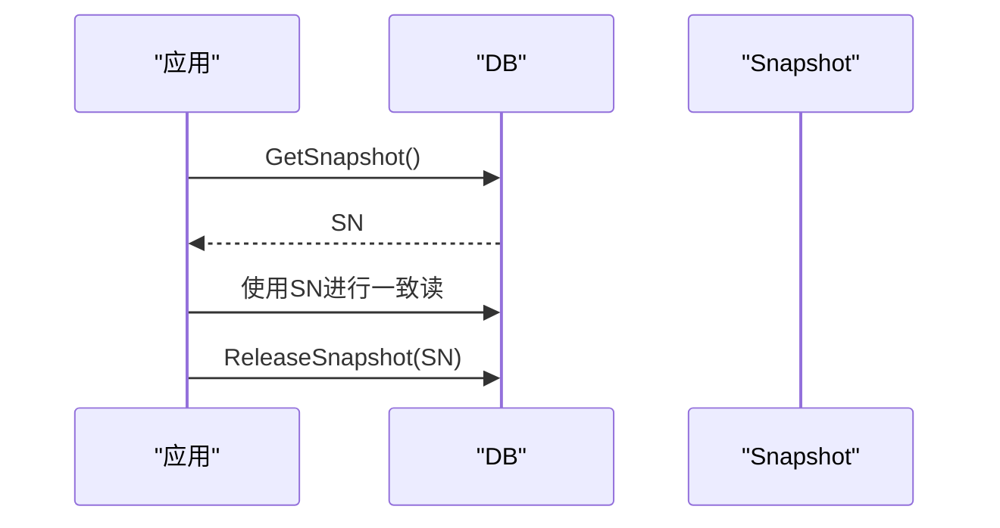
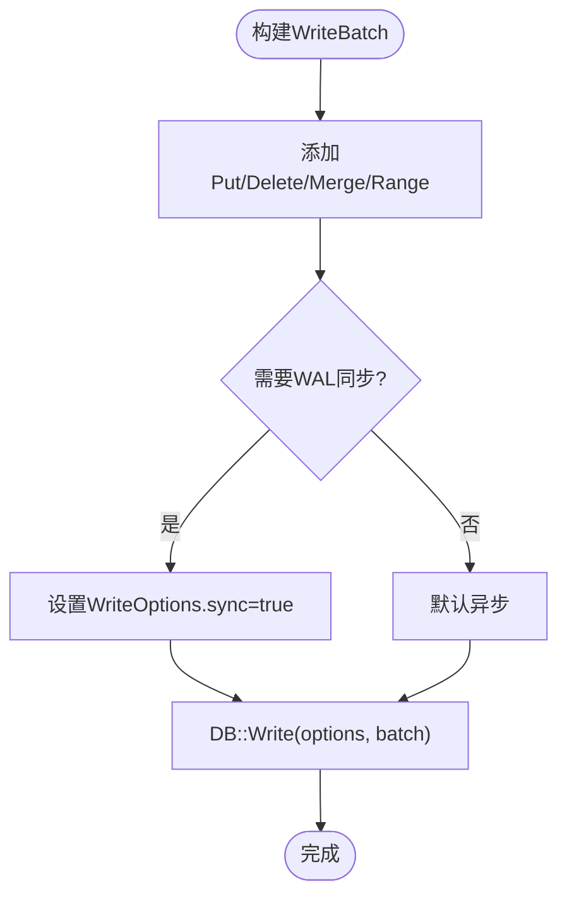
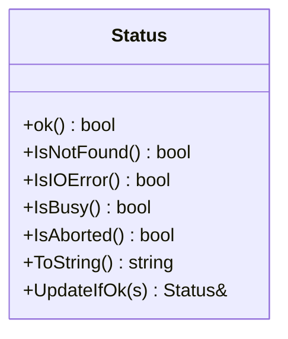
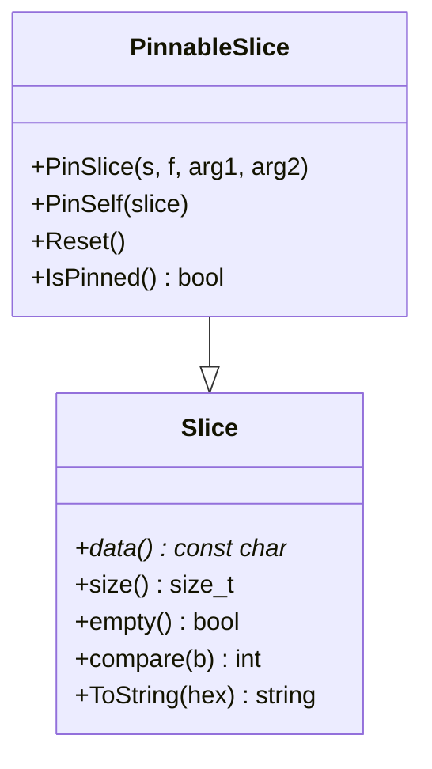
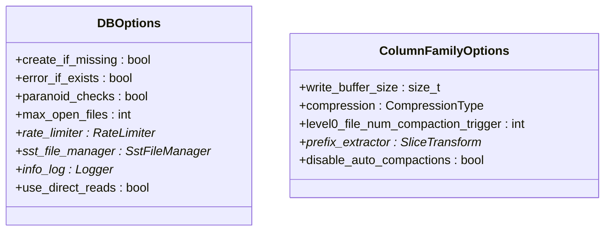
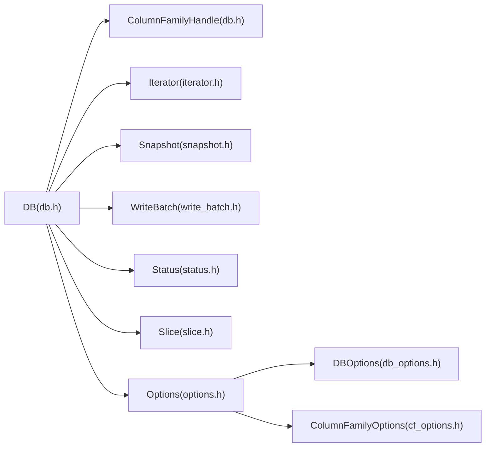

# C++核心API

<cite>
**本文引用的文件**   
- [db.h](file://source/rocksdb/include/rocksdb/db.h)
- [options.h](file://source/rocksdb/include/rocksdb/options.h)
- [iterator.h](file://source/rocksdb/include/rocksdb/iterator.h)
- [write_batch.h](file://source/rocksdb/include/rocksdb/write_batch.h)
- [status.h](file://source/rocksdb/include/rocksdb/status.h)
- [slice.h](file://source/rocksdb/include/rocksdb/slice.h)
- [snapshot.h](file://source/rocksdb/include/rocksdb/snapshot.h)
- [db_options.h](file://source/rocksdb/options/db_options.h)
- [cf_options.h](file://source/rocksdb/options/cf_options.h)
</cite>

## 目录
1. [简介](#简介)
2. [项目结构](#项目结构)
3. [核心组件](#核心组件)
4. [架构总览](#架构总览)
5. [详细组件分析](#详细组件分析)
6. [依赖关系分析](#依赖关系分析)
7. [性能考虑](#性能考虑)
8. [故障排查指南](#故障排查指南)
9. [结论](#结论)
10. [附录](#附录)

## 简介
本参考文档面向RocksDB C++核心API，聚焦数据库操作接口与关键类的使用说明，包括：
- 数据库打开与关闭（Open、OpenForReadOnly、OpenAsSecondary等）
- 数据读写（Put、Get、Delete、Merge、Write等）
- 列族管理（ColumnFamilyHandle、Create/Drop Column Family）
- 迭代器（Iterator）与快照（Snapshot）
- 事务与批量写（WriteBatch）
- 配置选项（DBOptions、ColumnFamilyOptions、ReadOptions、WriteOptions）
- 错误处理机制（Status）
- 性能优化建议与最佳实践

本说明以源码头文件为依据，确保与实现保持同步。

## 项目结构
RocksDB的C++ API主要暴露于include/rocksdb下的头文件中，核心入口为db.h；配置集中在options.h及子模块；基础类型如Slice、Status、Iterator、Snapshot分别定义在对应头文件中。

图表来源
- [db.h:126-260](file://source/rocksdb/include/rocksdb/db.h#L126-L260)
- [iterator.h:29-113](file://source/rocksdb/include/rocksdb/iterator.h#L29-L113)
- [snapshot.h:20-51](file://source/rocksdb/include/rocksdb/snapshot.h#L20-L51)
- [write_batch.h:64-120](file://source/rocksdb/include/rocksdb/write_batch.h#L64-L120)
- [status.h:35-120](file://source/rocksdb/include/rocksdb/status.h#L35-L120)
- [slice.h:33-131](file://source/rocksdb/include/rocksdb/slice.h#L33-L131)
- [options.h:70-110](file://source/rocksdb/include/rocksdb/options.h#L70-L110)
- [db_options.h:16-122](file://source/rocksdb/options/db_options.h#L16-L122)
- [cf_options.h:22-102](file://source/rocksdb/options/cf_options.h#L22-L102)

章节来源
- [db.h:126-260](file://source/rocksdb/include/rocksdb/db.h#L126-L260)
- [options.h:70-110](file://source/rocksdb/include/rocksdb/options.h#L70-L110)

## 核心组件
- DB：持久化有序键值存储的核心抽象，提供Open、Put、Get、Delete、Merge、Write、MultiGet、Close等接口，支持多列族与只读/次级实例模式。
- ColumnFamilyHandle：列族句柄，用于标识和操作特定列族。
- Iterator：迭代器，按顺序遍历键值对，支持属性查询与预取准备。
- Snapshot：不可变的数据一致性视图，支持线程安全访问。
- WriteBatch：原子性批量写入容器，支持Put/Delete/Merge/Range删除等操作。
- Status：统一的状态返回对象，包含错误码、子码与严重级别。
- Slice/PinnableSlice：零拷贝数据片段与可钉住的数据片段，避免内存复制。
- Options：DBOptions与ColumnFamilyOptions控制数据库与列族行为，ReadOptions/WriteOptions控制读写行为。

章节来源
- [db.h:126-260](file://source/rocksdb/include/rocksdb/db.h#L126-L260)
- [iterator.h:29-113](file://source/rocksdb/include/rocksdb/iterator.h#L29-L113)
- [snapshot.h:20-51](file://source/rocksdb/include/rocksdb/snapshot.h#L20-L51)
- [write_batch.h:64-120](file://source/rocksdb/include/rocksdb/write_batch.h#L64-L120)
- [status.h:35-120](file://source/rocksdb/include/rocksdb/status.h#L35-L120)
- [slice.h:33-131](file://source/rocksdb/include/rocksdb/slice.h#L33-L131)
- [options.h:70-110](file://source/rocksdb/include/rocksdb/options.h#L70-L110)

## 架构总览
下图展示典型使用流程：应用通过DB::Open打开数据库，使用ColumnFamilyHandle进行Put/Get/Delete，使用WriteBatch进行原子批量写，使用Iterator进行范围扫描，使用Snapshot保证一致性读取。

图表来源
- [db.h:139-260](file://source/rocksdb/include/rocksdb/db.h#L139-L260)
- [write_batch.h:64-120](file://source/rocksdb/include/rocksdb/write_batch.h#L64-L120)
- [iterator.h:29-113](file://source/rocksdb/include/rocksdb/iterator.h#L29-L113)
- [snapshot.h:20-51](file://source/rocksdb/include/rocksdb/snapshot.h#L20-L51)

## 详细组件分析

### DB类与列族管理
- 打开数据库：
  - Open(Options, name, dbptr)
  - Open(DBOptions, name, column_families, handles, dbptr)
  - OpenForReadOnly/OpenAsSecondary/OpenAsFollower等
- 列族操作：
  - CreateColumnFamily/CreateColumnFamilies
  - DropColumnFamily/DropColumnFamilies
  - DestroyColumnFamilyHandle
- 数据操作：
  - Put/Delete/SingleDelete/DeleteRange/Merge
  - Write(WriteBatch*)
  - MultiGet批量读取
  - GetEntity/GetMergeOperands等高级接口
- 生命周期：
  - Close()释放资源
  - Resume()恢复后台错误后的写入

图表来源
- [db.h:139-260](file://source/rocksdb/include/rocksdb/db.h#L139-L260)
- [db.h:377-424](file://source/rocksdb/include/rocksdb/db.h#L377-L424)
- [db.h:425-553](file://source/rocksdb/include/rocksdb/db.h#L425-L553)
- [db.h:599-656](file://source/rocksdb/include/rocksdb/db.h#L599-L656)
- [db.h:733-792](file://source/rocksdb/include/rocksdb/db.h#L733-L792)

章节来源
- [db.h:139-260](file://source/rocksdb/include/rocksdb/db.h#L139-L260)
- [db.h:377-424](file://source/rocksdb/include/rocksdb/db.h#L377-L424)
- [db.h:425-553](file://source/rocksdb/include/rocksdb/db.h#L425-L553)
- [db.h:599-656](file://source/rocksdb/include/rocksdb/db.h#L599-L656)
- [db.h:733-792](file://source/rocksdb/include/rocksdb/db.h#L733-L792)

### 迭代器Iterator
- 基本方法：Next/Prev/SeekToFirst/SeekToLast/Seek等（继承自基类）
- 当前条目访问：key()/value()/columns()
- 属性查询：GetProperty(prop_name, prop)
- 预取优化：Prepare(MultiScanArgs)

图表来源
- [iterator.h:29-113](file://source/rocksdb/include/rocksdb/iterator.h#L29-L113)

章节来源
- [iterator.h:29-113](file://source/rocksdb/include/rocksdb/iterator.h#L29-L113)

### 快照Snapshot
- 获取一致性视图：DB::GetSnapshot()
- 释放快照：DB::ReleaseSnapshot()
- ManagedSnapshot：RAII封装，构造时创建，析构时释放

图表来源
- [snapshot.h:20-51](file://source/rocksdb/include/rocksdb/snapshot.h#L20-L51)

章节来源
- [snapshot.h:20-51](file://source/rocksdb/include/rocksdb/snapshot.h#L20-L51)

### 批量写WriteBatch
- 原子写入：Write(WriteOptions, WriteBatch*)
- 支持Put/Delete/SingleDelete/DeleteRange/Merge/PutLogData
- SavePoint/RollbackToSavePoint用于部分回滚
- Iterate遍历批内容

图表来源
- [write_batch.h:64-120](file://source/rocksdb/include/rocksdb/write_batch.h#L64-L120)
- [write_batch.h:179-214](file://source/rocksdb/include/rocksdb/write_batch.h#L179-L214)
- [write_batch.h:216-231](file://source/rocksdb/include/rocksdb/write_batch.h#L216-L231)

章节来源
- [write_batch.h:64-120](file://source/rocksdb/include/rocksdb/write_batch.h#L64-L120)
- [write_batch.h:179-214](file://source/rocksdb/include/rocksdb/write_batch.h#L179-L214)
- [write_batch.h:216-231](file://source/rocksdb/include/rocksdb/write_batch.h#L216-L231)

### 状态与错误处理Status
- 成功与失败：ok()/IsNotFound()/IsIOError()等
- 错误码Code与子码SubCode细化错误原因
- 严重级别Severity区分软/硬/致命错误
- 常用工厂方法：OK(), NotFound(), IOError(), Busy(), Aborted()等

图表来源
- [status.h:35-120](file://source/rocksdb/include/rocksdb/status.h#L35-L120)
- [status.h:176-332](file://source/rocksdb/include/rocksdb/status.h#L176-L332)
- [status.h:329-451](file://source/rocksdb/include/rocksdb/status.h#L329-L451)

章节来源
- [status.h:35-120](file://source/rocksdb/include/rocksdb/status.h#L35-L120)
- [status.h:176-332](file://source/rocksdb/include/rocksdb/status.h#L176-L332)
- [status.h:329-451](file://source/rocksdb/include/rocksdb/status.h#L329-L451)

### 数据类型Slice与PinnableSlice
- Slice：轻量引用外部数据的切片，避免拷贝
- PinnableSlice：可钉住数据的Slice，配合Cleanable自动释放资源
- OptSlice/SliceParts：可选切片与分段拼接

图表来源
- [slice.h:33-131](file://source/rocksdb/include/rocksdb/slice.h#L33-L131)
- [slice.h:179-263](file://source/rocksdb/include/rocksdb/slice.h#L179-L263)

章节来源
- [slice.h:33-131](file://source/rocksdb/include/rocksdb/slice.h#L33-L131)
- [slice.h:179-263](file://source/rocksdb/include/rocksdb/slice.h#L179-L263)

### 配置选项DBOptions与ColumnFamilyOptions
- DBOptions：数据库级配置，如create_if_missing、max_open_files、rate_limiter、sst_file_manager、info_log、use_direct_reads等
- ColumnFamilyOptions：列族级配置，如write_buffer_size、compression、level0_file_num_compaction_trigger、prefix_extractor、disable_auto_compactions等
- Immutable/Mutable选项分离：ImmutableDBOptions/ImmutableCFOptions与MutableDBOptions/MutableCFOptions

图表来源
- [options.h:70-110](file://source/rocksdb/include/rocksdb/options.h#L70-L110)
- [options.h:569-800](file://source/rocksdb/include/rocksdb/options.h#L569-L800)
- [db_options.h:16-122](file://source/rocksdb/options/db_options.h#L16-L122)
- [cf_options.h:22-102](file://source/rocksdb/options/cf_options.h#L22-L102)

章节来源
- [options.h:70-110](file://source/rocksdb/include/rocksdb/options.h#L70-L110)
- [options.h:569-800](file://source/rocksdb/include/rocksdb/options.h#L569-L800)
- [db_options.h:16-122](file://source/rocksdb/options/db_options.h#L16-L122)
- [cf_options.h:22-102](file://source/rocksdb/options/cf_options.h#L22-L102)

## 依赖关系分析
- DB依赖ColumnFamilyHandle、Iterator、Snapshot、WriteBatch、Status、Slice等
- Options贯穿DB与CF配置，Immutable/Mutable分离便于运行时调整
- 各组件通过头文件声明形成松耦合，实现细节在.rocksdb内部

图表来源
- [db.h:126-260](file://source/rocksdb/include/rocksdb/db.h#L126-L260)
- [options.h:70-110](file://source/rocksdb/include/rocksdb/options.h#L70-L110)
- [db_options.h:16-122](file://source/rocksdb/options/db_options.h#L16-L122)
- [cf_options.h:22-102](file://source/rocksdb/options/cf_options.h#L22-L102)

章节来源
- [db.h:126-260](file://source/rocksdb/include/rocksdb/db.h#L126-L260)
- [options.h:70-110](file://source/rocksdb/include/rocksdb/options.h#L70-L110)

## 性能考虑
- 批量写入：优先使用WriteBatch减少WAL与锁开销
- 压缩与块缓存：合理设置compression与block cache大小，平衡CPU与I/O
- 合并策略：根据工作负载选择Level或Universal风格compaction
- 直接I/O：use_direct_reads/use_direct_io_for_flush_and_compaction提升吞吐
- 并发与限流：IncreaseParallelism与RateLimiter控制后台任务与带宽
- 列族路径：cf_paths/db_paths分散热点，降低单盘压力
- 预取与范围扫描：Iterator Prepare与合适的ReadOptions提升范围读性能

[本节为通用指导，不直接分析具体文件]

## 故障排查指南
- 常见错误码：
  - NotFound：键不存在
  - IO Error：底层文件系统错误（磁盘满、权限不足等）
  - Busy/Aborted：资源忙或操作被中止
  - Corruption：数据损坏
- 检查步骤：
  - 检查Status.ok()与IsXxx()系列方法
  - 查看info_log日志定位问题
  - 验证SST唯一ID与WAL完整性（verify_sst_unique_id_in_manifest、track_and_verify_wals）
  - 使用Resume()尝试恢复后台错误
- 常见问题：
  - 打开失败：确认路径、权限、是否已存在（error_if_exists）
  - 写入失败：检查磁盘空间、RateLimiter限制、WAL同步设置
  - 读取不一致：使用Snapshot保证一致性

章节来源
- [status.h:176-332](file://source/rocksdb/include/rocksdb/status.h#L176-L332)
- [status.h:329-451](file://source/rocksdb/include/rocksdb/status.h#L329-L451)
- [options.h:569-800](file://source/rocksdb/include/rocksdb/options.h#L569-L800)

## 结论
RocksDB C++核心API提供了强大而灵活的键值存储能力，通过DB、ColumnFamilyHandle、Iterator、Snapshot、WriteBatch等关键类，结合丰富的配置选项与完善的错误处理机制，能够满足从单机到分布式场景的多样化需求。遵循本文档的最佳实践与性能建议，可有效提升系统稳定性与吞吐表现。

[本节为总结，不直接分析具体文件]

## 附录
- 示例用法路径（不含代码内容）：
  - 打开数据库：[db.h:139-260](file://source/rocksdb/include/rocksdb/db.h#L139-L260)
  - 写入数据：[db.h:425-553](file://source/rocksdb/include/rocksdb/db.h#L425-L553)
  - 读取数据：[db.h:599-656](file://source/rocksdb/include/rocksdb/db.h#L599-L656)
  - 批量写入：[write_batch.h:64-120](file://source/rocksdb/include/rocksdb/write_batch.h#L64-L120)
  - 迭代遍历：[iterator.h:29-113](file://source/rocksdb/include/rocksdb/iterator.h#L29-L113)
  - 快照使用：[snapshot.h:20-51](file://source/rocksdb/include/rocksdb/snapshot.h#L20-L51)
  - 配置选项：[options.h:70-110](file://source/rocksdb/include/rocksdb/options.h#L70-L110), [db_options.h:16-122](file://source/rocksdb/options/db_options.h#L16-L122), [cf_options.h:22-102](file://source/rocksdb/options/cf_options.h#L22-L102)

[本节为附录，不直接分析具体文件]