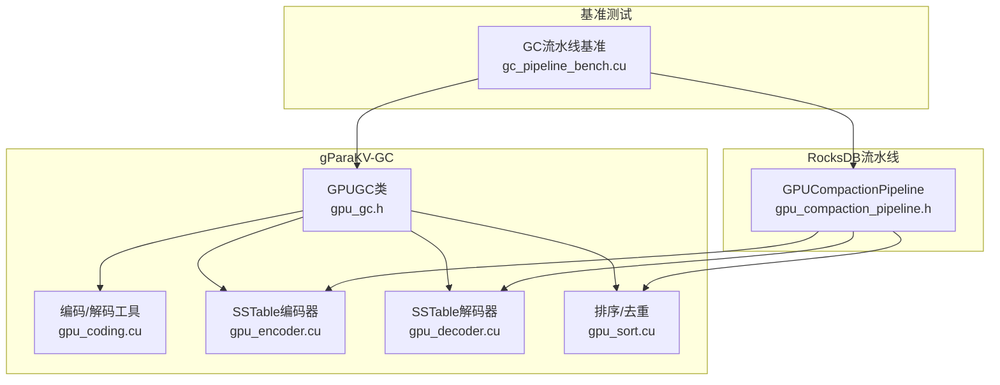
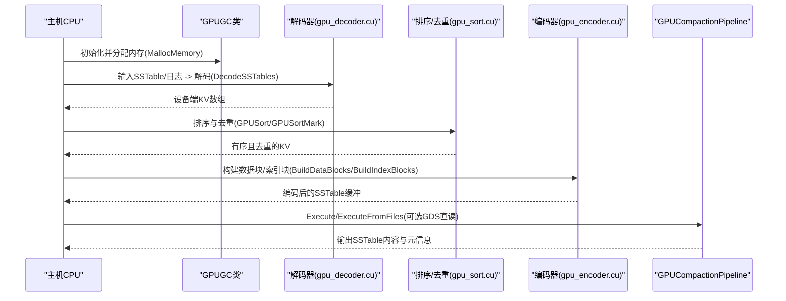
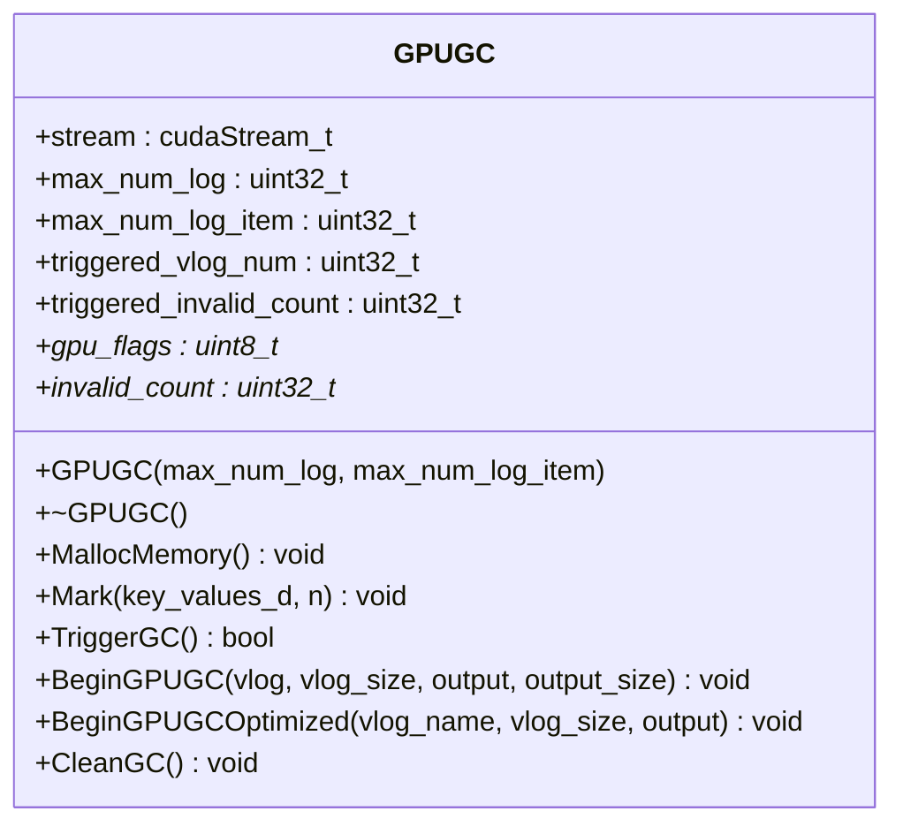
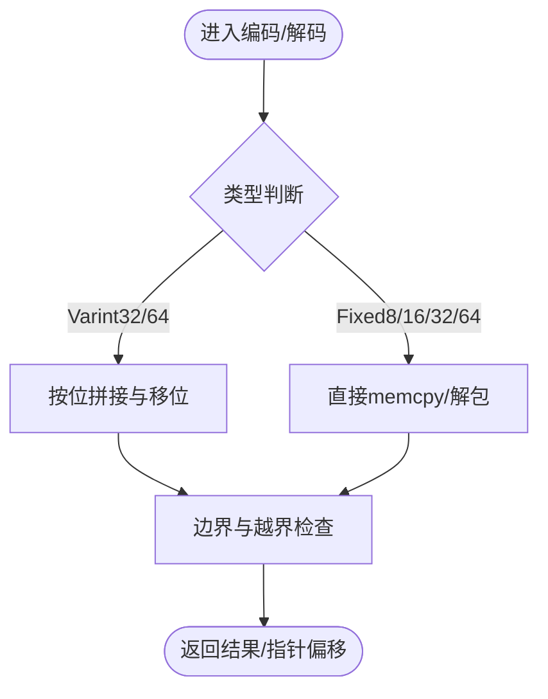
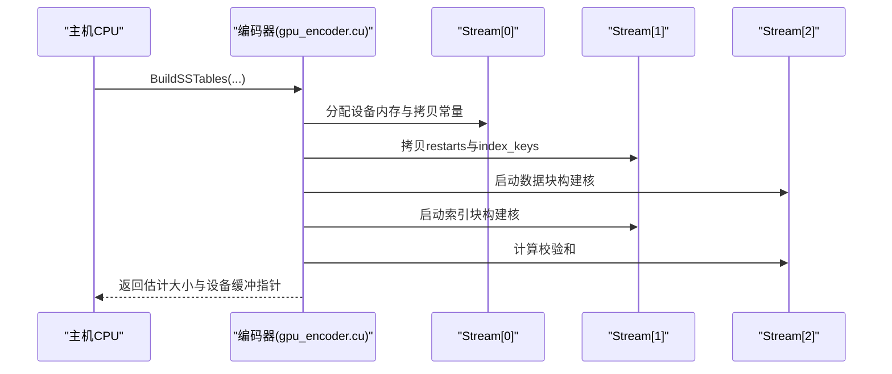
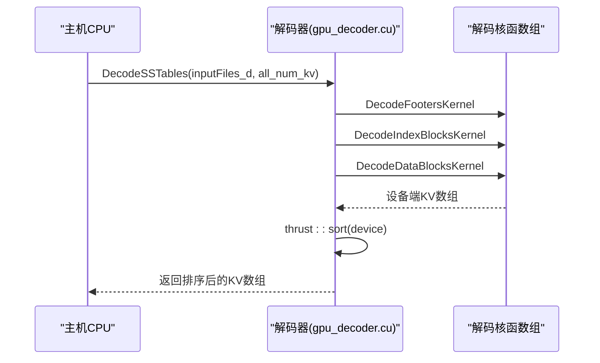
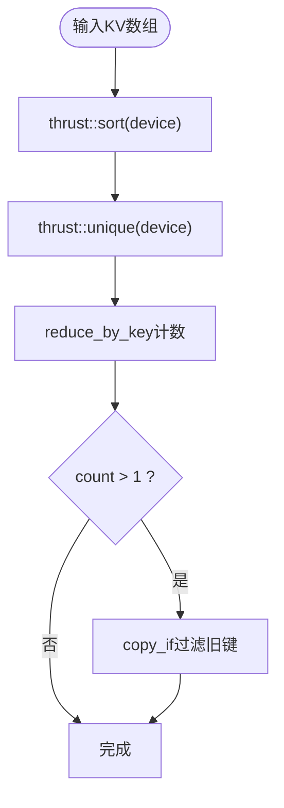
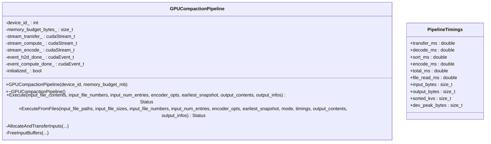
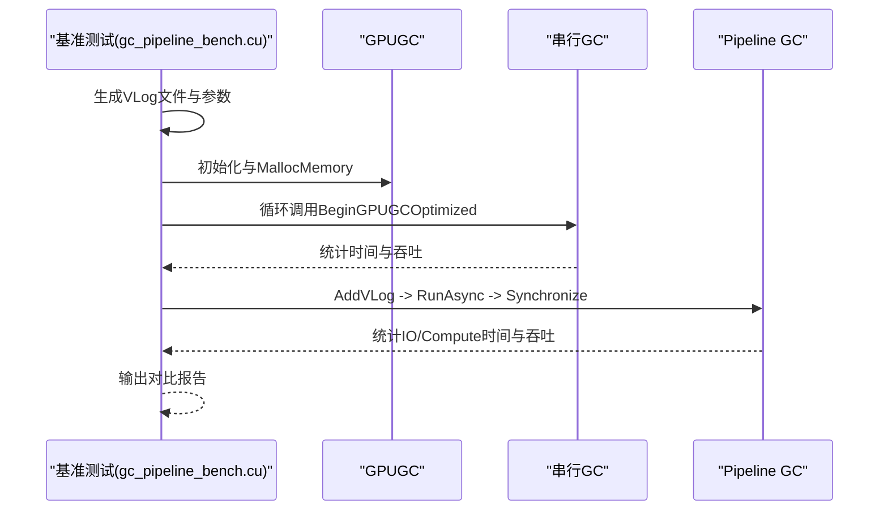
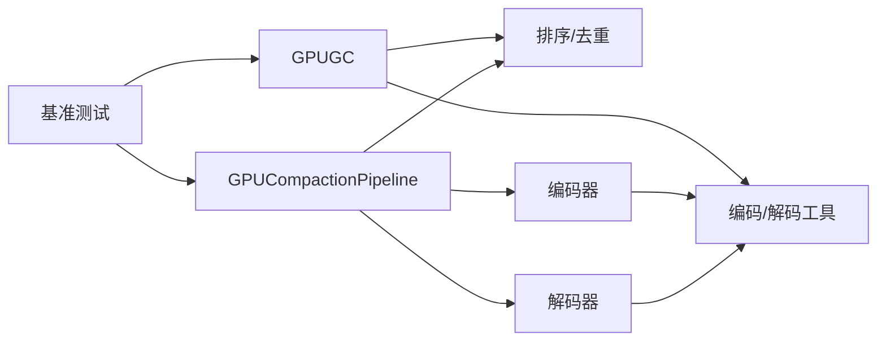

# CUDA接口

<cite>
**本文引用的文件**   
- [gpu_gc.h](file://source/gParaKV-GC-master/db/gpu_gc.h)
- [gpu_coding.cu](file://source/gParaKV-GC-master/db/cuda/gpu_coding.cu)
- [gpu_encoder.cu](file://source/gParaKV-GC-master/db/cuda/gpu_encoder.cu)
- [gpu_decoder.cu](file://source/gParaKV-GC-master/db/cuda/gpu_decoder.cu)
- [gpu_sort.cu](file://source/gParaKV-GC-master/db/cuda/gpu_sort.cu)
- [gpu_compaction_pipeline.h](file://source/rocksdb-flush-wal-0.2/db/cuda/gpu_compaction_pipeline.h)
- [gc_pipeline_bench.cu](file://source/gParaKV-GC-pipeline/db/cuda_pipeline_gc/gc_pipeline_bench.cu)
</cite>

## 目录
1. [简介](#简介)
2. [项目结构](#项目结构)
3. [核心组件](#核心组件)
4. [架构总览](#架构总览)
5. [详细组件分析](#详细组件分析)
6. [依赖关系分析](#依赖关系分析)
7. [性能考虑](#性能考虑)
8. [故障排查指南](#故障排查指南)
9. [结论](#结论)
10. [附录](#附录)

## 简介
本文件面向GPU加速模块的CUDA接口，聚焦于GPU压缩、编码/解码、排序去重、垃圾回收（GC）以及GPU-CPU流水线等关键能力。文档涵盖：
- GPU压缩函数的调用方法（编码、解码、排序去重、GC）
- CUDA内存管理（主机与设备内存分配、传输、释放）
- GPU内核参数配置与错误检查机制
- 完整的调用示例路径（以源码路径代替代码片段）
- GPU-CPU流水线工作方式与优化技巧
- GPU资源监控与调试方法
- 版本兼容性与迁移指南

## 项目结构
仓库中与GPU/CUDA相关的核心代码分布在以下位置：
- gParaKV-GC系列：提供GPUGC类、SSTable编解码、排序去重、GC流程
- RocksDB flush/wal分支：提供三阶段GPU压缩流水线（H2D传输、Decode+Sort+Dedup、Encode+D2H）
- Pipeline基准测试：对比串行与并行GC的性能

**图表来源** 
- [gpu_gc.h:1-53](file://source/gParaKV-GC-master/db/gpu_gc.h#L1-L53)
- [gpu_coding.cu:1-209](file://source/gParaKV-GC-master/db/cuda/gpu_coding.cu#L1-L209)
- [gpu_encoder.cu:1-800](file://source/gParaKV-GC-master/db/cuda/gpu_encoder.cu#L1-L800)
- [gpu_decoder.cu:1-198](file://source/gParaKV-GC-master/db/cuda/gpu_decoder.cu#L1-L198)
- [gpu_sort.cu:1-158](file://source/gParaKV-GC-master/db/cuda/gpu_sort.cu#L1-L158)
- [gpu_compaction_pipeline.h:1-128](file://source/rocksdb-flush-wal-0.2/db/cuda/gpu_compaction_pipeline.h#L1-L128)
- [gc_pipeline_bench.cu:1-375](file://source/gParaKV-GC-pipeline/db/cuda_pipeline_gc/gc_pipeline_bench.cu#L1-L375)

**章节来源**
- [gpu_gc.h:1-53](file://source/gParaKV-GC-master/db/gpu_gc.h#L1-L53)
- [gpu_compaction_pipeline.h:1-128](file://source/rocksdb-flush-wal-0.2/db/cuda/gpu_compaction_pipeline.h#L1-L128)

## 核心组件
- GPUGC类：封装GPU侧GC生命周期（内存分配、标记、触发GC、清理），维护流与统计信息
- 编码/解码工具：Varint/Fixed编解码、内部键解析、校验和计算
- SSTable编码器：数据块/索引块构建、重启点处理、校验和写入、多流并发
- SSTable解码器：Footer/Index/Data块解码、全局计数、Thrust排序
- 排序/去重：基于Thrust的设备端排序、去重、计数与过滤
- GPUCompactionPipeline：三阶段流水线（传输、计算、编码），事件同步与计时

**章节来源**
- [gpu_gc.h:1-53](file://source/gParaKV-GC-master/db/gpu_gc.h#L1-L53)
- [gpu_coding.cu:1-209](file://source/gParaKV-GC-master/db/cuda/gpu_coding.cu#L1-L209)
- [gpu_encoder.cu:1-800](file://source/gParaKV-GC-master/db/cuda/gpu_encoder.cu#L1-L800)
- [gpu_decoder.cu:1-198](file://source/gParaKV-GC-master/db/cuda/gpu_decoder.cu#L1-L198)
- [gpu_sort.cu:1-158](file://source/gParaKV-GC-master/db/cuda/gpu_sort.cu#L1-L158)
- [gpu_compaction_pipeline.h:1-128](file://source/rocksdb-flush-wal-0.2/db/cuda/gpu_compaction_pipeline.h#L1-L128)

## 架构总览
下图展示GPU压缩与GC的整体架构与数据流向：

**图表来源** 
- [gpu_decoder.cu:1-198](file://source/gParaKV-GC-master/db/cuda/gpu_decoder.cu#L1-L198)
- [gpu_sort.cu:1-158](file://source/gParaKV-GC-master/db/cuda/gpu_sort.cu#L1-L158)
- [gpu_encoder.cu:1-800](file://source/gParaKV-GC-master/db/cuda/gpu_encoder.cu#L1-L800)
- [gpu_compaction_pipeline.h:1-128](file://source/rocksdb-flush-wal-0.2/db/cuda/gpu_compaction_pipeline.h#L1-L128)

## 详细组件分析

### GPUGC类（GPU GC控制器）
- 职责：管理GPU侧GC所需的位图与无效计数、流对象、触发与清理流程
- 主要接口：
  - MallocMemory：分配GPU位图与统计缓冲区
  - Mark：标记设备端KV状态
  - TriggerGC：触发GC流程
  - BeginGPUGC/BeginGPUGCOptimized：启动GC（支持优化路径）
  - CleanGC：清理资源与状态
- 成员：stream、max_num_log、max_num_log_item、gpu_flags、invalid_count等

**图表来源** 
- [gpu_gc.h:1-53](file://source/gParaKV-GC-master/db/gpu_gc.h#L1-L53)

**章节来源**
- [gpu_gc.h:1-53](file://source/gParaKV-GC-master/db/gpu_gc.h#L1-L53)

### 编码/解码工具（gpu_coding.cu）
- 功能：Varint32/64、Fixed8/16/32/64编解码；内部键解析；校验和辅助
- 典型函数：
  - GPUEncodeVarint32/Varint64
  - GPUDecodeFixed8/32/64
  - GPUParseHotValue/GPUParseInternalKey
  - GPUGetVarint64/GPUGetVarint32Ptr
- 复杂度：变长编码为O(k)，k为字节数；固定长度O(1)

**图表来源** 
- [gpu_coding.cu:1-209](file://source/gParaKV-GC-master/db/cuda/gpu_coding.cu#L1-L209)

**章节来源**
- [gpu_coding.cu:1-209](file://source/gParaKV-GC-master/db/cuda/gpu_coding.cu#L1-L209)

### SSTable编码器（gpu_encoder.cu）
- 功能：数据块与索引块构建、重启点处理、校验和写入、多流并发
- 关键流程：
  - BuildDataBlocks/BuildDataBlocksForCompaction：生成数据块与索引键
  - BuildIndexBlocks/BuildIndexBlocksForCompaction：生成索引块与校验和
  - BuildSSTables：统一入口，分配设备内存、拷贝常量/全局变量、异步传输与核函数调度
- 多流设计：使用多个cudaStream实现阶段内并行与阶段间顺序执行

**图表来源** 
- [gpu_encoder.cu:1-800](file://source/gParaKV-GC-master/db/cuda/gpu_encoder.cu#L1-L800)

**章节来源**
- [gpu_encoder.cu:1-800](file://source/gParaKV-GC-master/db/cuda/gpu_encoder.cu#L1-L800)

### SSTable解码器（gpu_decoder.cu）
- 功能：读取Footer、解析Index、解码Data块，聚合KV并排序
- 关键流程：
  - DecodeFootersKernel：解析每个文件的Footer
  - DecodeIndexBlocksKernel：解析索引块handle
  - DecodeDataBlocksKernel：解码数据块内容，原子累加全局计数
  - DecodeSSTables：编排核函数、Thrust排序、资源释放

**图表来源** 
- [gpu_decoder.cu:1-198](file://source/gParaKV-GC-master/db/cuda/gpu_decoder.cu#L1-L198)

**章节来源**
- [gpu_decoder.cu:1-198](file://source/gParaKV-GC-master/db/cuda/gpu_decoder.cu#L1-L198)

### 排序与去重（gpu_sort.cu）
- 功能：设备端排序、去重、计数与过滤（用于GC识别旧值）
- 关键函数：
  - GPUSort：排序并去重，返回sorted_size
  - GPUUnique：仅去重
  - GPUSortMark：排序后计数并过滤count>1的键，返回old_start与num_old
  - GPUMark：排序后计数并复制count>1的键到主机容器

**图表来源** 
- [gpu_sort.cu:1-158](file://source/gParaKV-GC-master/db/cuda/gpu_sort.cu#L1-L158)

**章节来源**
- [gpu_sort.cu:1-158](file://source/gParaKV-GC-master/db/cuda/gpu_sort.cu#L1-L158)

### GPU压缩流水线（GPUCompactionPipeline）
- 职责：协调三阶段GPU压缩流水线（H2D传输、Decode+Sort+Dedup、Encode+D2H），使用事件同步与计时
- 关键接口：
  - Execute：从内存输入执行流水线
  - ExecuteFromFiles：从文件系统路径执行，支持Host IO或GDS直读
  - PipelineTimings：记录各阶段耗时与吞吐指标
- 流与事件：stream_transfer_、stream_compute_、stream_encode_；event_h2d_done_、event_compute_done_

**图表来源** 
- [gpu_compaction_pipeline.h:1-128](file://source/rocksdb-flush-wal-0.2/db/cuda/gpu_compaction_pipeline.h#L1-L128)

**章节来源**
- [gpu_compaction_pipeline.h:1-128](file://source/rocksdb-flush-wal-0.2/db/cuda/gpu_compaction_pipeline.h#L1-L128)

### 基准测试（gc_pipeline_bench.cu）
- 目标：对比串行GC与Pipeline GC的性能
- 关键点：
  - 合成VLog文件生成与随机无效比例设置
  - 初始化GPUGC bitmap状态并按vlog维度拷贝至设备
  - 运行Serial GC（逐个调用BeginGPUGCOptimized）
  - 运行Pipeline GC（GCVLogPipeline多流并行）
  - 输出总时间、I/O时间、计算时间、吞吐与加速比

**图表来源** 
- [gc_pipeline_bench.cu:1-375](file://source/gParaKV-GC-pipeline/db/cuda_pipeline_gc/gc_pipeline_bench.cu#L1-L375)

**章节来源**
- [gc_pipeline_bench.cu:1-375](file://source/gParaKV-GC-pipeline/db/cuda_pipeline_gc/gc_pipeline_bench.cu#L1-L375)

## 依赖关系分析
- GPUGC依赖编码/解码工具与排序/去重库（Thrust）
- 编码器与解码器通过GPUKeyValue结构与常量/全局变量交互
- GPUCompactionPipeline依赖上述组件以实现端到端压缩流水线
- 基准测试依赖GPUGC与Pipeline进行性能对比

**图表来源** 
- [gpu_gc.h:1-53](file://source/gParaKV-GC-master/db/gpu_gc.h#L1-L53)
- [gpu_coding.cu:1-209](file://source/gParaKV-GC-master/db/cuda/gpu_coding.cu#L1-L209)
- [gpu_encoder.cu:1-800](file://source/gParaKV-GC-master/db/cuda/gpu_encoder.cu#L1-L800)
- [gpu_decoder.cu:1-198](file://source/gParaKV-GC-master/db/cuda/gpu_decoder.cu#L1-L198)
- [gpu_sort.cu:1-158](file://source/gParaKV-GC-master/db/cuda/gpu_sort.cu#L1-L158)
- [gpu_compaction_pipeline.h:1-128](file://source/rocksdb-flush-wal-0.2/db/cuda/gpu_compaction_pipeline.h#L1-L128)
- [gc_pipeline_bench.cu:1-375](file://source/gParaKV-GC-pipeline/db/cuda_pipeline_gc/gc_pipeline_bench.cu#L1-L375)

**章节来源**
- [gpu_gc.h:1-53](file://source/gParaKV-GC-master/db/gpu_gc.h#L1-L53)
- [gpu_compaction_pipeline.h:1-128](file://source/rocksdb-flush-wal-0.2/db/cuda/gpu_compaction_pipeline.h#L1-L128)

## 性能考虑
- 多流与事件：利用多个cudaStream与cudaEvent实现阶段内并行与阶段间同步，最大化重叠
- 异步内存操作：使用cudaMallocAsync与cudaMemcpyAsync减少主机等待
- 常量/全局变量：将频繁访问的配置（如size_complete_data_block、num_restarts）放入常量/符号内存
- 批处理与分块：按数据块与文件维度划分任务，避免单核过载
- 传输优化：支持GDS直读（NVMe->GPU）以减少主机内存中转
- 统计与计时：记录各阶段耗时与峰值设备内存，便于定位瓶颈

**章节来源**
- [gpu_encoder.cu:1-800](file://source/gParaKV-GC-master/db/cuda/gpu_encoder.cu#L1-L800)
- [gpu_compaction_pipeline.h:1-128](file://source/rocksdb-flush-wal-0.2/db/cuda/gpu_compaction_pipeline.h#L1-L128)
- [gc_pipeline_bench.cu:1-375](file://source/gParaKV-GC-pipeline/db/cuda_pipeline_gc/gc_pipeline_bench.cu#L1-L375)

## 故障排查指南
- 常见错误检查：
  - 使用CHECK宏对CUDA API调用进行错误检查（如cudaStreamSynchronize、cudaMemcpyAsync）
  - 解码失败时打印“bad block handle”提示
- 调试建议：
  - 使用cuda-memcheck检测内存越界与未初始化访问
  - 使用nvprof/nsys分析核函数耗时与内存带宽
  - 在关键路径插入cudaDeviceSynchronize定位阻塞点
- 资源泄漏防护：
  - 确保所有cudaMalloc/cudaMallocAsync对应cudaFree
  - 流与事件创建后及时销毁
  - 主机端临时数组（如restarts）使用后释放

**章节来源**
- [gpu_decoder.cu:1-198](file://source/gParaKV-GC-master/db/cuda/gpu_decoder.cu#L1-L198)
- [gpu_encoder.cu:1-800](file://source/gParaKV-GC-master/db/cuda/gpu_encoder.cu#L1-L800)

## 结论
本CUDA接口围绕GPUGC与GPUCompactionPipeline构建了高效的GPU压缩与GC流水线。通过多流并发、异步内存操作与GDS直读，显著提升了吞吐与延迟表现。结合Thrust的设备端排序与去重，实现了高并发的数据处理。建议在集成时关注错误检查、资源管理与性能调优，以获得稳定与高效的结果。

## 附录

### CUDA内存管理要点
- 主机与设备内存分配：
  - cudaMalloc/cudaMallocAsync用于设备内存
  - new/delete用于主机内存
- 数据传输：
  - cudaMemcpy/cudaMemcpyAsync用于H2D/D2H
  - cudaMemcpyToSymbolAsync用于常量/符号内存
- 释放：
  - cudaFree释放设备内存
  - delete释放主机内存
- 流与事件：
  - cudaStreamCreate/cudaStreamDestroy管理流
  - cudaEventCreate/cudaEventDestroy管理事件

**章节来源**
- [gpu_encoder.cu:1-800](file://source/gParaKV-GC-master/db/cuda/gpu_encoder.cu#L1-L800)
- [gpu_decoder.cu:1-198](file://source/gParaKV-GC-master/db/cuda/gpu_decoder.cu#L1-L198)

### GPU-CPU流水线工作方式与优化技巧
- 三阶段流水线：
  - Stage 1：H2D传输（或GDS直读）
  - Stage 2：Decode + Sort + Dedup
  - Stage 3：Encode + D2H
- 优化技巧：
  - 使用独立流隔离阶段，事件保证顺序
  - 批量处理与分块策略提升并行度
  - 调整block/grid尺寸匹配数据规模
  - 利用共享内存与寄存器优化热点路径

**章节来源**
- [gpu_compaction_pipeline.h:1-128](file://source/rocksdb-flush-wal-0.2/db/cuda/gpu_compaction_pipeline.h#L1-L128)
- [gpu_encoder.cu:1-800](file://source/gParaKV-GC-master/db/cuda/gpu_encoder.cu#L1-L800)

### GPU资源监控与调试方法
- 监控：
  - 使用nvidia-smi观察GPU利用率与显存占用
  - 使用nvprof/nsys采集核函数与内存带宽
- 调试：
  - cuda-gdb断点调试
  - 启用CUDA_ERROR_CHECK宏与日志输出
  - 使用cuMemAllocAsync与异步API减少同步开销

**章节来源**
- [gc_pipeline_bench.cu:1-375](file://source/gParaKV-GC-pipeline/db/cuda_pipeline_gc/gc_pipeline_bench.cu#L1-L375)

### 版本兼容性与迁移指南
- 兼容性：
  - 保持CUDA Runtime API版本一致（如cudaStream、cudaEvent）
  - Thrust版本需与CUDA Toolkit匹配
- 迁移：
  - 从串行GC迁移到Pipeline GC时，需替换BeginGPUGCOptimized为GCVLogPipeline调用
  - 更新内存分配策略（cudaMallocAsync）与错误检查（CHECK宏）
  - 调整流与事件同步逻辑以确保正确性

**章节来源**
- [gpu_gc.h:1-53](file://source/gParaKV-GC-master/db/gpu_gc.h#L1-L53)
- [gpu_compaction_pipeline.h:1-128](file://source/rocksdb-flush-wal-0.2/db/cuda/gpu_compaction_pipeline.h#L1-L128)
- [gc_pipeline_bench.cu:1-375](file://source/gParaKV-GC-pipeline/db/cuda_pipeline_gc/gc_pipeline_bench.cu#L1-L375)