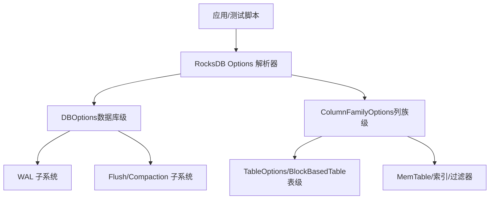
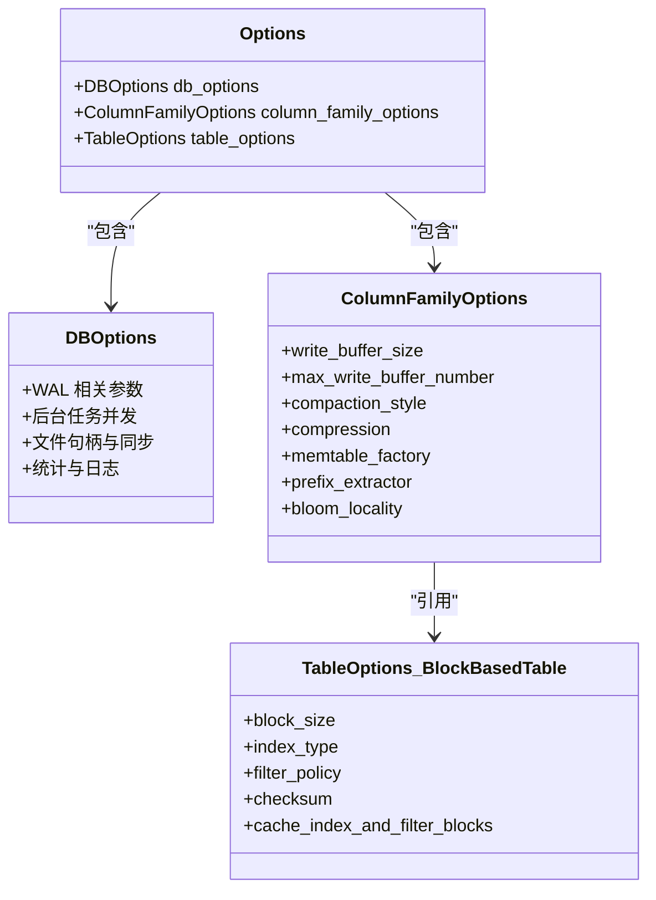
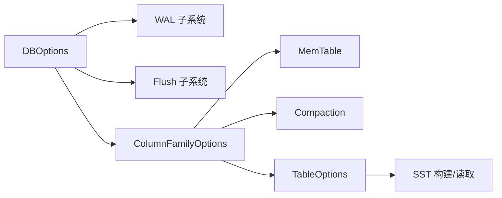

# 配置选项

<cite>
**本文引用的文件**   
- [source/rocksdb/include/rocksdb/options.h](file://source/rocksdb/include/rocksdb/options.h)
- [source/rocksdb/examples/rocksdb_option_file_example.ini](file://source/rocksdb/examples/rocksdb_option_file_example.ini)
</cite>

## 目录
1. [简介](#简介)
2. [项目结构](#项目结构)
3. [核心组件](#核心组件)
4. [架构总览](#架构总览)
5. [详细组件分析](#详细组件分析)
6. [依赖关系分析](#依赖关系分析)
7. [性能考虑](#性能考虑)
8. [故障排查指南](#故障排查指南)
9. [结论](#结论)
10. [附录](#附录)

## 简介
本文件为 metadata_offload 项目的“配置选项”文档，聚焦于 RocksDB 在该项目中的关键配置项与使用方式。内容覆盖：
- 数据库级别（DBOptions）与列族级别（ColumnFamilyOptions/TableOptions）的配置项说明、默认值、取值范围与调优建议
- WAL 相关与 Flush 相关的关键参数
- 配置文件格式与命令行参数使用方法
- 配置优先级与继承关系
- 性能调优策略与常见场景推荐组合
- 配置校验与错误处理机制

说明：metadata_offload 基于 RocksDB 实现，因此本文的配置说明以 RocksDB 的 Options 定义与示例配置文件为依据，确保与实际实现一致。

## 项目结构
与配置相关的核心位置：
- 配置结构体与字段定义：source/rocksdb/include/rocksdb/options.h
- 配置文件示例与 INI 语法说明：source/rocksdb/examples/rocksdb_option_file_example.ini

图表来源 
- [source/rocksdb/include/rocksdb/options.h](file://source/rocksdb/include/rocksdb/options.h)
- [source/rocksdb/examples/rocksdb_option_file_example.ini](file://source/rocksdb/examples/rocksdb_option_file_example.ini)

章节来源
- [source/rocksdb/include/rocksdb/options.h](file://source/rocksdb/include/rocksdb/options.h)
- [source/rocksdb/examples/rocksdb_option_file_example.ini](file://source/rocksdb/examples/rocksdb_option_file_example.ini)

## 核心组件
- DBOptions：控制数据库整体行为，包括日志、WAL、后台任务、文件句柄、同步策略等
- ColumnFamilyOptions：控制列族级别的写入缓冲、压缩、合并、前缀提取、过滤器、MemTable 工厂等
- TableOptions/BlockBasedTable：控制 SST 块大小、索引类型、缓存策略、校验和等
- WAL 子系统：WAL 文件生命周期、大小限制、落盘策略、清理策略
- Flush/Compaction 子系统：内存到磁盘的刷写触发条件、并发度、目标文件大小、层级大小等

章节来源
- [source/rocksdb/include/rocksdb/options.h](file://source/rocksdb/include/rocksdb/options.h)
- [source/rocksdb/examples/rocksdb_option_file_example.ini](file://source/rocksdb/examples/rocksdb_option_file_example.ini)

## 架构总览
下图展示从配置入口到运行时子系统的映射关系，帮助理解各配置项的作用域与影响面。

图表来源 
- [source/rocksdb/include/rocksdb/options.h](file://source/rocksdb/include/rocksdb/options.h)
- [source/rocksdb/examples/rocksdb_option_file_example.ini](file://source/rocksdb/examples/rocksdb_option_file_example.ini)

## 详细组件分析

### 数据库级别选项（DBOptions）
- 作用域：整个数据库实例
- 典型参数类别
  - WAL 管理：WAL 目录、最大 WAL 大小、WAL 滚动与清理、WAL 落盘频率
  - 后台任务：压缩与刷新并发度、子任务数
  - 文件与 I/O：最大打开文件数、直接读写、mmap、预分配、fsync
  - 统计与诊断：统计导出周期、错误恢复策略、线程跟踪
- 默认值与范围：参见示例 INI 中 DBOptions 段；具体默认值由源码定义
- 动态变更：部分参数可通过 SetOptions API 动态调整（如 write_buffer_size 等）
- 建议
  - 高吞吐写入：适当增大 max_total_wal_size 与 max_background_flushes，避免频繁 WAL 滚动
  - 低延迟读：启用 use_direct_reads/use_direct_writes（需文件系统支持），并合理设置 max_open_files
  - 稳定性优先：开启 paranoid_checks，谨慎关闭 fsync

章节来源
- [source/rocksdb/examples/rocksdb_option_file_example.ini:36-78](file://source/rocksdb/examples/rocksdb_option_file_example.ini#L36-L78)
- [source/rocksdb/include/rocksdb/options.h](file://source/rocksdb/include/rocksdb/options.h)

### 列族级别选项（ColumnFamilyOptions）
- 作用域：每个列族独立生效，可针对热点列族单独优化
- 典型参数类别
  - 写入缓冲：write_buffer_size、max_write_buffer_number、min_write_buffer_number_to_merge
  - 压缩与存储：compression、compression_per_level、target_file_size_base/multiplier
  - MemTable：memtable_factory、arena_block_size、inplace_update_support
  - Compaction：compaction_style、level0_* 触发阈值、max_bytes_for_level_*
  - 过滤与前缀：prefix_extractor、bloom_locality、optimize_filters_for_hits
- 默认值与范围：参见示例 INI 中 CFOptions 段；默认值由源码定义
- 建议
  - 点查为主：增大 block_cache 并使用 OptimizeForPointLookup
  - 批量导入：增大 write_buffer_size 与 max_write_buffer_number，减少 compaction 压力
  - 热点键：合理设置 prefix_extractor 与 bloom_locality，提升前缀扫描效率

章节来源
- [source/rocksdb/examples/rocksdb_option_file_example.ini:81-127](file://source/rocksdb/examples/rocksdb_option_file_example.ini#L81-L127)
- [source/rocksdb/include/rocksdb/options.h](file://source/rocksdb/include/rocksdb/options.h)

### 表级选项（TableOptions/BlockBasedTable）
- 作用域：SST 表构建与读取
- 典型参数类别
  - 块大小：block_size、block_restart_interval
  - 索引与过滤：index_type、filter_policy、whole_key_filtering
  - 缓存：no_block_cache、cache_index_and_filter_blocks、pin_l0_filter_and_index_blocks_in_cache
  - 校验：checksum
- 默认值与范围：参见示例 INI 中 TableOptions/BlockBasedTable 段
- 建议
  - 随机读多：增大 block_size 与 cache_index_and_filter_blocks
  - 空间敏感：选择更激进的 compression 与较小的 block_size

章节来源
- [source/rocksdb/examples/rocksdb_option_file_example.ini:128-142](file://source/rocksdb/examples/rocksdb_option_file_example.ini#L128-L142)
- [source/rocksdb/include/rocksdb/options.h](file://source/rocksdb/include/rocksdb/options.h)

### WAL 相关选项
- 关键参数
  - wal_dir：WAL 目录路径
  - max_total_wal_size：WAL 总大小上限
  - WAL_ttl_seconds / WAL_size_limit_MB：WAL 生存时间与大小限制
  - wal_bytes_per_sync：WAL 落盘粒度
  - max_log_file_size：单 WAL 文件大小
  - recycle_log_file_num：WAL 文件回收数量
- 行为说明
  - WAL 用于持久化未刷写的写入，过大或过小都会影响吞吐与恢复时间
  - 配合 flush/compaction 策略，避免 WAL 堆积导致磁盘增长
- 建议
  - 高吞吐：增大 max_total_wal_size，降低 wal_bytes_per_sync 以提升吞吐
  - 快速恢复：保持合理的 WAL 数量与大小，避免过长恢复时间

章节来源
- [source/rocksdb/examples/rocksdb_option_file_example.ini:36-78](file://source/rocksdb/examples/rocksdb_option_file_example.ini#L36-L78)
- [source/rocksdb/include/rocksdb/options.h](file://source/rocksdb/include/rocksdb/options.h)

### Flush 相关选项
- 关键参数
  - write_buffer_size：单个 MemTable 大小
  - max_write_buffer_number：同时驻留内存的 MemTable 数量
  - level0_stop_writes_trigger / level0_slowdown_writes_trigger：L0 触发停止/降速
  - target_file_size_base / max_bytes_for_level_base：层级目标大小
- 行为说明
  - 当 MemTable 达到阈值时触发 flush 到 L0；L0 文件过多会触发 compaction
- 建议
  - 写入密集：增大 write_buffer_size 与 max_write_buffer_number，提高吞吐
  - 读放大敏感：降低 L0 触发阈值，尽早触发 compaction

章节来源
- [source/rocksdb/examples/rocksdb_option_file_example.ini:81-127](file://source/rocksdb/examples/rocksdb_option_file_example.ini#L81-L127)
- [source/rocksdb/include/rocksdb/options.h](file://source/rocksdb/include/rocksdb/options.h)

### 配置优先级与继承关系
- 优先级顺序（从高到低）
  1. 程序内通过 API 设置的选项（SetOptions）
  2. 命令行传入的参数
  3. 配置文件（INI）中的对应段
  4. 源码默认值
- 继承关系
  - ColumnFamilyOptions 可继承 DBOptions 的部分全局设置
  - TableOptions/BlockBasedTable 受 ColumnFamilyOptions 与 DBOptions 共同影响
- 动态变更
  - 部分 DBOptions 与 ColumnFamilyOptions 支持运行时修改（例如 write_buffer_size）

章节来源
- [source/rocksdb/examples/rocksdb_option_file_example.ini](file://source/rocksdb/examples/rocksdb_option_file_example.ini)
- [source/rocksdb/include/rocksdb/options.h](file://source/rocksdb/include/rocksdb/options.h)

### 配置文件格式与命令行参数使用方法
- 配置文件格式（INI）
  - 基本语法：option_name = value
  - 注释：# 开头
  - 列表：冒号分隔（如 n1:n2:n3）
  - 分段：[Version]、[DBOptions]、[CFOptions "name"]、[TableOptions/BlockBasedTable "name"]
- 命令行参数
  - 通常通过 --options_file=xxx.ini 指定配置文件路径
  - 也可通过 --db.<key>=<value> 与 --cf.<column_family>.<key>=<value> 覆盖特定选项
- 注意事项
  - 同一 key 在不同段的重复定义遵循优先级规则
  - 列表型参数需严格遵循冒号分隔与顺序

章节来源
- [source/rocksdb/examples/rocksdb_option_file_example.ini:1-35](file://source/rocksdb/examples/rocksdb_option_file_example.ini#L1-L35)
- [source/rocksdb/examples/rocksdb_option_file_example.ini:36-142](file://source/rocksdb/examples/rocksdb_option_file_example.ini#L36-L142)

### 不同使用场景下的推荐配置组合
- 高吞吐写入（批量导入）
  - DBOptions：增大 max_total_wal_size、max_background_flushes；use_direct_writes=true（若支持）
  - ColumnFamilyOptions：增大 write_buffer_size、max_write_buffer_number；disable_auto_compactions=true（导入后手动触发）
  - TableOptions：适度增大 block_size；选择较高压缩比
- 低延迟点查
  - ColumnFamilyOptions：OptimizeForPointLookup(block_cache_size_mb)；启用 bloom 过滤
  - TableOptions：cache_index_and_filter_blocks=true；pin_top_level_index_and_filter=false（视内存情况）
- 混合负载（读写均衡）
  - DBOptions：平衡 max_background_compactions 与 max_background_flushes
  - ColumnFamilyOptions：合理设置 level0_* 触发阈值；启用 inplace_update_support（更新热点键）
  - TableOptions：根据数据分布选择 filter_policy 与 index_type

章节来源
- [source/rocksdb/include/rocksdb/options.h](file://source/rocksdb/include/rocksdb/options.h)
- [source/rocksdb/examples/rocksdb_option_file_example.ini](file://source/rocksdb/examples/rocksdb_option_file_example.ini)

### 配置验证与错误处理机制
- 验证要点
  - 检查必填参数是否缺失（如 create_if_missing、comparator）
  - 数值范围校验（如 max_open_files、max_total_wal_size）
  - 兼容性检查（如 comparator/merge_operator 与历史版本一致性）
- 错误处理
  - 启动失败：回滚到上一有效配置或抛出明确错误信息
  - 运行时异常：记录详细日志，必要时降级（如关闭某些特性）
- 建议
  - 在 CI/CD 中加入配置校验脚本，提前发现非法配置
  - 对关键参数设置告警阈值（如 WAL 增长过快、flush 延迟升高）

章节来源
- [source/rocksdb/include/rocksdb/options.h](file://source/rocksdb/include/rocksdb/options.h)
- [source/rocksdb/examples/rocksdb_option_file_example.ini](file://source/rocksdb/examples/rocksdb_option_file_example.ini)

## 依赖关系分析
- 组件耦合
  - DBOptions 影响 WAL 与后台任务，间接影响 ColumnFamilyOptions 的 flush/compaction 行为
  - ColumnFamilyOptions 决定 MemTable 与 SST 构建策略，进而影响 TableOptions 的效果
- 外部依赖
  - 文件系统能力（direct I/O、mmap、预分配）
  - 硬件资源（CPU、内存、磁盘带宽）
- 潜在循环依赖
  - 配置间相互影响（如 write_buffer_size 与 max_write_buffer_number 共同决定内存占用）

图表来源 
- [source/rocksdb/include/rocksdb/options.h](file://source/rocksdb/include/rocksdb/options.h)
- [source/rocksdb/examples/rocksdb_option_file_example.ini](file://source/rocksdb/examples/rocksdb_option_file_example.ini)

章节来源
- [source/rocksdb/include/rocksdb/options.h](file://source/rocksdb/include/rocksdb/options.h)
- [source/rocksdb/examples/rocksdb_option_file_example.ini](file://source/rocksdb/examples/rocksdb_option_file_example.ini)

## 性能考虑
- 内存与缓存
  - 合理设置 block_cache、index/filter 缓存，避免频繁换页
  - 监控 MemTable 内存占用，防止 OOM
- I/O 与磁盘
  - 使用 SSD/NVMe 时启用 direct I/O；HDD 上谨慎使用 mmap
  - 控制 WAL 与 SST 的落盘频率，避免抖动
- 压缩与 CPU
  - 压缩算法选择需在 CPU 与空间之间权衡
  - 后台压缩并发度与 IO 带宽匹配
- 监控指标
  - WAL 大小与滚动频率
  - Flush/Compaction 耗时与队列长度
  - 读放大与写放大

## 故障排查指南
- 常见问题
  - WAL 快速增长：检查 max_total_wal_size 与 flush/compaction 策略
  - 写入停顿：关注 level0_stop_writes_trigger 与后台任务并发
  - 读延迟升高：检查缓存命中率与过滤器有效性
- 定位方法
  - 启用统计导出（stats_dump_period_sec）与详细日志
  - 使用 RocksDB 工具（如 db_bench、monitoring 接口）采集指标
- 修复建议
  - 调整触发阈值与并发度
  - 分批次导入，避免一次性大事务
  - 定期手动触发 compaction，释放空间

章节来源
- [source/rocksdb/examples/rocksdb_option_file_example.ini](file://source/rocksdb/examples/rocksdb_option_file_example.ini)
- [source/rocksdb/include/rocksdb/options.h](file://source/rocksdb/include/rocksdb/options.h)

## 结论
metadata_offload 基于 RocksDB 的配置体系提供了丰富的可调参数。通过合理组织 DBOptions、ColumnFamilyOptions 与 TableOptions，并结合 WAL 与 Flush 策略，可在不同场景下取得良好的性能与稳定性。建议在上线前进行充分的配置校验与压测，持续监控关键指标并迭代优化。

## 附录
- 常用命令参考
  - 指定配置文件：--options_file=xxx.ini
  - 覆盖 DB 选项：--db.key=value
  - 覆盖列族选项：--cf.cf_name.key=value
- 参考文件
  - 配置结构定义：source/rocksdb/include/rocksdb/options.h
  - 配置文件示例：source/rocksdb/examples/rocksdb_option_file_example.ini