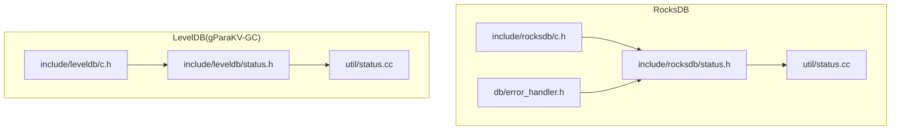
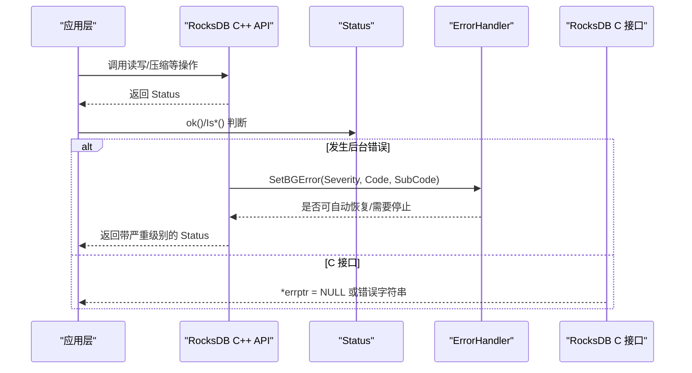
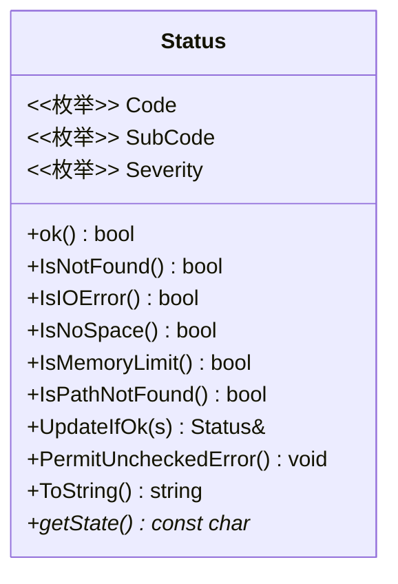
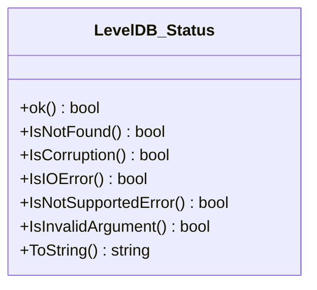
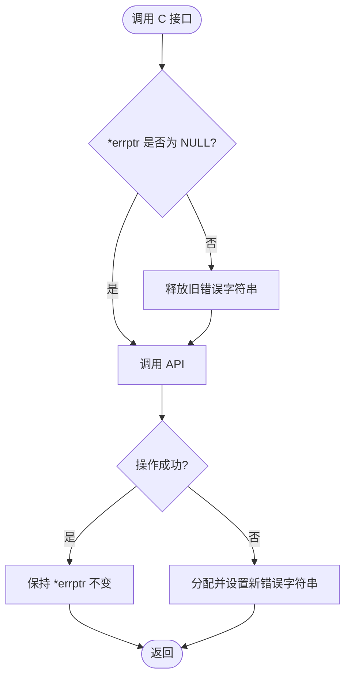
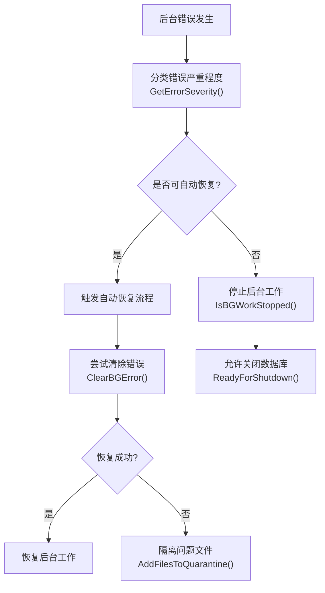
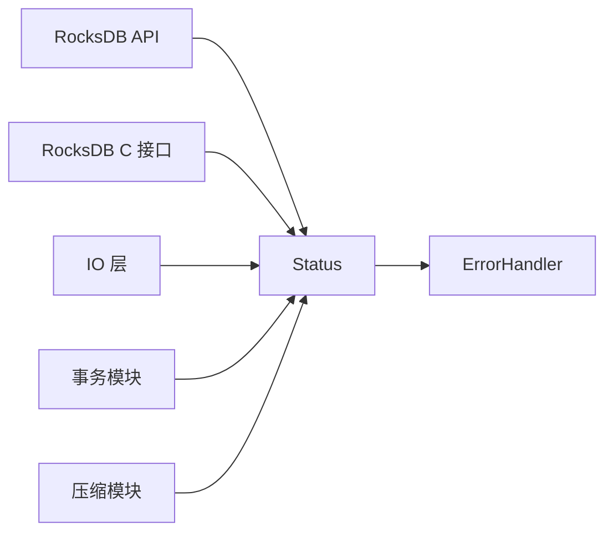

# 错误处理

<cite>
**本文引用的文件**   
- [source/rocksdb/include/rocksdb/status.h](file://source/rocksdb/include/rocksdb/status.h)
- [source/rocksdb/util/status.cc](file://source/rocksdb/util/status.cc)
- [source/gParaKV-GC-master/include/leveldb/status.h](file://source/gParaKV-GC-master/include/leveldb/status.h)
- [source/gParaKV-GC-master/util/status.cc](file://source/gParaKV-GC-master/util/status.cc)
- [source/rocksdb/include/rocksdb/c.h](file://source/rocksdb/include/rocksdb/c.h)
- [source/gParaKV-GC-master/include/leveldb/c.h](file://source/gParaKV-GC-master/include/leveldb/c.h)
- [source/rocksdb/db/error_handler.h](file://source/rocksdb/db/error_handler.h)
</cite>

## 目录
1. [引言](#引言)
2. [项目结构](#项目结构)
3. [核心组件](#核心组件)
4. [架构总览](#架构总览)
5. [详细组件分析](#详细组件分析)
6. [依赖关系分析](#依赖关系分析)
7. [性能考虑](#性能考虑)
8. [故障排查指南](#故障排查指南)
9. [结论](#结论)
10. [附录](#附录)

## 引言
本文件为 metadata_offload 项目的错误处理文档，聚焦于 Status 类的使用与扩展、错误类型与处理策略、异常恢复与重试机制、C/C++ 接口差异、日志记录与调试方法，以及常见错误的排查与解决方案。目标是帮助开发者在 RocksDB 与 LevelDB（gParaKV-GC）两套实现中建立一致、可靠、可维护的错误处理规范。

## 项目结构
围绕错误处理的关键代码主要分布在以下位置：
- RocksDB C++ 接口：Status 定义与实现、IO 状态、错误处理器
- LevelDB（gParaKV-GC）C++ 接口：简化版 Status 定义与实现
- C 绑定接口：errptr 模式返回错误字符串

**图示来源** 
- [source/rocksdb/include/rocksdb/status.h:35-560](file://source/rocksdb/include/rocksdb/status.h#L35-L560)
- [source/rocksdb/util/status.cc:22-164](file://source/rocksdb/util/status.cc#L22-L164)
- [source/rocksdb/include/rocksdb/c.h:30-43](file://source/rocksdb/include/rocksdb/c.h#L30-L43)
- [source/rocksdb/db/error_handler.h:34-163](file://source/rocksdb/db/error_handler.h#L34-L163)
- [source/gParaKV-GC-master/include/leveldb/status.h:24-101](file://source/gParaKV-GC-master/include/leveldb/status.h#L24-L101)
- [source/gParaKV-GC-master/util/status.cc:13-75](file://source/gParaKV-GC-master/util/status.cc#L13-L75)
- [source/gParaKV-GC-master/include/leveldb/c.h:24-38](file://source/gParaKV-GC-master/include/leveldb/c.h#L24-L38)

**章节来源**
- [source/rocksdb/include/rocksdb/status.h:35-560](file://source/rocksdb/include/rocksdb/status.h#L35-L560)
- [source/rocksdb/util/status.cc:22-164](file://source/rocksdb/util/status.cc#L22-L164)
- [source/gParaKV-GC-master/include/leveldb/status.h:24-101](file://source/gParaKV-GC-master/include/leveldb/status.h#L24-L101)
- [source/gParaKV-GC-master/util/status.cc:13-75](file://source/gParaKV-GC-master/util/status.cc#L13-L75)
- [source/rocksdb/include/rocksdb/c.h:30-43](file://source/rocksdb/include/rocksdb/c.h#L30-L43)
- [source/gParaKV-GC-master/include/leveldb/c.h:24-38](file://source/gParaKV-GC-master/include/leveldb/c.h#L24-L38)
- [source/rocksdb/db/error_handler.h:34-163](file://source/rocksdb/db/error_handler.h#L34-L163)

## 核心组件
- RocksDB Status 类：提供丰富的错误码、子码、严重级别、消息拼接、检查标记、更新合并等能力，覆盖 IO、内存、锁、事务、压缩等场景。
- LevelDB（gParaKV-GC）Status 类：精简版，仅包含基本错误码与 ToString 输出，适合轻量使用。
- C 接口错误约定：通过 char** errptr 返回错误字符串，NULL 表示无错；成功不修改 errptr，失败释放旧值并设置新值。
- RocksDB ErrorHandler：后台错误管理、自动恢复、软/硬错误判定、隔离文件、重试 IO 错误等。

**章节来源**
- [source/rocksdb/include/rocksdb/status.h:75-122](file://source/rocksdb/include/rocksdb/status.h#L75-L122)
- [source/rocksdb/include/rocksdb/status.h:129-136](file://source/rocksdb/include/rocksdb/status.h#L129-L136)
- [source/rocksdb/include/rocksdb/status.h:194-326](file://source/rocksdb/include/rocksdb/status.h#L194-L326)
- [source/rocksdb/include/rocksdb/status.h:329-512](file://source/rocksdb/include/rocksdb/status.h#L329-L512)
- [source/gParaKV-GC-master/include/leveldb/status.h:79-86](file://source/gParaKV-GC-master/include/leveldb/status.h#L79-L86)
- [source/rocksdb/include/rocksdb/c.h:30-43](file://source/rocksdb/include/rocksdb/c.h#L30-L43)
- [source/gParaKV-GC-master/include/leveldb/c.h:24-38](file://source/gParaKV-GC-master/include/leveldb/c.h#L24-L38)
- [source/rocksdb/db/error_handler.h:34-163](file://source/rocksdb/db/error_handler.h#L34-L163)

## 架构总览
下图展示了 RocksDB 错误处理的调用链与关键组件交互：上层 API 返回 Status，业务层根据 Is* 判断分支；后台错误由 ErrorHandler 统一管理与恢复；C 接口通过 errptr 传递错误信息。

**图示来源** 
- [source/rocksdb/include/rocksdb/status.h:329-512](file://source/rocksdb/include/rocksdb/status.h#L329-L512)
- [source/rocksdb/db/error_handler.h:57-95](file://source/rocksdb/db/error_handler.h#L57-L95)
- [source/rocksdb/include/rocksdb/c.h:30-43](file://source/rocksdb/include/rocksdb/c.h#L30-L43)

## 详细组件分析

### RocksDB Status 类详解
- 错误码（Code）：包括 NotFound、Corruption、NotSupported、InvalidArgument、IOError、MergeInProgress、Incomplete、ShutdownInProgress、TimedOut、Aborted、Busy、Expired、TryAgain、CompactionTooLarge、ColumnFamilyDropped 等。
- 子码（SubCode）：细化具体原因，如 NoSpace、MemoryLimit、PathNotFound、LockTimeout、Deadlock、IOFenced、PrefetchLimitReached 等。
- 严重级别（Severity）：NoError、SoftError、HardError、FatalError、UnrecoverableError。
- 常用方法：
  - ok()/AssertOK()：快速判断成功
  - Is*()：按错误类型判断
  - UpdateIfOk()：左优先的合并更新
  - PermitUncheckedError()/MustCheck()：配合编译期检查避免吞掉错误
  - ToString()/getState()：获取可读消息
- 特殊构造器：NoSpace/MemoryLimit/SpaceLimit/PathNotFound/TxnNotPrepared/LockLimit/PrefetchLimitReached 等便捷工厂方法。

**图示来源** 
- [source/rocksdb/include/rocksdb/status.h:75-122](file://source/rocksdb/include/rocksdb/status.h#L75-L122)
- [source/rocksdb/include/rocksdb/status.h:129-136](file://source/rocksdb/include/rocksdb/status.h#L129-L136)
- [source/rocksdb/include/rocksdb/status.h:194-326](file://source/rocksdb/include/rocksdb/status.h#L194-L326)
- [source/rocksdb/include/rocksdb/status.h:329-512](file://source/rocksdb/include/rocksdb/status.h#L329-L512)

**章节来源**
- [source/rocksdb/include/rocksdb/status.h:75-122](file://source/rocksdb/include/rocksdb/status.h#L75-L122)
- [source/rocksdb/include/rocksdb/status.h:129-136](file://source/rocksdb/include/rocksdb/status.h#L129-L136)
- [source/rocksdb/include/rocksdb/status.h:194-326](file://source/rocksdb/include/rocksdb/status.h#L194-L326)
- [source/rocksdb/include/rocksdb/status.h:329-512](file://source/rocksdb/include/rocksdb/status.h#L329-L512)

### LevelDB（gParaKV-GC）Status 类对比
- 错误码较少：kOk、kNotFound、kCorruption、kNotSupported、kInvalidArgument、kIOError。
- 方法简洁：ok()、IsNotFound()/IsCorruption()/IsIOError()/IsNotSupportedError()/IsInvalidArgument()、ToString()。
- 适用场景：轻量级存储库或历史兼容模块。

**图示来源** 
- [source/gParaKV-GC-master/include/leveldb/status.h:79-86](file://source/gParaKV-GC-master/include/leveldb/status.h#L79-L86)
- [source/gParaKV-GC-master/include/leveldb/status.h:57-76](file://source/gParaKV-GC-master/include/leveldb/status.h#L57-L76)

**章节来源**
- [source/gParaKV-GC-master/include/leveldb/status.h:79-86](file://source/gParaKV-GC-master/include/leveldb/status.h#L79-L86)
- [source/gParaKV-GC-master/include/leveldb/status.h:57-76](file://source/gParaKV-GC-master/include/leveldb/status.h#L57-L76)

### C 接口错误处理约定
- RocksDB C 接口：所有可能失败的函数以 char** errptr 结尾参数返回错误字符串；成功时保持原值不变，失败时释放旧值并设置新值。
- LevelDB C 接口：同样采用 errptr 约定，便于跨语言调用与 JNI。

**图示来源** 
- [source/rocksdb/include/rocksdb/c.h:30-43](file://source/rocksdb/include/rocksdb/c.h#L30-L43)
- [source/gParaKV-GC-master/include/leveldb/c.h:24-38](file://source/gParaKV-GC-master/include/leveldb/c.h#L24-L38)

**章节来源**
- [source/rocksdb/include/rocksdb/c.h:30-43](file://source/rocksdb/include/rocksdb/c.h#L30-L43)
- [source/gParaKV-GC-master/include/leveldb/c.h:24-38](file://source/gParaKV-GC-master/include/leveldb/c.h#L24-L38)

### 后台错误与恢复（ErrorHandler）
- 功能要点：
  - 记录后台错误（bg_error_）与恢复过程中的错误（recovery_error_）
  - 判定是否停止后台工作（IsBGWorkStopped）
  - 支持自动恢复（EnableAutoRecovery）
  - 清理后台错误（ClearBGError）
  - 针对“无空间”等特定错误进行自动恢复与文件隔离
  - 支持从可重试 IO 错误中恢复（StartRecoverFromRetryableBGIOError/RecoverFromRetryableBGIOError）

**图示来源** 
- [source/rocksdb/db/error_handler.h:57-95](file://source/rocksdb/db/error_handler.h#L57-L95)
- [source/rocksdb/db/error_handler.h:100-163](file://source/rocksdb/db/error_handler.h#L100-L163)

**章节来源**
- [source/rocksdb/db/error_handler.h:34-163](file://source/rocksdb/db/error_handler.h#L34-L163)

### 错误处理最佳实践与示例路径
- 使用 Status::ok()/Is*() 进行分支控制，避免忽略错误
- 使用 PermitUncheckedError() 显式声明“有意忽略”的错误点，便于搜索定位
- 使用 UpdateIfOk() 组合多个操作的错误，保留最左侧非 OK 的详细信息
- 对 IO 错误区分 IsIOError()/IsNoSpace()/IsPathNotFound()/IsIOFenced() 等子码，采取不同策略（重试、扩容、路径修复、回退）
- 对内存限制错误 IsMemoryLimit() 进行批大小调整或延迟提交
- 对 TryAgain/Busy 错误实施指数退避重试，结合最大重试次数与超时控制
- 在 C 接口中始终检查 *errptr，并在失败后及时释放

参考实现路径（不包含代码内容）：
- RocksDB Status 用法与工厂方法：[source/rocksdb/include/rocksdb/status.h:194-326](file://source/rocksdb/include/rocksdb/status.h#L194-L326)
- ToString 输出与子码映射：[source/rocksdb/util/status.cc:84-164](file://source/rocksdb/util/status.cc#L84-L164)
- LevelDB Status 用法：[source/gParaKV-GC-master/include/leveldb/status.h:57-76](file://source/gParaKV-GC-master/include/leveldb/status.h#L57-L76)
- C 接口错误约定：[source/rocksdb/include/rocksdb/c.h:30-43](file://source/rocksdb/include/rocksdb/c.h#L30-L43)、[source/gParaKV-GC-master/include/leveldb/c.h:24-38](file://source/gParaKV-GC-master/include/leveldb/c.h#L24-L38)
- 后台错误恢复流程：[source/rocksdb/db/error_handler.h:57-95](file://source/rocksdb/db/error_handler.h#L57-L95)、[source/rocksdb/db/error_handler.h:100-163](file://source/rocksdb/db/error_handler.h#L100-L163)

**章节来源**
- [source/rocksdb/include/rocksdb/status.h:194-326](file://source/rocksdb/include/rocksdb/status.h#L194-L326)
- [source/rocksdb/util/status.cc:84-164](file://source/rocksdb/util/status.cc#L84-L164)
- [source/gParaKV-GC-master/include/leveldb/status.h:57-76](file://source/gParaKV-GC-master/include/leveldb/status.h#L57-L76)
- [source/rocksdb/include/rocksdb/c.h:30-43](file://source/rocksdb/include/rocksdb/c.h#L30-L43)
- [source/gParaKV-GC-master/include/leveldb/c.h:24-38](file://source/gParaKV-GC-master/include/leveldb/c.h#L24-L38)
- [source/rocksdb/db/error_handler.h:57-95](file://source/rocksdb/db/error_handler.h#L57-L95)
- [source/rocksdb/db/error_handler.h:100-163](file://source/rocksdb/db/error_handler.h#L100-L163)

## 依赖关系分析
- RocksDB Status 被 DBImpl、IO 层、压缩、事务等广泛使用，作为统一的错误载体
- ErrorHandler 依赖 Status 的严重级别与错误码，驱动后台恢复逻辑
- C 接口与 C++ 接口通过 errptr 与 Status 桥接，保证跨语言一致性

**图示来源** 
- [source/rocksdb/include/rocksdb/status.h:35-560](file://source/rocksdb/include/rocksdb/status.h#L35-L560)
- [source/rocksdb/db/error_handler.h:34-163](file://source/rocksdb/db/error_handler.h#L34-L163)
- [source/rocksdb/include/rocksdb/c.h:30-43](file://source/rocksdb/include/rocksdb/c.h#L30-L43)

**章节来源**
- [source/rocksdb/include/rocksdb/status.h:35-560](file://source/rocksdb/include/rocksdb/status.h#L35-L560)
- [source/rocksdb/db/error_handler.h:34-163](file://source/rocksdb/db/error_handler.h#L34-L163)
- [source/rocksdb/include/rocksdb/c.h:30-43](file://source/rocksdb/include/rocksdb/c.h#L30-L43)

## 性能考虑
- Status 的 MarkChecked 与 checked_ 标志在调试模式下启用，用于确保错误被检查，避免静默失败
- ToString() 会生成可读字符串，频繁调用可能带来开销，建议在日志与诊断路径中使用
- UpdateIfOk() 避免多次分配与拷贝，提升错误合并效率
- ErrorHandler 的自动恢复与后台工作停止判定需权衡吞吐与稳定性

**章节来源**
- [source/rocksdb/include/rocksdb/status.h:47-54](file://source/rocksdb/include/rocksdb/status.h#L47-L54)
- [source/rocksdb/util/status.cc:84-164](file://source/rocksdb/util/status.cc#L84-L164)
- [source/rocksdb/db/error_handler.h:75-95](file://source/rocksdb/db/error_handler.h#L75-L95)

## 故障排查指南
- 常见错误类型与策略
  - IO 错误（IsIOError）：检查磁盘健康、权限、路径有效性；对 IsNoSpace() 执行清理或扩容；对 IsPathNotFound() 校验路径创建；对 IsIOFenced() 检查外部隔离机制
  - 内存不足（IsMemoryLimit）：降低写批大小、增加内存预算、延迟提交
  - 锁冲突/死锁（IsBusy/IsDeadlock）：引入退避重试、优化锁粒度
  - 事务未准备（IsTxnNotPrepared）：确保事务生命周期正确
  - 压缩过大（IsCompactionTooLarge）：调整 compaction 参数或分批处理
  - 过期/超时（IsExpired/IsTimedOut）：延长超时或重试
- 恢复与重试
  - 使用 TryAgain/Busy 错误进行指数退避重试，设置最大重试次数与超时
  - 利用 ErrorHandler 的自动恢复能力，必要时手动调用 ClearBGError()
- 日志与调试
  - 使用 ToString() 输出完整错误信息，结合严重级别与子码
  - 在关键路径添加 PermitUncheckedError() 明确“有意忽略”，便于审计
  - 在 C 接口中打印 *errptr 的内容，确认错误来源

**章节来源**
- [source/rocksdb/include/rocksdb/status.h:329-512](file://source/rocksdb/include/rocksdb/status.h#L329-L512)
- [source/rocksdb/util/status.cc:84-164](file://source/rocksdb/util/status.cc#L84-L164)
- [source/rocksdb/db/error_handler.h:57-95](file://source/rocksdb/db/error_handler.h#L57-L95)

## 结论
metadata_offload 项目在 RocksDB 与 LevelDB 两套实现中提供了完善的错误处理机制。通过 Status 类的丰富语义、ErrorHandler 的后台恢复、C 接口的统一约定，开发者可以构建健壮、可观测、可恢复的系统。建议在实际工程中遵循本文的最佳实践，确保错误处理的一致性与可靠性。

## 附录
- 术语表
  - Status：操作结果封装，包含错误码、子码、严重级别与消息
  - SubCode：错误细分原因，如 NoSpace、MemoryLimit、PathNotFound
  - Severity：错误严重级别，影响后台工作与恢复策略
  - ErrorHandler：后台错误管理与自动恢复组件
- 参考路径
  - RocksDB Status 定义与实现：[source/rocksdb/include/rocksdb/status.h](file://source/rocksdb/include/rocksdb/status.h)、[source/rocksdb/util/status.cc](file://source/rocksdb/util/status.cc)
  - LevelDB Status 定义与实现：[source/gParaKV-GC-master/include/leveldb/status.h](file://source/gParaKV-GC-master/include/leveldb/status.h)、[source/gParaKV-GC-master/util/status.cc](file://source/gParaKV-GC-master/util/status.cc)
  - C 接口错误约定：[source/rocksdb/include/rocksdb/c.h](file://source/rocksdb/include/rocksdb/c.h)、[source/gParaKV-GC-master/include/leveldb/c.h](file://source/gParaKV-GC-master/include/leveldb/c.h)
  - 后台错误恢复：[source/rocksdb/db/error_handler.h](file://source/rocksdb/db/error_handler.h)