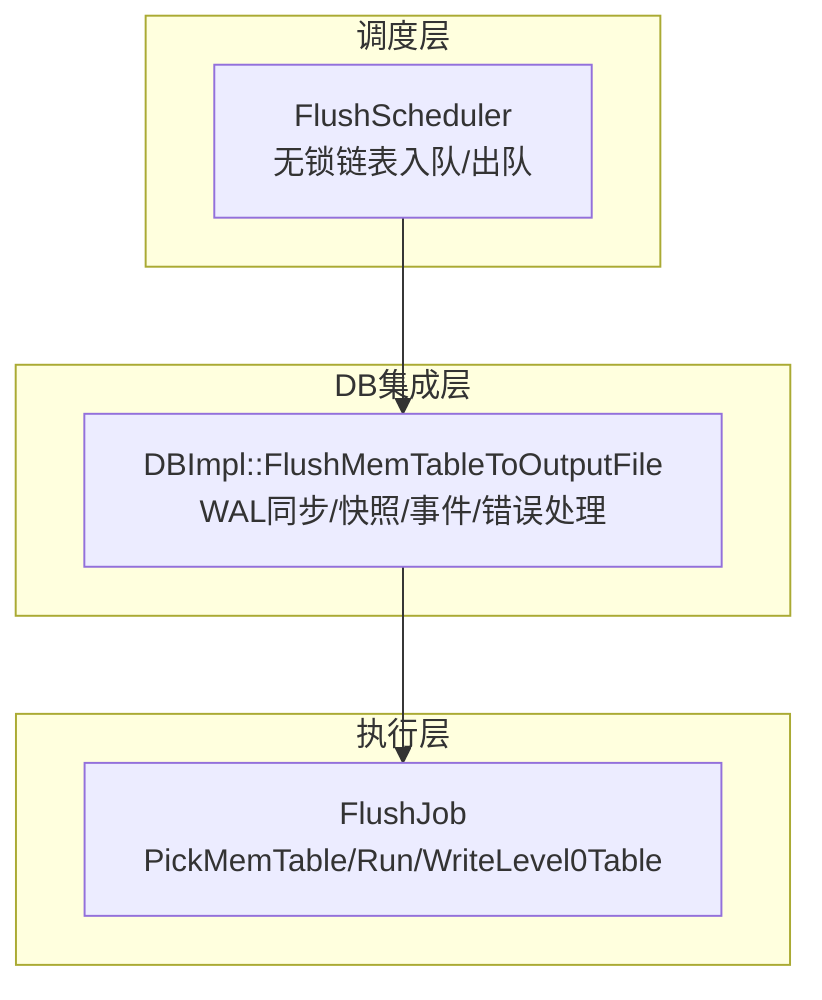
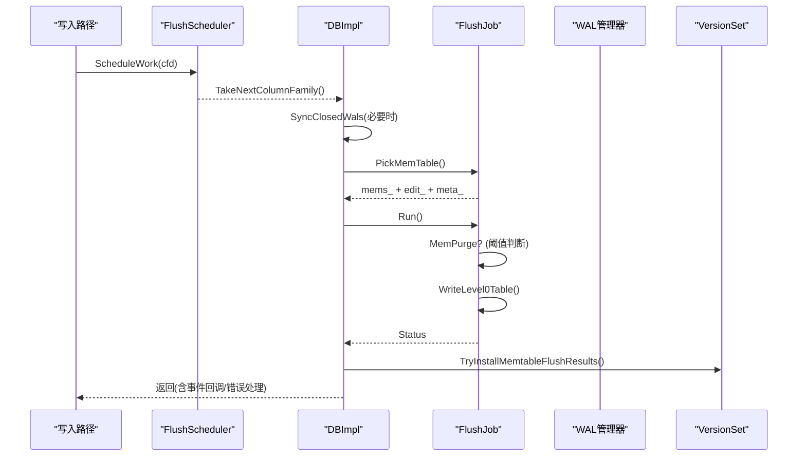
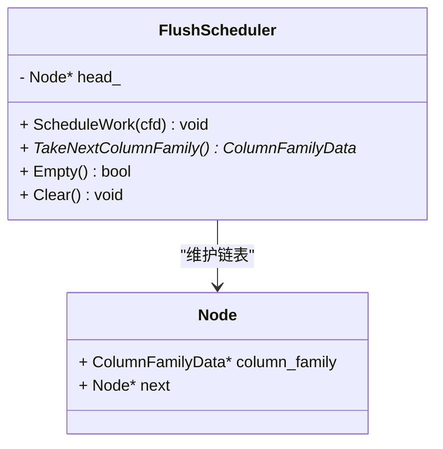
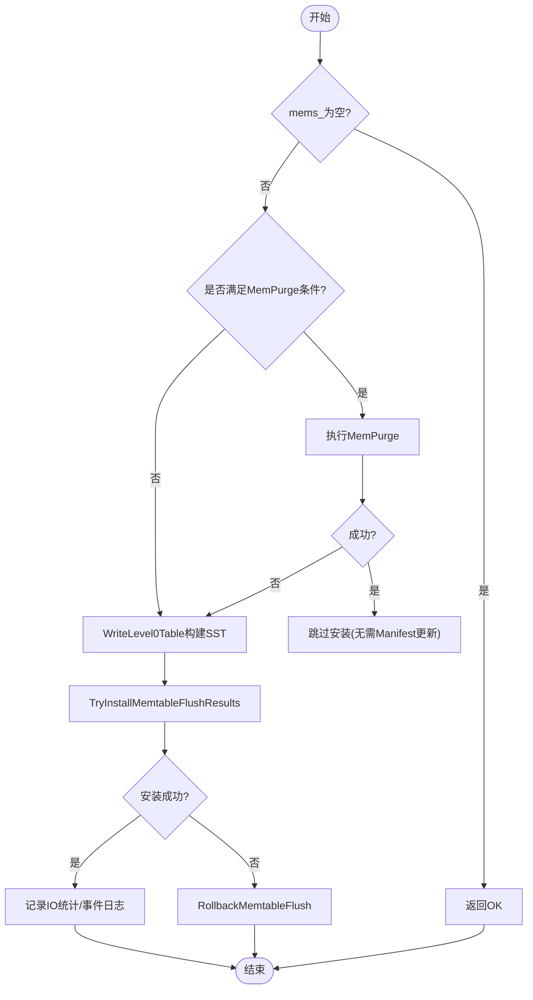
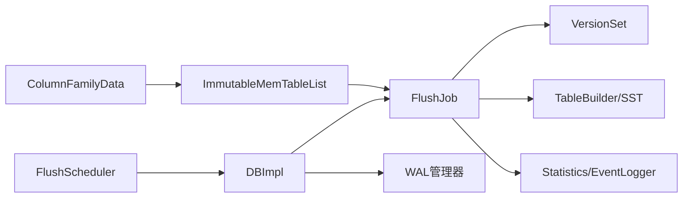

# Flush操作优化

<cite>
**本文引用的文件**   
- [flush_job.h](file://source/rocksdb/db/flush_job.h)
- [flush_job.cc](file://source/rocksdb/db/flush_job.cc)
- [flush_scheduler.h](file://source/rocksdb/db/flush_scheduler.h)
- [flush_scheduler.cc](file://source/rocksdb/db/flush_scheduler.cc)
- [db_impl_compaction_flush.cc](file://source/rocksdb/db/db_impl/db_impl_compaction_flush.cc)
- [c.cc](file://source/rocksdb/db/c.cc)
- [column_family.cc](file://source/rocksdb/db/column_family.cc)
</cite>

## 目录
1. [简介](#简介)
2. [项目结构](#项目结构)
3. [核心组件](#核心组件)
4. [架构总览](#架构总览)
5. [详细组件分析](#详细组件分析)
6. [依赖关系分析](#依赖关系分析)
7. [性能考量](#性能考量)
8. [故障排查指南](#故障排查指南)
9. [结论](#结论)
10. [附录](#附录)

## 简介
本文件围绕RocksDB的Flush（刷写）机制展开，重点阐述Flush调度算法、内存表选择策略、批量写入优化、作业调度与I/O统计收集、性能监控，以及与WAL管理、Compaction协作关系。内容基于代码库中的实际实现进行提炼，既适合初学者理解整体流程，也为有经验的开发者提供深入的技术细节与优化建议。

## 项目结构
与Flush相关的核心代码集中在以下模块：
- 调度器：负责将需要刷写的列族加入队列，供后台线程消费
- 作业执行：封装一次Flush作业的完整生命周期，包括选择内存表、构建SST、安装结果、统计上报等
- DB层集成：在DBImpl中协调WAL同步、快照一致性、事件回调、错误处理等

图表来源
- [flush_scheduler.h:1-56](file://source/rocksdb/db/flush_scheduler.h#L1-L56)
- [flush_scheduler.cc:1-87](file://source/rocksdb/db/flush_scheduler.cc#L1-L87)
- [flush_job.h:1-276](file://source/rocksdb/db/flush_job.h#L1-L276)
- [db_impl_compaction_flush.cc:147-300](file://source/rocksdb/db/db_impl/db_impl_compaction_flush.cc#L147-L300)

章节来源
- [flush_scheduler.h:1-56](file://source/rocksdb/db/flush_scheduler.h#L1-L56)
- [flush_scheduler.cc:1-87](file://source/rocksdb/db/flush_scheduler.cc#L1-L87)
- [flush_job.h:1-276](file://source/rocksdb/db/flush_job.h#L1-L276)
- [db_impl_compaction_flush.cc:147-300](file://source/rocksdb/db/db_impl/db_impl_compaction_flush.cc#L147-L300)

## 核心组件
- FlushScheduler：轻量级无锁调度器，维护待刷写ColumnFamilyData的原子头指针链表，支持并发ScheduleWork与TakeNextColumnFamily。
- FlushJob：封装一次Flush作业，负责选择内存表、可选的MemPurge、构建L0 SST、安装结果到VersionSet、记录IO统计与事件日志。
- DBImpl集成：在FlushMemTableToOutputFile中完成WAL同步、快照一致性保护、事件回调、错误处理与回滚逻辑。

章节来源
- [flush_scheduler.h:1-56](file://source/rocksdb/db/flush_scheduler.h#L1-L56)
- [flush_scheduler.cc:1-87](file://source/rocksdb/db/flush_scheduler.cc#L1-L87)
- [flush_job.h:1-276](file://source/rocksdb/db/flush_job.h#L1-L276)
- [flush_job.cc:1-200](file://source/rocksdb/db/flush_job.cc#L1-L200)
- [db_impl_compaction_flush.cc:147-300](file://source/rocksdb/db/db_impl/db_impl_compaction_flush.cc#L147-L300)

## 架构总览
下图展示了从调度到执行的端到端流程，以及WAL与快照的一致性保障点。

图表来源
- [flush_scheduler.cc:14-34](file://source/rocksdb/db/flush_scheduler.cc#L14-L34)
- [db_impl_compaction_flush.cc:147-300](file://source/rocksdb/db/db_impl/db_impl_compaction_flush.cc#L147-L300)
- [flush_job.cc:200-500](file://source/rocksdb/db/flush_job.cc#L200-L500)

## 详细组件分析

### FlushScheduler：无锁调度与队列模型
- 设计要点
  - 使用原子头指针Node* head_维护单链表，避免全局锁竞争
  - ScheduleWork对每个cfd进行Ref后插入头部；TakeNextColumnFamily弹出并过滤已删除CF
  - Empty/Clear用于快速检查与清理
- 复杂度
  - 入队/出队均为O(1)，空间开销为待调度CF数量
- 并发语义
  - 多线程并发ScheduleWork安全；TakeNextColumnFamily与Empty可能错过最近入队的元素，但不影响正确性

图表来源
- [flush_scheduler.h:1-56](file://source/rocksdb/db/flush_scheduler.h#L1-L56)
- [flush_scheduler.cc:14-65](file://source/rocksdb/db/flush_scheduler.cc#L14-L65)

章节来源
- [flush_scheduler.h:1-56](file://source/rocksdb/db/flush_scheduler.h#L1-L56)
- [flush_scheduler.cc:14-65](file://source/rocksdb/db/flush_scheduler.cc#L14-L65)

### FlushJob：作业生命周期与关键路径
- 构造与初始化
  - 接收DB/CF选项、版本集、目录、压缩类型、统计与事件日志等上下文
  - 设置线程状态、重置IO统计计数器
- PickMemTable
  - 通过cfd->imm()->PickMemtablesToFlush(max_memtable_id_, &mems_, &max_next_log_number)选择待刷写内存表
  - 初始化edit_、meta_、base_等元数据
- Run主流程
  - 若启用experimental_mempurge_threshold且触发条件满足，尝试MemPurge；否则进入WriteLevel0Table
  - 成功后调用TryInstallMemtableFlushResults安装结果，失败则RollbackMemtableFlush
  - 记录FLUSH_WRITE_BYTES等统计，输出事件日志
- 取消与清理
  - Cancel释放base引用；析构时恢复线程状态

图表来源
- [flush_job.cc:200-500](file://source/rocksdb/db/flush_job.cc#L200-L500)
- [flush_job.h:172-218](file://source/rocksdb/db/flush_job.h#L172-L218)

章节来源
- [flush_job.h:1-276](file://source/rocksdb/db/flush_job.h#L1-L276)
- [flush_job.cc:1-200](file://source/rocksdb/db/flush_job.cc#L1-L200)
- [flush_job.cc:200-500](file://source/rocksdb/db/flush_job.cc#L200-L500)

### DBImpl集成：WAL同步、快照一致性与事件回调
- 关键点
  - FlushMemTableToOutputFile负责：
    - 根据多CF或2PC场景决定是否需要SyncClosedWals
    - 记录max_memtable_id以限制本次Flush范围，避免跨快照不一致
    - 在NotifyOnFlushBegin前后保证快照可见性约束
    - 调用FlushJob.PickMemTable与Run，处理错误与回滚
- 与WAL协作
  - 关闭的WAL需fsync以保证持久化顺序与崩溃恢复一致性
  - 在错误恢复期间避免新Flush选取未持久化的memtable
- 与Compaction协作
  - Flush产生的L0文件成为Compaction输入；FlushReason区分自动/手动/错误恢复等场景

章节来源
- [db_impl_compaction_flush.cc:147-300](file://source/rocksdb/db/db_impl/db_impl_compaction_flush.cc#L147-L300)

### 内存表选择策略与批量写入优化
- 选择策略
  - 通过ImmutableMemTableList的PickMemtablesToFlush按ID上限筛选，确保只包含当前快照可见范围内的memtable
  - 当启用MemPurge时，memtable不再严格按创建时间排序，因此需要max_next_log_number辅助确定日志边界
- 批量写入优化
  - 合并多个ReadOnlyMemTable迭代器，减少重复扫描
  - 构建SST时采用TableBuilder批量落盘，降低系统调用次数
  - 可选fast_sst_open加速SST打开路径

章节来源
- [flush_job.cc:172-218](file://source/rocksdb/db/flush_job.cc#L172-L218)
- [flush_job.h:188-218](file://source/rocksdb/db/flush_job.h#L188-L218)

### Flush作业调度机制与I/O统计收集
- 调度机制
  - 写入路径触发ScheduleWork，后台线程循环TakeNextColumnFamily获取任务
  - 空队列时快速退出，避免忙等
- I/O统计
  - RecordFlushIOStats累计FLUSH_WRITE_BYTES
  - 可开启measure_io_stats采集write_nanos/fsync_nanos/range_sync_nanos等细粒度指标
  - EventLogger输出flush_finished事件，包含LSM层级分布、blob文件范围、不可刷写memtable计数等

章节来源
- [flush_scheduler.cc:36-65](file://source/rocksdb/db/flush_scheduler.cc#L36-L65)
- [flush_job.cc:166-171](file://source/rocksdb/db/flush_job.cc#L166-L171)
- [flush_job.cc:355-398](file://source/rocksdb/db/flush_job.cc#L355-L398)

### 配置选项、参数与返回值
- 相关C API选项
  - memtable_op_scan_flush_trigger：控制基于操作扫描的自动Flush触发阈值
  - memtable_avg_op_scan_flush_trigger：平均操作数阈值，需配合前者启用
- 行为说明
  - 非法值会被sanitized为0，避免误用导致频繁Flush
- 返回值
  - FlushJob::Run返回Status，常见包括OK、ShutdownInProgress、ColumnFamilyDropped、Aborted(MemPurge)等

章节来源
- [c.cc:4633-4650](file://source/rocksdb/db/c.cc#L4633-L4650)
- [column_family.cc:486-497](file://source/rocksdb/db/column_family.cc#L486-L497)
- [flush_job.cc:258-287](file://source/rocksdb/db/flush_job.cc#L258-L287)

### 与WAL管理与Compaction过程的协作
- WAL管理
  - 多CF或2PC场景下，先SyncClosedWals再PickMemTable，确保已持久化的WAL与SST一致性
  - 错误恢复期间禁止新Flush选取未持久化memtable，防止数据丢失
- Compaction协作
  - FlushReason区分kAutoCompaction/kManualCompaction等，便于统计与调优
  - L0文件生成后由Compaction消费，形成分层存储结构

章节来源
- [db_impl_compaction_flush.cc:147-250](file://source/rocksdb/db/db_impl/db_impl_compaction_flush.cc#L147-L250)
- [flush_job.cc:53-88](file://source/rocksdb/db/flush_job.cc#L53-L88)

## 依赖关系分析
Flush相关组件之间的依赖如下：

图表来源
- [flush_job.h:188-218](file://source/rocksdb/db/flush_job.h#L188-L218)
- [db_impl_compaction_flush.cc:147-300](file://source/rocksdb/db/db_impl/db_impl_compaction_flush.cc#L147-L300)

章节来源
- [flush_job.h:188-218](file://source/rocksdb/db/flush_job.h#L188-L218)
- [db_impl_compaction_flush.cc:147-300](file://source/rocksdb/db/db_impl/db_impl_compaction_flush.cc#L147-L300)

## 性能考量
- 调度层面
  - 使用无锁链表减少锁竞争，提高高并发下的吞吐
  - Empty()快速判断避免无效轮询
- 作业执行
  - MemPurge在高覆盖写场景可减少SSD读写，但需权衡CPU与内存成本
  - 合并迭代器与批量构建SST降低系统调用与拷贝开销
- I/O统计
  - measure_io_stats开启细粒度计时，便于定位瓶颈
  - EventLogger输出结构化日志，便于外部监控聚合
- 一致性代价
  - SyncClosedWals与快照保护带来额外同步开销，需结合业务容忍度调整

[本节为通用指导，不直接分析具体文件]

## 故障排查指南
- 常见问题
  - Flush被背景错误中断：检查error_handler状态与IsBGWorkStopped
  - Shutdown进行中：确认shutting_down标志位
  - ColumnFamily被丢弃：确保CF未被Drop
  - MemPurge失败：查看日志中的Aborted原因
- 诊断手段
  - 启用measure_io_stats观察write/fsync耗时
  - 解析EventLogger的flush_finished事件，关注LSM层级与blob文件范围
  - 检查memtable_op_scan_flush_trigger配置是否合理

章节来源
- [flush_job.cc:297-350](file://source/rocksdb/db/flush_job.cc#L297-L350)
- [flush_job.cc:355-398](file://source/rocksdb/db/flush_job.cc#L355-L398)
- [c.cc:4633-4650](file://source/rocksdb/db/c.cc#L4633-L4650)

## 结论
RocksDB的Flush机制通过无锁调度器与精细的作业执行流程，在保证一致性的前提下实现了高吞吐与低延迟。结合MemPurge、批量构建SST与完善的I/O统计，可在不同负载下灵活调优。与WAL和Compaction的紧密协作确保了数据的持久化与分层存储效率。实践中应关注配置项、事件日志与统计指标，以定位瓶颈并持续优化。

[本节为总结，不直接分析具体文件]

## 附录
- 术语
  - Flush：将内存表中的数据持久化为SST文件
  - MemPurge：在内存中对过期数据进行清理，减少不必要的磁盘写入
  - WAL：预写日志，保证崩溃恢复一致性
  - VersionSet：维护LSM树结构与文件元数据
- 参考路径
  - 调度器：flush_scheduler.{h,cc}
  - 作业执行：flush_job.{h,cc}
  - DB集成：db_impl_compaction_flush.cc
  - 配置接口：c.cc
  - 选项校验：column_family.cc

[本节为附录，不直接分析具体文件]