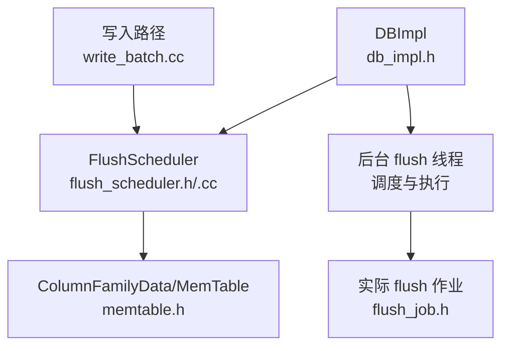
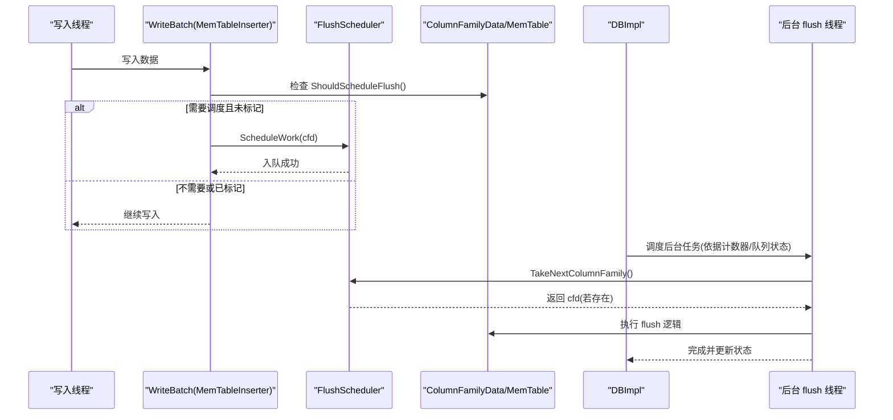
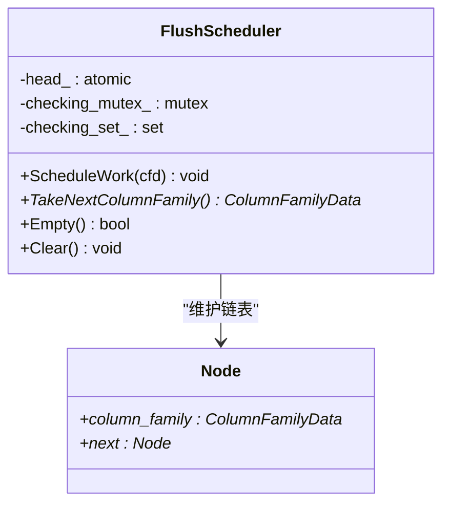
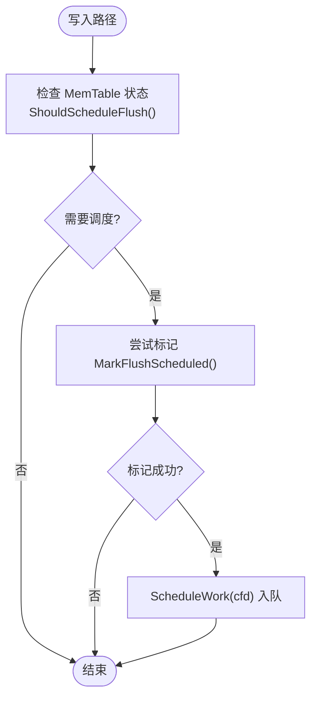
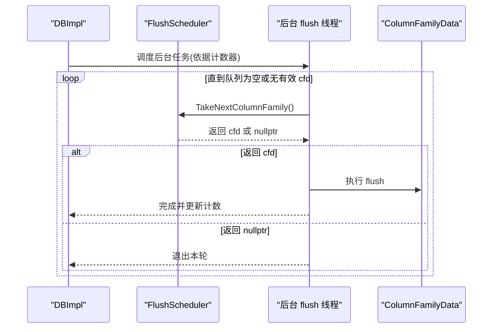
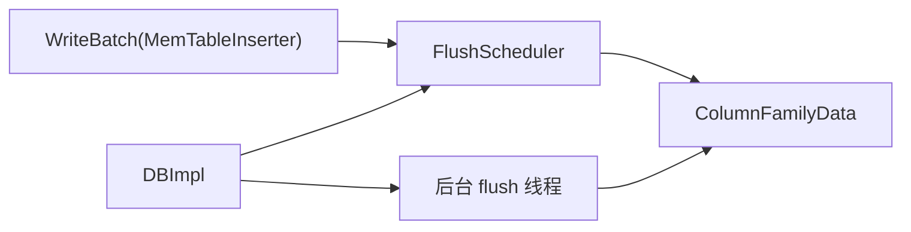

# Flush调度器

<cite>
**本文引用的文件**   
- [flush_scheduler.h](file://source/rocksdb/db/flush_scheduler.h)
- [flush_scheduler.cc](file://source/rocksdb/db/flush_scheduler.cc)
- [write_batch.cc](file://source/rocksdb/db/write_batch.cc)
- [db_impl.h](file://source/rocksdb/db/db_impl/db_impl.h)
- [memtable.h](file://source/rocksdb/db/memtable.h)
</cite>

## 目录
1. [简介](#简介)
2. [项目结构](#项目结构)
3. [核心组件](#核心组件)
4. [架构总览](#架构总览)
5. [详细组件分析](#详细组件分析)
6. [依赖关系分析](#依赖关系分析)
7. [性能考量](#性能考量)
8. [故障排查指南](#故障排查指南)
9. [结论](#结论)
10. [附录](#附录)

## 简介
本文件围绕 RocksDB 中的 FlushScheduler（Flush 调度器）进行系统化说明，重点覆盖：
- 调度策略与优先级管理：基于无锁单链表队列的 FIFO 调度，结合 MemTable 的“是否应调度”和“防重入标记”实现去重。
- 并发控制机制：使用原子头指针与 CAS 实现高并发下的无锁入队；消费端通过循环取头并过滤已丢弃的 ColumnFamilyData。
- 触发条件与队列管理：写入路径中检测 MemTable 状态后入队；后台线程周期性或按需从队列取出待 flush 的列族。
- 资源分配策略：由上层 DBImpl 统一协调后台线程池、计数器和队列，避免过多并发 flush 导致资源争用。
- 与数据库核心组件交互：与 MemTable、ColumnFamilyData、WriteBatch 处理流程以及 DBImpl 的后台任务调度紧密协作。
- 常见问题与解决方案：重复调度、竞态导致的空队列误判、已删除列族的清理等。

## 项目结构
FlushScheduler 位于 RocksDB 的 db 层，作为轻量级调度器，被写入路径与后台 flush 线程共同使用。其关键文件包括：
- 接口定义：flush_scheduler.h
- 实现细节：flush_scheduler.cc
- 写入路径集成：write_batch.cc（MemTableInserter 在写入过程中检查是否需要调度 flush）
- DBImpl 集成点：db_impl.h（持有 FlushScheduler 实例及后台调度相关字段）
- MemTable 状态判断：memtable.h（ShouldScheduleFlush、MarkFlushScheduled）

图表来源 
- [flush_scheduler.h:1-56](file://source/rocksdb/db/flush_scheduler.h#L1-L56)
- [flush_scheduler.cc:1-87](file://source/rocksdb/db/flush_scheduler.cc#L1-L87)
- [write_batch.cc:2980-3023](file://source/rocksdb/db/write_batch.cc#L2980-L3023)
- [db_impl.h:3170-3369](file://source/rocksdb/db/db_impl/db_impl.h#L3170-L3369)
- [memtable.h:627-633](file://source/rocksdb/db/memtable.h#L627-L633)

章节来源
- [flush_scheduler.h:1-56](file://source/rocksdb/db/flush_scheduler.h#L1-L56)
- [flush_scheduler.cc:1-87](file://source/rocksdb/db/flush_scheduler.cc#L1-L87)
- [write_batch.cc:2980-3023](file://source/rocksdb/db/write_batch.cc#L2980-L3023)
- [db_impl.h:3170-3369](file://source/rocksdb/db/db_impl/db_impl.h#L3170-L3369)
- [memtable.h:627-633](file://source/rocksdb/db/memtable.h#L627-L633)

## 核心组件
- FlushScheduler：无锁 FIFO 队列，维护需要 flush 的 ColumnFamilyData 列表。提供 ScheduleWork、TakeNextColumnFamily、Empty、Clear 等方法。
- MemTable 状态方法：ShouldScheduleFlush 决定是否需要调度；MarkFlushScheduled 用于去重，确保同一 MemTable 仅被调度一次。
- DBImpl：持有 FlushScheduler 实例，负责后台线程调度、计数器管理与资源协调。
- WriteBatch 写入路径：MemTableInserter 在写入过程中调用 CheckMemtableFull，必要时将 cfd 入队。

章节来源
- [flush_scheduler.h:19-53](file://source/rocksdb/db/flush_scheduler.h#L19-L53)
- [flush_scheduler.cc:14-84](file://source/rocksdb/db/flush_scheduler.cc#L14-L84)
- [write_batch.cc:2986-3023](file://source/rocksdb/db/write_batch.cc#L2986-L3023)
- [db_impl.h:3177-3179](file://source/rocksdb/db/db_impl/db_impl.h#L3177-L3179)
- [memtable.h:627-633](file://source/rocksdb/db/memtable.h#L627-L633)

## 架构总览
FlushScheduler 的核心职责是解耦“写入路径的 flush 触发”和“后台 flush 执行”。写入路径只负责快速判断与入队，后台线程负责按顺序取出并执行 flush。

图表来源 
- [write_batch.cc:2986-3023](file://source/rocksdb/db/write_batch.cc#L2986-L3023)
- [flush_scheduler.cc:14-65](file://source/rocksdb/db/flush_scheduler.cc#L14-L65)
- [db_impl.h:3238-3259](file://source/rocksdb/db/db_impl/db_impl.h#L3238-L3259)

## 详细组件分析

### FlushScheduler 类设计
- 数据结构：内部 Node 包含 ColumnFamilyData* 与 next 指针，形成无锁单链表。
- 并发模型：head_ 为原子指针，入队使用 CAS 循环；出队读取 head_ 并替换为新头。
- 安全性：消费时跳过 IsDropped() 的列族，防止对已删除对象操作；NDEBUG 下维护 checking_set_ 辅助断言一致性。

图表来源 
- [flush_scheduler.h:23-53](file://source/rocksdb/db/flush_scheduler.h#L23-L53)
- [flush_scheduler.cc:14-84](file://source/rocksdb/db/flush_scheduler.cc#L14-L84)

章节来源
- [flush_scheduler.h:23-53](file://source/rocksdb/db/flush_scheduler.h#L23-L53)
- [flush_scheduler.cc:14-84](file://source/rocksdb/db/flush_scheduler.cc#L14-L84)

### 写入路径集成（CheckMemtableFull）
- 触发条件：cfd->mem()->ShouldScheduleFlush() 为真且 MarkFlushScheduled() 返回 true（去重）。
- 动作：调用 flush_scheduler_->ScheduleWork(cfd) 将 cfd 入队。
- 扩展：同时可能触发 TrimHistoryScheduler（历史修剪），但不在本文范围。

图表来源 
- [write_batch.cc:2986-3023](file://source/rocksdb/db/write_batch.cc#L2986-L3023)
- [memtable.h:627-633](file://source/rocksdb/db/memtable.h#L627-L633)

章节来源
- [write_batch.cc:2986-3023](file://source/rocksdb/db/write_batch.cc#L2986-L3023)
- [memtable.h:627-633](file://source/rocksdb/db/memtable.h#L627-L633)

### 后台消费与调度（DBImpl）
- DBImpl 持有 flush_scheduler_，并通过 unscheduled_flushes_、bg_flush_scheduled_、num_running_flushes_ 等计数器协调后台线程。
- 消费流程：TakeNextColumnFamily() 循环取头，过滤已丢弃的 cfd，返回有效 cfd 供 flush 作业执行。

图表来源 
- [db_impl.h:3238-3259](file://source/rocksdb/db/db_impl/db_impl.h#L3238-L3259)
- [flush_scheduler.cc:36-65](file://source/rocksdb/db/flush_scheduler.cc#L36-L65)

章节来源
- [db_impl.h:3238-3259](file://source/rocksdb/db/db_impl/db_impl.h#L3238-L3259)
- [flush_scheduler.cc:36-65](file://source/rocksdb/db/flush_scheduler.cc#L36-L65)

## 依赖关系分析
- FlushScheduler 依赖 ColumnFamilyData（通过 Node 指针），但不直接依赖具体 MemTable 实现。
- 写入路径依赖 MemTable 的状态方法（ShouldScheduleFlush、MarkFlushScheduled）来决定是否入队。
- DBImpl 依赖 FlushScheduler 来统一管理待 flush 的列族集合，并协调后台线程。

图表来源 
- [write_batch.cc:2986-3023](file://source/rocksdb/db/write_batch.cc#L2986-L3023)
- [flush_scheduler.h:23-53](file://source/rocksdb/db/flush_scheduler.h#L23-L53)
- [db_impl.h:3177-3179](file://source/rocksdb/db/db_impl/db_impl.h#L3177-L3179)

章节来源
- [write_batch.cc:2986-3023](file://source/rocksdb/db/write_batch.cc#L2986-L3023)
- [flush_scheduler.h:23-53](file://source/rocksdb/db/flush_scheduler.h#L23-L53)
- [db_impl.h:3177-3179](file://source/rocksdb/db/db_impl/db_impl.h#L3177-L3179)

## 性能考量
- 无锁入队：使用原子头指针与 CAS，减少锁竞争，提升高并发写入场景下的吞吐。
- 去重机制：MarkFlushScheduled 避免同一 MemTable 多次入队，降低重复调度开销。
- 消费端过滤：TakeNextColumnFamily 跳过已丢弃的 cfd，避免无效操作。
- 资源控制：DBImpl 通过计数器限制后台 flush 数量，防止资源耗尽。

[本节为通用指导，不直接分析具体文件]

## 故障排查指南
- 问题：队列看似为空但仍有待 flush 的列族
  - 原因：Empty() 可能在 ScheduleWork 之后同步前调用，导致短暂不一致。
  - 解决：以 TakeNextColumnFamily 返回值为准，而非仅依赖 Empty()。
- 问题：重复调度同一 MemTable
  - 原因：未正确调用 MarkFlushScheduled 或并发竞争。
  - 解决：确保写入路径在入队前调用 MarkFlushScheduled 并检查返回值。
- 问题：已删除列族导致崩溃
  - 原因：消费端未过滤 IsDropped() 的 cfd。
  - 解决：TakeNextColumnFamily 已内置过滤逻辑，确保使用该方法获取 cfd。

章节来源
- [flush_scheduler.cc:36-65](file://source/rocksdb/db/flush_scheduler.cc#L36-L65)
- [write_batch.cc:2986-3023](file://source/rocksdb/db/write_batch.cc#L2986-L3023)

## 结论
FlushScheduler 通过无锁队列与去重机制，实现了高效、安全的 flush 调度。其与写入路径、DBImpl 和 MemTable 的协作清晰明确，适合在高并发场景下稳定运行。理解其触发条件、并发控制与资源协调机制，有助于优化 RocksDB 的写入与 flush 性能。

[本节为总结性内容，不直接分析具体文件]

## 附录
- 配置选项参考：FlushScheduler 本身无外部配置，行为由 MemTable 状态与 DBImpl 的后台调度策略决定。
- 扩展建议：如需自定义调度策略，可在 FlushScheduler 基础上扩展优先级队列或权重算法，但需保证并发安全。

[本节为补充信息，不直接分析具体文件]