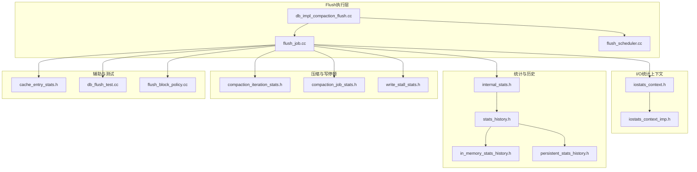
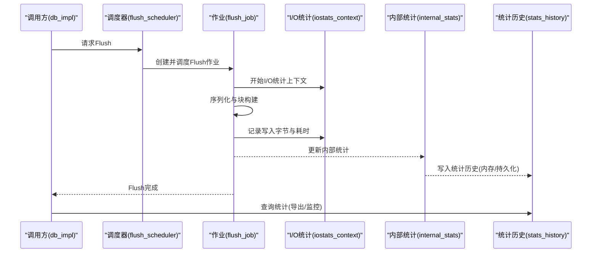
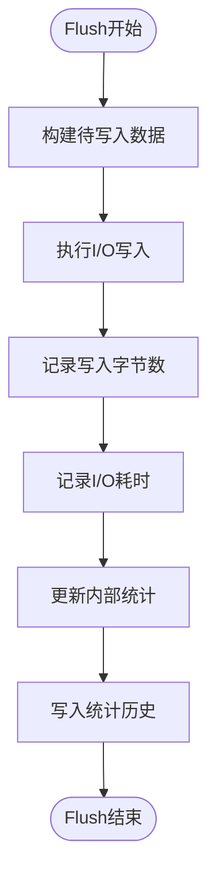
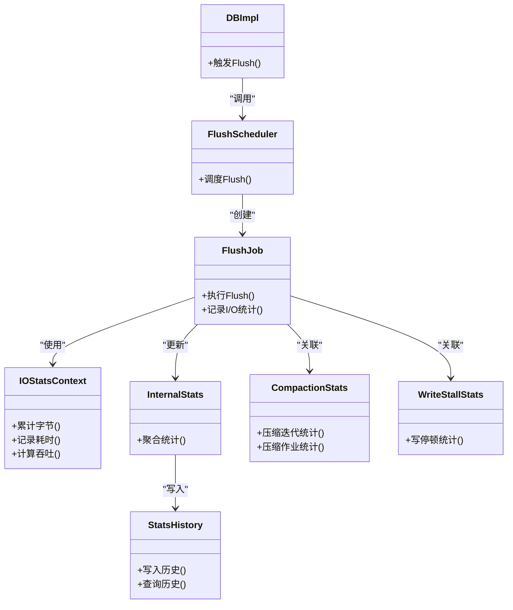

# I/O统计监控

<cite>
**本文引用的文件**   
- [db_impl_compaction_flush.cc](file://source/rocksdb/db/db_impl/db_impl_compaction_flush.cc)
- [flush_job.cc](file://source/rocksdb/db/flush_job.cc)
- [flush_scheduler.cc](file://source/rocksdb/db/flush_scheduler.cc)
- [iostats_context.h](file://source/rocksdb/include/rocksdb/iostats_context.h)
- [internal_stats.h](file://source/rocksdb/db/internal_stats.h)
- [compaction_iteration_stats.h](file://source/rocksdb/db/compaction/compaction_iteration_stats.h)
- [stats_history.h](file://source/rocksdb/include/rocksdb/stats_history.h)
- [in_memory_stats_history.h](file://source/rocksdb/monitoring/in_memory_stats_history.h)
- [persistent_stats_history.h](file://source/rocksdb/monitoring/persistent_stats_history.h)
- [iostats_context_imp.h](file://source/rocksdb/monitoring/iostats_context_imp.h)
- [cache_entry_stats.h](file://source/rocksdb/cache/cache_entry_stats.h)
- [write_stall_stats.h](file://source/rocksdb/db/write_stall_stats.h)
- [compaction_job_stats.h](file://source/rocksdb/include/rocksdb/compaction_job_stats.h)
- [db_flush_test.cc](file://source/rocksdb/db/db_flush_test.cc)
- [flush_block_policy.cc](file://source/rocksdb/table/block_based/flush_block_policy.cc)
</cite>

## 目录
1. [简介](#简介)
2. [项目结构](#项目结构)
3. [核心组件](#核心组件)
4. [架构总览](#架构总览)
5. [详细组件分析](#详细组件分析)
6. [依赖关系分析](#依赖关系分析)
7. [性能考量](#性能考量)
8. [故障排查指南](#故障排查指南)
9. [结论](#结论)
10. [附录](#附录)

## 简介
本文件面向I/O统计监控功能，聚焦Flush过程中的I/O统计收集机制、指标定义与采集路径。内容涵盖字节计数、延迟统计、吞吐量的实现细节；说明统计数据的存储格式、导出接口与监控工具集成方式；并给出可用的监控指标与告警配置建议。文档以RocksDB代码库为依据，结合Flush相关源码进行解析，帮助读者理解如何在Flush链路中获取与分析关键性能指标。

## 项目结构
围绕Flush与I/O统计的关键代码分布在以下模块：
- Flush调度与执行：db_impl_compaction_flush.cc、flush_job.cc、flush_scheduler.cc
- I/O统计上下文：include/rocksdb/iostats_context.h、monitoring/iostats_context_imp.h
- 内部统计与历史：db/internal_stats.h、include/rocksdb/stats_history.h、monitoring/in_memory_stats_history.h、monitoring/persistent_stats_history.h
- 压缩与Flush关联统计：db/compaction/compaction_iteration_stats.h、include/rocksdb/compaction_job_stats.h
- 缓存与写停顿统计：cache/cache_entry_stats.h、db/write_stall_stats.h
- 测试与策略：db/db_flush_test.cc、table/block_based/flush_block_policy.cc

图表来源 
- [db_impl_compaction_flush.cc](file://source/rocksdb/db/db_impl/db_impl_compaction_flush.cc)
- [flush_job.cc](file://source/rocksdb/db/flush_job.cc)
- [flush_scheduler.cc](file://source/rocksdb/db/flush_scheduler.cc)
- [iostats_context.h](file://source/rocksdb/include/rocksdb/iostats_context.h)
- [iostats_context_imp.h](file://source/rocksdb/monitoring/iostats_context_imp.h)
- [internal_stats.h](file://source/rocksdb/db/internal_stats.h)
- [stats_history.h](file://source/rocksdb/include/rocksdb/stats_history.h)
- [in_memory_stats_history.h](file://source/rocksdb/monitoring/in_memory_stats_history.h)
- [persistent_stats_history.h](file://source/rocksdb/monitoring/persistent_stats_history.h)
- [compaction_iteration_stats.h](file://source/rocksdb/db/compaction/compaction_iteration_stats.h)
- [compaction_job_stats.h](file://source/rocksdb/include/rocksdb/compaction_job_stats.h)
- [write_stall_stats.h](file://source/rocksdb/db/write_stall_stats.h)
- [cache_entry_stats.h](file://source/rocksdb/cache/cache_entry_stats.h)
- [db_flush_test.cc](file://source/rocksdb/db/db_flush_test.cc)
- [flush_block_policy.cc](file://source/rocksdb/table/block_based/flush_block_policy.cc)

章节来源
- [db_impl_compaction_flush.cc](file://source/rocksdb/db/db_impl/db_impl_compaction_flush.cc)
- [flush_job.cc](file://source/rocksdb/db/flush_job.cc)
- [flush_scheduler.cc](file://source/rocksdb/db/flush_scheduler.cc)
- [iostats_context.h](file://source/rocksdb/include/rocksdb/iostats_context.h)
- [internal_stats.h](file://source/rocksdb/db/internal_stats.h)
- [stats_history.h](file://source/rocksdb/include/rocksdb/stats_history.h)
- [in_memory_stats_history.h](file://source/rocksdb/monitoring/in_memory_stats_history.h)
- [persistent_stats_history.h](file://source/rocksdb/monitoring/persistent_stats_history.h)
- [compaction_iteration_stats.h](file://source/rocksdb/db/compaction/compaction_iteration_stats.h)
- [compaction_job_stats.h](file://source/rocksdb/include/rocksdb/compaction_job_stats.h)
- [write_stall_stats.h](file://source/rocksdb/db/write_stall_stats.h)
- [cache_entry_stats.h](file://source/rocksdb/cache/cache_entry_stats.h)
- [db_flush_test.cc](file://source/rocksdb/db/db_flush_test.cc)
- [flush_block_policy.cc](file://source/rocksdb/table/block_based/flush_block_policy.cc)

## 核心组件
- Flush调度器（flush_scheduler）：负责触发与协调Flush任务，决定何时将MemTable落盘为SST。
- Flush作业（flush_job）：具体执行Flush流程，包含数据序列化、块构建、写入磁盘等步骤，并在过程中采集I/O统计。
- I/O统计上下文（iostats_context）：提供线程局部或进程级的I/O计数器与计时器，用于累计字节数、延迟、吞吐等指标。
- 内部统计（internal_stats）：聚合各类统计项，供上层导出与查询。
- 统计历史（stats_history）：支持内存与持久化的历史统计记录，便于趋势分析与导出。
- 压缩与写停顿统计（compaction_*、write_stall_stats）：与Flush相关的间接影响指标，如写停顿时长、压缩迭代统计等。

章节来源
- [flush_scheduler.cc](file://source/rocksdb/db/flush_scheduler.cc)
- [flush_job.cc](file://source/rocksdb/db/flush_job.cc)
- [iostats_context.h](file://source/rocksdb/include/rocksdb/iostats_context.h)
- [internal_stats.h](file://source/rocksdb/db/internal_stats.h)
- [stats_history.h](file://source/rocksdb/include/rocksdb/stats_history.h)
- [compaction_iteration_stats.h](file://source/rocksdb/db/compaction/compaction_iteration_stats.h)
- [write_stall_stats.h](file://source/rocksdb/db/write_stall_stats.h)

## 架构总览
Flush的I/O统计在“调用—执行—统计—导出”的链路中完成：
- 调用层：通过db_impl触发Flush，进入Flush作业执行。
- 执行层：flush_job组织数据写入，期间使用iostats_context记录I/O字节、耗时等。
- 统计层：internal_stats汇总各维度指标，stats_history维护时间序列。
- 导出层：通过监控API或工具读取统计历史与当前值，形成可视化与告警。

图表来源 
- [db_impl_compaction_flush.cc](file://source/rocksdb/db/db_impl/db_impl_compaction_flush.cc)
- [flush_scheduler.cc](file://source/rocksdb/db/flush_scheduler.cc)
- [flush_job.cc](file://source/rocksdb/db/flush_job.cc)
- [iostats_context.h](file://source/rocksdb/include/rocksdb/iostats_context.h)
- [internal_stats.h](file://source/rocksdb/db/internal_stats.h)
- [stats_history.h](file://source/rocksdb/include/rocksdb/stats_history.h)

## 详细组件分析

### Flush作业与I/O统计采集
- 触发点：db_impl_compaction_flush.cc中发起Flush流程，进入flush_job执行。
- 采集点：flush_job在执行写入时，通过iostats_context记录：
  - 字节计数：累计写入的字节数（按类型区分，如用户数据、元数据）。
  - 延迟统计：记录每次I/O操作的耗时，支持均值、分位数等聚合。
  - 吞吐量：基于时间段内的字节累计计算。
- 聚合与导出：internal_stats汇总后写入stats_history，支持内存与持久化两种形式。

图表来源 
- [flush_job.cc](file://source/rocksdb/db/flush_job.cc)
- [iostats_context.h](file://source/rocksdb/include/rocksdb/iostats_context.h)
- [internal_stats.h](file://source/rocksdb/db/internal_stats.h)
- [stats_history.h](file://source/rocksdb/include/rocksdb/stats_history.h)

章节来源
- [flush_job.cc](file://source/rocksdb/db/flush_job.cc)
- [iostats_context.h](file://source/rocksdb/include/rocksdb/iostats_context.h)
- [internal_stats.h](file://source/rocksdb/db/internal_stats.h)
- [stats_history.h](file://source/rocksdb/include/rocksdb/stats_history.h)

### I/O统计上下文（iostats_context）
- 职责：提供线程/进程级I/O计数器与计时器，封装字节累计、耗时测量、吞吐计算。
- 关键点：
  - 计数器分离：区分不同I/O类型（读/写、同步/异步、WAL/SST等），便于精细化分析。
  - 高精度计时：确保延迟统计准确，避免被其他操作干扰。
  - 并发安全：在多线程环境下保证计数一致性。

章节来源
- [iostats_context.h](file://source/rocksdb/include/rocksdb/iostats_context.h)
- [iostats_context_imp.h](file://source/rocksdb/monitoring/iostats_context_imp.h)

### 内部统计与历史（internal_stats与stats_history）
- internal_stats：聚合Flush、Compaction、Cache等多类统计，提供统一访问接口。
- stats_history：支持内存与持久化存储，记录时间序列，便于趋势分析与导出。
- 导出接口：通常暴露查询方法，返回当前值与历史快照，供监控系统拉取。

章节来源
- [internal_stats.h](file://source/rocksdb/db/internal_stats.h)
- [stats_history.h](file://source/rocksdb/include/rocksdb/stats_history.h)
- [in_memory_stats_history.h](file://source/rocksdb/monitoring/in_memory_stats_history.h)
- [persistent_stats_history.h](file://source/rocksdb/monitoring/persistent_stats_history.h)

### 压缩与写停顿统计（compaction_*与write_stall_stats）
- compaction_iteration_stats：记录压缩迭代中的I/O与处理指标，与Flush间接相关（例如SST生成后的合并）。
- compaction_job_stats：整体压缩作业的统计，包括耗时、数据量、失败次数等。
- write_stall_stats：记录写停顿时长与原因，反映Flush/Compaction对写入的影响。

章节来源
- [compaction_iteration_stats.h](file://source/rocksdb/db/compaction/compaction_iteration_stats.h)
- [compaction_job_stats.h](file://source/rocksdb/include/rocksdb/compaction_job_stats.h)
- [write_stall_stats.h](file://source/rocksdb/db/write_stall_stats.h)

### 缓存与块策略（cache_entry_stats与flush_block_policy）
- cache_entry_stats：缓存条目统计，有助于分析Flush前后缓存命中率与内存占用。
- flush_block_policy：控制Flush时的块策略，影响I/O分布与性能。

章节来源
- [cache_entry_stats.h](file://source/rocksdb/cache/cache_entry_stats.h)
- [flush_block_policy.cc](file://source/rocksdb/table/block_based/flush_block_policy.cc)

### 测试与验证（db_flush_test）
- db_flush_test：覆盖Flush流程的测试用例，可用于验证统计采集的正确性与边界条件。

章节来源
- [db_flush_test.cc](file://source/rocksdb/db/db_flush_test.cc)

## 依赖关系分析
Flush与I/O统计的依赖关系如下：
- db_impl_compaction_flush.cc依赖flush_scheduler与flush_job。
- flush_job依赖iostats_context、internal_stats、stats_history。
- iostats_context_imp实现iostats_context接口。
- stats_history可选择内存或持久化后端。
- compaction_*与write_stall_stats作为相关统计，与Flush间接耦合。

图表来源 
- [db_impl_compaction_flush.cc](file://source/rocksdb/db/db_impl/db_impl_compaction_flush.cc)
- [flush_scheduler.cc](file://source/rocksdb/db/flush_scheduler.cc)
- [flush_job.cc](file://source/rocksdb/db/flush_job.cc)
- [iostats_context.h](file://source/rocksdb/include/rocksdb/iostats_context.h)
- [internal_stats.h](file://source/rocksdb/db/internal_stats.h)
- [stats_history.h](file://source/rocksdb/include/rocksdb/stats_history.h)
- [compaction_iteration_stats.h](file://source/rocksdb/db/compaction/compaction_iteration_stats.h)
- [compaction_job_stats.h](file://source/rocksdb/include/rocksdb/compaction_job_stats.h)
- [write_stall_stats.h](file://source/rocksdb/db/write_stall_stats.h)

章节来源
- [db_impl_compaction_flush.cc](file://source/rocksdb/db/db_impl/db_impl_compaction_flush.cc)
- [flush_scheduler.cc](file://source/rocksdb/db/flush_scheduler.cc)
- [flush_job.cc](file://source/rocksdb/db/flush_job.cc)
- [iostats_context.h](file://source/rocksdb/include/rocksdb/iostats_context.h)
- [internal_stats.h](file://source/rocksdb/db/internal_stats.h)
- [stats_history.h](file://source/rocksdb/include/rocksdb/stats_history.h)
- [compaction_iteration_stats.h](file://source/rocksdb/db/compaction/compaction_iteration_stats.h)
- [compaction_job_stats.h](file://source/rocksdb/include/rocksdb/compaction_job_stats.h)
- [write_stall_stats.h](file://source/rocksdb/db/write_stall_stats.h)

## 性能考量
- 统计开销最小化：I/O统计应在关键路径上轻量实现，避免引入额外锁竞争或频繁系统调用。
- 采样与聚合：对高频I/O事件采用增量累计与周期性聚合，降低统计成本。
- 历史存储选择：内存历史适合实时查询，持久化历史适合长期趋势分析，需权衡存储压力与查询需求。
- 指标粒度：合理划分I/O类型与维度，既满足分析需求又避免过度细分导致噪声。

## 故障排查指南
- 统计缺失：检查iostats_context是否正确初始化与绑定到Flush路径。
- 延迟异常：确认计时精度与并发环境下的计时隔离。
- 吞吐波动：结合compaction与write_stall指标，判断是否受压缩或写停顿影响。
- 历史丢失：验证stats_history的后端配置与写入权限。

章节来源
- [iostats_context.h](file://source/rocksdb/include/rocksdb/iostats_context.h)
- [iostats_context_imp.h](file://source/rocksdb/monitoring/iostats_context_imp.h)
- [stats_history.h](file://source/rocksdb/include/rocksdb/stats_history.h)
- [in_memory_stats_history.h](file://source/rocksdb/monitoring/in_memory_stats_history.h)
- [persistent_stats_history.h](file://source/rocksdb/monitoring/persistent_stats_history.h)
- [compaction_job_stats.h](file://source/rocksdb/include/rocksdb/compaction_job_stats.h)
- [write_stall_stats.h](file://source/rocksdb/db/write_stall_stats.h)

## 结论
Flush过程的I/O统计监控通过iostats_context与internal_stats、stats_history协同工作，实现了字节计数、延迟统计与吞吐量的精确采集与导出。结合压缩与写停顿指标，可全面评估Flush对系统性能的影响。通过合理的统计粒度与历史存储策略，可有效支撑监控与告警需求。

## 附录
- 可用监控指标（示例）：
  - 字节计数：Flush写入总字节、按类型拆分（用户数据、元数据）。
  - 延迟统计：平均延迟、P95/P99延迟、I/O等待时间。
  - 吞吐量：单位时间内写入字节数、峰值吞吐。
  - 写停顿：停顿时长、触发原因分类。
  - 压缩关联：压缩迭代I/O、压缩作业耗时。
- 导出接口：
  - 查询当前统计值与历史快照。
  - 支持时间范围过滤与聚合函数。
- 告警配置建议：
  - 延迟阈值：超过P99阈值触发告警。
  - 吞吐下降：低于基线阈值持续N分钟告警。
  - 写停顿：长时间停顿或频繁触发告警。