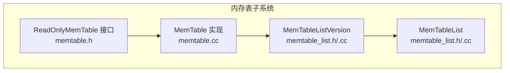
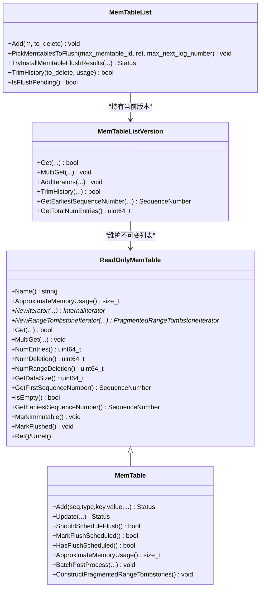
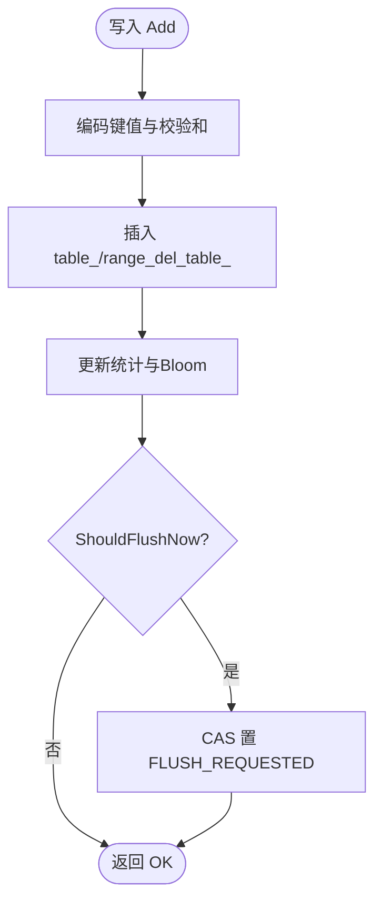
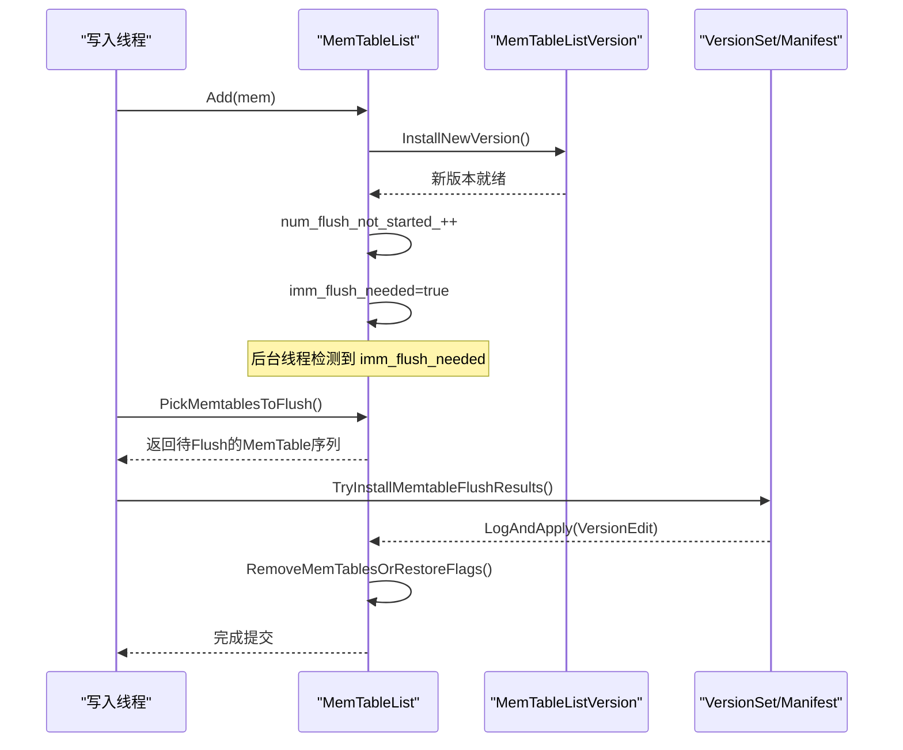
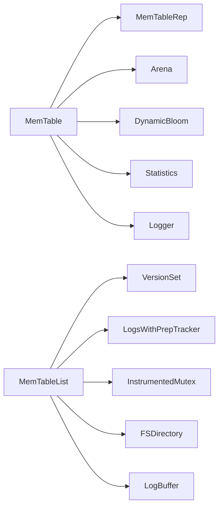

# 内存表管理

<cite>
**本文引用的文件**   
- [memtable.h](file://source/rocksdb/db/memtable.h)
- [memtable.cc](file://source/rocksdb/db/memtable.cc)
- [memtable_list.h](file://source/rocksdb/db/memtable_list.h)
- [memtable_list.cc](file://source/rocksdb/db/memtable_list.cc)
</cite>

## 目录
1. [简介](#简介)
2. [项目结构](#项目结构)
3. [核心组件](#核心组件)
4. [架构总览](#架构总览)
5. [详细组件分析](#详细组件分析)
6. [依赖关系分析](#依赖关系分析)
7. [性能考量](#性能考量)
8. [故障排查指南](#故障排查指南)
9. [结论](#结论)
10. [附录：配置与调优参数](#附录配置与调优参数)

## 简介
本文件围绕 RocksDB 的内存表（MemTable）管理机制进行系统化说明，重点覆盖以下方面：
- 数据结构设计：活跃 MemTable、不可变 MemTable、MemTableList 版本化视图、范围删除表等。
- 生命周期管理：创建、切换为不可变、Flush 完成标记、引用计数与释放。
- 选择策略：何时触发 Flush、如何挑选待 Flush 的 MemTable、原子 Flush 序列号的作用。
- 列表维护算法：历史版本裁剪、内存预算控制、并发安全与无锁读路径。
- 与 WAL、Compaction 协作：WAL 号传播、Manifest 提交顺序、与后台 Compaction 的关系。
- 内存压力优化：写缓冲大小动态调整、历史裁剪、Arena 分配策略与过分配容忍度。
- 配置与调优：关键选项对行为的影响及建议。

## 项目结构
与内存表管理直接相关的代码集中在 db 层：
- memtable.h/.cc：定义 ReadOnlyMemTable 接口与 MemTable 实现，包含插入、查询、迭代器、范围删除、Flush 状态、统计信息、校验和等。
- memtable_list.h/.cc：维护不可变 MemTable 列表的版本化视图（MemTableListVersion），提供读取合并、历史裁剪、Flush 任务挑选、结果安装等。

图表来源
- [memtable.h:111-572](file://source/rocksdb/db/memtable.h#L111-L572)
- [memtable.cc:150-236](file://source/rocksdb/db/memtable.cc#L150-L236)
- [memtable_list.h:43-227](file://source/rocksdb/db/memtable_list.h#L43-L227)
- [memtable_list.cc:34-92](file://source/rocksdb/db/memtable_list.cc#L34-L92)

章节来源
- [memtable.h:111-572](file://source/rocksdb/db/memtable.h#L111-L572)
- [memtable.cc:150-236](file://source/rocksdb/db/memtable.cc#L150-L236)
- [memtable_list.h:43-227](file://source/rocksdb/db/memtable_list.h#L43-L227)
- [memtable_list.cc:34-92](file://source/rocksdb/db/memtable_list.cc#L34-L92)

## 核心组件
- ReadOnlyMemTable：只读内存表抽象，定义 Get/MultiGet/迭代器/范围删除迭代器/统计/MarkImmutable/MarkFlushed 等能力，供 MemTable 与可能的其他实现复用。
- MemTable：具体实现，封装底层 MemTableRep（如 SkipList）、RangeDel 表、Arena 分配、Bloom 过滤、增量统计、Flush 状态机、校验和等。
- MemTableListVersion：不可变 MemTable 列表的快照视图，支持从新到旧顺序查找、MultiGet、范围删除聚合、历史裁剪、最早序列号计算等。
- MemTableList：对外暴露的列表管理器，负责新增 MemTable、PickMemtablesToFlush、TryInstallMemtableFlushResults、历史裁剪、缓存统计值等。

章节来源
- [memtable.h:111-572](file://source/rocksdb/db/memtable.h#L111-L572)
- [memtable.cc:150-236](file://source/rocksdb/db/memtable.cc#L150-L236)
- [memtable_list.h:43-227](file://source/rocksdb/db/memtable_list.h#L43-L227)
- [memtable_list.cc:34-92](file://source/rocksdb/db/memtable_list.cc#L34-L92)

## 架构总览
下图展示 MemTable 与 MemTableList 的交互以及读写路径的关键点。

图表来源
- [memtable.h:111-572](file://source/rocksdb/db/memtable.h#L111-L572)
- [memtable_list.h:43-227](file://source/rocksdb/db/memtable_list.h#L43-L227)

## 详细组件分析

### MemTable 数据结构与生命周期
- 数据结构
  - 主表 table_：由 MemTableRepFactory 创建，默认基于 SkipList，支持并发插入（部分实现）。
  - 范围删除表 range_del_table_：始终使用 SkipList，支持并发插入，用于高效处理 RangeDelete。
  - Arena 分配器：统一分配键值与内部结构，减少碎片并提升性能。
  - Bloom 过滤器：可选前缀或全键过滤，加速不存在键的否定查询。
  - 统计与状态：num_entries_/data_size_/num_deletes_/num_range_deletes_、first_seqno_/earliest_seqno_、flush_state_、oldest_key_time_ 等。
- 生命周期
  - 构造：初始化比较器、Arena、MemTableRep、RangeDel 表、Bloom、统计、时钟、校验和回调等。
  - 写入：Add/Update/UpdateCallback 将条目编码并插入对应表，更新统计与 Bloom，必要时触发 UpdateFlushState。
  - 不可变：MarkImmutable 后禁止再写入；构造范围删除分片列表以加速后续读取。
  - Flush：MarkFlushed 标记已完成；在 TryInstallMemtableFlushResults 中设置 flush_completed_ 与 file_number_。
  - 释放：Unref 引用计数归零时释放受保护的 Blob 文件句柄并析构。

章节来源
- [memtable.cc:150-236](file://source/rocksdb/db/memtable.cc#L150-L236)
- [memtable.cc:1037-1200](file://source/rocksdb/db/memtable.cc#L1037-L1200)
- [memtable.h:574-800](file://source/rocksdb/db/memtable.h#L574-L800)

### 选择策略与 Flush 触发条件
- 单表触发判断 ShouldFlushNow
  - 显式标记 MarkForFlush。
  - 范围删除数量超过阈值 memtable_max_range_deletions_。
  - 内存使用接近 write_buffer_size_ 且考虑 Arena 块过分配容忍度（约 0.6 倍块大小）。
  - 当最后一个 Arena 块剩余空间小于 1/4 块大小时提前触发，避免过度浪费。
- 状态机与调度
  - UpdateFlushState：若处于 FLUSH_NOT_REQUESTED 且 ShouldFlushNow 为真，则 CAS 置为 FLUSH_REQUESTED。
  - ShouldScheduleFlush/MarkFlushScheduled/HasFlushScheduled：上层可据此决定是否由调用方发起 Flush。
- 列表级挑选 PickMemtablesToFlush
  - 从最旧开始扫描，跳过已 flush_in_progress_ 的项，保证连续批次的顺序性。
  - 记录 max_next_log_number 以便 WAL 清理。
  - 遇到 atomic_flush_seqno_ 非最大值的表，进入原子 Flush 模式。
  - 当 num_flush_not_started_ 降为 0 时清除 imm_flush_needed。

图表来源
- [memtable.cc:257-329](file://source/rocksdb/db/memtable.cc#L257-L329)
- [memtable.cc:331-340](file://source/rocksdb/db/memtable.cc#L331-L340)
- [memtable.cc:1037-1200](file://source/rocksdb/db/memtable.cc#L1037-L1200)

章节来源
- [memtable.cc:257-329](file://source/rocksdb/db/memtable.cc#L257-L329)
- [memtable.cc:331-340](file://source/rocksdb/db/memtable.cc#L331-L340)
- [memtable_list.cc:409-462](file://source/rocksdb/db/memtable_list.cc#L409-L462)

### 内存表列表维护算法
- 版本化视图 MemTableListVersion
  - 通过 Ref/Unref 管理引用计数，确保并发读路径安全。
  - Add/Remove：新表插入头部，移除时标记 flushed 并可能移入历史列表。
  - History 裁剪：根据 max_write_buffer_size_to_maintain_ 估算总内存，必要时丢弃最老的历史表。
- 列表管理 MemTableList
  - Add：安装新版本，增加未启动 Flush 计数，首个表时置位 imm_flush_needed。
  - TrimHistory：按需裁剪历史，更新缓存统计值。
  - IsFlushPending/IsFlushPendingOrRunning：结合 flush_requested_ 与未启动计数判断是否需要后台 Flush。
  - TryInstallMemtableFlushResults：按序提交 Manifest 编辑，记录文件号与 Edit，唤醒等待线程。

图表来源
- [memtable_list.cc:665-681](file://source/rocksdb/db/memtable_list.cc#L665-L681)
- [memtable_list.cc:409-462](file://source/rocksdb/db/memtable_list.cc#L409-L462)
- [memtable_list.cc:521-662](file://source/rocksdb/db/memtable_list.cc#L521-L662)

章节来源
- [memtable_list.cc:34-92](file://source/rocksdb/db/memtable_list.cc#L34-L92)
- [memtable_list.cc:307-375](file://source/rocksdb/db/memtable_list.cc#L307-L375)
- [memtable_list.cc:665-681](file://source/rocksdb/db/memtable_list.cc#L665-L681)
- [memtable_list.cc:521-662](file://source/rocksdb/db/memtable_list.cc#L521-L662)

### 与 WAL、Compaction 的协作
- WAL 协作
  - MemTable 在构造/写入阶段维护 next_wal_file_number_，PickMemtablesToFlush 时汇总 max_next_log_number，用于 WAL 清理决策。
  - TryInstallMemtableFlushResults 写入 VersionEdit 到 MANIFEST，确保崩溃恢复一致性。
- Compaction 协作
  - MemTable 本身不参与 Compaction，但通过 L0 SST 文件参与多级合并。
  - 范围删除分片列表在不可变 MemTable 上预构建，加速读取时的 Tombstone 处理。

章节来源
- [memtable_list.cc:409-462](file://source/rocksdb/db/memtable_list.cc#L409-L462)
- [memtable_list.cc:521-662](file://source/rocksdb/db/memtable_list.cc#L521-L662)
- [memtable.cc:905-919](file://source/rocksdb/db/memtable.cc#L905-L919)

### 内存压力下的优化策略
- 动态写缓冲大小：UpdateWriteBufferSize 可在运行时调整，若低于当前使用量，下一次插入即触发 Flush。
- Arena 分配策略：允许适度过分配（约 0.6 倍块大小），并在最后块利用率达到阈值时提前 Flush，降低碎片与浪费。
- 历史裁剪：当总内存超过 max_write_buffer_size_to_maintain_ 时，优先丢弃最老的历史 MemTable，保持内存预算。
- 并发插入与批量后处理：BatchPostProcess 聚合统计更新，减少竞争与开销。

章节来源
- [memtable.h:760-771](file://source/rocksdb/db/memtable.h#L760-L771)
- [memtable.cc:257-329](file://source/rocksdb/db/memtable.cc#L257-L329)
- [memtable_list.cc:347-375](file://source/rocksdb/db/memtable_list.cc#L347-L375)
- [memtable.cc:731-748](file://source/rocksdb/db/memtable.cc#L731-L748)

## 依赖关系分析
- MemTable 依赖
  - MemTableRep 工厂：决定底层存储结构（SkipList/Vector/HashSkiplist 等）。
  - Arena：内存分配与回收。
  - Bloom 过滤器：可选前缀/全键过滤。
  - MergeOperator/Statistics/Logger：合并操作、统计与日志。
- MemTableList 依赖
  - VersionSet/LogsWithPrepTracker：持久化元数据与 WAL 准备跟踪。
  - InstrumentedMutex：同步原语。
  - FSDirectory/LogBuffer：文件系统与日志缓冲。

图表来源
- [memtable.cc:150-236](file://source/rocksdb/db/memtable.cc#L150-L236)
- [memtable_list.cc:521-662](file://source/rocksdb/db/memtable_list.cc#L521-L662)

章节来源
- [memtable.cc:150-236](file://source/rocksdb/db/memtable.cc#L150-L236)
- [memtable_list.cc:521-662](file://source/rocksdb/db/memtable_list.cc#L521-L662)

## 性能考量
- 插入路径
  - 并发插入：部分 MemTableRep 支持 InsertKeyConcurrently，配合 BatchPostProcess 降低锁竞争。
  - 前缀提示：insert_with_hint_prefix_extractor_ 可为热点前缀提供插入提示，提升定位效率。
- 读取路径
  - 多表合并：MemTableListVersion::AddIterators 将多个 MemTable 迭代器合并，支持点键与范围删除迭代器组合。
  - 范围删除分片：不可变 MemTable 预构建分片列表，避免重复构造开销。
- Flush 路径
  - 批量挑选：PickMemtablesToFlush 保证顺序性与连续性，减少 Manifest 写入抖动。
  - 原子 Flush：atomic_flush_seqno_ 确保跨 MemTable 的一致性边界。

章节来源
- [memtable.cc:1090-1154](file://source/rocksdb/db/memtable.cc#L1090-L1154)
- [memtable_list.cc:212-257](file://source/rocksdb/db/memtable_list.cc#L212-L257)
- [memtable_list.cc:409-462](file://source/rocksdb/db/memtable_list.cc#L409-L462)

## 故障排查指南
- 常见症状与定位
  - 频繁 Flush：检查 ShouldFlushNow 条件（范围删除阈值、write_buffer_size_、Arena 利用率）。
  - 内存增长：确认历史裁剪是否生效（max_write_buffer_size_to_maintain_），查看 TrimHistory 调用路径。
  - 一致性异常：核对 atomic_flush_seqno_ 与 PickMemtablesToFlush 的原子模式分支。
  - WAL 清理滞后：检查 PickMemtablesToFlush 返回的 max_next_log_number 是否正确传递。
- 调试要点
  - 观察 imm_flush_needed 标志变化，确认后台线程是否被正确唤醒。
  - 验证 TryInstallMemtableFlushResults 的 Manifest 提交顺序与回滚逻辑。

章节来源
- [memtable.cc:257-329](file://source/rocksdb/db/memtable.cc#L257-L329)
- [memtable_list.cc:391-406](file://source/rocksdb/db/memtable_list.cc#L391-L406)
- [memtable_list.cc:521-662](file://source/rocksdb/db/memtable_list.cc#L521-L662)

## 结论
RocksDB 的内存表管理通过清晰的分层设计与严格的版本化控制，实现了高吞吐写入与低延迟读取的平衡。MemTable 聚焦于高效的数据结构与插入路径，MemTableList 负责不可变表的组织与 Flush 调度。通过合理的 Flush 触发策略、历史裁剪机制以及与 WAL/Manifest 的紧密协作，系统在内存压力下仍能保持稳定与一致性。

## 附录：配置与调优参数
- 写缓冲大小
  - write_buffer_size：控制单个 MemTable 的目标大小，影响 Flush 频率与内存占用。
  - max_write_buffer_size_to_maintain：限制所有 MemTable（含历史）的总内存，触发历史裁剪。
- 内存分配与过滤
  - arena_block_size：Arena 块大小，影响内存对齐与碎片率。
  - memtable_prefix_bloom_bits：前缀 Bloom 位数，权衡误判率与内存。
  - memtable_whole_key_filtering：启用全键 Bloom 过滤。
- 合并与更新
  - inplace_update_support/inplace_update_num_locks：原地更新支持与锁粒度。
  - max_successive_merges/strict_max_successive_merges：连续合并次数限制。
- 校验与保护
  - memtable_protection_bytes_per_key：每键校验和保护字节数。
  - memtable_veirfy_per_key_checksum_on_seek：读取时校验每个键的校验和。
- 其他
  - memtable_huge_page_size：大页支持，减少 TLB 缺失。
  - memtable_batch_lookup_optimization：批量查找优化开关。

章节来源
- [memtable.h:49-72](file://source/rocksdb/db/memtable.h#L49-L72)
- [memtable.h:760-771](file://source/rocksdb/db/memtable.h#L760-L771)
- [memtable_list.h:48-49](file://source/rocksdb/db/memtable_list.h#L48-L49)
- [memtable_list.h:219](file://source/rocksdb/db/memtable_list.h#L219)