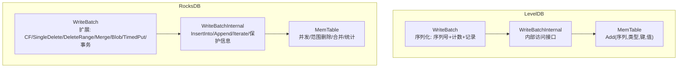
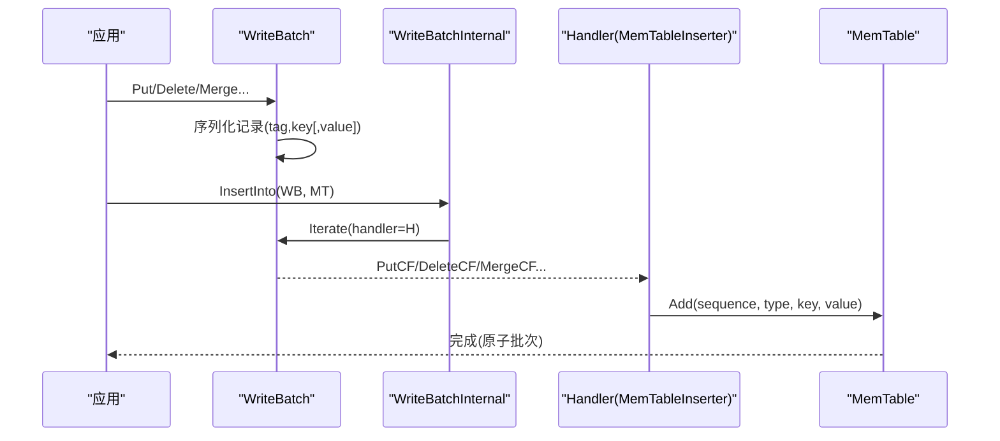
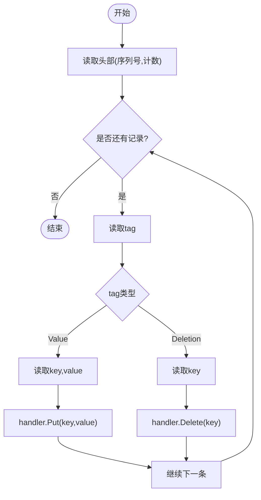
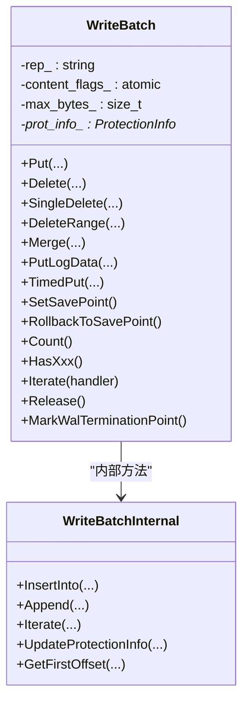
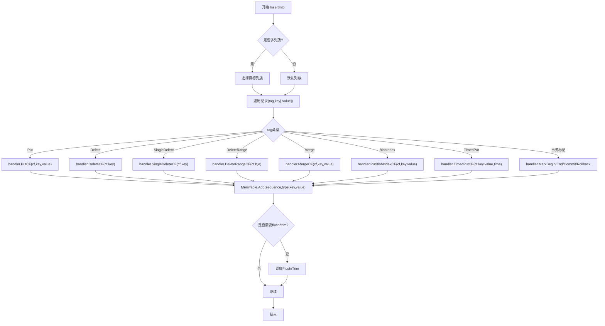
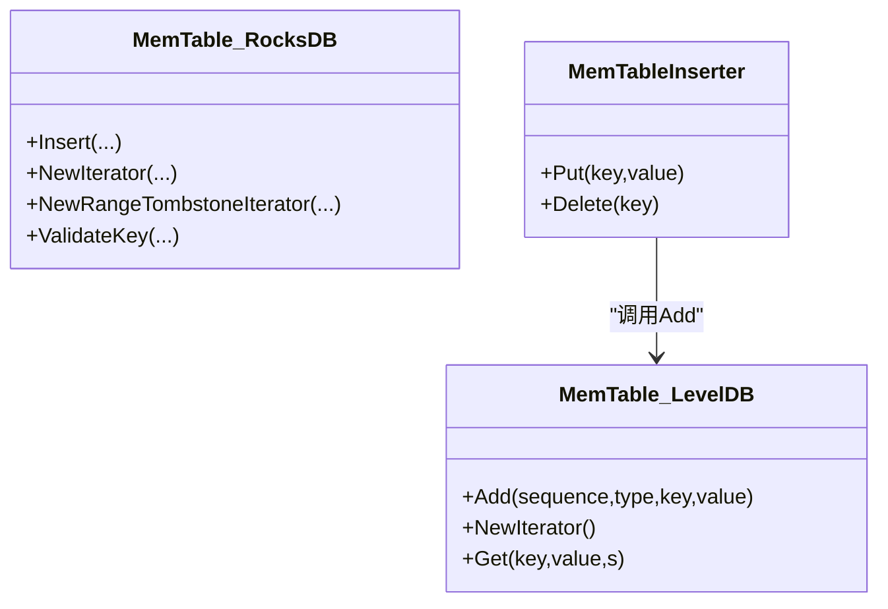
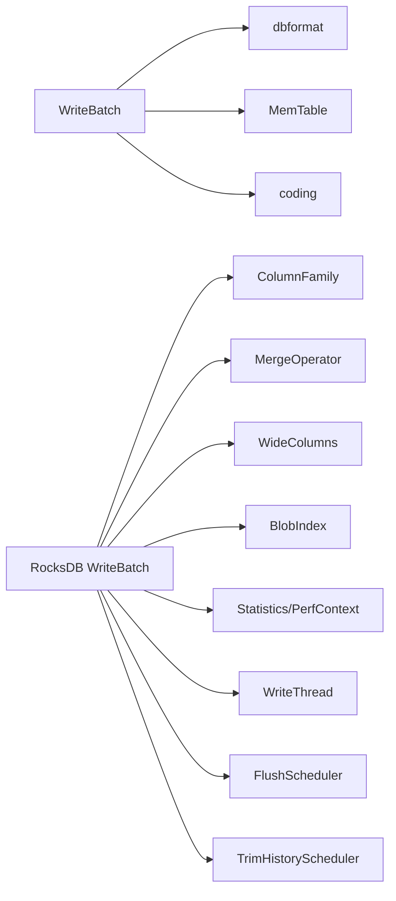

# 批量写入优化

<cite>
**本文引用的文件**   
- [write_batch.cc](file://source/leveldb-main/db/write_batch.cc)
- [write_batch.h](file://source/leveldb-main/include/leveldb/write_batch.h)
- [write_batch_internal.h](file://source/leveldb-main/db/write_batch_internal.h)
- [memtable.cc](file://source/leveldb-main/db/memtable.cc)
- [write_batch.cc](file://source/rocksdb/db/write_batch.cc)
- [write_batch.h](file://source/rocksdb/include/rocksdb/write_batch.h)
- [write_batch_internal.h](file://source/rocksdb/db/write_batch_internal.h)
- [memtable.cc](file://source/rocksdb/db/memtable.cc)
- [write_batch_test.cc](file://source/leveldb-main/db/write_batch_test.cc)
- [write_batch_test.cc](file://source/rocksdb/db/write_batch_test.cc)
</cite>

## 目录
1. [简介](#简介)
2. [项目结构](#项目结构)
3. [核心组件](#核心组件)
4. [架构总览](#架构总览)
5. [详细组件分析](#详细组件分析)
6. [依赖关系分析](#依赖关系分析)
7. [性能考量](#性能考量)
8. [故障排查指南](#故障排查指南)
9. [结论](#结论)
10. [附录](#附录)

## 简介
本文件围绕“批量写入优化”展开，系统阐述 WriteBatch 的数据结构、序列化格式与迭代机制，深入解析批处理算法、合并策略、事务支持及原子性保证。文档同时给出与内存表（MemTable）和 WAL 的集成方式，总结大规模批量操作的最佳实践，并汇总相关 API 接口与配置要点。内容基于代码库中的 LevelDB 与 RocksDB 实现进行对比说明，帮助读者在理解基础的同时掌握高级特性。

## 项目结构
- LevelDB 提供精简的 WriteBatch 实现：紧凑的二进制格式、Put/Delete 记录、顺序号与计数头、Iterate 回调驱动 MemTable 插入。
- RocksDB 在此基础上扩展了丰富的功能：多列族、单删/范围删、Merge、BlobIndex、TimedPut、事务标记（Prepare/Commit/Rollback）、保护信息（每键校验）、延迟内容标志位计算、WAL 终止点等。

**图示来源** 
- [write_batch.cc:1-151](file://source/leveldb-main/db/write_batch.cc#L1-L151)
- [write_batch.h:1-84](file://source/leveldb-main/include/leveldb/write_batch.h#L1-L84)
- [write_batch_internal.h:1-46](file://source/leveldb-main/db/write_batch_internal.h#L1-L46)
- [memtable.cc:76-100](file://source/leveldb-main/db/memtable.cc#L76-L100)
- [write_batch.cc:1-800](file://source/rocksdb/db/write_batch.cc#L1-L800)
- [write_batch.h:1-549](file://source/rocksdb/include/rocksdb/write_batch.h#L1-L549)
- [write_batch_internal.h:1-426](file://source/rocksdb/db/write_batch_internal.h#L1-L426)
- [memtable.cc:150-200](file://source/rocksdb/db/memtable.cc#L150-L200)

**章节来源**
- [write_batch.cc:1-151](file://source/leveldb-main/db/write_batch.cc#L1-L151)
- [write_batch.h:1-84](file://source/leveldb-main/include/leveldb/write_batch.h#L1-L84)
- [write_batch_internal.h:1-46](file://source/leveldb-main/db/write_batch_internal.h#L1-L46)
- [memtable.cc:76-100](file://source/leveldb-main/db/memtable.cc#L76-L100)
- [write_batch.cc:1-800](file://source/rocksdb/db/write_batch.cc#L1-L800)
- [write_batch.h:1-549](file://source/rocksdb/include/rocksdb/write_batch.h#L1-L549)
- [write_batch_internal.h:1-426](file://source/rocksdb/db/write_batch_internal.h#L1-L426)
- [memtable.cc:150-200](file://source/rocksdb/db/memtable.cc#L150-L200)

## 核心组件
- WriteBatch（LevelDB/RocksDB）
  - 数据结构：头部包含固定长度的序列号与条目计数；主体为变长记录数组。
  - 序列化：每条记录以 tag 开头，随后是 key/value 或仅 key（删除类），长度前缀编码。
  - 迭代器：通过 Handler 回调将记录分发给上层（如 MemTableInserter）。
- WriteBatchInternal（LevelDB/RocksDB）
  - 暴露非公开的内部方法：读取/设置序列号与计数、追加、插入到 MemTable、迭代子区间等。
- MemTable（LevelDB/RocksDB）
  - 接收带序列号的更新，按内部键排序存储，支持高效查找与后续落盘。

关键差异
- RocksDB 增加列族、单删、范围删、Merge、BlobIndex、TimedPut、事务标记、保护信息等。
- RocksDB 的 Iterate 支持 TryAgain 语义、空批次边界 Noop 处理、内容标志位延迟计算。

**章节来源**
- [write_batch.cc:1-151](file://source/leveldb-main/db/write_batch.cc#L1-L151)
- [write_batch.h:1-84](file://source/leveldb-main/include/leveldb/write_batch.h#L1-L84)
- [write_batch_internal.h:1-46](file://source/leveldb-main/db/write_batch_internal.h#L1-L46)
- [write_batch.cc:1-800](file://source/rocksdb/db/write_batch.cc#L1-L800)
- [write_batch.h:1-549](file://source/rocksdb/include/rocksdb/write_batch.h#L1-L549)
- [write_batch_internal.h:1-426](file://source/rocksdb/db/write_batch_internal.h#L1-L426)

## 架构总览
下图展示从应用层调用到 MemTable 写入的关键流程，以及 RocksDB 对 LevelDB 的增强点。

**图示来源** 
- [write_batch.cc:98-137](file://source/leveldb-main/db/write_batch.cc#L98-L137)
- [write_batch.cc:517-772](file://source/rocksdb/db/write_batch.cc#L517-L772)
- [memtable.cc:76-100](file://source/leveldb-main/db/memtable.cc#L76-L100)
- [memtable.cc:150-200](file://source/rocksdb/db/memtable.cc#L150-L200)

## 详细组件分析

### LevelDB WriteBatch 数据结构与序列化
- 头部：8 字节序列号 + 4 字节计数。
- 记录：kTypeValue(key,value)、kTypeDeletion(key)。
- Append：直接拼接源记录的 payload，避免重复迭代。
- Iterate：按 tag 分发到 Handler，最终由 MemTableInserter 调用 MemTable::Add。

**图示来源** 
- [write_batch.cc:42-80](file://source/leveldb-main/db/write_batch.cc#L42-L80)

**章节来源**
- [write_batch.cc:1-151](file://source/leveldb-main/db/write_batch.cc#L1-L151)
- [write_batch_test.cc:1-133](file://source/leveldb-main/db/write_batch_test.cc#L1-L133)

### RocksDB WriteBatch 扩展能力
- 新增记录类型：SingleDelete、RangeDelete、Merge、BlobIndex、TimedPut、WideColumnEntity、事务标记（BeginPrepare/EndPrepare/Commit/Rollback）、Noop。
- 内容标志位：content_flags_ 延迟计算，HasXxx() 快速判断是否存在某类操作。
- Iterate 增强：支持 TryAgain 语义、空批次边界 Noop、子区间迭代、日志数据 LogData。
- 保护信息：ProtectionInfo 维护每键的保护元数据，可选校验。
- WAL 终止点：MarkWalTerminationPoint 用于限定 WAL 写入范围。

**图示来源** 
- [write_batch.h:64-549](file://source/rocksdb/include/rocksdb/write_batch.h#L64-L549)
- [write_batch_internal.h:76-266](file://source/rocksdb/db/write_batch_internal.h#L76-L266)

**章节来源**
- [write_batch.cc:1-800](file://source/rocksdb/db/write_batch.cc#L1-L800)
- [write_batch.h:1-549](file://source/rocksdb/include/rocksdb/write_batch.h#L1-L549)
- [write_batch_internal.h:1-426](file://source/rocksdb/db/write_batch_internal.h#L1-L426)

### 批处理算法与合并策略
- 合并策略（Append）
  - LevelDB：直接拼接 payload，更新计数。
  - RocksDB：检查 count 一致性，支持 WAL_only 模式，返回状态码。
- 插入 MemTable（InsertInto）
  - LevelDB：通过 MemTableInserter 调用 MemTable::Add，按 sequence 递增。
  - RocksDB：支持多列族、并发插入、FlushScheduler/TrimHistoryScheduler 触发、seq_per_batch/batch_per_txn 控制。
- 事务支持
  - RocksDB：BeginPrepare/EndPrepare/Commit/Rollback 标记，配合 Handler 选项（WriteAfterCommit/WriteBeforePrepare）约束 WAL 行为。
- 原子性保证
  - 同一 WriteBatch 内所有记录按序应用，MemTable 中按 sequence 排序，读路径可见性一致。

**图示来源** 
- [write_batch.cc:517-772](file://source/rocksdb/db/write_batch.cc#L517-L772)
- [write_batch_internal.h:196-226](file://source/rocksdb/db/write_batch_internal.h#L196-L226)

**章节来源**
- [write_batch.cc:111-137](file://source/leveldb-main/db/write_batch.cc#L111-L137)
- [write_batch.cc:228-237](file://source/rocksdb/db/write_batch.cc#L228-L237)
- [write_batch_internal.h:196-226](file://source/rocksdb/db/write_batch_internal.h#L196-L226)

### 与内存表（MemTable）的集成
- LevelDB MemTable::Add
  - 构造内部键（用户键+8字节tag/序列），使用 Arena 分配，插入底层 Table。
- RocksDB MemTable
  - 支持并发插入、范围删除表、合并操作、统计、保护信息校验、写缓冲管理等。

**图示来源** 
- [memtable.cc:76-100](file://source/leveldb-main/db/memtable.cc#L76-L100)
- [memtable.cc:150-200](file://source/rocksdb/db/memtable.cc#L150-L200)
- [write_batch.cc:116-130](file://source/leveldb-main/db/write_batch.cc#L116-L130)

**章节来源**
- [memtable.cc:76-100](file://source/leveldb-main/db/memtable.cc#L76-L100)
- [memtable.cc:150-200](file://source/rocksdb/db/memtable.cc#L150-L200)

### 与 WAL 的集成
- RocksDB WriteBatch 支持 MarkWalTerminationPoint，限制 WAL 写入范围。
- 事务模式下，Handler 的 WriteAfterCommit/WriteBeforePrepare 影响 WAL 行为。
- LevelDB 未在此处体现 WAL 细节，但 WriteBatch 可被上层持久化。

**章节来源**
- [write_batch.h:486-487](file://source/rocksdb/include/rocksdb/write_batch.h#L486-L487)
- [write_batch.cc:297-301](file://source/rocksdb/db/write_batch.cc#L297-L301)
- [write_batch_internal.h:132-151](file://source/rocksdb/db/write_batch_internal.h#L132-L151)

### 事务支持与原子性保证
- 事务标记：BeginPrepare/EndPrepare/Commit/Rollback，确保事务边界清晰。
- 原子性：同一批次内操作顺序执行，MemTable 中按 sequence 排序，读路径一致。
- 回滚与保存点：SetSavePoint/RollbackToSavePoint 支持局部回滚。

**章节来源**
- [write_batch.h:216-231](file://source/rocksdb/include/rocksdb/write_batch.h#L216-L231)
- [write_batch.cc:642-731](file://source/rocksdb/db/write_batch.cc#L642-L731)
- [write_batch_internal.h:132-151](file://source/rocksdb/db/write_batch_internal.h#L132-L151)

### 实际示例与最佳实践
- 示例参考
  - LevelDB 测试：验证 Count、Sequence、Append、ApproximateSize。
  - RocksDB 测试：验证多种操作类型、TimedPut、事务标记、错误恢复。
- 最佳实践
  - 合理设置 reserved_bytes/max_bytes 减少扩容开销。
  - 使用 Append 合并小批次，降低迭代与拷贝成本。
  - 利用 HasXxx() 快速分支优化处理路径。
  - 开启保护信息（protection_bytes_per_key）提升数据完整性。
  - 针对大键值使用 BlobIndex 分离大对象。
  - 使用 TimedPut 精确控制写入时间戳。
  - 通过 seq_per_batch/batch_per_txn 控制序列分配策略。

**章节来源**
- [write_batch_test.cc:1-133](file://source/leveldb-main/db/write_batch_test.cc#L1-L133)
- [write_batch_test.cc:1-200](file://source/rocksdb/db/write_batch_test.cc#L1-L200)

## 依赖关系分析
- LevelDB
  - WriteBatch 依赖 dbformat/memtable/coding 等工具。
  - WriteBatchInternal 暴露内部访问，便于测试与上层集成。
- RocksDB
  - WriteBatch 依赖 column_family、merge_operator、wide columns、blob index、statistics、perf_context 等。
  - WriteBatchInternal 与 WriteThread/FlushScheduler/TrimHistoryScheduler 协作，支持并发与调度。

**图示来源** 
- [write_batch.cc:16-23](file://source/leveldb-main/db/write_batch.cc#L16-L23)
- [write_batch.cc:51-74](file://source/rocksdb/db/write_batch.cc#L51-L74)
- [write_batch_internal.h:14-24](file://source/rocksdb/db/write_batch_internal.h#L14-L24)

**章节来源**
- [write_batch.cc:16-23](file://source/leveldb-main/db/write_batch.cc#L16-L23)
- [write_batch.cc:51-74](file://source/rocksdb/db/write_batch.cc#L51-L74)
- [write_batch_internal.h:14-24](file://source/rocksdb/db/write_batch_internal.h#L14-L24)

## 性能考量
- 序列化与迭代
  - 避免重复迭代：优先使用 Append 直接拼接 payload。
  - 延迟计算 content_flags_：HasXxx() 按需计算，减少无谓扫描。
- 内存管理
  - 预分配 rep_ 容量（reserved_bytes）减少扩容。
  - 使用 SliceParts 减少拷贝（RocksDB Put/Delete/Merge 支持）。
- 并发与调度
  - concurrent_memtable_writes 允许并发插入。
  - FlushScheduler/TrimHistoryScheduler 控制落盘与历史裁剪。
- 数据完整性
  - protection_bytes_per_key 提供每键保护，可选校验。
  - VerifyChecksum 校验 per-key-value checksum。

[本节为通用指导，不直接分析具体文件]

## 故障排查指南
- 常见错误
  - Corruption：记录格式损坏、count 不一致、未知 tag。
  - InvalidArgument：列族不支持的操作、timestamp 大小不匹配。
  - MemoryLimit：超过 max_bytes_ 限制。
- 定位方法
  - 使用 Iterate 打印记录序列，核对 tag/key/value。
  - 检查 WriteBatchInternal::Count 与实际记录数是否一致。
  - 启用保护信息与校验，定位损坏位置。
  - 查看 Handler 的 Continue 返回值，确认是否提前中断。

**章节来源**
- [write_batch.cc:42-80](file://source/leveldb-main/db/write_batch.cc#L42-L80)
- [write_batch.cc:517-772](file://source/rocksdb/db/write_batch.cc#L517-L772)
- [write_batch_internal.h:262-266](file://source/rocksdb/db/write_batch_internal.h#L262-L266)

## 结论
WriteBatch 是批量写入的核心抽象，LevelDB 提供了简洁高效的实现，RocksDB 在此基础上扩展了丰富的企业级特性。通过合理的序列化、迭代与合并策略，结合 MemTable 的高效存储与 WAL 的持久化保障，可实现高吞吐、低延迟的批量写入。实践中应充分利用 HasXxx()、SliceParts、保护信息、事务标记等能力，并结合业务场景调整参数以获得最佳性能。

[本节为总结性内容，不直接分析具体文件]

## 附录
- API 接口速览
  - LevelDB
    - Put/Delete/Clear/Append/Iterate/ApproximateSize
    - WriteBatchInternal::Count/SetCount/Sequence/SetSequence/InsertInto/Append/SetContents
  - RocksDB
    - Put/Delete/SingleDelete/DeleteRange/Merge/PutLogData/TimedPut/PutEntity
    - SetSavePoint/RollbackToSavePoint/PopSavePoint
    - HasXxx()/Count()/GetDataSize()/Release()/MarkWalTerminationPoint
    - WriteBatchInternal::InsertInto/Append/Iterate/UpdateProtectionInfo/GetFirstOffset
- 配置参数要点
  - reserved_bytes/max_bytes：控制 WriteBatch 内存上限与预分配。
  - protection_bytes_per_key：开启每键保护（当前支持 8 字节）。
  - default_cf_ts_sz：默认列族时间戳大小。
  - seq_per_batch/batch_per_txn：序列分配策略。
  - memtable_batch_lookup_optimization：MemTable 批量查找优化。

**章节来源**
- [write_batch.h:50-73](file://source/leveldb-main/include/leveldb/write_batch.h#L50-L73)
- [write_batch_internal.h:15-41](file://source/leveldb-main/db/write_batch_internal.h#L15-L41)
- [write_batch.h:66-231](file://source/rocksdb/include/rocksdb/write_batch.h#L66-L231)
- [write_batch_internal.h:84-151](file://source/rocksdb/db/write_batch_internal.h#L84-L151)