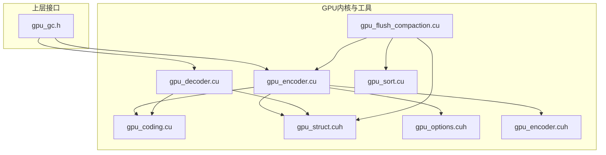
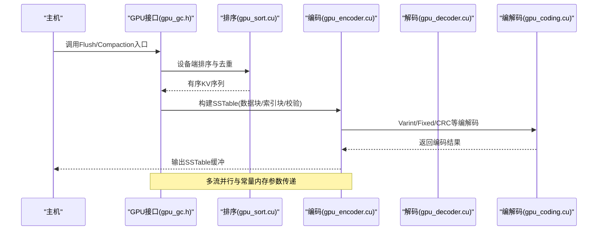
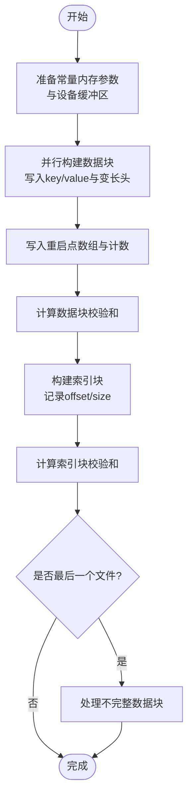
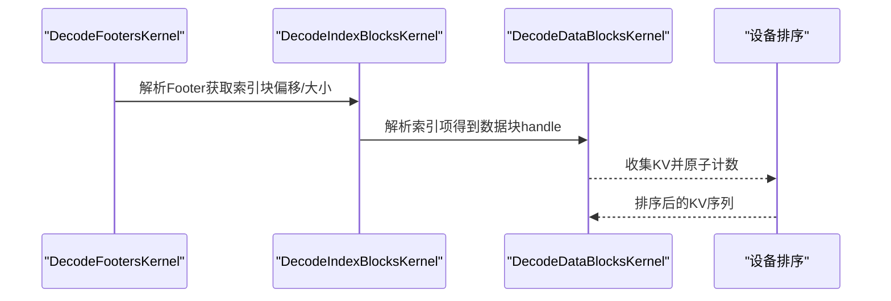
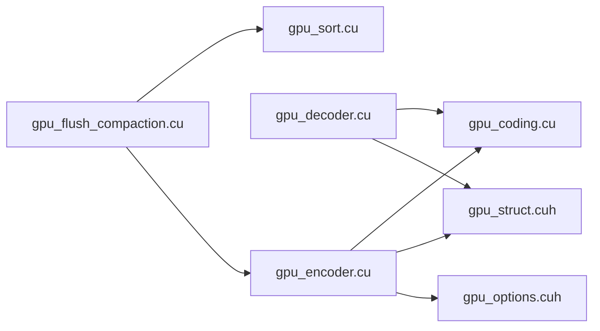

# CUDA内核开发

<cite>
**本文引用的文件**   
- [gpu_encoder.cu](file://source/gParaKV-GC-master/db/cuda/gpu_encoder.cu)
- [gpu_decoder.cu](file://source/gParaKV-GC-master/db/cuda/gpu_decoder.cu)
- [gpu_coding.cu](file://source/gParaKV-GC-master/db/cuda/gpu_coding.cu)
- [gpu_sort.cu](file://source/gParaKV-GC-master/db/cuda/gpu_sort.cu)
- [gpu_flush_compaction.cu](file://source/gParaKV-GC-master/db/cuda/gpu_flush_compaction.cu)
- [gpu_struct.cuh](file://source/gParaKV-GC-master/db/cuda/gpu_struct.cuh)
- [gpu_options.cuh](file://source/gParaKV-GC-master/db/cuda/gpu_options.cuh)
- [gpu_encoder.cuh](file://source/gParaKV-GC-master/db/cuda/gpu_encoder.cuh)
- [gpu_gc.h](file://source/gParaKV-GC-master/db/gpu_gc.h)
</cite>

## 目录
1. [简介](#简介)
2. [项目结构](#项目结构)
3. [核心组件](#核心组件)
4. [架构总览](#架构总览)
5. [详细组件分析](#详细组件分析)
6. [依赖关系分析](#依赖关系分析)
7. [性能考量](#性能考量)
8. [故障排查指南](#故障排查指南)
9. [结论](#结论)
10. [附录](#附录)

## 简介
本文件面向CUDA内核开发，聚焦于GPU侧的压缩与解码实现细节。内容涵盖并行计算模型、内存访问模式、线程块与网格配置、数据分片策略、共享内存优化思路、主机与设备交互及同步机制，并给出实际代码库中的示例路径与最佳实践建议。文档兼顾初学者理解与资深开发者深度需求。

## 项目结构
仓库中与CUDA相关的核心实现位于 gParaKV-GC-master/db/cuda 目录下，包含编码、解码、排序、flush/compaction流程以及公共结构与常量定义。关键文件如下：
- 编码与SSTable构建：gpu_encoder.cu/.cuh
- 解码与索引/数据块解析：gpu_decoder.cu/.cuh
- 编解码基础函数：gpu_coding.cu/.cuh
- 排序与去重：gpu_sort.cu/.cuh
- Flush/Compaction入口与准备：gpu_flush_compaction.cu/.cuh
- 数据结构与常量：gpu_struct.cuh, gpu_options.cuh
- GPU GC封装接口：gpu_gc.h

图表来源
- [gpu_encoder.cu:1-207](file://source/gParaKV-GC-master/db/cuda/gpu_encoder.cu#L1-L207)
- [gpu_decoder.cu:1-198](file://source/gParaKV-GC-master/db/cuda/gpu_decoder.cu#L1-L198)
- [gpu_coding.cu:1-209](file://source/gParaKV-GC-master/db/cuda/gpu_coding.cu#L1-L209)
- [gpu_sort.cu:1-158](file://source/gParaKV-GC-master/db/cuda/gpu_sort.cu#L1-L158)
- [gpu_flush_compaction.cu:1-74](file://source/gParaKV-GC-master/db/cuda/gpu_flush_compaction.cu#L1-L74)
- [gpu_struct.cuh:1-87](file://source/gParaKV-GC-master/db/cuda/gpu_struct.cuh#L1-L87)
- [gpu_options.cuh:1-21](file://source/gParaKV-GC-master/db/cuda/gpu_options.cuh#L1-L21)
- [gpu_encoder.cuh:1-207](file://source/gParaKV-GC-master/db/cuda/gpu_encoder.cuh#L1-L207)
- [gpu_gc.h:1-53](file://source/gParaKV-GC-master/db/gpu_gc.h#L1-L53)

章节来源
- [gpu_encoder.cu:1-207](file://source/gParaKV-GC-master/db/cuda/gpu_encoder.cu#L1-L207)
- [gpu_decoder.cu:1-198](file://source/gParaKV-GC-master/db/cuda/gpu_decoder.cu#L1-L198)
- [gpu_coding.cu:1-209](file://source/gParaKV-GC-master/db/cuda/gpu_coding.cu#L1-L209)
- [gpu_sort.cu:1-158](file://source/gParaKV-GC-master/db/cuda/gpu_sort.cu#L1-L158)
- [gpu_flush_compaction.cu:1-74](file://source/gParaKV-GC-master/db/cuda/gpu_flush_compaction.cu#L1-L74)
- [gpu_struct.cuh:1-87](file://source/gParaKV-GC-master/db/cuda/gpu_struct.cuh#L1-L87)
- [gpu_options.cuh:1-21](file://source/gParaKV-GC-master/db/cuda/gpu_options.cuh#L1-L21)
- [gpu_encoder.cuh:1-207](file://source/gParaKV-GC-master/db/cuda/gpu_encoder.cuh#L1-L207)
- [gpu_gc.h:1-53](file://source/gParaKV-GC-master/db/gpu_gc.h#L1-L53)

## 核心组件
- 编码与SSTable构建（gpu_encoder.cu/.cuh）
  - 负责将GPU内存中的键值对按SSTable格式写入设备缓冲区，生成数据块、索引块、校验尾标，支持多输出文件与最后一个文件的特殊处理。
  - 使用常量内存传递尺寸参数，减少全局内存访问；通过多个cudaStream实现流水线并行。
- 解码与索引/数据块解析（gpu_decoder.cu/.cuh）
  - 从SSTable文件中解析Footer、Index Block与Data Block，恢复键值对序列，并进行设备端排序。
- 编解码基础（gpu_coding.cu/.cuh）
  - 提供Varint/Fixed编解码、CRC校验等底层工具，供编码/解码内核调用。
- 排序与去重（gpu_sort.cu/.cuh）
  - 基于Thrust在设备上执行排序、去重、计数聚合等操作，支撑Flush/Compaction流程。
- Flush/Compaction入口（gpu_flush_compaction.cu/.cuh）
  - 组织数据分配、排序、SSTable信息估算与构建，串联GPU内核。
- 数据结构与常量（gpu_struct.cuh, gpu_options.cuh）
  - 定义SSTableInfo、GPUBlockHandle、InputFile等结构体，以及BlockRestartInterval、num_kv_data_block、keySize_/valueSize_等编译期常量。
- GPU GC封装（gpu_gc.h）
  - 对外暴露GPU侧GC相关接口，包括内存分配、标记、触发GC、流管理等。

章节来源
- [gpu_encoder.cu:1-207](file://source/gParaKV-GC-master/db/cuda/gpu_encoder.cu#L1-L207)
- [gpu_decoder.cu:1-198](file://source/gParaKV-GC-master/db/cuda/gpu_decoder.cu#L1-L198)
- [gpu_coding.cu:1-209](file://source/gParaKV-GC-master/db/cuda/gpu_coding.cu#L1-L209)
- [gpu_sort.cu:1-158](file://source/gParaKV-GC-master/db/cuda/gpu_sort.cu#L1-L158)
- [gpu_flush_compaction.cu:1-74](file://source/gParaKV-GC-master/db/cuda/gpu_flush_compaction.cu#L1-L74)
- [gpu_struct.cuh:1-87](file://source/gParaKV-GC-master/db/cuda/gpu_struct.cuh#L1-L87)
- [gpu_options.cuh:1-21](file://source/gParaKV-GC-master/db/cuda/gpu_options.cuh#L1-L21)
- [gpu_encoder.cuh:1-207](file://source/gParaKV-GC-master/db/cuda/gpu_encoder.cuh#L1-L207)
- [gpu_gc.h:1-53](file://source/gParaKV-GC-master/db/gpu_gc.h#L1-L53)

## 架构总览
下图展示了从主机到设备的整体数据流：主机准备输入与参数，设备侧进行解码或排序，随后由编码器构建SSTable，最后写回主机。

图表来源
- [gpu_gc.h:1-53](file://source/gParaKV-GC-master/db/gpu_gc.h#L1-L53)
- [gpu_sort.cu:1-158](file://source/gParaKV-GC-master/db/cuda/gpu_sort.cu#L1-L158)
- [gpu_encoder.cu:1-207](file://source/gParaKV-GC-master/db/cuda/gpu_encoder.cu#L1-L207)
- [gpu_decoder.cu:1-198](file://source/gParaKV-GC-master/db/cuda/gpu_decoder.cu#L1-L198)
- [gpu_coding.cu:1-209](file://source/gParaKV-GC-master/db/cuda/gpu_coding.cu#L1-L209)

## 详细组件分析

### 编码与SSTable构建（gpu_encoder.cu/.cuh）
- 并行模型与线程映射
  - 每个数据块由一个block处理，线程维度按文件索引与块索引划分，充分利用SM资源。
  - 针对“最后一个文件”的特殊分支，单独核函数处理非完整数据块。
- 内存访问模式
  - 常量内存用于传递size_t/uint32_t等控制参数，避免重复加载。
  - 全局内存中顺序写入数据块与索引块，提升带宽利用率。
  - 使用原子操作或独立计数器为索引块生成重启点偏移。
- 数据分片策略
  - 根据num_kv_data_block与max_num_data_block切分KV序列为多个数据块，最后一个数据块可能不足。
  - 每个数据块末尾追加restart数组与校验尾标。
- 共享内存优化
  - 当前实现以memcpy为主，未显式使用shared memory；可通过将小块KV暂存至shared memory以减少全局内存往返。
- 错误处理
  - 使用CHECK宏包装CUDA调用，失败时打印错误并退出。

图表来源
- [gpu_encoder.cu:1-207](file://source/gParaKV-GC-master/db/cuda/gpu_encoder.cu#L1-L207)
- [gpu_encoder.cuh:1-207](file://source/gParaKV-GC-master/db/cuda/gpu_encoder.cuh#L1-L207)
- [gpu_options.cuh:1-21](file://source/gParaKV-GC-master/db/cuda/gpu_options.cuh#L1-L21)
- [gpu_struct.cuh:1-87](file://source/gParaKV-GC-master/db/cuda/gpu_struct.cuh#L1-L87)

章节来源
- [gpu_encoder.cu:1-207](file://source/gParaKV-GC-master/db/cuda/gpu_encoder.cu#L1-L207)
- [gpu_encoder.cuh:1-207](file://source/gParaKV-GC-master/db/cuda/gpu_encoder.cuh#L1-L207)
- [gpu_options.cuh:1-21](file://source/gParaKV-GC-master/db/cuda/gpu_options.cuh#L1-L21)
- [gpu_struct.cuh:1-87](file://source/gParaKV-GC-master/db/cuda/gpu_struct.cuh#L1-L87)

### 解码与索引/数据块解析（gpu_decoder.cu/.cuh）
- 并行模型与线程映射
  - 每个文件一个线程处理Footer，每个数据块一个block解析Index与Data。
- 内存访问模式
  - 顺序读取文件尾部Footer，再按索引块偏移定位数据块，顺序拷贝key/value到设备数组。
- 数据分片策略
  - 依据文件内数据块数量与条目数推断最后一个数据块的KV数量。
- 错误处理
  - 解码失败时打印错误信息；使用CHECK确保流同步。

图表来源
- [gpu_decoder.cu:1-198](file://source/gParaKV-GC-master/db/cuda/gpu_decoder.cu#L1-L198)
- [gpu_coding.cu:1-209](file://source/gParaKV-GC-master/db/cuda/gpu_coding.cu#L1-L209)

章节来源
- [gpu_decoder.cu:1-198](file://source/gParaKV-GC-master/db/cuda/gpu_decoder.cu#L1-L198)
- [gpu_coding.cu:1-209](file://source/gParaKV-GC-master/db/cuda/gpu_coding.cu#L1-L209)

### 编解码基础（gpu_coding.cu/.cuh）
- 提供Varint32/64、Fixed8/16/32/64的编解码函数，以及CRC校验辅助。
- 所有函数标注__host__ __device__，可在主机与设备通用。

章节来源
- [gpu_coding.cu:1-209](file://source/gParaKV-GC-master/db/cuda/gpu_coding.cu#L1-L209)

### 排序与去重（gpu_sort.cu/.cuh）
- 使用Thrust在设备上执行排序、去重、reduce_by_key计数等操作。
- 支持标记旧版本KV、统计重复键等场景。

章节来源
- [gpu_sort.cu:1-158](file://source/gParaKV-GC-master/db/cuda/gpu_sort.cu#L1-L158)

### Flush/Compaction入口（gpu_flush_compaction.cu/.cuh）
- 负责设备内存分配、主机到设备拷贝、排序、SSTable信息估算与构建。
- 串联gpu_sort与gpu_encoder，形成完整的Flush/Compaction流程。

章节来源
- [gpu_flush_compaction.cu:1-74](file://source/gParaKV-GC-master/db/cuda/gpu_flush_compaction.cu#L1-L74)

### 数据结构与常量（gpu_struct.cuh, gpu_options.cuh）
- SSTableInfo：描述每个输出文件的块数、重启点数、总KV数、最后一个数据块KV数。
- GPUBlockHandle：存储偏移与大小，用于索引项。
- InputFile：描述输入文件层级、指针、大小、块数与条目数。
- 常量：BlockRestartInterval、num_kv_data_block、max_num_data_block、keySize_/valueSize_等。

章节来源
- [gpu_struct.cuh:1-87](file://source/gParaKV-GC-master/db/cuda/gpu_struct.cuh#L1-L87)
- [gpu_options.cuh:1-21](file://source/gParaKV-GC-master/db/cuda/gpu_options.cuh#L1-L21)

### GPU GC封装（gpu_gc.h）
- 提供GPU内存分配、标记、触发GC、清理等接口，维护cudaStream与统计信息。

章节来源
- [gpu_gc.h:1-53](file://source/gParaKV-GC-master/db/gpu_gc.h#L1-L53)

## 依赖关系分析
- 模块耦合
  - gpu_encoder依赖gpu_coding、gpu_struct、gpu_options与gpu_encoder.cuh声明。
  - gpu_decoder依赖gpu_coding与gpu_struct。
  - gpu_flush_compaction依赖gpu_sort与gpu_encoder。
- 外部依赖
  - Thrust用于设备排序与归约。
  - CUDA运行时用于流、内存管理与异步拷贝。

图表来源
- [gpu_encoder.cu:1-207](file://source/gParaKV-GC-master/db/cuda/gpu_encoder.cu#L1-L207)
- [gpu_decoder.cu:1-198](file://source/gParaKV-GC-master/db/cuda/gpu_decoder.cu#L1-L198)
- [gpu_flush_compaction.cu:1-74](file://source/gParaKV-GC-master/db/cuda/gpu_flush_compaction.cu#L1-L74)
- [gpu_sort.cu:1-158](file://source/gParaKV-GC-master/db/cuda/gpu_sort.cu#L1-L158)
- [gpu_coding.cu:1-209](file://source/gParaKV-GC-master/db/cuda/gpu_coding.cu#L1-L209)
- [gpu_struct.cuh:1-87](file://source/gParaKV-GC-master/db/cuda/gpu_struct.cuh#L1-L87)
- [gpu_options.cuh:1-21](file://source/gParaKV-GC-master/db/cuda/gpu_options.cuh#L1-L21)

章节来源
- [gpu_encoder.cu:1-207](file://source/gParaKV-GC-master/db/cuda/gpu_encoder.cu#L1-L207)
- [gpu_decoder.cu:1-198](file://source/gParaKV-GC-master/db/cuda/gpu_decoder.cu#L1-L198)
- [gpu_flush_compaction.cu:1-74](file://source/gParaKV-GC-master/db/cuda/gpu_flush_compaction.cu#L1-L74)
- [gpu_sort.cu:1-158](file://source/gParaKV-GC-master/db/cuda/gpu_sort.cu#L1-L158)
- [gpu_coding.cu:1-209](file://source/gParaKV-GC-master/db/cuda/gpu_coding.cu#L1-L209)
- [gpu_struct.cuh:1-87](file://source/gParaKV-GC-master/db/cuda/gpu_struct.cuh#L1-L87)
- [gpu_options.cuh:1-21](file://source/gParaKV-GC-master/db/cuda/gpu_options.cuh#L1-L21)

## 性能考量
- 并行度与网格配置
  - 数据块级并行：grid按数据块数量设置，block按文件索引或固定线程数，最大化吞吐。
  - 最后一个文件特殊处理：分离核函数避免分支发散。
- 内存访问优化
  - 常量内存传递控制参数，减少重复加载。
  - 顺序写入与读取，提升带宽利用率。
  - 可考虑将小块KV缓存到shared memory以降低全局内存压力。
- 流与异步
  - 使用多个cudaStream并行执行不同阶段（如数据块构建、索引构建、校验），提高流水线效率。
  - 异步拷贝与核函数启动，减少主机等待。
- 排序与去重
  - 使用Thrust的设备排序，时间复杂度O(n log n)，适合大规模KV。
- 校验与开销
  - CRC校验增加CPU/GPU负载，需权衡数据完整性与性能。

[本节为通用指导，不直接分析具体文件]

## 故障排查指南
- 常见错误
  - CUDA调用失败：检查CHECK宏输出，确认参数与内存分配正确。
  - 解码失败：核对Footer与Index格式，确认偏移与大小计算无误。
  - 排序结果异常：验证输入数据范围与比较器逻辑。
- 调试方法
  - 使用cuda-memcheck检测越界访问。
  - 使用nvprof/nsys分析核函数耗时与内存带宽。
  - 逐步打印关键变量（如num_data_block、num_restarts、size_complete_data_block）。

章节来源
- [gpu_struct.cuh:27-35](file://source/gParaKV-GC-master/db/cuda/gpu_struct.cuh#L27-L35)
- [gpu_decoder.cu:47-54](file://source/gParaKV-GC-master/db/cuda/gpu_decoder.cu#L47-L54)

## 结论
该代码库实现了高效的GPU侧SSTable编码与解码流程，利用常量内存、多流并行与Thrust排序，达到高吞吐与低延迟。通过合理的数据分片与内存访问模式，结合CUDA最佳实践，可在大数据集上获得良好性能。建议进一步引入shared memory优化与更细粒度的错误恢复机制，以提升鲁棒性与可扩展性。

[本节为总结，不直接分析具体文件]

## 附录
- 常用参数与常量
  - BlockRestartInterval：重启点间隔
  - num_kv_data_block：每数据块KV数量
  - max_num_data_block：最大数据块数量
  - keySize_/valueSize_：键值长度
- 典型调用路径
  - 主机调用gpu_flush_compaction::GPUFlush -> 设备排序 -> 构建SSTables -> 写回主机

[本节为补充说明，不直接分析具体文件]