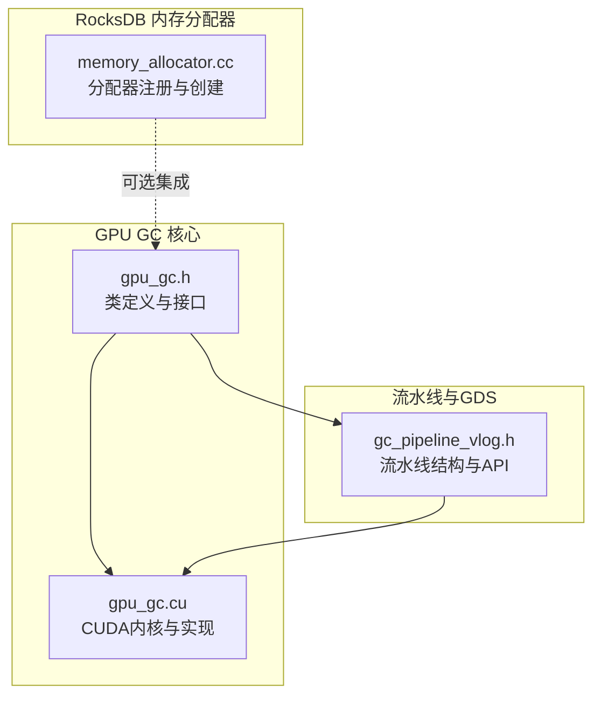
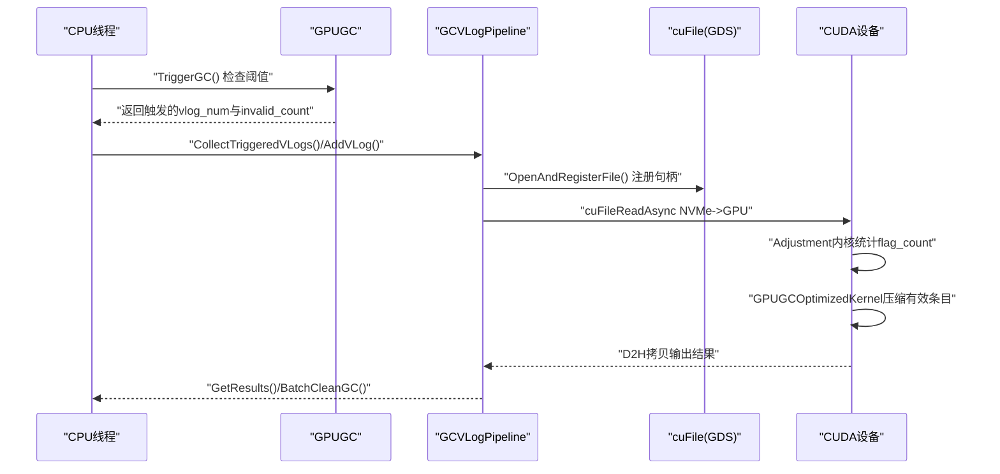
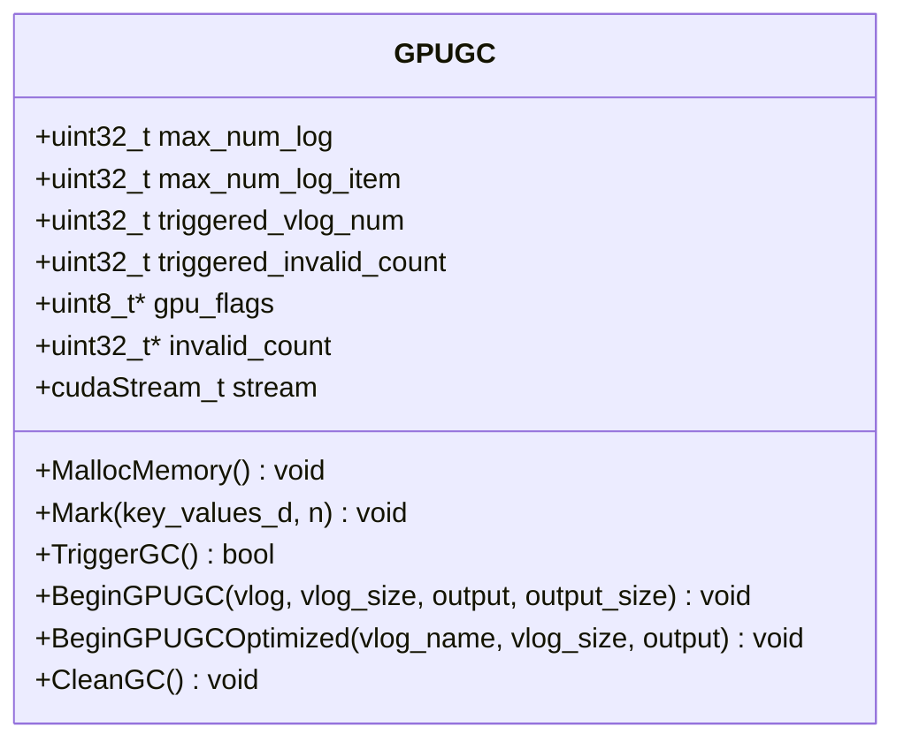
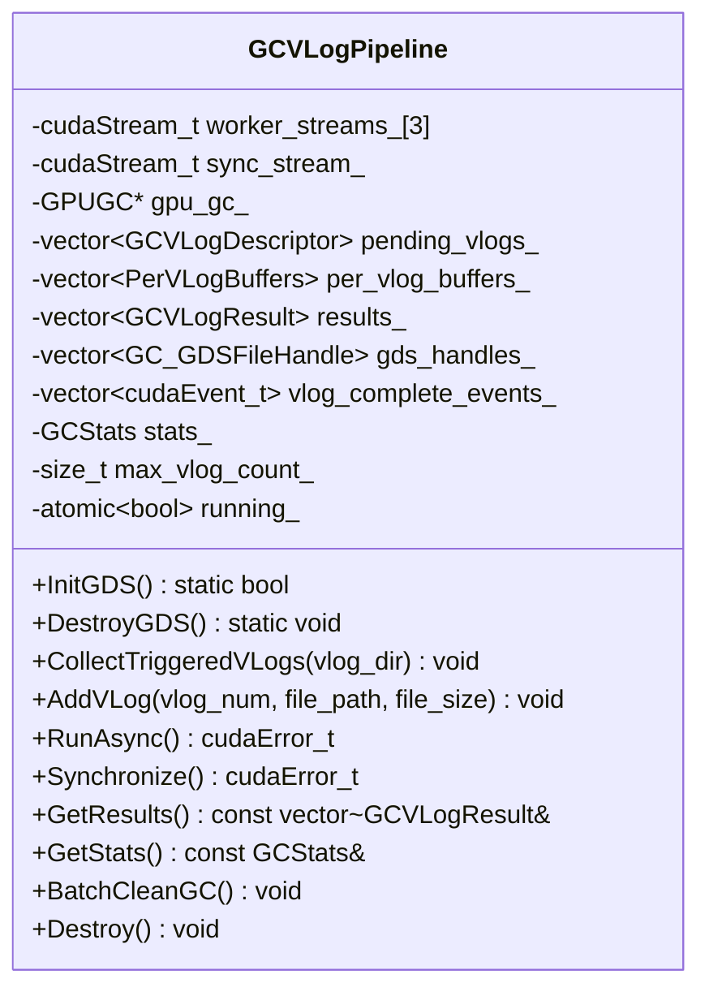
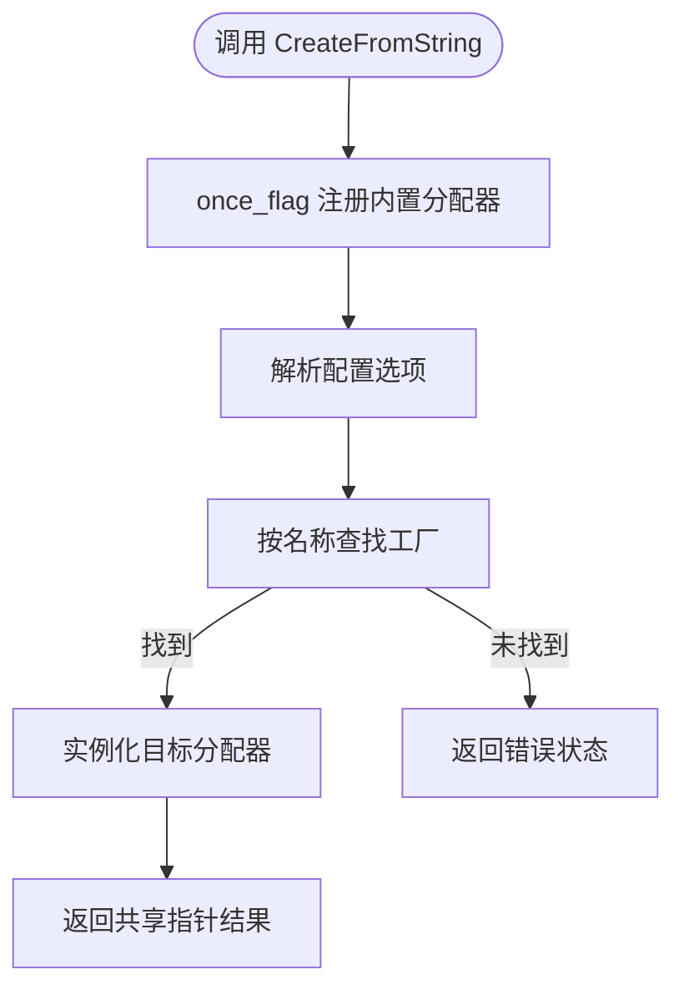
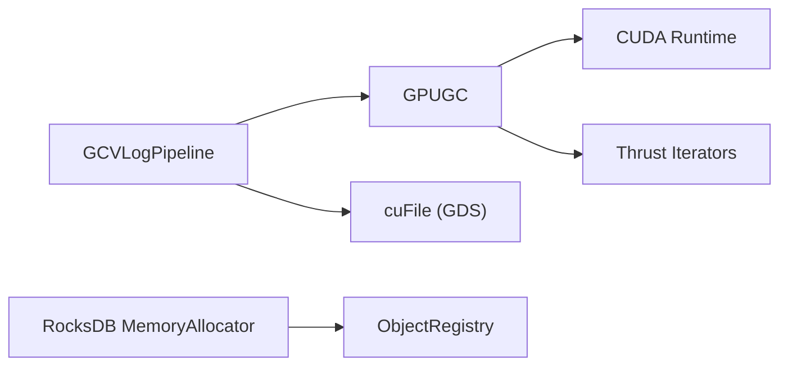

# GPU内存管理

<cite>
**本文引用的文件**   
- [gpu_gc.h](file://source/gParaKV-GC-master/db/gpu_gc.h)
- [gpu_gc.cu](file://source/gParaKV-GC-master/db/gpu_gc.cu)
- [gc_pipeline_vlog.h](file://source/gParaKV-GC-pipeline/db/cuda_pipeline_gc/gc_pipeline_vlog.h)
- [memory_allocator.cc](file://source/rocksdb/memory/memory_allocator.cc)
</cite>

## 目录
1. [引言](#引言)
2. [项目结构](#项目结构)
3. [核心组件](#核心组件)
4. [架构总览](#架构总览)
5. [详细组件分析](#详细组件分析)
6. [依赖关系分析](#依赖关系分析)
7. [性能考量](#性能考量)
8. [故障排查指南](#故障排查指南)
9. [结论](#结论)
10. [附录](#附录)

## 引言
本文件围绕GPU内存管理展开，重点覆盖：
- GPU内存分配策略与内存池管理
- H2D/D2H传输优化与零拷贝I/O
- 内存预算控制、碎片整理与泄漏防护
- 不同内存类型选择（设备内存、统一内存、pinned memory）
- 与CPU侧的同步机制和数据一致性保证
- 常见问题与解决方案（OOM、传输瓶颈等）

本项目在gParaKV-GC系列中实现了基于CUDA的垃圾回收流水线，并结合GPUDirect Storage（GDS）实现NVMe到GPU的直接读取，减少主机内存拷贝；同时提供优化的内核与统计计时，用于评估数据转移与计算开销。RocksDB侧提供了可扩展的内存分配器框架，便于接入jemalloc、memkind等高级分配器以支持更精细的内存预算与监控。

## 项目结构
- gParaKV-GC-master: 包含GPU GC核心实现（标记无效键、触发GC阈值判断、压缩有效条目），以及CUDA内核与统计接口。
- gParaKV-GC-pipeline: 引入VLog级流水线，使用多CUDA流并行处理多个VLog，结合GDS进行零拷贝I/O。
- RocksDB: 提供MemoryAllocator抽象与工厂注册，便于在不同场景切换分配器并统计内存使用。

图表来源
- [gpu_gc.h:1-53](file://source/gParaKV-GC-master/db/gpu_gc.h#L1-L53)
- [gpu_gc.cu:1-256](file://source/gParaKV-GC-master/db/gpu_gc.cu#L1-L256)
- [gc_pipeline_vlog.h:1-213](file://source/gParaKV-GC-pipeline/db/cuda_pipeline_gc/gc_pipeline_vlog.h#L1-L213)
- [memory_allocator.cc:1-82](file://source/rocksdb/memory/memory_allocator.cc#L1-L82)

章节来源
- [gpu_gc.h:1-53](file://source/gParaKV-GC-master/db/gpu_gc.h#L1-L53)
- [gpu_gc.cu:1-256](file://source/gParaKV-GC-master/db/gpu_gc.cu#L1-L256)
- [gc_pipeline_vlog.h:1-213](file://source/gParaKV-GC-pipeline/db/cuda_pipeline_gc/gc_pipeline_vlog.h#L1-L213)
- [memory_allocator.cc:1-82](file://source/rocksdb/memory/memory_allocator.cc#L1-L82)

## 核心组件
- GPUGC类：负责GPU端位图与无效计数维护、触发GC阈值判断、执行压缩内核，并提供基础与优化两种压缩路径。
- GCVLogPipeline类：封装VLog级流水线，管理多CUDA流、GDS句柄、Per-VLog缓冲区、异步执行与结果收集。
- RocksDB MemoryAllocator：提供统一的内存分配器抽象与工厂注册，支持默认、计数包装、jemalloc nodump、memkind kmem等实现。

章节来源
- [gpu_gc.h:18-53](file://source/gParaKV-GC-master/db/gpu_gc.h#L18-L53)
- [gpu_gc.cu:9-256](file://source/gParaKV-GC-master/db/gpu_gc.cu#L9-L256)
- [gc_pipeline_vlog.h:84-213](file://source/gParaKV-GC-pipeline/db/cuda_pipeline_gc/gc_pipeline_vlog.h#L84-L213)
- [memory_allocator.cc:15-82](file://source/rocksdb/memory/memory_allocator.cc#L15-L82)

## 架构总览
整体流程如下：
- CPU侧根据阈值判断需要GC的VLog编号与无效计数。
- 流水线将对应VLog通过GDS直接读入GPU，避免主机内存中转。
- GPU端执行Adjustment统计无效flag数量，再执行Compact压缩有效条目。
- 将压缩结果回传主机，更新统计信息并清理bitmap状态。

图表来源
- [gpu_gc.cu:92-119](file://source/gParaKV-GC-master/db/gpu_gc.cu#L92-L119)
- [gc_pipeline_vlog.h:119-158](file://source/gParaKV-GC-pipeline/db/cuda_pipeline_gc/gc_pipeline_vlog.h#L119-L158)

## 详细组件分析

### GPUGC类分析
职责与关键点：
- 内存分配：为gpu_flags与invalid_count分配设备内存，初始化stream。
- 标记无效键：遍历排序后的key_values_d，比较相邻键是否重复，若重复则标记flags并原子累加invalid_count。
- 触发GC：扫描invalid_count数组，使用atomicCAS确保仅一个线程进入临界区，返回触发vlog与无效计数。
- 压缩路径：
  - BeginGPUGC：基础路径，逐条检查flags并写入output_d。
  - BeginGPUGCOptimized：批量处理process_num_per_thread条记录，先Adjustment统计flag_count，再Compact压缩。
- 清理：重置invalid_count与flags段，清零triggered状态。

图表来源
- [gpu_gc.h:18-53](file://source/gParaKV-GC-master/db/gpu_gc.h#L18-L53)
- [gpu_gc.cu:9-256](file://source/gParaKV-GC-master/db/gpu_gc.cu#L9-L256)

章节来源
- [gpu_gc.h:18-53](file://source/gParaKV-GC-master/db/gpu_gc.h#L18-L53)
- [gpu_gc.cu:9-256](file://source/gParaKV-GC-master/db/gpu_gc.cu#L9-L256)

### GCVLogPipeline类分析
职责与关键点：
- 多流并行：NUM_GC_WORKER_STREAMS=3个worker流轮询分配VLog，实现VLog间I/O与计算重叠。
- GDS零拷贝：OpenAndRegisterFile打开O_DIRECT文件并注册CUfileHandle_t，cuFileReadAsync直接写入GPU缓冲。
- Per-VLog缓冲：每个VLog独立管理vlog_d、flag_count_d、global_count_d、output_d及输出大小。
- 异步流水线：RunAsync启动各VLog的完整流程（GDS读取->Adjustment->sync->Compact->D2H），Synchronize等待完成。
- 统计与清理：记录io_time_us、compute_time_us、total_bytes_read、total_valid_entries；BatchCleanGC批量清理bitmap与invalid_count。

图表来源
- [gc_pipeline_vlog.h:84-213](file://source/gParaKV-GC-pipeline/db/cuda_pipeline_gc/gc_pipeline_vlog.h#L84-L213)

章节来源
- [gc_pipeline_vlog.h:1-213](file://source/gParaKV-GC-pipeline/db/cuda_pipeline_gc/gc_pipeline_vlog.h#L1-L213)

### RocksDB内存分配器框架
- 抽象与工厂：MemoryAllocator抽象基类，通过ObjectLibrary注册具体实现（Default、Counted、JemallocNodump、MemkindKmem）。
- 动态创建：CreateFromString按名称加载指定分配器，支持配置选项与验证。
- 用途：可替换底层分配器以适配不同内存预算策略（如禁用dump、NUMA感知、统计计数）。

图表来源
- [memory_allocator.cc:15-82](file://source/rocksdb/memory/memory_allocator.cc#L15-L82)

章节来源
- [memory_allocator.cc:15-82](file://source/rocksdb/memory/memory_allocator.cc#L15-L82)

## 依赖关系分析
- GPUGC依赖CUDA运行时与thrust迭代器，使用原子操作与stream同步。
- GCVLogPipeline依赖GPUGC提供的bitmap与invalid_count，依赖cuFile库进行GDS I/O。
- RocksDB MemoryAllocator通过ObjectRegistry与OptionTypeInfo进行插件式扩展。

图表来源
- [gpu_gc.cu:1-256](file://source/gParaKV-GC-master/db/gpu_gc.cu#L1-L256)
- [gc_pipeline_vlog.h:1-213](file://source/gParaKV-GC-pipeline/db/cuda_pipeline_gc/gc_pipeline_vlog.h#L1-L213)
- [memory_allocator.cc:15-82](file://source/rocksdb/memory/memory_allocator.cc#L15-L82)

章节来源
- [gpu_gc.cu:1-256](file://source/gParaKV-GC-master/db/gpu_gc.cu#L1-L256)
- [gc_pipeline_vlog.h:1-213](file://source/gParaKV-GC-pipeline/db/cuda_pipeline_gc/gc_pipeline_vlog.h#L1-L213)
- [memory_allocator.cc:15-82](file://source/rocksdb/memory/memory_allocator.cc#L15-L82)

## 性能考量
- H2D/D2H传输优化：
  - 使用GDS零拷贝直接从NVMe读取至GPU缓冲，减少主机内存占用与拷贝延迟。
  - 在BeginGPUGCOptimized中记录data_transfer_time，量化传输耗时。
- 计算与I/O重叠：
  - 多CUDA流并行处理多个VLog，使I/O与Adjustment/Compact内核重叠。
  - 每VLog独立缓冲与事件，降低流间竞争。
- 内核粒度与批处理：
  - Adjustment与Compact采用固定块大小（如1024线程/块）与批量处理（process_num_per_thread=100），提高吞吐。
- 统计与监控：
  - 使用my_stats记录var_key_value_size、clean_threshold、data_transfer_time等关键指标，便于调优。

章节来源
- [gpu_gc.cu:190-247](file://source/gParaKV-GC-master/db/gpu_gc.cu#L190-L247)
- [gc_pipeline_vlog.h:69-76](file://source/gParaKV-GC-pipeline/db/cuda_pipeline_gc/gc_pipeline_vlog.h#L69-L76)

## 故障排查指南
- 内存不足（OOM）：
  - 检查cudaMalloc失败位置（如vlog_d、output_d、global_count_d），适当减小max_num_log_item或分批处理。
  - 使用RocksDB CountedMemoryAllocator或JemallocNodumpAllocator限制峰值内存。
- 传输瓶颈：
  - 确认cuFileReadAsync对齐要求（4KB对齐偏移与大小），避免非法访问。
  - 观察data_transfer_time与io_time_us，定位是I/O还是内核瓶颈。
- 数据一致性：
  - 确保cudaStreamSynchronize在关键步骤后调用，避免竞态。
  - atomicCAS与atomicAdd的使用需保证单写者语义，避免重复触发。
- 泄漏防护：
  - 析构函数中释放gpu_flags、invalid_count与stream；Pipeline中CloseAndDeregisterFiles与CleanupBuffers需成对调用。
  - 使用RAII与智能指针管理对象生命周期，避免裸指针泄露。

章节来源
- [gpu_gc.cu:19-23](file://source/gParaKV-GC-master/db/gpu_gc.cu#L19-L23)
- [gc_pipeline_vlog.h:167-177](file://source/gParaKV-GC-pipeline/db/cuda_pipeline_gc/gc_pipeline_vlog.h#L167-L177)
- [memory_allocator.cc:22-58](file://source/rocksdb/memory/memory_allocator.cc#L22-L58)

## 结论
本项目通过GPUGC与GCVLogPipeline实现了高效的GPU端垃圾回收流水线，结合GDS零拷贝I/O与多流并行，显著降低H2D/D2H开销并提升吞吐。RocksDB内存分配器框架为上层应用提供了灵活的内存预算与监控能力。建议在生产环境中启用统计与监控，结合工作负载特征调整clean_threshold与批处理参数，以获得最佳性能与稳定性。

## 附录
- 内存类型选择策略：
  - 设备内存（cudaMalloc）：适用于GPU内核频繁访问的数据，减少跨总线拷贝。
  - 统一内存（cudaMallocManaged）：简化编程模型，但可能带来隐式迁移开销，适合小规模或调试场景。
  - Pinned内存（cudaHostAlloc）：用于高效H2D/D2H传输，配合异步拷贝提升带宽利用率。
- 碎片整理与预算控制：
  - 定期触发GC并压缩有效条目，减少碎片；使用allocator统计与阈值控制峰值内存。
- 同步与一致性：
  - 使用stream事件与同步点确保数据就绪；原子操作保证并发安全。