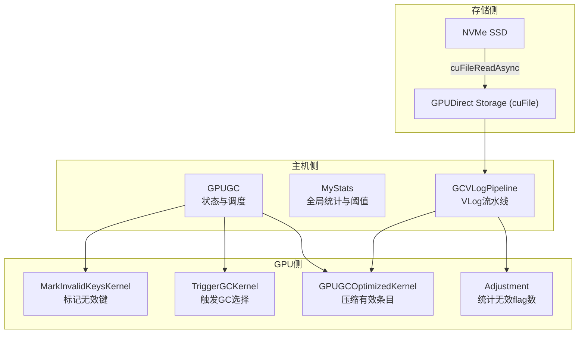
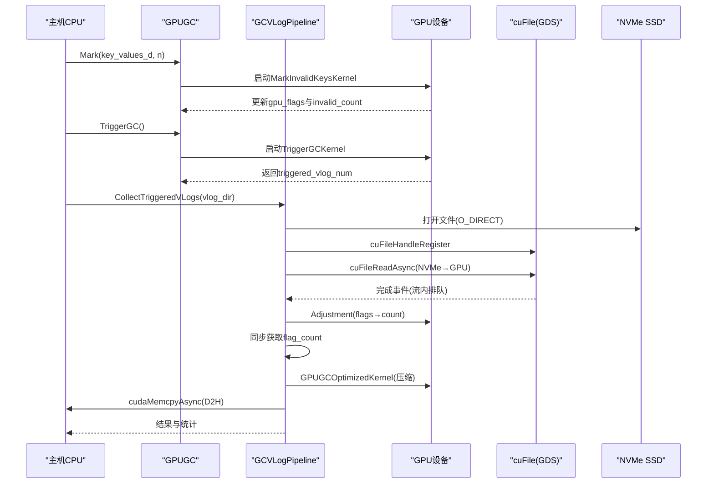
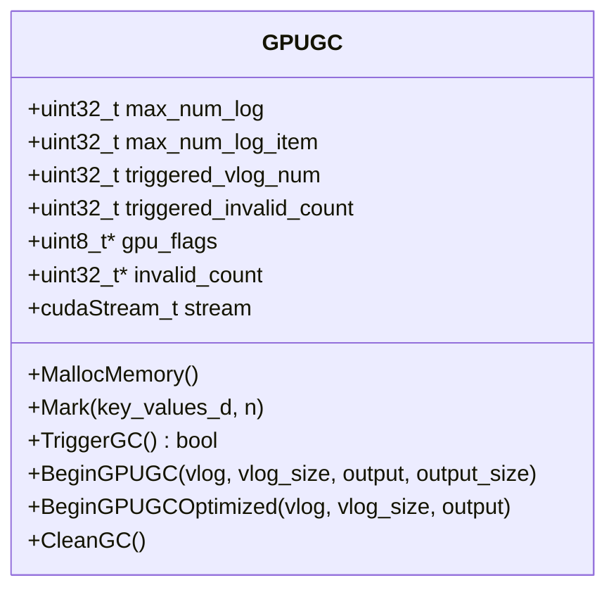
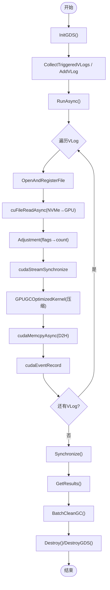
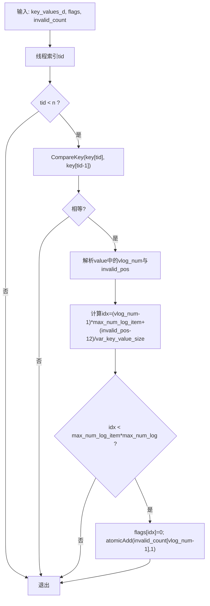
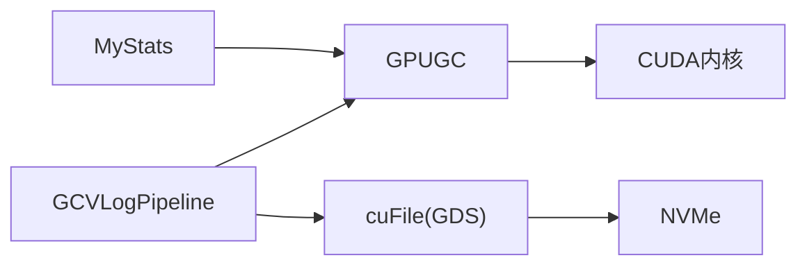

# GPU加速实现

<cite>
**本文引用的文件**   
- [gpu_gc.h](file://source/gParaKV-GC-master/db/gpu_gc.h)
- [gpu_gc.cu](file://source/gParaKV-GC-master/db/gpu_gc.cu)
- [gpu_struct.cuh](file://source/gParaKV-GC-master/db/cuda/gpu_struct.cuh)
- [gpu_coding.cuh](file://source/gParaKV-GC-master/db/cuda/gpu_coding.cuh)
- [gpu_flush_compaction.cuh](file://source/gParaKV-GC-master/db/cuda/gpu_flush_compaction.cuh)
- [gc_pipeline_vlog.h](file://source/gParaKV-GC-pipeline/db/cuda_pipeline_gc/gc_pipeline_vlog.h)
- [gc_pipeline_vlog.cu](file://source/gParaKV-GC-pipeline/db/cuda_pipeline_gc/gc_pipeline_vlog.cu)
- [my_stats.h](file://source/gParaKV-GC-master/db/my_stats.h)
</cite>

## 目录
1. [引言](#引言)
2. [项目结构](#项目结构)
3. [核心组件](#核心组件)
4. [架构总览](#架构总览)
5. [详细组件分析](#详细组件分析)
6. [依赖关系分析](#依赖关系分析)
7. [性能考量](#性能考量)
8. [故障排查指南](#故障排查指南)
9. [结论](#结论)
10. [附录](#附录)

## 引言
本文件面向GPU加速实现，聚焦于CUDA内核设计、流水线处理机制与H2D/D2H传输优化，系统阐述GPU端压缩算法、内存管理策略与并行计算优化。内容覆盖从基础概念到代码级细节，既适合CUDA初学者入门，也为有经验的开发者提供可落地的调优建议与问题定位方法。

## 项目结构
本项目围绕LevelDB风格的日志与表结构，将垃圾回收（GC）与压缩任务卸载至GPU执行，并通过GPUDirect Storage（GDS）实现NVMe到GPU显存的零拷贝I/O。关键目录与职责：
- db/cuda: CUDA工具与内核接口（编码/解码、排序、flush/compaction、GC等）
- db: 主机侧GC协调器、统计信息、数据结构定义
- cuda_pipeline_gc: VLog级流水线实现，基于多流+GDS的并行GC

图表来源 
- [gpu_gc.cu:35-65](file://source/gParaKV-GC-master/db/gpu_gc.cu#L35-L65)
- [gpu_gc.cu:67-119](file://source/gParaKV-GC-master/db/gpu_gc.cu#L67-L119)
- [gpu_gc.cu:121-168](file://source/gParaKV-GC-master/db/gpu_gc.cu#L121-L168)
- [gc_pipeline_vlog.cu:217-344](file://source/gParaKV-GC-pipeline/db/cuda_pipeline_gc/gc_pipeline_vlog.cu#L217-L344)

章节来源
- [gpu_gc.h:18-52](file://source/gParaKV-GC-master/db/gpu_gc.h#L18-L52)
- [gpu_gc.cu:9-23](file://source/gParaKV-GC-master/db/gpu_gc.cu#L9-L23)
- [gc_pipeline_vlog.h:84-212](file://source/gParaKV-GC-pipeline/db/cuda_pipeline_gc/gc_pipeline_vlog.h#L84-L212)

## 核心组件
- GPUGC：维护GPU端位图（flags）、每个vlog的无效计数、触发条件与基本压缩流程；提供内存分配、标记、触发、压缩与清理接口。
- GCVLogPipeline：VLog级流水线，使用多CUDA流与GDS异步I/O，对多个VLog并行执行“读取→调整→压缩→回传”的流水线。
- MyStats：全局统计与配置参数（如clean_threshold、var_key_value_size、max_num_log_item等），贯穿内核与主机逻辑。
- CUDA工具库：编码/解码、结构体定义、flush/compaction辅助函数，为GC与压缩提供底层能力。

章节来源
- [gpu_gc.h:18-52](file://source/gParaKV-GC-master/db/gpu_gc.h#L18-L52)
- [gpu_gc.cu:56-65](file://source/gParaKV-GC-master/db/gpu_gc.cu#L56-L65)
- [gc_pipeline_vlog.h:84-212](file://source/gParaKV-GC-pipeline/db/cuda_pipeline_gc/gc_pipeline_vlog.h#L84-L212)
- [my_stats.h:16-62](file://source/gParaKV-GC-master/db/my_stats.h#L16-L62)

## 架构总览
整体数据与控制流如下：
- 主机侧通过GPUGC在GPU上标记无效键并统计每个vlog的无效数量。
- 当某vlog的无效计数超过阈值时，由GCVLogPipeline收集该vlog，使用GDS直接从NVMe读入GPU显存。
- 在GPU上执行Adjustment统计无效flag数量，随后用GPUGCOptimizedKernel进行压缩，最后D2H回主机。
- 多流轮询分配VLog，实现不同VLog间的I/O与计算重叠，最大化吞吐。

图表来源 
- [gpu_gc.cu:35-65](file://source/gParaKV-GC-master/db/gpu_gc.cu#L35-L65)
- [gpu_gc.cu:67-119](file://source/gParaKV-GC-master/db/gpu_gc.cu#L67-L119)
- [gc_pipeline_vlog.cu:217-344](file://source/gParaKV-GC-pipeline/db/cuda_pipeline_gc/gc_pipeline_vlog.cu#L217-L344)

## 详细组件分析

### GPUGC：GPU端GC协调器
- 内存管理：
  - 分配gpu_flags（位图）与invalid_count（每vlog无效计数），初始化stream。
  - 析构释放资源。
- 标记无效键：
  - MarkInvalidKeysKernel比较相邻键值，若重复则标记对应位置flags=0，原子累加invalid_count。
- 触发GC：
  - TriggerGCKernel使用atomicCAS确保仅一个线程成功选择待清理vlog，并返回当前无效计数。
- 压缩输出：
  - BeginGPUGC/GPUGCOptimizedKernel根据flags过滤有效条目，生成压缩后的输出缓冲区。
- 清理状态：
  - CleanGC重置invalid_count与flags段，清空触发状态。

图表来源 
- [gpu_gc.h:18-52](file://source/gParaKV-GC-master/db/gpu_gc.h#L18-L52)
- [gpu_gc.cu:9-23](file://source/gParaKV-GC-master/db/gpu_gc.cu#L9-L23)

章节来源
- [gpu_gc.cu:35-65](file://source/gParaKV-GC-master/db/gpu_gc.cu#L35-L65)
- [gpu_gc.cu:67-119](file://source/gParaKV-GC-master/db/gpu_gc.cu#L67-L119)
- [gpu_gc.cu:121-168](file://source/gParaKV-GC-master/db/gpu_gc.cu#L121-L168)
- [gpu_gc.cu:170-247](file://source/gParaKV-GC-master/db/gpu_gc.cu#L170-L247)
- [gpu_gc.cu:249-255](file://source/gParaKV-GC-master/db/gpu_gc.cu#L249-L255)

### GCVLogPipeline：VLog级流水线
- 设计要点：
  - 使用3路worker流轮询分配VLog，实现跨VLog的I/O与计算重叠。
  - 通过cuFileReadAsync实现NVMe到GPU显存的直通读取，绕过CPU缓冲。
  - 每个VLog的处理顺序：GDS读取→Adjustment→中间同步→Compact→D2H。
- 生命周期：
  - InitGDS/DestroyGDS进程级初始化与销毁。
  - CollectTriggeredVLogs或AddVLog添加待处理队列。
  - RunAsync异步启动，Synchronize等待完成，GetResults获取结果，BatchCleanGC批量清理。
- 关键实现：
  - OpenAndRegisterFile以O_DIRECT打开并注册GDS句柄。
  - ProcessSingleVLogAsync在指定流上执行完整流水线。
  - CleanupBuffers与CloseAndDeregisterFiles负责资源释放。

图表来源 
- [gc_pipeline_vlog.h:84-212](file://source/gParaKV-GC-pipeline/db/cuda_pipeline_gc/gc_pipeline_vlog.h#L84-L212)
- [gc_pipeline_vlog.cu:217-344](file://source/gParaKV-GC-pipeline/db/cuda_pipeline_gc/gc_pipeline_vlog.cu#L217-L344)

章节来源
- [gc_pipeline_vlog.h:84-212](file://source/gParaKV-GC-pipeline/db/cuda_pipeline_gc/gc_pipeline_vlog.h#L84-L212)
- [gc_pipeline_vlog.cu:52-73](file://source/gParaKV-GC-pipeline/db/cuda_pipeline_gc/gc_pipeline_vlog.cu#L52-L73)
- [gc_pipeline_vlog.cu:102-142](file://source/gParaKV-GC-pipeline/db/cuda_pipeline_gc/gc_pipeline_vlog.cu#L102-L142)
- [gc_pipeline_vlog.cu:174-210](file://source/gParaKV-GC-pipeline/db/cuda_pipeline_gc/gc_pipeline_vlog.cu#L174-L210)
- [gc_pipeline_vlog.cu:217-344](file://source/gParaKV-GC-pipeline/db/cuda_pipeline_gc/gc_pipeline_vlog.cu#L217-L344)
- [gc_pipeline_vlog.cu:350-402](file://source/gParaKV-GC-pipeline/db/cuda_pipeline_gc/gc_pipeline_vlog.cu#L350-L402)
- [gc_pipeline_vlog.cu:408-427](file://source/gParaKV-GC-pipeline/db/cuda_pipeline_gc/gc_pipeline_vlog.cu#L408-L427)
- [gc_pipeline_vlog.cu:433-458](file://source/gParaKV-GC-pipeline/db/cuda_pipeline_gc/gc_pipeline_vlog.cu#L433-L458)
- [gc_pipeline_vlog.cu:464-474](file://source/gParaKV-GC-pipeline/db/cuda_pipeline_gc/gc_pipeline_vlog.cu#L464-L474)
- [gc_pipeline_vlog.cu:480-504](file://source/gParaKV-GC-pipeline/db/cuda_pipeline_gc/gc_pipeline_vlog.cu#L480-L504)
- [gc_pipeline_vlog.cu:510-526](file://source/gParaKV-GC-pipeline/db/cuda_pipeline_gc/gc_pipeline_vlog.cu#L510-L526)

### CUDA内核与数据处理
- MarkInvalidKeysKernel：逐条比较相邻键值，若相同则标记flags=0并原子累加invalid_count。
- TriggerGCKernel：使用atomicCAS选择首个达到阈值的vlog，避免竞争。
- Adjustment：统计flags中值为0的数量，用于计算输出大小。
- GPUGCOptimizedKernel：按flags过滤有效条目，原子写入输出缓冲区。

图表来源 
- [gpu_gc.cu:35-54](file://source/gParaKV-GC-master/db/gpu_gc.cu#L35-L54)

章节来源
- [gpu_gc.cu:35-65](file://source/gParaKV-GC-master/db/gpu_gc.cu#L35-L65)
- [gpu_gc.cu:67-119](file://source/gParaKV-GC-master/db/gpu_gc.cu#L67-L119)
- [gpu_gc.cu:121-168](file://source/gParaKV-GC-master/db/gpu_gc.cu#L121-L168)
- [gpu_gc.cu:170-247](file://source/gParaKV-GC-master/db/gpu_gc.cu#L170-L247)

### 数据结构与工具
- SSTableInfo、GPUBlockHandle、InputFile：描述SSTable元数据、块句柄与输入文件信息。
- 编码/解码工具：GPUEncodeVarint32、GPUDecodeFixed32等，供GPU端序列化/反序列化使用。
- flush/compaction接口：CUDAFree、ReleaseSource、EncodePrepare、GPUFlush等。

章节来源
- [gpu_struct.cuh:37-86](file://source/gParaKV-GC-master/db/cuda/gpu_struct.cuh#L37-L86)
- [gpu_coding.cuh:27-79](file://source/gParaKV-GC-master/db/cuda/gpu_coding.cuh#L27-L79)
- [gpu_flush_compaction.cuh:11-24](file://source/gParaKV-GC-master/db/cuda/gpu_flush_compaction.cuh#L11-L24)

## 依赖关系分析
- GPUGC依赖CUDA运行时与统计模块（my_stats），用于阈值判断与计时。
- GCVLogPipeline依赖GPUGC提供的flags与invalid_count，以及cuFile驱动进行GDS I/O。
- 内核之间通过共享的flags与invalid_count进行状态同步，避免锁竞争。

图表来源 
- [my_stats.h:16-62](file://source/gParaKV-GC-master/db/my_stats.h#L16-L62)
- [gpu_gc.h:18-52](file://source/gParaKV-GC-master/db/gpu_gc.h#L18-L52)
- [gc_pipeline_vlog.h:84-212](file://source/gParaKV-GC-pipeline/db/cuda_pipeline_gc/gc_pipeline_vlog.h#L84-L212)

章节来源
- [my_stats.h:16-62](file://source/gParaKV-GC-master/db/my_stats.h#L16-L62)
- [gpu_gc.h:18-52](file://source/gParaKV-GC-master/db/gpu_gc.h#L18-L52)
- [gc_pipeline_vlog.h:84-212](file://source/gParaKV-GC-pipeline/db/cuda_pipeline_gc/gc_pipeline_vlog.h#L84-L212)

## 性能考量
- 流水线并行：
  - 3路worker流轮询分配VLog，减少单流瓶颈，提升吞吐。
- I/O与计算重叠：
  - GDS直接读取到GPU显存，避免CPU缓冲拷贝；Adjustment与Compact在流内排队，自动等待IO完成。
- 原子操作与同步点：
  - TriggerGCKernel使用atomicCAS避免竞争；Adjustment后必须同步以获取flag_count，这是不可避免的同步点。
- 内存对齐与越界保护：
  - GDS要求4KB对齐；针对libcufile已知bug，额外分配64KB padding吸收越界写入。
- 线程块与网格配置：
  - 合理设置threadsPerBlock与blocksPerGrid，平衡占用率与延迟。

[本节为通用指导，不直接分析具体文件]

## 故障排查指南
- GDS驱动初始化失败：
  - 检查cuFileDriverOpen返回值，确认驱动版本与权限。
- O_DIRECT打开失败：
  - 确认文件系统支持O_DIRECT，路径正确且文件存在。
- cuFileReadAsync错误：
  - 核对对齐要求（偏移与大小需4KB对齐），检查流是否有效。
- 输出大小异常：
  - 若output_size > file_size，说明flag_count统计异常，需检查flags一致性。
- 越界写入风险：
  - 针对libcufile bug，确保为vlog_d分配额外padding（64KB）。
- 同步点阻塞：
  - Adjustment后必须同步，避免后续步骤依赖未就绪数据。

章节来源
- [gc_pipeline_vlog.cu:52-73](file://source/gParaKV-GC-pipeline/db/cuda_pipeline_gc/gc_pipeline_vlog.cu#L52-L73)
- [gc_pipeline_vlog.cu:174-210](file://source/gParaKV-GC-pipeline/db/cuda_pipeline_gc/gc_pipeline_vlog.cu#L174-L210)
- [gc_pipeline_vlog.cu:217-344](file://source/gParaKV-GC-pipeline/db/cuda_pipeline_gc/gc_pipeline_vlog.cu#L217-L344)

## 结论
本项目通过GPUGC与GCVLogPipeline协同，实现了高效的GPU加速GC与压缩流程。利用GDS零拷贝I/O、多流并行与内核级原子操作，显著提升了吞吐与资源利用率。对于初学者，建议从内核逻辑与数据流入手；对于资深开发者，可进一步探索流调度、内存布局与驱动层优化。

[本节为总结性内容，不直接分析具体文件]

## 附录
- 配置与参数：
  - clean_threshold：触发GC的无效计数阈值。
  - var_key_value_size：每条KV记录的有效数据大小。
  - max_num_log_item：单个vlog的最大条目数。
  - NUM_GC_WORKER_STREAMS：流水线worker流数量（默认3）。
- 最佳实践：
  - 优先使用GDS进行大文件I/O，减少CPU参与。
  - 合理划分线程块，避免过度细粒度导致调度开销。
  - 谨慎使用原子操作，仅在必要处（如invalid_count、global_count）使用。
  - 监控统计指标（io_time_us、compute_time_us、total_bytes_read、total_valid_entries）定位瓶颈。

章节来源
- [my_stats.h:16-62](file://source/gParaKV-GC-master/db/my_stats.h#L16-L62)
- [gc_pipeline_vlog.h:30-41](file://source/gParaKV-GC-pipeline/db/cuda_pipeline_gc/gc_pipeline_vlog.h#L30-L41)