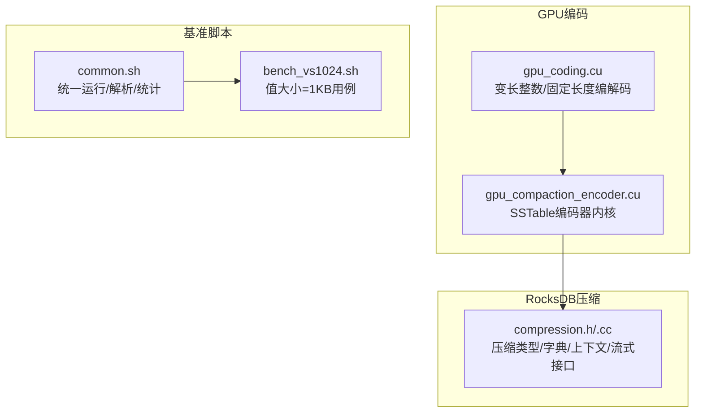
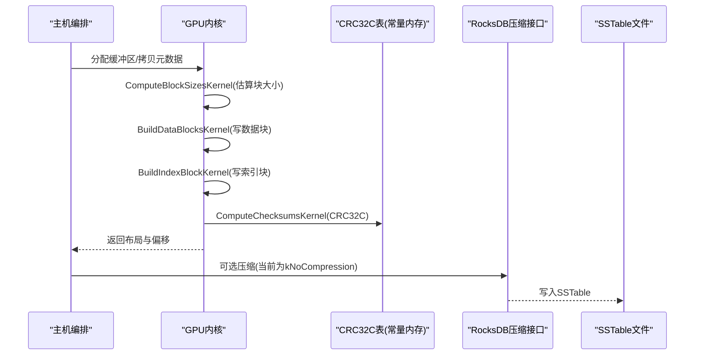
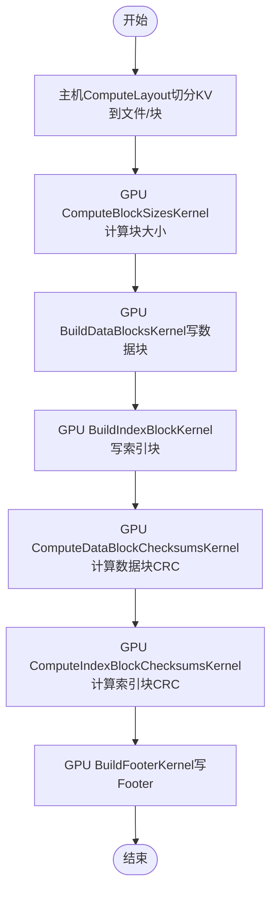
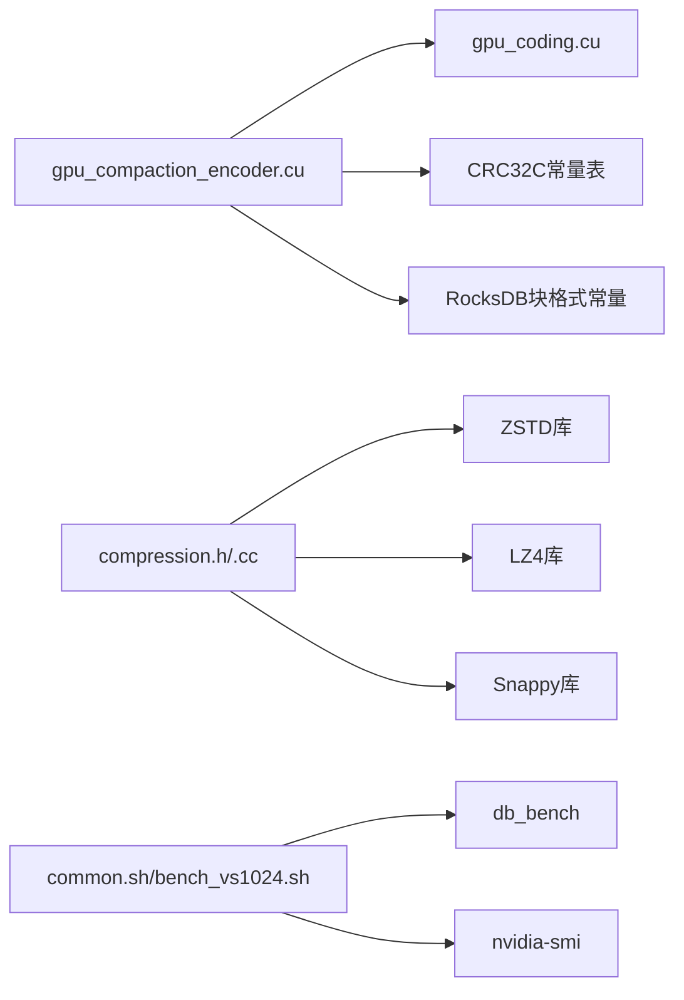

# GPU压缩算法

<cite>
**本文引用的文件**   
- [gpu_coding.cu](file://source/gParaKV-GC-master/db/cuda/gpu_coding.cu)
- [gpu_coding.cu](file://source/gParaKV-GC-pipeline/db/cuda/gpu_coding.cu)
- [gpu_compaction_encoder.cu](file://source/rocksdb-flush-wal-0.2/db/cuda/gpu_compaction_encoder.cu)
- [compression.h](file://source/rocksdb/util/compression.h)
- [compression.cc](file://source/rocksdb/util/compression.cc)
- [common.sh](file://script/common.sh)
- [bench_vs1024.sh](file://script/bench_vs1024.sh)
</cite>

## 目录
1. [简介](#简介)
2. [项目结构](#项目结构)
3. [核心组件](#核心组件)
4. [架构总览](#架构总览)
5. [详细组件分析](#详细组件分析)
6. [依赖关系分析](#依赖关系分析)
7. [性能考量](#性能考量)
8. [故障排查指南](#故障排查指南)
9. [结论](#结论)
10. [附录](#附录)

## 简介
本文件面向GPU侧的压缩与编码能力，结合代码库中的CUDA实现与RocksDB压缩框架，系统阐述：
- 多种压缩算法（Snappy、LZ4、ZSTD）在CPU侧的支持与集成方式
- GPU侧SSTable编码器与变长整数编解码的并行化设计
- 压缩字典构建与查找表优化（CRC32C常量内存表、ZSTD字典）
- 分支预测优化与流水线式处理思路
- 不同压缩算法的性能特征、适用场景与选择策略
- 基准测试脚本与结果组织方式
- 压缩率与速度的权衡及自适应压缩策略建议
- 调试方法与常见问题的定位技巧

## 项目结构
仓库包含多个子工程与脚本：
- gParaKV-GC系列：提供GPU侧编码与编解码基础函数（如变长整数编码、固定长度读写等）
- rocksdb-flush-wal-0.2：GPU SSTable编码器实现（数据块、索引块、尾部校验、布局计算）
- rocksdb：标准压缩接口、字典支持、流式压缩/解压抽象
- script：基准测试脚本，统一参数与输出格式

图表来源 
- [gpu_coding.cu:1-209](file://source/gParaKV-GC-master/db/cuda/gpu_coding.cu#L1-L209)
- [gpu_compaction_encoder.cu:1-800](file://source/rocksdb-flush-wal-0.2/db/cuda/gpu_compaction_encoder.cu#L1-L800)
- [compression.h:1-729](file://source/rocksdb/util/compression.h#L1-L729)
- [compression.cc:1-200](file://source/rocksdb/util/compression.cc#L1-L200)
- [common.sh:1-196](file://script/common.sh#L1-L196)
- [bench_vs1024.sh:1-10](file://script/bench_vs1024.sh#L1-L10)

章节来源
- [gpu_coding.cu:1-209](file://source/gParaKV-GC-master/db/cuda/gpu_coding.cu#L1-L209)
- [gpu_compaction_encoder.cu:1-800](file://source/rocksdb-flush-wal-0.2/db/cuda/gpu_compaction_encoder.cu#L1-L800)
- [compression.h:1-729](file://source/rocksdb/util/compression.h#L1-L729)
- [compression.cc:1-200](file://source/rocksdb/util/compression.cc#L1-L200)
- [common.sh:1-196](file://script/common.sh#L1-L196)
- [bench_vs1024.sh:1-10](file://script/bench_vs1024.sh#L1-L10)

## 核心组件
- GPU变长整数与固定长度编解码：提供高效的__host__/__device__函数，用于键值元数据与BlockHandle等结构的紧凑编码。
- GPU SSTable编码器：将排序后的KV对并行写入RocksDB BlockBasedTable格式，包括数据块、索引块、元索引块、Footer与CRC32C校验。
- RocksDB压缩框架：定义压缩类型、字典管理、上下文缓存、流式压缩/解压接口，并暴露各算法支持检测。
- 基准脚本：统一执行fillrandom/readrandom，解析ops/sec与us/op，生成JSON报告。

章节来源
- [gpu_coding.cu:1-209](file://source/gParaKV-GC-master/db/cuda/gpu_coding.cu#L1-L209)
- [gpu_compaction_encoder.cu:1-800](file://source/rocksdb-flush-wal-0.2/db/cuda/gpu_compaction_encoder.cu#L1-L800)
- [compression.h:1-729](file://source/rocksdb/util/compression.h#L1-L729)
- [compression.cc:1-200](file://source/rocksdb/util/compression.cc#L1-L200)
- [common.sh:1-196](file://script/common.sh#L1-L196)

## 架构总览
GPU侧编码器负责将排序好的KV对按RocksDB块格式写出；压缩层通过RocksDB压缩接口在CPU侧完成（当前GPU编码器默认无压缩）。字典与查找表在设备端以常量内存或主机端预计算形式使用，减少访存与分支开销。

图表来源 
- [gpu_compaction_encoder.cu:233-563](file://source/rocksdb-flush-wal-0.2/db/cuda/gpu_compaction_encoder.cu#L233-L563)
- [compression.h:462-511](file://source/rocksdb/util/compression.h#L462-L511)

## 详细组件分析

### GPU变长整数与固定长度编解码
- 功能要点
  - 提供GPUEncodeVarint32/GPUEncodeVarint64与对应的解码函数，采用7位编码+最高位标志，适合频繁出现的小整数字段。
  - 提供Fixed8/16/32/64的打包与解包，避免条件分支，利于向量化与流水线。
  - 提供批量写入辅助函数，减少重复逻辑。
- 复杂度与优化
  - Varint编码时间复杂度O(log v)，空间占用随数值分布变化；对小值有显著节省。
  - 固定长度写入使用memcpy/直接赋值，分支少，吞吐高。
- 适用场景
  - 键前缀共享长度、值长度、BlockHandle偏移/长度等小整数字段。

章节来源
- [gpu_coding.cu:8-209](file://source/gParaKV-GC-master/db/cuda/gpu_coding.cu#L8-L209)
- [gpu_coding.cu:1-209](file://source/gParaKV-GC-pipeline/db/cuda/gpu_coding.cu#L1-L209)

### GPU SSTable编码器
- 功能要点
  - 计算每个块的精确编码大小（ComputeBlockSizesKernel），随后并行写入数据块（BuildDataBlocksKernel）、索引块（BuildIndexBlockKernel）。
  - 计算CRC32C校验（ComputeDataBlockChecksumsKernel/ComputeIndexBlockChecksumsKernel），写入trailer。
  - 构建Footer（BuildFooterKernel），包含checksum类型、metaindex/index handle、format version与magic number。
  - 主机侧ComputeLayout根据目标块大小与最大文件大小切分KV到多文件多块。
- 数据结构
  - BlockMeta：记录块内KV起始索引、数量、所属文件与块序号。
  - FileLayout：记录文件级布局信息（偏移、大小、索引/元索引位置、Footer位置等）。
- 关键优化
  - CRC32C查找表驻留常量内存，降低访存延迟。
  - 每块一个线程或每文件一个线程，充分利用并行度。
  - 键前缀共享长度计算减少冗余写入。
- 错误处理
  - 空块仍保留重启点；文件尺寸限制触发时确保不产生空文件导致死循环。

图表来源 
- [gpu_compaction_encoder.cu:233-563](file://source/rocksdb-flush-wal-0.2/db/cuda/gpu_compaction_encoder.cu#L233-L563)

章节来源
- [gpu_compaction_encoder.cu:200-800](file://source/rocksdb-flush-wal-0.2/db/cuda/gpu_compaction_encoder.cu#L200-L800)

### RocksDB压缩框架与字典
- 压缩类型与支持检测
  - 提供Snappy/LZ4/ZSTD等算法支持检测宏与API。
  - DictCompressionTypeSupported指明哪些算法支持字典（如LZ4 r124+、ZSTD）。
- 字典与上下文
  - CompressionDict封装ZSTD CDict与原始字典字符串。
  - CompressionContext/UncompressionContext管理压缩/解压上下文，支持ZSTD流式参数设置。
- 流式压缩/解压
  - StreamingCompress/StreamingUncompress抽象，当前实现以ZSTD为主。
- 与GPU编码器的关系
  - 当前GPU编码器写入kNoCompression，压缩由CPU侧RocksDB路径处理；未来可考虑GPU侧调用ZSTD/LZ4/Snappy核函数。

章节来源
- [compression.h:392-511](file://source/rocksdb/util/compression.h#L392-L511)
- [compression.h:215-290](file://source/rocksdb/util/compression.h#L215-L290)
- [compression.h:292-361](file://source/rocksdb/util/compression.h#L292-L361)
- [compression.cc:158-189](file://source/rocksdb/util/compression.cc#L158-L189)

### 基准测试与结果组织
- 脚本职责
  - common.sh统一参数（key_size、value_size、threads、compression_type等），执行fillrandom/readrandom，解析ops/sec与us/op，计算MB/s，收集硬件信息，输出JSON。
  - bench_vs1024.sh针对value_size=1024B的专用用例。
- 指标
  - fill/read吞吐量(MB/s)、延迟(us/op)、尾延迟、空间放大系数、GPU利用率与显存占用。

章节来源
- [common.sh:1-196](file://script/common.sh#L1-L196)
- [bench_vs1024.sh:1-10](file://script/bench_vs1024.sh#L1-L10)

## 依赖关系分析
- GPU编码器依赖：
  - 变长整数与固定长度编解码（gpu_coding.cu）
  - CRC32C查找表（常量内存）
  - RocksDB块格式常量（footer版本、magic、trailer大小等）
- 压缩框架依赖：
  - 编译期宏控制算法可用性（SNAPPY/LZ4/ZSTD等）
  - ZSTD上下文与字典对象生命周期管理
- 基准脚本依赖：
  - db_bench二进制与环境变量（LD_LIBRARY_PATH）
  - nvidia-smi采集GPU状态

图表来源 
- [gpu_compaction_encoder.cu:1-800](file://source/rocksdb-flush-wal-0.2/db/cuda/gpu_compaction_encoder.cu#L1-L800)
- [gpu_coding.cu:1-209](file://source/gParaKV-GC-master/db/cuda/gpu_coding.cu#L1-L209)
- [compression.h:392-511](file://source/rocksdb/util/compression.h#L392-L511)
- [compression.cc:158-189](file://source/rocksdb/util/compression.cc#L158-L189)
- [common.sh:1-196](file://script/common.sh#L1-L196)
- [bench_vs1024.sh:1-10](file://script/bench_vs1024.sh#L1-L10)

章节来源
- [gpu_compaction_encoder.cu:1-800](file://source/rocksdb-flush-wal-0.2/db/cuda/gpu_compaction_encoder.cu#L1-L800)
- [gpu_coding.cu:1-209](file://source/gParaKV-GC-master/db/cuda/gpu_coding.cu#L1-L209)
- [compression.h:392-511](file://source/rocksdb/util/compression.h#L392-L511)
- [compression.cc:158-189](file://source/rocksdb/util/compression.cc#L158-L189)
- [common.sh:1-196](file://script/common.sh#L1-L196)
- [bench_vs1024.sh:1-10](file://script/bench_vs1024.sh#L1-L10)

## 性能考量
- 编解码
  - Varint在小值场景下显著节省空间；固定长度写入避免分支，提升吞吐。
- 并行粒度
  - 每块/每文件线程映射，最大化SM利用率；注意块大小与线程数匹配。
- 内存访问
  - CRC32C查找表常驻常量内存，减少全局访存；键前缀共享减少重复拷贝。
- 压缩算法选择
  - Snappy：速度优先，压缩率低，适合读多写多且带宽敏感场景。
  - LZ4/LZ4HC：速度与压缩率折中，适合通用场景；r124+支持字典。
  - ZSTD：压缩率高，支持字典与流式压缩，适合存储成本敏感场景。
- 字典与上下文
  - ZSTD CDict可显著提升压缩速度；上下文复用减少创建销毁开销。
- 流水线
  - 先计算块大小，再并行写块与索引，最后计算校验，避免回写与重算。

[本节为通用指导，无需具体文件引用]

## 故障排查指南
- 块大小计算异常
  - 检查重启点计数与空块处理逻辑；确认block_restart_interval配置。
- CRC不一致
  - 核对CRC32C查找表初始化与常量内存拷贝；确认trailer字节序与mask。
- 文件布局死循环
  - 当达到max_file_size时，需确保至少消费一个KV才推进kv_idx，避免空文件。
- 压缩不可用
  - 检查编译宏（SNAPPY/LZ4/ZSTD）与库链接；确认CompressionTypeSupported返回值。
- 基准脚本失败
  - 确认db_bench路径与LD_LIBRARY_PATH；检查nvidia-smi可用性与输出格式。

章节来源
- [gpu_compaction_encoder.cu:569-651](file://source/rocksdb-flush-wal-0.2/db/cuda/gpu_compaction_encoder.cu#L569-L651)
- [compression.h:462-511](file://source/rocksdb/util/compression.h#L462-L511)
- [common.sh:1-196](file://script/common.sh#L1-L196)

## 结论
- 当前GPU编码器专注于高效写出RocksDB块格式，压缩由CPU侧RocksDB框架承担；变长整数与CRC32C查找表优化已落地。
- 若需GPU侧压缩，可基于现有框架扩展ZSTD/LZ4/Snappy核函数，并结合字典与上下文缓存实现高性能。
- 基准脚本提供了统一的评估入口，便于对比不同压缩算法与参数组合的效果。

[本节为总结性内容，无需具体文件引用]

## 附录
- 压缩率与速度权衡
  - 低压缩率（Snappy/LZ4）：高吞吐、低CPU占用，适合热点读与高并发。
  - 高压缩率（ZSTD）：节省存储、降低IO压力，适合冷数据与容量受限环境。
- 自适应压缩策略建议
  - 按数据冷热分层：热数据使用快速压缩（LZ4/Snappy），冷数据使用高压缩比（ZSTD）。
  - 动态调整块大小与restart_interval，平衡随机读延迟与压缩效率。
  - 利用ZSTD字典训练集，针对领域数据提升压缩速度与比率。
- 调试方法
  - 打印块大小与偏移，验证布局一致性。
  - 使用nvidia-smi采样GPU利用率与显存，定位瓶颈。
  - 逐步关闭压缩，隔离问题来源。

[本节为通用指导，无需具体文件引用]