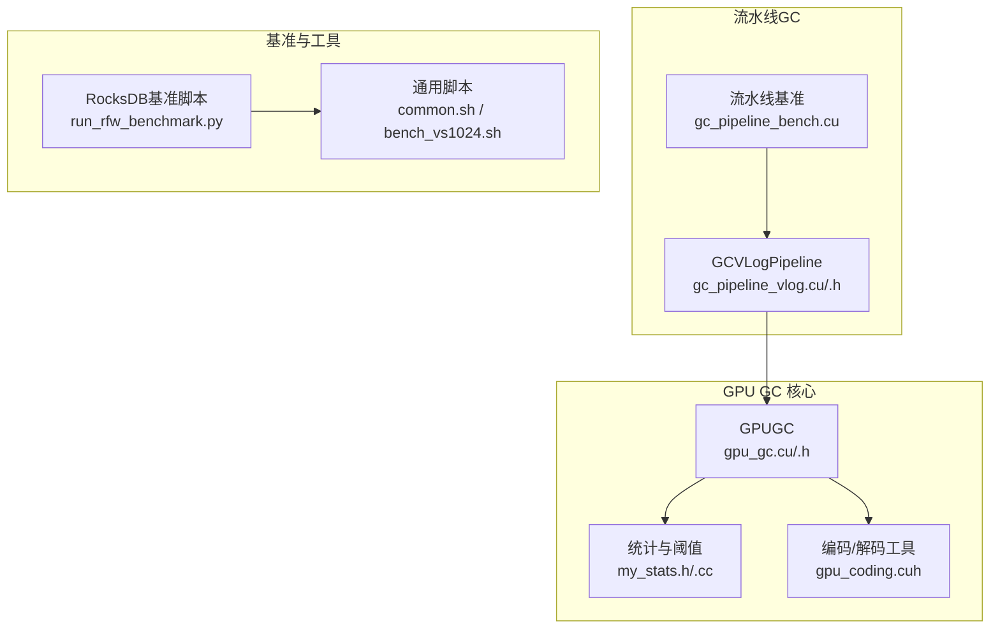
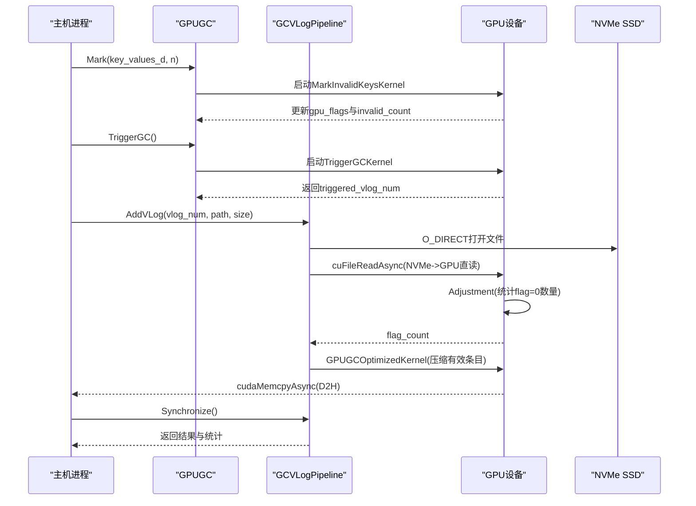
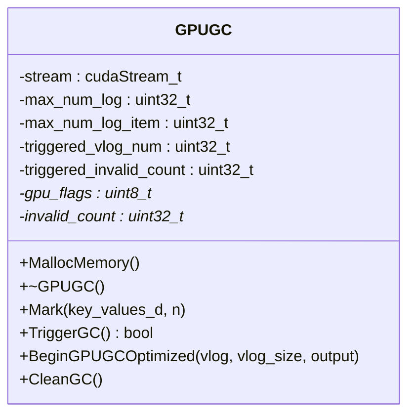
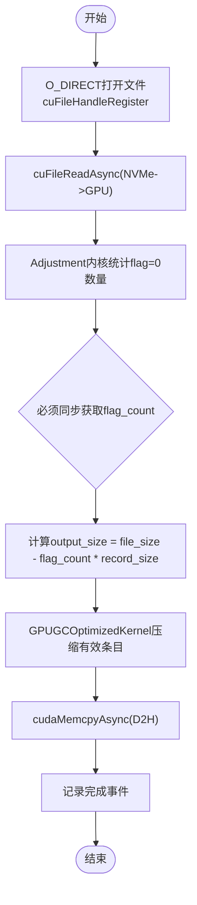
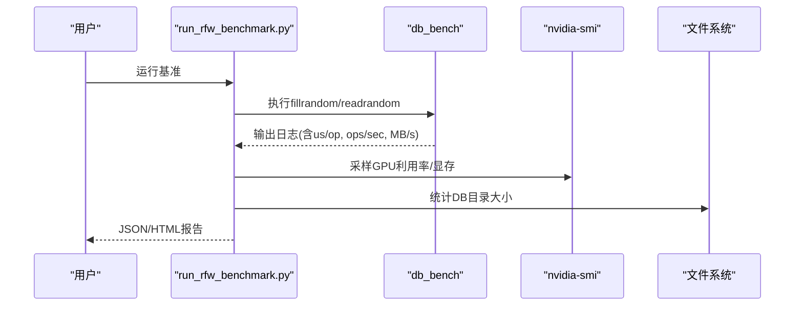
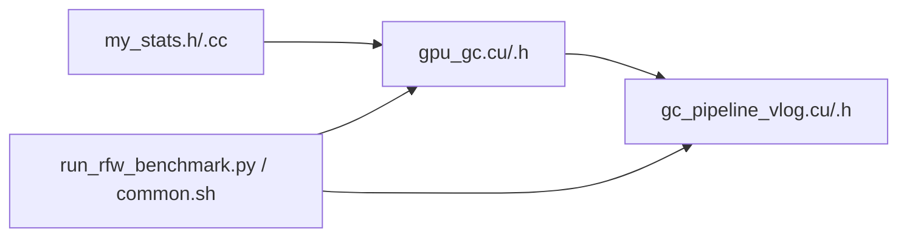

# 性能优化技术

<cite>
**本文引用的文件**   
- [gpu_gc.cu](file://source/gParaKV-GC-master/db/gpu_gc.cu)
- [gpu_gc.h](file://source/gParaKV-GC-master/db/gpu_gc.h)
- [my_stats.h](file://source/gParaKV-GC-master/db/my_stats.h)
- [my_stats.cc](file://source/gParaKV-GC-master/db/my_stats.cc)
- [gpu_coding.cuh](file://source/gParaKV-GC-master/db/cuda/gpu_coding.cuh)
- [gc_pipeline_bench.cu](file://source/gParaKV-GC-pipeline/db/cuda_pipeline_gc/gc_pipeline_bench.cu)
- [gc_pipeline_vlog.cu](file://source/gParaKV-GC-pipeline/db/cuda_pipeline_gc/gc_pipeline_vlog.cu)
- [gc_pipeline_vlog.h](file://source/gParaKV-GC-pipeline/db/cuda_pipeline_gc/gc_pipeline_vlog.h)
- [run_rfw_benchmark.py](file://script/run_rfw_benchmark.py)
- [common.sh](file://script/common.sh)
- [bench_vs1024.sh](file://script/bench_vs1024.sh)
</cite>

## 目录
1. [简介](#简介)
2. [项目结构](#项目结构)
3. [核心组件](#核心组件)
4. [架构总览](#架构总览)
5. [详细组件分析](#详细组件分析)
6. [依赖关系分析](#依赖关系分析)
7. [性能考量与优化策略](#性能考量与优化策略)
8. [故障排查指南](#故障排查指南)
9. [结论](#结论)
10. [附录](#附录)

## 简介
本文件面向GPU性能优化技术，围绕CUDA程序的性能分析方法、瓶颈识别与优化策略制定展开。重点覆盖内存带宽优化、计算密度提升、流水线重叠技术，并结合仓库中的实际代码示例，展示性能剖析、热点分析与优化验证流程。同时给出不同硬件平台上的调优建议、编译器优化选项以及常见性能问题的诊断方法。

## 项目结构
本项目包含多个子工程：
- gParaKV-GC-master：基于LevelDB的GPU垃圾回收实现（GPUGC），提供标记、触发GC、压缩等内核与接口。
- gParaKV-GC-pipeline：在GPUGC基础上引入GCVLogPipeline，使用GPUDirect Storage（GDS）和CUDA多流实现VLog级并行流水线GC。
- script：基准测试脚本与工具，用于RocksDB与gParaKV-GC场景的吞吐/延迟采集、GPU指标采样与报告生成。

图表来源 
- [gpu_gc.cu:1-256](file://source/gParaKV-GC-master/db/gpu_gc.cu#L1-L256)
- [gpu_gc.h:1-53](file://source/gParaKV-GC-master/db/gpu_gc.h#L1-L53)
- [my_stats.h:1-65](file://source/gParaKV-GC-master/db/my_stats.h#L1-L65)
- [my_stats.cc:1-64](file://source/gParaKV-GC-master/db/my_stats.cc#L1-L64)
- [gpu_coding.cuh:1-80](file://source/gParaKV-GC-master/db/cuda/gpu_coding.cuh#L1-L80)
- [gc_pipeline_vlog.cu:1-529](file://source/gParaKV-GC-pipeline/db/cuda_pipeline_gc/gc_pipeline_vlog.cu#L1-L529)
- [gc_pipeline_bench.cu:1-375](file://source/gParaKV-GC-pipeline/db/cuda_pipeline_gc/gc_pipeline_bench.cu#L1-L375)
- [run_rfw_benchmark.py:1-311](file://script/run_rfw_benchmark.py#L1-L311)
- [common.sh:1-196](file://script/common.sh#L1-L196)
- [bench_vs1024.sh:1-10](file://script/bench_vs1024.sh#L1-L10)

章节来源
- [gpu_gc.cu:1-256](file://source/gParaKV-GC-master/db/gpu_gc.cu#L1-L256)
- [gpu_gc.h:1-53](file://source/gParaKV-GC-master/db/gpu_gc.h#L1-L53)
- [my_stats.h:1-65](file://source/gParaKV-GC-master/db/my_stats.h#L1-L65)
- [my_stats.cc:1-64](file://source/gParaKV-GC-master/db/my_stats.cc#L1-L64)
- [gpu_coding.cuh:1-80](file://source/gParaKV-GC-master/db/cuda/gpu_coding.cuh#L1-L80)
- [gc_pipeline_vlog.cu:1-529](file://source/gParaKV-GC-pipeline/db/cuda_pipeline_gc/gc_pipeline_vlog.cu#L1-L529)
- [gc_pipeline_bench.cu:1-375](file://source/gParaKV-GC-pipeline/db/cuda_pipeline_gc/gc_pipeline_bench.cu#L1-L375)
- [run_rfw_benchmark.py:1-311](file://script/run_rfw_benchmark.py#L1-L311)
- [common.sh:1-196](file://script/common.sh#L1-L196)
- [bench_vs1024.sh:1-10](file://script/bench_vs1024.sh#L1-L10)

## 核心组件
- GPUGC：负责GPU端位图管理、无效键标记、GC触发判断与数据压缩输出。关键内核包括MarkInvalidKeysKernel、TriggerGCKernel、Adjustment、GPUGCKernel/GPUGCOptimizedKernel。
- GCVLogPipeline：基于GDS的零拷贝I/O与多CUDA流并行处理多个VLog，将I/O与计算重叠，显著提升吞吐。
- MyStats：全局统计对象，记录写入/压缩/GC耗时、数据传输时间、阈值参数等，用于性能剖析与报告。
- 基准脚本：Python与Shell脚本组合，驱动db_bench并采集GPU利用率、内存占用、吞吐与延迟，生成JSON与HTML报告。

章节来源
- [gpu_gc.cu:1-256](file://source/gParaKV-GC-master/db/gpu_gc.cu#L1-L256)
- [gpu_gc.h:1-53](file://source/gParaKV-GC-master/db/gpu_gc.h#L1-L53)
- [gc_pipeline_vlog.cu:1-529](file://source/gParaKV-GC-pipeline/db/cuda_pipeline_gc/gc_pipeline_vlog.cu#L1-L529)
- [my_stats.h:1-65](file://source/gParaKV-GC-master/db/my_stats.h#L1-L65)
- [my_stats.cc:1-64](file://source/gParaKV-GC-master/db/my_stats.cc#L1-L64)
- [run_rfw_benchmark.py:1-311](file://script/run_rfw_benchmark.py#L1-L311)

## 架构总览
下图展示了从主机端到GPU端的整体执行路径：主机通过GPUGC进行标记与触发，随后由GCVLogPipeline以GDS直通读取VLog到显存，并在多流上并行执行Adjustment与压缩内核，最终回写主机端结果。

图表来源 
- [gpu_gc.cu:1-256](file://source/gParaKV-GC-master/db/gpu_gc.cu#L1-L256)
- [gc_pipeline_vlog.cu:1-529](file://source/gParaKV-GC-pipeline/db/cuda_pipeline_gc/gc_pipeline_vlog.cu#L1-L529)

## 详细组件分析

### GPUGC组件分析
GPUGC封装了GPU端GC的核心逻辑，包括内存分配、无效键标记、触发判断与数据压缩。其关键方法与内核如下：
- MallocMemory/CleanGC：管理gpu_flags与invalid_count生命周期，重置状态。
- Mark：调用MarkInvalidKeysKernel比较相邻键值，标记重复/无效项，原子累加invalid_count。
- TriggerGC：使用atomicCAS选择首个超过阈值的vlog，返回triggered_vlog_num与计数。
- BeginGPUGCOptimized：先统计flag=0数量（Adjustment），再按record_size压缩有效条目（GPUGCOptimizedKernel），最后D2H拷贝结果。

图表来源 
- [gpu_gc.h:1-53](file://source/gParaKV-GC-master/db/gpu_gc.h#L1-L53)
- [gpu_gc.cu:1-256](file://source/gParaKV-GC-master/db/gpu_gc.cu#L1-L256)

章节来源
- [gpu_gc.cu:1-256](file://source/gParaKV-GC-master/db/gpu_gc.cu#L1-L256)
- [gpu_gc.h:1-53](file://source/gParaKV-GC-master/db/gpu_gc.h#L1-L53)

### GCVLogPipeline组件分析
GCVLogPipeline实现了VLog级流水线GC，利用GDS绕过CPU内存，直接NVMe→GPU直读，并通过3路worker流并行处理多个VLog，最大化I/O与计算重叠。

图表来源 
- [gc_pipeline_vlog.cu:1-529](file://source/gParaKV-GC-pipeline/db/cuda_pipeline_gc/gc_pipeline_vlog.cu#L1-L529)

章节来源
- [gc_pipeline_vlog.cu:1-529](file://source/gParaKV-GC-pipeline/db/cuda_pipeline_gc/gc_pipeline_vlog.cu#L1-L529)
- [gc_pipeline_vlog.h:1-213](file://source/gParaKV-GC-pipeline/db/cuda_pipeline_gc/gc_pipeline_vlog.h#L1-L213)

### 基准与性能采集
- run_rfw_benchmark.py：驱动rocksdb-flush-wal的db_bench，解析fillrandom/readrandom等用例的吞吐与延迟，采样GPU利用率与显存占用，生成JSON与HTML报告。
- common.sh与bench_vs1024.sh：通用基准函数，统一参数、解析ops/sec与us/op，计算MB/s与空间放大率，采样GPU指标。

图表来源 
- [run_rfw_benchmark.py:1-311](file://script/run_rfw_benchmark.py#L1-L311)
- [common.sh:1-196](file://script/common.sh#L1-L196)
- [bench_vs1024.sh:1-10](file://script/bench_vs1024.sh#L1-L10)

章节来源
- [run_rfw_benchmark.py:1-311](file://script/run_rfw_benchmark.py#L1-L311)
- [common.sh:1-196](file://script/common.sh#L1-L196)
- [bench_vs1024.sh:1-10](file://script/bench_vs1024.sh#L1-L10)

## 依赖关系分析
- GPUGC依赖my_stats提供的阈值与尺寸参数（clean_threshold、var_key_value_size、max_num_log_item等）。
- GCVLogPipeline复用GPUGC的gpu_flags与invalid_count，并通过GDS与CUDA流实现并行。
- 基准脚本依赖db_bench二进制与nvidia-smi，解析输出并汇总指标。

图表来源 
- [my_stats.h:1-65](file://source/gParaKV-GC-master/db/my_stats.h#L1-L65)
- [my_stats.cc:1-64](file://source/gParaKV-GC-master/db/my_stats.cc#L1-L64)
- [gpu_gc.cu:1-256](file://source/gParaKV-GC-master/db/gpu_gc.cu#L1-L256)
- [gc_pipeline_vlog.cu:1-529](file://source/gParaKV-GC-pipeline/db/cuda_pipeline_gc/gc_pipeline_vlog.cu#L1-L529)
- [run_rfw_benchmark.py:1-311](file://script/run_rfw_benchmark.py#L1-L311)
- [common.sh:1-196](file://script/common.sh#L1-L196)

章节来源
- [my_stats.h:1-65](file://source/gParaKV-GC-master/db/my_stats.h#L1-L65)
- [my_stats.cc:1-64](file://source/gParaKV-GC-master/db/my_stats.cc#L1-L64)
- [gpu_gc.cu:1-256](file://source/gParaKV-GC-master/db/gpu_gc.cu#L1-L256)
- [gc_pipeline_vlog.cu:1-529](file://source/gParaKV-GC-pipeline/db/cuda_pipeline_gc/gc_pipeline_vlog.cu#L1-L529)
- [run_rfw_benchmark.py:1-311](file://script/run_rfw_benchmark.py#L1-L311)
- [common.sh:1-196](file://script/common.sh#L1-L196)

## 性能考量与优化策略
- 内存带宽优化
  - 使用GDS实现NVMe到GPU直读，避免CPU内存中转，降低带宽瓶颈与延迟。
  - 对齐与缓冲：GDS要求4KB对齐；为规避libcufile驱动越界写入问题，额外分配64KB padding吸收越界。
  - 批量D2H：将压缩结果一次性cudaMemcpyAsync回主机，减少同步次数。
- 计算密度提升
  - 每个线程处理多条记录（process_num_per_thread=100），提高SM利用率与访存合并性。
  - 使用atomicAdd聚合全局计数，避免频繁同步；合理划分block/grid以减少调度开销。
- 流水线重叠
  - 3路worker流轮询分配VLog，使I/O与计算重叠；中间同步点仅在获取flag_count时发生，最小化阻塞。
  - 使用cudaEventRecord标记完成，便于后续统计与异步编排。
- 编译器与运行时优化
  - CUDA分离编译（CUDA_SEPARABLE_COMPILATION）跨TU链接内核，减少符号开销。
  - 启用-O3/-Xptxas -O3以提升核函数性能；根据目标GPU设置-sm_XX与-gencode arch=compute_XX。
  - 使用nvprof或Nsight Systems/Nsight Compute进行热点分析与核函数级剖析。
- 指标收集与分析
  - 使用my_stats.data_transfer_time统计数据传输耗时；Pipeline统计io_time_us与compute_time_us。
  - 基准脚本解析us/op与ops/sec，换算MB/s；采样GPU利用率与显存占用，评估资源饱和度。
- 不同硬件平台调优
  - 高带宽GPU（如A100/H100）：增大batch与线程粒度，充分利用带宽。
  - 低带宽GPU：减小kernel粒度，增加共享内存重用，减少全局访存。
  - NVMe SSD：确保O_DIRECT与4KB对齐，避免随机小IO；必要时预取与批量化。

章节来源
- [gc_pipeline_vlog.cu:1-529](file://source/gParaKV-GC-pipeline/db/cuda_pipeline_gc/gc_pipeline_vlog.cu#L1-L529)
- [gpu_gc.cu:1-256](file://source/gParaKV-GC-master/db/gpu_gc.cu#L1-L256)
- [my_stats.cc:1-64](file://source/gParaKV-GC-master/db/my_stats.cc#L1-L64)
- [run_rfw_benchmark.py:1-311](file://script/run_rfw_benchmark.py#L1-L311)

## 故障排查指南
- CUDA非法内存访问
  - 现象：基准脚本检测到“CUDA error”或崩溃。
  - 排查：检查GDS分配的padding是否足够（64KB），确认aligned_size与偏移对齐；核对flag_count与output_size边界。
- GDS初始化失败
  - 现象：cuFileDriverOpen或cuFileHandleRegister报错。
  - 排查：确认驱动版本与库匹配；检查文件权限与O_DIRECT支持；确保路径存在且非空。
- 同步点过多导致吞吐下降
  - 现象：pipeline总耗时接近串行。
  - 排查：减少不必要的cudaStreamSynchronize；仅在获取flag_count时同步；使用事件替代同步。
- 统计不准确
  - 现象：data_transfer_time或io_time_us异常。
  - 排查：确认计时起点与终点一致；避免在计时区间内插入阻塞调用；检查多线程竞争导致的竞态条件。

章节来源
- [gc_pipeline_bench.cu:1-375](file://source/gParaKV-GC-pipeline/db/cuda_pipeline_gc/gc_pipeline_bench.cu#L1-L375)
- [gc_pipeline_vlog.cu:1-529](file://source/gParaKV-GC-pipeline/db/cuda_pipeline_gc/gc_pipeline_vlog.cu#L1-L529)
- [run_rfw_benchmark.py:1-311](file://script/run_rfw_benchmark.py#L1-L311)

## 结论
本项目通过GPUGC与GCVLogPipeline的组合，实现了高效的GPU垃圾回收流水线。借助GDS零拷贝I/O与多流并行，显著提升了吞吐并降低了延迟。结合完善的基准脚本与统计模块，可系统化地进行性能剖析与优化验证。未来可在更大规模数据集与多GPU扩展方面继续探索，进一步提升系统整体性能。

## 附录
- 常用命令参考
  - 运行RocksDB基准：python3 script/run_rfw_benchmark.py
  - 运行gParaKV-GC基准：python3 script/run_gpara_gc_benchmark.py
  - 单值大小基准：bash script/bench_vs1024.sh
- 关键参数说明
  - clean_threshold：触发GC的无效条目阈值
  - var_key_value_size：每条记录的变长部分大小（不含头部）
  - max_num_log_item：单个VLog的最大条目数
  - NUM_GC_WORKER_STREAMS：流水线worker流数量（默认3）