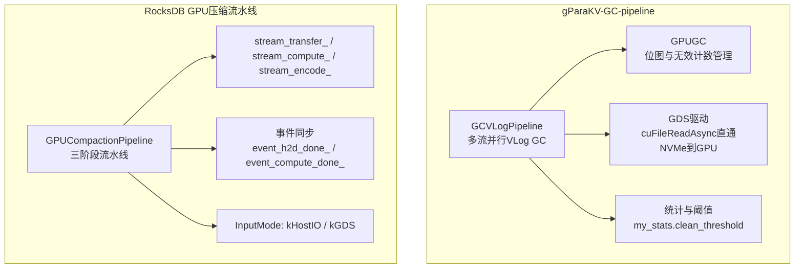
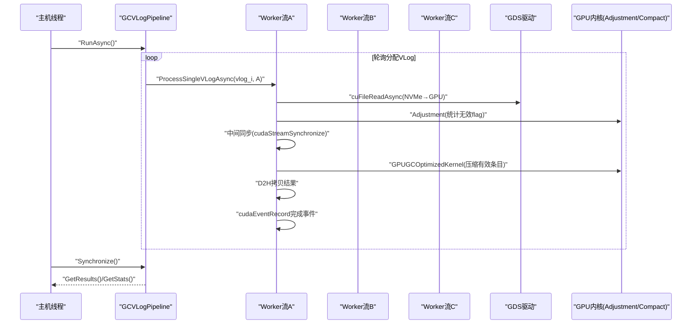
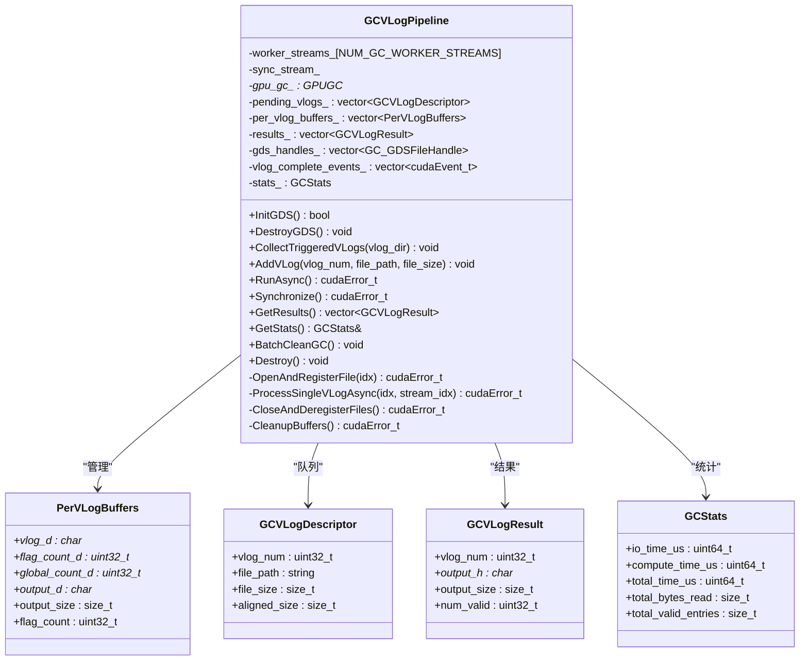
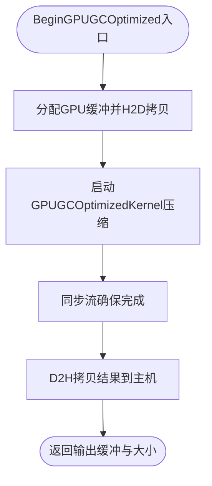
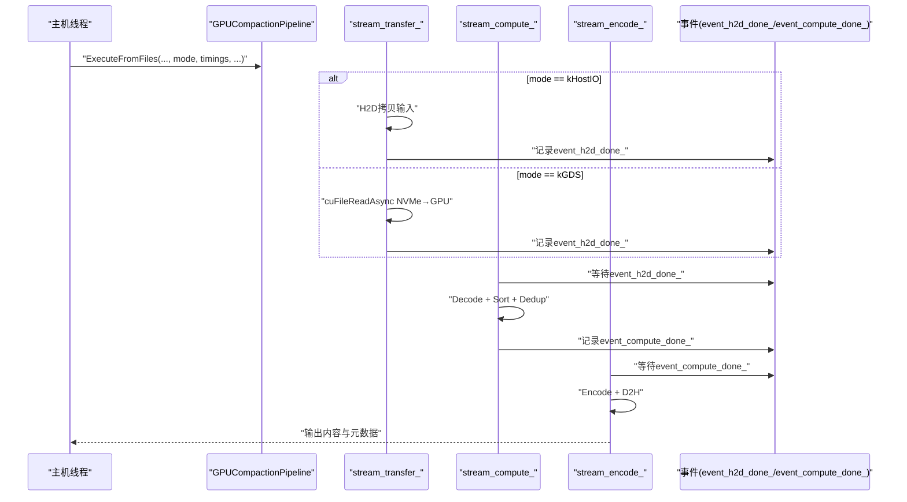
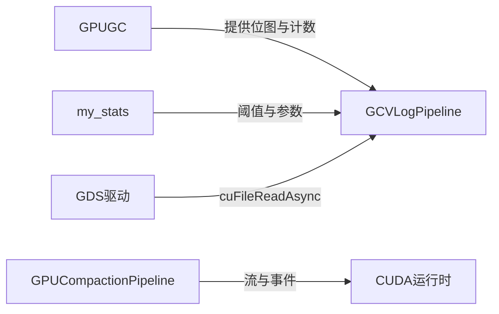

# 流水线处理机制

<cite>
**本文引用的文件**   
- [gc_pipeline_vlog.h](file://source/gParaKV-GC-pipeline/db/cuda_pipeline_gc/gc_pipeline_vlog.h)
- [gc_pipeline_vlog.cu](file://source/gParaKV-GC-pipeline/db/cuda_pipeline_gc/gc_pipeline_vlog.cu)
- [gpu_gc.h](file://source/gParaKV-GC-pipeline/db/gpu_gc.h)
- [gpu_gc.cu](file://source/gParaKV-GC-pipeline/db/gpu_gc.cu)
- [my_stats.h](file://source/gParaKV-GC-pipeline/db/my_stats.h)
- [gc_pipeline_bench.cu](file://source/gParaKV-GC-pipeline/db/cuda_pipeline_gc/gc_pipeline_bench.cu)
- [gpu_compaction_pipeline.h](file://source/rocksdb-flush-wal-0.2/db/cuda/gpu_compaction_pipeline.h)
</cite>

## 目录
1. [引言](#引言)
2. [项目结构](#项目结构)
3. [核心组件](#核心组件)
4. [架构总览](#架构总览)
5. [详细组件分析](#详细组件分析)
6. [依赖关系分析](#依赖关系分析)
7. [性能考量](#性能考量)
8. [故障排查指南](#故障排查指南)
9. [结论](#结论)
10. [附录](#附录)

## 引言
本文件围绕三阶段GPU压缩流水线的架构设计与实现，系统阐述数据传输、计算与编码阶段的并行执行策略，重点说明CUDA流与事件的使用、阶段间同步机制、内存重叠优化。同时记录流水线调度算法、资源分配策略与负载均衡技术，并结合实际代码库给出流水线配置、性能监控与故障恢复示例。最后解释与RocksDB核心引擎的集成方式与接口设计，以及常见问题与解决方案。

## 项目结构
本项目包含两套相关实现：
- gParaKV-GC-pipeline：基于GPUDirect Storage（GDS）的VLog级GC流水线，使用多CUDA流并行处理多个VLog，将I/O与GPU计算重叠以提升吞吐。
- rocksdb-flush-wal-0.2：RocksDB侧的GPU压缩流水线，采用三阶段（传输、计算、编码）流水线，通过CUDA流与事件最大化重叠。

**图表来源** 
- [gc_pipeline_vlog.h:84-165](file://source/gParaKV-GC-pipeline/db/cuda_pipeline_gc/gc_pipeline_vlog.h#L84-L165)
- [gpu_gc.h:18-52](file://source/gParaKV-GC-pipeline/db/gpu_gc.h#L18-L52)
- [gpu_compaction_pipeline.h:50-124](file://source/rocksdb-flush-wal-0.2/db/cuda/gpu_compaction_pipeline.h#L50-L124)

**章节来源**
- [gc_pipeline_vlog.h:1-213](file://source/gParaKV-GC-pipeline/db/cuda_pipeline_gc/gc_pipeline_vlog.h#L1-L213)
- [gpu_compaction_pipeline.h:1-128](file://source/rocksdb-flush-wal-0.2/db/cuda/gpu_compaction_pipeline.h#L1-L128)

## 核心组件
- GCVLogPipeline：VLog级流水线GC器，负责收集触发GC的VLog、打开并注册GDS句柄、在多个worker流上异步执行“GDS读取→Adjustment→Compact→D2H”流程，并提供批量清理与统计。
- GPUGC：GPU端垃圾回收状态管理，维护每个VLog的位图（gpu_flags）和无效条目计数（invalid_count），提供标记、触发GC、压缩内核调用等能力。
- my_stats：全局统计与阈值配置，包括clean_threshold、var_key_value_size、max_num_log_item等，用于决定何时触发GC及计算输出大小。
- GPUCompactionPipeline（RocksDB）：三阶段GPU压缩流水线，支持kHostIO与kGDS两种输入模式，通过三个独立流与事件进行阶段间同步，最大化I/O与计算重叠。

**章节来源**
- [gc_pipeline_vlog.h:84-165](file://source/gParaKV-GC-pipeline/db/cuda_pipeline_gc/gc_pipeline_vlog.h#L84-L165)
- [gpu_gc.h:18-52](file://source/gParaKV-GC-pipeline/db/gpu_gc.h#L18-L52)
- [my_stats.h:16-62](file://source/gParaKV-GC-pipeline/db/my_stats.h#L16-L62)
- [gpu_compaction_pipeline.h:50-124](file://source/rocksdb-flush-wal-0.2/db/cuda/gpu_compaction_pipeline.h#L50-L124)

## 架构总览
三阶段GPU压缩流水线在RocksDB中体现为：
- 阶段1（数据传输）：从磁盘读取原始SSTable内容，可选择主机I/O路径或GDS直通路径。
- 阶段2（计算）：解码、排序、去重等GPU内核。
- 阶段3（编码）：编码输出并回拷至主机内存。

在gParaKV-GC-pipeline中，VLog级流水线以“GDS读取→Adjustment→Compact→D2H”为主线，通过多流轮询分配任务，实现VLog间的并行与I/O-计算重叠。

**图表来源** 
- [gc_pipeline_vlog.cu:217-344](file://source/gParaKV-GC-pipeline/db/cuda_pipeline_gc/gc_pipeline_vlog.cu#L217-L344)
- [gc_pipeline_vlog.cu:350-402](file://source/gParaKV-GC-pipeline/db/cuda_pipeline_gc/gc_pipeline_vlog.cu#L350-L402)

**章节来源**
- [gpu_compaction_pipeline.h:50-124](file://source/rocksdb-flush-wal-0.2/db/cuda/gpu_compaction_pipeline.h#L50-L124)
- [gc_pipeline_vlog.cu:217-344](file://source/gParaKV-GC-pipeline/db/cuda_pipeline_gc/gc_pipeline_vlog.cu#L217-L344)

## 详细组件分析

### GCVLogPipeline（VLog级流水线GC）
- 职责：收集触发GC的VLog、打开并注册GDS句柄、在多流上异步执行I/O与计算、记录统计、批量清理状态。
- 关键数据结构：
  - GCVLogDescriptor：待处理VLog元数据（编号、路径、大小、对齐后大小）。
  - PerVLogBuffers：每个VLog的GPU缓冲区集合（原始数据、flag计数、全局计数、输出缓冲）。
  - GCVLogResult：单个VLog的处理结果（主机端输出缓冲、大小、有效条目数）。
  - GCStats：流水线统计（I/O耗时、计算耗时、总字节数、有效条目总数）。
- 关键方法：
  - CollectTriggeredVLogs：扫描invalid_count超过阈值的VLog，构造文件路径加入队列。
  - AddVLog：手动添加VLog到队列。
  - RunAsync：轮询分配到worker流，依次执行OpenAndRegisterFile与ProcessSingleVLogAsync。
  - Synchronize：等待所有worker流完成，更新统计。
  - BatchCleanGC：批量重置invalid_count与gpu_flags段，清理触发状态。
  - Destroy：释放所有资源（文件句柄、GPU缓冲、事件、流）。

**图表来源** 
- [gc_pipeline_vlog.h:43-165](file://source/gParaKV-GC-pipeline/db/cuda_pipeline_gc/gc_pipeline_vlog.h#L43-L165)

**章节来源**
- [gc_pipeline_vlog.h:84-165](file://source/gParaKV-GC-pipeline/db/cuda_pipeline_gc/gc_pipeline_vlog.h#L84-L165)
- [gc_pipeline_vlog.cu:102-168](file://source/gParaKV-GC-pipeline/db/cuda_pipeline_gc/gc_pipeline_vlog.cu#L102-L168)

### GPUGC（GPU端GC状态与内核）
- 职责：维护每个VLog的位图与无效计数，提供标记、触发GC、压缩内核调用。
- 关键方法：
  - MallocMemory：分配gpu_flags与invalid_count，创建stream。
  - Mark：比较相邻键值对，标记重复项对应的flags为0，原子累加invalid_count。
  - TriggerGC：扫描invalid_count超过阈值的VLog，选择第一个触发GC。
  - BeginGPUGCOptimized：调用GPUGCOptimizedKernel进行压缩，统计数据传输时间。

**图表来源** 
- [gpu_gc.cu:190-200](file://source/gParaKV-GC-pipeline/db/gpu_gc.cu#L190-L200)

**章节来源**
- [gpu_gc.h:18-52](file://source/gParaKV-GC-pipeline/db/gpu_gc.h#L18-L52)
- [gpu_gc.cu:9-23](file://source/gParaKV-GC-pipeline/db/gpu_gc.cu#L9-L23)
- [gpu_gc.cu:190-200](file://source/gParaKV-GC-pipeline/db/gpu_gc.cu#L190-L200)

### RocksDB GPUCompactionPipeline（三阶段流水线）
- 职责：管理三阶段流水线（传输、计算、编码），支持kHostIO与kGDS输入模式，通过事件同步最大化重叠。
- 关键结构：
  - PipelineTimings：各阶段耗时与统计（transfer_ms、decode_ms、sort_ms、encode_ms、total_ms等）。
  - InputMode：选择主机I/O或GDS直通。
- 关键方法：
  - Execute：从主机内存输入执行流水线。
  - ExecuteFromFiles：从磁盘文件读取，支持不同输入模式，填充每阶段计时。

**图表来源** 
- [gpu_compaction_pipeline.h:50-124](file://source/rocksdb-flush-wal-0.2/db/cuda/gpu_compaction_pipeline.h#L50-L124)

**章节来源**
- [gpu_compaction_pipeline.h:34-124](file://source/rocksdb-flush-wal-0.2/db/cuda/gpu_compaction_pipeline.h#L34-L124)

## 依赖关系分析
- GCVLogPipeline依赖GPUGC的位图与无效计数，通过my_stats获取阈值与记录大小。
- GCVLogPipeline使用GDS驱动（cuFileReadAsync）实现零拷贝I/O。
- GPUCompactionPipeline依赖CUDA流与事件进行阶段同步，支持两种输入模式。

**图表来源** 
- [gc_pipeline_vlog.h:84-165](file://source/gParaKV-GC-pipeline/db/cuda_pipeline_gc/gc_pipeline_vlog.h#L84-L165)
- [gpu_gc.h:18-52](file://source/gParaKV-GC-pipeline/db/gpu_gc.h#L18-L52)
- [my_stats.h:16-62](file://source/gParaKV-GC-pipeline/db/my_stats.h#L16-L62)
- [gpu_compaction_pipeline.h:50-124](file://source/rocksdb-flush-wal-0.2/db/cuda/gpu_compaction_pipeline.h#L50-L124)

**章节来源**
- [gc_pipeline_vlog.h:84-165](file://source/gParaKV-GC-pipeline/db/cuda_pipeline_gc/gc_pipeline_vlog.h#L84-L165)
- [gpu_gc.h:18-52](file://source/gParaKV-GC-pipeline/db/gpu_gc.h#L18-L52)
- [my_stats.h:16-62](file://source/gParaKV-GC-pipeline/db/my_stats.h#L16-L62)
- [gpu_compaction_pipeline.h:50-124](file://source/rocksdb-flush-wal-0.2/db/cuda/gpu_compaction_pipeline.h#L50-L124)

## 性能考量
- I/O与计算重叠：GCVLogPipeline通过多流轮询分配VLog，使不同VLog的I/O与计算在时间上重叠；GPUCompactionPipeline通过三阶段流与事件最大化阶段间重叠。
- 内存对齐与直通：GDS要求4KB对齐，避免CPU缓存参与，减少延迟；GCVLogPipeline对文件大小进行对齐处理。
- 中间同步点：Adjustment后必须同步以获取flag_count，用于计算输出大小，这是不可避免的串行点，但可通过批处理与流水线隐藏延迟。
- 统计与监控：GCVLogPipeline记录io_time_us、compute_time_us、total_bytes_read、total_valid_entries；GPUCompactionPipeline提供PipelineTimings细化各阶段耗时。

[本节为通用指导，不直接分析具体文件]

## 故障排查指南
- GDS初始化失败：检查cuFileDriverOpen返回值，确认驱动已加载；若已初始化则直接返回true。
- 文件打开失败：O_DIRECT打开失败时记录errno并跳过该VLog；确保文件路径正确且权限足够。
- cuFileReadAsync错误：检查对齐要求（偏移与大小需4KB对齐），确认设备内存分配充足。
- 输出大小异常：若output_size > file_size，记录警告并跳过该VLog，检查flag_count计算逻辑。
- 流同步问题：确保在需要精确顺序的地方调用cudaStreamSynchronize，避免竞态条件。
- 资源泄漏：确保Destroy调用释放所有GPU缓冲、事件、流与文件句柄。

**章节来源**
- [gc_pipeline_vlog.cu:52-73](file://source/gParaKV-GC-pipeline/db/cuda_pipeline_gc/gc_pipeline_vlog.cu#L52-L73)
- [gc_pipeline_vlog.cu:174-210](file://source/gParaKV-GC-pipeline/db/cuda_pipeline_gc/gc_pipeline_vlog.cu#L174-L210)
- [gc_pipeline_vlog.cu:246-255](file://source/gParaKV-GC-pipeline/db/cuda_pipeline_gc/gc_pipeline_vlog.cu#L246-L255)
- [gc_pipeline_vlog.cu:286-294](file://source/gParaKV-GC-pipeline/db/cuda_pipeline_gc/gc_pipeline_vlog.cu#L286-L294)
- [gc_pipeline_vlog.cu:464-504](file://source/gParaKV-GC-pipeline/db/cuda_pipeline_gc/gc_pipeline_vlog.cu#L464-L504)

## 结论
本流水线机制通过多流并行与GDS直通I/O，显著提升了VLog级GC与RocksDB GPU压缩的吞吐。关键优化包括I/O与计算重叠、内存对齐、中间同步点最小化、以及细粒度统计监控。与RocksDB的集成通过清晰的接口与输入模式选择，提供了灵活的部署选项。实践中需注意GDS初始化、文件对齐、流同步与资源管理，以确保稳定高效运行。

[本节为总结性内容，不直接分析具体文件]

## 附录
- 流水线配置示例：基准测试程序展示了如何设置VLog数量、条目数、无效比例、记录大小与临时目录，并对比Serial与Pipeline GC的性能。
- 性能监控：通过GetStats与PipelineTimings获取I/O耗时、计算耗时、总字节数与有效条目数，辅助调优。
- 故障恢复：在错误路径中记录日志并跳过失败任务，确保整体流水线继续执行；必要时重启GDS驱动或重新初始化流水线。

**章节来源**
- [gc_pipeline_bench.cu:1-375](file://source/gParaKV-GC-pipeline/db/cuda_pipeline_gc/gc_pipeline_bench.cu#L1-L375)
- [gpu_compaction_pipeline.h:34-124](file://source/rocksdb-flush-wal-0.2/db/cuda/gpu_compaction_pipeline.h#L34-L124)