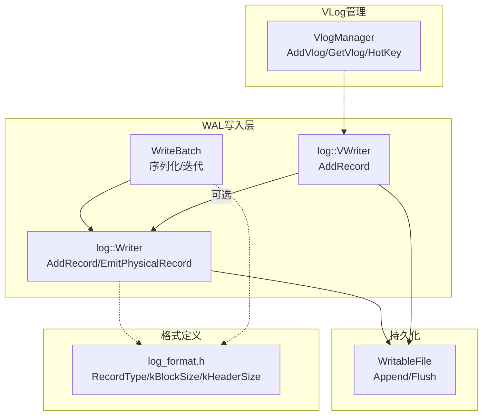
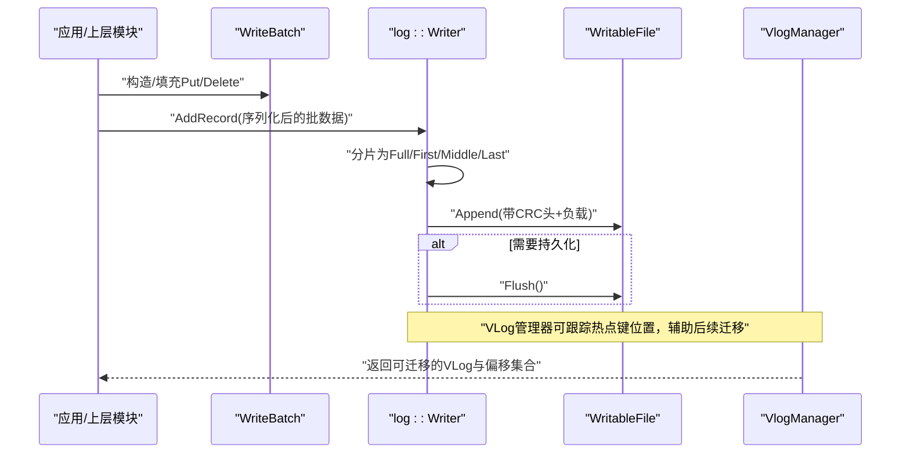
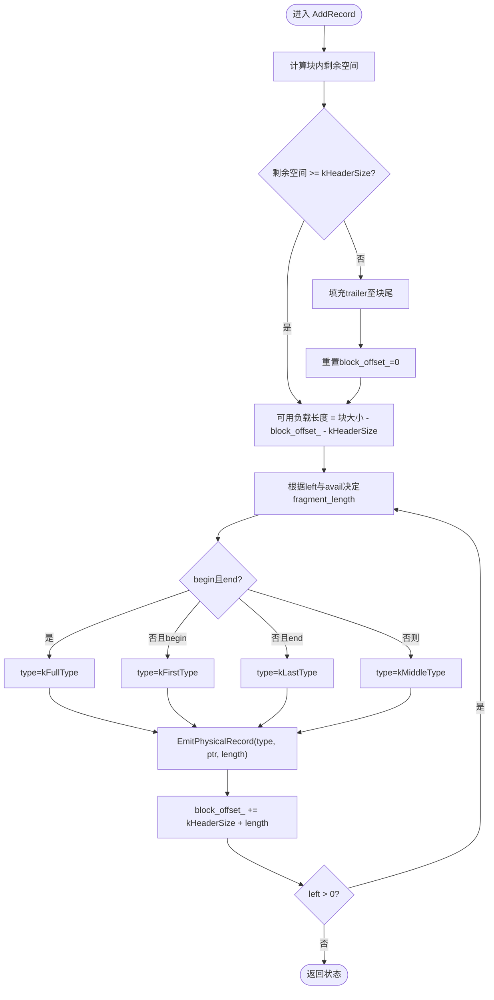
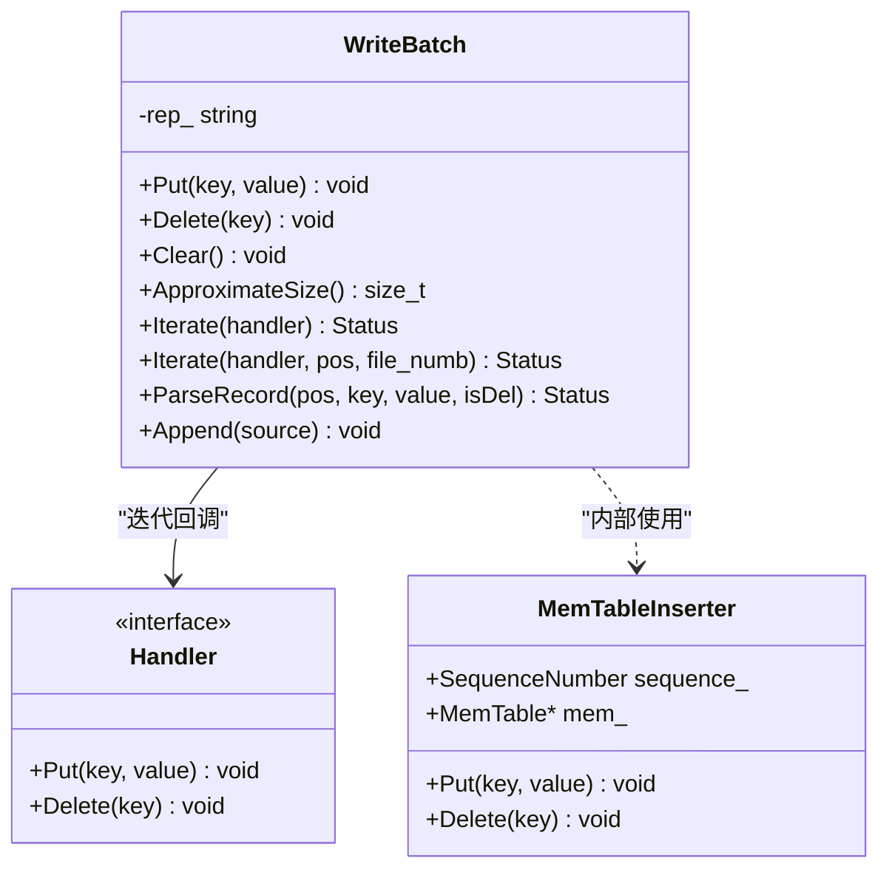
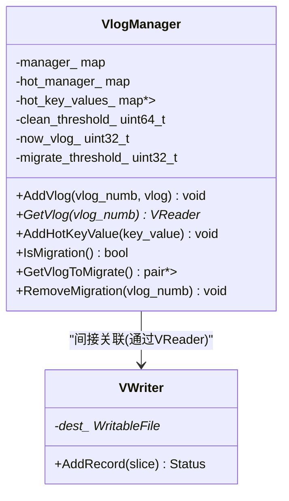
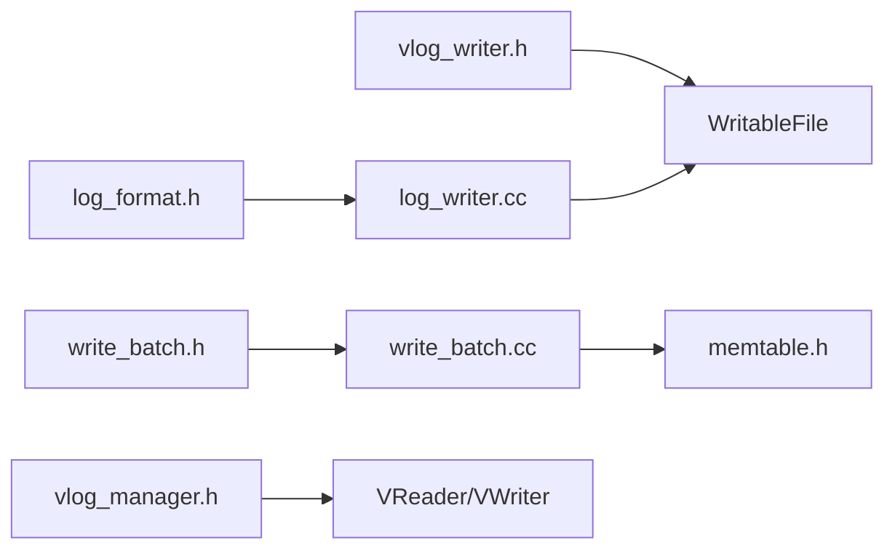

# WAL写入机制

<cite>
**本文引用的文件**   
- [log_writer.h](file://source/gParaKV-GC-master/db/log_writer.h)
- [log_writer.cc](file://source/gParaKV-GC-master/db/log_writer.cc)
- [log_format.h](file://source/gParaKV-GC-master/db/log_format.h)
- [write_batch.h](file://source/gParaKV-GC-master/include/leveldb/write_batch.h)
- [write_batch.cc](file://source/gParaKV-GC-master/db/write_batch.cc)
- [vlog_writer.h](file://source/gParaKV-GC-master/db/vlog_writer.h)
- [vlog_manager.h](file://source/gParaKV-GC-master/db/vlog_manager.h)
- [vlog_manager.cc](file://source/gParaKV-GC-master/db/vlog_manager.cc)
</cite>

## 目录
1. [简介](#简介)
2. [项目结构](#项目结构)
3. [核心组件](#核心组件)
4. [架构总览](#架构总览)
5. [详细组件分析](#详细组件分析)
6. [依赖关系分析](#依赖关系分析)
7. [性能考量](#性能考量)
8. [故障排查指南](#故障排查指南)
9. [结论](#结论)
10. [附录](#附录)

## 简介
本文件围绕WAL（预写日志）写入机制展开，结合仓库中的LevelDB风格实现，系统阐述：
- 预写日志的写入流程、缓冲区与块管理
- WriteBatch序列化格式与遍历应用
- 日志记录格式规范、CRC校验与块对齐
- 异步写入策略与Flush交互
- 压缩选项与性能优化技巧
- 配置项（文件大小限制、同步策略、压缩算法选择）
- 常见写入问题与解决方案（磁盘I/O瓶颈、内存压力）

## 项目结构
本项目在gParaKV-GC-master分支中实现了LevelDB风格的WAL读写与WriteBatch序列化。关键路径如下：
- db/log_writer.{h,cc}：WAL物理记录写入器，负责分片、CRC、块边界处理
- db/log_format.h：日志格式常量（RecordType、kBlockSize、kHeaderSize等）
- include/leveldb/write_batch.h 与 db/write_batch.cc：WriteBatch结构与序列化/反序列化
- db/vlog_writer.h：可变长日志写入器接口
- db/vlog_manager.{h,cc}：VLog生命周期与热键迁移辅助

图表来源
- [log_writer.h:20-49](file://source/gParaKV-GC-master/db/log_writer.h#L20-L49)
- [log_writer.cc:34-108](file://source/gParaKV-GC-master/db/log_writer.cc#L34-L108)
- [log_format.h:14-32](file://source/gParaKV-GC-master/db/log_format.h#L14-L32)
- [write_batch.h:33-83](file://source/gParaKV-GC-master/include/leveldb/write_batch.h#L33-L83)
- [write_batch.cc:26-186](file://source/gParaKV-GC-master/db/write_batch.cc#L26-L186)
- [vlog_writer.h:19-35](file://source/gParaKV-GC-master/db/vlog_writer.h#L19-L35)
- [vlog_manager.h:15-52](file://source/gParaKV-GC-master/db/vlog_manager.h#L15-L52)
- [vlog_manager.cc:7-65](file://source/gParaKV-GC-master/db/vlog_manager.cc#L7-L65)

章节来源
- [log_writer.h:20-49](file://source/gParaKV-GC-master/db/log_writer.h#L20-L49)
- [log_writer.cc:34-108](file://source/gParaKV-GC-master/db/log_writer.cc#L34-L108)
- [log_format.h:14-32](file://source/gParaKV-GC-master/db/log_format.h#L14-L32)
- [write_batch.h:33-83](file://source/gParaKV-GC-master/include/leveldb/write_batch.h#L33-L83)
- [write_batch.cc:26-186](file://source/gParaKV-GC-master/db/write_batch.cc#L26-L186)
- [vlog_writer.h:19-35](file://source/gParaKV-GC-master/db/vlog_writer.h#L19-L35)
- [vlog_manager.h:15-52](file://source/gParaKV-GC-master/db/vlog_manager.h#L15-L52)
- [vlog_manager.cc:7-65](file://source/gParaKV-GC-master/db/vlog_manager.cc#L7-L65)

## 核心组件
- log::Writer：将逻辑记录按块大小切分为物理记录，计算CRC并追加到WritableFile，必要时进行Flush。
- log_format：定义RecordType（Full/First/Middle/Last）、kBlockSize（32KB）、kHeaderSize（7字节）。
- WriteBatch：以紧凑二进制格式存储Put/Delete操作，支持顺序迭代与批量插入MemTable。
- log::VWriter：可变长日志写入器接口，用于扩展或替代标准WAL写入。
- VlogManager：维护多个VLog实例、热点键位置追踪与迁移触发。

章节来源
- [log_writer.h:20-49](file://source/gParaKV-GC-master/db/log_writer.h#L20-L49)
- [log_writer.cc:34-108](file://source/gParaKV-GC-master/db/log_writer.cc#L34-L108)
- [log_format.h:14-32](file://source/gParaKV-GC-master/db/log_format.h#L14-L32)
- [write_batch.h:33-83](file://source/gParaKV-GC-master/include/leveldb/write_batch.h#L33-L83)
- [write_batch.cc:26-186](file://source/gParaKV-GC-master/db/write_batch.cc#L26-L186)
- [vlog_writer.h:19-35](file://source/gParaKV-GC-master/db/vlog_writer.h#L19-L35)
- [vlog_manager.h:15-52](file://source/gParaKV-GC-master/db/vlog_manager.h#L15-L52)
- [vlog_manager.cc:7-65](file://source/gParaKV-GC-master/db/vlog_manager.cc#L7-L65)

## 架构总览
下图展示从WriteBatch到WAL落盘的端到端调用链，以及VLog管理与热点键追踪的交互。

图表来源
- [write_batch.cc:26-186](file://source/gParaKV-GC-master/db/write_batch.cc#L26-L186)
- [log_writer.cc:34-108](file://source/gParaKV-GC-master/db/log_writer.cc#L34-L108)
- [vlog_manager.cc:39-65](file://source/gParaKV-GC-master/db/vlog_manager.cc#L39-L65)

## 详细组件分析

### 组件A：log::Writer（WAL物理写入器）
- 职责：将逻辑记录按块边界切分，生成带CRC的物理记录，追加到底层文件，并在必要时Flush。
- 关键点：
  - 块大小kBlockSize=32KB，头部kHeaderSize=7字节（CRC 4B + 长度 2B + 类型 1B）
  - RecordType：kFullType、kFirstType、kMiddleType、kLastType
  - CRC使用crc32c对类型和负载计算，并进行Mask调整
  - 当剩余空间不足时，填充trailer并切换到新块
  - 每次写入后更新block_offset_，保证块内对齐

图表来源
- [log_writer.cc:34-108](file://source/gParaKV-GC-master/db/log_writer.cc#L34-L108)
- [log_format.h:14-32](file://source/gParaKV-GC-master/db/log_format.h#L14-L32)

章节来源
- [log_writer.h:20-49](file://source/gParaKV-GC-master/db/log_writer.h#L20-L49)
- [log_writer.cc:34-108](file://source/gParaKV-GC-master/db/log_writer.cc#L34-L108)
- [log_format.h:14-32](file://source/gParaKV-GC-master/db/log_format.h#L14-L32)

### 组件B：WriteBatch（批写入序列化）
- 数据结构：rep_包含固定头部（序列号8B + 计数4B），随后是若干条记录。
- 记录格式：每条记录以tag开头（kTypeValue或kTypeDeletion），其后为变长字符串（长度前缀+数据）。
- 迭代与应用：Iterate()通过Handler回调逐条执行Put/Delete；InsertInto()可直接应用到MemTable。
- 特殊重载：Iterate(pos, file_numb)可将值替换为{file_numb, pos}编码，便于VLog定位。

图表来源
- [write_batch.h:33-83](file://source/gParaKV-GC-master/include/leveldb/write_batch.h#L33-L83)
- [write_batch.cc:26-186](file://source/gParaKV-GC-master/db/write_batch.cc#L26-L186)

章节来源
- [write_batch.h:33-83](file://source/gParaKV-GC-master/include/leveldb/write_batch.h#L33-L83)
- [write_batch.cc:26-186](file://source/gParaKV-GC-master/db/write_batch.cc#L26-L186)

### 组件C：VLog写入与管理
- VWriter：提供AddRecord接口，用于写入可变长日志（如GPU/VLog场景）。
- VlogManager：维护VLog实例映射、热点键位置统计与迁移阈值判断，支持获取待迁移VLog及偏移列表。

图表来源
- [vlog_writer.h:19-35](file://source/gParaKV-GC-master/db/vlog_writer.h#L19-L35)
- [vlog_manager.h:15-52](file://source/gParaKV-GC-master/db/vlog_manager.h#L15-L52)
- [vlog_manager.cc:7-65](file://source/gParaKV-GC-master/db/vlog_manager.cc#L7-L65)

章节来源
- [vlog_writer.h:19-35](file://source/gParaKV-GC-master/db/vlog_writer.h#L19-L35)
- [vlog_manager.h:15-52](file://source/gParaKV-GC-master/db/vlog_manager.h#L15-L52)
- [vlog_manager.cc:7-65](file://source/gParaKV-GC-master/db/vlog_manager.cc#L7-L65)

## 依赖关系分析
- Writer依赖log_format定义的常量与RecordType，确保物理记录格式一致。
- WriteBatch依赖dbformat/memtable接口以插入MemTable，同时依赖util编码工具进行变长字符串处理。
- VlogManager依赖VReader/VWriter抽象，用于多VLog实例的生命周期与热点追踪。
- 所有写入最终依赖WritableFile的Append/Flush能力。

图表来源
- [log_format.h:14-32](file://source/gParaKV-GC-master/db/log_format.h#L14-L32)
- [log_writer.cc:34-108](file://source/gParaKV-GC-master/db/log_writer.cc#L34-L108)
- [write_batch.h:33-83](file://source/gParaKV-GC-master/include/leveldb/write_batch.h#L33-L83)
- [write_batch.cc:26-186](file://source/gParaKV-GC-master/db/write_batch.cc#L26-L186)
- [vlog_writer.h:19-35](file://source/gParaKV-GC-master/db/vlog_writer.h#L19-L35)
- [vlog_manager.h:15-52](file://source/gParaKV-GC-master/db/vlog_manager.h#L15-L52)

章节来源
- [log_format.h:14-32](file://source/gParaKV-GC-master/db/log_format.h#L14-L32)
- [log_writer.cc:34-108](file://source/gParaKV-GC-master/db/log_writer.cc#L34-L108)
- [write_batch.h:33-83](file://source/gParaKV-GC-master/include/leveldb/write_batch.h#L33-L83)
- [write_batch.cc:26-186](file://source/gParaKV-GC-master/db/write_batch.cc#L26-L186)
- [vlog_writer.h:19-35](file://source/gParaKV-GC-master/db/vlog_writer.h#L19-L35)
- [vlog_manager.h:15-52](file://source/gParaKV-GC-master/db/vlog_manager.h#L15-L52)

## 性能考量
- 块大小与头部开销：kBlockSize=32KB，kHeaderSize=7B，合理批大小可减少块切换与头部比例。
- CRC计算：每记录一次crc32c Extend+Mask，建议批量合并以减少函数调用与CPU开销。
- Flush策略：Writer在每条记录后调用Flush，适合强持久化场景；高吞吐场景可考虑缓冲后再Flush。
- WriteBatch大小：过大导致单次序列化与写入放大，过小增加元数据占比；建议按内存与I/O特性调优。
- VLog热点迁移：通过阈值触发迁移，减少热点键频繁写入同一VLog造成的碎片与锁竞争。

[本节为通用指导，不直接分析具体文件]

## 故障排查指南
- 磁盘I/O瓶颈
  - 现象：延迟升高、吞吐下降
  - 排查：检查Flush频率与底层设备队列深度；适当增大批大小或降低同步频率
  - 参考：Writer::AddRecord中对Flush的调用点
- 内存压力
  - 现象：OOM或GC抖动
  - 排查：监控WriteBatch.ApproximateSize与内存占用；拆分大批次，避免单批过大
  - 参考：WriteBatch::ApproximateSize与rep_增长
- 数据损坏
  - 现象：读取时报Corruption
  - 排查：确认CRC校验失败原因；检查RecordType与长度字段是否越界
  - 参考：log_writer.cc中CRC计算与log_format.h中RecordType定义
- VLog迁移异常
  - 现象：热点键未迁移或迁移不完整
  - 排查：核对migrate_threshold_与hot_key_values_状态；确认AddHotKeyValue与RemoveMigration调用时机
  - 参考：vlog_manager.cc中阈值判断与清理逻辑

章节来源
- [log_writer.cc:34-108](file://source/gParaKV-GC-master/db/log_writer.cc#L34-L108)
- [write_batch.cc:26-186](file://source/gParaKV-GC-master/db/write_batch.cc#L26-L186)
- [log_format.h:14-32](file://source/gParaKV-GC-master/db/log_format.h#L14-L32)
- [vlog_manager.cc:39-65](file://source/gParaKV-GC-master/db/vlog_manager.cc#L39-L65)

## 结论
本实现提供了稳定高效的WAL写入路径：WriteBatch负责原子批次的序列化，log::Writer负责物理记录的可靠落盘与一致性校验，VLog管理层支持热点追踪与迁移。通过合理配置批大小、Flush策略与VLog阈值，可在不同工作负载下取得良好吞吐与延迟表现。

[本节为总结性内容，不直接分析具体文件]

## 附录

### WAL写入API使用示例（基于代码路径）
- 构建WriteBatch并填充操作
  - 参考：[write_batch.h:33-83](file://source/gParaKV-GC-master/include/leveldb/write_batch.h#L33-L83)、[write_batch.cc:165-186](file://source/gParaKV-GC-master/db/write_batch.cc#L165-L186)
- 将批数据写入WAL
  - 参考：[log_writer.cc:34-108](file://source/gParaKV-GC-master/db/log_writer.cc#L34-L108)
- 控制持久化与Flush
  - 参考：[log_writer.cc:98-108](file://source/gParaKV-GC-master/db/log_writer.cc#L98-L108)
- VLog写入与热点追踪
  - 参考：[vlog_writer.h:19-35](file://source/gParaKV-GC-master/db/vlog_writer.h#L19-L35)、[vlog_manager.cc:39-65](file://source/gParaKV-GC-master/db/vlog_manager.cc#L39-L65)

### 配置项说明
- WAL文件大小限制
  - 当前实现未显式暴露文件级限制参数；可通过上层控制Writer生命周期与文件轮转策略
- 同步策略
  - Writer::AddRecord在每条记录后调用Flush；如需更高吞吐，可在上层聚合多次写入后再Flush
- 压缩算法选择
  - 当前WAL写入路径未启用压缩；如需压缩，应在上层对WriteBatch内容进行压缩后再写入

[本节为补充说明，不直接分析具体文件]