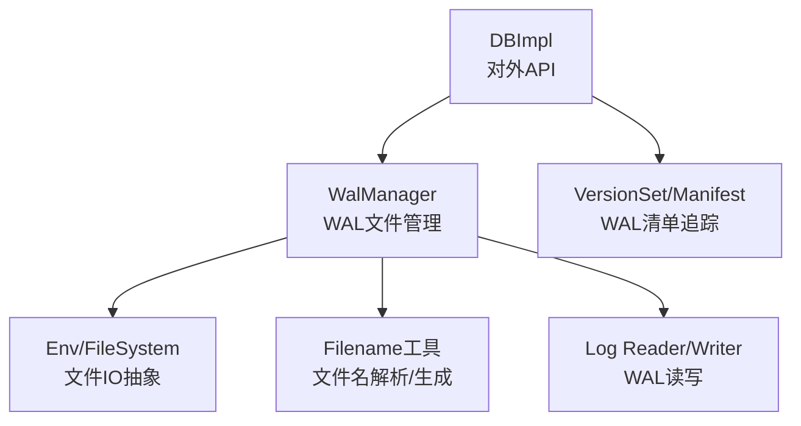
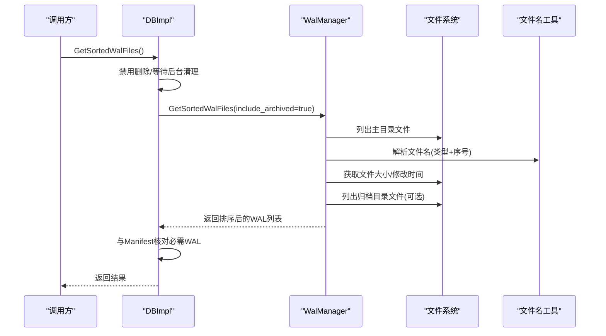
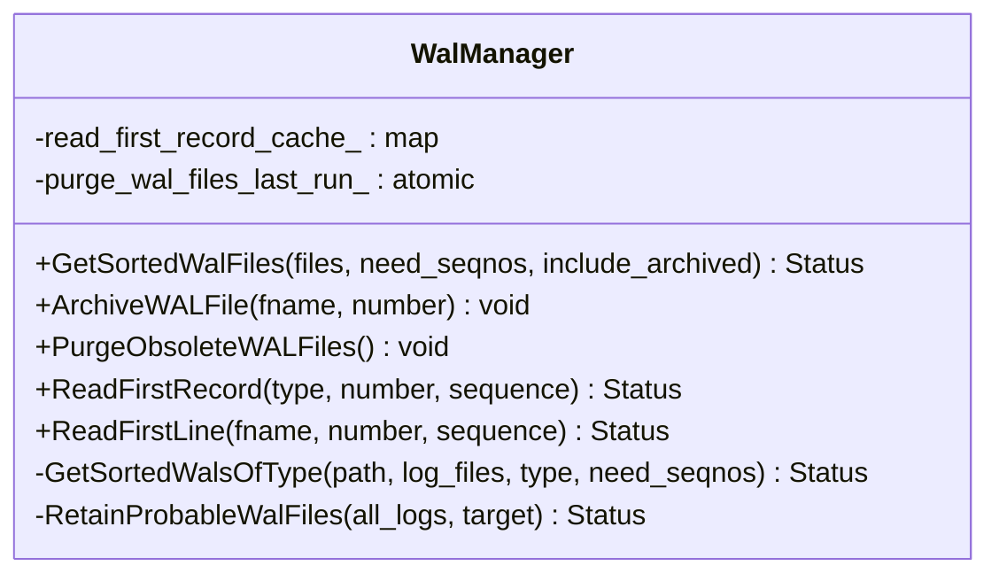
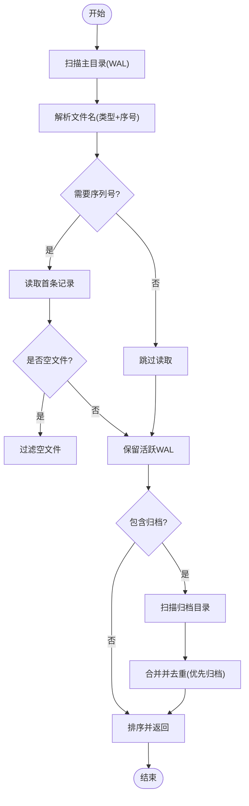
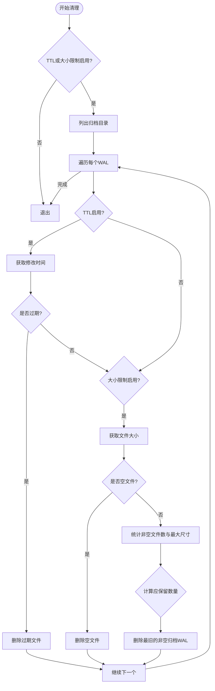
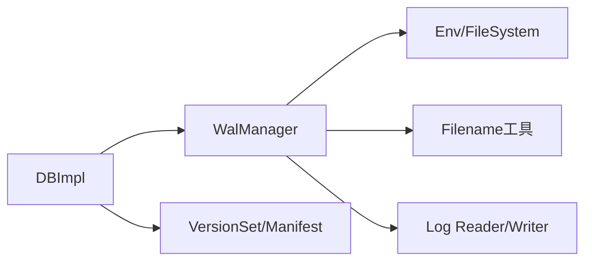

# WAL文件管理

<cite>
**本文引用的文件**   
- [wal_manager.cc](file://source/rocksdb/db/wal_manager.cc)
- [wal_manager.h](file://source/rocksdb/db/wal_manager.h)
- [db_filesnapshot.cc](file://source/rocksdb/db/db_filesnapshot.cc)
- [filename.cc](file://source/rocksdb/file/filename.cc)
</cite>

## 目录
1. [简介](#简介)
2. [项目结构](#项目结构)
3. [核心组件](#核心组件)
4. [架构总览](#架构总览)
5. [详细组件分析](#详细组件分析)
6. [依赖关系分析](#依赖关系分析)
7. [性能考量](#性能考量)
8. [故障排查指南](#故障排查指南)
9. [结论](#结论)
10. [附录](#附录)

## 简介
本章节面向WAL（Write-Ahead Log）文件管理的实现与使用，围绕以下目标展开：
- WAL文件的创建、命名规则、生命周期管理与存储策略
- 活跃文件与归档文件的区别、文件移动操作与并发访问控制
- 清理策略：TTL过期删除、大小限制清理、空文件处理
- GetSortedWalFiles的实现逻辑：主目录与归档目录合并、序列号排序、竞态条件处理
- 常见问题：文件损坏恢复、磁盘空间不足、文件系统限制

## 项目结构
与WAL文件管理直接相关的代码集中在RocksDB的db层与file工具层：
- db/wal_manager.*：WAL文件管理器，负责扫描、排序、归档、清理、读取首条记录等
- db/db_filesnapshot.cc：对外暴露GetSortedWalFiles接口，并做一致性校验与并发保护
- file/filename.cc：文件名解析与生成（如WAL文件名、归档文件名）

图表来源 
- [db_filesnapshot.cc:93-186](file://source/rocksdb/db/db_filesnapshot.cc#L93-L186)
- [wal_manager.cc:45-101](file://source/rocksdb/db/wal_manager.cc#L45-L101)
- [wal_manager.cc:303-366](file://source/rocksdb/db/wal_manager.cc#L303-L366)
- [filename.cc](file://source/rocksdb/file/filename.cc)

章节来源
- [wal_manager.h:35-135](file://source/rocksdb/db/wal_manager.h#L35-L135)
- [wal_manager.cc:1-547](file://source/rocksdb/db/wal_manager.cc#L1-L547)
- [db_filesnapshot.cc:93-186](file://source/rocksdb/db/db_filesnapshot.cc#L93-L186)
- [filename.cc](file://source/rocksdb/file/filename.cc)

## 核心组件
- WalManager：封装WAL文件的生命周期与访问语义，提供排序获取、归档、清理、读取首条记录等功能
- DBImpl.GetSortedWalFiles：对外接口，结合版本集进行一致性校验，屏蔽并发与目录扫描竞态
- Filename工具：提供WAL文件名与归档文件名的解析与构造

章节来源
- [wal_manager.h:35-135](file://source/rocksdb/db/wal_manager.h#L35-L135)
- [wal_manager.cc:45-101](file://source/rocksdb/db/wal_manager.cc#L45-L101)
- [db_filesnapshot.cc:93-186](file://source/rocksdb/db/db_filesnapshot.cc#L93-L186)

## 架构总览
WAL文件管理的关键流程如下：
- 获取排序后的WAL文件列表：DBImpl调用WalManager，先扫描主目录再扫描归档目录，避免移动过程中的竞态
- 归档与清理：WAL达到阈值后移动到归档目录；定时任务按TTL和大小限制清理归档文件
- 读取首条记录：用于判断是否为空文件或压缩头记录，支持缓存加速

图表来源 
- [db_filesnapshot.cc:98-186](file://source/rocksdb/db/db_filesnapshot.cc#L98-L186)
- [wal_manager.cc:45-101](file://source/rocksdb/db/wal_manager.cc#L45-L101)
- [wal_manager.cc:303-366](file://source/rocksdb/db/wal_manager.cc#L303-L366)

## 详细组件分析

### WalManager类与方法
WalManager是WAL文件管理的核心，关键职责包括：
- 获取排序后的WAL文件列表（含归档）
- 归档WAL文件（从主目录移动到归档目录）
- 清理过期或超量的归档文件
- 读取WAL首条记录以判断是否有效/为空
- 维护读首记录的缓存，减少重复IO

图表来源 
- [wal_manager.h:35-135](file://source/rocksdb/db/wal_manager.h#L35-L135)
- [wal_manager.cc:45-101](file://source/rocksdb/db/wal_manager.cc#L45-L101)
- [wal_manager.cc:140-285](file://source/rocksdb/db/wal_manager.cc#L140-L285)
- [wal_manager.cc:303-366](file://source/rocksdb/db/wal_manager.cc#L303-L366)
- [wal_manager.cc:394-438](file://source/rocksdb/db/wal_manager.cc#L394-L438)

章节来源
- [wal_manager.h:35-135](file://source/rocksdb/db/wal_manager.h#L35-L135)
- [wal_manager.cc:45-101](file://source/rocksdb/db/wal_manager.cc#L45-L101)
- [wal_manager.cc:140-285](file://source/rocksdb/db/wal_manager.cc#L140-L285)
- [wal_manager.cc:303-366](file://source/rocksdb/db/wal_manager.cc#L303-L366)
- [wal_manager.cc:394-438](file://source/rocksdb/db/wal_manager.cc#L394-L438)

### GetSortedWalFiles实现逻辑
- 主目录优先：先扫描主目录中的活跃WAL，再扫描归档目录，避免在移动过程中遗漏
- 合并与去重：若同一文件同时出现在两个目录（竞态），仅保留归档目录的版本
- 排序规则：按WAL序号升序排列，确保顺序一致
- 序列号过滤：当need_seqnos为true时，通过读取首条记录跳过空文件
- 一致性校验：DBImpl侧将结果与Manifest中必需的WAL集合比对，缺失即报错

图表来源 
- [wal_manager.cc:45-101](file://source/rocksdb/db/wal_manager.cc#L45-L101)
- [wal_manager.cc:303-366](file://source/rocksdb/db/wal_manager.cc#L303-L366)
- [db_filesnapshot.cc:98-186](file://source/rocksdb/db/db_filesnapshot.cc#L98-L186)

章节来源
- [wal_manager.cc:45-101](file://source/rocksdb/db/wal_manager.cc#L45-L101)
- [wal_manager.cc:303-366](file://source/rocksdb/db/wal_manager.cc#L303-L366)
- [db_filesnapshot.cc:98-186](file://source/rocksdb/db/db_filesnapshot.cc#L98-L186)

### 文件命名规则与路径
- 文件名解析：通过ParseFileName提取文件序号与类型，识别WAL文件
- 归档文件名：通过ArchivedLogFileName生成归档路径
- 活跃文件名：通过LogFileName生成主目录下的WAL路径

章节来源
- [wal_manager.cc:303-366](file://source/rocksdb/db/wal_manager.cc#L303-L366)
- [filename.cc](file://source/rocksdb/file/filename.cc)

### 生命周期管理与存储策略
- 活跃WAL：位于主目录，持续写入，直到轮转或触发归档
- 归档WAL：移动到归档目录，供备份、恢复、增量同步等场景使用
- 存储位置：WAL目录可与数据库目录相同或不同，影响清理时的强制前台/后台删除策略

章节来源
- [wal_manager.cc:287-301](file://source/rocksdb/db/wal_manager.cc#L287-L301)
- [wal_manager.cc:140-285](file://source/rocksdb/db/wal_manager.cc#L140-L285)

### 并发访问控制与竞态处理
- 目录扫描顺序：先主目录后归档目录，避免移动过程中的竞态导致遗漏
- 同步点：测试中使用同步点模拟竞态，确保GetSortedWalFiles在移动过程中仍正确
- 删除保护：DBImpl在获取WAL列表前禁用删除，防止扫描期间被删

章节来源
- [wal_manager.cc:45-101](file://source/rocksdb/db/wal_manager.cc#L45-L101)
- [db_filesnapshot.cc:98-186](file://source/rocksdb/db/db_filesnapshot.cc#L98-L186)

### 清理策略：TTL、大小限制与空文件
- TTL过期删除：根据WAL_ttl_seconds配置，删除超过时间的归档WAL
- 大小限制清理：根据WAL_size_limit_MB计算可保留的文件数量，删除最旧的归档WAL
- 空文件处理：读取首条记录时，若为空则跳过；对压缩头记录的特殊处理保证不被误删

图表来源 
- [wal_manager.cc:140-285](file://source/rocksdb/db/wal_manager.cc#L140-L285)
- [wal_manager.cc:394-438](file://source/rocksdb/db/wal_manager.cc#L394-L438)

章节来源
- [wal_manager.cc:140-285](file://source/rocksdb/db/wal_manager.cc#L140-L285)
- [wal_manager.cc:394-438](file://source/rocksdb/db/wal_manager.cc#L394-L438)

### 文件移动操作
- 归档移动：将活跃WAL从主目录移动到归档目录，记录日志
- 删除操作：清理归档WAL时，根据WAL是否在数据库路径决定前台/后台删除

章节来源
- [wal_manager.cc:287-301](file://source/rocksdb/db/wal_manager.cc#L287-L301)
- [wal_manager.cc:140-285](file://source/rocksdb/db/wal_manager.cc#L140-L285)

## 依赖关系分析
- WalManager依赖Env/FileSystem进行文件枚举、大小/时间查询、移动与删除
- 依赖Filename工具解析与生成WAL文件名
- 依赖Log Reader/Writer读取WAL首条记录，判断有效性
- DBImpl依赖WalManager获取WAL列表，并与VersionSet/Manifest进行一致性校验

图表来源 
- [db_filesnapshot.cc:98-186](file://source/rocksdb/db/db_filesnapshot.cc#L98-L186)
- [wal_manager.cc:303-366](file://source/rocksdb/db/wal_manager.cc#L303-L366)

章节来源
- [db_filesnapshot.cc:98-186](file://source/rocksdb/db/db_filesnapshot.cc#L98-L186)
- [wal_manager.cc:303-366](file://source/rocksdb/db/wal_manager.cc#L303-L366)

## 性能考量
- 首记录读取缓存：ReadFirstRecord的结果缓存到内存，减少重复IO
- 二分查找优化：RetainProbableWalFiles基于已排序的WAL列表进行二分定位，避免打开所有文件
- 批量扫描与排序：GetSortedWalsOfType一次性枚举并排序，降低多次系统调用开销
- 清理频率控制：通过原子变量记录上次清理时间，避免频繁执行

章节来源
- [wal_manager.cc:394-438](file://source/rocksdb/db/wal_manager.cc#L394-L438)
- [wal_manager.cc:368-392](file://source/rocksdb/db/wal_manager.cc#L368-L392)
- [wal_manager.cc:140-285](file://source/rocksdb/db/wal_manager.cc#L140-L285)

## 故障排查指南
- 文件损坏恢复：ReadFirstLine在读取首条记录时捕获损坏并记录警告，支持忽略错误模式
- 磁盘空间不足：清理策略会删除过期与空文件，并在大小限制下删除最旧归档；需监控磁盘使用率
- 文件系统限制：大目录枚举与大量小文件可能带来性能问题，建议合理设置WAL大小与清理策略
- 竞态条件：GetSortedWalFiles通过顺序扫描与去重规避移动过程中的竞态；如遇不一致，检查Manifest与目录列表

章节来源
- [wal_manager.cc:468-544](file://source/rocksdb/db/wal_manager.cc#L468-L544)
- [wal_manager.cc:140-285](file://source/rocksdb/db/wal_manager.cc#L140-L285)
- [db_filesnapshot.cc:98-186](file://source/rocksdb/db/db_filesnapshot.cc#L98-L186)

## 结论
WAL文件管理通过WalManager与DBImpl协同，实现了安全的文件扫描、排序、归档与清理。其设计充分考虑了并发与一致性，提供了灵活的清理策略与高效的读取机制。在实际使用中，应合理配置TTL与大小限制，监控磁盘与目录规模，确保系统稳定运行。

## 附录
- 相关API与常量：WAL_ttl_seconds、WAL_size_limit_MB、kAliveLogFile、kArchivedLogFile等
- 测试用例：TransactionLogIteratorRace、CheckpointWithArchievedLog等用于验证竞态与归档行为

章节来源
- [wal_manager.h:35-135](file://source/rocksdb/db/wal_manager.h#L35-L135)
- [wal_manager.cc:140-285](file://source/rocksdb/db/wal_manager.cc#L140-L285)