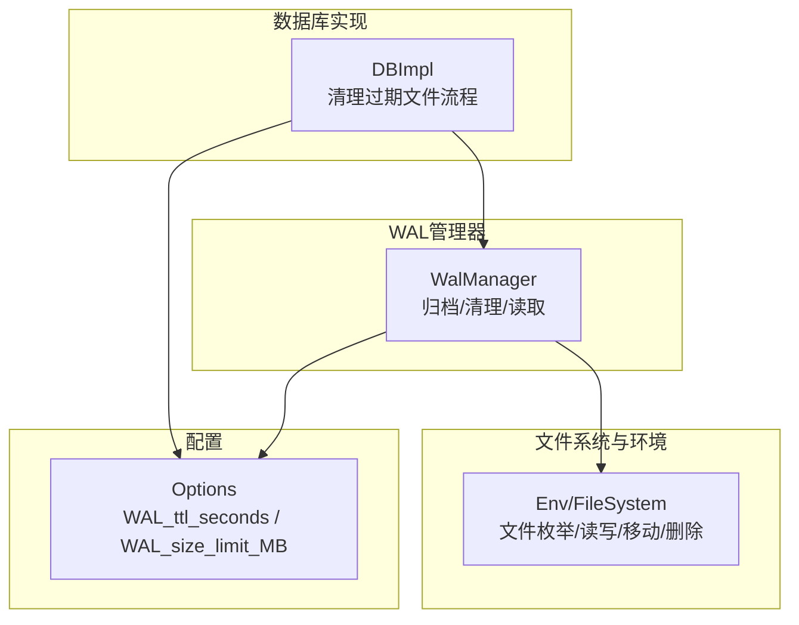
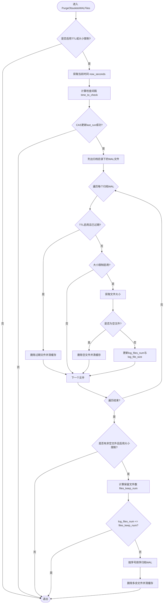
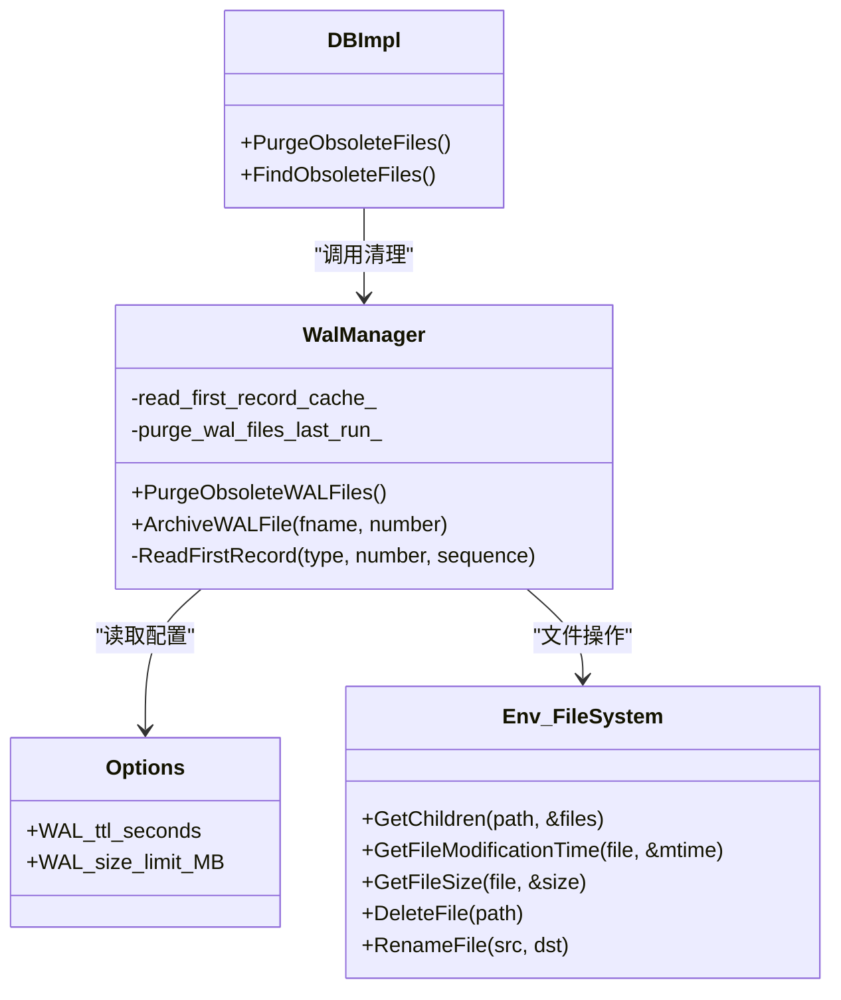

# WAL清理策略

<cite>
**本文引用的文件**   
- [wal_manager.cc](file://source/rocksdb/db/wal_manager.cc)
- [wal_manager.h](file://source/rocksdb/db/wal_manager.h)
- [db_impl_files.cc](file://source/rocksdb/db/db_impl/db_impl_files.cc)
- [options.h](file://source/rocksdb/include/rocksdb/options.h)
- [c.cc](file://source/rocksdb/db/c.cc)
- [wal_manager_test.cc](file://source/rocksdb/db/wal_manager_test.cc)
</cite>

## 目录
1. [简介](#简介)
2. [项目结构](#项目结构)
3. [核心组件](#核心组件)
4. [架构总览](#架构总览)
5. [详细组件分析](#详细组件分析)
6. [依赖关系分析](#依赖关系分析)
7. [性能考量](#性能考量)
8. [故障排查指南](#故障排查指南)
9. [结论](#结论)
10. [附录](#附录)

## 简介
本文件围绕RocksDB的WAL（Write-Ahead Log）清理策略展开，重点解析PurgeObsoleteWALFiles的实现逻辑，包括TTL清理与大小限制清理的双重机制。文档将详细说明清理触发条件、执行频率控制、资源竞争避免、文件选择策略（按修改时间排序、空文件优先删除、归档文件管理）、并发安全与原子性保证，以及监控与性能影响分析方法。同时给出配置参数WAL_ttl_seconds与WAL_size_limit_MB的作用机制与调优建议，并结合测试用例说明行为预期。

## 项目结构
与WAL清理相关的核心代码位于RocksDB的db层：
- WalManager负责WAL文件的归档、读取、清理等能力
- DBImpl在清理过期文件流程中调用WalManager进行WAL归档与清理
- 选项定义在options.h，C接口封装在c.cc
- 测试用例覆盖TTL与大小限制场景



**图表来源** 
- [db_impl_files.cc:760-850](file://source/rocksdb/db/db_impl/db_impl_files.cc#L760-L850)
- [wal_manager.h:35-65](file://source/rocksdb/db/wal_manager.h#L35-L65)
- [options.h:1066-1067](file://source/rocksdb/include/rocksdb/options.h#L1066-L1067)

**章节来源**
- [db_impl_files.cc:760-850](file://source/rocksdb/db/db_impl/db_impl_files.cc#L760-L850)
- [wal_manager.h:35-65](file://source/rocksdb/db/wal_manager.h#L35-L65)
- [options.h:1066-1067](file://source/rocksdb/include/rocksdb/options.h#L1066-L1067)

## 核心组件
- WalManager：提供WAL文件归档、排序、读取、清理等能力，内部维护读缓存与上次清理时间戳，确保并发安全与去重。
- DBImpl：在发现可删除的WAL文件时，先将其移动到归档目录，再调用WalManager::PurgeObsoleteWALFiles执行清理。
- Options：包含WAL_ttl_seconds与WAL_size_limit_MB两个关键开关与阈值。

**章节来源**
- [wal_manager.h:35-65](file://source/rocksdb/db/wal_manager.h#L35-L65)
- [db_impl_files.cc:760-850](file://source/rocksdb/db/db_impl/db_impl_files.cc#L760-L850)
- [options.h:1066-1067](file://source/rocksdb/include/rocksdb/options.h#L1066-L1067)

## 架构总览
下图展示从DBImpl触发到WalManager执行清理的完整调用链，以及涉及的配置项与文件系统操作。

```mermaid
sequenceDiagram
participant Caller as "调用方(后台任务)"
participant DB as "DBImpl"
participant WM as "WalManager"
participant FS as "Env/FileSystem"
participant OPT as "Options"
Caller->>DB : 触发清理过期文件
DB->>DB : 扫描待删除WAL
DB->>WM : ArchiveWALFile(fname, number)
WM->>FS : RenameFile(移动到归档目录)
DB->>WM : PurgeObsoleteWALFiles()
WM->>OPT : 读取WAL_ttl_seconds/WAL_size_limit_MB
WM->>FS : GetChildren(归档目录)
WM->>FS : GetFileModificationTime/GetFileSize
WM->>FS : DeleteDBFile(删除过期/空文件)
WM-->>DB : 返回状态
DB-->>Caller : 完成清理
```

**图表来源** 
- [db_impl_files.cc:760-850](file://source/rocksdb/db/db_impl/db_impl_files.cc#L760-L850)
- [wal_manager.cc:140-285](file://source/rocksdb/db/wal_manager.cc#L140-L285)
- [options.h:1066-1067](file://source/rocksdb/include/rocksdb/options.h#L1066-L1067)

## 详细组件分析

### PurgeObsoleteWALFiles实现逻辑
该函数是WAL清理的核心入口，具备以下特性：
- 双重机制：TTL清理与大小限制清理可同时启用；任一未启用则跳过对应分支。
- 频率控制：通过最近一次运行时间purge_wal_files_last_run_与计算出的time_to_check进行CAS防抖，避免频繁执行。默认间隔为kDefaultIntervalToDeleteObsoleteWAL（秒），当开启TTL时，检查间隔取min(默认间隔, max(1, TTL/2))。
- 归档目录遍历：仅对归档目录中的WAL文件进行处理，避免与活跃WAL产生竞态。
- TTL清理：获取文件修改时间，若now_seconds - file_m_time > WAL_ttl_seconds则删除；考虑系统时钟回拨保护，避免无符号下溢。
- 大小限制清理：统计非空文件大小并记录最大文件大小log_file_size与数量log_files_num；优先删除空文件；根据WAL_size_limit_MB与log_file_size计算保留文件数files_keep_num，超出部分按序号从小到大删除。
- 缓存一致性：删除后清除read_first_record_cache_中对应LogNumber条目，避免脏缓存。
- 并发安全：使用互斥锁保护read_first_record_cache_；通过RelaxedAtomic CAS防止重复清理；对文件操作错误进行日志记录并继续。



**图表来源** 
- [wal_manager.cc:140-285](file://source/rocksdb/db/wal_manager.cc#L140-L285)
- [wal_manager.h:121-132](file://source/rocksdb/db/wal_manager.h#L121-L132)

**章节来源**
- [wal_manager.cc:140-285](file://source/rocksdb/db/wal_manager.cc#L140-L285)
- [wal_manager.h:121-132](file://source/rocksdb/db/wal_manager.h#L121-L132)

### 清理触发条件与执行频率控制
- 触发条件：
  - DBImpl在清理过期文件流程中，遇到类型为kWalFile且启用了WAL_ttl_seconds或WAL_size_limit_MB时，先将文件移动到归档目录，然后调用WalManager::PurgeObsoleteWALFiles。
- 执行频率控制：
  - 使用purge_wal_files_last_run_记录上次运行时间，结合time_to_check进行CAS比较，避免短时间内重复执行。
  - TTL开启时，time_to_check = min(kDefaultIntervalToDeleteObsoleteWAL, max(1, TTL/2))，缩短检查周期以更快响应TTL过期。
  - 未开启TTL时，使用默认间隔（约600秒）。

**章节来源**
- [db_impl_files.cc:760-850](file://source/rocksdb/db/db_impl/db_impl_files.cc#L760-L850)
- [wal_manager.cc:140-169](file://source/rocksdb/db/wal_manager.cc#L140-L169)
- [wal_manager.h:121-132](file://source/rocksdb/db/wal_manager.h#L121-L132)

### 文件选择策略
- 归档目录优先：仅在归档目录中处理WAL文件，避免与活跃WAL产生竞态。
- 按修改时间排序（TTL）：基于文件mtime与当前时间差判断是否过期。
- 空文件优先删除（大小限制）：统计非空文件大小，优先删除空文件；当需要删除多余文件时，按序号从小到大删除最早的文件。
- 归档文件管理：WAL文件先由DBImpl移动到归档目录，再由WalManager清理；清理过程中可能遇到文件被移动或删除的竞态，代码做了容错处理。

**章节来源**
- [wal_manager.cc:170-244](file://source/rocksdb/db/wal_manager.cc#L170-L244)
- [wal_manager.cc:256-285](file://source/rocksdb/db/wal_manager.cc#L256-L285)

### 并发安全与原子性保证
- 读缓存一致性：删除文件后，立即清除read_first_record_cache_中对应LogNumber条目，避免后续读取命中旧缓存。
- 互斥锁保护：read_first_record_cache_mutex_保护缓存访问。
- 清理去重：使用RelaxedAtomic的CAS更新purge_wal_files_last_run_，确保同一时刻只有一个清理任务执行。
- 文件操作容错：对GetFileModificationTime、GetFileSize、DeleteDBFile等操作失败进行日志记录并继续，避免单点失败导致整个清理流程中断。

**章节来源**
- [wal_manager.cc:209-211](file://source/rocksdb/db/wal_manager.cc#L209-L211)
- [wal_manager.cc:237-239](file://source/rocksdb/db/wal_manager.cc#L237-L239)
- [wal_manager.cc:281-283](file://source/rocksdb/db/wal_manager.cc#L281-L283)
- [wal_manager.h:118-123](file://source/rocksdb/db/wal_manager.h#L118-L123)

### 配置参数作用机制与调优建议
- WAL_ttl_seconds：
  - 作用：启用TTL清理，超过指定秒数的归档WAL将被删除。
  - 调优：设置较小值可加快空间回收，但需权衡恢复需求；配合time_to_check缩短检查周期，提升响应速度。
- WAL_size_limit_MB：
  - 作用：限制归档WAL总大小，通过估算保留文件数（基于最大文件大小）删除最早文件。
  - 调优：根据磁盘容量与写入模式调整；过大可能导致清理不及时，过小可能频繁删除影响恢复。

**章节来源**
- [options.h:1066-1067](file://source/rocksdb/include/rocksdb/options.h#L1066-L1067)
- [c.cc:4996-5010](file://source/rocksdb/db/c.cc#L4996-L5010)
- [wal_manager.cc:141-145](file://source/rocksdb/db/wal_manager.cc#L141-L145)
- [wal_manager.cc:250-254](file://source/rocksdb/db/wal_manager.cc#L250-L254)

### 清理算法的时间复杂度与空间效率
- 时间复杂度：
  - 归档目录遍历：O(N)，N为归档WAL文件数。
  - TTL检查：每次文件O(1)（获取mtime与比较）。
  - 大小限制统计：O(N)统计非空文件大小与数量。
  - 排序与删除：按序号排序归档WAL O(M log M)，M为非空文件数；删除多余文件O(K)。
  - 总体近似O(N + M log M)。
- 空间效率：
  - 主要内存占用为文件列表VectorWalPtr与缓存read_first_record_cache_，均为线性于文件数。
  - 避免打开所有文件内容，仅读取必要元数据（mtime、size、首条记录序列号用于排序/过滤）。

**章节来源**
- [wal_manager.cc:170-244](file://source/rocksdb/db/wal_manager.cc#L170-L244)
- [wal_manager.cc:256-285](file://source/rocksdb/db/wal_manager.cc#L256-L285)
- [wal_manager.cc:303-366](file://source/rocksdb/db/wal_manager.cc#L303-L366)

### 测试用例与行为验证
- 大小限制测试：创建多个归档WAL，设置WAL_size_limit_MB后调用清理，验证归档总大小不超过限制。
- TTL测试：设置小TTL值，等待过期后调用清理，验证归档WAL全部删除。
- 时钟回拨保护：模拟系统时钟回拨，确保不会误删未过期文件。

**章节来源**
- [wal_manager_test.cc:230-321](file://source/rocksdb/db/wal_manager_test.cc#L230-L321)

## 依赖关系分析
WalManager依赖Env/FileSystem进行文件操作，依赖Options获取配置，DBImpl作为调用方协调清理流程。



**图表来源** 
- [wal_manager.h:35-65](file://source/rocksdb/db/wal_manager.h#L35-L65)
- [db_impl_files.cc:760-850](file://source/rocksdb/db/db_impl/db_impl_files.cc#L760-L850)
- [options.h:1066-1067](file://source/rocksdb/include/rocksdb/options.h#L1066-L1067)

**章节来源**
- [wal_manager.h:35-65](file://source/rocksdb/db/wal_manager.h#L35-65)
- [db_impl_files.cc:760-850](file://source/rocksdb/db/db_impl/db_impl_files.cc#L760-L850)
- [options.h:1066-1067](file://source/rocksdb/include/rocksdb/options.h#L1066-L1067)

## 性能考量
- I/O开销：清理过程涉及目录遍历、文件属性查询与删除，建议在低峰期执行或通过频率控制降低影响。
- CPU开销：排序与统计操作为线性或对数级，通常可接受。
- 缓存命中率：read_first_record_cache_减少重复读取，提高性能。
- 并发影响：CAS与互斥锁粒度较小，避免长时间阻塞。

[本节为通用指导，不直接分析具体文件]

## 故障排查指南
- 清理未生效：
  - 检查WAL_ttl_seconds与WAL_size_limit_MB是否启用。
  - 确认归档目录存在且可访问。
  - 查看日志中关于获取文件属性或删除失败的警告。
- 误删风险：
  - 注意系统时钟回拨保护，确保时间源稳定。
  - 验证TTL值与检查间隔设置合理。
- 性能问题：
  - 调整WAL_size_limit_MB与WAL_ttl_seconds平衡空间与恢复需求。
  - 监控归档目录大小与清理频率。

**章节来源**
- [wal_manager.cc:170-244](file://source/rocksdb/db/wal_manager.cc#L170-L244)
- [wal_manager_test.cc:290-321](file://source/rocksdb/db/wal_manager_test.cc#L290-L321)

## 结论
PurgeObsoleteWALFiles通过TTL与大小限制双重机制有效管理WAL归档文件，兼顾空间回收与恢复需求。其设计充分考虑了并发安全、时钟回拨保护与I/O效率，提供了灵活的配置选项与可靠的清理策略。在实际部署中，应根据业务负载与存储容量调优WAL_ttl_seconds与WAL_size_limit_MB，并监控清理效果以确保系统稳定性。

[本节为总结，不直接分析具体文件]

## 附录
- 相关API与配置：
  - C接口：rocksdb_options_set_WAL_ttl_seconds、rocksdb_options_get_WAL_ttl_seconds、rocksdb_options_set_WAL_size_limit_MB、rocksdb_options_get_WAL_size_limit_MB。
  - 选项定义：WAL_ttl_seconds、WAL_size_limit_MB。

**章节来源**
- [c.cc:4996-5010](file://source/rocksdb/db/c.cc#L4996-L5010)
- [options.h:1066-1067](file://source/rocksdb/include/rocksdb/options.h#L1066-L1067)