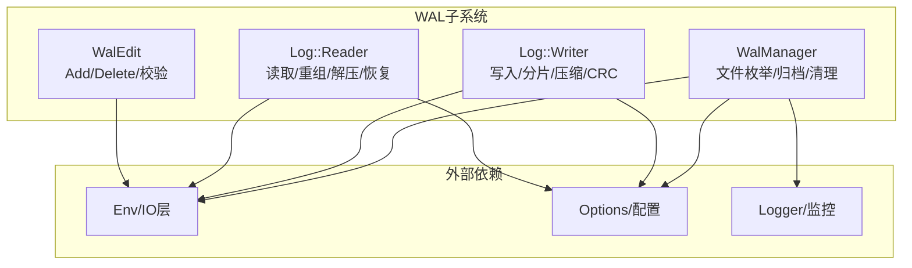
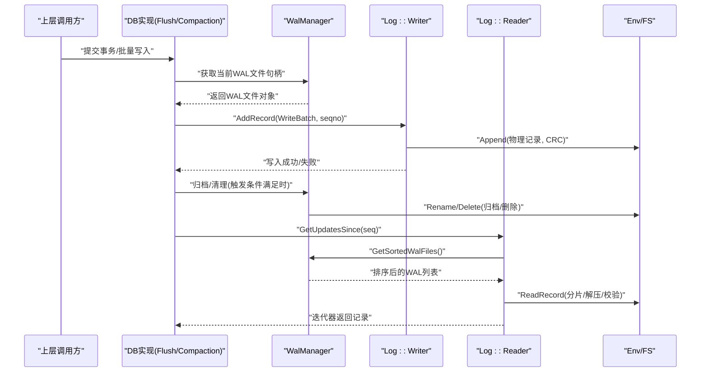
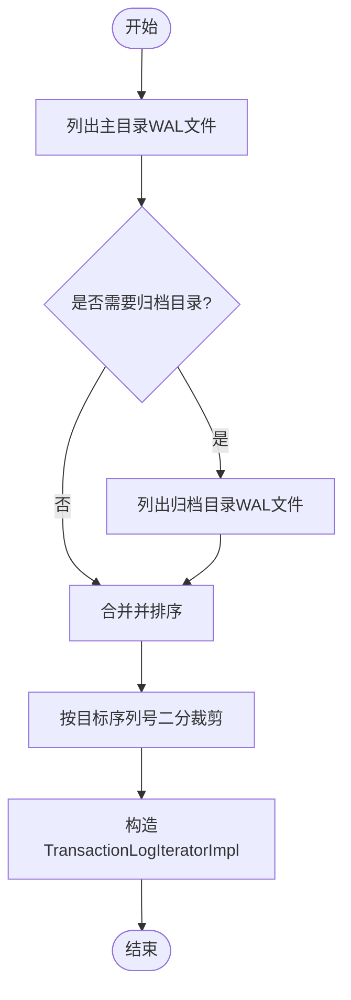
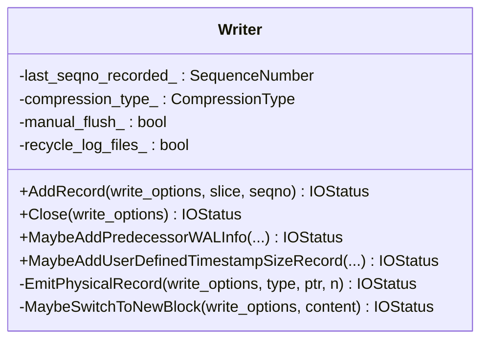
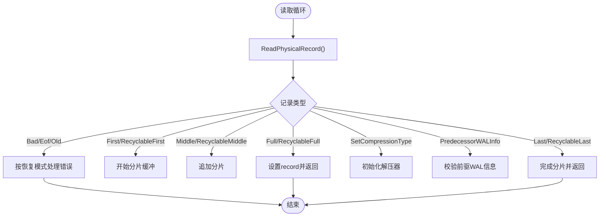
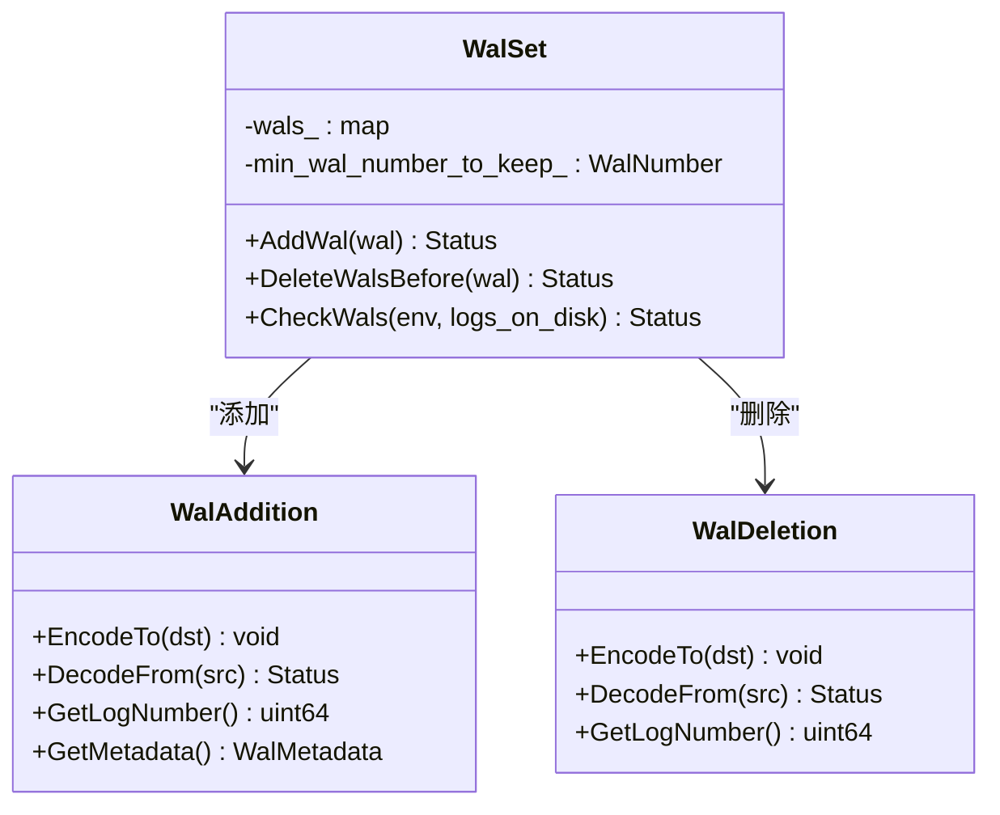
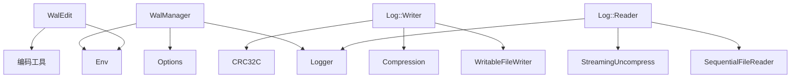

# WAL管理优化

<cite>
**本文引用的文件**   
- [wal_manager.cc](file://source/rocksdb-flush-wal-0.2/db/wal_manager.cc)
- [log_writer.cc](file://source/rocksdb-flush-wal-0.2/db/log_writer.cc)
- [log_reader.cc](file://source/rocksdb-flush-wal-0.2/db/log_reader.cc)
- [wal_edit.cc](file://source/rocksdb-flush-wal-0.2/db/wal_edit.cc)
- [vlog_manager.cc](file://source/gParaKV-GC-master/db/vlog_manager.cc)
</cite>

## 目录
1. [简介](#简介)
2. [项目结构](#项目结构)
3. [核心组件](#核心组件)
4. [架构总览](#架构总览)
5. [详细组件分析](#详细组件分析)
6. [依赖关系分析](#依赖关系分析)
7. [性能考量](#性能考量)
8. [故障排查指南](#故障排查指南)
9. [结论](#结论)
10. [附录](#附录)

## 简介
本文件围绕WAL（预写日志）管理优化，系统性阐述RocksDB中WAL的写入、读取、归档与清理机制，以及其与Flush作业和Compaction过程的交互。重点包括：
- WAL文件生命周期管理与迭代器工作原理
- 更新迭代器的二分定位策略与缓存优化
- 压缩、校验、回收模式下的记录格式与一致性保障
- 配置项与参数对行为的影响
- 常见问题与解决方案

## 项目结构
本仓库包含多个子工程，其中与WAL管理直接相关的核心代码位于rocksdb-flush-wal-0.2分支的db目录，同时参考gParaKV-GC-master中的VlogManager用于理解扩展的日志管理思路。关键文件如下：
- wal_manager.cc：WAL文件枚举、排序、归档、清理、按序列号快速定位等
- log_writer.cc：WAL记录的物理写入、分片、压缩、CRC校验、回收头处理
- log_reader.cc：WAL记录的物理读取、分片重组、压缩解压、错误恢复
- wal_edit.cc：WAL元数据变更（添加/删除）的序列化与校验
- vlog_manager.cc：扩展的Vlog管理器（用于对比/扩展场景）

图表来源 
- [wal_manager.cc:1-120](file://source/rocksdb-flush-wal-0.2/db/wal_manager.cc#L1-L120)
- [log_writer.cc:1-120](file://source/rocksdb-flush-wal-0.2/db/log_writer.cc#L1-L120)
- [log_reader.cc:1-120](file://source/rocksdb-flush-wal-0.2/db/log_reader.cc#L1-L120)
- [wal_edit.cc:1-120](file://source/rocksdb-flush-wal-0.2/db/wal_edit.cc#L1-L120)

章节来源
- [wal_manager.cc:1-120](file://source/rocksdb-flush-wal-0.2/db/wal_manager.cc#L1-L120)
- [log_writer.cc:1-120](file://source/rocksdb-flush-wal-0.2/db/log_writer.cc#L1-L120)
- [log_reader.cc:1-120](file://source/rocksdb-flush-wal-0.2/db/log_reader.cc#L1-L120)
- [wal_edit.cc:1-120](file://source/rocksdb-flush-wal-0.2/db/wal_edit.cc#L1-L120)

## 核心组件
- WalManager
  - 职责：列举并排序WAL文件、归档旧WAL、清理过期或超大小限制的文件、按目标序列号快速保留可能包含数据的WAL集合、读取首个记录以获取起始序列号并缓存。
  - 关键点：支持主目录与归档目录双路径；二进制搜索避免全量打开；首次记录读取结果缓存减少重复I/O。
- Log::Writer
  - 职责：将WriteBatch拆分为物理记录，处理分片、压缩、CRC校验、回收模式头部差异、手动刷新控制。
  - 关键点：支持kRecyclableHeaderSize与kHeaderSize两种格式；压缩类型记录作为首条记录；跟踪最后记录的序列号。
- Log::Reader
  - 职责：从WAL文件中读取物理记录，重组逻辑记录，处理压缩、校验、旧记录、EOF、损坏恢复。
  - 关键点：支持多种恢复模式；流式解压；记录级哈希校验；最小保留WAL编号校验。
- WalEdit（WalSet/WalAddition/WalDeletion）
  - 职责：描述WAL文件的增删操作，编码/解码元数据（如已同步大小），在版本编辑中应用与校验。
  - 关键点：保证同一WAL只创建一次；按最小保留编号清理；磁盘大小与元数据一致性检查。

章节来源
- [wal_manager.cc:1-547](file://source/rocksdb-flush-wal-0.2/db/wal_manager.cc#L1-L547)
- [log_writer.cc:1-403](file://source/rocksdb-flush-wal-0.2/db/log_writer.cc#L1-L403)
- [log_reader.cc:1-800](file://source/rocksdb-flush-wal-0.2/db/log_reader.cc#L1-L800)
- [wal_edit.cc:1-212](file://source/rocksdb-flush-wal-0.2/db/wal_edit.cc#L1-L212)

## 架构总览
WAL子系统由“写入—存储—读取—管理”四层构成，配合Env进行文件系统访问，通过Options控制行为，Logger输出诊断信息。

图表来源 
- [wal_manager.cc:103-130](file://source/rocksdb-flush-wal-0.2/db/wal_manager.cc#L103-L130)
- [log_writer.cc:89-191](file://source/rocksdb-flush-wal-0.2/db/log_writer.cc#L89-L191)
- [log_reader.cc:78-175](file://source/rocksdb-flush-wal-0.2/db/log_reader.cc#L78-L175)

## 详细组件分析

### WalManager：WAL文件管理与迭代器支撑
- 文件枚举与排序
  - 先扫描主目录，再扫描归档目录，合并并按LogNumber排序，避免竞态导致遗漏。
  - 支持需要序列号的场景：读取每个WAL的首条记录获取StartSequence，空文件或仅含压缩类型记录的特殊处理。
- 归档与清理
  - 归档：将活跃WAL重命名为归档名，便于后续清理。
  - 清理：基于TTL与大小限制策略，删除过期或空文件，计算需删除数量并执行删除。
- 按序列号定位
  - RetainProbableWalFiles使用二分查找，根据StartSequence快速裁剪不需要的前缀文件，提升迭代效率。
- 首次记录读取与缓存
  - ReadFirstLine解析首条WriteBatch提取序列号，结果缓存到read_first_record_cache_，降低重复I/O开销。

图表来源 
- [wal_manager.cc:45-101](file://source/rocksdb-flush-wal-0.2/db/wal_manager.cc#L45-L101)
- [wal_manager.cc:103-130](file://source/rocksdb-flush-wal-0.2/db/wal_manager.cc#L103-L130)
- [wal_manager.cc:368-392](file://source/rocksdb-flush-wal-0.2/db/wal_manager.cc#L368-L392)

章节来源
- [wal_manager.cc:45-101](file://source/rocksdb-flush-wal-0.2/db/wal_manager.cc#L45-L101)
- [wal_manager.cc:103-130](file://source/rocksdb-flush-wal-0.2/db/wal_manager.cc#L103-L130)
- [wal_manager.cc:140-285](file://source/rocksdb-flush-wal-0.2/db/wal_manager.cc#L140-L285)
- [wal_manager.cc:303-366](file://source/rocksdb-flush-wal-0.2/db/wal_manager.cc#L303-L366)
- [wal_manager.cc:368-392](file://source/rocksdb-flush-wal-0.2/db/wal_manager.cc#L368-L392)
- [wal_manager.cc:468-544](file://source/rocksdb-flush-wal-0.2/db/wal_manager.cc#L468-L544)

### Log::Writer：WAL写入与记录格式
- 记录分片与块边界
  - 当剩余空间不足时填充trailer并切换到新块，确保块内至少预留header_size字节。
- 压缩与校验
  - 首条记录可设置压缩类型；后续记录按需压缩；每条记录附带CRC校验，支持回收模式的不同头部格式。
- 特殊记录类型
  - kSetCompressionType、PredecessorWALInfo、UserDefinedTimestampSize等元数据记录在写入时单独处理并强制flush。
- 刷新策略
  - manual_flush_控制是否每次写入后flush；否则在AddRecord末尾进行flush。

图表来源 
- [log_writer.cc:23-54](file://source/rocksdb-flush-wal-0.2/db/log_writer.cc#L23-L54)
- [log_writer.cc:89-191](file://source/rocksdb-flush-wal-0.2/db/log_writer.cc#L89-L191)
- [log_writer.cc:193-236](file://source/rocksdb-flush-wal-0.2/db/log_writer.cc#L193-L236)
- [log_writer.cc:238-307](file://source/rocksdb-flush-wal-0.2/db/log_writer.cc#L238-L307)
- [log_writer.cc:311-362](file://source/rocksdb-flush-wal-0.2/db/log_writer.cc#L311-L362)

章节来源
- [log_writer.cc:89-191](file://source/rocksdb-flush-wal-0.2/db/log_writer.cc#L89-L191)
- [log_writer.cc:193-236](file://source/rocksdb-flush-wal-0.2/db/log_writer.cc#L193-L236)
- [log_writer.cc:238-307](file://source/rocksdb-flush-wal-0.2/db/log_writer.cc#L238-L307)
- [log_writer.cc:311-362](file://source/rocksdb-flush-wal-0.2/db/log_writer.cc#L311-L362)

### Log::Reader：WAL读取与恢复
- 记录重组
  - Full/First/Middle/Last四种分片类型组合成完整逻辑记录；支持回收模式类型。
- 压缩与校验
  - 遇到kSetCompressionType初始化解压器；支持流式解压与片段级哈希校验。
- 恢复模式
  - 根据WALRecoveryMode决定如何处理截断、旧记录、校验失败等异常；严格模式下报告损坏，宽松模式下跳过。
- 最小保留WAL编号
  - 结合min_wal_number_to_keep_与PredecessorWALInfo校验，防止缺失必要WAL导致不一致。

图表来源 
- [log_reader.cc:78-175](file://source/rocksdb-flush-wal-0.2/db/log_reader.cc#L78-L175)
- [log_reader.cc:359-415](file://source/rocksdb-flush-wal-0.2/db/log_reader.cc#L359-L415)
- [log_reader.cc:552-698](file://source/rocksdb-flush-wal-0.2/db/log_reader.cc#L552-L698)

章节来源
- [log_reader.cc:78-175](file://source/rocksdb-flush-wal-0.2/db/log_reader.cc#L78-L175)
- [log_reader.cc:359-415](file://source/rocksdb-flush-wal-0.2/db/log_reader.cc#L359-L415)
- [log_reader.cc:552-698](file://source/rocksdb-flush-wal-0.2/db/log_reader.cc#L552-L698)

### WalEdit：WAL元数据变更与一致性校验
- WalAddition/WalDeletion
  - 编码/解码WAL编号与元数据（如已同步大小），终止标记确保正确解析。
- WalSet
  - 维护WAL集合与最小保留编号；去重与覆盖规则保证幂等性；CheckWals比对磁盘实际大小与元数据一致性。

图表来源 
- [wal_edit.cc:14-75](file://source/rocksdb-flush-wal-0.2/db/wal_edit.cc#L14-L75)
- [wal_edit.cc:77-105](file://source/rocksdb-flush-wal-0.2/db/wal_edit.cc#L77-L105)
- [wal_edit.cc:107-212](file://source/rocksdb-flush-wal-0.2/db/wal_edit.cc#L107-L212)

章节来源
- [wal_edit.cc:14-75](file://source/rocksdb-flush-wal-0.2/db/wal_edit.cc#L14-L75)
- [wal_edit.cc:77-105](file://source/rocksdb-flush-wal-0.2/db/wal_edit.cc#L77-L105)
- [wal_edit.cc:107-212](file://source/rocksdb-flush-wal-0.2/db/wal_edit.cc#L107-L212)

### VlogManager：扩展的日志管理（对比参考）
- 功能概述
  - 维护Vlog实例映射、热键值追踪、迁移阈值判断与迁移目标选择。
- 适用场景
  - 在特定优化路径中，结合GPU/内存加速，对热点数据进行选择性迁移。

章节来源
- [vlog_manager.cc:1-68](file://source/gParaKV-GC-master/db/vlog_manager.cc#L1-L68)

## 依赖关系分析
- WalManager依赖Env进行文件枚举、大小查询、重命名与删除；依赖Options提供时间源、日志与WAL策略；依赖Logger输出诊断。
- Log::Writer依赖WritableFileWriter进行底层写入，依赖Compression接口进行压缩，依赖CRC32C进行校验。
- Log::Reader依赖SequentialFileReader进行顺序读取，依赖StreamingUncompress进行解压，依赖Logger与Reporter进行错误上报。
- WalEdit依赖编码工具与Env进行一致性检查。

图表来源 
- [wal_manager.cc:1-50](file://source/rocksdb-flush-wal-0.2/db/wal_manager.cc#L1-L50)
- [log_writer.cc:1-40](file://source/rocksdb-flush-wal-0.2/db/log_writer.cc#L1-L40)
- [log_reader.cc:1-54](file://source/rocksdb-flush-wal-0.2/db/log_reader.cc#L1-L54)
- [wal_edit.cc:1-20](file://source/rocksdb-flush-wal-0.2/db/wal_edit.cc#L1-L20)

章节来源
- [wal_manager.cc:1-50](file://source/rocksdb-flush-wal-0.2/db/wal_manager.cc#L1-L50)
- [log_writer.cc:1-40](file://source/rocksdb-flush-wal-0.2/db/log_writer.cc#L1-L40)
- [log_reader.cc:1-54](file://source/rocksdb-flush-wal-0.2/db/log_reader.cc#L1-L54)
- [wal_edit.cc:1-20](file://source/rocksdb-flush-wal-0.2/db/wal_edit.cc#L1-L20)

## 性能考量
- I/O优化
  - 首次记录读取缓存减少重复I/O；二分裁剪避免全量打开WAL；归档目录与主目录分离减少锁竞争。
- 压缩与CPU
  - 压缩类型记录仅在必要时启用；流式压缩/解压降低内存峰值；记录级哈希校验在压缩路径下仍保持高效。
- 并发与一致性
  - 清理与归档操作通过原子重命名与CAS时间戳避免竞态；最小保留编号与PredecessorWALInfo校验保证恢复一致性。
- 建议
  - 合理设置WAL TTL与大小限制，避免频繁清理；在高吞吐场景开启压缩但评估CPU开销；监控WAL文件大小分布与迭代耗时。

[本节为通用指导，不直接分析具体文件]

## 故障排查指南
- WAL文件缺失或大小不一致
  - 现象：CheckWals报错“Missing WAL”或“Size mismatch”。
  - 排查：确认MANIFEST中记录的已同步大小与实际文件大小一致；检查归档目录是否存在被误删的情况。
- 压缩类型记录位置错误
  - 现象：Reader报告“SetCompressionType not the first record”。
  - 排查：确保WAL文件第一条记录为压缩类型设置；检查Writer是否正确初始化压缩器。
- 记录损坏或校验失败
  - 现象：Reader报告“checksum mismatch”或“bad record length”。
  - 排查：根据恢复模式决定是否跳过；检查底层存储介质与Env错误；查看Corruption回调日志。
- 迭代器定位慢
  - 现象：GetUpdatesSince耗时高。
  - 排查：确认WAL文件数量与大小分布；检查首次记录读取缓存命中率；评估二分裁剪效果。

章节来源
- [wal_edit.cc:169-212](file://source/rocksdb-flush-wal-0.2/db/wal_edit.cc#L169-L212)
- [log_reader.cc:176-197](file://source/rocksdb-flush-wal-0.2/db/log_reader.cc#L176-L197)
- [log_reader.cc:324-340](file://source/rocksdb-flush-wal-0.2/db/log_reader.cc#L324-L340)
- [wal_manager.cc:368-392](file://source/rocksdb-flush-wal-0.2/db/wal_manager.cc#L368-L392)

## 结论
WAL管理优化围绕“高效写入、可靠读取、精细管理”三大目标展开。WalManager通过文件枚举、归档与清理策略保障资源占用可控；Log::Writer与Log::Reader通过分片、压缩、校验与恢复模式确保数据一致性与性能；WalEdit提供元数据变更的一致性与可验证性。结合合理的配置与监控，可在高吞吐与强一致性之间取得平衡。

[本节为总结，不直接分析具体文件]

## 附录
- 配置选项与参数（示例）
  - WAL_ttl_seconds：WAL文件TTL清理阈值
  - WAL_size_limit_MB：WAL归档目录大小限制
  - wal_recovery_mode：WAL恢复模式（严格/点时间/跳过损坏）
  - wal_compression：是否启用WAL压缩
  - min_wal_number_to_keep：最小保留WAL编号
- 返回值说明
  - Status/IOStatus：表示操作成功或失败原因
  - SequenceNumber：WAL记录序列号，用于定位与排序
  - 布尔标志：如manual_flush_、recycle_log_files_影响写入行为

[本节为补充信息，不直接分析具体文件]