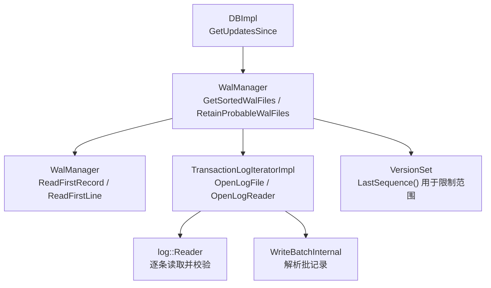
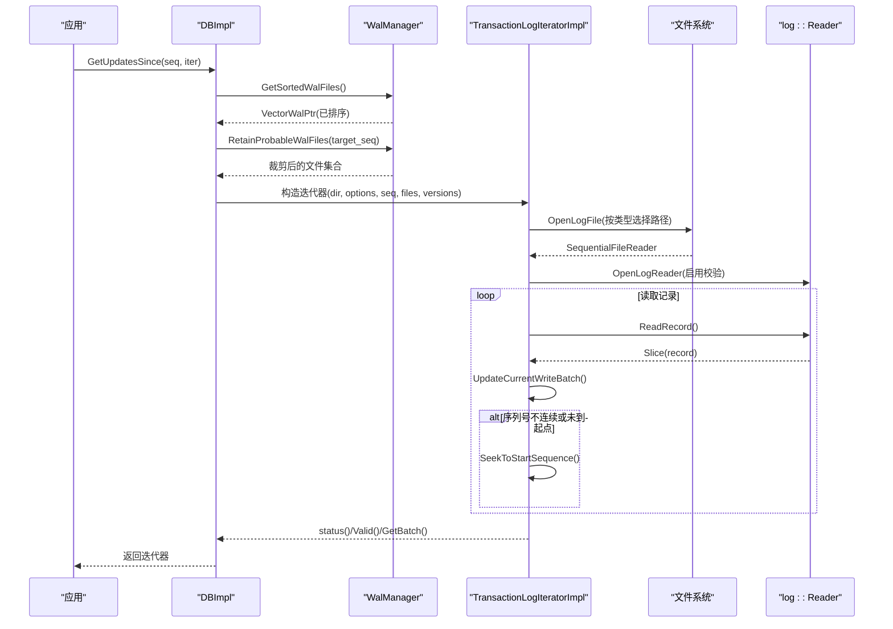
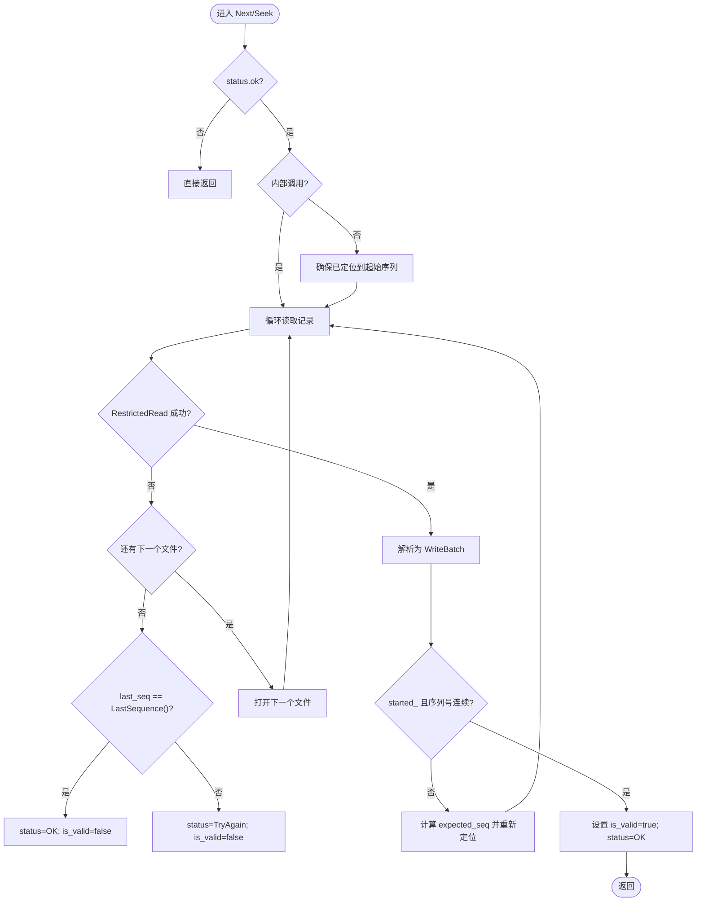
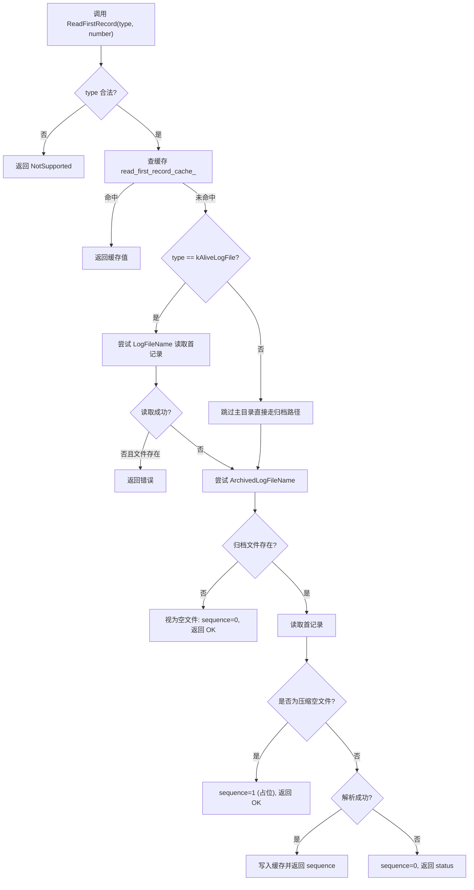
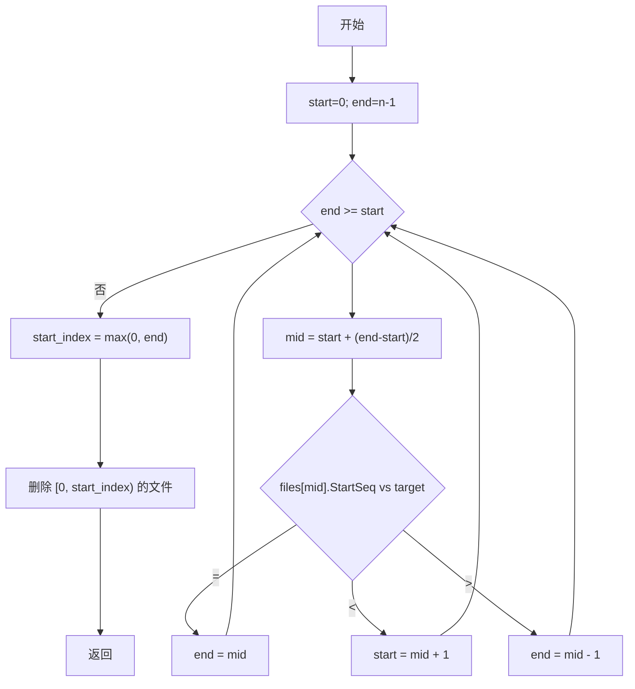
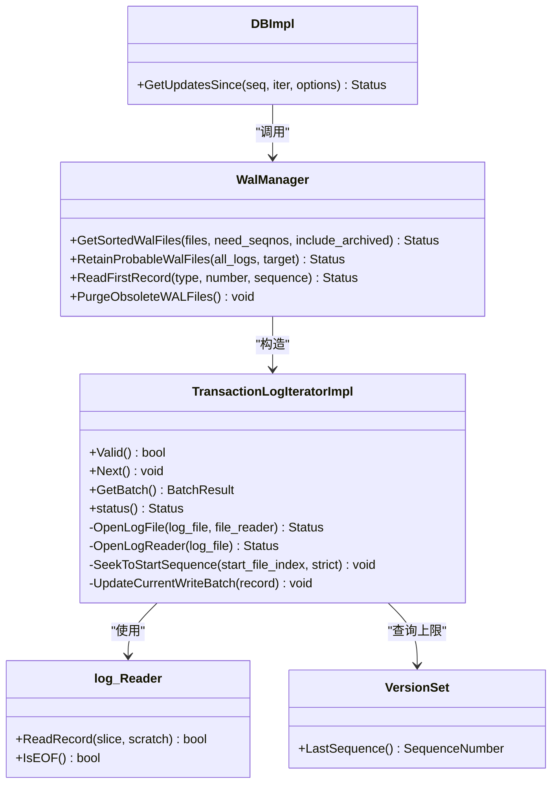

# 日志读取器与迭代器

<cite>
**本文引用的文件**   
- [transaction_log.h](file://source/rocksdb/include/rocksdb/transaction_log.h)
- [transaction_log_impl.cc](file://source/rocksdb/db/transaction_log_impl.cc)
- [wal_manager.h](file://source/rocksdb/db/wal_manager.h)
- [wal_manager.cc](file://source/rocksdb/db/wal_manager.cc)
- [db_impl.cc](file://source/rocksdb/db/db_impl/db_impl.cc)
- [db_log_iter_test.cc](file://source/rocksdb/db/db_log_iter_test.cc)
</cite>

## 目录
1. [简介](#简介)
2. [项目结构](#项目结构)
3. [核心组件](#核心组件)
4. [架构总览](#架构总览)
5. [详细组件分析](#详细组件分析)
6. [依赖关系分析](#依赖关系分析)
7. [性能考量](#性能考量)
8. [故障排查指南](#故障排查指南)
9. [结论](#结论)
10. [附录](#附录)

## 简介
本文件围绕 RocksDB 的 WAL（预写日志）读取与事务日志迭代能力进行深入说明，重点覆盖：
- TransactionLogIterator 的工作原理、遍历策略与性能优化
- ReadFirstRecord 的实现机制、序列号缓存策略与文件定位算法
- 二进制搜索 RetainProbableWalFiles 的时间复杂度与边界条件
- kAliveLogFile 与 kArchivedLogFile 的处理差异
- 读取过程中的异常处理（文件损坏、数据截断、校验失败）
- 调试技巧与性能监控方法
- 使用迭代器进行数据恢复与一致性检查的实践示例

## 项目结构
与日志读取和迭代相关的关键代码集中在以下模块：
- 接口定义：TransactionLogIterator 及其 ReadOptions、BatchResult、WalFile/WalFileType
- 迭代器实现：TransactionLogIteratorImpl（打开文件、按记录解析、跨文件推进、序列号连续性检查）
- WAL 管理器：WalManager（获取排序后的 WAL 列表、二分查找目标起始文件、ReadFirstRecord 缓存、归档清理）
- DB 入口：DBImpl::GetUpdatesSince（对外暴露 API）
- 测试用例：db_log_iter_test.cc（覆盖正常遍历、竞态、归档场景、损坏日志等）

图表来源 
- [db_impl.cc:5478-5491](file://source/rocksdb/db/db_impl/db_impl.cc#L5478-L5491)
- [wal_manager.cc:103-130](file://source/rocksdb/db/wal_manager.cc#L103-L130)
- [wal_manager.cc:368-392](file://source/rocksdb/db/wal_manager.cc#L368-L392)
- [wal_manager.cc:394-438](file://source/rocksdb/db/wal_manager.cc#L394-L438)
- [transaction_log_impl.cc:16-43](file://source/rocksdb/db/transaction_log_impl.cc#L16-L43)
- [transaction_log_impl.cc:283-294](file://source/rocksdb/db/transaction_log_impl.cc#L283-L294)

章节来源
- [db_impl.cc:5478-5491](file://source/rocksdb/db/db_impl/db_impl.cc#L5478-L5491)
- [wal_manager.h:35-135](file://source/rocksdb/db/wal_manager.h#L35-L135)
- [wal_manager.cc:103-130](file://source/rocksdb/db/wal_manager.cc#L103-L130)
- [transaction_log.h:22-33](file://source/rocksdb/include/rocksdb/transaction_log.h#L22-L33)

## 核心组件
- TransactionLogIterator（接口）
  - 提供 Valid/Next/GetBatch/status 等方法，支持按 WriteBatch 连续遍历
  - ReadOptions 控制是否校验校验和
- WalFile/WalFileType
  - WalFile 抽象 WAL 文件的元信息（路径、编号、类型、起始序列号、大小）
  - WalFileType 区分 kAliveLogFile（活跃日志）与 kArchivedLogFile（归档日志）
- TransactionLogIteratorImpl（实现）
  - 负责打开文件、构造 log::Reader、按记录解析为 WriteBatch、维护当前批次与序列号区间
  - 支持在严格模式下检测序列号间隙，必要时回退重定位
- WalManager（WAL 管理）
  - GetSortedWalFiles：合并主目录与归档目录的 WAL 列表，保证顺序与去重
  - RetainProbableWalFiles：基于 StartSequence 的二分查找，裁剪到可能包含目标序列号的子集
  - ReadFirstRecord：读取首个记录的序列号，带缓存与压缩空文件兼容逻辑
  - PurgeObsoleteWALFiles：按 TTL/大小限制清理归档 WAL

章节来源
- [transaction_log.h:22-33](file://source/rocksdb/include/rocksdb/transaction_log.h#L22-L33)
- [transaction_log.h:63-87](file://source/rocksdb/include/rocksdb/transaction_log.h#L63-L87)
- [transaction_log.h:89-127](file://source/rocksdb/include/rocksdb/transaction_log.h#L89-L127)
- [transaction_log_impl.cc:16-43](file://source/rocksdb/db/transaction_log_impl.cc#L16-L43)
- [wal_manager.h:35-135](file://source/rocksdb/db/wal_manager.h#L35-L135)
- [wal_manager.cc:103-130](file://source/rocksdb/db/wal_manager.cc#L103-L130)
- [wal_manager.cc:368-392](file://source/rocksdb/db/wal_manager.cc#L368-L392)
- [wal_manager.cc:394-438](file://source/rocksdb/db/wal_manager.cc#L394-L438)

## 架构总览
下图展示了从 DB 层调用到 WAL 迭代器的完整流程，包括文件选择、序列号定位、逐条读取与错误处理。

图表来源 
- [db_impl.cc:5478-5491](file://source/rocksdb/db/db_impl/db_impl.cc#L5478-L5491)
- [wal_manager.cc:103-130](file://source/rocksdb/db/wal_manager.cc#L103-L130)
- [wal_manager.cc:368-392](file://source/rocksdb/db/wal_manager.cc#L368-L392)
- [transaction_log_impl.cc:16-43](file://source/rocksdb/db/transaction_log_impl.cc#L16-L43)
- [transaction_log_impl.cc:283-294](file://source/rocksdb/db/transaction_log_impl.cc#L283-L294)

## 详细组件分析

### TransactionLogIterator 工作原理与遍历策略
- 启动与定位
  - 构造时根据 starting_sequence_number_ 调用 SeekToStartSequence，扫描记录直到找到满足条件的批次
  - 若 strict 模式且未命中期望序列号，将标记 Corruption 状态
- 逐条读取
  - RestrictedRead 限制读取不超过 LastSequence()，避免读到尚未刷盘的数据
  - 每条记录通过 WriteBatchInternal 解析为 WriteBatch，更新 current_batch_seq_ 与 current_last_seq_
- 跨文件推进
  - NextImpl 循环读取，遇到 EOF 后切换到下一个文件；若已到末尾但 last_seq 小于 LastSequence()，返回 TryAgain 提示重建迭代器
- 序列号连续性检查
  - IsBatchExpected 比较预期序列号与实际批次序列号，若不匹配则尝试回退到前一个文件并重定位
- 状态与有效性
  - started_ 表示是否已到达起始位置；is_valid_ 表示当前指针是否指向有效批次

图表来源 
- [transaction_log_impl.cc:169-226](file://source/rocksdb/db/transaction_log_impl.cc#L169-L226)
- [transaction_log_impl.cc:228-281](file://source/rocksdb/db/transaction_log_impl.cc#L228-L281)
- [transaction_log_impl.cc:94-167](file://source/rocksdb/db/transaction_log_impl.cc#L94-L167)

章节来源
- [transaction_log_impl.cc:16-43](file://source/rocksdb/db/transaction_log_impl.cc#L16-L43)
- [transaction_log_impl.cc:86-92](file://source/rocksdb/db/transaction_log_impl.cc#L86-L92)
- [transaction_log_impl.cc:94-167](file://source/rocksdb/db/transaction_log_impl.cc#L94-L167)
- [transaction_log_impl.cc:169-226](file://source/rocksdb/db/transaction_log_impl.cc#L169-L226)
- [transaction_log_impl.cc:228-281](file://source/rocksdb/db/transaction_log_impl.cc#L228-L281)

### ReadFirstRecord 实现机制、序列号缓存与文件定位
- 文件类型校验
  - 仅允许 kAliveLogFile 与 kArchivedLogFile，否则返回 NotSupported
- 缓存命中
  - 使用 read_first_record_cache_ 以 LogNumber 为键缓存首个记录的序列号，减少重复 IO
- 文件定位策略
  - 优先尝试主目录路径 LogFileName；失败且文件存在时返回错误
  - 若为归档文件或主目录失败，则尝试 ArchivedLogFileName；如归档文件不存在，视为空文件（返回 OK 且 sequence=0）
- 压缩空文件兼容
  - 当 WAL 压缩开启时，空文件会写入一条无序列号的压缩类型记录；此时将 sequence 设为 1，以便后续筛选包含该文件
- 结果缓存
  - 成功读取且 sequence!=0 时写入缓存，供后续快速访问

图表来源 
- [wal_manager.cc:394-438](file://source/rocksdb/db/wal_manager.cc#L394-L438)
- [wal_manager.cc:468-544](file://source/rocksdb/db/wal_manager.cc#L468-L544)

章节来源
- [wal_manager.cc:394-438](file://source/rocksdb/db/wal_manager.cc#L394-L438)
- [wal_manager.cc:468-544](file://source/rocksdb/db/wal_manager.cc#L468-L544)
- [wal_manager.h:88-119](file://source/rocksdb/db/wal_manager.h#L88-L119)

### 二进制搜索 RetainProbableWalFiles 的算法与边界条件
- 输入：按 LogNumber 升序排列的 WAL 文件列表（每个文件含 StartSequence）
- 目标：保留所有可能包含 target 序列号及之后的文件
- 算法要点
  - 标准二分查找，mid 处比较 StartSequence 与 target
  - 若相等，end=mid；若小于，start=mid+1；若大于，end=mid-1
  - 最终 start_index = max(0, end)，删除索引之前的文件
  - 最后一个文件始终保留，确保覆盖尾部新增内容
- 时间复杂度：O(log n)
- 空间复杂度：O(1)
- 边界条件
  - 全部 StartSequence > target：end 可能为负数，start_index 取 0
  - 全部 StartSequence < target：end 为最后索引，start_index 为 0，保留全部
  - 空列表：函数直接返回（由调用方保证非空）

图表来源 
- [wal_manager.cc:368-392](file://source/rocksdb/db/wal_manager.cc#L368-L392)

章节来源
- [wal_manager.cc:368-392](file://source/rocksdb/db/wal_manager.cc#L368-L392)

### kAliveLogFile 与 kArchivedLogFile 的处理差异
- 文件路径选择
  - kAliveLogFile：优先使用 LogFileName(wal_dir_, number)；若失败且文件存在则返回错误
  - kArchivedLogFile：直接使用 ArchivedLogFileName(wal_dir_, number)
- 打开与回退
  - TransactionLogIteratorImpl::OpenLogFile 对 kAliveLogFile 先尝试主目录，失败再尝试归档目录，增强鲁棒性
- 归档清理与缓存失效
  - PurgeObsoleteWALFiles 删除归档文件时会清除 read_first_record_cache_ 中对应条目，避免脏缓存
- 空文件与压缩兼容
  - ReadFirstLine 对压缩空文件特殊处理，设置 sequence=1 以保证后续筛选包含该文件

章节来源
- [wal_manager.cc:394-438](file://source/rocksdb/db/wal_manager.cc#L394-L438)
- [wal_manager.cc:140-285](file://source/rocksdb/db/wal_manager.cc#L140-L285)
- [transaction_log_impl.cc:45-72](file://source/rocksdb/db/transaction_log_impl.cc#L45-L72)

### 异常处理：文件损坏、数据截断与校验失败
- 记录过小或头部不完整
  - 在 RestrictedRead/UpdateCurrentWriteBatch 中检测到 record.size() < WriteBatchInternal::kHeader，标记 Corruption 并继续
- 校验失败
  - log::Reader 在启用 verify_checksums_ 时进行校验，失败通过 Reporter 回调上报
- 序列号不连续
  - IsBatchExpected 发现 gap 时，尝试回退到前一个文件并重新定位；strict 模式下直接报错
- 文件缺失或移动
  - ReadFirstRecord 对归档文件不存在的情况返回 OK 且 sequence=0，调用方识别为空文件
- 尾部新数据
  - NextImpl 结束时若 last_seq < LastSequence()，返回 TryAgain，提示重建迭代器

章节来源
- [transaction_log_impl.cc:86-92](file://source/rocksdb/db/transaction_log_impl.cc#L86-L92)
- [transaction_log_impl.cc:228-281](file://source/rocksdb/db/transaction_log_impl.cc#L228-L281)
- [wal_manager.cc:394-438](file://source/rocksdb/db/wal_manager.cc#L394-L438)
- [transaction_log_impl.cc:215-226](file://source/rocksdb/db/transaction_log_impl.cc#L215-L226)

### 使用迭代器进行数据恢复与一致性检查（实践示例）
- 基本用法
  - 通过 DBImpl::GetUpdatesSince(seq, &iter) 获取迭代器
  - 循环 Valid() 与 Next()，用 GetBatch() 取出 WriteBatch 与序列号
- 数据恢复
  - 从指定序列号开始遍历，回放 WriteBatch 到目标存储
- 一致性检查
  - 验证序列号单调递增；遇到 gap 时依据策略重试或报告
  - 结合 LastSequence() 判断是否读到最新尾端
- 参考测试
  - db_log_iter_test.cc 中的多个用例演示了正常遍历、竞态、归档、损坏日志等场景

章节来源
- [db_impl.cc:5478-5491](file://source/rocksdb/db/db_impl/db_impl.cc#L5478-L5491)
- [db_log_iter_test.cc:26-33](file://source/rocksdb/db/db_log_iter_test.cc#L26-L33)
- [db_log_iter_test.cc:37-63](file://source/rocksdb/db/db_log_iter_test.cc#L37-L63)
- [db_log_iter_test.cc:66-91](file://source/rocksdb/db/db_log_iter_test.cc#L66-L91)
- [db_log_iter_test.cc:94-148](file://source/rocksdb/db/db_log_iter_test.cc#L94-L148)
- [db_log_iter_test.cc:150-192](file://source/rocksdb/db/db_log_iter_test.cc#L150-L192)

## 依赖关系分析
- DBImpl 依赖 WalManager 获取 WAL 列表与裁剪
- WalManager 依赖 FileSystem/Env 进行文件操作，依赖 log::Reader 解析记录
- TransactionLogIteratorImpl 依赖 log::Reader 与 WriteBatchInternal，依赖 VersionSet 获取 LastSequence()
- 测试用例依赖 SyncPoint 模拟竞态与归档迁移

图表来源 
- [db_impl.cc:5478-5491](file://source/rocksdb/db/db_impl/db_impl.cc#L5478-L5491)
- [wal_manager.h:35-135](file://source/rocksdb/db/wal_manager.h#L35-L135)
- [transaction_log_impl.cc:16-43](file://source/rocksdb/db/transaction_log_impl.cc#L16-L43)

章节来源
- [db_impl.cc:5478-5491](file://source/rocksdb/db/db_impl/db_impl.cc#L5478-L5491)
- [wal_manager.h:35-135](file://source/rocksdb/db/wal_manager.h#L35-L135)
- [transaction_log_impl.cc:16-43](file://source/rocksdb/db/transaction_log_impl.cc#L16-L43)

## 性能考量
- 二分查找裁剪文件集合
  - RetainProbableWalFiles 将 O(n) 全量打开降为 O(log n) 定位，显著减少 IO
- 首记录序列号缓存
  - ReadFirstRecord 的缓存避免重复读取同一文件的首条记录，降低冷启动开销
- 只读优化
  - OpenLogFile 使用 OptimizeForLogRead 配置，提升顺序读取性能
- 限制读取范围
  - RestrictedRead 以 LastSequence() 为界，避免读取未提交数据
- 异步与重试
  - 尾部新数据出现时返回 TryAgain，上层可重建迭代器，避免阻塞

[本节为通用指导，不直接分析具体文件]

## 故障排查指南
- 常见问题定位
  - 校验失败：检查 ReadOptions.verify_checksums_ 与 log::Reader 的 reporter 输出
  - 序列号不连续：查看 IsBatchExpected 日志与 SeekToStartSequence 的重定位行为
  - 文件缺失/移动：确认 ReadFirstRecord 的归档回退逻辑与 PurgeObsoleteWALFiles 的缓存清理
- 调试技巧
  - 使用 TEST_ReadFirstRecord/TEST_ReadFirstLine 辅助验证首记录解析
  - 借助 db_log_iter_test.cc 中的 SyncPoint 复现竞态与归档迁移
- 监控建议
  - 关注 info_log 中的 Corruption/TryAgain 消息
  - 统计 GetUpdatesSince 调用次数与迭代器重建频率

章节来源
- [wal_manager.cc:468-544](file://source/rocksdb/db/wal_manager.cc#L468-L544)
- [wal_manager.cc:140-285](file://source/rocksdb/db/wal_manager.cc#L140-L285)
- [db_log_iter_test.cc:94-148](file://source/rocksdb/db/db_log_iter_test.cc#L94-L148)

## 结论
RocksDB 的 WAL 读取与迭代体系通过清晰的接口与稳健的实现，提供了高效、可靠的事务日志遍历能力。关键优化点包括二分查找裁剪文件、首记录缓存、受限读取与严格的序列号连续性检查。面对文件移动、归档清理与压缩空文件等复杂场景，系统具备完善的回退与容错机制。配合测试与调试工具，可在数据恢复与一致性检查中发挥重要作用。

[本节为总结，不直接分析具体文件]

## 附录
- 术语
  - WAL：预写日志
  - Batch：WriteBatch，原子写入单元
  - 序列号：SequenceNumber，全局单调递增标识
- 相关文件
  - 接口定义：transaction_log.h
  - 迭代器实现：transaction_log_impl.cc
  - WAL 管理：wal_manager.h/cc
  - DB 入口：db_impl.cc
  - 测试用例：db_log_iter_test.cc

[本节为附录，不直接分析具体文件]