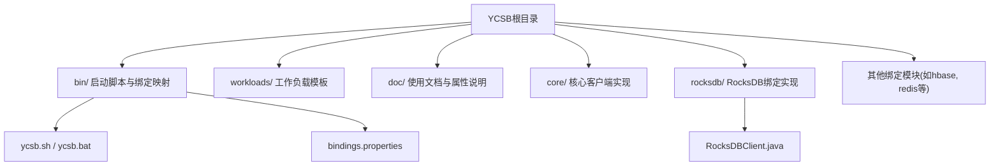
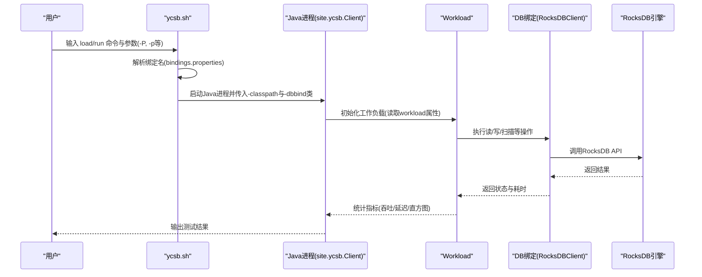
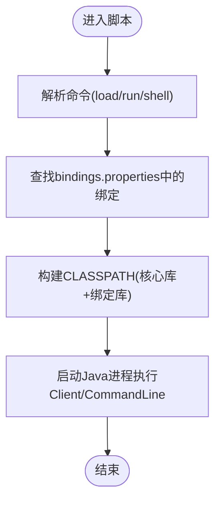
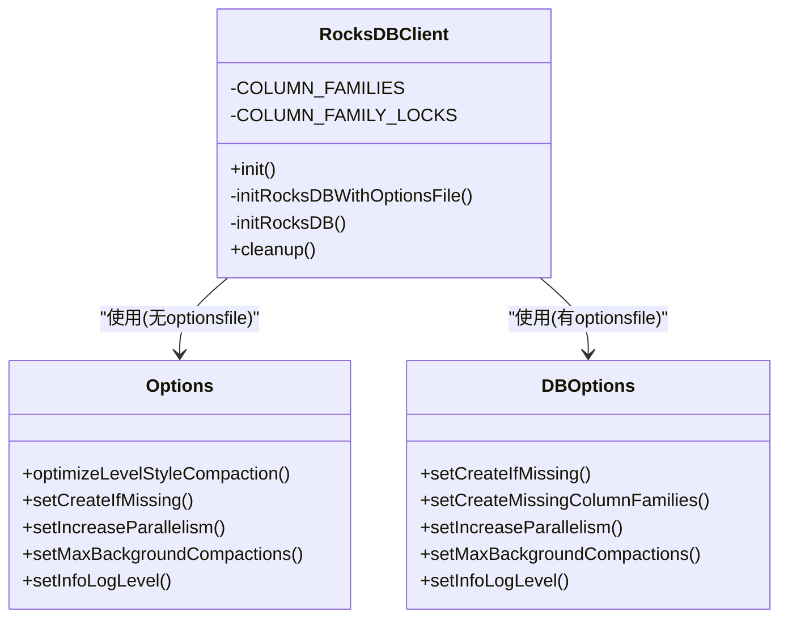
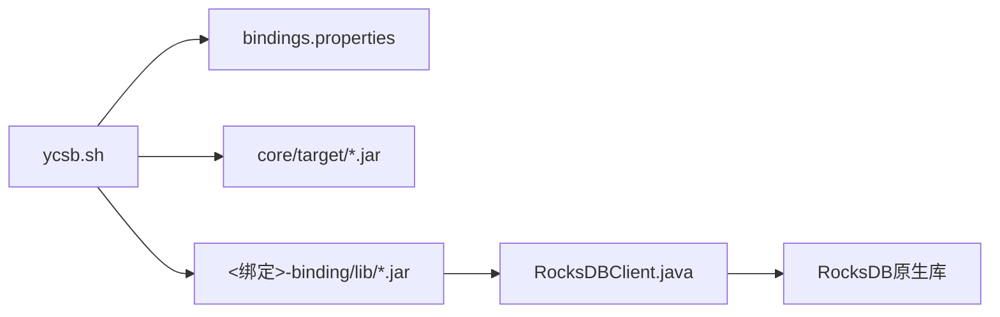

# YCSB集成指南

<cite>
**本文引用的文件**   
- [README.md](file://source/YCSB/README.md)
- [ycsb.sh](file://source/YCSB/bin/ycsb.sh)
- [bindings.properties](file://source/YCSB/bin/bindings.properties)
- [coreproperties.html](file://source/YCSB/doc/coreproperties.html)
- [workload.html](file://source/YCSB/doc/workload.html)
- [tipsfaq.html](file://source/YCSB/doc/tipsfaq.html)
- [rocksdb README.md](file://source/YCSB/rocksdb/README.md)
- [RocksDBClient.java](file://source/YCSB/rocksdb/src/main/java/site/ycsb/db/rocksdb/RocksDBClient.java)
</cite>

## 目录
1. [简介](#简介)
2. [项目结构](#项目结构)
3. [核心组件](#核心组件)
4. [架构总览](#架构总览)
5. [详细组件分析](#详细组件分析)
6. [依赖关系分析](#依赖关系分析)
7. [性能考虑](#性能考虑)
8. [故障排除指南](#故障排除指南)
9. [结论](#结论)
10. [附录](#附录)

## 简介
本指南面向需要在项目中集成YCSB（Yahoo! Cloud Serving Benchmark）进行数据库基准测试的工程师与研究者。内容涵盖：
- 安装与环境准备（下载、解压、环境变量）
- Linux与Windows平台的基本加载与运行命令
- 工作负载配置文件结构与参数说明
- 常见数据库绑定配置示例（重点RocksDB）
- 性能调优与延迟百分位分析方法
- HDR直方图文件的生成与合并
- 常见问题与排错建议

## 项目结构
YCSB仓库采用多模块Maven工程组织，核心入口脚本位于bin目录，各数据库绑定以独立子模块提供，工作负载模板位于workloads目录，文档位于doc目录。

图表来源
- [README.md:31-62](file://source/YCSB/README.md#L31-L62)
- [ycsb.sh:162-234](file://source/YCSB/bin/ycsb.sh#L162-L234)
- [bindings.properties:28-77](file://source/YCSB/bin/bindings.properties#L28-L77)
- [RocksDBClient.java:43-86](file://source/YCSB/rocksdb/src/main/java/site/ycsb/db/rocksdb/RocksDBClient.java#L43-L86)

章节来源
- [README.md:31-62](file://source/YCSB/README.md#L31-L62)
- [ycsb.sh:162-234](file://source/YCSB/bin/ycsb.sh#L162-L234)
- [bindings.properties:28-77](file://source/YCSB/bin/bindings.properties#L28-L77)

## 核心组件
- 启动脚本
  - Linux: bin/ycsb.sh；Windows: bin/ycsb.bat
  - 负责解析命令(load/run/shell)、查找绑定类、组装CLASSPATH并调用site.ycsb.Client或CommandLine
- 绑定映射
  - bin/bindings.properties：name:class映射，决定-y db参数对应的具体客户端类
- 工作负载
  - workloads/*：预置工作负载模板（如workloada），通过-P指定
  - doc/coreproperties.html：核心工作负载属性列表
  - doc/workload.html：自定义工作负载开发指南
- 数据库绑定
  - 各绑定子模块（如rocksdb、hbase、redis等）提供具体DB实现
  - RocksDB绑定：rocksdb/README.md与RocksDBClient.java

章节来源
- [ycsb.sh:79-93](file://source/YCSB/bin/ycsb.sh#L79-L93)
- [bindings.properties:28-77](file://source/YCSB/bin/bindings.properties#L28-L77)
- [coreproperties.html:29-44](file://source/YCSB/doc/coreproperties.html#L29-L44)
- [workload.html:41-69](file://source/YCSB/doc/workload.html#L41-L69)
- [rocksdb README.md:18-52](file://source/YCSB/rocksdb/README.md#L18-L52)

## 架构总览
YCSB执行流程概览：用户通过脚本传入命令与参数，脚本根据绑定名解析到具体DB客户端类，构建CLASSPATH后启动Java进程执行Client或命令行工具，由Workload驱动读写操作，DB绑定层对接底层存储。

图表来源
- [ycsb.sh:79-93](file://source/YCSB/bin/ycsb.sh#L79-L93)
- [ycsb.sh:162-234](file://source/YCSB/bin/ycsb.sh#L162-L234)
- [bindings.properties:28-77](file://source/YCSB/bin/bindings.properties#L28-L77)
- [RocksDBClient.java:61-86](file://source/YCSB/rocksdb/src/main/java/site/ycsb/db/rocksdb/RocksDBClient.java#L61-L86)

## 详细组件分析

### 启动脚本与命令解析
- 支持命令：load、run、shell
- 自动检测JAVA_HOME与CLASSPATH，区分发行版与源码模式
- 从bindings.properties解析绑定名到类名，处理部分别名与弃用提示

图表来源
- [ycsb.sh:79-93](file://source/YCSB/bin/ycsb.sh#L79-L93)
- [ycsb.sh:162-234](file://source/YCSB/bin/ycsb.sh#L162-L234)

章节来源
- [ycsb.sh:79-93](file://source/YCSB/bin/ycsb.sh#L79-L93)
- [ycsb.sh:162-234](file://source/YCSB/bin/ycsb.sh#L162-L234)

### 工作负载配置与参数
- 核心属性包括字段数量、字段长度、读写比例、请求分布、扫描长度等
- 可通过-P指定workloads下的模板文件，或通过命令行-p覆盖属性
- 自定义工作负载可继承基类并在init/initThread/doInsert/doTransaction中实现逻辑

章节来源
- [coreproperties.html:29-44](file://source/YCSB/doc/coreproperties.html#L29-L44)
- [workload.html:41-69](file://source/YCSB/doc/workload.html#L41-L69)

### RocksDB绑定与配置
- 必需参数：rocksdb.dir（数据目录）
- 可选参数：rocksdb.optionsfile（RocksDB选项文件路径）
- 未提供optionsfile时，按默认策略创建Options并启用列族、并行度与后台压缩等
- 若提供optionsfile，则完全按照文件中的RocksDB选项初始化

图表来源
- [RocksDBClient.java:61-86](file://source/YCSB/rocksdb/src/main/java/site/ycsb/db/rocksdb/RocksDBClient.java#L61-L86)
- [RocksDBClient.java:95-119](file://source/YCSB/rocksdb/src/main/java/site/ycsb/db/rocksdb/RocksDBClient.java#L95-L119)
- [RocksDBClient.java:128-176](file://source/YCSB/rocksdb/src/main/java/site/ycsb/db/rocksdb/RocksDBClient.java#L128-L176)

章节来源
- [rocksdb README.md:18-52](file://source/YCSB/rocksdb/README.md#L18-L52)
- [RocksDBClient.java:61-86](file://source/YCSB/rocksdb/src/main/java/site/ycsb/db/rocksdb/RocksDBClient.java#L61-L86)
- [RocksDBClient.java:95-119](file://source/YCSB/rocksdb/src/main/java/site/ycsb/db/rocksdb/RocksDBClient.java#L95-L119)
- [RocksDBClient.java:128-176](file://source/YCSB/rocksdb/src/main/java/site/ycsb/db/rocksdb/RocksDBClient.java#L128-L176)

### 基本加载与运行命令（Linux与Windows差异）
- Linux
  - 加载：bin/ycsb.sh load <绑定名> -P workloads/<工作负载模板> [-p 参数]
  - 运行：bin/ycsb.sh run <绑定名> -P workloads/<工作负载模板> [-p 参数]
- Windows
  - 加载：bin/ycsb.bat load <绑定名> -P workloads\<工作负载模板> [-p 参数]
  - 运行：bin/ycsb.bat run <绑定名> -P workloads\<工作负载模板> [-p 参数]

章节来源
- [README.md:47-57](file://source/YCSB/README.md#L47-L57)

### 常见数据库绑定配置示例
- RocksDB
  - 加载：./bin/ycsb load rocksdb -s -P workloads/workloada -p rocksdb.dir=/tmp/ycsb-rocksdb-data
  - 运行：./bin/ycsb run rocksdb -s -P workloads/workloada -p rocksdb.dir=/tmp/ycsb-rocksdb-data
- LevelDB
  - 仓库中未包含LevelDB绑定；如需使用，请确认是否存在对应binding模块或在bindings.properties中注册相应类
- 其他绑定
  - 可在bindings.properties中查看可用绑定名称与对应类名，按需选择

章节来源
- [rocksdb README.md:33-39](file://source/YCSB/rocksdb/README.md#L33-L39)
- [bindings.properties:28-77](file://source/YCSB/bin/bindings.properties#L28-L77)

### 性能调优与延迟百分位分析
- 线程数与吞吐
  - 合理设置线程数以使数据库成为瓶颈而非客户端
  - 估算公式：目标QPS / (1000 / 平均延迟ms)
- 延迟百分位
  - 关注P99/P99.9/P99.99等尾部延迟，避免对延迟求平均
- HDR直方图
  - 开启HDR输出：-p hdrhistogram.fileoutput=true -p hdrhistogram.output.path=file.hdr
  - 多个实例分别导出.hdr文件后，使用HdrHistogram工具进行Union与Summarize，再提取所需百分位

章节来源
- [tipsfaq.html:29-44](file://source/YCSB/doc/tipsfaq.html#L29-L44)
- [README.md:107-135](file://source/YCSB/README.md#L107-L135)

### HDR直方图文件的生成与合并
- 生成
  - 在运行YCSB时添加参数：-p hdrhistogram.fileoutput=true -p hdrhistogram.output.path=file.hdr
- 合并与分析
  - 使用HdrLogProcessing工具进行Union合并与Summarize汇总
  - 可将HDR转换为CSV以便进一步处理与可视化

章节来源
- [README.md:107-135](file://source/YCSB/README.md#L107-L135)

## 依赖关系分析
- 启动脚本依赖bindings.properties确定绑定类
- 运行时CLASSPATH包含core与绑定模块的JAR与conf
- RocksDB绑定依赖RocksDB原生库与Java封装

图表来源
- [ycsb.sh:162-234](file://source/YCSB/bin/ycsb.sh#L162-L234)
- [bindings.properties:28-77](file://source/YCSB/bin/bindings.properties#L28-L77)
- [RocksDBClient.java:61-86](file://source/YCSB/rocksdb/src/main/java/site/ycsb/db/rocksdb/RocksDBClient.java#L61-L86)

章节来源
- [ycsb.sh:162-234](file://source/YCSB/bin/ycsb.sh#L162-L234)
- [bindings.properties:28-77](file://source/YCSB/bin/bindings.properties#L28-L77)

## 性能考虑
- 线程数与延迟的关系：线程不足会限制QPS，需根据预期延迟计算合适线程数
- 并发与资源竞争：过多线程可能引发上下文切换开销，需平衡
- 存储后端参数：RocksDB可通过optionsfile精细调优（压缩、并行度、日志级别等）
- 直方图与百分位：优先分析尾部延迟，结合业务SLA评估用户体验

[本节为通用指导，不直接分析具体文件]

## 故障排除指南
- Java环境缺失
  - 现象：脚本报错找不到java可执行文件
  - 解决：设置JAVA_HOME或确保系统PATH中存在java
- 绑定未找到
  - 现象：指定的绑定名不存在
  - 解决：检查bindings.properties是否包含该绑定名，或确认已编译对应绑定模块
- 路径含空格
  - 现象：YCSB_HOME路径包含空格导致异常
  - 解决：将YCSB安装到不含空格的路径
- RocksDB数据目录权限
  - 现象：无法创建或写入rocksdb.dir
  - 解决：确保目录存在且当前用户有读写权限
- 多线程吞吐不达预期
  - 现象：QPS低于目标
  - 解决：适当增加线程数，观察是否达到数据库瓶颈

章节来源
- [ycsb.sh:74-77](file://source/YCSB/bin/ycsb.sh#L74-L77)
- [ycsb.sh:96-101](file://source/YCSB/bin/ycsb.sh#L96-L101)
- [ycsb.sh:37-38](file://source/YCSB/bin/ycsb.sh#L37-L38)
- [rocksdb README.md:43-46](file://source/YCSB/rocksdb/README.md#L43-L46)
- [tipsfaq.html:29-44](file://source/YCSB/doc/tipsfaq.html#L29-L44)

## 结论
通过本指南，您可以完成YCSB的安装与基础使用，理解工作负载配置与参数含义，掌握RocksDB绑定的关键配置项，学会基于HDR直方图的延迟分析与性能调优方法，并能快速定位常见问题。建议在真实环境中结合业务特征定制工作负载与数据库参数，以获得更具参考价值的基准结果。

[本节为总结性内容，不直接分析具体文件]

## 附录
- 常用命令速查
  - Linux加载：bin/ycsb.sh load <绑定> -P workloads/<模板> [-p 参数]
  - Linux运行：bin/ycsb.sh run <绑定> -P workloads/<模板> [-p 参数]
  - Windows加载：bin/ycsb.bat load <绑定> -P workloads\<模板> [-p 参数]
  - Windows运行：bin/ycsb.bat run <绑定> -P workloads\<模板> [-p 参数]
- 关键参数
  - -P：指定工作负载模板
  - -p：覆盖工作负载或绑定参数（如rocksdb.dir、hdrhistogram.*）
  - -threads：控制并发线程数
- 相关文档
  - 核心属性：doc/coreproperties.html
  - 工作负载开发：doc/workload.html
  - 使用技巧：doc/tipsfaq.html

[本节为补充信息，不直接分析具体文件]