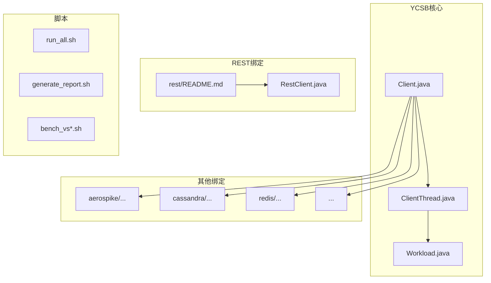
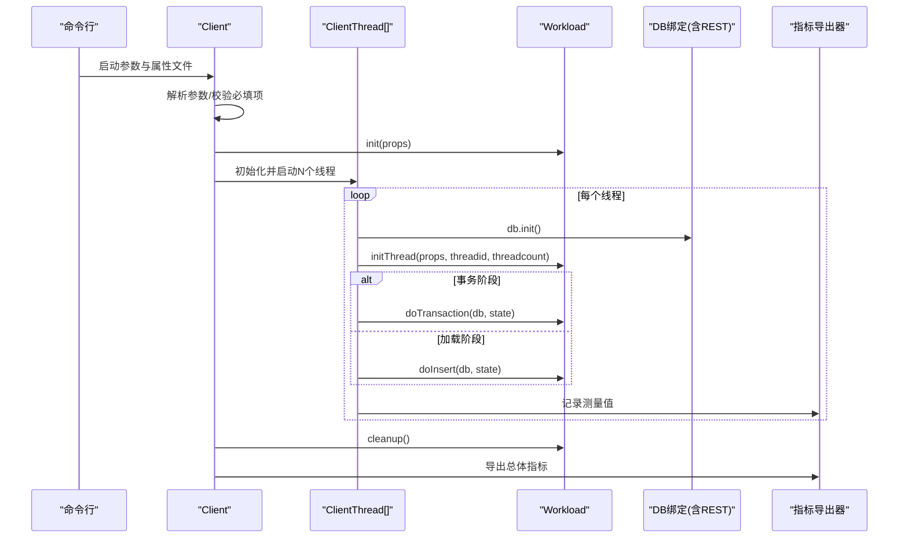
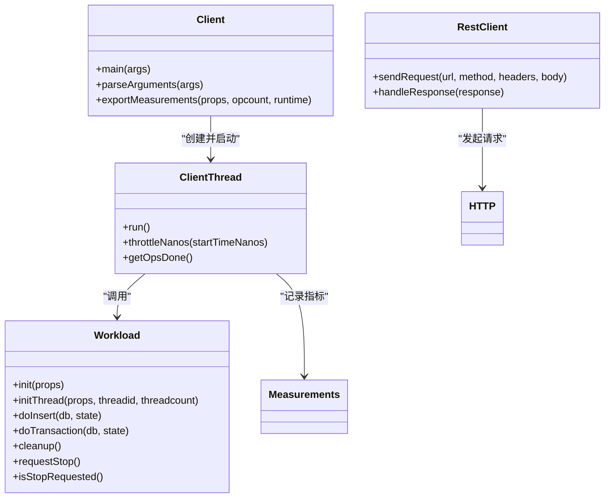

# 基准测试框架

<cite>
**本文引用的文件**   
- [README.md](file://source/YCSB/README.md)
- [Client.java](file://source/YCSB/core/src/main/java/site/ycsb/Client.java)
- [ClientThread.java](file://source/YCSB/core/src/main/java/site/ycsb/ClientThread.java)
- [Workload.java](file://source/YCSB/core/src/main/java/site/ycsb/Workload.java)
- [rest README.md](file://source/YCSB/rest/README.md)
- [RestClient.java](file://source/YCSB/rest/src/main/java/site/ycsb/webservice/rest/RestClient.java)
</cite>

## 目录
1. [简介](#简介)
2. [项目结构](#项目结构)
3. [核心组件](#核心组件)
4. [架构总览](#架构总览)
5. [详细组件分析](#详细组件分析)
6. [依赖关系分析](#依赖关系分析)
7. [性能考虑](#性能考虑)
8. [故障排查指南](#故障排查指南)
9. [结论](#结论)
10. [附录](#附录)

## 简介
本文件为基准测试框架的API与使用文档，重点覆盖YCSB集成方式、HTTP REST接口使用方法、WebSocket与Socket API的使用说明（如存在）、IPC/管道通信机制（如存在），以及协议相关的示例、错误处理策略、安全考量、速率限制、版本信息与监控调试方法。同时提供常见用例、客户端实现指南和性能优化技巧，并给出已弃用功能的迁移建议与向后兼容性说明。

## 项目结构
仓库包含YCSB基准测试框架及其多种数据库绑定，以及REST绑定模块。核心入口位于core模块，REST绑定在rest模块中用于对HTTP服务进行压测。脚本目录提供了批量运行与报告生成工具。

图表来源 
- [Client.java](file://source/YCSB/core/src/main/java/site/ycsb/Client.java)
- [ClientThread.java](file://source/YCSB/core/src/main/java/site/ycsb/ClientThread.java)
- [Workload.java](file://source/YCSB/core/src/main/java/site/ycsb/Workload.java)
- [rest README.md](file://source/YCSB/rest/README.md)
- [RestClient.java](file://source/YCSB/rest/src/main/java/site/ycsb/webservice/rest/RestClient.java)

章节来源
- [README.md](file://source/YCSB/README.md)

## 核心组件
- Client：YCSB主入口，负责参数解析、工作负载加载、线程池创建、执行控制、指标导出与清理。
- ClientThread：每个工作线程的执行体，负责调用Workload的插入或事务操作，支持目标吞吐率限流与状态统计。
- Workload：抽象工作负载类，定义doInsert/doTransaction等生命周期钩子，供具体业务场景扩展。
- REST绑定：通过配置文件与trace文件驱动HTTP GET/POST/PUT/DELETE请求，模拟真实服务访问模式。

章节来源
- [Client.java](file://source/YCSB/core/src/main/java/site/ycsb/Client.java)
- [ClientThread.java](file://source/YCSB/core/src/main/java/site/ycsb/ClientThread.java)
- [Workload.java](file://source/YCSB/core/src/main/java/site/ycsb/Workload.java)
- [rest README.md](file://source/YCSB/rest/README.md)

## 架构总览
YCSB以命令行驱动，加载指定DB绑定与工作负载，按线程并发执行操作，收集延迟分布与吞吐指标，最终输出结果。REST绑定将HTTP服务作为“数据库”进行压测，通过URL trace与头部配置构造请求。

图表来源 
- [Client.java](file://source/YCSB/core/src/main/java/site/ycsb/Client.java)
- [ClientThread.java](file://source/YCSB/core/src/main/java/site/ycsb/ClientThread.java)
- [Workload.java](file://source/YCSB/core/src/main/java/site/ycsb/Workload.java)

## 详细组件分析

### YCSB核心API与用法
- 命令行选项
  - -threads n：并发线程数
  - -target n：目标OPS（每秒操作数）
  - -load / -t：加载阶段或事务阶段
  - -db dbname：使用的DB绑定类名
  - -P propertyfile：属性文件路径（可多个）
  - -p name=value：覆盖属性
  - -s：运行期间显示状态
  - -l label：状态标签
- 关键属性
  - operationcount：操作总数
  - recordcount：初始记录数
  - workload：工作负载类名
  - db：DB绑定类名
  - exporter/exportfile：指标导出器与输出文件
  - threadcount/target/maxexecutiontime/status/label 等
- 执行流程
  - 解析参数与属性文件，合并优先级（命令行覆盖文件）
  - 动态加载Workload并初始化
  - 根据threadcount创建ClientThread，设置目标吞吐率与限流
  - 启动状态线程（可选），等待所有线程完成
  - 清理资源并导出指标

章节来源
- [Client.java](file://source/YCSB/core/src/main/java/site/ycsb/Client.java)

### 工作负载模型（Workload）
- 生命周期
  - init(props)：全局初始化
  - initThread(props, mythreadid, threadcount)：线程级初始化，返回线程私有状态对象
  - doInsert(db, threadstate)：插入操作
  - doTransaction(db, threadstate)：事务操作
  - cleanup()：全局清理
- 停止控制
  - requestStop()/isStopRequested()：用于外部终止工作负载
- 并发与性能
  - 各方法需线程安全；避免不必要的同步，尽量无副作用，仅修改线程状态

章节来源
- [Workload.java](file://source/YCSB/core/src/main/java/site/ycsb/Workload.java)

### 线程执行与限流（ClientThread）
- 执行循环
  - 根据dotransactions选择doTransaction或doInsert
  - 基于nanoTime与LockSupport.parkNanos实现纳秒级限流
  - 支持spin.sleep开关，用于不同CPU场景下的忙等策略
- 指标与状态
  - 维护opsdone计数，配合Measurements记录延迟分布
  - 支持intendedStartTimeNs设置，便于更精确的延迟计算

章节来源
- [ClientThread.java](file://source/YCSB/core/src/main/java/site/ycsb/ClientThread.java)

### HTTP REST绑定API
- 用途
  - 对任意HTTP RESTful服务进行压测，使用真实数据集与URL访问模式
- 基本步骤
  - 准备一个可访问的HTTP服务
  - 准备trace文件（GET/POST/PUT/DELETE分别对应url.trace.*）
  - 配置rest_workload属性文件
  - 运行命令：./bin/ycsb run rest -s -P workloads/rest_workload
- URL与头部
  - url.prefix：基础URL前缀，拼接trace中的相对路径
  - headers：通用请求头，空格分隔键值对
- 超时与日志
  - timeout.con/read/exec：连接/读取/执行超时（秒）
  - log.enable：是否打印请求与响应状态
- 数据量与分布
  - readrecordcount/insertrecordcount/updaterecordcount/deleterecordcount：各操作选取的top-k条目数
  - *zipfconstant：Zipf分布常数（当requestdistribution=zipfian时生效）
- 典型请求模式
  - GET：从url.trace.read中选择URL
  - POST：从url.trace.insert中选择URL
  - PUT：从url.trace.update中选择URL
  - DELETE：从url.trace.delete中选择URL
- 认证与安全
  - 通过headers注入认证信息（例如Authorization、Cookie等）
  - 建议使用HTTPS与受信任证书，避免明文传输敏感数据
- 速率限制
  - 通过-target与-threadcount控制整体吞吐
  - 可在headers中携带服务端限流相关字段（如令牌桶token）
- 错误处理
  - 超时与网络异常视为错误，可通过log.enable观察
  - 建议在trace文件中加入健康检查URL，用于预热与连通性验证

章节来源
- [rest README.md](file://source/YCSB/rest/README.md)
- [RestClient.java](file://source/YCSB/rest/src/main/java/site/ycsb/webservice/rest/RestClient.java)

### WebSocket API（概念性说明）
- 当前仓库未包含WebSocket绑定的实现与文档。如需对WebSocket服务进行压测，建议：
  - 使用第三方WS客户端库（如Java WebSocket Client）编写自定义Workload
  - 在initThread中建立连接，在doTransaction中发送消息并统计往返时延
  - 通过headers无法直接用于WS握手，需在握手阶段注入必要参数
- 事件类型与实时交互
  - 由服务端定义消息格式与事件类型，客户端需实现解析与回调
- 连接管理
  - 连接池、重连策略、心跳检测与优雅关闭
- 安全考虑
  - wss://TLS加密，证书校验，鉴权令牌传递
- 速率限制
  - 客户端侧限流与服务端侧限流协同，避免触发熔断
- 调试与监控
  - 启用抓包（Wireshark/tcpdump）与客户端日志
  - 统计消息收发速率、失败率、延迟分布

[本节为概念性内容，不直接分析具体文件]

### Socket API（概念性说明）
- 当前仓库未包含原生Socket绑定的实现与文档。如需对TCP/UDP服务进行压测，建议：
  - 自定义Workload封装Socket连接与读写逻辑
  - 定义帧格式（长度前缀+类型+载荷）与二进制序列化方案
  - 实现连接状态机（空闲、连接中、活跃、断开、重连）
- 数据帧与二进制格式
  - 明确版本号、命令码、序列号、载荷长度、CRC校验等字段
- 错误处理
  - 网络中断、半包/粘包处理、超时重试与退避
- 安全与鉴权
  - TLS/SSL、双向认证、会话密钥协商
- 速率限制
  - 滑动窗口、令牌桶、漏桶算法
- 调试与监控
  - 字节级抓包、服务端日志、客户端指标上报

[本节为概念性内容，不直接分析具体文件]

### IPC/管道通信（概念性说明）
- 当前仓库未包含专用IPC/管道模块。若需进程间通信压测：
  - 使用Unix Domain Socket、Named Pipe或共享内存
  - 设计消息协议（类型、长度、载荷、校验）
  - 实现生产者-消费者模型与背压机制
- 数据流与同步
  - 阻塞/非阻塞IO、异步I/O、事件驱动
- 错误处理
  - 管道破裂、权限不足、缓冲区溢出
- 安全与隔离
  - 权限控制、命名空间隔离、审计日志
- 调试与监控
  - strace/ltrace、perf、eBPF探针

[本节为概念性内容，不直接分析具体文件]

## 依赖关系分析
- Client依赖Workload与DB绑定（通过DBFactory动态加载）
- ClientThread依赖Workload与Measurements
- REST绑定通过RestClient发起HTTP请求，遵循rest/README.md的配置约定

图表来源 
- [Client.java](file://source/YCSB/core/src/main/java/site/ycsb/Client.java)
- [ClientThread.java](file://source/YCSB/core/src/main/java/site/ycsb/ClientThread.java)
- [Workload.java](file://source/YCSB/core/src/main/java/site/ycsb/Workload.java)
- [RestClient.java](file://source/YCSB/rest/src/main/java/site/ycsb/webservice/rest/RestClient.java)

章节来源
- [Client.java](file://source/YCSB/core/src/main/java/site/ycsb/Client.java)
- [ClientThread.java](file://source/YCSB/core/src/main/java/site/ycsb/ClientThread.java)
- [Workload.java](file://source/YCSB/core/src/main/java/site/ycsb/Workload.java)
- [rest README.md](file://source/YCSB/rest/README.md)

## 性能考虑
- 线程与目标吞吐
  - 合理设置-threadcount与-target，避免过度竞争与上下文切换
  - 使用spin.sleep=false默认park策略，在高CPU场景下可评估true的影响
- 延迟分布
  - 关注P95/P99/P99.9，避免仅看平均值
  - 使用HDR直方图导出与合并，获取准确分位点
- 指标导出
  - 通过exporter/exportfile输出到文件，便于离线分析与可视化
- 网络与IO
  - 调整timeout.con/read/exec，避免假阳性错误
  - 使用连接池与复用，减少握手开销
- GC与JVM
  - 监控GC次数与耗时，调整堆大小与垃圾回收器参数
- 分布式压测
  - 多机部署client实例，使用insertstart/insertcount划分数据范围

章节来源
- [README.md](file://source/YCSB/README.md)
- [Client.java](file://source/YCSB/core/src/main/java/site/ycsb/Client.java)
- [ClientThread.java](file://source/YCSB/core/src/main/java/site/ycsb/ClientThread.java)

## 故障排查指南
- 参数与属性
  - 确认WORKLOAD_PROPERTY必填，-P与-p优先级正确
  - 检查url.trace.*文件路径与内容格式
- 运行时错误
  - 查看log.enable输出的请求与响应状态
  - 捕获DBException与WorkloadException，定位初始化与执行阶段问题
- 超时与网络
  - 调整timeout.con/read/exec，检查DNS与防火墙
  - 使用curl/wget验证服务可达性与响应时间
- 指标与诊断
  - 导出HDR直方图，使用HdrHistogram工具合并与分析
  - 开启HTrace追踪（htrace.*属性），定位慢调用链
- 常见问题
  - 线程数大于记录数时的警告与自动调整
  - 多实例加载阶段的insertstart/insertcount划分

章节来源
- [Client.java](file://source/YCSB/core/src/main/java/site/ycsb/Client.java)
- [ClientThread.java](file://source/YCSB/core/src/main/java/site/ycsb/ClientThread.java)
- [rest README.md](file://source/YCSB/rest/README.md)

## 结论
本框架以YCSB为核心，提供统一的基准测试入口与丰富的绑定能力。REST绑定可直接对HTTP服务进行贴近生产的工作负载压测。对于WebSocket、Socket与IPC等协议，可按概念性指南自行扩展Workload与客户端实现。通过合理的参数配置、指标导出与调试手段，可获得可靠的性能评估结果。

## 附录
- 常用命令
  - 加载阶段：./bin/ycsb.sh load basic -P workloads/workloada
  - 事务阶段：./bin/ycsb.sh run basic -s -P workloads/workloada
  - REST压测：./bin/ycsb run rest -s -P workloads/rest_workload
- 版本信息
  - Client在启动时会打印YCSB版本（来自project.properties）
- 向后兼容与迁移
  - 保持workload与db绑定类名稳定，避免破坏性变更
  - 新增属性时提供默认值，确保旧配置可用
- 监控与调试工具
  - HdrHistogram工具：合并直方图、提取分位点
  - HTrace：分布式追踪
  - 网络抓包：tcpdump/Wireshark
  - JVM监控：jstat/jmap/jstack

章节来源
- [README.md](file://source/YCSB/README.md)
- [Client.java](file://source/YCSB/core/src/main/java/site/ycsb/Client.java)