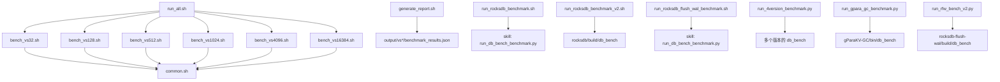
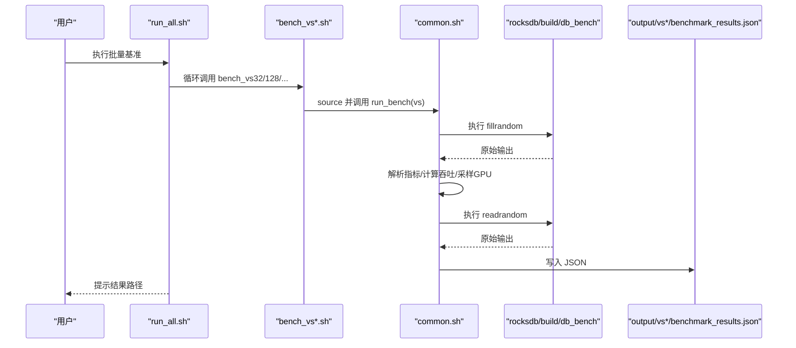
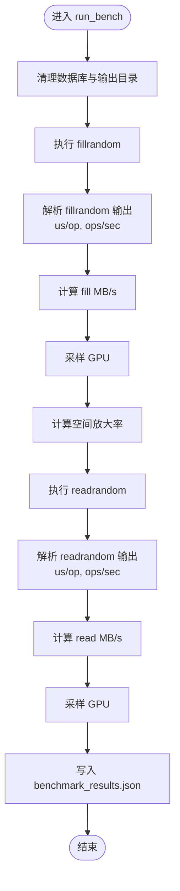
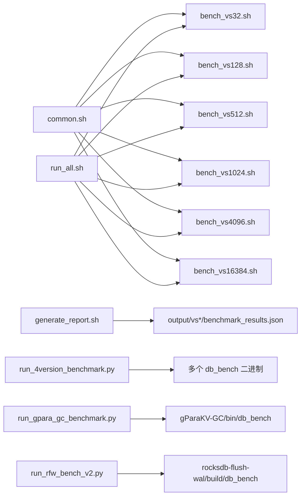

# 基准测试脚本

<cite>
**本文档引用的文件**   
- [common.sh](file://script/common.sh)
- [run_all.sh](file://script/run_all.sh)
- [bench_vs32.sh](file://script/bench_vs32.sh)
- [bench_vs128.sh](file://script/bench_vs128.sh)
- [bench_vs512.sh](file://script/bench_vs512.sh)
- [bench_vs1024.sh](file://script/bench_vs1024.sh)
- [bench_vs4096.sh](file://script/bench_vs4096.sh)
- [bench_vs16384.sh](file://script/bench_vs16384.sh)
- [generate_report.sh](file://script/generate_report.sh)
- [run_rocksdb_benchmark.sh](file://script/run_rocksdb_benchmark.sh)
- [run_rocksdb_benchmark_v2.sh](file://script/run_rocksdb_benchmark_v2.sh)
- [run_rocksdb_flush_wal_benchmark.sh](file://script/run_rocksdb_flush_wal_benchmark.sh)
- [run_4version_benchmark.py](file://script/run_4version_benchmark.py)
- [run_gpara_gc_benchmark.py](file://script/run_gpara_gc_benchmark.py)
- [run_rfw_bench_v2.py](file://script/run_rfw_bench_v2.py)
</cite>

## 目录
1. [简介](#简介)
2. [项目结构](#项目结构)
3. [核心组件](#核心组件)
4. [架构总览](#架构总览)
5. [详细组件分析](#详细组件分析)
6. [依赖关系分析](#依赖关系分析)
7. [性能注意事项](#性能注意事项)
8. [故障排查指南](#故障排查指南)
9. [结论](#结论)
10. [附录](#附录)

## 简介
本仓库提供一套用于 RocksDB、gParaKV-GC 与 rocksdb-flush-wal 等引擎的基准测试脚本集合，覆盖不同值大小（value_size）场景下的 fillrandom/readrandom 工作负载，输出标准化的 JSON 结果并生成汇总报告。脚本通过 common.sh 统一配置与工具函数，run_all.sh 批量执行各 value_size 用例，generate_report.sh 合并多组结果并打印摘要。此外还提供 Python 驱动的多版本对比、HTML 报告生成以及针对特定引擎的专用运行器。

## 项目结构
脚本位于 script/ 目录下，按职责划分：
- 通用与编排：common.sh、run_all.sh、generate_report.sh
- 单值大小用例：bench_vs*.sh（32/128/512/1024/4096/16384）
- 直接 Shell 实现：run_rocksdb_benchmark_v2.sh
- 基于 skill 的封装调用：run_rocksdb_benchmark.sh、run_rocksdb_flush_wal_benchmark.sh
- Python 驱动：run_4version_benchmark.py、run_gpara_gc_benchmark.py、run_rfw_bench_v2.py

图表来源
- [run_all.sh:1-19](file://script/run_all.sh#L1-L19)
- [common.sh:1-196](file://script/common.sh#L1-L196)
- [generate_report.sh:1-59](file://script/generate_report.sh#L1-L59)
- [run_rocksdb_benchmark.sh:1-50](file://script/run_rocksdb_benchmark.sh#L1-L50)
- [run_rocksdb_benchmark_v2.sh:1-168](file://script/run_rocksdb_benchmark_v2.sh#L1-L168)
- [run_rocksdb_flush_wal_benchmark.sh:1-50](file://script/run_rocksdb_flush_wal_benchmark.sh#L1-L50)
- [run_4version_benchmark.py:1-358](file://script/run_4version_benchmark.py#L1-L358)
- [run_gpara_gc_benchmark.py:1-304](file://script/run_gpara_gc_benchmark.py#L1-L304)
- [run_rfw_bench_v2.py:1-320](file://script/run_rfw_bench_v2.py#L1-L320)

章节来源
- [run_all.sh:1-19](file://script/run_all.sh#L1-L19)
- [common.sh:1-196](file://script/common.sh#L1-L196)

## 核心组件
- common.sh：定义全局默认参数（如 KEY_SIZE、NUM_OPS、COMPRESSION、THREADS、WRITE_BUFFER_SIZE、SEED），设置 LD_LIBRARY_PATH，并提供解析 db_bench 输出、计算吞吐、采集硬件/GPU 信息、执行单次 value_size 基准并输出 JSON 的统一函数 run_bench。
- bench_vs*.sh：每个脚本固定一个 value_size，source common.sh 后调用 run_bench 执行 fillrandom + readrandom 两轮测试，产出 output/vs<NN>/benchmark_results.json。
- run_all.sh：顺序遍历 32/128/512/1024/4096/16384，依次执行对应 bench_vs*.sh，最终汇总路径提示。
- generate_report.sh：读取 output/vs*/benchmark_results.json，合并为统一的 benchmark_results.json，并在控制台打印摘要表格。
- run_rocksdb_benchmark.sh / run_rocksdb_benchmark_v2.sh：前者通过 skill 脚本调用，后者为纯 Shell 实现，均对 RocksDB 进行 2GB 目标数据量的基准测试并生成 HTML 报告。
- run_rocksdb_flush_wal_benchmark.sh：针对 rocksdb-flush-wal 的封装调用。
- run_4version_benchmark.py：横向对比四个 RocksDB 版本，生成对比 HTML 与汇总 JSON。
- run_gpara_gc_benchmark.py / run_rfw_bench_v2.py：分别针对 gParaKV-GC 与 rocksdb-flush-wal 的专用运行器，支持多种工作负载组合与稳定性限制。

章节来源
- [common.sh:1-196](file://script/common.sh#L1-L196)
- [bench_vs32.sh:1-10](file://script/bench_vs32.sh#L1-L10)
- [bench_vs128.sh:1-10](file://script/bench_vs128.sh#L1-L10)
- [bench_vs512.sh:1-10](file://script/bench_vs512.sh#L1-L10)
- [bench_vs1024.sh:1-10](file://script/bench_vs1024.sh#L1-L10)
- [bench_vs4096.sh:1-10](file://script/bench_vs4096.sh#L1-L10)
- [bench_vs16384.sh:1-10](file://script/bench_vs16384.sh#L1-L10)
- [run_all.sh:1-19](file://script/run_all.sh#L1-L19)
- [generate_report.sh:1-59](file://script/generate_report.sh#L1-L59)
- [run_rocksdb_benchmark.sh:1-50](file://script/run_rocksdb_benchmark.sh#L1-L50)
- [run_rocksdb_benchmark_v2.sh:1-168](file://script/run_rocksdb_benchmark_v2.sh#L1-L168)
- [run_rocksdb_flush_wal_benchmark.sh:1-50](file://script/run_rocksdb_flush_wal_benchmark.sh#L1-L50)
- [run_4version_benchmark.py:1-358](file://script/run_4version_benchmark.py#L1-L358)
- [run_gpara_gc_benchmark.py:1-304](file://script/run_gpara_gc_benchmark.py#L1-L304)
- [run_rfw_bench_v2.py:1-320](file://script/run_rfw_bench_v2.py#L1-L320)

## 架构总览
整体流程分为“用例编排”、“基准执行”、“结果收集与报告”三层：
- 用例编排：run_all.sh 顺序触发 bench_vs*.sh；Python 脚本可并行或串行驱动多版本/多引擎。
- 基准执行：bench_vs*.sh 通过 common.sh 的 run_bench 调用 RocksDB 的 db_bench，完成写与读两轮测试。
- 结果收集与报告：每个 value_size 生成独立 JSON；generate_report.sh 合并为统一 JSON；Python 脚本可生成 HTML 对比报告。

图表来源
- [run_all.sh:1-19](file://script/run_all.sh#L1-L19)
- [bench_vs128.sh:1-10](file://script/bench_vs128.sh#L1-L10)
- [common.sh:68-196](file://script/common.sh#L68-L196)

## 详细组件分析

### common.sh：通用函数与配置
- 关键变量：PROJECT_DIR、OUTPUT_BASE、KEY_SIZE、NUM_OPS、COMPRESSION、THREADS、WRITE_BUFFER_SIZE、SEED、LD_LIBRARY_PATH。
- 解析函数：parse_ops_per_sec、parse_us_per_op，从 db_bench 输出行提取 ops/sec 与 us/op。
- 计算函数：calc_mbps，根据 ops/sec 与 kv_size 换算 MB/s。
- 硬件采样：collect_hw_json 采集 CPU/GPU/内存/OS/kernel；sample_gpu 采样 GPU 利用率与显存。
- 主流程 run_bench：清理临时目录、执行 fillrandom 与 readrandom、解析输出、计算吞吐与时延尾延迟估计、统计空间放大率、采样 GPU、输出结构化 JSON。

图表来源
- [common.sh:68-196](file://script/common.sh#L68-L196)

章节来源
- [common.sh:1-196](file://script/common.sh#L1-L196)

### bench_vs*.sh：按值大小的用例脚本
- 每个脚本固定 value_size，source common.sh 后设置 DB_BENCH 路径并调用 run_bench。
- 典型场景：fillrandom + readrandom，目标数据量由 NUM_OPS 与 key/value size 决定。

章节来源
- [bench_vs32.sh:1-10](file://script/bench_vs32.sh#L1-L10)
- [bench_vs128.sh:1-10](file://script/bench_vs128.sh#L1-L10)
- [bench_vs512.sh:1-10](file://script/bench_vs512.sh#L1-L10)
- [bench_vs1024.sh:1-10](file://script/bench_vs1024.sh#L1-L10)
- [bench_vs4096.sh:1-10](file://script/bench_vs4096.sh#L1-L10)
- [bench_vs16384.sh:1-10](file://script/bench_vs16384.sh#L1-L10)

### run_all.sh：批量执行
- 顺序遍历 value_size 列表 32/128/512/1024/4096/16384，逐个执行对应 bench_vs*.sh。
- 完成后提示结果路径。

章节来源
- [run_all.sh:1-19](file://script/run_all.sh#L1-L19)

### generate_report.sh：结果合并与摘要
- 读取 output/vs*/benchmark_results.json，合并 runs 列表，保留 metadata/hardware。
- 输出合并后的 benchmark_results.json 并在控制台打印摘要表。

章节来源
- [generate_report.sh:1-59](file://script/generate_report.sh#L1-L59)

### run_rocksdb_benchmark.sh / run_rocksdb_benchmark_v2.sh：RocksDB 基准
- 前者通过 skill 脚本 run_db_bench_benchmark.py 执行，并调用 generate_report.py 生成 HTML。
- 后者为纯 Shell 实现，直接调用 db_bench，解析输出并生成 JSON/HTML。

章节来源
- [run_rocksdb_benchmark.sh:1-50](file://script/run_rocksdb_benchmark.sh#L1-L50)
- [run_rocksdb_benchmark_v2.sh:1-168](file://script/run_rocksdb_benchmark_v2.sh#L1-L168)

### run_rocksdb_flush_wal_benchmark.sh：Flush-WAL 封装
- 使用 skill 脚本运行 rocksdb-flush-wal 的 db_bench，生成 JSON 与 HTML 报告。

章节来源
- [run_rocksdb_flush_wal_benchmark.sh:1-50](file://script/run_rocksdb_flush_wal_benchmark.sh#L1-L50)

### run_4version_benchmark.py：四版本对比
- 定义四个 RocksDB 版本路径，逐一执行基准，收集 JSON，生成对比 HTML 与 combined_results.json。
- 内置颜色与数据集构建逻辑，输出吞吐量、时延、ops/sec 曲线与表格。

章节来源
- [run_4version_benchmark.py:1-358](file://script/run_4version_benchmark.py#L1-L358)

### run_gpara_gc_benchmark.py：gParaKV-GC 基准
- 针对 gParaKV-GC 的 db_bench，支持随机/顺序/混合读写三种场景。
- 处理 CUDA 错误与超时，限制最大键数以规避 GPU 内存问题，输出 JSON 与 HTML。

章节来源
- [run_gpara_gc_benchmark.py:1-304](file://script/run_gpara_gc_benchmark.py#L1-L304)

### run_rfw_bench_v2.py：rocksdb-flush-wal 基准 v2
- 处理 RocksDB 的 \r 进度输出，避免覆盖结果行。
- 针对不同 value_size 设置安全上限，避免 compaction 崩溃，输出 JSON 与 HTML。

章节来源
- [run_rfw_bench_v2.py:1-320](file://script/run_rfw_bench_v2.py#L1-L320)

## 依赖关系分析
- 脚本间依赖：
  - bench_vs*.sh 依赖 common.sh。
  - run_all.sh 依赖所有 bench_vs*.sh。
  - generate_report.sh 依赖 output/vs*/benchmark_results.json。
  - Python 脚本依赖各自引擎的 db_bench 二进制与可选的 skill 脚本。
- 外部依赖：
  - RocksDB 的 db_bench 二进制。
  - nvidia-smi（可选，用于 GPU 采样）。
  - Python3 与标准库（json、subprocess、os、re、datetime 等）。

图表来源
- [common.sh:1-196](file://script/common.sh#L1-L196)
- [run_all.sh:1-19](file://script/run_all.sh#L1-L19)
- [generate_report.sh:1-59](file://script/generate_report.sh#L1-L59)
- [run_4version_benchmark.py:1-358](file://script/run_4version_benchmark.py#L1-L358)
- [run_gpara_gc_benchmark.py:1-304](file://script/run_gpara_gc_benchmark.py#L1-L304)
- [run_rfw_bench_v2.py:1-320](file://script/run_rfw_bench_v2.py#L1-L320)

章节来源
- [run_all.sh:1-19](file://script/run_all.sh#L1-L19)
- [common.sh:1-196](file://script/common.sh#L1-L196)

## 性能注意事项
- 值大小影响吞吐与时延：较小 value_size 通常 ops/sec 更高但 MB/s 较低；较大 value_size 则相反。
- 线程数 THREADS=1 保证单线程一致性，便于比较；如需并发测试，可在 common.sh 中调整 THREADS。
- write_buffer_size 与 cache_size 影响内存占用与压缩行为，需结合系统资源调优。
- 空间放大率（space_amplification）反映存储效率，过大可能意味着碎片或频繁 compaction。
- GPU 采样仅在存在 nvidia-smi 时有效，无 GPU 环境将返回 0.0。

[本节为通用指导，不直接分析具体文件]

## 故障排查指南
- 找不到 db_bench 二进制：
  - 检查 PATH 与 LD_LIBRARY_PATH 是否正确指向 build 目录。
  - 在 common.sh 与 run_rocksdb_benchmark_v2.sh 中确认导出路径。
- 解析失败或结果为 0：
  - 确认 db_bench 输出格式是否包含 micros/op 与 MB/s 字段。
  - 对于 rocksdb-flush-wal，注意 \r 进度行被替换为换行的处理逻辑。
- 超时或崩溃：
  - gParaKV-GC 受 GPU 内存限制，已限制 MAX_KEYS；rocksdb-flush-wal 有 per-value-size 的安全上限。
  - 适当降低 num_keys 或增大系统内存。
- 权限与路径：
  - 确保 /tmp 与 output 目录可写。
  - 清理历史结果以避免干扰。

章节来源
- [common.sh:1-196](file://script/common.sh#L1-L196)
- [run_rfw_bench_v2.py:75-109](file://script/run_rfw_bench_v2.py#L75-L109)
- [run_gpara_gc_benchmark.py:122-186](file://script/run_gpara_gc_benchmark.py#L122-L186)

## 结论
该基准测试套件以 common.sh 为核心，配合 bench_vs*.sh 与 run_all.sh 形成稳定的用例编排与执行框架；generate_report.sh 与 Python 脚本提供结果合并与可视化能力。通过环境变量与参数化配置，可灵活适配不同引擎与场景。建议在生产环境中固定硬件与内核版本，记录完整元数据，以便跨时间对比与回归分析。

[本节为总结性内容，不直接分析具体文件]

## 附录

### 环境变量与配置
- 必须设置：
  - LD_LIBRARY_PATH：指向 RocksDB 或其他引擎的 build 目录，确保动态库加载正确。
- 推荐设置：
  - PROJECT_DIR：工程根目录（脚本内硬编码，可按需修改）。
  - OUTPUT_BASE：结果输出根目录（默认 PROJECT_DIR/output）。
- 常用参数（common.sh）：
  - KEY_SIZE、NUM_OPS、COMPRESSION、THREADS、WRITE_BUFFER_SIZE、SEED。

章节来源
- [common.sh:1-196](file://script/common.sh#L1-L196)
- [run_rocksdb_benchmark_v2.sh:1-168](file://script/run_rocksdb_benchmark_v2.sh#L1-L168)

### 输出格式说明
- 每值大小 JSON（output/vs<NN>/benchmark_results.json）：
  - metadata：时间戳、引擎、db_bench 路径、num_ops、key_size、value_size、compression_type、threads、seed。
  - hardware：cpu_model、cpu_cores、memory_gb、gpu_model、os、kernel。
  - runs：包含 value_size、num_keys、fill/read 吞吐与时延、尾延迟估计、空间放大率、GPU 指标。
- 合并 JSON（output/benchmark_results.json）：
  - 合并所有 runs，排序按 value_size。

章节来源
- [common.sh:156-196](file://script/common.sh#L156-L196)
- [generate_report.sh:1-59](file://script/generate_report.sh#L1-L59)

### 结果分析方法
- 关注指标：
  - fill/read throughput (MB/s)、latency (us/op)、ops/sec、space_amplification。
  - tail_latency_us 作为尾延迟估计（均值×1.5）。
- 对比维度：
  - 不同 value_size 的性能趋势。
  - 不同引擎/版本的横向对比（Python 脚本生成 HTML）。
- 可视化：
  - 使用 generate_report.sh 打印摘要表。
  - 使用 Python 脚本生成交互式图表。

章节来源
- [generate_report.sh:44-59](file://script/generate_report.sh#L44-L59)
- [run_4version_benchmark.py:75-150](file://script/run_4version_benchmark.py#L75-L150)

### 实际使用示例与最佳实践
- 快速开始：
  - 执行 run_all.sh 完成全部 value_size 基准。
  - 运行 generate_report.sh 合并结果并查看摘要。
- 单值大小调试：
  - 直接执行 bench_vs128.sh 等脚本定位问题。
- 多版本对比：
  - 运行 run_4version_benchmark.py 生成对比 HTML。
- 最佳实践：
  - 固定硬件与内核，记录 metadata。
  - 清理历史结果，避免污染。
  - 合理设置 THREADS、write_buffer_size、cache_size。
  - 对不稳定引擎设置安全上限（如 MAX_KEYS）。

章节来源
- [run_all.sh:1-19](file://script/run_all.sh#L1-L19)
- [generate_report.sh:1-59](file://script/generate_report.sh#L1-L59)
- [run_4version_benchmark.py:295-358](file://script/run_4version_benchmark.py#L295-L358)