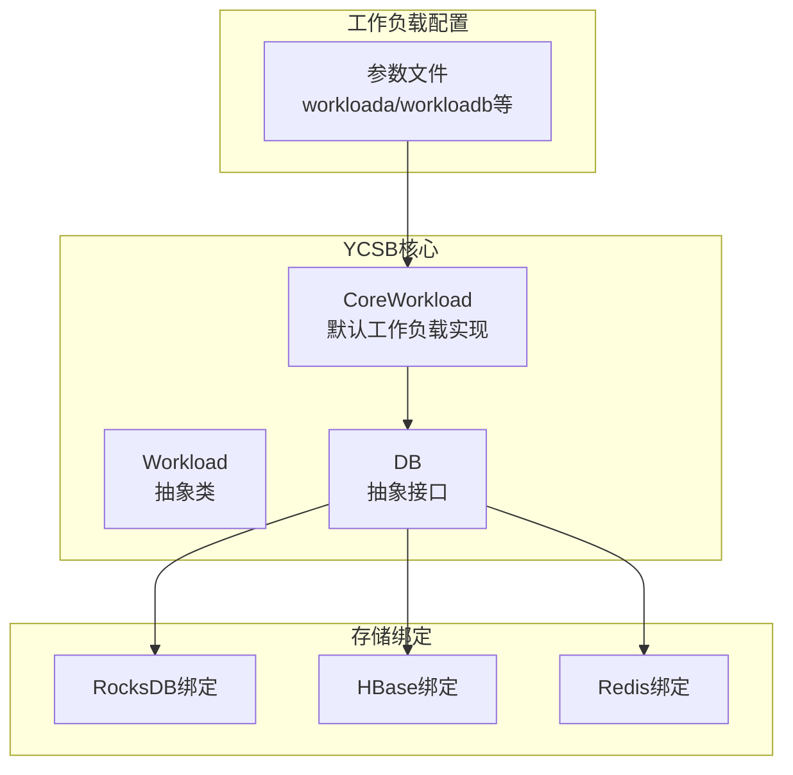
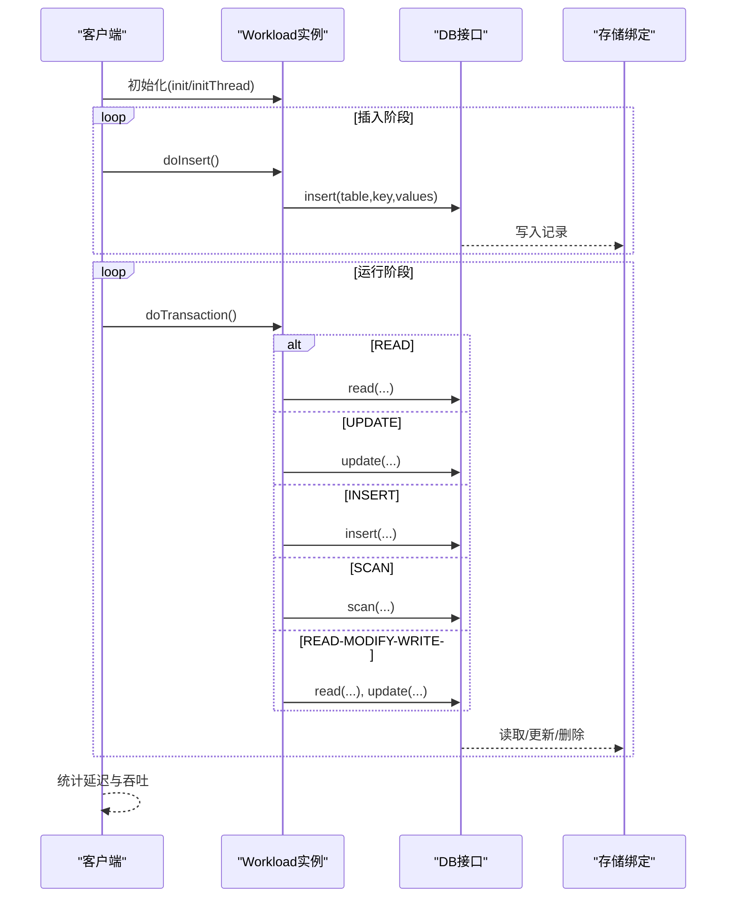
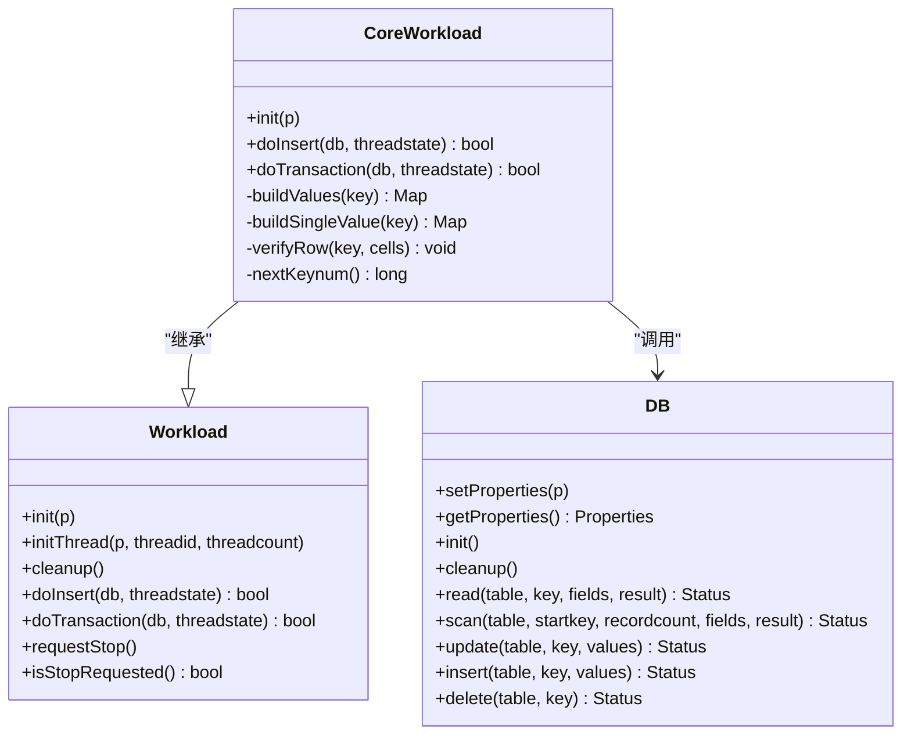
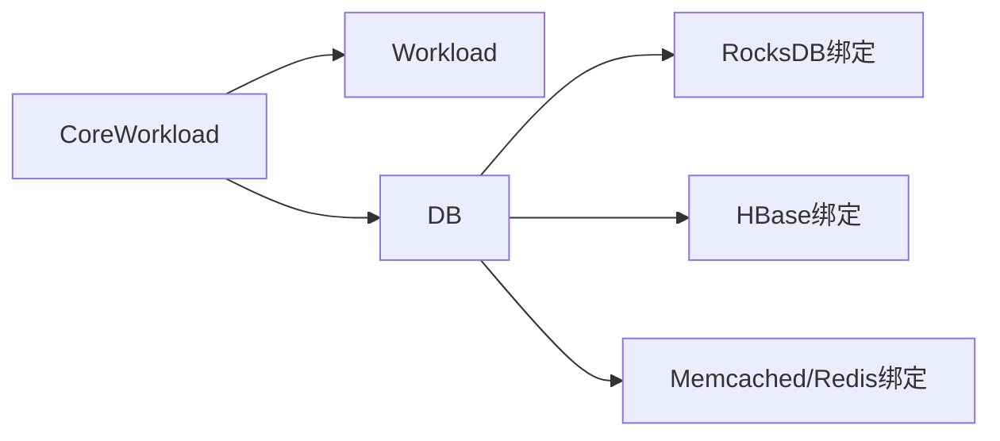
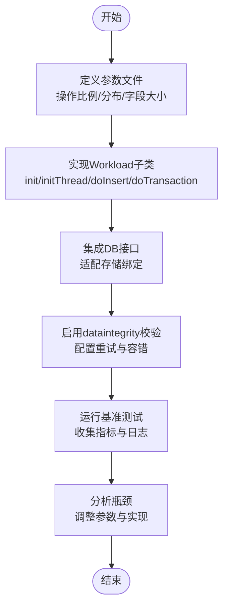

# 工作负载设计

<cite>
**本文引用的文件**   
- [workload.html](file://source/YCSB/doc/workload.html)
- [Workload.java](file://source/YCSB/core/src/main/java/site/ycsb/Workload.java)
- [DB.java](file://source/YCSB/core/src/main/java/site/ycsb/DB.java)
- [CoreWorkload.java](file://source/YCSB/core/src/main/java/site/ycsb/workloads/CoreWorkload.java)
</cite>

## 目录
1. [简介](#简介)
2. [项目结构](#项目结构)
3. [核心组件](#核心组件)
4. [架构总览](#架构总览)
5. [详细组件分析](#详细组件分析)
6. [依赖关系分析](#依赖关系分析)
7. [性能考虑](#性能考虑)
8. [故障排查指南](#故障排查指南)
9. [结论](#结论)
10. [附录](#附录)

## 简介
本指南面向使用 YCSB（Yahoo! Cloud Serving Benchmark）进行工作负载设计与测试的开发者与测试工程师，系统阐述YCSB工作负载文件的基本结构与语法、内置工作负载的特点与适用场景、自定义工作负载的开发步骤（含Java接口实现、操作逻辑设计与性能优化技巧）、高级特性（动态参数、条件操作、复合操作）的使用方法，以及工作负载验证与测试的最佳实践。同时结合仓库中的实际源码与文档，给出可操作的参考路径与图示说明，帮助读者快速上手并高效完成复杂工作负载的设计与调优。

## 项目结构
YCSB采用“核心引擎 + 多种存储绑定 + 工作负载定义”的分层结构：
- 核心引擎提供统一的抽象接口与工作负载生命周期管理
- 存储绑定实现具体数据库的读写接口
- 工作负载定义数据模型与事务行为，并通过参数文件控制比例与分布

图表来源
- [Workload.java:38-122](file://source/YCSB/core/src/main/java/site/ycsb/Workload.java#L38-L122)
- [DB.java:45-135](file://source/YCSB/core/src/main/java/site/ycsb/DB.java#L45-L135)
- [CoreWorkload.java:70-559](file://source/YCSB/core/src/main/java/site/ycsb/workloads/CoreWorkload.java#L70-L559)

章节来源
- [workload.html:28-147](file://source/YCSB/doc/workload.html#L28-L147)

## 核心组件
- Workload抽象类：定义工作负载的生命周期与执行入口，包括初始化、线程初始化、清理、插入与事务执行方法，并提供停止信号机制。
- DB抽象接口：定义统一的数据访问接口（读、写、更新、删除、范围扫描），屏蔽底层存储差异。
- CoreWorkload：YCSB内置的核心工作负载实现，支持丰富的参数化配置，涵盖字段数量、字段长度分布、操作比例、键空间分布、扫描长度分布、热点访问模式等。

章节来源
- [Workload.java:38-122](file://source/YCSB/core/src/main/java/site/ycsb/Workload.java#L38-L122)
- [DB.java:45-135](file://source/YCSB/core/src/main/java/site/ycsb/DB.java#L45-L135)
- [CoreWorkload.java:70-559](file://source/YCSB/core/src/main/java/site/ycsb/workloads/CoreWorkload.java#L70-L559)

## 架构总览
YCSB的工作负载执行流程如下：
- 客户端启动后加载参数文件与Workload类
- 为每个工作线程创建Workload实例并进行initThread初始化
- 按配置生成插入与事务操作，调用DB接口访问底层存储
- 自动统计延迟与吞吐，支持自定义测量标签

图表来源
- [Workload.java:86-106](file://source/YCSB/core/src/main/java/site/ycsb/Workload.java#L86-L106)
- [DB.java:81-135](file://source/YCSB/core/src/main/java/site/ycsb/DB.java#L81-L135)
- [CoreWorkload.java:623-800](file://source/YCSB/core/src/main/java/site/ycsb/workloads/CoreWorkload.java#L623-L800)

## 详细组件分析

### 工作负载基础与生命周期
- 生命周期方法
  - init(Properties)：全局初始化，适合共享对象创建
  - initThread(Properties, int, int)：线程级初始化，返回线程状态对象供doInsert/doTransaction使用
  - cleanup()：收尾清理
- 执行入口
  - doInsert(DB, Object)：单条记录插入
  - doTransaction(DB, Object)：单次事务执行，内部可按比例选择READ/UPDATE/INSERT/SCAN/READ-MODIFY-WRITE
- 停止控制
  - requestStop()/isStopRequested()：用于优雅停止

章节来源
- [Workload.java:59-122](file://source/YCSB/core/src/main/java/site/ycsb/Workload.java#L59-L122)

### 数据访问接口（DB）
- 统一接口
  - read(table, key, fields, result)
  - scan(table, startkey, recordcount, fields, result)
  - update(table, key, values)
  - insert(table, key, values)
  - delete(table, key)
- 语义约定
  - 返回值由客户端计数统计，不强制特定语义
  - 建议实现匹配目标应用或数据库默认语义

章节来源
- [DB.java:81-135](file://source/YCSB/core/src/main/java/site/ycsb/DB.java#L81-L135)

### 内置工作负载（CoreWorkload）详解
- 关键参数
  - 字段相关：fieldcount、fieldlength、minfieldlength、fieldlengthdistribution、readallfields、writeallfields、fieldnameprefix
  - 操作比例：readproportion、updateproportion、insertproportion、scanproportion、readmodifywriteproportion
  - 键空间分布：requestdistribution（uniform/zipfian/hotspot/exponential/latest/sequential）
  - 扫描长度：minscanlength、maxscanlength、scanlengthdistribution
  - 插入顺序：insertorder（ordered/hashed）
  - 零填充：zeropadding
  - 热集：hotspotdatafraction、hotspotopnfraction
  - 重试与容错：core_workload_insertion_retry_limit、core_workload_insertion_retry_interval、core_workload_insertion_keep_going_on_error
  - 数据完整性校验：dataintegrity（需constant字段长度）
- 操作选择器
  - 通过DiscreteGenerator按比例选择操作类型
- 键生成器
  - UniformLongGenerator、SequentialGenerator、ZipfianGenerator、ExponentialGenerator、SkewedLatestGenerator、HotspotIntegerGenerator等
- 典型行为
  - doInsert：按配置生成键与值，支持重试与错误继续
  - doTransaction：根据operationchooser选择READ/UPDATE/INSERT/SCAN/READ-MODIFY-WRITE
  - verifyRow：在dataintegrity模式下校验读取结果

章节来源
- [CoreWorkload.java:70-559](file://source/YCSB/core/src/main/java/site/ycsb/workloads/CoreWorkload.java#L70-L559)
- [CoreWorkload.java:623-800](file://source/YCSB/core/src/main/java/site/ycsb/workloads/CoreWorkload.java#L623-L800)

#### 类关系图（代码级）

图表来源
- [Workload.java:38-122](file://source/YCSB/core/src/main/java/site/ycsb/Workload.java#L38-L122)
- [DB.java:45-135](file://source/YCSB/core/src/main/java/site/ycsb/DB.java#L45-L135)
- [CoreWorkload.java:70-559](file://source/YCSB/core/src/main/java/site/ycsb/workloads/CoreWorkload.java#L70-L559)

### 工作负载配置文件与语法
- 基本结构
  - workload=site.ycsb.workloads.CoreWorkload（指定工作负载类）
  - 其他属性控制操作比例、分布、字段大小、扫描范围等
- 常用属性
  - readproportion/updateproportion/insertproportion/scanproportion/readmodifywriteproportion
  - requestdistribution（uniform/zipfian/hotspot/exponential/latest/sequential）
  - fieldcount/fieldlength/minfieldlength/fieldlengthdistribution
  - minscanlength/maxscanlength/scanlengthdistribution
  - insertorder/zeropadding/fieldnameprefix
  - hotspotdatafraction/hotspotopnfraction
  - core_workload_insertion_retry_limit/core_workload_insertion_retry_interval/core_workload_insertion_keep_going_on_error
  - dataintegrity
- 示例参考
  - workloada：读多写少模式（readproportion高，updateproportion低）
  - workloadb：均匀分布模式（requestdistribution=uniform）

章节来源
- [workload.html:52-69](file://source/YCSB/doc/workload.html#L52-L69)
- [CoreWorkload.java:33-68](file://source/YCSB/core/src/main/java/site/ycsb/workloads/CoreWorkload.java#L33-L68)

### 自定义工作负载开发步骤
- 步骤一：继承Workload
  - 提供无参构造函数，所有参数化初始化放在init/initThread中
- 步骤二：实现初始化
  - init：跨线程共享资源初始化
  - initThread：线程私有状态初始化，返回threadstate对象
- 步骤三：实现插入与事务
  - doInsert：生成单条记录并插入
  - doTransaction：组合一次逻辑事务（可包含多次DB调用）
- 步骤四：可选——自定义测量
  - 使用Measurements.measure记录自定义指标
- 步骤五：打包与运行
  - 将实现类加入CLASSPATH，通过workload属性指定类名

章节来源
- [workload.html:81-147](file://source/YCSB/doc/workload.html#L81-L147)
- [Workload.java:59-106](file://source/YCSB/core/src/main/java/site/ycsb/Workload.java#L59-L106)

### 高级特性：动态参数、条件操作与复合操作
- 动态参数
  - 通过Properties读取运行时参数，如请求分布、操作比例、字段长度分布、扫描长度分布、热集比例等
- 条件操作
  - 基于operationchooser与keychooser的组合，实现按条件选择操作类型与键空间访问模式
- 复合操作
  - 在doTransaction内组合多次DB调用（如read-modify-write），并使用Measurements.measure统计整体延迟

章节来源
- [CoreWorkload.java:431-559](file://source/YCSB/core/src/main/java/site/ycsb/workloads/CoreWorkload.java#L431-L559)
- [CoreWorkload.java:667-800](file://source/YCSB/core/src/main/java/site/ycsb/workloads/CoreWorkload.java#L667-L800)

### 工作负载验证与测试最佳实践
- 数据完整性校验
  - 启用dataintegrity，确保字段长度分布为constant，并在读取时校验数据一致性
- 重试与容错
  - 配置core_workload_insertion_retry_limit与core_workload_insertion_retry_interval，必要时开启core_workload_insertion_keep_going_on_error
- 并行加载与运行
  - 使用insertstart与insertcount在多机或多进程间划分插入区间，避免冲突
- 度量与诊断
  - 使用Measurements.measure添加自定义标签，便于定位瓶颈与验证行为

章节来源
- [CoreWorkload.java:477-489](file://source/YCSB/core/src/main/java/site/ycsb/workloads/CoreWorkload.java#L477-L489)
- [CoreWorkload.java:553-559](file://source/YCSB/core/src/main/java/site/ycsb/workloads/CoreWorkload.java#L553-L559)
- [CoreWorkload.java:623-658](file://source/YCSB/core/src/main/java/site/ycsb/workloads/CoreWorkload.java#L623-L658)

### 实际项目中的工作负载设计案例与调优经验
- 读多写少场景（workloada风格）
  - 设置readproportion较高（如0.95），updateproportion较低（如0.05），requestdistribution=zipfian模拟热点
  - 关注缓存命中率与热点键的局部性
- 均匀分布场景（workloadb风格）
  - 设置requestdistribution=uniform，均衡访问全量键空间
  - 关注随机IO与存储层的随机写放大
- 热点访问场景
  - 使用hotspotdatafraction与hotspotopnfraction控制热点数据集与热点操作比例
  - 针对热点键进行索引或分区优化
- 扫描密集型场景
  - 调整minscanlength与maxscanlength，选择合适的scanlengthdistribution
  - 评估范围扫描对存储层的影响（如LSM树合并与页分裂）

章节来源
- [CoreWorkload.java:256-338](file://source/YCSB/core/src/main/java/site/ycsb/workloads/CoreWorkload.java#L256-L338)
- [CoreWorkload.java:498-551](file://source/YCSB/core/src/main/java/site/ycsb/workloads/CoreWorkload.java#L498-L551)

## 依赖关系分析
- 组件耦合
  - CoreWorkload依赖Workload基类与DB接口，解耦具体存储实现
  - DB接口被各存储绑定实现（如RocksDB/HBase/Redis等）
- 外部依赖
  - 生成器模块（Uniform/Zipfian/Exponential/Hotspot等）
  - 测量模块（Measurements）
- 潜在循环依赖
  - 通过接口抽象避免循环依赖，保持高内聚低耦合

图表来源
- [CoreWorkload.java:70-559](file://source/YCSB/core/src/main/java/site/ycsb/workloads/CoreWorkload.java#L70-L559)
- [DB.java:45-135](file://source/YCSB/core/src/main/java/site/ycsb/DB.java#L45-L135)

章节来源
- [CoreWorkload.java:70-559](file://source/YCSB/core/src/main/java/site/ycsb/workloads/CoreWorkload.java#L70-L559)
- [DB.java:45-135](file://source/YCSB/core/src/main/java/site/ycsb/DB.java#L45-L135)

## 性能考虑
- 操作比例与分布
  - 合理设置readproportion/updateproportion/insertproportion/scanproportion，匹配真实业务特征
  - 选择合适requestdistribution以模拟热点或均匀访问
- 字段与键空间
  - 控制fieldcount与fieldlength，避免过大字段导致网络与存储开销
  - 使用zeropadding与insertorder影响键排序与热点分布
- 扫描与热点
  - 调整minscanlength/maxscanlength与scanlengthdistribution，平衡范围扫描成本
  - 使用hotspotdatafraction/hotspotopnfraction模拟热点，评估缓存与索引效果
- 重试与容错
  - 配置重试次数与间隔，避免瞬时失败导致任务中断
- 测量与诊断
  - 使用Measurements.measure添加自定义指标，定位瓶颈

[本节为通用指导，不直接分析具体文件]

## 故障排查指南
- 常见问题
  - 参数非法：recordcount与insertstart/insertcount组合无效
  - 数据完整性校验失败：需确保fieldlengthdistribution=constant
  - 插入失败：检查重试配置与存储绑定状态
- 排查步骤
  - 查看日志输出（错误提示与重试信息）
  - 检查参数文件与命令行参数
  - 启用dataintegrity进行端到端校验
  - 降低并发或缩小数据规模复现问题

章节来源
- [CoreWorkload.java:461-466](file://source/YCSB/core/src/main/java/site/ycsb/workloads/CoreWorkload.java#L461-L466)
- [CoreWorkload.java:481-489](file://source/YCSB/core/src/main/java/site/ycsb/workloads/CoreWorkload.java#L481-L489)
- [CoreWorkload.java:639-658](file://source/YCSB/core/src/main/java/site/ycsb/workloads/CoreWorkload.java#L639-L658)

## 结论
YCSB提供了灵活且强大的工作负载设计与执行框架。通过Workload抽象与DB接口，可以便捷地实现自定义工作负载；CoreWorkload则覆盖了常见的CRUD与扫描场景，并支持丰富的参数化配置。在实际项目中，应结合业务特征选择合适的操作比例与分布模式，利用数据完整性校验与重试机制保障稳定性，并通过测量与诊断持续优化性能。

[本节为总结，不直接分析具体文件]

## 附录
- 工作负载开发流程图（概念性）

[本图为概念性流程图，不映射具体源码文件]