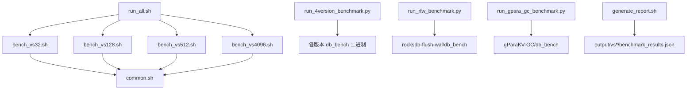
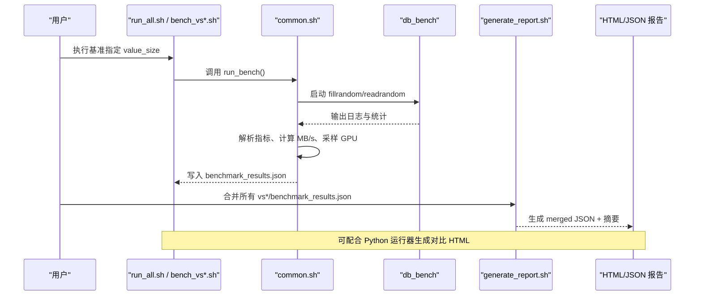
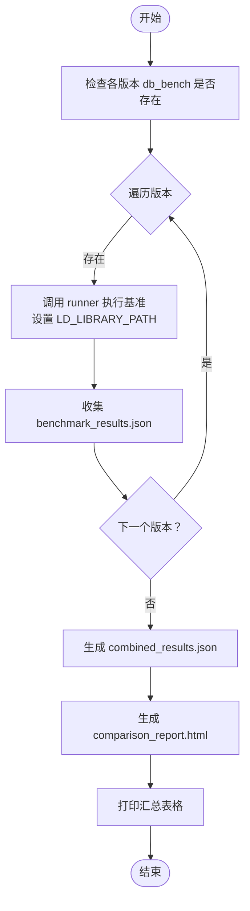
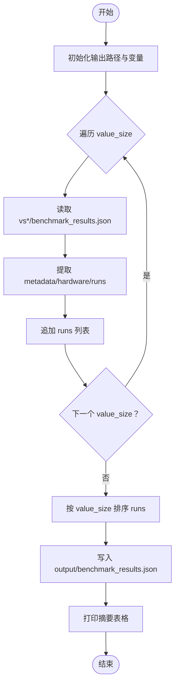
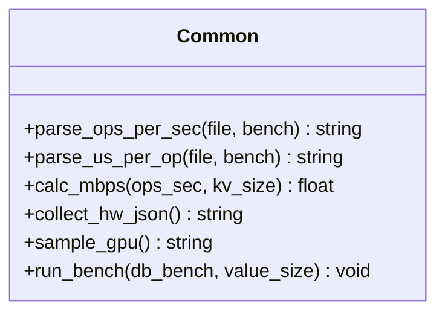
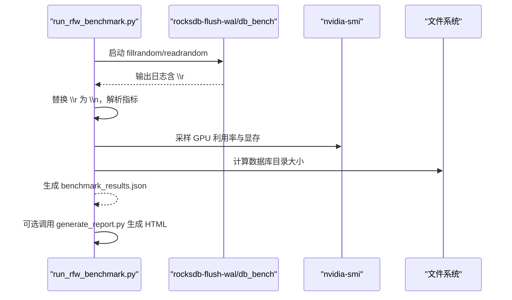
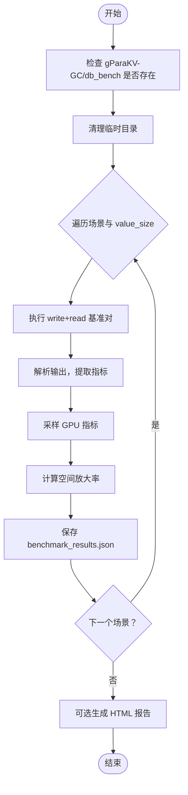
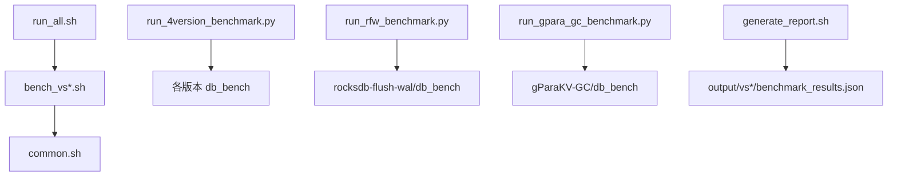

# 性能分析工具

<cite>
**本文引用的文件**   
- [script/run_4version_benchmark.py](file://script/run_4version_benchmark.py)
- [script/generate_report.sh](file://script/generate_report.sh)
- [script/common.sh](file://script/common.sh)
- [script/run_all.sh](file://script/run_all.sh)
- [script/bench_vs128.sh](file://script/bench_vs128.sh)
- [script/bench_vs32.sh](file://script/bench_vs32.sh)
- [script/bench_vs512.sh](file://script/bench_vs512.sh)
- [script/bench_vs4096.sh](file://script/bench_vs4096.sh)
- [script/run_rfw_benchmark.py](file://script/run_rfw_benchmark.py)
- [script/run_gpara_gc_benchmark.py](file://script/run_gpara_gc_benchmark.py)
</cite>

## 目录
1. [简介](#简介)
2. [项目结构](#项目结构)
3. [核心组件](#核心组件)
4. [架构总览](#架构总览)
5. [详细组件分析](#详细组件分析)
6. [依赖关系分析](#依赖关系分析)
7. [性能考量](#性能考量)
8. [故障排查指南](#故障排查指南)
9. [结论](#结论)
10. [附录](#附录)

## 简介
本技术文档面向性能分析工具套件，重点说明以下能力：
- run_4version_benchmark.py 的多版本对比分析功能：参数配置、数据收集与结果比较。
- generate_report.sh 的报告生成功能：合并多值大小结果、汇总输出与可视化报告生成流程。
- 自定义基准测试脚本开发方法：Python API 使用方式与数据处理流程。
- 性能指标定义与分析方法：吞吐量、延迟、资源利用率等关键指标。
- 自动化测试流程的配置与执行指导。
- 调试技巧与性能瓶颈定位方法。

该工具集围绕 RocksDB 及其衍生版本（如 rocksdb-flush-wal、gParaKV-GC）的 db_bench 基准程序，提供跨版本、跨场景、跨值大小的统一数据采集、聚合与可视化能力。

## 项目结构
脚本层位于 script/ 目录下，主要包含：
- 通用函数与配置：common.sh
- 批量执行入口：run_all.sh
- 单值大小基准脚本：bench_vs*.sh
- 多版本对比运行器：run_4version_benchmark.py
- 特定引擎基准运行器：run_rfw_benchmark.py、run_gpara_gc_benchmark.py
- 报告合并与汇总：generate_report.sh

图表来源
- [script/run_all.sh:1-19](file://script/run_all.sh#L1-L19)
- [script/common.sh:1-196](file://script/common.sh#L1-L196)
- [script/run_4version_benchmark.py:1-358](file://script/run_4version_benchmark.py#L1-L358)
- [script/run_rfw_benchmark.py:1-311](file://script/run_rfw_benchmark.py#L1-L311)
- [script/run_gpara_gc_benchmark.py:1-304](file://script/run_gpara_gc_benchmark.py#L1-L304)
- [script/generate_report.sh:1-59](file://script/generate_report.sh#L1-L59)

章节来源
- [script/run_all.sh:1-19](file://script/run_all.sh#L1-L19)
- [script/common.sh:1-196](file://script/common.sh#L1-L196)

## 核心组件
- common.sh：共享配置与辅助函数，封装了 db_bench 调用、指标解析、MB/s 计算、硬件信息采集、GPU 采样、JSON 结果写入等逻辑。
- run_all.sh：顺序遍历不同 value_size，依次执行对应 bench_vs*.sh 脚本，产出 output/vs*/benchmark_results.json。
- run_4version_benchmark.py：对多个 RocksDB 版本（含 flush-gpu、flush-wal、flush-wal-0.2）并行或串行执行基准，生成对比 HTML 报告与 combined JSON。
- run_rfw_benchmark.py：针对 rocksdb-flush-wal 引擎的多场景（随机/顺序/混合读写）基准运行器，输出结构化 JSON 并可选生成 HTML 报告。
- run_gpara_gc_benchmark.py：针对 gParaKV-GC 引擎的基准运行器，考虑 GPU 内存限制，输出结构化 JSON 并可选生成 HTML 报告。
- generate_report.sh：合并各 value_size 的结果为单一 benchmark_results.json，打印摘要表格，便于后续可视化或归档。

章节来源
- [script/common.sh:1-196](file://script/common.sh#L1-L196)
- [script/run_all.sh:1-19](file://script/run_all.sh#L1-L19)
- [script/run_4version_benchmark.py:1-358](file://script/run_4version_benchmark.py#L1-L358)
- [script/run_rfw_benchmark.py:1-311](file://script/run_rfw_benchmark.py#L1-L311)
- [script/run_gpara_gc_benchmark.py:1-304](file://script/run_gpara_gc_benchmark.py#L1-L304)
- [script/generate_report.sh:1-59](file://script/generate_report.sh#L1-L59)

## 架构总览
整体工作流分为“基准执行”和“报告生成”两阶段：
- 基准执行阶段：通过 shell 或 Python 脚本驱动 db_bench 执行 fillrandom/readrandom 等场景，采集吞吐、延迟、空间放大率、GPU 利用率等指标，输出 JSON。
- 报告生成阶段：将多值大小结果合并为统一 JSON，并生成 HTML 对比报告（Chart.js 可视化），支持按版本、场景、值大小进行多维对比。

图表来源
- [script/run_all.sh:1-19](file://script/run_all.sh#L1-L19)
- [script/common.sh:1-196](file://script/common.sh#L1-L196)
- [script/generate_report.sh:1-59](file://script/generate_report.sh#L1-L59)
- [script/run_4version_benchmark.py:1-358](file://script/run_4version_benchmark.py#L1-L358)

## 详细组件分析

### run_4version_benchmark.py：多版本对比分析
- 功能概述：对四个 RocksDB 版本（rocksdb、rocksdb-flush-gpu、rocksdb-flush-wal、rocksdb-flush-wal-0.2）分别执行基准，收集结果后生成对比 HTML 报告与 combined JSON。
- 参数与配置：
  - VALUE_SIZES：[32, 64, 128, 256, 512, 1024, 2048, 4096]
  - TOTAL_DATA_GB：0.5 GB
  - KEY_SIZE：20
  - OUTPUT_BASE：/tmp/rocksdb_4version_comparison
  - 每个版本通过 --env 设置 LD_LIBRARY_PATH，确保加载对应版本的 librocksdb.so
- 数据收集：
  - 调用内部 runner（run_db_bench_benchmark.py）执行具体基准，输出 benchmark_results.json
  - 收集 fill 与 read 的吞吐（MB/s）、延迟（us/op）、ops/sec 等指标
- 结果比较：
  - 生成 HTML 报告，包含配置信息、硬件信息、版本二进制路径、详细性能表、Chart.js 图表（fill 吞吐、read 吞吐、ops/sec、fill 延迟）
  - 输出 combined_results.json 供后续分析

图表来源
- [script/run_4version_benchmark.py:1-358](file://script/run_4version_benchmark.py#L1-L358)

章节来源
- [script/run_4version_benchmark.py:1-358](file://script/run_4version_benchmark.py#L1-L358)

### generate_report.sh：报告合并与汇总
- 功能概述：合并 output/vs*/benchmark_results.json 为一个统一的 benchmark_results.json，并按 value_size 排序；打印摘要表格，便于快速查看吞吐与延迟。
- 处理流程：
  - 遍历预设的 value_size（32, 128, 512, 1024, 4096, 16384）
  - 读取每个 vs*/benchmark_results.json，提取 metadata、hardware、runs
  - 合并 runs 列表，按 value_size 排序，输出到 output/benchmark_results.json
  - 打印摘要表格（Value Size、Fill ops/s、Fill MB/s、Read ops/s、Read MB/s、Fill us/op、Read us/op）

图表来源
- [script/generate_report.sh:1-59](file://script/generate_report.sh#L1-L59)

章节来源
- [script/generate_report.sh:1-59](file://script/generate_report.sh#L1-L59)

### common.sh：基准执行与指标采集
- 功能概述：封装 db_bench 调用、指标解析、MB/s 计算、硬件信息采集、GPU 采样、JSON 结果写入等逻辑。
- 关键函数：
  - parse_ops_per_sec：从 db_bench 输出中解析 ops/sec
  - parse_us_per_op：从 db_bench 输出中解析 micros/op
  - calc_mbps：根据 ops/sec 与 kv_size 计算 MB/s
  - collect_hw_json：采集 CPU、内存、GPU、OS、内核信息
  - sample_gpu：采样 nvidia-smi 获取 GPU 利用率与显存占用
  - run_bench：执行 fillrandom 与 readrandom，生成 benchmark_results.json

图表来源
- [script/common.sh:1-196](file://script/common.sh#L1-L196)

章节来源
- [script/common.sh:1-196](file://script/common.sh#L1-L196)

### run_rfw_benchmark.py：rocksdb-flush-wal 多场景基准
- 功能概述：针对 rocksdb-flush-wal 引擎，执行三种场景（随机/顺序/混合读写），覆盖多个 value_size，输出结构化 JSON 并可选生成 HTML 报告。
- 关键特性：
  - 处理 RocksDB 的 \r 进度输出，避免覆盖结果行
  - 解析 RocksDB 标准输出格式，提取 micros/op 与 MB/s
  - 采样 GPU 指标（利用率、显存占用）
  - 计算空间放大率（space_amplification）
  - 生成 benchmark_results.json，并尝试调用 generate_report.py 生成 report.html

图表来源
- [script/run_rfw_benchmark.py:1-311](file://script/run_rfw_benchmark.py#L1-L311)

章节来源
- [script/run_rfw_benchmark.py:1-311](file://script/run_rfw_benchmark.py#L1-L311)

### run_gpara_gc_benchmark.py：gParaKV-GC 基准
- 功能概述：针对 gParaKV-GC 引擎，执行三种场景（随机/顺序/混合读写），考虑 GPU 内存限制（最大 keys 数），输出结构化 JSON 并可选生成 HTML 报告。
- 关键特性：
  - 限制 num_keys 以避免 CUDA illegal memory access
  - 解析 LevelDB 风格输出，提取 micros/op 与 MB/s
  - 采样 GPU 指标，计算空间放大率
  - 生成 benchmark_results.json，并尝试调用 generate_report.py 生成 report.html

图表来源
- [script/run_gpara_gc_benchmark.py:1-304](file://script/run_gpara_gc_benchmark.py#L1-L304)

章节来源
- [script/run_gpara_gc_benchmark.py:1-304](file://script/run_gpara_gc_benchmark.py#L1-L304)

### bench_vs*.sh：单值大小基准脚本
- 功能概述：每个脚本对应一个 value_size，调用 common.sh 中的 run_bench 函数执行 fillrandom 与 readrandom，生成 output/vs*/benchmark_results.json。
- 典型示例：bench_vs128.sh、bench_vs32.sh、bench_vs512.sh、bench_vs4096.sh

章节来源
- [script/bench_vs128.sh:1-10](file://script/bench_vs128.sh#L1-L10)
- [script/bench_vs32.sh:1-10](file://script/bench_vs32.sh#L1-L10)
- [script/bench_vs512.sh:1-10](file://script/bench_vs512.sh#L1-L10)
- [script/bench_vs4096.sh:1-10](file://script/bench_vs4096.sh#L1-L10)

## 依赖关系分析
- 脚本间依赖：
  - run_all.sh 依赖 bench_vs*.sh
  - bench_vs*.sh 依赖 common.sh
  - run_4version_benchmark.py 依赖外部 runner（run_db_bench_benchmark.py）与各版本 db_bench 二进制
  - run_rfw_benchmark.py 与 run_gpara_gc_benchmark.py 依赖各自引擎的 db_bench 二进制与可选的 generate_report.py
  - generate_report.sh 依赖 output/vs*/benchmark_results.json

图表来源
- [script/run_all.sh:1-19](file://script/run_all.sh#L1-L19)
- [script/common.sh:1-196](file://script/common.sh#L1-L196)
- [script/run_4version_benchmark.py:1-358](file://script/run_4version_benchmark.py#L1-L358)
- [script/run_rfw_benchmark.py:1-311](file://script/run_rfw_benchmark.py#L1-L311)
- [script/run_gpara_gc_benchmark.py:1-304](file://script/run_gpara_gc_benchmark.py#L1-L304)
- [script/generate_report.sh:1-59](file://script/generate_report.sh#L1-L59)

章节来源
- [script/run_all.sh:1-19](file://script/run_all.sh#L1-L19)
- [script/common.sh:1-196](file://script/common.sh#L1-L196)
- [script/run_4version_benchmark.py:1-358](file://script/run_4version_benchmark.py#L1-L358)
- [script/run_rfw_benchmark.py:1-311](file://script/run_rfw_benchmark.py#L1-L311)
- [script/run_gpara_gc_benchmark.py:1-304](file://script/run_gpara_gc_benchmark.py#L1-L304)
- [script/generate_report.sh:1-59](file://script/generate_report.sh#L1-L59)

## 性能考量
- 指标定义：
  - 吞吐量（MB/s）：由 ops/sec 与键值大小（key_size + value_size）计算得出
  - 延迟（us/op）：从 db_bench 输出直接解析
  - 空间放大率（space_amplification）：数据库目录大小与逻辑字节数之比
  - GPU 利用率与显存占用：通过 nvidia-smi 采样
- 性能优化建议：
  - 调整 write_buffer_size、cache_size 以匹配工作负载
  - 控制 threads=1 保证单线程一致性，避免并发干扰
  - 选择合适的 value_size 范围，覆盖小对象与大对象场景
  - 关注 tail_latency_us（通常为 us/op * 1.5）评估长尾延迟
- 资源监控：
  - 使用 nvidia-smi 采样 GPU 指标
  - 记录 CPU、内存、OS、内核信息，便于复现实验环境

章节来源
- [script/common.sh:1-196](file://script/common.sh#L1-L196)
- [script/run_rfw_benchmark.py:1-311](file://script/run_rfw_benchmark.py#L1-L311)
- [script/run_gpara_gc_benchmark.py:1-304](file://script/run_gpara_gc_benchmark.py#L1-L304)

## 故障排查指南
- 常见问题：
  - db_bench 二进制缺失：检查路径是否正确，确保已构建对应版本
  - LD_LIBRARY_PATH 设置错误：确保每个版本使用独立的 build 目录
  - 输出解析失败：确认 db_bench 输出格式符合预期（含 micros/op、ops/sec、MB/s）
  - GPU 采样失败：检查 nvidia-smi 是否可用，权限是否正常
- 调试技巧：
  - 在 common.sh 中增加 echo 输出中间变量，验证解析逻辑
  - 在 Python 脚本中捕获异常并打印堆栈，定位问题位置
  - 使用 strace 或 ltrace 跟踪系统调用，分析性能瓶颈
- 性能瓶颈定位：
  - 观察 space_amplification 是否过高，可能提示压缩或合并策略问题
  - 对比 fill 与 read 吞吐差异，识别读放大或写放大瓶颈
  - 监控 GPU 利用率，判断是否为 GPU 相关操作导致瓶颈

章节来源
- [script/common.sh:1-196](file://script/common.sh#L1-L196)
- [script/run_rfw_benchmark.py:1-311](file://script/run_rfw_benchmark.py#L1-L311)
- [script/run_gpara_gc_benchmark.py:1-304](file://script/run_gpara_gc_benchmark.py#L1-L304)

## 结论
本性能分析工具套件提供了完整的基准测试、数据采集、合并与可视化能力，支持多版本、多场景、多值大小的对比分析。通过标准化的 JSON 输出与 HTML 报告，用户可以高效地进行性能评估与瓶颈定位。建议在持续集成环境中自动化执行基准测试，并结合监控工具进行长期性能趋势分析。

## 附录
- 自动化执行流程：
  - 执行 run_all.sh 顺序运行所有 value_size 基准
  - 运行 generate_report.sh 合并结果并生成摘要
  - 使用 run_4version_benchmark.py 进行多版本对比分析
- 自定义脚本开发指南：
  - 参考 common.sh 中的 run_bench 函数，封装 db_bench 调用与指标解析
  - 遵循 JSON 输出格式，确保 metadata、hardware、runs 字段完整
  - 可选集成 generate_report.py 生成 HTML 报告

章节来源
- [script/run_all.sh:1-19](file://script/run_all.sh#L1-L19)
- [script/generate_report.sh:1-59](file://script/generate_report.sh#L1-L59)
- [script/run_4version_benchmark.py:1-358](file://script/run_4version_benchmark.py#L1-L358)
- [script/common.sh:1-196](file://script/common.sh#L1-L196)