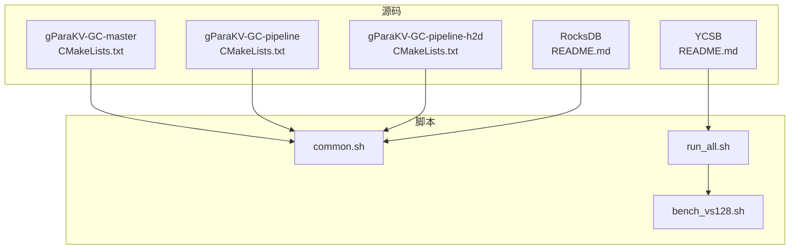
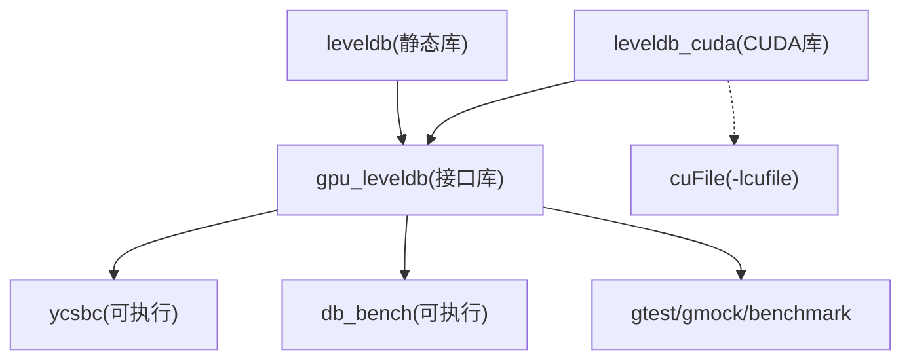
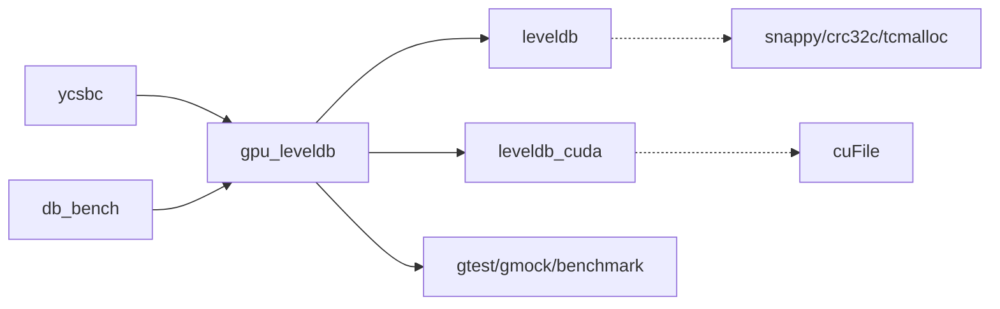

# 安装和配置

<cite>
**本文引用的文件**   
- [source/gParaKV-GC-master/CMakeLists.txt](file://source/gParaKV-GC-master/CMakeLists.txt)
- [source/gParaKV-GC-pipeline/CMakeLists.txt](file://source/gParaKV-GC-pipeline/CMakeLists.txt)
- [source/gParaKV-GC-pipeline-h2d/CMakeLists.txt](file://source/gParaKV-GC-pipeline-h2d/CMakeLists.txt)
- [source/YCSB/README.md](file://source/YCSB/README.md)
- [script/common.sh](file://script/common.sh)
- [script/run_all.sh](file://script/run_all.sh)
- [script/bench_vs128.sh](file://script/bench_vs128.sh)
- [source/gParaKV-GC-master/README.md](file://source/gParaKV-GC-master/README.md)
- [source/rocksdb/README.md](file://source/rocksdb/README.md)
</cite>

## 目录
1. [简介](#简介)
2. [项目结构](#项目结构)
3. [核心组件](#核心组件)
4. [架构总览](#架构总览)
5. [详细组件分析](#详细组件分析)
6. [依赖分析](#依赖分析)
7. [性能考虑](#性能考虑)
8. [故障排除指南](#故障排除指南)
9. [结论](#结论)
10. [附录](#附录)

## 简介
本文件为 metadata_offload 项目的安装与配置指南，覆盖环境要求（CUDA Toolkit、CMake、编译器版本等）、构建配置（CMake 选项、GPU 编译配置、第三方库路径设置）、依赖管理（CUDA、压缩库、YCSB 等）、完整构建步骤、跨平台（Linux/Windows）说明、常见构建问题与解决方案，以及验证安装的测试方法。

## 项目结构
本项目包含多个子工程：
- gParaKV-GC 系列（含 CUDA 内核与 GPU 加速的 LevelDB 变体）
- RocksDB 及其衍生版本（用于基准测试与对比）
- YCSB（Java 基准客户端）
- 脚本工具（批量基准与结果收集）

**图表来源** 
- [source/gParaKV-GC-master/CMakeLists.txt:1-557](file://source/gParaKV-GC-master/CMakeLists.txt#L1-L557)
- [source/gParaKV-GC-pipeline/CMakeLists.txt:1-585](file://source/gParaKV-GC-pipeline/CMakeLists.txt#L1-L585)
- [source/gParaKV-GC-pipeline-h2d/CMakeLists.txt:1-579](file://source/gParaKV-GC-pipeline-h2d/CMakeLists.txt#L1-L579)
- [source/rocksdb/README.md:1-30](file://source/rocksdb/README.md#L1-L30)
- [source/YCSB/README.md:1-135](file://source/YCSB/README.md#L1-L135)
- [script/common.sh:1-196](file://script/common.sh#L1-L196)
- [script/run_all.sh:1-19](file://script/run_all.sh#L1-L19)
- [script/bench_vs128.sh:1-10](file://script/bench_vs128.sh#L1-L10)

**章节来源**
- [source/gParaKV-GC-master/CMakeLists.txt:1-557](file://source/gParaKV-GC-master/CMakeLists.txt#L1-L557)
- [source/gParaKV-GC-pipeline/CMakeLists.txt:1-585](file://source/gParaKV-GC-pipeline/CMakeLists.txt#L1-L585)
- [source/gParaKV-GC-pipeline-h2d/CMakeLists.txt:1-579](file://source/gParaKV-GC-pipeline-h2d/CMakeLists.txt#L1-L579)
- [source/YCSB/README.md:1-135](file://source/YCSB/README.md#L1-L135)
- [script/common.sh:1-196](file://script/common.sh#L1-L196)
- [script/run_all.sh:1-19](file://script/run_all.sh#L1-L19)
- [script/bench_vs128.sh:1-10](file://script/bench_vs128.sh#L1-L10)

## 核心组件
- gParaKV-GC 系列：基于 LevelDB 1.23 的修改版，集成 CUDA 内核，提供 GPU 加速的垃圾回收与数据路径；包含接口库 gpu_leveldb、可执行 ycsbc、基准 db_bench。
- RocksDB：用于对比与基准测试的持久化 KV 存储实现。
- YCSB：Java 实现的通用工作负载基准框架，支持多种数据库绑定。
- 脚本：统一参数与输出格式，自动化不同 value_size 的基准流程。

**章节来源**
- [source/gParaKV-GC-master/CMakeLists.txt:510-557](file://source/gParaKV-GC-master/CMakeLists.txt#L510-L557)
- [source/gParaKV-GC-pipeline/CMakeLists.txt:513-585](file://source/gParaKV-GC-pipeline/CMakeLists.txt#L513-L585)
- [source/gParaKV-GC-pipeline-h2d/CMakeLists.txt:513-579](file://source/gParaKV-GC-pipeline-h2d/CMakeLists.txt#L513-L579)
- [source/YCSB/README.md:68-81](file://source/YCSB/README.md#L68-L81)
- [script/common.sh:68-196](file://script/common.sh#L68-L196)

## 架构总览
下图展示了 gParaKV-GC 系列的构建产物与依赖关系，包括 leveldb、leveldb_cuda、gpu_leveldb 接口库、ycsbc 可执行以及可选的 cuFile/GDS 链接。

**图表来源** 
- [source/gParaKV-GC-master/CMakeLists.txt:512-557](file://source/gParaKV-GC-master/CMakeLists.txt#L512-L557)
- [source/gParaKV-GC-pipeline/CMakeLists.txt:516-585](file://source/gParaKV-GC-pipeline/CMakeLists.txt#L516-L585)
- [source/gParaKV-GC-pipeline-h2d/CMakeLists.txt:515-579](file://source/gParaKV-GC-pipeline-h2d/CMakeLists.txt#L515-L579)

## 详细组件分析

### 环境要求与依赖
- 操作系统与内核：Ubuntu 22.04 LTS，Linux 内核 6.8.x（推荐）
- GPU 驱动：≥ 550.xx，支持 SM 6.0（Pascal）或更高
- CUDA Toolkit：12.3（nvcc 路径在 pipeline/h2d 中硬编码为 /usr/local/cuda-13.0/bin/nvcc，需与实际安装一致）
- 编译器：gcc/g++ ≥ 11，支持 C++17
- CMake：≥ 3.26（CMakeLists 最低要求 3.9，建议 3.26+）
- 可选库：libsnappy-dev（压缩），tcmalloc（内存分配器），sqlite3（可选基准）
- YCSB：Maven 3（Java 环境）

安装建议（Linux）：
- 安装基础工具链与依赖：build-essential、cmake、git、libsnappy-dev
- 安装 NVIDIA 驱动与 CUDA Toolkit
- 安装 Java/Maven（用于 YCSB）

**章节来源**
- [source/gParaKV-GC-master/README.md:25-45](file://source/gParaKV-GC-master/README.md#L25-L45)
- [source/gParaKV-GC-pipeline/CMakeLists.txt:8](file://source/gParaKV-GC-pipeline/CMakeLists.txt#L8)
- [source/gParaKV-GC-pipeline-h2d/CMakeLists.txt:8](file://source/gParaKV-GC-pipeline-h2d/CMakeLists.txt#L8)
- [source/YCSB/README.md:68-76](file://source/YCSB/README.md#L68-L76)

### 构建配置与 CMake 选项
- 语言标准：C++17、CUDA 标准启用
- 构建类型：Release
- 关键选项：
  - LEVELDB_BUILD_TESTS：是否构建单元测试（默认 ON）
  - LEVELDB_BUILD_BENCHMARKS：是否构建基准（默认 ON）
  - LEVELDB_INSTALL：是否安装头文件与库（默认 ON）
  - BUILD_SHARED_LIBS：是否构建共享库（影响测试目标）
- CUDA 架构：
  - gParaKV-GC-master：CUDA_ARCHITECTURES "60"
  - gParaKV-GC-pipeline/h2d：CUDA_ARCHITECTURES "89"
- 链接库：
  - leveldb 可选链接 crc32c、snappy、tcmalloc
  - leveldb_cuda 在 pipeline 版本中链接 -lcuFile（GDS）
  - 测试与基准依赖 gtest/gmock/benchmark

构建命令示例：
- 生成构建系统：mkdir build && cd build && cmake ..
- 构建目标：cmake --build build --target <目标> -jN

**章节来源**
- [source/gParaKV-GC-master/CMakeLists.txt:5-26](file://source/gParaKV-GC-master/CMakeLists.txt#L5-L26)
- [source/gParaKV-GC-master/CMakeLists.txt:36-41](file://source/gParaKV-GC-master/CMakeLists.txt#L36-L41)
- [source/gParaKV-GC-master/CMakeLists.txt:280-292](file://source/gParaKV-GC-master/CMakeLists.txt#L280-L292)
- [source/gParaKV-GC-master/CMakeLists.txt:547-557](file://source/gParaKV-GC-master/CMakeLists.txt#L547-L557)
- [source/gParaKV-GC-pipeline/CMakeLists.txt:555-585](file://source/gParaKV-GC-pipeline/CMakeLists.txt#L555-L585)
- [source/gParaKV-GC-pipeline-h2d/CMakeLists.txt:553-579](file://source/gParaKV-GC-pipeline-h2d/CMakeLists.txt#L553-L579)

### GPU 编译配置
- nvcc 路径：pipeline/h2d 中显式设置 CMAKE_CUDA_COMPILER=/usr/local/cuda-13.0/bin/nvcc
- CUDA 标志：-O3 -use_fast_math -lineinfo
- 分离编译：CUDA_SEPARABLE_COMPILATION ON
- 架构选择：根据 GPU 型号调整 CUDA_ARCHITECTURES（如 60、89）

注意：若本地 CUDA 安装路径不同，请修改对应 CMakeLists 中的 CMAKE_CUDA_COMPILER 与 include/link 路径。

**章节来源**
- [source/gParaKV-GC-pipeline/CMakeLists.txt:8-13](file://source/gParaKV-GC-pipeline/CMakeLists.txt#L8-L13)
- [source/gParaKV-GC-pipeline-h2d/CMakeLists.txt:8-13](file://source/gParaKV-GC-pipeline-h2d/CMakeLists.txt#L8-L13)
- [source/gParaKV-GC-master/CMakeLists.txt:547-557](file://source/gParaKV-GC-master/CMakeLists.txt#L547-L557)

### 第三方库路径设置
- Threads：find_package(Threads REQUIRED)
- 可选库检测：crc32c、snappy、tcmalloc、sqlite3、kyotocabinet
- cuFile（GDS）：在 pipeline 版本中通过 target_link_directories 与 target_link_libraries 指定路径与库名

建议：
- 将 snappy/tcmalloc/sqlite3 等库安装到系统路径或通过 CMAKE_PREFIX_PATH 指定
- 对于 cuFile，确保 CUDA 安装包含该库并正确设置 RPATH/LD_LIBRARY_PATH

**章节来源**
- [source/gParaKV-GC-master/CMakeLists.txt:291-292](file://source/gParaKV-GC-master/CMakeLists.txt#L291-L292)
- [source/gParaKV-GC-master/CMakeLists.txt:280-292](file://source/gParaKV-GC-master/CMakeLists.txt#L280-L292)
- [source/gParaKV-GC-pipeline/CMakeLists.txt:527-528](file://source/gParaKV-GC-pipeline/CMakeLists.txt#L527-L528)

### 依赖管理：CUDA、压缩库、YCSB
- CUDA：安装驱动与 Toolkit，确认 nvcc 可用；必要时更新 CMAKE_CUDA_COMPILER
- 压缩库：libsnappy-dev（推荐），tcmalloc（可选）
- YCSB：使用 Maven 构建，支持多绑定；运行脚本位于 bin/ycsb.sh 或 ycsb.bat

YCSB 构建与运行：
- 构建：mvn clean package
- 运行：bin/ycsb.sh load/run ...

**章节来源**
- [source/YCSB/README.md:68-81](file://source/YCSB/README.md#L68-L81)
- [source/YCSB/README.md:31-57](file://source/YCSB/README.md#L31-L57)

### 完整构建步骤（Linux）
1. 准备环境：安装 gcc/g++、CMake、CUDA Toolkit、libsnappy-dev
2. 克隆仓库并初始化子模块（如有）
3. 进入 gParaKV-GC 目录，创建 build 目录
4. 运行 cmake .. 生成构建系统
5. 构建目标：
   - db_bench：cmake --build build --target db_bench -jN
   - ycsbc：cmake --build build --target ycsbc -jN
6. 验证：运行 db_bench 或 ycsbc 基本用例

**章节来源**
- [source/gParaKV-GC-master/README.md:58-72](file://source/gParaKV-GC-master/README.md#L58-L72)
- [source/gParaKV-GC-master/CMakeLists.txt:547-557](file://source/gParaKV-GC-master/CMakeLists.txt#L547-L557)

### 完整构建步骤（Windows）
- 平台宏：LEVELDB_PLATFORM_WINDOWS
- 编译器：MSVC（禁用异常与 RTTI）
- 注意事项：Windows 下 NVCC 与 CUDA 路径需正确配置；部分 POSIX 特性不可用

**章节来源**
- [source/gParaKV-GC-master/CMakeLists.txt:28-34](file://source/gParaKV-GC-master/CMakeLists.txt#L28-L34)
- [source/gParaKV-GC-master/CMakeLists.txt:58-83](file://source/gParaKV-GC-master/CMakeLists.txt#L58-L83)

### 验证安装的测试方法
- RocksDB 基准脚本：
  - 运行 bench_vs128.sh（或其他 size 脚本），输出 JSON 结果至 output/vs*/benchmark_results.json
  - 脚本会调用 rocksdb/build/db_bench，解析 fillrandom/readrandom 指标
- YCSB 快速验证：
  - 使用 bin/ycsb.sh 加载与运行 basic workload

**章节来源**
- [script/bench_vs128.sh:1-10](file://script/bench_vs128.sh#L1-L10)
- [script/common.sh:68-196](file://script/common.sh#L68-L196)
- [source/YCSB/README.md:31-57](file://source/YCSB/README.md#L31-L57)

## 依赖分析
- 直接依赖：
  - leveldb（核心库）
  - leveldb_cuda（CUDA 内核库）
  - gpu_leveldb（接口库，聚合依赖）
  - 测试/基准：gtest、gmock、benchmark
  - 可选：crc32c、snappy、tcmalloc、sqlite3、kyotocabinet
  - cuFile（GDS，pipeline 版本）
- 间接依赖：
  - Threads（POSIX 线程）
  - CUDA 运行时与驱动

**图表来源** 
- [source/gParaKV-GC-master/CMakeLists.txt:512-557](file://source/gParaKV-GC-master/CMakeLists.txt#L512-L557)
- [source/gParaKV-GC-pipeline/CMakeLists.txt:516-585](file://source/gParaKV-GC-pipeline/CMakeLists.txt#L516-L585)
- [source/gParaKV-GC-pipeline-h2d/CMakeLists.txt:515-579](file://source/gParaKV-GC-pipeline-h2d/CMakeLists.txt#L515-L579)

**章节来源**
- [source/gParaKV-GC-master/CMakeLists.txt:280-292](file://source/gParaKV-GC-master/CMakeLists.txt#L280-L292)
- [source/gParaKV-GC-pipeline/CMakeLists.txt:527-528](file://source/gParaKV-GC-pipeline/CMakeLists.txt#L527-L528)

## 性能考虑
- CUDA 架构选择应与 GPU 匹配（如 60、89），错误架构会导致性能下降或无法运行
- 启用 fast math 与分离编译可提升编译与运行效率
- 压缩库（snappy）可降低空间放大但增加 CPU 开销，需权衡
- RocksDB 基准中 write_buffer_size、threads、cache_size 等参数对吞吐与延迟有显著影响

[本节为通用指导，不直接分析具体文件]

## 故障排除指南
常见问题与解决：
- nvcc 未找到或路径错误：检查 CMAKE_CUDA_COMPILER 设置与 CUDA 安装路径
- 找不到 -lcuFile：确认 CUDA 安装包含 cuFile，并在 CMake 中正确设置 link_directories 与 RPATH
- 缺少 snappy/crc32c/tcmalloc：安装对应开发包或通过 CMAKE_PREFIX_PATH 指定路径
- Windows 下编译失败：确认 MSVC 配置与禁用异常/RTTI 的标志生效
- RocksDB 基准运行报错：检查 LD_LIBRARY_PATH 指向 rocksdb/build 与系统库路径

定位方法：
- 查看 CMake 日志与构建输出
- 使用 nvidia-smi 确认 GPU 状态
- 检查脚本输出的 benchmark_results.json 与 db_bench 原始输出

**章节来源**
- [source/gParaKV-GC-pipeline/CMakeLists.txt:8](file://source/gParaKV-GC-pipeline/CMakeLists.txt#L8)
- [source/gParaKV-GC-pipeline/CMakeLists.txt:527-528](file://source/gParaKV-GC-pipeline/CMakeLists.txt#L527-L528)
- [script/common.sh:14](file://script/common.sh#L14)

## 结论
metadata_offload 项目以 gParaKV-GC 为核心，结合 CUDA 加速与 RocksDB 基准，提供了完整的 GPU 加速键值存储实验环境。通过明确的 CMake 配置与脚本工具，用户可在 Linux/Windows 上完成构建与验证。遵循本文的环境与构建指南，可有效避免常见依赖与路径问题，顺利运行基准与 YCSB 测试。

[本节为总结性内容，不直接分析具体文件]

## 附录
- 常用命令速查：
  - 构建：cmake --build build --target <目标> -jN
  - 运行 RocksDB 基准：bash script/bench_vs*.sh
  - 运行 YCSB：bin/ycsb.sh load/run ...

[本节为补充信息，不直接分析具体文件]