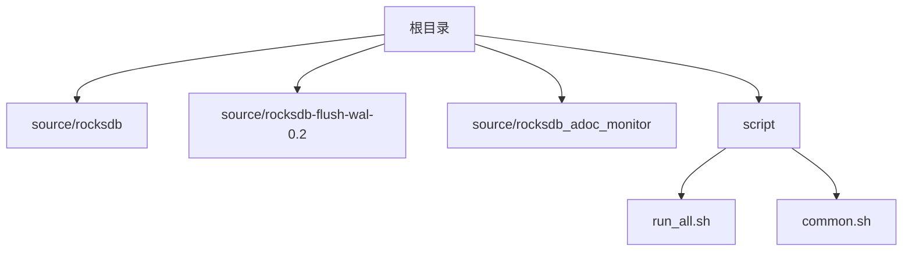
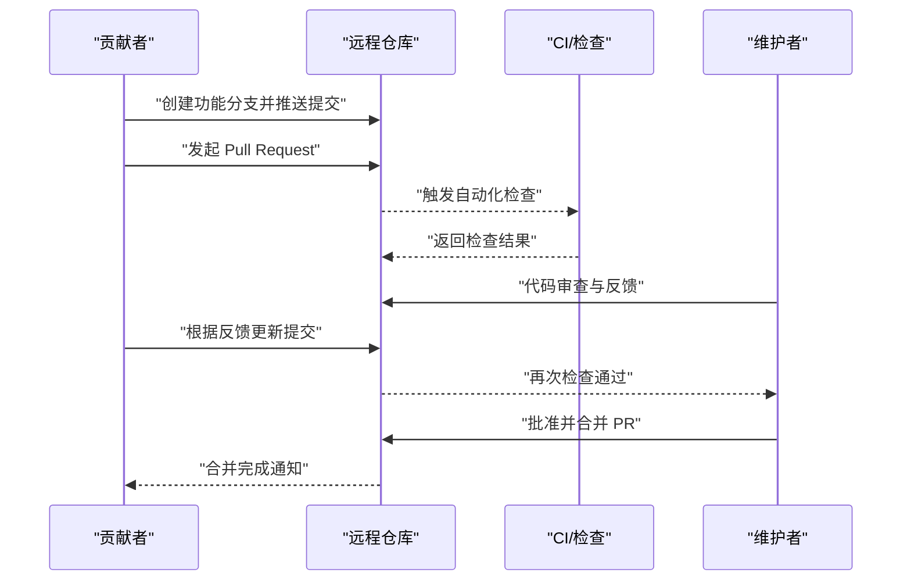
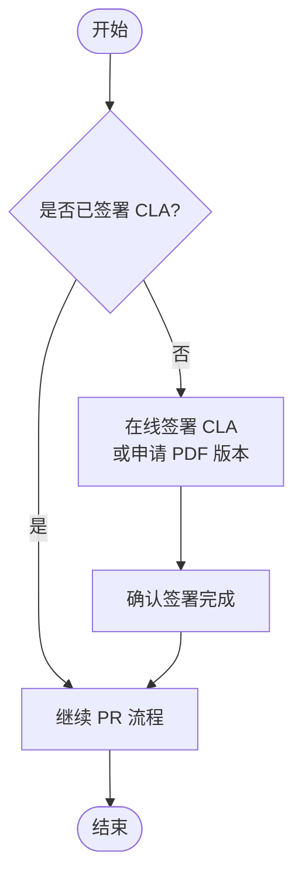
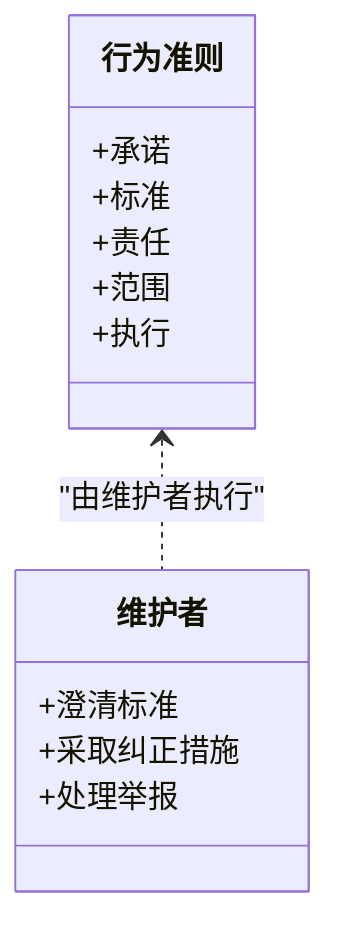
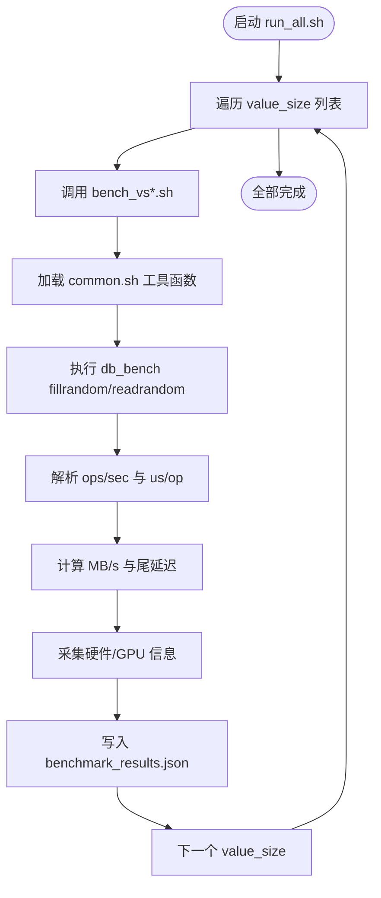
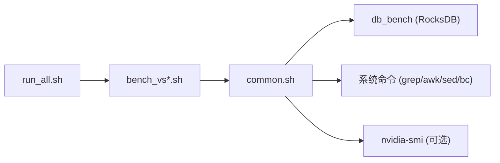

# 代码贡献流程

<cite>
**本文引用的文件**
- [source/rocksdb/CONTRIBUTING.md](file://source/rocksdb/CONTRIBUTING.md)
- [source/rocksdb/CODE_OF_CONDUCT.md](file://source/rocksdb/CODE_OF_CONDUCT.md)
- [source/rocksdb-flush-wal-0.2/CONTRIBUTING.md](file://source/rocksdb-flush-wal-0.2/CONTRIBUTING.md)
- [source/rocksdb_adoc_monitor/CONTRIBUTING.md](file://source/rocksdb_adoc_monitor/CONTRIBUTING.md)
- [script/run_all.sh](file://script/run_all.sh)
- [script/common.sh](file://script/common.sh)
</cite>

## 目录
1. [简介](#简介)
2. [项目结构](#项目结构)
3. [核心组件](#核心组件)
4. [架构总览](#架构总览)
5. [详细组件分析](#详细组件分析)
6. [依赖分析](#依赖分析)
7. [性能考虑](#性能考虑)
8. [故障排查指南](#故障排查指南)
9. [结论](#结论)
10. [附录](#附录)

## 简介
本文件为 RocksDB 元数据卸载项目的“代码贡献流程”文档，面向新贡献者与活跃维护者，统一说明 Git 工作流、分支策略、提交信息规范、Pull Request 流程、代码审查标准、CLA（贡献者许可协议）签署要求、行为准则与协作规范，并提供入门步骤与常见问题解答。目标是让贡献者能够高效、合规地参与项目开发与评审。

## 项目结构
仓库包含多个子模块与脚本：
- source/rocksdb、source/rocksdb-flush-wal-0.2、source/rocksdb_adoc_monitor：RocksDB 相关源码与贡献指南
- script：基准测试与报告生成脚本
- 其他子模块（如 YCSB、gParaKV-GC-*、leveldb-main）：用于评测或实验的第三方/历史版本

**图表来源**
- [script/run_all.sh:1-19](file://script/run_all.sh#L1-L19)
- [script/common.sh:1-196](file://script/common.sh#L1-L196)

**章节来源**
- [script/run_all.sh:1-19](file://script/run_all.sh#L1-L19)
- [script/common.sh:1-196](file://script/common.sh#L1-L196)

## 核心组件
- 贡献指南与 CLA：各 RocksDB 子模块均提供 CONTRIBUTING.md，明确需要签署 CLA 后方可合并 PR。
- 行为准则：CODE_OF_CONDUCT.md 定义了社区行为标准与执行机制。
- 基准脚本：script 目录下的 run_all.sh 与 common.sh 提供了统一的基准运行与结果收集流程，可作为贡献验证的一部分。

**章节来源**
- [source/rocksdb/CONTRIBUTING.md:1-18](file://source/rocksdb/CONTRIBUTING.md#L1-L18)
- [source/rocksdb/CODE_OF_CONDUCT.md:1-78](file://source/rocksdb/CODE_OF_CONDUCT.md#L1-L78)
- [source/rocksdb-flush-wal-0.2/CONTRIBUTING.md:1-18](file://source/rocksdb-flush-wal-0.2/CONTRIBUTING.md#L1-L18)
- [source/rocksdb_adoc_monitor/CONTRIBUTING.md:1-18](file://source/rocksdb_adoc_monitor/CONTRIBUTING.md#L1-L18)
- [script/run_all.sh:1-19](file://script/run_all.sh#L1-L19)
- [script/common.sh:1-196](file://script/common.sh#L1-L196)

## 架构总览
下图展示了从贡献到合并的整体流程，包括分支创建、提交、PR 审查、CLA 校验与最终合并。

[此图为概念性流程图，不直接映射具体源码文件]

## 详细组件分析

### 贡献指南与 CLA
- 所有 RocksDB 相关子模块的 CONTRIBUTING.md 均明确要求：在合并 PR 前需签署 CLA；若已为 Facebook 开源项目签署过则无需重复。
- 首次贡献者可在 PR 中声明已完成 CLA，维护者将核对 GitHub 用户名。
- 如需纸质版，可通过邮件或新建 Issue 申请 PDF 版本。

**图表来源**
- [source/rocksdb/CONTRIBUTING.md:6-18](file://source/rocksdb/CONTRIBUTING.md#L6-L18)
- [source/rocksdb-flush-wal-0.2/CONTRIBUTING.md:6-18](file://source/rocksdb-flush-wal-0.2/CONTRIBUTING.md#L6-L18)
- [source/rocksdb_adoc_monitor/CONTRIBUTING.md:6-18](file://source/rocksdb_adoc_monitor/CONTRIBUTING.md#L6-L18)

**章节来源**
- [source/rocksdb/CONTRIBUTING.md:1-18](file://source/rocksdb/CONTRIBUTING.md#L1-L18)
- [source/rocksdb-flush-wal-0.2/CONTRIBUTING.md:1-18](file://source/rocksdb-flush-wal-0.2/CONTRIBUTING.md#L1-L18)
- [source/rocksdb_adoc_monitor/CONTRIBUTING.md:1-18](file://source/rocksdb_adoc_monitor/CONTRIBUTING.md#L1-L18)

### 行为准则与团队协作
- CODE_OF_CONDUCT.md 明确了包容、尊重、建设性批评等正向行为，以及骚扰、攻击、泄露隐私等不可接受行为。
- 维护者负责澄清标准并采取适当纠正措施；违规可能面临警告、限制或封禁。
- 适用范围覆盖所有项目空间及代表项目的公共场合。

**图表来源**
- [source/rocksdb/CODE_OF_CONDUCT.md:1-78](file://source/rocksdb/CODE_OF_CONDUCT.md#L1-L78)

**章节来源**
- [source/rocksdb/CODE_OF_CONDUCT.md:1-78](file://source/rocksdb/CODE_OF_CONDUCT.md#L1-L78)

### 基准测试与验证流程
- run_all.sh 顺序执行不同 value_size 的基准测试，输出 JSON 结果至 output/vs*/benchmark_results.json。
- common.sh 提供参数解析、指标提取、MB/s 计算、硬件信息采集、GPU 采样与 JSON 写入等通用能力。
- 建议贡献者在提交前运行基准脚本，确保变更未引入性能退化。

**图表来源**
- [script/run_all.sh:1-19](file://script/run_all.sh#L1-L19)
- [script/common.sh:1-196](file://script/common.sh#L1-L196)

**章节来源**
- [script/run_all.sh:1-19](file://script/run_all.sh#L1-L19)
- [script/common.sh:1-196](file://script/common.sh#L1-L196)

### 代码审查流程与标准
- 审查要点：
  - 正确性与稳定性：逻辑正确、边界条件处理、错误路径覆盖
  - 性能影响：基准回归检查、资源使用合理
  - 可维护性：命名清晰、模块化良好、注释充分
  - 安全与合规：遵循行为准则、无敏感信息泄露、符合许可证要求
- 反馈处理：
  - 针对评论逐条回复与修改，保持 PR 历史整洁
  - 必要时补充测试或基准用例
- 合并要求：
  - 至少一名维护者批准
  - 自动化检查通过（编译、测试、基准）
  - CLA 已签署

[本节为通用流程说明，不直接引用具体源码文件]

### 分支管理策略与提交信息格式
- 分支策略（建议）：
  - main/master：稳定主干
  - feature/*：功能开发分支
  - fix/*：缺陷修复分支
  - release/*：发布准备分支
- 提交信息格式（建议）：
  - 标题：简短描述变更内容（动词开头）
  - 正文：动机、影响范围、关键实现点
  - 关联：Issue/Pull Request 编号
  - 示例：feat(db): 优化 WAL 写入路径以减少延迟

[本节为通用规范说明，不直接引用具体源码文件]

### Pull Request 流程
- 创建分支并推送提交
- 发起 PR，填写变更说明与影响评估
- 等待自动化检查与维护者审查
- 根据反馈迭代修改
- 获得批准后合并

[本节为通用流程说明，不直接引用具体源码文件]

## 依赖分析
- 脚本依赖关系：
  - run_all.sh 依赖 common.sh 提供的工具函数
  - common.sh 依赖系统命令（grep、awk、sed、bc、nvidia-smi 等）
- 外部依赖：
  - RocksDB 构建产物（db_bench）需存在于指定路径并通过 LD_LIBRARY_PATH 可见
  - GPU 环境可选，nvidia-smi 存在时采集 GPU 指标

**图表来源**
- [script/run_all.sh:1-19](file://script/run_all.sh#L1-L19)
- [script/common.sh:1-196](file://script/common.sh#L1-L196)

**章节来源**
- [script/run_all.sh:1-19](file://script/run_all.sh#L1-L19)
- [script/common.sh:1-196](file://script/common.sh#L1-L196)

## 性能考虑
- 基准参数可调：value_size、num_ops、threads、write_buffer_size、compression_type、seed 等
- 指标关注：ops/sec、us/op、MB/s、尾延迟、空间放大率、GPU 利用率与显存占用
- 建议：
  - 在相同环境下对比基线与变更后的结果
  - 多次运行取稳定值，避免抖动
  - 记录硬件配置以便复现

[本节为通用指导，不直接引用具体源码文件]

## 故障排查指南
- 无法找到 db_bench：
  - 检查 LD_LIBRARY_PATH 与 RocksDB 构建产物路径是否正确
- nvidia-smi 不可用：
  - 脚本会跳过 GPU 采样，不影响基础指标采集
- 基准结果异常：
  - 检查输入参数与输出目录权限
  - 查看 raw 日志定位失败阶段
- 权限与环境问题：
  - 确保脚本具有执行权限
  - 清理 /tmp 中的临时数据库目录

[本节为通用指导，不直接引用具体源码文件]

## 结论
通过遵循本贡献流程，贡献者可高效、合规地参与 RocksDB 元数据卸载项目。关键在于：签署 CLA、遵守行为准则、按规范进行分支与提交、完成审查与自动化检查、基于基准验证性能影响。建议在首次贡献前阅读相关 CONTRIBUTING.md 与 CODE_OF_CONDUCT.md，并在本地完整运行基准脚本以确保质量。

[本节为总结性内容，不直接引用具体源码文件]

## 附录

### 新贡献者入门清单
- 克隆仓库并安装必要依赖
- 阅读 source/rocksdb/CONTRIBUTING.md 与 CODE_OF_CONDUCT.md
- 在线签署 CLA（如未签署）
- 创建功能分支并提交变更
- 运行基准脚本验证性能
- 发起 PR 并响应审查意见
- 合并后关注后续反馈

[本节为通用指导，不直接引用具体源码文件]

### 常见问题解答
- Q：是否需要每次提交都重新签署 CLA？
  - A：不需要，仅需一次签署。
- Q：如何申请纸质版 CLA？
  - A：通过邮件或新建 Issue 申请 PDF 版本。
- Q：基准脚本失败怎么办？
  - A：检查环境变量、依赖命令与权限，查看 raw 日志定位问题。
- Q：没有 GPU 环境会影响结果吗？
  - A：不会影响基础指标，仅缺少 GPU 利用率与显存数据。

[本节为通用指导，不直接引用具体源码文件]