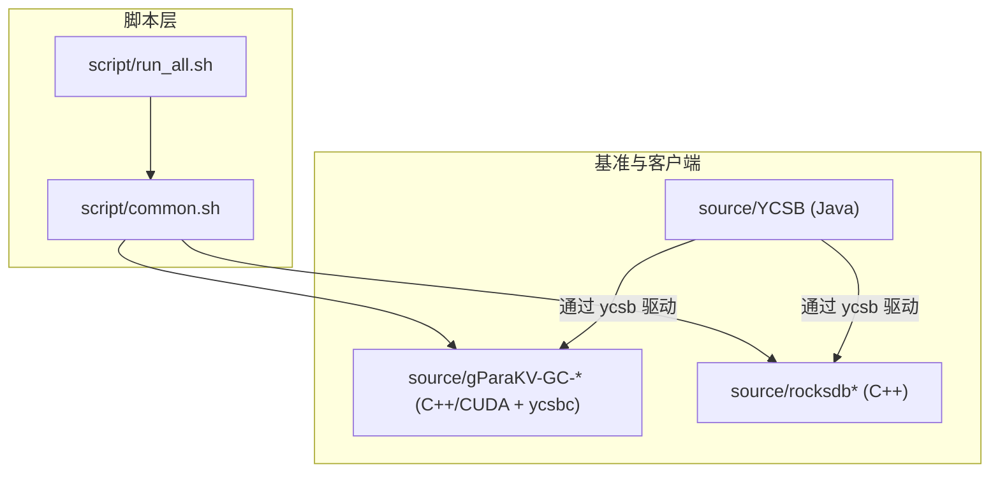
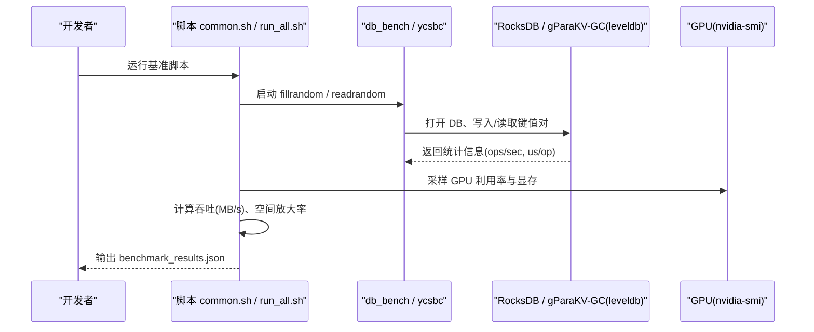
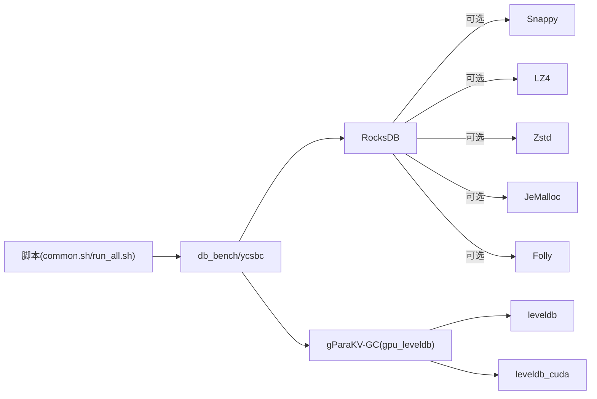

# 开发指南

<cite>
**本文引用的文件**   
- [source/YCSB/CONTRIBUTING.md](file://source/YCSB/CONTRIBUTING.md)
- [source/gParaKV-GC-master/CONTRIBUTING.md](file://source/gParaKV-GC-master/CONTRIBUTING.md)
- [source/rocksdb/CONTRIBUTING.md](file://source/rocksdb/CONTRIBUTING.md)
- [source/YCSB/checkstyle.xml](file://source/YCSB/checkstyle.xml)
- [source/gParaKV-GC-master/CMakeLists.txt](file://source/gParaKV-GC-master/CMakeLists.txt)
- [source/rocksdb/CMakeLists.txt](file://source/rocksdb/CMakeLists.txt)
- [script/common.sh](file://script/common.sh)
- [script/run_all.sh](file://script/run_all.sh)
</cite>

## 目录
1. [简介](#简介)
2. [项目结构](#项目结构)
3. [核心组件](#核心组件)
4. [架构总览](#架构总览)
5. [详细组件分析](#详细组件分析)
6. [依赖分析](#依赖分析)
7. [性能考虑](#性能考虑)
8. [故障排查指南](#故障排查指南)
9. [结论](#结论)
10. [附录](#附录)

## 简介
本指南面向新贡献者与维护者，系统化说明 metadata_offload 项目的开发流程与规范。内容涵盖：
- Git 工作流与代码审查流程（基于 YCSB、gParaKV-GC、RocksDB 的 CONTRIBUTING 文档）
- C++/CUDA/Java 编码规范与风格检查
- 单元测试与集成测试编写方法（GoogleTest/Benchmark、YCSB 基准脚本）
- 调试技巧与常用工具（ccache、ASAN/TSAN/UBSAN、nvidia-smi）
- 构建系统详解与自定义选项（CMake 与 Makefile）
- 开发环境搭建与常见问题解决方案

## 项目结构
仓库包含多个子项目与脚本：
- source/YCSB：Java 多模块 Maven 工程，用于数据库基准测试与客户端绑定
- source/gParaKV-GC-*：LevelDB 衍生实现，含 CUDA GPU 加速与 ycsbc 客户端
- source/rocksdb*：RocksDB 及其变体，提供高性能 KV 存储引擎
- script：基准测试与报告生成脚本，统一执行不同 value size 的 fill/read 场景并输出 JSON 结果

图表来源
- [script/common.sh:1-196](file://script/common.sh#L1-L196)
- [script/run_all.sh:1-19](file://script/run_all.sh#L1-L19)
- [source/gParaKV-GC-master/CMakeLists.txt:527-546](file://source/gParaKV-GC-master/CMakeLists.txt#L527-L546)
- [source/rocksdb/CMakeLists.txt:1-120](file://source/rocksdb/CMakeLists.txt#L1-L120)

章节来源
- [script/common.sh:1-196](file://script/common.sh#L1-L196)
- [script/run_all.sh:1-19](file://script/run_all.sh#L1-L19)

## 核心组件
- YCSB（Java）：多模块 Maven 工程，定义 Workload、Client、Binding 接口，提供 checkstyle 风格检查与 Java 编码规范
- gParaKV-GC（C++/CUDA）：LevelDB 派生实现，包含 GPU 加速库 leveldb_cuda、接口库 gpu_leveldb、ycsbc 客户端；CMake 管理编译与测试
- RocksDB（C++）：高性能 KV 存储引擎，CMake 配置丰富，支持多种压缩、内存分配器、线程与异步 I/O 等选项
- 基准脚本：common.sh 封装 db_bench 调用、指标解析、硬件信息采集与 JSON 输出；run_all.sh 顺序执行多 value size 基准

章节来源
- [source/YCSB/CONTRIBUTING.md:1-133](file://source/YCSB/CONTRIBUTING.md#L1-L133)
- [source/gParaKV-GC-master/CMakeLists.txt:1-120](file://source/gParaKV-GC-master/CMakeLists.txt#L1-L120)
- [source/rocksdb/CMakeLists.txt:1-120](file://source/rocksdb/CMakeLists.txt#L1-L120)
- [script/common.sh:1-196](file://script/common.sh#L1-L196)

## 架构总览
下图展示从脚本到引擎的端到端流程：脚本驱动 db_bench 或 ycsbc，调用底层 RocksDB/gParaKV-GC 引擎，采集吞吐、延迟、空间放大率与 GPU 利用率，并输出结构化结果。

图表来源
- [script/common.sh:68-195](file://script/common.sh#L68-L195)
- [source/gParaKV-GC-master/CMakeLists.txt:527-546](file://source/gParaKV-GC-master/CMakeLists.txt#L527-L546)
- [source/rocksdb/CMakeLists.txt:1-120](file://source/rocksdb/CMakeLists.txt#L1-L120)

## 详细组件分析

### 贡献流程与代码审查（Git 工作流）
- YCSB（Java）
  - Fork 主仓库，创建分支，提交 PR；CI 失败需修复后重新提交
  - 使用 CheckStyle 进行风格检查；遵循 Java 命名、Javadoc、行长度等规范
  - 保持核心行为稳定，避免破坏既有测量与生成器
- gParaKV-GC（C++/CUDA）
  - 签署 CLA（个人或公司），按单一逻辑变更提交 PR，关联 Issue 编号
  - 遵循 Google C++ 风格指南
- RocksDB（C++）
  - 签署 Facebook CLA；首次提交时声明已完成 CLA
  - 遵循项目行为准则与贡献流程

章节来源
- [source/YCSB/CONTRIBUTING.md:24-96](file://source/YCSB/CONTRIBUTING.md#L24-L96)
- [source/gParaKV-GC-master/CONTRIBUTING.md:1-37](file://source/gParaKV-GC-master/CONTRIBUTING.md#L1-L37)
- [source/rocksdb/CONTRIBUTING.md:1-18](file://source/rocksdb/CONTRIBUTING.md#L1-L18)

### 编码规范与代码风格
- Java（YCSB）
  - 使用 checkstyle.xml 强制风格：缩进、行长度、命名、Javadoc、括号位置、导入规则等
  - 建议 IDE 集成 CheckStyle 插件，本地先执行 mvn checkstyle:checkstyle
- C++（gParaKV-GC/RocksDB）
  - 遵循 Google C++ 风格指南；启用 .clang-format 与 .clang-tidy（RocksDB）
  - 关闭异常与 RTTI（gParaKV-GC 默认策略），开启严格警告
- CUDA（gParaKV-GC）
  - 使用 nvcc 编译，设置 CUDA_ARCHITECTURES 与可分离编译
  - 优化标志 -O3 -use_fast_math -lineinfo

章节来源
- [source/YCSB/checkstyle.xml:51-194](file://source/YCSB/checkstyle.xml#L51-L194)
- [source/gParaKV-GC-master/CMakeLists.txt:58-80](file://source/gParaKV-GC-master/CMakeLists.txt#L58-L80)
- [source/gParaKV-GC-master/CMakeLists.txt:547-556](file://source/gParaKV-GC-master/CMakeLists.txt#L547-L556)
- [source/rocksdb/CMakeLists.txt:232-250](file://source/rocksdb/CMakeLists.txt#L232-L250)

### 单元测试与集成测试
- GoogleTest（gParaKV-GC）
  - CMake 中启用 LEVELDB_BUILD_TESTS，自动添加测试目标并通过 add_test 注册
  - 测试链接 leveldb、gmock、gtest、benchmark
- Benchmark（gParaKV-GC）
  - 使用 Google Benchmark 构建 db_bench 等基准程序
- YCSB 基准（Java）
  - 通过 ycsb 命令行驱动各 Binding，定义 Workload 与参数
- 集成测试（脚本）
  - common.sh 封装 fillrandom/readrandom 调用，解析输出并生成 JSON
  - run_all.sh 顺序执行多 value size 场景

章节来源
- [source/gParaKV-GC-master/CMakeLists.txt:299-396](file://source/gParaKV-GC-master/CMakeLists.txt#L299-L396)
- [source/gParaKV-GC-master/CMakeLists.txt:398-455](file://source/gParaKV-GC-master/CMakeLists.txt#L398-L455)
- [script/common.sh:68-195](file://script/common.sh#L68-L195)
- [script/run_all.sh:1-19](file://script/run_all.sh#L1-L19)

### 调试技巧与常用工具
- 编译器与缓存
  - RocksDB 支持 ccache 加速编译（CMAKE_C/CXX_COMPILER_LAUNCHER）
- 安全与并发检测
  - ASAN（WITH_ASAN）、TSAN（WITH_TSAN）、UBSAN（WITH_UBSAN）
- GPU 监控
  - nvidia-smi 采样 GPU 利用率与显存占用（脚本已内置）
- 日志与统计
  - RocksDB 启用 statistics/histogram；LevelDB 衍生实现提供 histogram/logging

章节来源
- [source/rocksdb/CMakeLists.txt:85-94](file://source/rocksdb/CMakeLists.txt#L85-L94)
- [source/rocksdb/CMakeLists.txt:384-413](file://source/rocksdb/CMakeLists.txt#L384-L413)
- [script/common.sh:41-66](file://script/common.sh#L41-L66)
- [source/gParaKV-GC-master/CMakeLists.txt:406-408](file://source/gParaKV-GC-master/CMakeLists.txt#L406-L408)

### 构建系统与自定义选项
- gParaKV-GC（CMake）
  - 语言标准：C++17、CUDA 标准与扩展控制
  - 目标：leveldb、leveldb_cuda、gpu_leveldb、ycsbc、db_bench
  - 关键选项：LEVELDB_BUILD_TESTS、LEVELDB_BUILD_BENCHMARKS、BUILD_SHARED_LIBS、CUDA_SEPARABLE_COMPILATION、CUDA_ARCHITECTURES
- RocksDB（CMake）
  - 语言标准：C++20（默认）
  - 关键选项：WITH_JEMALLOC、WITH_SNAPPY/LZ4/ZLIB/ZSTD、WITH_GFLAGS、ROCKSDB_BUILD_SHARED、USE_RTTI、PORTABLE、WITH_IOSTATS_CONTEXT、WITH_PERF_CONTEXT、FAIL_ON_WARNINGS、WITH_ASAN/TSAN/UBSAN、WITH_NUMA/TBB、DISABLE_STALL_NOTIF、WITH_DYNAMIC_EXTENSION
  - 平台相关：Windows/MSVC、Linux/GCC/Clang、ARM/S390X/LoongArch 指令集优化

章节来源
- [source/gParaKV-GC-master/CMakeLists.txt:1-120](file://source/gParaKV-GC-master/CMakeLists.txt#L1-L120)
- [source/gParaKV-GC-master/CMakeLists.txt:527-556](file://source/gParaKV-GC-master/CMakeLists.txt#L527-L556)
- [source/rocksdb/CMakeLists.txt:108-120](file://source/rocksdb/CMakeLists.txt#L108-L120)
- [source/rocksdb/CMakeLists.txt:96-206](file://source/rocksdb/CMakeLists.txt#L96-L206)
- [source/rocksdb/CMakeLists.txt:375-413](file://source/rocksdb/CMakeLists.txt#L375-L413)
- [source/rocksdb/CMakeLists.txt:297-329](file://source/rocksdb/CMakeLists.txt#L297-L329)

### 开发环境搭建与配置
- 通用要求
  - CMake >= 版本要求（gParaKV-GC 3.9，RocksDB 3.12）
  - C++ 编译器（GCC/Clang/MSVC），CUDA 工具链（nvcc）
  - 可选：ccache、nvidia-smi、Python 3（部分脚本依赖）
- 构建步骤（示例）
  - gParaKV-GC：mkdir build && cd build && cmake .. -DCMAKE_BUILD_TYPE=Release && make -j
  - RocksDB：mkdir build && cd build && cmake .. -DCMAKE_BUILD_TYPE=Release && make -j
- 环境变量
  - LD_LIBRARY_PATH 指向 rocksdb/build（脚本中设置）

章节来源
- [source/gParaKV-GC-master/CMakeLists.txt:5-10](file://source/gParaKV-GC-master/CMakeLists.txt#L5-L10)
- [source/rocksdb/CMakeLists.txt:35-45](file://source/rocksdb/CMakeLists.txt#L35-L45)
- [script/common.sh:14-14](file://script/common.sh#L14-L14)

## 依赖分析
- 组件耦合
  - 脚本层依赖 db_bench/ycsbc 可执行文件与 RocksDB/gParaKV-GC 动态库
  - gParaKV-GC 依赖 leveldb、leveldb_cuda、gpu_leveldb、第三方库（gtest/benchmark）
  - RocksDB 依赖可选库（snappy/lz4/zstd/zlib/jemalloc/gflags/folly/tbb/uring）
- 外部依赖
  - CUDA/nvcc、nvidia-smi、Threads、可选压缩与内存分配器

图表来源
- [source/gParaKV-GC-master/CMakeLists.txt:512-525](file://source/gParaKV-GC-master/CMakeLists.txt#L512-L525)
- [source/rocksdb/CMakeLists.txt:167-206](file://source/rocksdb/CMakeLists.txt#L167-L206)
- [script/common.sh:68-195](file://script/common.sh#L68-L195)

章节来源
- [source/gParaKV-GC-master/CMakeLists.txt:512-525](file://source/gParaKV-GC-master/CMakeLists.txt#L512-L525)
- [source/rocksdb/CMakeLists.txt:167-206](file://source/rocksdb/CMakeLists.txt#L167-L206)

## 性能考虑
- 编译优化
  - Release 模式启用 -O3、禁用 RTTI/异常（gParaKV-GC）
  - RocksDB 根据平台选择 -march=native 或特定指令集优化
- 运行时调优
  - RocksDB：write_buffer_size、compression_type、cache_size、statistics/histogram
  - 多线程与 NUMA：WITH_TBB、WITH_NUMA
- GPU 利用
  - CUDA 架构与可分离编译；nvidia-smi 监控利用率与显存
- 基准设计
  - 固定 key/value size、num_ops、seed，确保可比性；计算 MB/s 与空间放大率

章节来源
- [source/gParaKV-GC-master/CMakeLists.txt:9-11](file://source/gParaKV-GC-master/CMakeLists.txt#L9-L11)
- [source/rocksdb/CMakeLists.txt:297-329](file://source/rocksdb/CMakeLists.txt#L297-L329)
- [script/common.sh:7-13](file://script/common.sh#L7-L13)
- [script/common.sh:34-39](file://script/common.sh#L34-L39)

## 故障排查指南
- 构建失败
  - 检查 CMake 版本与编译器；确认 CUDA 路径与架构设置
  - RocksDB 缺失第三方库时启用对应 WITH_* 选项
- 运行时错误
  - 设置 LD_LIBRARY_PATH 指向动态库目录
  - 使用 ASAN/TSAN/UBSAN 定位内存与并发问题
- 基准结果异常
  - 检查 nvidia-smi 可用性与权限；确认 db_dir 清理与权限
  - 核对 parse_us_per_sec/parse_ops_per_sec 正则匹配输出格式

章节来源
- [source/rocksdb/CMakeLists.txt:384-413](file://source/rocksdb/CMakeLists.txt#L384-L413)
- [script/common.sh:14-14](file://script/common.sh#L14-L14)
- [script/common.sh:16-39](file://script/common.sh#L16-L39)

## 结论
本指南整合了仓库中的贡献流程、编码规范、测试与构建体系，帮助新贡献者快速上手。建议在本地完成风格检查与单元测试后再提交 PR；在性能敏感场景中结合 RocksDB/gParaKV-GC 的丰富选项进行调优，并使用脚本化基准与监控工具评估效果。

## 附录
- 常用命令
  - 构建 gParaKV-GC：cmake .. -DCMAKE_BUILD_TYPE=Release && make -j
  - 构建 RocksDB：cmake .. -DCMAKE_BUILD_TYPE=Release && make -j
  - 运行基准：bash script/run_all.sh
- 参考文件
  - YCSB 贡献与风格：source/YCSB/CONTRIBUTING.md、source/YCSB/checkstyle.xml
  - gParaKV-GC 构建与测试：source/gParaKV-GC-master/CMakeLists.txt
  - RocksDB 构建选项：source/rocksdb/CMakeLists.txt
  - 基准脚本：script/common.sh、script/run_all.sh