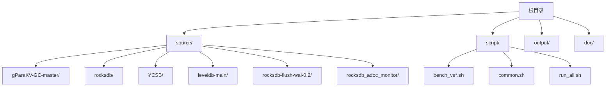
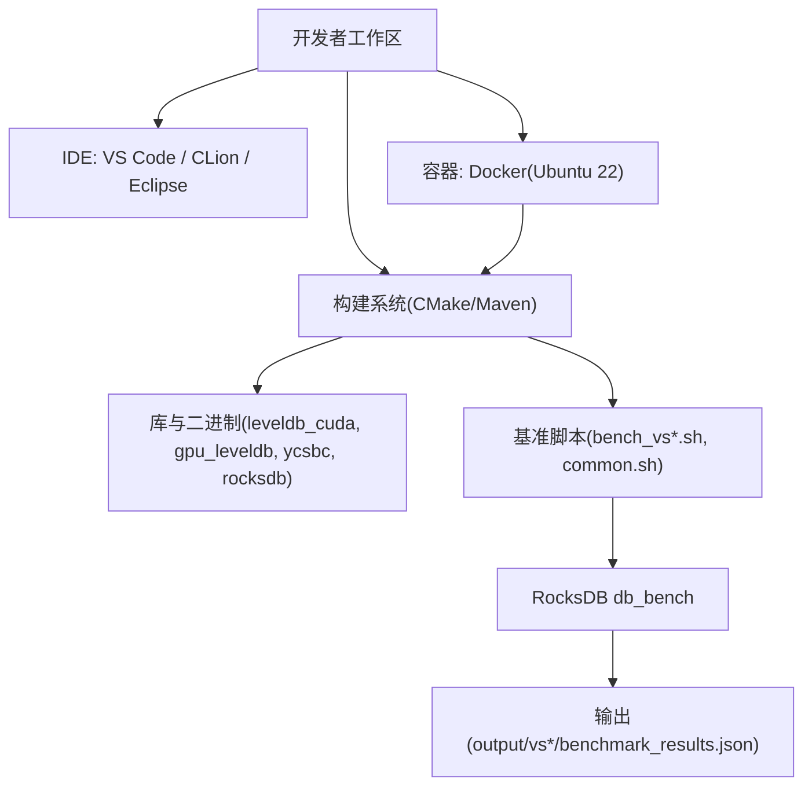
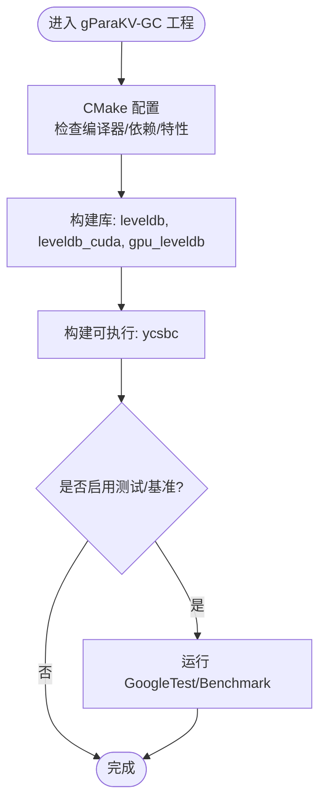
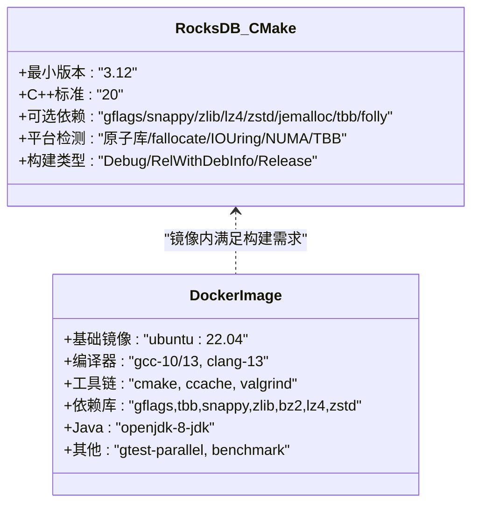
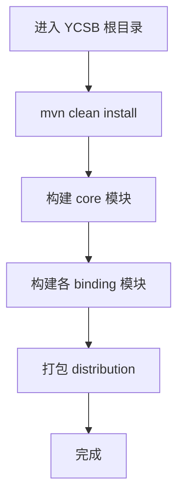
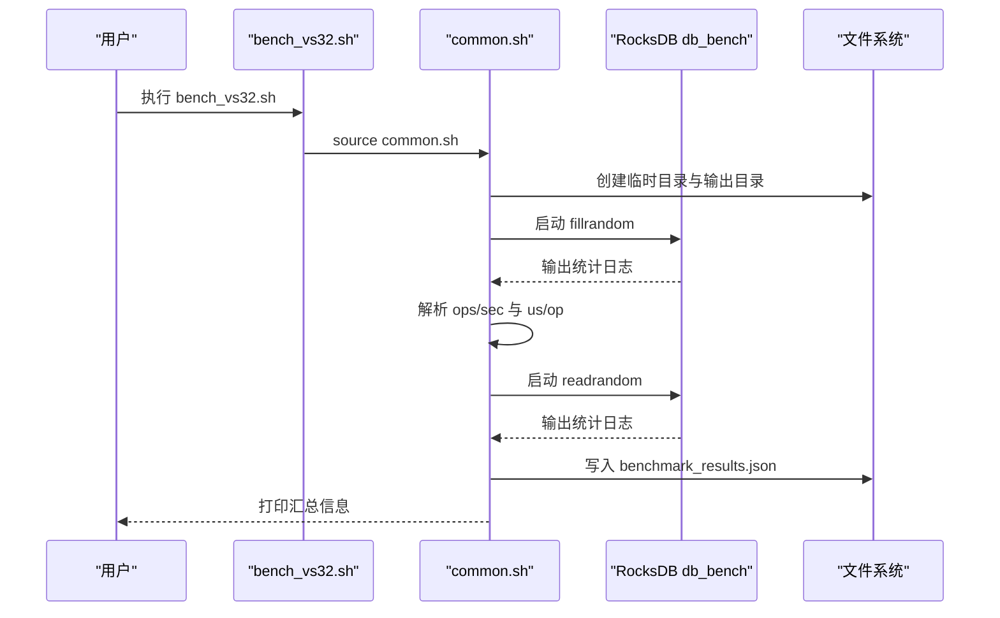

# 开发环境搭建

<cite>
**本文引用的文件**   
- [CMakeLists.txt](file://source/gParaKV-GC-master/CMakeLists.txt)
- [CMakeLists.txt](file://source/rocksdb/CMakeLists.txt)
- [Dockerfile](file://source/rocksdb/build_tools/ubuntu22_image/Dockerfile)
- [common.sh](file://script/common.sh)
- [bench_vs32.sh](file://script/bench_vs32.sh)
- [run_all.sh](file://script/run_all.sh)
- [pom.xml](file://source/YCSB/pom.xml)
</cite>

## 目录
1. [简介](#简介)
2. [项目结构](#项目结构)
3. [核心组件](#核心组件)
4. [架构总览](#架构总览)
5. [详细组件分析](#详细组件分析)
6. [依赖分析](#依赖分析)
7. [性能考虑](#性能考虑)
8. [故障排除指南](#故障排除指南)
9. [结论](#结论)
10. [附录：一键安装与环境验证](#附录一键安装与环境验证)

## 简介
本指南面向首次加入项目的开发者，目标是帮助你在最短时间内搭建可编译、可调试、可运行基准测试的完整开发环境。内容覆盖系统要求、编译器与工具链、CUDA Toolkit、Python、Java/Maven 环境配置；IDE（VS Code、CLion、Eclipse）推荐设置；构建与运行脚本说明；环境变量与路径设置；容器化方案；常见问题排查；以及一键安装脚本与环境验证方法。

## 项目结构
仓库包含三类关键内容：
- 源码与构建配置：基于 CMake 的 C++/CUDA 工程（gParaKV-GC 系列）、RocksDB 及其 Docker 镜像构建脚本、YCSB Java 工程（Maven）。
- 基准测试脚本：shell 脚本用于驱动 RocksDB db_bench 并输出结构化结果。
- 文档与输出：实验设计、报告与基准结果输出目录。

**图示来源** 
- [CMakeLists.txt](file://source/gParaKV-GC-master/CMakeLists.txt)
- [CMakeLists.txt](file://source/rocksdb/CMakeLists.txt)
- [Dockerfile](file://source/rocksdb/build_tools/ubuntu22_image/Dockerfile)
- [common.sh](file://script/common.sh)
- [bench_vs32.sh](file://script/bench_vs32.sh)
- [run_all.sh](file://script/run_all.sh)
- [pom.xml](file://source/YCSB/pom.xml)

**章节来源**
- [CMakeLists.txt](file://source/gParaKV-GC-master/CMakeLists.txt)
- [CMakeLists.txt](file://source/rocksdb/CMakeLists.txt)
- [Dockerfile](file://source/rocksdb/build_tools/ubuntu22_image/Dockerfile)
- [common.sh](file://script/common.sh)
- [bench_vs32.sh](file://script/bench_vs32.sh)
- [run_all.sh](file://script/run_all.sh)
- [pom.xml](file://source/YCSB/pom.xml)

## 核心组件
- gParaKV-GC 系列（C++/CUDA）：使用 CMake 构建，启用 CUDA 语言支持，目标架构与优化参数在 CMakeLists 中定义。
- RocksDB（C++）：CMake 构建，默认 C++20，提供多种可选依赖（压缩库、线程库等），并提供 Ubuntu 22 的 Docker 镜像构建脚本。
- YCSB（Java/Maven）：多模块 Maven 工程，包含大量数据库绑定模块。
- 基准脚本：通过 shell 脚本统一调用 RocksDB 的 db_bench，生成 JSON 结果。

**章节来源**
- [CMakeLists.txt](file://source/gParaKV-GC-master/CMakeLists.txt)
- [CMakeLists.txt](file://source/rocksdb/CMakeLists.txt)
- [pom.xml](file://source/YCSB/pom.xml)
- [common.sh](file://script/common.sh)
- [bench_vs32.sh](file://script/bench_vs32.sh)
- [run_all.sh](file://script/run_all.sh)

## 架构总览
下图展示了从“开发者机器”到“构建产物与运行”的整体流程，包括 C++/CUDA 工程、RocksDB、YCSB 以及基准脚本之间的关系。

**图示来源** 
- [CMakeLists.txt](file://source/gParaKV-GC-master/CMakeLists.txt)
- [CMakeLists.txt](file://source/rocksdb/CMakeLists.txt)
- [Dockerfile](file://source/rocksdb/build_tools/ubuntu22_image/Dockerfile)
- [common.sh](file://script/common.sh)
- [bench_vs32.sh](file://script/bench_vs32.sh)
- [run_all.sh](file://script/run_all.sh)
- [pom.xml](file://source/YCSB/pom.xml)

## 详细组件分析

### C++/CUDA 工程（gParaKV-GC 系列）
- 构建系统：CMake 最低版本要求 3.9，启用 C/C++/CUDA 语言。
- 标准与优化：C++17，CUDA 标志包含 -O3 -use_fast_math -lineinfo，目标 GPU 架构在 target 属性中指定。
- 依赖检测：自动探测 crc32c、snappy、tcmalloc、pthread 等，按需链接。
- 测试与基准：集成 GoogleTest 与 Google Benchmark，可按选项开启。
- 可执行目标：ycsbc 由 CMake 收集 ycsbc/*.cc 源并链接 gpu_leveldb（内部再链接 leveldb_cuda 与 leveldb）。

**图示来源** 
- [CMakeLists.txt](file://source/gParaKV-GC-master/CMakeLists.txt)

**章节来源**
- [CMakeLists.txt](file://source/gParaKV-GC-master/CMakeLists.txt)

### RocksDB 工程
- 构建系统：CMake 最低版本 3.12，默认 C++20，Linux 下启用 lld 加速链接（若可用）。
- 可选依赖：JeMalloc、gflags、Snappy、Zlib、Bzip2、Lz4、Zstd、NUMA、TBB、Folly 等，通过 CMake 选项控制。
- 平台特性：自动检测原子库、fallocate、pthread 自适应互斥、IOUring 等，并添加相应宏。
- 构建类型：Debug/RelWithDebInfo/Release，MSVC 与 GCC/Clang 分别有差异化编译选项。
- Docker 镜像：Ubuntu 22 基础镜像，预装 gcc/g++/clang、cmake、压缩库、OpenJDK 8、gtest-parallel、benchmark 等。

**图示来源** 
- [CMakeLists.txt](file://source/rocksdb/CMakeLists.txt)
- [Dockerfile](file://source/rocksdb/build_tools/ubuntu22_image/Dockerfile)

**章节来源**
- [CMakeLists.txt](file://source/rocksdb/CMakeLists.txt)
- [Dockerfile](file://source/rocksdb/build_tools/ubuntu22_image/Dockerfile)

### YCSB（Java/Maven）
- 构建系统：Maven 多模块工程，顶层 pom.xml 管理各子模块与依赖版本。
- Java 版本：编译器 source/target 设置为 1.8。
- 模块范围：core、distribution 与各数据库绑定模块（含 rocksdb 绑定）。
- 插件：maven-enforcer-plugin、maven-compiler-plugin、maven-checkstyle-plugin。

**图示来源** 
- [pom.xml](file://source/YCSB/pom.xml)

**章节来源**
- [pom.xml](file://source/YCSB/pom.xml)

### 基准脚本与数据流
- 入口脚本：bench_vs32.sh 等按 value_size 分派，统一调用 run_bench。
- 公共逻辑：common.sh 定义路径、解析输出、计算吞吐、采集硬件信息、采样 GPU、生成 JSON。
- 批量执行：run_all.sh 顺序执行多个 value_size 的基准。

**图示来源** 
- [bench_vs32.sh](file://script/bench_vs32.sh)
- [common.sh](file://script/common.sh)
- [run_all.sh](file://script/run_all.sh)

**章节来源**
- [bench_vs32.sh](file://script/bench_vs32.sh)
- [common.sh](file://script/common.sh)
- [run_all.sh](file://script/run_all.sh)

## 依赖分析
- 编译器与工具链：
  - C++/CUDA：CMake 3.9+，GCC/Clang，CUDA Toolkit（需与 CMake 和 nvcc 兼容）。
  - RocksDB：CMake 3.12+，C++20，建议 GCC>=11 或 Clang>=10。
- 第三方库（按需）：
  - 压缩：snappy、zlib、bz2、lz4、zstd。
  - 线程与内存：pthread、jemalloc、tbb。
  - 其他：gflags、folly、numa、liburing。
- Java/Maven：
  - JDK 8（YCSB 编译目标为 1.8）。
  - Maven 3.x（YCSB enforcer 限制特定版本区间）。
- Python：
  - 基准脚本主要使用 bash/awk/sed/bc，未强制 Python；如需运行 Python 脚本请确保 Python 3 可用。

**章节来源**
- [CMakeLists.txt](file://source/gParaKV-GC-master/CMakeLists.txt)
- [CMakeLists.txt](file://source/rocksdb/CMakeLists.txt)
- [pom.xml](file://source/YCSB/pom.xml)

## 性能考虑
- 构建阶段：
  - 使用 ccache 加速重复编译（RocksDB 已内置 ccache 发现逻辑）。
  - Linux 下启用 lld 链接器以显著缩短链接时间。
- 运行时：
  - RocksDB 可通过 jemalloc、io_uring、NUMA、TBB 等提升吞吐与延迟表现。
  - 基准脚本固定 key_size=20，value_size 可变，吞吐 MB/s 由 ops/sec 与 kv_size 计算得出。
- CUDA：
  - 针对 GPU 架构设置合适的 CUDA_ARCHITECTURES，避免不匹配导致回退或失败。

[本节为通用指导，无需具体文件引用]

## 故障排除指南
- CMake 找不到依赖库：
  - 确认相关开发包已安装（如 libsnappy-dev、zlib1g-dev、libbz2-dev、liblz4-dev、libzstd-dev、libgflags-dev、libtbb-dev）。
  - 检查 pkg-config 与 ldconfig 缓存是否正确更新。
- RocksDB 编译失败（C++20/编译器不兼容）：
  - 使用 Docker 镜像提供的 clang-13/gcc-13 环境，或升级系统工具链。
- CUDA 编译错误：
  - 确认 CUDA Toolkit 版本与 CMake 的 CUDA 支持匹配，检查 nvcc 是否在 PATH。
- 动态库加载失败（LD_LIBRARY_PATH）：
  - 确保 LD_LIBRARY_PATH 包含 RocksDB 构建输出目录与系统库路径。
- YCSB 构建失败（Maven/Java 版本）：
  - 确认 JDK 8 与 Maven 版本符合 enforcer 要求。
- 基准脚本无法解析输出：
  - 检查 db_bench 输出格式是否一致，确认 bc/awk/sed 可用。

**章节来源**
- [CMakeLists.txt](file://source/rocksdb/CMakeLists.txt)
- [Dockerfile](file://source/rocksdb/build_tools/ubuntu22_image/Dockerfile)
- [common.sh](file://script/common.sh)
- [pom.xml](file://source/YCSB/pom.xml)

## 结论
通过本指南，你可以快速搭建一个涵盖 C++/CUDA、RocksDB、YCSB 与基准脚本的完整开发环境。推荐使用 Docker 镜像保证一致性，结合 IDE 与构建系统的最佳实践，提高开发与调试效率。遇到问题时，优先对照依赖与版本要求，并使用脚本与日志定位问题。

[本节为总结性内容，无需具体文件引用]

## 附录：一键安装与环境验证

### 系统要求与建议
- 操作系统：Ubuntu 22.04（推荐，与 Docker 镜像一致）。
- 编译器：GCC 10/13 或 Clang 13（参考 Docker 镜像）。
- CMake：3.12+（RocksDB），3.9+（gParaKV-GC）。
- CUDA Toolkit：与 CMake 和 nvcc 兼容的版本（需根据 GPU 架构设置 CUDA_ARCHITECTURES）。
- Java：JDK 8（YCSB 编译目标 1.8）。
- Maven：3.x（YCSB enforcer 限制特定版本区间）。
- Python：3.x（如需运行 Python 脚本）。

### 依赖安装（Ubuntu 示例）
- 基本工具：git、wget、curl、vim、ccache、tzdata。
- 编译器与工具链：gcc、g++、clang、clang-tools、cmake。
- 压缩与线程库：libgflags-dev、libtbb-dev、libsnappy-dev、zlib1g-dev、libbz2-dev、liblz4-dev、libzstd-dev。
- OpenSSL：libssl-dev。
- OpenJDK 8：openjdk-8-jdk。
- 可选：valgrind、mingw-w64、gtest-parallel、benchmark。

**章节来源**
- [Dockerfile](file://source/rocksdb/build_tools/ubuntu22_image/Dockerfile)

### 构建步骤
- RocksDB：
  - 在源码目录创建 build 目录，执行 cmake .. 与 make -j。
  - 如需启用特定依赖，通过 -DWITH_* 选项配置。
- gParaKV-GC：
  - 在源码目录创建 build 目录，执行 cmake .. 与 make -j。
  - 确保 CUDA 工具链可用，必要时设置 CUDA_ARCHITECTURES。
- YCSB：
  - 在 source/YCSB 目录执行 mvn clean install。

**章节来源**
- [CMakeLists.txt](file://source/rocksdb/CMakeLists.txt)
- [CMakeLists.txt](file://source/gParaKV-GC-master/CMakeLists.txt)
- [pom.xml](file://source/YCSB/pom.xml)

### 环境变量与路径
- LD_LIBRARY_PATH：需包含 RocksDB 构建输出目录与系统库路径（例如 /usr/lib/x86_64-linux-gnu 与 rocksdb/build）。
- JAVA_HOME：指向 JDK 8 安装路径（参考 Docker 镜像中的设置）。
- PATH：确保 cmake、nvcc、java、mvn、python3 等命令可用。

**章节来源**
- [common.sh](file://script/common.sh)
- [Dockerfile](file://source/rocksdb/build_tools/ubuntu22_image/Dockerfile)

### 运行基准测试
- 单值大小基准：执行 script/bench_vs32.sh（或其他 bench_vs*.sh）。
- 全部基准：执行 script/run_all.sh，将顺序执行多个 value_size 的基准并输出 JSON 结果。

**章节来源**
- [bench_vs32.sh](file://script/bench_vs32.sh)
- [run_all.sh](file://script/run_all.sh)
- [common.sh](file://script/common.sh)

### 容器化部署（Docker）
- 使用 RocksDB 提供的 Ubuntu 22 镜像作为基础，复用其工具链与依赖。
- 在镜像内执行 RocksDB 与 gParaKV-GC 的构建，随后运行基准脚本。
- 可将 output 目录挂载到宿主机以便持久化结果。

**章节来源**
- [Dockerfile](file://source/rocksdb/build_tools/ubuntu22_image/Dockerfile)

### 常见环境问题与解决
- 找不到 CUDA 或 nvcc：
  - 检查 CUDA Toolkit 安装与 PATH 设置，确认 CMake 能检测到 CUDA。
- RocksDB 链接失败（缺少库）：
  - 安装对应开发包并更新 ldconfig；或在 CMake 中显式指定库路径。
- YCSB 编译失败（Java/Maven 版本）：
  - 切换至 JDK 8 与符合 enforcer 版本的 Maven。
- 基准脚本解析失败：
  - 检查 db_bench 输出格式与 bc/awk/sed 可用性。

**章节来源**
- [CMakeLists.txt](file://source/rocksdb/CMakeLists.txt)
- [common.sh](file://script/common.sh)
- [pom.xml](file://source/YCSB/pom.xml)

### 一键安装脚本与环境验证（建议）
- 建议编写一个统一的一键安装脚本，完成以下任务：
  - 检测并安装系统依赖（apt 包管理器）。
  - 安装编译器、CMake、CUDA Toolkit、JDK 8、Maven、Python 3。
  - 克隆源码并执行构建（RocksDB、gParaKV-GC、YCSB）。
  - 设置环境变量（LD_LIBRARY_PATH、JAVA_HOME、PATH）。
  - 运行一次基准测试并校验输出 JSON 是否存在。
- 环境验证方法：
  - 验证命令可用性：cmake --version、nvcc --version、java -version、mvn -v、python3 --version。
  - 验证 RocksDB 构建产物存在：ls rocksdb/build/db_bench。
  - 验证 gParaKV-GC 构建产物存在：ls gParaKV-GC-master/build/bin/ycsbc。
  - 验证 YCSB 构建产物存在：ls source/YCSB/target/*.jar。
  - 运行 bench_vs32.sh 并检查 output/vs32/benchmark_results.json 是否生成。

[本节为操作建议与验证流程，无需具体文件引用]