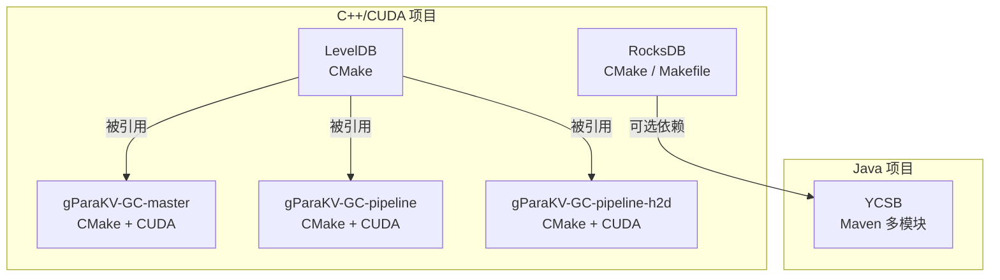
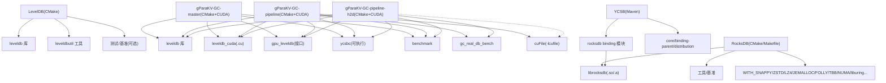
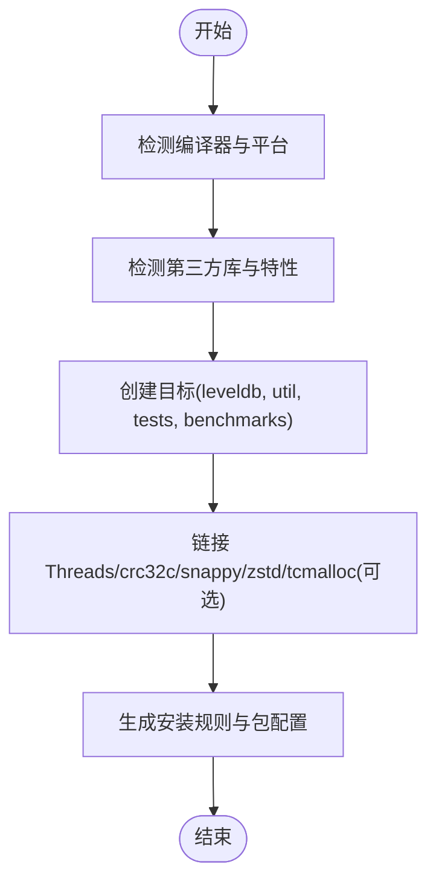
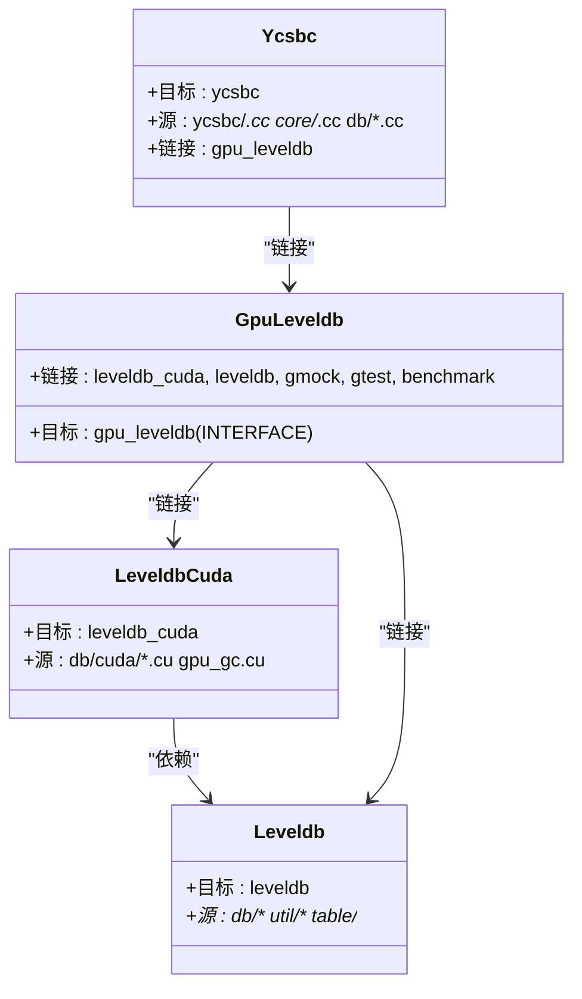
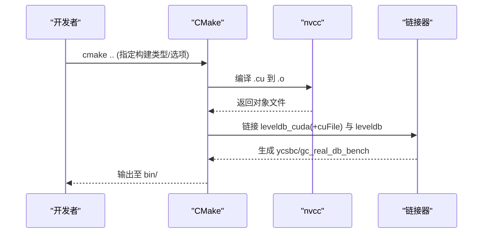
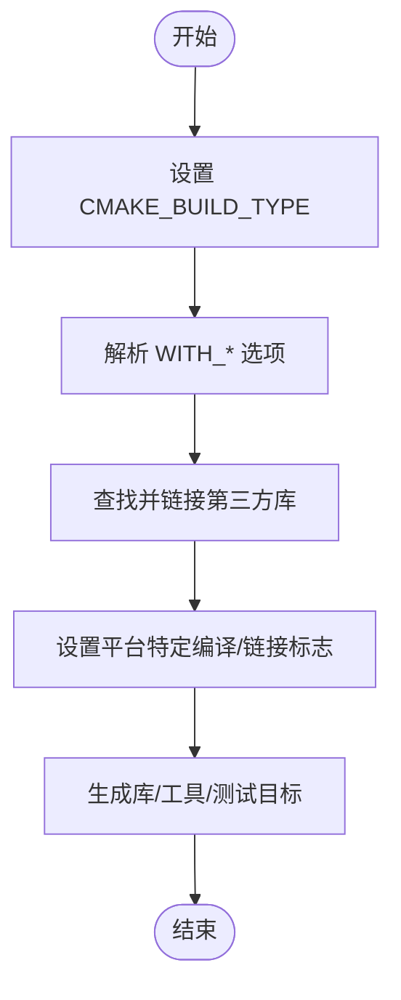
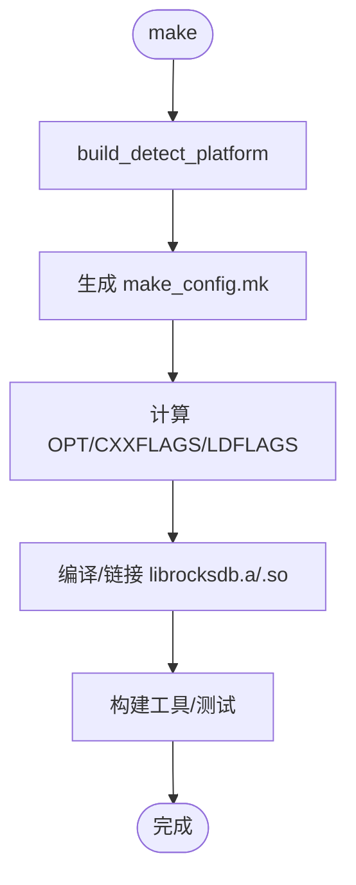
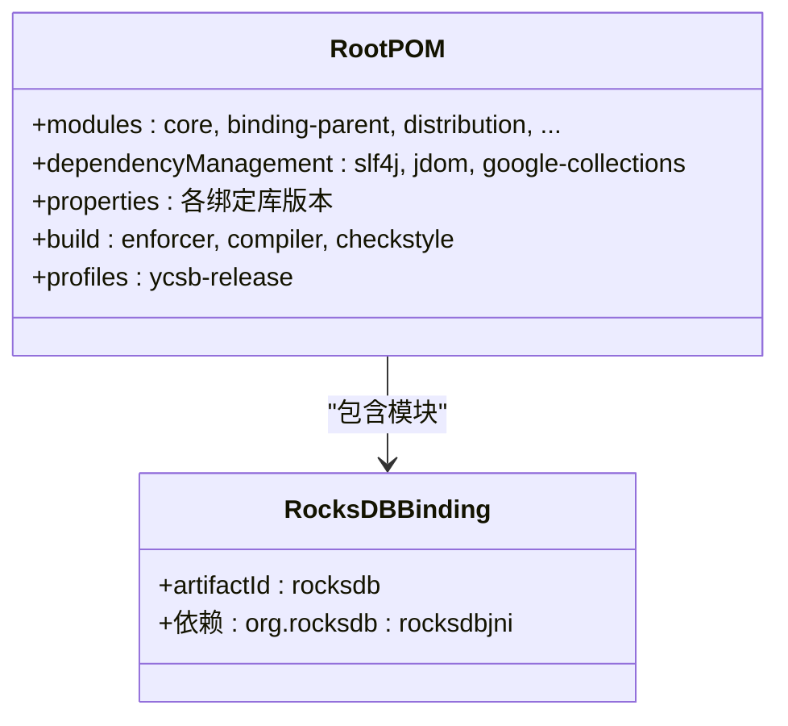
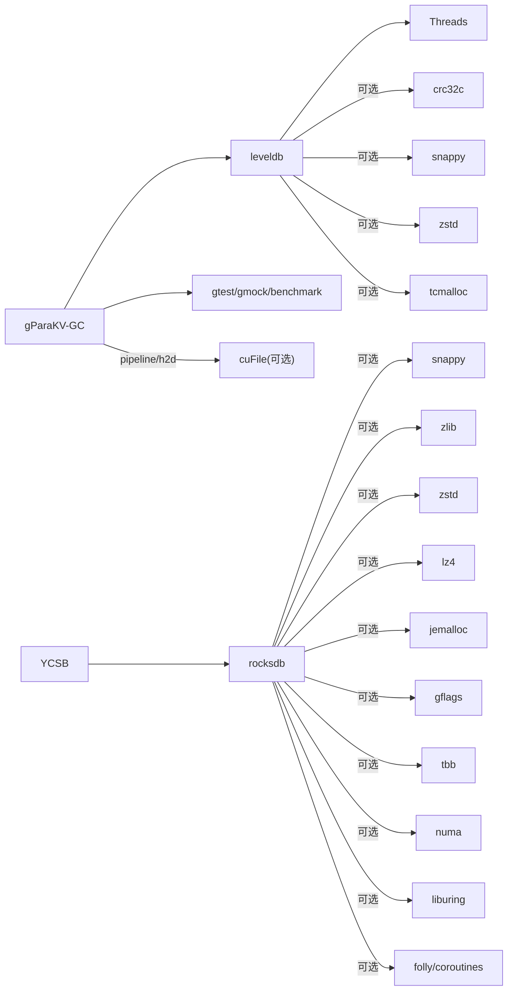

# 构建系统和配置

<cite>
**本文引用的文件**   
- [source/leveldb-main/CMakeLists.txt](file://source/leveldb-main/CMakeLists.txt)
- [source/gParaKV-GC-master/CMakeLists.txt](file://source/gParaKV-GC-master/CMakeLists.txt)
- [source/gParaKV-GC-pipeline/CMakeLists.txt](file://source/gParaKV-GC-pipeline/CMakeLists.txt)
- [source/gParaKV-GC-pipeline-h2d/CMakeLists.txt](file://source/gParaKV-GC-pipeline-h2d/CMakeLists.txt)
- [source/rocksdb/CMakeLists.txt](file://source/rocksdb/CMakeLists.txt)
- [source/rocksdb/Makefile](file://source/rocksdb/Makefile)
- [source/rocksdb/common.mk](file://source/rocksdb/common.mk)
- [source/rocksdb/src.mk](file://source/rocksdb/src.mk)
- [source/YCSB/pom.xml](file://source/YCSB/pom.xml)
- [source/gParaKV-GC-master/ycsbc/Makefile](file://source/gParaKV-GC-master/ycsbc/Makefile)
</cite>

## 目录
1. [简介](#简介)
2. [项目结构](#项目结构)
3. [核心组件](#核心组件)
4. [架构总览](#架构总览)
5. [详细组件分析](#详细组件分析)
6. [依赖关系分析](#依赖关系分析)
7. [性能考虑](#性能考虑)
8. [故障排除指南](#故障排除指南)
9. [结论](#结论)
10. [附录](#附录)

## 简介
本文件面向开发者，系统化说明本仓库的构建系统与配置，覆盖：
- CMake 构建系统结构与用法（依赖管理、编译选项、交叉编译）
- 第三方库集成（CUDA Toolkit、压缩库、网络库等）
- Maven 项目的构建配置（YCSB 模块编译与打包）
- Makefile 的使用与自定义规则
- 多平台构建指南（Linux、Windows、macOS）
- 构建优化与并行编译
- 常见构建问题与排错方法

目标是让开发者能够正确、高效地构建和配置项目。

## 项目结构
仓库包含多个子项目，分别使用不同的构建系统：
- LevelDB 原生版本：CMake 构建
- gParaKV-GC 系列（含 CUDA 扩展）：CMake + CUDA
- RocksDB：CMake 与 Makefile 双构建支持
- YCSB：Maven 多模块工程

图表来源
- [source/leveldb-main/CMakeLists.txt:1-120](file://source/leveldb-main/CMakeLists.txt#L1-L120)
- [source/gParaKV-GC-master/CMakeLists.txt:1-120](file://source/gParaKV-GC-master/CMakeLists.txt#L1-L120)
- [source/gParaKV-GC-pipeline/CMakeLists.txt:1-120](file://source/gParaKV-GC-pipeline/CMakeLists.txt#L1-L120)
- [source/gParaKV-GC-pipeline-h2d/CMakeLists.txt:1-120](file://source/gParaKV-GC-pipeline-h2d/CMakeLists.txt#L1-L120)
- [source/rocksdb/CMakeLists.txt:1-120](file://source/rocksdb/CMakeLists.txt#L1-L120)
- [source/YCSB/pom.xml:1-120](file://source/YCSB/pom.xml#L1-L120)

章节来源
- [source/leveldb-main/CMakeLists.txt:1-120](file://source/leveldb-main/CMakeLists.txt#L1-L120)
- [source/rocksdb/CMakeLists.txt:1-120](file://source/rocksdb/CMakeLists.txt#L1-L120)
- [source/YCSB/pom.xml:1-120](file://source/YCSB/pom.xml#L1-L120)

## 核心组件
- LevelDB（CMake）
  - 目标：leveldb 库、leveldbutil、测试与基准
  - 特性检测：crc32c、snappy、zstd、tcmalloc、fdatasync、O_CLOEXEC 等
  - 平台宏：LEVELDB_PLATFORM_WINDOWS/POSIX
  - 安装：导出 leveldb::leveldb 包配置
- gParaKV-GC 系列（CMake + CUDA）
  - 目标：leveldb、leveldb_cuda、gpu_leveldb（接口）、ycsbc、benchmark
  - CUDA：nvcc、CUDA_ARCHITECTURES、可分离编译
  - 链接 cuFile（pipeline/h2d 变体差异）
- RocksDB（CMake / Makefile）
  - CMake：大量 WITH_* 开关（Snappy、Zlib、Zstd、LZ4、Jemalloc、Folly、TBB、NUMA、liburing 等）
  - Makefile：DEBUG_LEVEL、LIB_MODE、USE_LTO、RTTI、ASan/TSan/UBSan
- YCSB（Maven）
  - 根 POM 定义模块、依赖版本、插件、发布 profile
  - rocksdb binding 模块通过 Maven 依赖管理

章节来源
- [source/leveldb-main/CMakeLists.txt:1-220](file://source/leveldb-main/CMakeLists.txt#L1-L220)
- [source/gParaKV-GC-master/CMakeLists.txt:1-220](file://source/gParaKV-GC-master/CMakeLists.txt#L1-L220)
- [source/gParaKV-GC-pipeline/CMakeLists.txt:1-220](file://source/gParaKV-GC-pipeline/CMakeLists.txt#L1-L220)
- [source/gParaKV-GC-pipeline-h2d/CMakeLists.txt:1-220](file://source/gParaKV-GC-pipeline-h2d/CMakeLists.txt#L1-L220)
- [source/rocksdb/CMakeLists.txt:1-220](file://source/rocksdb/CMakeLists.txt#L1-L220)
- [source/rocksdb/Makefile:1-200](file://source/rocksdb/Makefile#L1-L200)
- [source/YCSB/pom.xml:1-220](file://source/YCSB/pom.xml#L1-L220)

## 架构总览
下图展示各构建系统的目标与依赖关系，以及关键外部库的集成点。

图表来源
- [source/leveldb-main/CMakeLists.txt:120-220](file://source/leveldb-main/CMakeLists.txt#L120-L220)
- [source/gParaKV-GC-master/CMakeLists.txt:510-557](file://source/gParaKV-GC-master/CMakeLists.txt#L510-L557)
- [source/gParaKV-GC-pipeline/CMakeLists.txt:513-585](file://source/gParaKV-GC-pipeline/CMakeLists.txt#L513-L585)
- [source/gParaKV-GC-pipeline-h2d/CMakeLists.txt:513-579](file://source/gParaKV-GC-pipeline-h2d/CMakeLists.txt#L513-L579)
- [source/rocksdb/CMakeLists.txt:1-220](file://source/rocksdb/CMakeLists.txt#L1-L220)
- [source/YCSB/pom.xml:150-220](file://source/YCSB/pom.xml#L150-L220)

## 详细组件分析

### LevelDB 构建（CMake）
- 语言标准：C11、C++17
- 平台宏：WIN32/POSIX
- 特性检测：crc32c、snappy、zstd、tcmalloc、fdatasync、O_CLOEXEC、线程安全警告
- 目标：leveldb、leveldbutil、测试、基准
- 安装：导出 leveldb::leveldb 包配置，安装头文件

图表来源
- [source/leveldb-main/CMakeLists.txt:1-120](file://source/leveldb-main/CMakeLists.txt#L1-L120)
- [source/leveldb-main/CMakeLists.txt:270-320](file://source/leveldb-main/CMakeLists.txt#L270-L320)
- [source/leveldb-main/CMakeLists.txt:470-520](file://source/leveldb-main/CMakeLists.txt#L470-L520)

章节来源
- [source/leveldb-main/CMakeLists.txt:1-220](file://source/leveldb-main/CMakeLists.txt#L1-L220)

### gParaKV-GC-master 构建（CMake + CUDA）
- 语言标准：C17、C++17、CUDA
- CUDA 标志：-O3 -use_fast_math -lineinfo
- 目标：leveldb、leveldb_cuda、gpu_leveldb(接口)、ycsbc、benchmark
- 链接：Threads、可选 crc32c/snappy/tcmalloc；不强制链接 cuFile

图表来源
- [source/gParaKV-GC-master/CMakeLists.txt:510-557](file://source/gParaKV-GC-master/CMakeLists.txt#L510-L557)

章节来源
- [source/gParaKV-GC-master/CMakeLists.txt:1-220](file://source/gParaKV-GC-master/CMakeLists.txt#L1-L220)
- [source/gParaKV-GC-master/CMakeLists.txt:510-557](file://source/gParaKV-GC-master/CMakeLists.txt#L510-L557)

### gParaKV-GC-pipeline 构建（CMake + CUDA）
- 固定 nvcc 路径：/usr/local/cuda-13.0/bin/nvcc
- 链接 cuFile：-lcufile
- 新增 gc_real_db_bench 基准
- CUDA 架构：89

图表来源
- [source/gParaKV-GC-pipeline/CMakeLists.txt:513-585](file://source/gParaKV-GC-pipeline/CMakeLists.txt#L513-L585)

章节来源
- [source/gParaKV-GC-pipeline/CMakeLists.txt:1-220](file://source/gParaKV-GC-pipeline/CMakeLists.txt#L1-L220)
- [source/gParaKV-GC-pipeline/CMakeLists.txt:513-585](file://source/gParaKV-GC-pipeline/CMakeLists.txt#L513-L585)

### gParaKV-GC-pipeline-h2d 构建（CMake + CUDA）
- 与 pipeline 类似，但不链接 cuFile
- 其他目标一致：leveldb、leveldb_cuda、gpu_leveldb、ycsbc、gc_real_db_bench

章节来源
- [source/gParaKV-GC-pipeline-h2d/CMakeLists.txt:1-220](file://source/gParaKV-GC-pipeline-h2d/CMakeLists.txt#L1-L220)
- [source/gParaKV-GC-pipeline-h2d/CMakeLists.txt:513-579](file://source/gParaKV-GC-pipeline-h2d/CMakeLists.txt#L513-L579)

### RocksDB 构建（CMake）
- 语言标准：C++20
- 重要开关：WITH_SNAPPY、WITH_ZLIB、WITH_ZSTD、WITH_LZ4、WITH_JEMALLOC、WITH_GFLAGS、WITH_TBB、WITH_NUMA、WITH_LIBURING、USE_FOLLY/USE_COROUTINES
- 平台：Windows/MSVC、Linux/GCC/Clang、macOS/iOS、FreeBSD 等
- 构建类型：Debug/RelWithDebInfo/Release
- 快速链接：LLD（若可用）

图表来源
- [source/rocksdb/CMakeLists.txt:1-220](file://source/rocksdb/CMakeLists.txt#L1-L220)

章节来源
- [source/rocksdb/CMakeLists.txt:1-220](file://source/rocksdb/CMakeLists.txt#L1-L220)

### RocksDB 构建（Makefile）
- DEBUG_LEVEL：0/1/2（优化/调试级别）
- LIB_MODE：static/shared
- USE_LTO：链接时优化
- ASan/TSan/UBSan：运行时检查
- 平台检测：build_detect_platform -> make_config.mk

图表来源
- [source/rocksdb/Makefile:1-200](file://source/rocksdb/Makefile#L1-L200)
- [source/rocksdb/common.mk:1-31](file://source/rocksdb/common.mk#L1-L31)

章节来源
- [source/rocksdb/Makefile:1-200](file://source/rocksdb/Makefile#L1-L200)
- [source/rocksdb/common.mk:1-31](file://source/rocksdb/common.mk#L1-L31)

### YCSB 构建（Maven）
- 根 POM：定义模块、依赖版本、插件、发布 profile
- 模块：core、binding-parent、distribution、各 DB binding（含 rocksdb）
- Java 版本：1.8
- 发布：GPG 签名、源码与 javadoc 附件

图表来源
- [source/YCSB/pom.xml:1-220](file://source/YCSB/pom.xml#L1-L220)

章节来源
- [source/YCSB/pom.xml:1-220](file://source/YCSB/pom.xml#L1-L220)

### YCSB-C（Makefile）
- 简单 Makefile：编译 ycsbc，链接 leveldb 或 rocksdb（示例为 leveldb）
- 仅用于演示/轻量构建

章节来源
- [source/gParaKV-GC-master/ycsbc/Makefile:1-29](file://source/gParaKV-GC-master/ycsbc/Makefile#L1-L29)

## 依赖关系分析
- LevelDB
  - 可选：crc32c、snappy、zstd、tcmalloc
  - 必需：Threads
- gParaKV-GC 系列
  - 必需：leveldb、Threads、GoogleTest/Benchmark
  - 可选：cuFile（pipeline/h2d 差异）
- RocksDB
  - 可选：Snappy、Zlib、Zstd、LZ4、Jemalloc、GFlags、TBB、NUMA、liburing、Folly/Coroutines
- YCSB
  - 通过 Maven 依赖管理各绑定库版本

图表来源
- [source/leveldb-main/CMakeLists.txt:270-320](file://source/leveldb-main/CMakeLists.txt#L270-L320)
- [source/gParaKV-GC-master/CMakeLists.txt:510-557](file://source/gParaKV-GC-master/CMakeLists.txt#L510-L557)
- [source/gParaKV-GC-pipeline/CMakeLists.txt:513-585](file://source/gParaKV-GC-pipeline/CMakeLists.txt#L513-L585)
- [source/gParaKV-GC-pipeline-h2d/CMakeLists.txt:513-579](file://source/gParaKV-GC-pipeline-h2d/CMakeLists.txt#L513-L579)
- [source/rocksdb/CMakeLists.txt:1-220](file://source/rocksdb/CMakeLists.txt#L1-L220)
- [source/YCSB/pom.xml:1-220](file://source/YCSB/pom.xml#L1-L220)

章节来源
- [source/leveldb-main/CMakeLists.txt:270-320](file://source/leveldb-main/CMakeLists.txt#L270-L320)
- [source/rocksdb/CMakeLists.txt:1-220](file://source/rocksdb/CMakeLists.txt#L1-L220)
- [source/YCSB/pom.xml:1-220](file://source/YCSB/pom.xml#L1-L220)

## 性能考虑
- 通用优化
  - 使用 Release/RelWithDebInfo 构建类型
  - 启用 LTO（RocksDB Makefile 中 USE_LTO=1）
  - 合理设置 CPU 指令集（RocksDB PORTABLE/-march=native）
- 并行编译
  - CMake：ninja 或多核 make（-j）
  - MSBuild：/m 参数
- 缓存加速
  - ccache（RocksDB CMake 自动检测）
- CUDA 优化
  - -use_fast_math、-lineinfo、合适的 CUDA_ARCHITECTURES（如 89）
  - 可分离编译（CUDA_SEPARABLE_COMPILATION ON）

[本节为通用指导，无需具体文件来源]

## 故障排除指南
- CMake 找不到 CUDA 或 nvcc
  - 确认 CUDA 路径与 CMAKE_CUDA_COMPILER 设置
  - 参考 gParaKV-GC-pipeline 中对 nvcc 的路径设置
- 缺少第三方库（snappy/zstd/lz4/jemalloc/folly）
  - RocksDB：开启对应 WITH_* 选项并确保 find_package 成功
  - LevelDB：确保库在默认搜索路径或通过 CMake 变量提供
- 链接错误（cuFile 未找到）
  - gParaKV-GC-pipeline 显式链接 -lcuFile；h2d 版本不链接
- Windows/MSVC 构建问题
  - 使用 Developer Command Prompt
  - 调整 RUNTIME_LIBRARY（MD/MT）与 RTTI 设置
- YCSB 构建失败
  - 确认 Maven 版本满足要求（enforcer 插件限制）
  - 检查 Java 版本（1.8）与网络代理（下载依赖）

章节来源
- [source/gParaKV-GC-pipeline/CMakeLists.txt:513-585](file://source/gParaKV-GC-pipeline/CMakeLists.txt#L513-L585)
- [source/rocksdb/CMakeLists.txt:1-220](file://source/rocksdb/CMakeLists.txt#L1-L220)
- [source/YCSB/pom.xml:220-335](file://source/YCSB/pom.xml#L220-L335)

## 结论
本项目采用多构建系统协同工作：CMake 主导 C++/CUDA 组件，Makefile 提供 RocksDB 的便捷构建，Maven 管理 YCSB 的 Java 生态。通过合理的依赖管理与编译选项，可在 Linux/Windows/macOS 上稳定构建。建议优先使用 CMake 进行统一构建，结合 ccache/LTO 提升效率，并根据目标平台与硬件选择合适优化参数。

[本节为总结性内容，无需具体文件来源]

## 附录

### 多平台构建要点
- Linux
  - CMake：默认 GCC/Clang，推荐 ninja
  - RocksDB：可使用 lld 加速链接
- Windows
  - 使用 Visual Studio 2019+，Developer Command Prompt
  - 注意 UTF-8 文件名选项（ROCKSDB_WINDOWS_UTF8_FILENAMES）
- macOS
  - 注意 CMAKE_SYSTEM_PROCESSOR 与 CMAKE_OSX_ARCHITECTURES 的一致性

章节来源
- [source/rocksdb/CMakeLists.txt:1-120](file://source/rocksdb/CMakeLists.txt#L1-L120)

### 常用命令速查
- LevelDB
  - cmake .. && make -j
- gParaKV-GC
  - 指定 CUDA 路径后 cmake .. && make -j
- RocksDB
  - CMake：cmake .. && make -j
  - Makefile：make -j（可通过 DEBUG_LEVEL/LIB_MODE 控制）
- YCSB
  - mvn clean install -DskipTests

[本节为通用指导，无需具体文件来源]