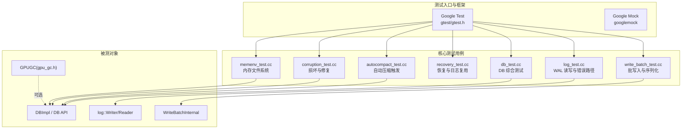
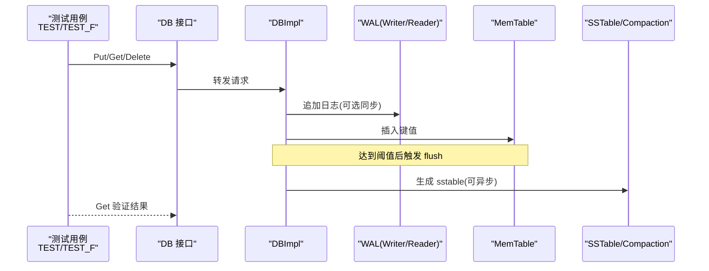
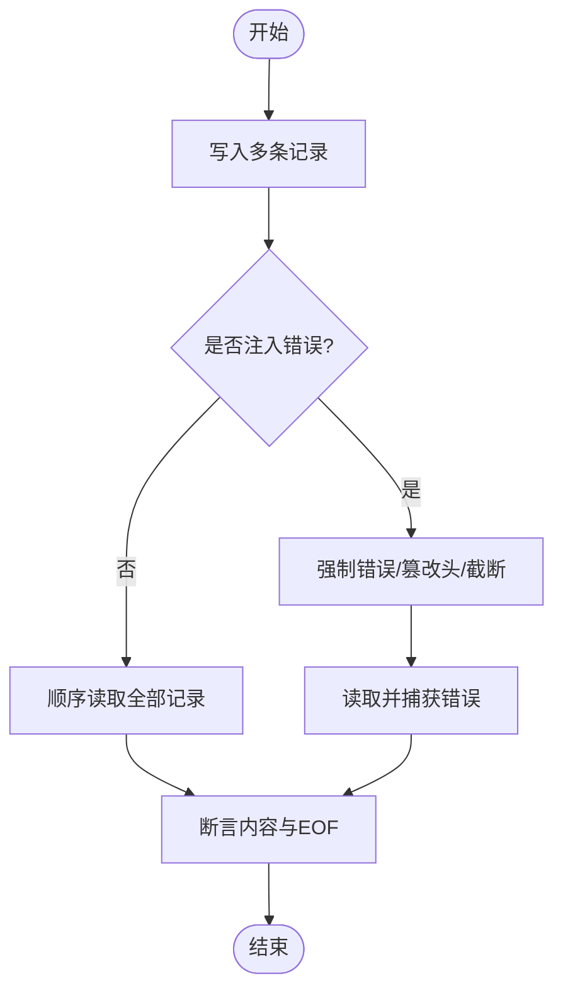
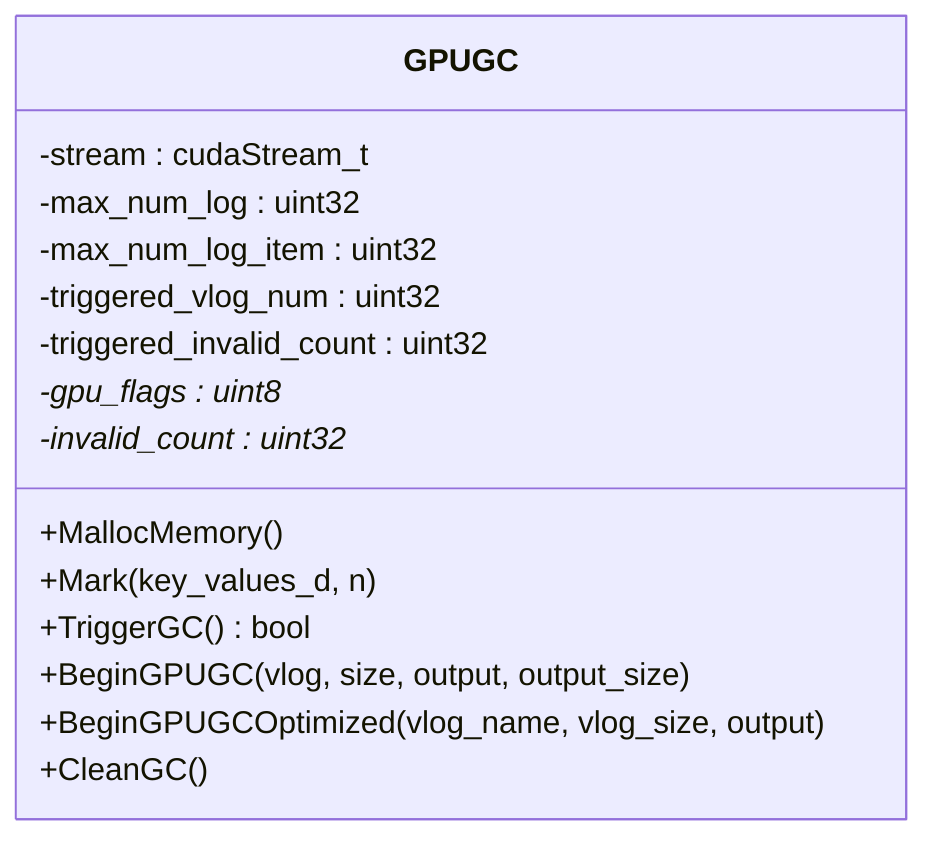
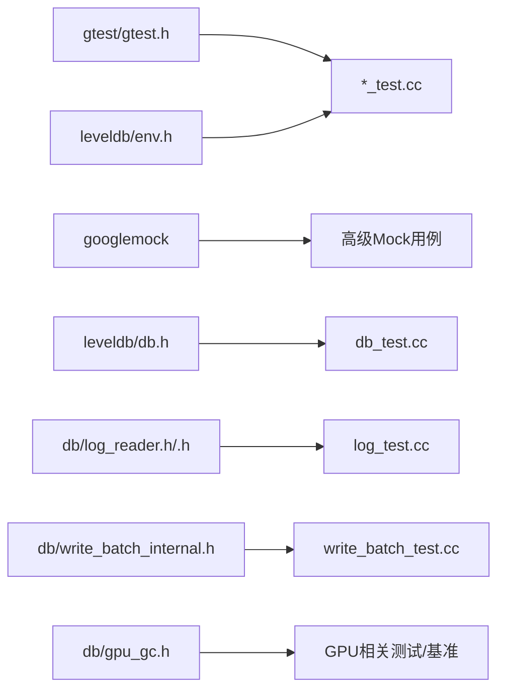

# 单元测试

<cite>
**本文引用的文件**   
- [db_test.cc](file://source/gParaKV-GC-master/db/db_test.cc)
- [log_test.cc](file://source/gParaKV-GC-master/db/log_test.cc)
- [write_batch_test.cc](file://source/gParaKV-GC-master/db/write_batch_test.cc)
- [recovery_test.cc](file://source/gParaKV-GC-master/db/recovery_test.cc)
- [gpu_gc.h](file://source/gParaKV-GC-master/db/gpu_gc.h)
- [autocompact_test.cc](file://source/gParaKV-GC-master/db/autocompact_test.cc)
- [corruption_test.cc](file://source/gParaKV-GC-master/db/corruption_test.cc)
- [memenv_test.cc](file://source/gParaKV-GC-master/helpers/memenv/memenv_test.cc)
- [gmock-spec-builders.cc](file://source/gParaKV-GC-master/third_party/googletest/googlemock/src/gmock-spec-builders.cc)
</cite>

## 目录
1. [简介](#简介)
2. [项目结构](#项目结构)
3. [核心组件](#核心组件)
4. [架构总览](#架构总览)
5. [详细组件分析](#详细组件分析)
6. [依赖关系分析](#依赖关系分析)
7. [性能考虑](#性能考虑)
8. [故障排查指南](#故障排查指南)
9. [结论](#结论)
10. [附录](#附录)

## 简介
本文件面向本项目（基于 LevelDB/gParaKV-GC 的存储引擎）的单元测试实践，系统阐述 Google Test 框架的使用规范、断言方法、测试夹具与 Mock/Stub 使用方式，并给出 WAL 操作、Flush 功能、GPU 加速功能的测试示例与最佳实践。同时提供测试环境搭建步骤（数据准备、数据库初始化、资源清理）、覆盖率工具链（gcov/lcov）及报告生成流程，以及常见场景调试技巧。

## 项目结构
仓库包含多个子工程与测试用例：
- gParaKV-GC-master：LevelDB 增强版，含大量 C++ 单元测试（gtest），涵盖 DB、Log、WriteBatch、Recovery、MemEnv 等模块
- rocksdb-flush-wal-0.2：RocksDB 分支，包含 Flush/WAL 相关能力与基准脚本
- 其他：YCSB 绑定、benchmark 脚本等

测试组织方式以“按模块划分”为主，每个子系统拥有独立的 *_test.cc 文件，便于定位与运行。

图表来源 
- [db_test.cc:1-120](file://source/gParaKV-GC-master/db/db_test.cc#L1-L120)
- [log_test.cc:1-60](file://source/gParaKV-GC-master/db/log_test.cc#L1-L60)
- [write_batch_test.cc:1-40](file://source/gParaKV-GC-master/db/write_batch_test.cc#L1-L40)
- [recovery_test.cc:1-60](file://source/gParaKV-GC-master/db/recovery_test.cc#L1-L60)
- [autocompact_test.cc:1-120](file://source/gParaKV-GC-master/db/autocompact_test.cc#L1-L120)
- [corruption_test.cc:1-120](file://source/gParaKV-GC-master/db/corruption_test.cc#L1-L120)
- [memenv_test.cc:1-60](file://source/gParaKV-GC-master/helpers/memenv/memenv_test.cc#L1-L60)
- [gpu_gc.h:1-53](file://source/gParaKV-GC-master/db/gpu_gc.h#L1-L53)

章节来源
- [db_test.cc:1-120](file://source/gParaKV-GC-master/db/db_test.cc#L1-L120)
- [log_test.cc:1-60](file://source/gParaKV-GC-master/db/log_test.cc#L1-L60)
- [write_batch_test.cc:1-40](file://source/gParaKV-GC-master/db/write_batch_test.cc#L1-L40)
- [recovery_test.cc:1-60](file://source/gParaKV-GC-master/db/recovery_test.cc#L1-L60)

## 核心组件
- Google Test 基础
  - 测试宏：TEST、TEST_F
  - 断言：ASSERT_*（失败即终止当前测试）、EXPECT_*（失败继续执行）
  - 测试夹具：继承 testing::Test，构造/析构中完成环境准备与清理
- Google Mock
  - MOCK_METHOD/MOCK_METHODn 定义模拟方法
  - EXPECT_CALL/ON_CALL 设置调用期望与默认行为
  - 内部实现参考 googlemock/spec-builders 中的注册与匹配逻辑

章节来源
- [db_test.cc:1-120](file://source/gParaKV-GC-master/db/db_test.cc#L1-L120)
- [log_test.cc:1-60](file://source/gParaKV-GC-master/db/log_test.cc#L1-L60)
- [write_batch_test.cc:1-40](file://source/gParaKV-GC-master/db/write_batch_test.cc#L1-L40)
- [recovery_test.cc:1-60](file://source/gParaKV-GC-master/db/recovery_test.cc#L1-L60)
- [gmock-spec-builders.cc:1-120](file://source/gParaKV-GC-master/third_party/googletest/googlemock/src/gmock-spec-builders.cc#L1-L120)

## 架构总览
下图展示测试驱动被测对象的典型调用链：测试通过 DB API 发起 Put/Get/Delete，底层经 MemTable、WAL、Compaction、SSTable 等阶段；Log 层由 Writer/Reader 负责持久化记录；WriteBatch 用于批量写入；Recovery 保证崩溃恢复一致性。

图表来源 
- [db_test.cc:230-340](file://source/gParaKV-GC-master/db/db_test.cc#L230-L340)
- [log_test.cc:160-240](file://source/gParaKV-GC-master/db/log_test.cc#L160-L240)
- [write_batch_test.cc:14-52](file://source/gParaKV-GC-master/db/write_batch_test.cc#L14-L52)

## 详细组件分析

### 测试夹具与断言规范（TEST_F 与 ASSERT_*/EXPECT_*）
- 使用 TEST_F 创建基于夹具的测试，夹具内封装 DB 打开/关闭、选项切换、临时目录管理
- 常用断言：
  - ASSERT_LEVELDB_OK：对 Status 进行成功断言
  - ASSERT_EQ/ASSERT_TRUE/ASSERT_LT/ASSERT_GE：数值与布尔断言
  - EXPECT_*：非致命断言，常用于中间状态检查
- 推荐模式：
  - 在夹具构造函数中创建临时目录并销毁旧库
  - 在析构函数中释放资源、删除目录
  - 通过 ChangeOptions/Reopen 组合覆盖多配置场景

章节来源
- [db_test.cc:231-340](file://source/gParaKV-GC-master/db/db_test.cc#L231-L340)
- [db_test.cc:542-578](file://source/gParaKV-GC-master/db/db_test.cc#L542-L578)
- [log_test.cc:39-110](file://source/gParaKV-GC-master/db/log_test.cc#L39-L110)
- [write_batch_test.cc:54-87](file://source/gParaKV-GC-master/db/write_batch_test.cc#L54-L87)
- [recovery_test.cc:18-63](file://source/gParaKV-GC-master/db/recovery_test.cc#L18-L63)

### WAL 操作测试（Log Reader/Writer）
- 目标：验证日志记录的写入、读取、分片、校验、错误路径
- 关键要点：
  - 使用自定义 WritableFile/SequentialFile 将日志写入内存缓冲区
  - 注入错误（如截断、CRC 不匹配、类型异常）以覆盖错误路径
  - 初始偏移读取与跨块边界处理
- 典型用例：
  - 空日志、顺序读写、碎片化、超长记录、末尾对齐、追加打开、随机读写
  - 读错误、坏类型、长度错误、校验失败、不完整记录处理

图表来源 
- [log_test.cc:160-240](file://source/gParaKV-GC-master/db/log_test.cc#L160-L240)
- [log_test.cc:261-340](file://source/gParaKV-GC-master/db/log_test.cc#L261-L340)
- [log_test.cc:364-448](file://source/gParaKV-GC-master/db/log_test.cc#L364-L448)

章节来源
- [log_test.cc:1-120](file://source/gParaKV-GC-master/db/log_test.cc#L1-L120)
- [log_test.cc:261-340](file://source/gParaKV-GC-master/db/log_test.cc#L261-L340)
- [log_test.cc:364-448](file://source/gParaKV-GC-master/db/log_test.cc#L364-L448)

### Flush 功能测试
- 目标：验证 MemTable 到 SSTable 的刷新过程、属性查询、层级分布
- 关键要点：
  - 通过 TEST_CompactMemTable 触发手动刷盘
  - 使用属性接口查询各层级文件数、近似内存占用
  - 结合特殊 Env 控制 Sync 行为（延迟/报错）以模拟 I/O 压力
- 典型用例：
  - 多次 Put 后 Compact 并验证数据可见性
  - 检查不同层级文件数量与总表数
  - 内存使用上限断言

章节来源
- [db_test.cc:407-450](file://source/gParaKV-GC-master/db/db_test.cc#L407-L450)
- [db_test.cc:619-628](file://source/gParaKV-GC-master/db/db_test.cc#L619-L628)
- [autocompact_test.cc:65-103](file://source/gParaKV-GC-master/db/autocompact_test.cc#L65-L103)

### GPU 加速功能测试（GPUGC）
- 目标：验证 GPU 端垃圾回收流程（标记、触发、清理）
- 关键要点：
  - GPUGC 类暴露 MallocMemory、Mark、TriggerGC、BeginGPUGC/CleanGC 等方法
  - 测试需准备 GPU 上下文与流，确保设备内存分配与内核调用可用
  - 可通过 CPU 侧统计字段（如 invalid_count、triggered_vlog_num）验证行为
- 建议用例：
  - 分配 GPU 内存后 Mark 一批 KV，触发 GC 并检查无效计数增长
  - 清理资源并断言无泄漏

图表来源 
- [gpu_gc.h:18-53](file://source/gParaKV-GC-master/db/gpu_gc.h#L18-L53)

章节来源
- [gpu_gc.h:1-53](file://source/gParaKV-GC-master/db/gpu_gc.h#L1-L53)

### 批写入测试（WriteBatch）
- 目标：验证批写入的序列化、计数、大小估算、拼接与解析
- 关键要点：
  - 使用 WriteBatchInternal 获取序列号、内容切片、插入到 MemTable
  - 断言 Count、ApproximateSize、Append 后的顺序与计数
  - 模拟损坏数据（截断）以验证解析错误路径

章节来源
- [write_batch_test.cc:14-52](file://source/gParaKV-GC-master/db/write_batch_test.cc#L14-L52)
- [write_batch_test.cc:54-130](file://source/gParaKV-GC-master/db/write_batch_test.cc#L54-L130)

### 恢复与一致性测试（Recovery）
- 目标：验证 Manifest/Log 复用、多日志文件恢复、缺失文件处理
- 关键要点：
  - 通过 OpenWithStatus/Close/RemoveLogFiles/RemoveManifestFile 构造多种恢复场景
  - 断言恢复后数据一致性与文件数量变化
  - 支持 reuse_logs 与 create_if_missing 选项组合

章节来源
- [recovery_test.cc:18-63](file://source/gParaKV-GC-master/db/recovery_test.cc#L18-L63)
- [recovery_test.cc:161-208](file://source/gParaKV-GC-master/db/recovery_test.cc#L161-L208)
- [recovery_test.cc:219-323](file://source/gParaKV-GC-master/db/recovery_test.cc#L219-L323)

### 损坏与修复测试（Corruption）
- 目标：验证在 I/O 错误、文件损坏、权限问题等异常下的健壮性
- 关键要点：
  - 通过 SpecialEnv 注入 no_space、non_writable、sync_error 等
  - 断言错误码与重试/修复路径（RepairDB）
  - 验证写失败计数与最小预期值

章节来源
- [db_test.cc:101-229](file://source/gParaKV-GC-master/db/db_test.cc#L101-L229)
- [corruption_test.cc:49-156](file://source/gParaKV-GC-master/db/corruption_test.cc#L49-L156)
- [corruption_test.cc:207-273](file://source/gParaKV-GC-master/db/corruption_test.cc#L207-L273)

### 内存文件系统测试（MemEnv）
- 目标：验证基于内存的文件系统行为，避免真实磁盘依赖
- 关键要点：
  - 使用 memenv 替代默认 Env，简化测试环境
  - 断言文件读写、删除、重命名等行为

章节来源
- [memenv_test.cc:1-60](file://source/gParaKV-GC-master/helpers/memenv/memenv_test.cc#L1-L60)

## 依赖关系分析
- 测试与框架
  - 所有 *_test.cc 均依赖 gtest/gtest.h
  - Google Mock 位于 third_party/googletest/googlemock，用于高级 Mock 场景
- 被测模块
  - db_test.cc 依赖 DB、DBImpl、Env、Cache、FilterPolicy、Table、util/testutil
  - log_test.cc 依赖 log::Writer/Reader、Env、util/coding、crc32c、random
  - write_batch_test.cc 依赖 MemTable、WriteBatchInternal、leveldb/db/env
  - recovery_test.cc 依赖 DBImpl、filename、version_set、write_batch_internal
  - gpu_gc.h 为 GPU 模块接口，供上层集成测试或基准使用

图表来源 
- [db_test.cc:1-26](file://source/gParaKV-GC-master/db/db_test.cc#L1-L26)
- [log_test.cc:1-12](file://source/gParaKV-GC-master/db/log_test.cc#L1-L12)
- [write_batch_test.cc:1-10](file://source/gParaKV-GC-master/db/write_batch_test.cc#L1-L10)
- [recovery_test.cc:1-14](file://source/gParaKV-GC-master/db/recovery_test.cc#L1-L14)
- [gpu_gc.h:1-15](file://source/gParaKV-GC-master/db/gpu_gc.h#L1-L15)

章节来源
- [db_test.cc:1-26](file://source/gParaKV-GC-master/db/db_test.cc#L1-L26)
- [log_test.cc:1-12](file://source/gParaKV-GC-master/db/log_test.cc#L1-L12)
- [write_batch_test.cc:1-10](file://source/gParaKV-GC-master/db/write_batch_test.cc#L1-L10)
- [recovery_test.cc:1-14](file://source/gParaKV-GC-master/db/recovery_test.cc#L1-L14)
- [gpu_gc.h:1-15](file://source/gParaKV-GC-master/db/gpu_gc.h#L1-L15)

## 性能考虑
- 测试隔离与稳定性
  - 使用 TempDir 与 DestroyDB 确保每次测试独立环境
  - 通过 SpecialEnv 控制 I/O 行为，避免真实磁盘抖动影响时序
- 大数据量与边界条件
  - 使用循环写入与随机数据覆盖长尾路径
  - 针对块边界、对齐、尾部填充等场景设计用例
- 资源管理
  - 显式释放迭代器、快照、文件句柄
  - 在析构中统一清理，防止资源泄漏导致后续测试污染

[本节为通用指导，无需特定文件引用]

## 故障排查指南
- 常见问题
  - 断言失败但测试未终止：确认使用了 ASSERT_* 而非 EXPECT_*
  - 环境不一致：检查夹具构造/析构是否正确初始化/清理
  - I/O 错误路径未覆盖：通过 SpecialEnv/ForceError 注入错误
  - GPU 相关失败：确认 CUDA 环境、流与设备内存分配
- 调试技巧
  - 打印中间状态（Contents、IterStatus、FilesPerLevel）
  - 缩小复现范围（减少数据量、禁用压缩）
  - 使用单测过滤（gtest 过滤器）快速定位问题

章节来源
- [db_test.cc:101-229](file://source/gParaKV-GC-master/db/db_test.cc#L101-L229)
- [log_test.cc:364-448](file://source/gParaKV-GC-master/db/log_test.cc#L364-L448)
- [corruption_test.cc:207-273](file://source/gParaKV-GC-master/db/corruption_test.cc#L207-L273)

## 结论
本项目采用 Google Test 构建完善的单元测试体系，覆盖 DB、WAL、WriteBatch、Recovery、GPU 等关键模块。通过夹具、断言、Mock/Stub、特殊 Env 等手段，有效保障功能正确性与鲁棒性。建议在新增特性时同步补充对应测试，并结合覆盖率工具持续改进质量。

[本节为总结，无需特定文件引用]

## 附录

### 测试环境搭建步骤
- 前置依赖
  - 安装 Google Test/Google Mock（third_party 已包含）
  - 如需 GPU 测试，安装 CUDA 工具链并确保驱动可用
- 编译与运行
  - 使用 CMake/Make 构建测试目标（如 db_test、log_test、write_batch_test、recovery_test）
  - 直接运行可执行文件或通过脚本批量执行
- 数据与环境
  - 使用 testing::TempDir 创建临时目录
  - 通过 DestroyDB 清理历史数据
  - 使用 memenv 替代真实文件系统以减少外部依赖

[本节为通用指导，无需特定文件引用]

### 覆盖率要求与报告生成（gcov/lcov）
- 编译选项
  - 添加 -fprofile-arcs -ftest-coverage（GCC）或等价 Clang 选项
  - 链接时需包含 gcov 运行时库
- 执行测试
  - 运行测试二进制，生成 *.gcda/*.gcno 覆盖率数据
- 生成报告
  - 使用 lcov 收集数据：lcov --capture --directory . --output-file coverage.info
  - 生成 HTML 报告：genhtml coverage.info --output-directory coverage_html
- 覆盖率指标
  - 行覆盖率、分支覆盖率、函数覆盖率
  - 建议设定最低阈值（如行覆盖率≥80%）并纳入 CI

[本节为通用指导，无需特定文件引用]

### Mock/Stub 使用指南（Google Mock）
- 定义 Mock 类
  - 使用 MOCK_METHOD/MOCK_METHODn 声明虚方法
- 设置期望
  - ON_CALL 设置默认行为
  - EXPECT_CALL 设置调用次数、参数匹配、返回值
- 验证与断言
  - 测试结束时自动验证期望是否满足
  - 结合 EXPECT_* 进行额外状态检查

章节来源
- [gmock-spec-builders.cc:1-120](file://source/gParaKV-GC-master/third_party/googletest/googlemock/src/gmock-spec-builders.cc#L1-L120)

### 具体测试示例清单（路径指引）
- WAL 操作测试
  - 读写与错误路径：[log_test.cc:261-340](file://source/gParaKV-GC-master/db/log_test.cc#L261-L340)、[log_test.cc:364-448](file://source/gParaKV-GC-master/db/log_test.cc#L364-L448)
- Flush 功能测试
  - 手动刷盘与属性查询：[db_test.cc:407-450](file://source/gParaKV-GC-master/db/db_test.cc#L407-L450)、[db_test.cc:619-628](file://source/gParaKV-GC-master/db/db_test.cc#L619-L628)
- GPU 加速功能测试
  - GPUGC 接口与统计：[gpu_gc.h:18-53](file://source/gParaKV-GC-master/db/gpu_gc.h#L18-L53)
- 批写入测试
  - 序列化与大小估算：[write_batch_test.cc:54-130](file://source/gParaKV-GC-master/db/write_batch_test.cc#L54-L130)
- 恢复与一致性测试
  - 日志复用与多文件恢复：[recovery_test.cc:161-208](file://source/gParaKV-GC-master/db/recovery_test.cc#L161-L208)、[recovery_test.cc:219-323](file://source/gParaKV-GC-master/db/recovery_test.cc#L219-L323)
- 损坏与修复测试
  - I/O 错误注入与修复：[corruption_test.cc:49-156](file://source/gParaKV-GC-master/db/corruption_test.cc#L49-L156)、[corruption_test.cc:207-273](file://source/gParaKV-GC-master/db/corruption_test.cc#L207-L273)