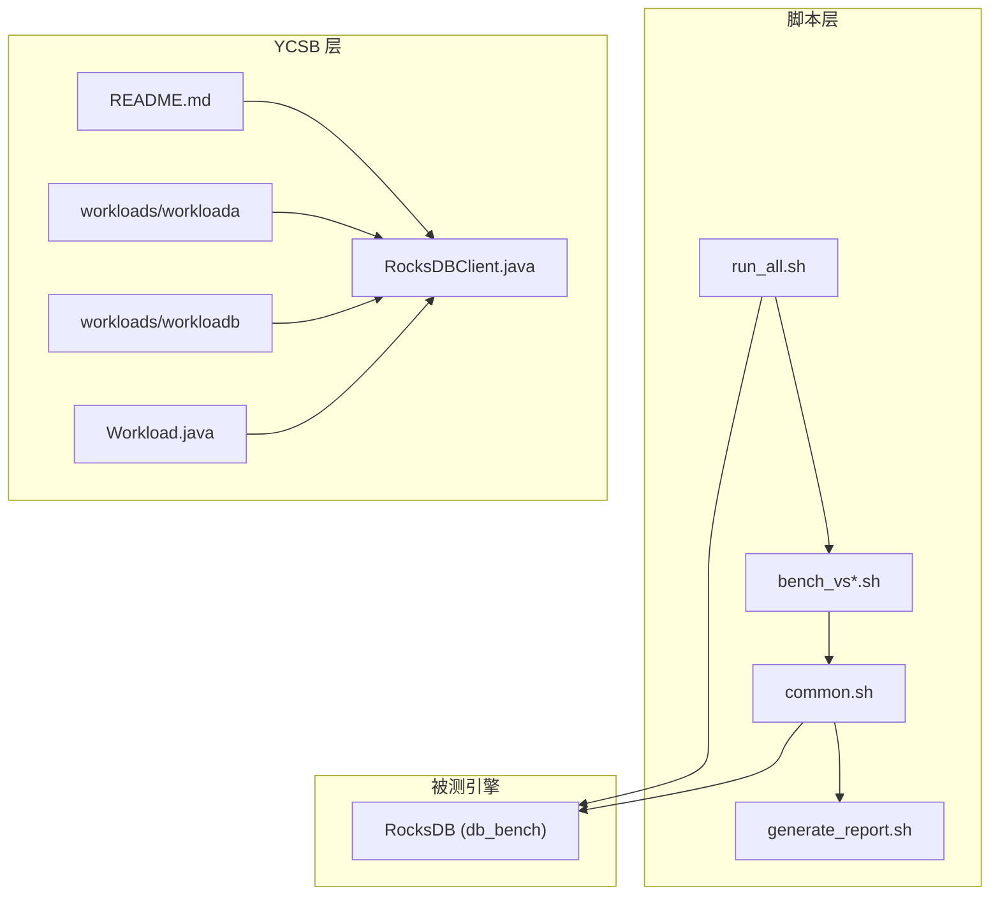
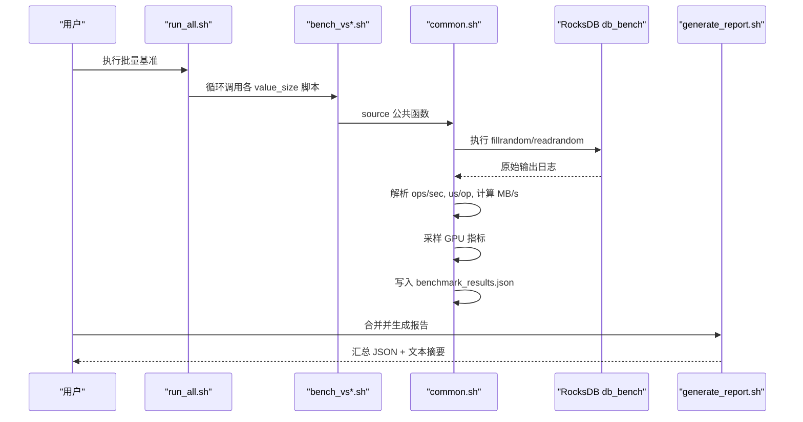
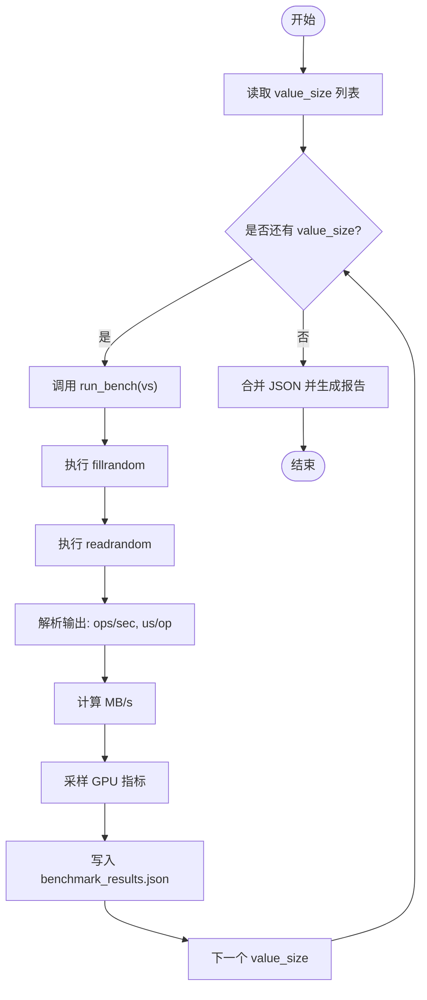
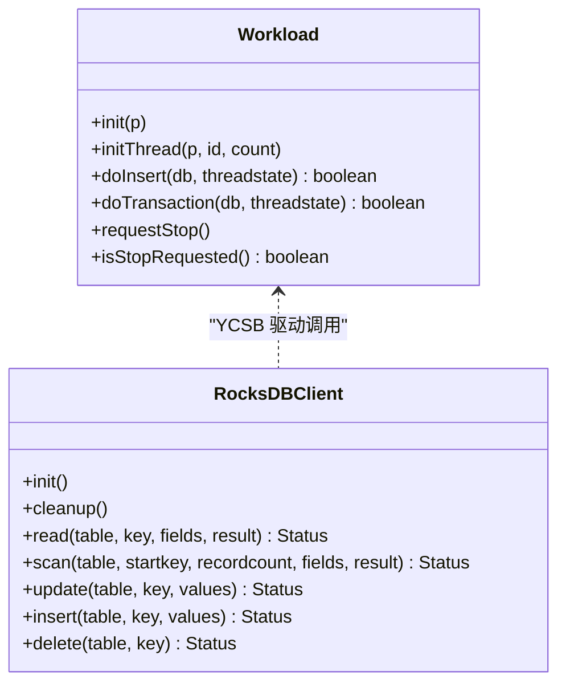
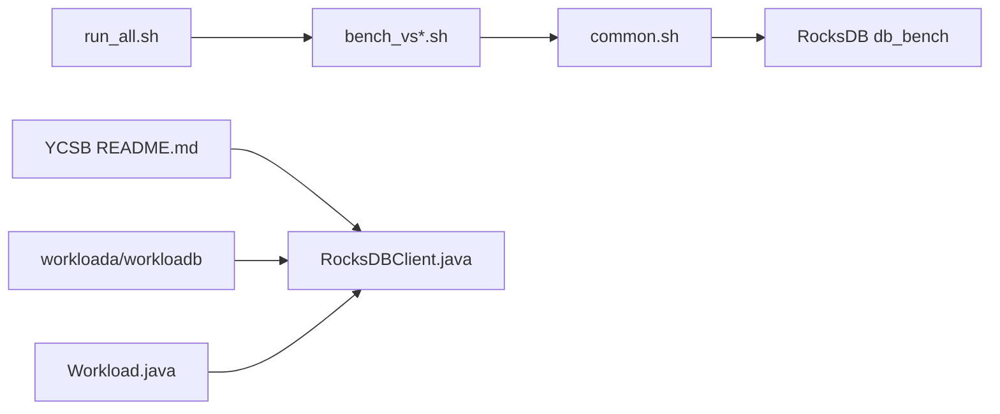

# 基准测试

<cite>
**本文引用的文件**   
- [run_all.sh](file://script/run_all.sh)
- [common.sh](file://script/common.sh)
- [generate_report.sh](file://script/generate_report.sh)
- [bench_vs1024.sh](file://script/bench_vs1024.sh)
- [README.md](file://source/YCSB/README.md)
- [workloada](file://source/YCSB/workloads/workloada)
- [workloadb](file://source/YCSB/workloads/workloadb)
- [RocksDBClient.java](file://source/YCSB/rocksdb/src/main/java/site/ycsb/db/rocksdb/RocksDBClient.java)
- [Workload.java](file://source/YCSB/core/src/main/java/site/ycsb/Workload.java)
</cite>

## 目录
1. [简介](#简介)
2. [项目结构](#项目结构)
3. [核心组件](#核心组件)
4. [架构总览](#架构总览)
5. [详细组件分析](#详细组件分析)
6. [依赖关系分析](#依赖关系分析)
7. [性能考量](#性能考量)
8. [故障排查指南](#故障排查指南)
9. [结论](#结论)
10. [附录](#附录)

## 简介
本文件面向使用 YCSB 与 RocksDB 进行存储系统基准测试的工程师，提供从工作负载定制、参数配置、结果收集到报告生成的完整实践指南。同时涵盖：
- 自定义工作负载（Java Workload 类）编写方法
- 操作比例配置与数据模型设计
- 吞吐、延迟、资源利用率等关键指标的采集与监控
- 自动化脚本的使用与结果对比分析
- 不同 RocksDB 版本的对比测试方法
- 测试环境标准化配置（硬件、软件、环境变量）
- 性能回归测试与持续集成建议

## 项目结构
仓库包含三类关键内容：
- 脚本层：用于编排 RocksDB db_bench 的多值大小基准测试、汇总结果与生成报告
- YCSB 层：YCSB 框架与 RocksDB Binding、默认工作负载定义
- RocksDB 源码：作为被测引擎（通过 db_bench 执行）

图表来源
- [run_all.sh:1-19](file://script/run_all.sh#L1-L19)
- [common.sh:1-196](file://script/common.sh#L1-L196)
- [generate_report.sh:1-59](file://script/generate_report.sh#L1-L59)
- [bench_vs1024.sh:1-10](file://script/bench_vs1024.sh#L1-L10)
- [README.md:1-135](file://source/YCSB/README.md#L1-L135)
- [workloada:1-38](file://source/YCSB/workloads/workloada#L1-L38)
- [workloadb:1-37](file://source/YCSB/workloads/workloadb#L1-L37)
- [RocksDBClient.java:1-468](file://source/YCSB/rocksdb/src/main/java/site/ycsb/db/rocksdb/RocksDBClient.java#L1-L468)
- [Workload.java:1-123](file://source/YCSB/core/src/main/java/site/ycsb/Workload.java#L1-L123)

章节来源
- [run_all.sh:1-19](file://script/run_all.sh#L1-L19)
- [common.sh:1-196](file://script/common.sh#L1-L196)
- [generate_report.sh:1-59](file://script/generate_report.sh#L1-L59)
- [bench_vs1024.sh:1-10](file://script/bench_vs1024.sh#L1-L10)
- [README.md:1-135](file://source/YCSB/README.md#L1-L135)
- [workloada:1-38](file://source/YCSB/workloads/workloada#L1-L38)
- [workloadb:1-37](file://source/YCSB/workloads/workloadb#L1-L37)
- [RocksDBClient.java:1-468](file://source/YCSB/rocksdb/src/main/java/site/ycsb/db/rocksdb/RocksDBClient.java#L1-L468)
- [Workload.java:1-123](file://source/YCSB/core/src/main/java/site/ycsb/Workload.java#L1-L123)

## 核心组件
- 脚本编排与执行
  - run_all.sh：顺序执行多个 value_size 基准用例，统一输出路径
  - bench_vs*.sh：针对特定 value_size 调用 common.sh 中的 run_bench
  - common.sh：封装 db_bench 运行、指标解析、MB/s 换算、GPU 采样、JSON 结果写入
  - generate_report.sh：合并多组 JSON 并打印摘要，便于横向对比
- YCSB 框架与绑定
  - README.md：YCSB 安装、运行、构建与 HDR 直方图处理说明
  - workloada/workloadb：典型读写混合工作负载配置文件
  - RocksDBClient.java：YCSB 对 RocksDB 的 Java 绑定实现
  - Workload.java：YCSB 工作负载抽象基类，指导自定义扩展

章节来源
- [run_all.sh:1-19](file://script/run_all.sh#L1-L19)
- [bench_vs1024.sh:1-10](file://script/bench_vs1024.sh#L1-L10)
- [common.sh:1-196](file://script/common.sh#L1-L196)
- [generate_report.sh:1-59](file://script/generate_report.sh#L1-L59)
- [README.md:1-135](file://source/YCSB/README.md#L1-L135)
- [workloada:1-38](file://source/YCSB/workloads/workloada#L1-L38)
- [workloadb:1-37](file://source/YCSB/workloads/workloadb#L1-L37)
- [RocksDBClient.java:1-468](file://source/YCSB/rocksdb/src/main/java/site/ycsb/db/rocksdb/RocksDBClient.java#L1-L468)
- [Workload.java:1-123](file://source/YCSB/core/src/main/java/site/ycsb/Workload.java#L1-L123)

## 架构总览
下图展示了从脚本到 RocksDB 的执行流，以及 YCSB 在自定义场景下的角色。

图表来源
- [run_all.sh:1-19](file://script/run_all.sh#L1-L19)
- [bench_vs1024.sh:1-10](file://script/bench_vs1024.sh#L1-L10)
- [common.sh:1-196](file://script/common.sh#L1-L196)
- [generate_report.sh:1-59](file://script/generate_report.sh#L1-L59)

## 详细组件分析

### 脚本层：RocksDB 基准执行与结果聚合
- run_all.sh
  - 作用：按固定顺序遍历多个 value_size（如 32/128/512/1024/4096/16384），依次调用对应 bench_vs*.sh
  - 输出：每个子目录 output/vs<NN>/benchmark_results.json
- bench_vs*.sh
  - 作用：为指定 value_size 设置参数并调用 common.sh 的 run_bench
- common.sh
  - 作用：封装 db_bench 命令、解析输出、计算吞吐、采样 GPU、生成结构化 JSON
  - 关键点：
    - 解析 ops/sec 与 us/op，并通过公式换算 MB/s
    - 记录 metadata/hardware/runs 三大部分
    - 支持 WAL、缓存、压缩、线程数、seed 等参数
- generate_report.sh
  - 作用：合并所有 value_size 的 JSON，排序后输出摘要表格

图表来源
- [run_all.sh:1-19](file://script/run_all.sh#L1-L19)
- [common.sh:1-196](file://script/common.sh#L1-L196)
- [generate_report.sh:1-59](file://script/generate_report.sh#L1-L59)

章节来源
- [run_all.sh:1-19](file://script/run_all.sh#L1-L19)
- [bench_vs1024.sh:1-10](file://script/bench_vs1024.sh#L1-L10)
- [common.sh:1-196](file://script/common.sh#L1-L196)
- [generate_report.sh:1-59](file://script/generate_report.sh#L1-L59)

### YCSB 框架与 RocksDB 绑定
- README.md
  - 提供下载、安装、运行示例与 HDR 直方图工具链说明
- workloads/workloada 与 workloadb
  - 定义读/写比例、请求分布、记录规模等
- RocksDBClient.java
  - 实现 YCSB 的 DB 接口，负责 RocksDB 初始化、列族管理、序列化/反序列化、CRUD 操作
- Workload.java
  - 定义工作负载抽象，指导如何扩展 doInsert/doTransaction 等方法

图表来源
- [Workload.java:1-123](file://source/YCSB/core/src/main/java/site/ycsb/Workload.java#L1-L123)
- [RocksDBClient.java:1-468](file://source/YCSB/rocksdb/src/main/java/site/ycsb/db/rocksdb/RocksDBClient.java#L1-L468)

章节来源
- [README.md:1-135](file://source/YCSB/README.md#L1-L135)
- [workloada:1-38](file://source/YCSB/workloads/workloada#L1-L38)
- [workloadb:1-37](file://source/YCSB/workloads/workloadb#L1-L37)
- [RocksDBClient.java:1-468](file://source/YCSB/rocksdb/src/main/java/site/ycsb/db/rocksdb/RocksDBClient.java#L1-L468)
- [Workload.java:1-123](file://source/YCSB/core/src/main/java/site/ycsb/Workload.java#L1-L123)

### 自定义工作负载编写指南（YCSB）
- 继承 Workload 基类，实现 doInsert 与 doTransaction
- 通过 init/initThread 准备线程级状态
- 使用 Properties 加载配置（如 insertstart/insertcount）
- 结合 YCSB Client 多线程调度，避免全局锁竞争
- 参考 workloada/workloadb 的配置方式调整读/写比例与请求分布

章节来源
- [Workload.java:1-123](file://source/YCSB/core/src/main/java/site/ycsb/Workload.java#L1-L123)
- [workloada:1-38](file://source/YCSB/workloads/workloada#L1-L38)
- [workloadb:1-37](file://source/YCSB/workloads/workloadb#L1-L37)

### 数据模型设计与序列化（RocksDB 绑定）
- RocksDBClient 将字段以“长度前缀+键+长度前缀+值”的方式序列化存储
- 支持列族（Column Family）动态创建与持久化名称列表
- 提供 read/scan/update/insert/delete 的标准接口
- 适合键值型元数据或轻量级对象存储场景

章节来源
- [RocksDBClient.java:1-468](file://source/YCSB/rocksdb/src/main/java/site/ycsb/db/rocksdb/RocksDBClient.java#L1-L468)

### 性能指标收集与监控
- 吞吐与延迟
  - 从 db_bench 输出解析 ops/sec 与 us/op
  - 通过公式换算 MB/s：MB/s = ops/sec × (key_size + value_size) / (1024×1024)
- 资源利用率
  - 通过 nvidia-smi 采样 GPU 利用率与显存占用
- 空间放大率
  - 基于磁盘占用与逻辑字节数计算 space_amplification
- 直方图与分位数
  - YCSB 支持 HDR 直方图输出与合并，便于 P95/P99 分析

章节来源
- [common.sh:1-196](file://script/common.sh#L1-L196)
- [generate_report.sh:1-59](file://script/generate_report.sh#L1-L59)
- [README.md:1-135](file://source/YCSB/README.md#L1-L135)

### 基准测试脚本使用与自动化流程
- 单值大小测试
  - 直接运行 bench_vs1024.sh（或其他 vs*.sh）
- 全量值大小测试
  - 运行 run_all.sh，自动遍历并生成各 value_size 的结果
- 结果汇总与对比
  - 运行 generate_report.sh，合并 JSON 并打印摘要表格

章节来源
- [bench_vs1024.sh:1-10](file://script/bench_vs1024.sh#L1-L10)
- [run_all.sh:1-19](file://script/run_all.sh#L1-L19)
- [generate_report.sh:1-59](file://script/generate_report.sh#L1-L59)

### 不同 RocksDB 版本对比测试方法
- 替换 db_bench 二进制路径
  - 在 bench_vs*.sh 中修改 DB_BENCH 指向目标版本的 build/db_bench
- 保持参数一致
  - 确保 key_size/value_size/threads/write_buffer_size/compression_type/seed 等参数一致
- 重复执行并比较
  - 使用 generate_report.sh 合并结果，关注吞吐、延迟与空间放大率差异

章节来源
- [bench_vs1024.sh:1-10](file://script/bench_vs1024.sh#L1-L10)
- [common.sh:1-196](file://script/common.sh#L1-L196)
- [generate_report.sh:1-59](file://script/generate_report.sh#L1-L59)

### 测试环境标准化配置
- 硬件要求
  - CPU、内存、GPU（可选）信息通过 collect_hw_json 自动采集
- 软件依赖
  - RocksDB 编译产物（db_bench）、nvidia-smi（可选）
- 环境变量
  - LD_LIBRARY_PATH 需包含 RocksDB 库路径
- 推荐步骤
  - 确认 PATH/LD_LIBRARY_PATH
  - 清理临时目录与输出目录
  - 固定 seed 与线程数，保证可重复性

章节来源
- [common.sh:1-196](file://script/common.sh#L1-L196)

### 性能回归测试与持续集成建议
- 回归策略
  - 固定工作负载与参数，定期运行 run_all.sh，比较关键指标（ops/sec、us/op、MB/s、space_amplification）
- CI 集成
  - 在 CI 中安装依赖、构建 RocksDB、执行脚本、上传 JSON 与报告
  - 设置阈值告警，当吞吐下降或延迟上升超过阈值时触发失败
- 结果归档
  - 每次运行生成独立时间戳目录，便于回溯与趋势分析

[本节为通用实践建议，不直接分析具体文件]

## 依赖关系分析
- 脚本层依赖
  - run_all.sh 依赖 bench_vs*.sh；bench_vs*.sh 依赖 common.sh；generate_report.sh 依赖 JSON 结果
- YCSB 层依赖
  - RocksDBClient 依赖 org.rocksdb.*；Workload 为抽象基类，被具体工作负载实现
- 被测引擎
  - db_bench 由 RocksDB 构建产物提供

图表来源
- [run_all.sh:1-19](file://script/run_all.sh#L1-L19)
- [bench_vs1024.sh:1-10](file://script/bench_vs1024.sh#L1-L10)
- [common.sh:1-196](file://script/common.sh#L1-L196)
- [README.md:1-135](file://source/YCSB/README.md#L1-L135)
- [workloada:1-38](file://source/YCSB/workloads/workloada#L1-L38)
- [workloadb:1-37](file://source/YCSB/workloads/workloadb#L1-L37)
- [RocksDBClient.java:1-468](file://source/YCSB/rocksdb/src/main/java/site/ycsb/db/rocksdb/RocksDBClient.java#L1-L468)
- [Workload.java:1-123](file://source/YCSB/core/src/main/java/site/ycsb/Workload.java#L1-L123)

章节来源
- [run_all.sh:1-19](file://script/run_all.sh#L1-L19)
- [bench_vs1024.sh:1-10](file://script/bench_vs1024.sh#L1-L10)
- [common.sh:1-196](file://script/common.sh#L1-L196)
- [generate_report.sh:1-59](file://script/generate_report.sh#L1-L59)
- [README.md:1-135](file://source/YCSB/README.md#L1-L135)
- [workloada:1-38](file://source/YCSB/workloads/workloada#L1-L38)
- [workloadb:1-37](file://source/YCSB/workloads/workloadb#L1-L37)
- [RocksDBClient.java:1-468](file://source/YCSB/rocksdb/src/main/java/site/ycsb/db/rocksdb/RocksDBClient.java#L1-L468)
- [Workload.java:1-123](file://source/YCSB/core/src/main/java/site/ycsb/Workload.java#L1-L123)

## 性能考量
- 吞吐与延迟权衡
  - 增大 write_buffer_size 可能提升吞吐但增加内存占用
  - 降低 threads 可减少竞争但降低并行度
- 压缩与 IO
  - compression_type=none 减少 CPU 开销，适合 IO 受限场景
- 缓存与统计
  - cache_size 影响热点命中率；statistics=true/histogram=true 有助于定位瓶颈
- 空间放大率
  - 关注 space_amplification，评估磁盘占用与逻辑数据的比值

[本节为通用指导，不直接分析具体文件]

## 故障排查指南
- db_bench 输出解析失败
  - 检查输出格式是否包含预期的 ops/sec 与 us/op 行
  - 确认 parse_us_per_op/parse_ops_per_sec 的正则匹配
- GPU 采样为空
  - 确认 nvidia-smi 可用且权限正常
- JSON 结果缺失或字段为空
  - 检查 run_bench 是否成功执行并写入文件
  - 验证 generate_report.sh 是否能找到对应路径
- RocksDB 初始化异常
  - 检查 RocksDB 库路径与 LD_LIBRARY_PATH
  - 确认 optionsfile 与列族配置正确

章节来源
- [common.sh:1-196](file://script/common.sh#L1-L196)
- [generate_report.sh:1-59](file://script/generate_report.sh#L1-L59)
- [RocksDBClient.java:1-468](file://source/YCSB/rocksdb/src/main/java/site/ycsb/db/rocksdb/RocksDBClient.java#L1-L468)

## 结论
本仓库提供了完整的 RocksDB 基准测试流水线：从脚本编排、指标采集、结果聚合到报告生成，并结合 YCSB 框架支持自定义工作负载与绑定扩展。通过标准化环境与参数控制，可实现跨版本、跨配置的对比分析与回归检测。建议在 CI 中固化流程，建立阈值告警与历史归档，持续提升测试的可重复性与可比性。

[本节为总结性内容，不直接分析具体文件]

## 附录
- 常用命令
  - 单值大小测试：bash script/bench_vs1024.sh
  - 全量测试：bash script/run_all.sh
  - 生成报告：bash script/generate_report.sh
- 关键参数
  - key_size、value_size、num_ops、threads、write_buffer_size、compression_type、seed
- 指标说明
  - ops/sec、us/op、MB/s、space_amplification、GPU 利用率与显存

[本节为补充信息，不直接分析具体文件]