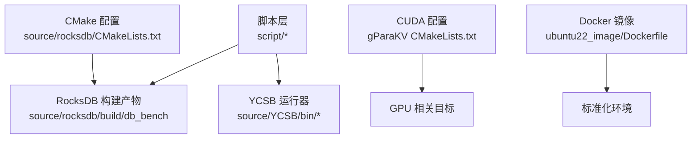
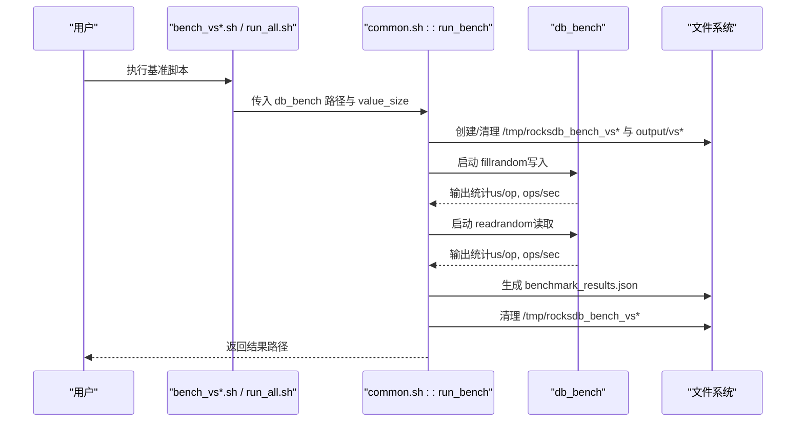
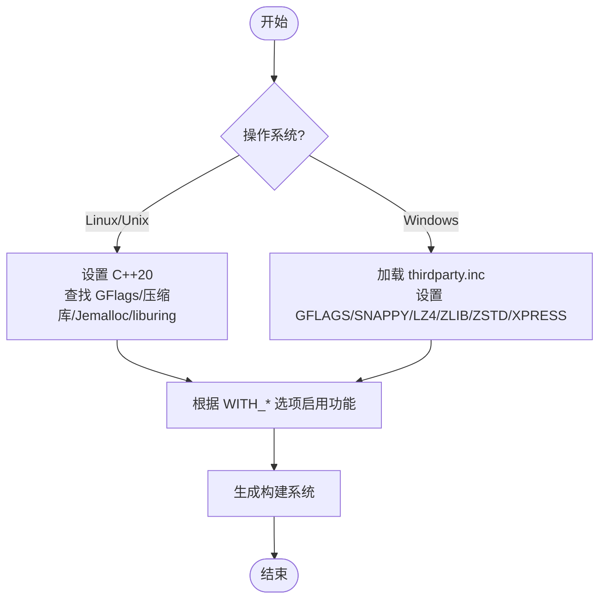
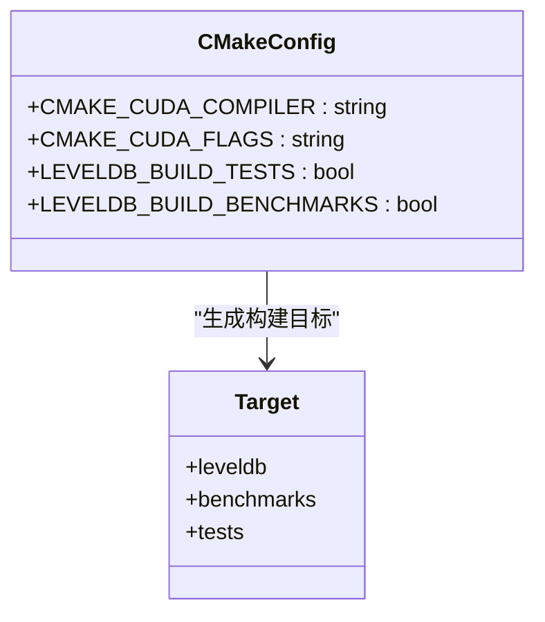
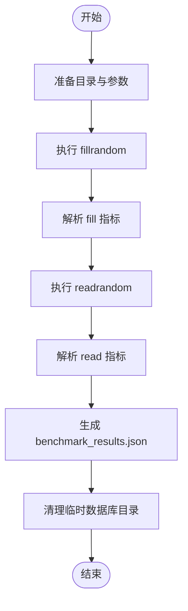
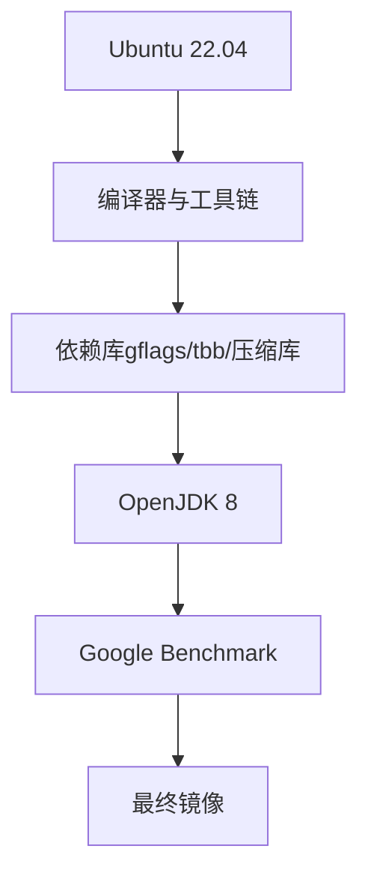
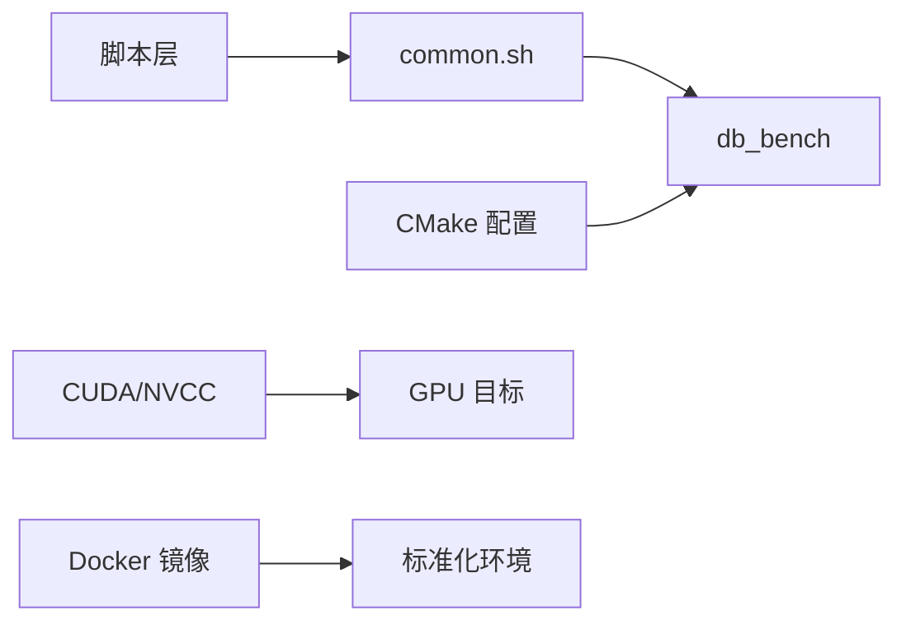

# 测试环境搭建

<cite>
**本文引用的文件**   
- [script/common.sh](file://script/common.sh)
- [script/run_all.sh](file://script/run_all.sh)
- [script/bench_vs1024.sh](file://script/bench_vs1024.sh)
- [source/rocksdb/CMakeLists.txt](file://source/rocksdb/CMakeLists.txt)
- [source/rocksdb/thirdparty.inc](file://source/rocksdb/thirdparty.inc)
- [source/gParaKV-GC-master/CMakeLists.txt](file://source/gParaKV-GC-master/CMakeLists.txt)
- [source/gParaKV-GC-pipeline/CMakeLists.txt](file://source/gParaKV-GC-pipeline/CMakeLists.txt)
- [source/gParaKV-GC-pipeline-h2d/CMakeLists.txt](file://source/gParaKV-GC-pipeline-h2d/CMakeLists.txt)
- [source/rocksdb/build_tools/ubuntu22_image/Dockerfile](file://source/rocksdb/build_tools/ubuntu22_image/Dockerfile)
- [source/YCSB/README.md](file://source/YCSB/README.md)
</cite>

## 目录
1. [简介](#简介)
2. [项目结构](#项目结构)
3. [核心组件](#核心组件)
4. [架构总览](#架构总览)
5. [详细组件分析](#详细组件分析)
6. [依赖关系分析](#依赖关系分析)
7. [性能注意事项](#性能注意事项)
8. [故障排查指南](#故障排查指南)
9. [结论](#结论)
10. [附录](#附录)

## 简介
本文件面向需要在本地或容器中搭建 RocksDB、gParaKV（LevelDB 变体）与 YCSB 的测试环境，提供从编译器与依赖安装、CMake 构建配置、GPU 编译开关、第三方库路径设置，到测试数据准备、结果收集与清理、跨平台差异处理以及容器化镜像构建的完整说明。文档同时给出脚本执行流程与关键 CMake 选项，帮助读者快速复现实验并定位常见问题。

## 项目结构
- script：基准测试与报告生成脚本集合，包含按 value_size 分组的运行脚本与通用函数库。
- source：
  - rocksdb：RocksDB 源码及 CMake 构建配置、Windows 第三方库路径配置等。
  - gParaKV-GC-*：基于 LevelDB 的 GPU/GC 增强版本，含 CUDA 编译相关 CMake 配置。
  - YCSB：Java 基准框架，用于多数据库绑定压测。
- output：测试结果输出目录（由脚本自动创建）。

**图示来源** 
- [source/rocksdb/CMakeLists.txt:1-200](file://source/rocksdb/CMakeLists.txt#L1-L200)
- [source/gParaKV-GC-master/CMakeLists.txt:1-200](file://source/gParaKV-GC-master/CMakeLists.txt#L1-L200)
- [source/rocksdb/build_tools/ubuntu22_image/Dockerfile:1-91](file://source/rocksdb/build_tools/ubuntu22_image/Dockerfile#L1-L91)

**章节来源**
- [script/common.sh:1-196](file://script/common.sh#L1-L196)
- [script/run_all.sh:1-19](file://script/run_all.sh#L1-L19)
- [source/rocksdb/CMakeLists.txt:1-200](file://source/rocksdb/CMakeLists.txt#L1-L200)
- [source/rocksdb/thirdparty.inc:1-200](file://source/rocksdb/thirdparty.inc#L1-L200)
- [source/gParaKV-GC-master/CMakeLists.txt:1-200](file://source/gParaKV-GC-master/CMakeLists.txt#L1-L200)
- [source/rocksdb/build_tools/ubuntu22_image/Dockerfile:1-91](file://source/rocksdb/build_tools/ubuntu22_image/Dockerfile#L1-L91)
- [source/YCSB/README.md:1-135](file://source/YCSB/README.md#L1-L135)

## 核心组件
- 脚本层
  - common.sh：定义公共变量（如输出目录、线程数、压缩类型）、解析 db_bench 输出、计算吞吐与尾延迟、采集硬件信息、封装单次 value_size 基准测试流程。
  - run_all.sh：顺序执行不同 value_size 的基准脚本，汇总输出路径。
  - bench_vs*.sh：针对特定 value_size 调用 run_bench。
- 构建系统
  - RocksDB CMakeLists.txt：启用 C++20、可选压缩库（Snappy/LZ4/Zlib/Zstd/BZ2）、GFlags、Jemalloc、liburing、Windows UTF8 文件名等；支持 MSVC 与 GCC/Clang。
  - thirdparty.inc：Windows 下第三方库路径与环境变量配置（GFLAGS/SNAPPY/LZ4/ZLIB/ZSTD/XPRESS）。
  - gParaKV CMakeLists.txt：设置 CUDA 编译器与编译标志，控制测试与基准构建开关。
- 容器镜像
  - ubuntu22_image/Dockerfile：预装 gcc/g++/clang、cmake、gflags、tbb、各类压缩库、OpenJDK 8、MinGW、gtest-parallel、benchmark 等，形成可重复构建环境。

**章节来源**
- [script/common.sh:1-196](file://script/common.sh#L1-L196)
- [script/run_all.sh:1-19](file://script/run_all.sh#L1-L19)
- [script/bench_vs1024.sh:1-10](file://script/bench_vs1024.sh#L1-L10)
- [source/rocksdb/CMakeLists.txt:1-200](file://source/rocksdb/CMakeLists.txt#L1-L200)
- [source/rocksdb/thirdparty.inc:1-200](file://source/rocksdb/thirdparty.inc#L1-L200)
- [source/gParaKV-GC-master/CMakeLists.txt:1-200](file://source/gParaKV-GC-master/CMakeLists.txt#L1-L200)
- [source/rocksdb/build_tools/ubuntu22_image/Dockerfile:1-91](file://source/rocksdb/build_tools/ubuntu22_image/Dockerfile#L1-L91)

## 架构总览
下图展示从脚本驱动到 RocksDB 基准执行的端到端流程，包括参数传递、临时目录管理、结果 JSON 生成与清理。

**图示来源** 
- [script/common.sh:68-196](file://script/common.sh#L68-L196)
- [script/run_all.sh:1-19](file://script/run_all.sh#L1-L19)
- [script/bench_vs1024.sh:1-10](file://script/bench_vs1024.sh#L1-L10)

## 详细组件分析

### 构建系统与依赖配置（RocksDB）
- 编译器与标准
  - 默认 C++ 标准为 20，Linux 要求较新工具链（GCC >= 11 或 Clang >= 10）。
- 可选特性与第三方库
  - WITH_GFLAGS：命令行参数解析（非 Windows 默认开启）。
  - WITH_SNAPPY/LZ4/ZLIB/ZSTD/BZ2：压缩库开关。
  - WITH_JEMALLOC：内存分配器。
  - WITH_LIBURING：异步 I/O。
  - ROCKSDB_BUILD_SHARED：是否构建共享库。
  - Windows 特有：WITH_WINDOWS_UTF8_FILENAMES、WITH_XPRESS。
- Windows 第三方库路径
  - 通过 thirdparty.inc 中的环境变量（THIRDPARTY_HOME、GFLAGS_INCLUDE/LIB_* 等）指定头文件与库路径。

**图示来源** 
- [source/rocksdb/CMakeLists.txt:1-200](file://source/rocksdb/CMakeLists.txt#L1-L200)
- [source/rocksdb/thirdparty.inc:1-200](file://source/rocksdb/thirdparty.inc#L1-L200)

**章节来源**
- [source/rocksdb/CMakeLists.txt:1-200](file://source/rocksdb/CMakeLists.txt#L1-L200)
- [source/rocksdb/thirdparty.inc:1-200](file://source/rocksdb/thirdparty.inc#L1-L200)

### GPU 编译开关（gParaKV）
- 设置 CUDA 编译器路径与 nvcc 优化标志。
- 控制单元测试与基准构建开关（LEVELDB_BUILD_TESTS、LEVELDB_BUILD_BENCHMARKS）。
- 在 pipeline/h2d 分支中显式指定 CMAKE_CUDA_COMPILER。

**图示来源** 
- [source/gParaKV-GC-master/CMakeLists.txt:1-200](file://source/gParaKV-GC-master/CMakeLists.txt#L1-L200)
- [source/gParaKV-GC-pipeline/CMakeLists.txt:1-20](file://source/gParaKV-GC-pipeline/CMakeLists.txt#L1-L20)
- [source/gParaKV-GC-pipeline-h2d/CMakeLists.txt:1-20](file://source/gParaKV-GC-pipeline-h2d/CMakeLists.txt#L1-L20)

**章节来源**
- [source/gParaKV-GC-master/CMakeLists.txt:1-200](file://source/gParaKV-GC-master/CMakeLists.txt#L1-L200)
- [source/gParaKV-GC-pipeline/CMakeLists.txt:1-20](file://source/gParaKV-GC-pipeline/CMakeLists.txt#L1-L20)
- [source/gParaKV-GC-pipeline-h2d/CMakeLists.txt:1-20](file://source/gParaKV-GC-pipeline-h2d/CMakeLists.txt#L1-L20)

### 测试数据准备与执行流程
- 数据规模与分布
  - key_size 固定为 20 字节，value_size 由脚本参数决定（如 32/128/512/1024/4096/16384 字节），num_ops=1M。
  - 填充模式：fillrandom；读取模式：readrandom。
- 执行步骤
  - 清理并创建临时数据库目录与输出目录。
  - 运行 fillrandom，解析 us/op 与 ops/sec，计算 MB/s 与尾延迟。
  - 运行 readrandom，同样解析指标。
  - 生成 benchmark_results.json，包含元数据、硬件信息与运行结果。
  - 清理临时数据库目录。

**图示来源** 
- [script/common.sh:68-196](file://script/common.sh#L68-L196)

**章节来源**
- [script/common.sh:1-196](file://script/common.sh#L1-L196)
- [script/run_all.sh:1-19](file://script/run_all.sh#L1-L19)
- [script/bench_vs1024.sh:1-10](file://script/bench_vs1024.sh#L1-L10)

### 容器化测试环境（Docker）
- 基础镜像：Ubuntu 22.04。
- 预装组件：gcc/g++/clang、cmake、gflags、tbb、多种压缩库、OpenJDK 8、MinGW、gtest-parallel、google benchmark、valgrind 等。
- 构建与推送：遵循 Dockerfile 注释指引进行构建与发布。

**图示来源** 
- [source/rocksdb/build_tools/ubuntu22_image/Dockerfile:1-91](file://source/rocksdb/build_tools/ubuntu22_image/Dockerfile#L1-L91)

**章节来源**
- [source/rocksdb/build_tools/ubuntu22_image/Dockerfile:1-91](file://source/rocksdb/build_tools/ubuntu22_image/Dockerfile#L1-L91)

### YCSB 集成与使用
- 获取与运行：参考 README 中的下载与命令示例（Linux/Windows 双平台）。
- 工作负载与属性：可通过 workload 配置文件与核心属性调整行为。
- 多实例与延迟百分位：支持 HDR 直方图输出与合并。

**章节来源**
- [source/YCSB/README.md:1-135](file://source/YCSB/README.md#L1-L135)

## 依赖关系分析
- 脚本依赖
  - bench_vs*.sh 依赖 common.sh 提供的 run_bench 与解析函数。
  - run_all.sh 顺序调用各 bench_vs*.sh。
- 构建依赖
  - RocksDB 构建依赖 CMake、编译器、可选的 GFlags/压缩库/Jemalloc/liburing。
  - gParaKV 构建依赖 CUDA 工具链与 NVCC。
- 运行时依赖
  - db_bench 需要 LD_LIBRARY_PATH 指向 RocksDB 构建产物目录。
  - 脚本会采集 nvidia-smi 信息（若存在）。

**图示来源** 
- [script/common.sh:1-196](file://script/common.sh#L1-L196)
- [source/rocksdb/CMakeLists.txt:1-200](file://source/rocksdb/CMakeLists.txt#L1-L200)
- [source/gParaKV-GC-master/CMakeLists.txt:1-200](file://source/gParaKV-GC-master/CMakeLists.txt#L1-L200)
- [source/rocksdb/build_tools/ubuntu22_image/Dockerfile:1-91](file://source/rocksdb/build_tools/ubuntu22_image/Dockerfile#L1-L91)

**章节来源**
- [script/common.sh:1-196](file://script/common.sh#L1-L196)
- [source/rocksdb/CMakeLists.txt:1-200](file://source/rocksdb/CMakeLists.txt#L1-L200)
- [source/gParaKV-GC-master/CMakeLists.txt:1-200](file://source/gParaKV-GC-master/CMakeLists.txt#L1-L200)
- [source/rocksdb/build_tools/ubuntu22_image/Dockerfile:1-91](file://source/rocksdb/build_tools/ubuntu22_image/Dockerfile#L1-L91)

## 性能注意事项
- 线程数与缓存
  - 脚本默认 THREADS=1，WRITE_BUFFER_SIZE=67108864，cache_size=8388608，可根据硬件调优。
- 压缩与吞吐
  - COMPRESSION="none"，如需对比不同压缩算法，可在 CMake 构建时启用对应库并在脚本中修改参数。
- 尾延迟估算
  - 脚本对尾延迟采用 us/op * 1.5 的近似方法，适合快速评估。
- GPU 采样
  - 若存在 nvidia-smi，脚本会记录 GPU 利用率与显存占用。

[本节为通用指导，不直接分析具体文件]

## 故障排查指南
- 找不到 db_bench
  - 确认已构建 RocksDB 并设置 LD_LIBRARY_PATH 指向 build 目录。
- 缺少动态库
  - 检查 system 包是否安装（gflags、snappy、lz4、zlib、zstd、bz2、jemalloc、liburing）。
- CUDA 编译失败
  - 确认 CMAKE_CUDA_COMPILER 指向正确的 nvcc，且 CUDA 版本与代码兼容。
- Windows 第三方库路径错误
  - 检查 thirdparty.inc 中的环境变量与路径是否正确。
- YCSB 运行异常
  - 确认 Java 版本与 Maven 安装，参考 README 中的命令与属性说明。

**章节来源**
- [source/rocksdb/CMakeLists.txt:1-200](file://source/rocksdb/CMakeLists.txt#L1-L200)
- [source/rocksdb/thirdparty.inc:1-200](file://source/rocksdb/thirdparty.inc#L1-L200)
- [source/gParaKV-GC-master/CMakeLists.txt:1-200](file://source/gParaKV-GC-master/CMakeLists.txt#L1-L200)
- [source/YCSB/README.md:1-135](file://source/YCSB/README.md#L1-L135)

## 结论
通过上述步骤，可以在 Linux/Windows 环境下完成 RocksDB 与 gParaKV 的构建与测试，并使用脚本自动化执行不同 value_size 的基准测试，生成结构化结果。借助 Docker 镜像可实现环境标准化与可重复性。建议在生产或 CI 环境中优先使用容器化方案，并结合 CMake 选项灵活启用所需功能。

[本节为总结，不直接分析具体文件]

## 附录
- 常用 CMake 选项（RocksDB）
  - WITH_GFLAGS、WITH_SNAPPY、WITH_LZ4、WITH_ZLIB、WITH_ZSTD、WITH_BZ2、WITH_JEMALLOC、WITH_LIBURING、ROCKSDB_BUILD_SHARED、WITH_WINDOWS_UTF8_FILENAMES、WITH_XPRESS。
- 常用 CMake 选项（gParaKV）
  - LEVELDB_BUILD_TESTS、LEVELDB_BUILD_BENCHMARKS、LEVELDB_INSTALL、CMAKE_CUDA_COMPILER、CMAKE_CUDA_FLAGS。
- 脚本变量
  - KEY_SIZE、NUM_OPS、COMPRESSION、THREADS、WRITE_BUFFER_SIZE、SEED、OUTPUT_BASE、PROJECT_DIR。

**章节来源**
- [source/rocksdb/CMakeLists.txt:1-200](file://source/rocksdb/CMakeLists.txt#L1-L200)
- [source/gParaKV-GC-master/CMakeLists.txt:1-200](file://source/gParaKV-GC-master/CMakeLists.txt#L1-L200)
- [script/common.sh:1-196](file://script/common.sh#L1-L196)