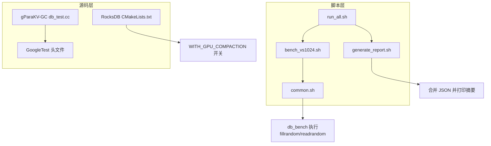
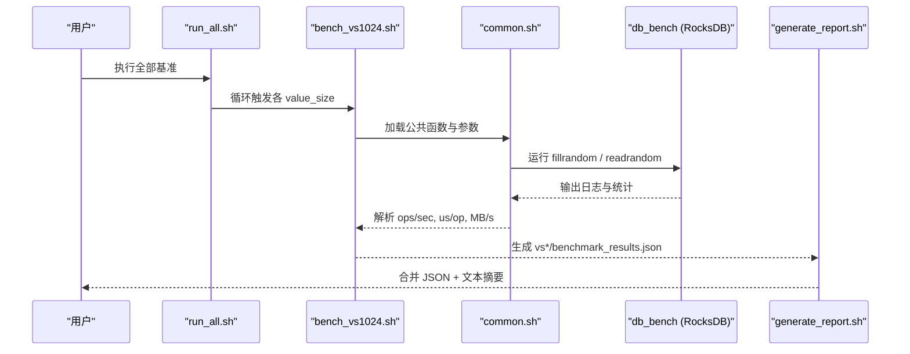
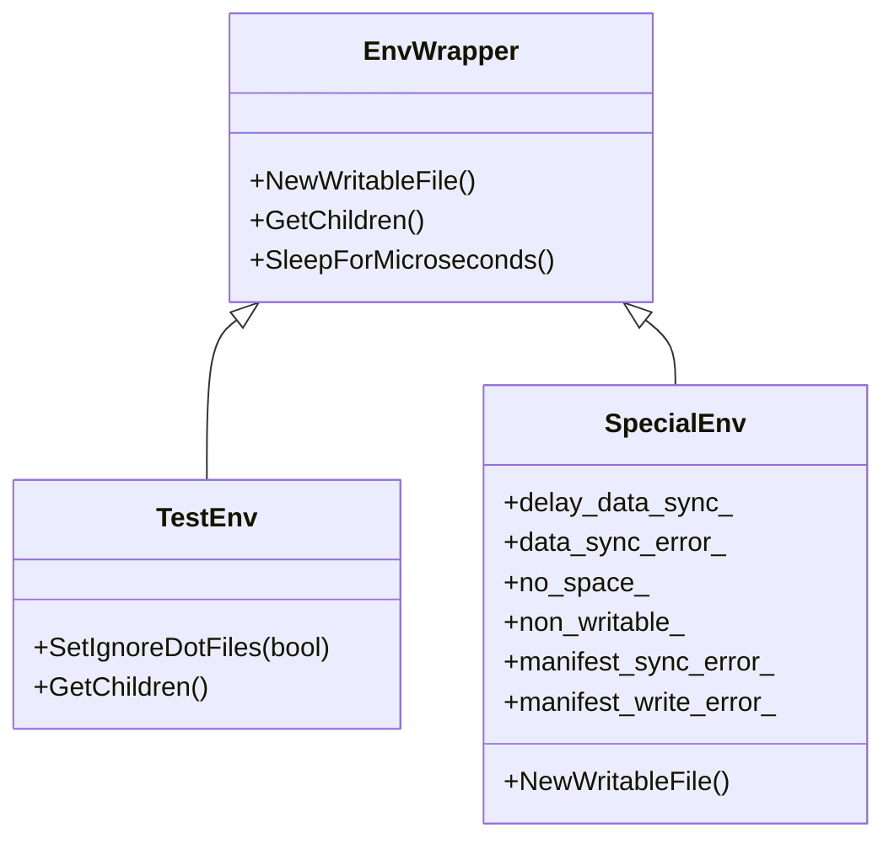
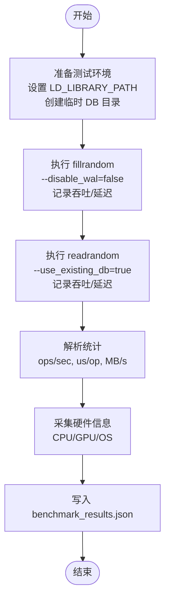
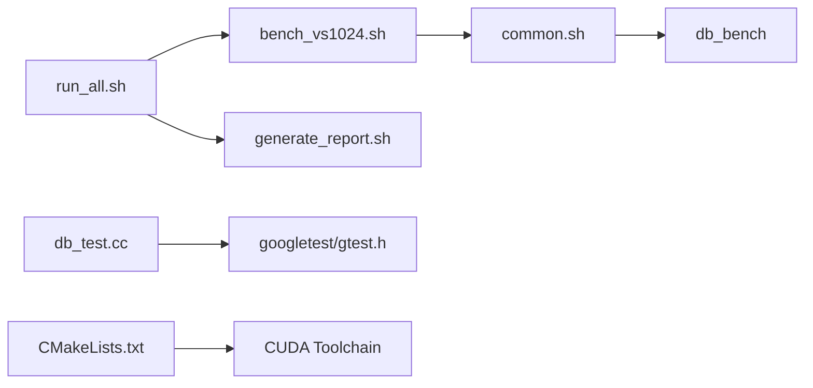

# 测试策略和方法

<cite>
**本文引用的文件**   
- [script/run_all.sh](file://script/run_all.sh)
- [script/common.sh](file://script/common.sh)
- [script/bench_vs1024.sh](file://script/bench_vs1024.sh)
- [script/generate_report.sh](file://script/generate_report.sh)
- [source/gParaKV-GC-master/db/db_test.cc](file://source/gParaKV-GC-master/db/db_test.cc)
- [source/gParaKV-GC-master/third_party/googletest/googletest/include/gtest/gtest.h](file://source/gParaKV-GC-master/third_party/googletest/googletest/include/gtest/gtest.h)
- [source/rocksdb-flush-wal-0.2/CMakeLists.txt](file://source/rocksdb-flush-wal-0.2/CMakeLists.txt)
</cite>

## 目录
1. [引言](#引言)
2. [项目结构](#项目结构)
3. [核心组件](#核心组件)
4. [架构总览](#架构总览)
5. [详细组件分析](#详细组件分析)
6. [依赖关系分析](#依赖关系分析)
7. [性能考虑](#性能考虑)
8. [故障排查指南](#故障排查指南)
9. [结论](#结论)
10. [附录](#附录)

## 引言
本文件面向本项目（基于 RocksDB 与 gParaKV-GC 的元数据卸载与 KV 存储系统）的测试策略与方法，覆盖单元测试、集成测试、基准测试与覆盖率报告。目标包括：
- 统一 Google Test 框架使用规范与断言方法
- 设计可维护、可复现的测试用例与模拟对象创建方式
- 实现数据库操作、WAL、Flush、GPU 加速等关键路径的集成测试
- 提供 YCSB 工作负载定制、性能指标采集与分析流程
- 明确测试环境搭建、数据准备与覆盖率要求及报告生成方法
- 给出常见场景示例与最佳实践，确保测试代码质量与可维护性

## 项目结构
本项目在脚本层提供了统一的基准执行与报告生成能力；在源码层包含 gParaKV-GC 的测试样例与 RocksDB 构建配置（含 GPU 编译选项）。整体结构如下：
- script：基准测试编排、参数解析、结果合并与报告输出
- source/gParaKV-GC-master：基于 LevelDB/RocksDB 的扩展实现与测试样例
- source/rocksdb-flush-wal-0.2：RocksDB 构建配置，支持 GPU Compaction 开关

图表来源 
- [script/run_all.sh:1-19](file://script/run_all.sh#L1-L19)
- [script/bench_vs1024.sh:1-10](file://script/bench_vs1024.sh#L1-L10)
- [script/common.sh:1-196](file://script/common.sh#L1-L196)
- [script/generate_report.sh:1-59](file://script/generate_report.sh#L1-L59)
- [source/gParaKV-GC-master/db/db_test.cc:1-200](file://source/gParaKV-GC-master/db/db_test.cc#L1-L200)
- [source/gParaKV-GC-master/third_party/googletest/googletest/include/gtest/gtest.h:1-200](file://source/gParaKV-GC-master/third_party/googletest/googletest/include/gtest/gtest.h#L1-L200)
- [source/rocksdb-flush-wal-0.2/CMakeLists.txt:1-200](file://source/rocksdb-flush-wal-0.2/CMakeLists.txt#L1-L200)

章节来源
- [script/run_all.sh:1-19](file://script/run_all.sh#L1-L19)
- [script/common.sh:1-196](file://script/common.sh#L1-L196)
- [script/bench_vs1024.sh:1-10](file://script/bench_vs1024.sh#L1-L10)
- [script/generate_report.sh:1-59](file://script/generate_report.sh#L1-L59)
- [source/gParaKV-GC-master/db/db_test.cc:1-200](file://source/gParaKV-GC-master/db/db_test.cc#L1-L200)
- [source/gParaKV-GC-master/third_party/googletest/googletest/include/gtest/gtest.h:1-200](file://source/gParaKV-GC-master/third_party/googletest/googletest/include/gtest/gtest.h#L1-L200)
- [source/rocksdb-flush-wal-0.2/CMakeLists.txt:1-200](file://source/rocksdb-flush-wal-0.2/CMakeLists.txt#L1-L200)

## 核心组件
- 基准执行器 common.sh：封装 db_bench 调用、参数解析、吞吐/延迟计算、硬件信息采集、JSON 结果写入
- 批量调度 run_all.sh：顺序执行不同 value_size 的基准，产出多份 benchmark_results.json
- 报告生成 generate_report.sh：合并多值大小结果，输出汇总 JSON 与文本摘要
- 单元测试样例 db_test.cc：展示 Env 包装、错误注入、同步延迟等高级测试技巧
- GoogleTest 框架：提供断言、测试套件、命令行参数与输出控制
- RocksDB 构建配置：启用 GPU Compaction 的编译开关与 CUDA 工具链检测

章节来源
- [script/common.sh:1-196](file://script/common.sh#L1-L196)
- [script/run_all.sh:1-19](file://script/run_all.sh#L1-L19)
- [script/generate_report.sh:1-59](file://script/generate_report.sh#L1-L59)
- [source/gParaKV-GC-master/db/db_test.cc:1-200](file://source/gParaKV-GC-master/db/db_test.cc#L1-L200)
- [source/gParaKV-GC-master/third_party/googletest/googletest/include/gtest/gtest.h:1-200](file://source/gParaKV-GC-master/third_party/googletest/googletest/include/gtest/gtest.h#L1-L200)
- [source/rocksdb-flush-wal-0.2/CMakeLists.txt:1-200](file://source/rocksdb-flush-wal-0.2/CMakeLists.txt#L1-L200)

## 架构总览
下图展示了从脚本到 RocksDB 基准与结果产出的端到端流程，以及单元测试与构建配置的关联。

图表来源 
- [script/run_all.sh:1-19](file://script/run_all.sh#L1-L19)
- [script/bench_vs1024.sh:1-10](file://script/bench_vs1024.sh#L1-L10)
- [script/common.sh:1-196](file://script/common.sh#L1-L196)
- [script/generate_report.sh:1-59](file://script/generate_report.sh#L1-L59)

## 详细组件分析

### 单元测试规范（Google Test）
- 测试组织
  - 使用 TEST/TestSuite 组织用例，按功能模块划分
  - 通过命令行参数 --gtest_filter 选择特定用例集
- 断言方法
  - 基本断言：EXPECT_*, ASSERT_*
  - 匹配器：MATCHER* 系列用于复杂条件
  - 异常与退出：ASSERT_DEATH/EXPECT_THROW 等
- 模拟与桩
  - 结合 EnvWrapper 对底层 IO 进行拦截与注入（参考 db_test.cc 中的 SpecialEnv/TestEnv）
  - 通过原子标志位控制同步延迟、IO 错误、无空间等场景
- 资源管理
  - 使用临时目录与内存文件系统隔离测试数据
  - 在 TearDown 中清理状态，避免跨用例污染

图表来源 
- [source/gParaKV-GC-master/db/db_test.cc:1-200](file://source/gParaKV-GC-master/db/db_test.cc#L1-L200)
- [source/gParaKV-GC-master/third_party/googletest/googletest/include/gtest/gtest.h:1-200](file://source/gParaKV-GC-master/third_party/googletest/googletest/include/gtest/gtest.h#L1-L200)

章节来源
- [source/gParaKV-GC-master/db/db_test.cc:1-200](file://source/gParaKV-GC-master/db/db_test.cc#L1-L200)
- [source/gParaKV-GC-master/third_party/googletest/googletest/include/gtest/gtest.h:1-200](file://source/gParaKV-GC-master/third_party/googletest/googletest/include/gtest/gtest.h#L1-L200)

### 集成测试：数据库操作、WAL、Flush、GPU 加速
- 数据库操作测试
  - 使用 db_bench 的 fillrandom/readrandom 验证写放大、读放大、吞吐与时延
  - 通过 --disable_wal=false 开启 WAL 以覆盖持久化路径
- WAL 功能测试
  - 校验 WAL 写入与恢复路径，可通过环境变量或构建开关控制
- Flush 操作测试
  - 通过 write_buffer_size 与缓存大小影响 MemTable 刷盘行为
  - 观察 space_amplification 与吞吐变化
- GPU 加速功能测试
  - 构建时启用 WITH_GPU_COMPACTION，确保 nvcc 与 CUDA Toolkit 可用
  - 在基准过程中采样 nvidia-smi 的 GPU 利用率与显存占用

图表来源 
- [script/common.sh:1-196](file://script/common.sh#L1-L196)
- [source/rocksdb-flush-wal-0.2/CMakeLists.txt:1-200](file://source/rocksdb-flush-wal-0.2/CMakeLists.txt#L1-L200)

章节来源
- [script/common.sh:1-196](file://script/common.sh#L1-L196)
- [source/rocksdb-flush-wal-0.2/CMakeLists.txt:1-200](file://source/rocksdb-flush-wal-0.2/CMakeLists.txt#L1-L200)

### 基准测试：YCSB 工作负载定制与性能指标
- 工作负载定制
  - 基于 YCSB 的 Java 绑定与 workload 定义，可按需调整读写比例、键值分布与并发度
  - 针对 RocksDB 后端，使用对应 binding 与配置文件
- 性能指标收集
  - 通过 db_bench 输出解析 ops/sec、us/op 并换算 MB/s
  - 使用 nvidia-smi 采样 GPU 利用率与显存占用
- 结果分析
  - 合并多个 value_size 的结果为统一 JSON，便于横向对比
  - 关注吞吐、延迟、写放大、空间放大与 GPU 利用率的关系

章节来源
- [script/common.sh:1-196](file://script/common.sh#L1-L196)
- [script/generate_report.sh:1-59](file://script/generate_report.sh#L1-L59)

### 测试环境搭建与数据准备
- 环境要求
  - Linux 平台，GCC/Clang 满足版本要求
  - 可选：CUDA 工具链与 NVIDIA 驱动（GPU 加速）
- 构建步骤
  - 使用 CMake 生成构建系统，按需启用 WITH_GPU_COMPACTION
  - 编译后获得 db_bench 与库文件
- 数据准备
  - 每个 value_size 独立临时目录，避免交叉污染
  - 固定 seed 与线程数保证可重复性

章节来源
- [source/rocksdb-flush-wal-0.2/CMakeLists.txt:1-200](file://source/rocksdb-flush-wal-0.2/CMakeLists.txt#L1-L200)
- [script/common.sh:1-196](file://script/common.sh#L1-L196)

## 依赖关系分析
- 脚本依赖
  - run_all.sh 依赖 bench_vs*.sh 与 common.sh
  - bench_vs*.sh 依赖 common.sh 提供的 run_bench 与解析函数
  - generate_report.sh 依赖各 vs*/benchmark_results.json
- 源码依赖
  - db_test.cc 依赖 GoogleTest 与 leveldb/rocksdb 内部接口
  - CMakeLists.txt 控制是否启用 GPU 编译与 CUDA 工具链

图表来源 
- [script/run_all.sh:1-19](file://script/run_all.sh#L1-L19)
- [script/bench_vs1024.sh:1-10](file://script/bench_vs1024.sh#L1-L10)
- [script/common.sh:1-196](file://script/common.sh#L1-L196)
- [script/generate_report.sh:1-59](file://script/generate_report.sh#L1-L59)
- [source/gParaKV-GC-master/db/db_test.cc:1-200](file://source/gParaKV-GC-master/db/db_test.cc#L1-L200)
- [source/gParaKV-GC-master/third_party/googletest/googletest/include/gtest/gtest.h:1-200](file://source/gParaKV-GC-master/third_party/googletest/googletest/include/gtest/gtest.h#L1-L200)
- [source/rocksdb-flush-wal-0.2/CMakeLists.txt:1-200](file://source/rocksdb-flush-wal-0.2/CMakeLists.txt#L1-L200)

章节来源
- [script/run_all.sh:1-19](file://script/run_all.sh#L1-L19)
- [script/bench_vs1024.sh:1-10](file://script/bench_vs1024.sh#L1-L10)
- [script/common.sh:1-196](file://script/common.sh#L1-L196)
- [script/generate_report.sh:1-59](file://script/generate_report.sh#L1-L59)
- [source/gParaKV-GC-master/db/db_test.cc:1-200](file://source/gParaKV-GC-master/db/db_test.cc#L1-L200)
- [source/gParaKV-GC-master/third_party/googletest/googletest/include/gtest/gtest.h:1-200](file://source/gParaKV-GC-master/third_party/googletest/googletest/include/gtest/gtest.h#L1-L200)
- [source/rocksdb-flush-wal-0.2/CMakeLists.txt:1-200](file://source/rocksdb-flush-wal-0.2/CMakeLists.txt#L1-L200)

## 性能考虑
- 吞吐与延迟
  - 通过 parse_us_per_op 与 parse_ops_per_sec 提取关键指标，换算 MB/s
  - 尾延迟估算采用 us/op * 1.5 作为近似
- 写放大与空间放大
  - 通过 du 统计 DB 目录大小与逻辑字节数计算空间放大
- GPU 利用
  - 采样 nvidia-smi 的 GPU 利用率与显存占用，辅助定位瓶颈
- 可重复性
  - 固定 seed、线程数与压缩类型，确保基准可比性

章节来源
- [script/common.sh:1-196](file://script/common.sh#L1-L196)

## 故障排查指南
- 常见问题
  - 缺少 CUDA 编译器：检查 PATH 与 CUDA_HOME，确认 nvcc 可用
  - 动态库路径问题：确保 LD_LIBRARY_PATH 指向 rocksdb/build 与系统库路径
  - 磁盘空间不足：SpecialEnv 可模拟 no_space 错误，实际环境中需清理临时目录
- 调试手段
  - 启用 statistics 与 histogram 获取更详细的运行时统计
  - 使用 --filter 仅运行特定测试用例，快速定位问题
  - 查看 benchmark_results.json 与原始日志，核对解析结果

章节来源
- [source/rocksdb-flush-wal-0.2/CMakeLists.txt:1-200](file://source/rocksdb-flush-wal-0.2/CMakeLists.txt#L1-L200)
- [script/common.sh:1-196](file://script/common.sh#L1-L196)
- [source/gParaKV-GC-master/db/db_test.cc:1-200](file://source/gParaKV-GC-master/db/db_test.cc#L1-L200)

## 结论
本测试策略覆盖了从单元到集成、从基准到报告的完整闭环。通过脚本化执行与结构化结果，保证了测试的可重复性与可观测性；借助 GoogleTest 的高级特性与 Env 包装，能够深入验证 WAL、Flush 与 GPU 加速等关键路径。建议持续完善覆盖率与自动化流水线，提升测试质量与回归效率。

## 附录
- 覆盖率要求与报告生成
  - 建议使用 gcov/lcov 或 LLVM 覆盖率工具，配合 CMake 的 --coverage 选项
  - 将单元测试与集成测试的覆盖率合并，设定阈值（如行覆盖率≥80%）
  - 生成 HTML 报告并归档，纳入 CI 流水线
- 常见场景示例与最佳实践
  - 单测命名与分组：按模块与功能点组织，保持用例粒度适中
  - 模拟与桩：优先使用 Env 包装与接口替换，避免直接修改生产代码
  - 数据隔离：每个用例使用独立临时目录与随机种子
  - 结果可追溯：保留原始日志与 JSON 结果，便于回溯分析