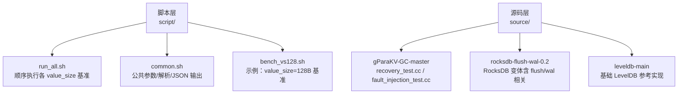
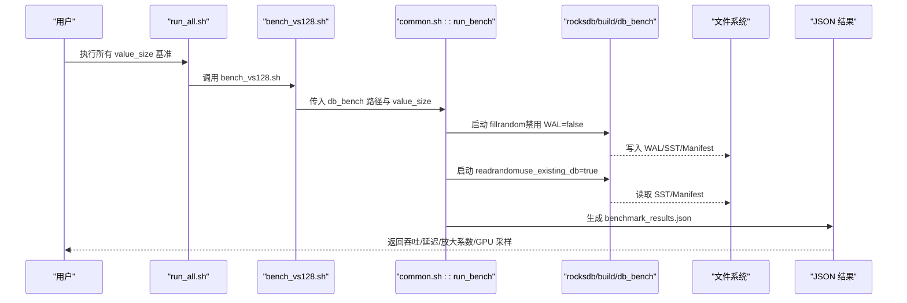
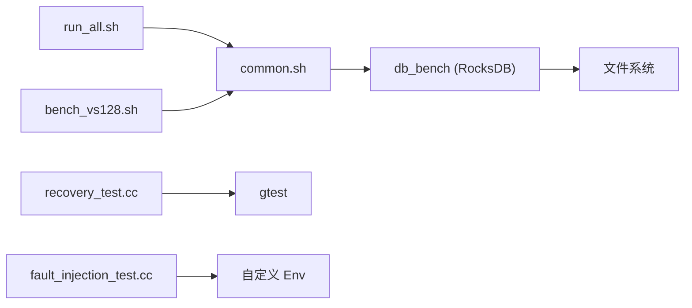

# 集成测试

<cite>
**本文引用的文件**   
- [script/run_all.sh](file://script/run_all.sh)
- [script/common.sh](file://script/common.sh)
- [script/bench_vs128.sh](file://script/bench_vs128.sh)
- [source/gParaKV-GC-master/db/recovery_test.cc](file://source/gParaKV-GC-master/db/recovery_test.cc)
- [source/gParaKV-GC-master/db/fault_injection_test.cc](file://source/gParaKV-GC-master/db/fault_injection_test.cc)
</cite>

## 目录
1. [简介](#简介)
2. [项目结构](#项目结构)
3. [核心组件](#核心组件)
4. [架构总览](#架构总览)
5. [详细组件分析](#详细组件分析)
6. [依赖关系分析](#依赖关系分析)
7. [性能考量](#性能考量)
8. [故障排查指南](#故障排查指南)
9. [结论](#结论)
10. [附录](#附录)

## 简介
本文件面向本项目（基于 RocksDB/LevelDB 的键值存储与 GPU 加速方向）的集成测试，提供端到端测试用例编写指南，覆盖：
- 完整数据库操作流程（写入、读取、压缩、刷新、WAL 持久化与恢复）
- WAL 功能集成测试（日志写入、崩溃恢复、一致性校验）
- Flush 操作集成测试（内存表刷写、SST 生成、压缩验证）
- GPU 加速集成测试（CUDA 内核调用、主机-设备内存传输、性能验证）
- 测试环境配置（多进程、并发访问、资源竞争）
- 测试数据管理策略（数据集创建、一致性验证）
- 故障注入与异常处理测试（模拟文件系统/系统级故障、恢复路径验证）

## 项目结构
仓库包含脚本层与源码层两大部分：
- script 目录：基准与集成测试执行脚本，统一参数解析、结果收集与 JSON 输出。
- source 目录：多个引擎分支与实现（gParaKV-GC、rocksdb、leveldb 等），其中包含恢复与故障注入测试样例。

图表来源 
- [script/run_all.sh:1-19](file://script/run_all.sh#L1-L19)
- [script/common.sh:1-196](file://script/common.sh#L1-L196)
- [script/bench_vs128.sh:1-10](file://script/bench_vs128.sh#L1-L10)

章节来源
- [script/run_all.sh:1-19](file://script/run_all.sh#L1-L19)
- [script/common.sh:1-196](file://script/common.sh#L1-L196)
- [script/bench_vs128.sh:1-10](file://script/bench_vs128.sh#L1-L10)

## 核心组件
- 基准与集成测试脚本
  - run_all.sh：按不同 value_size 顺序执行基准，汇总输出到 output/vs*/benchmark_results.json。
  - common.sh：定义 KEY_SIZE、NUM_OPS、COMPRESSION、THREADS、WRITE_BUFFER_SIZE、SEED 等；封装解析 ops/sec、us/op、MB/s；采集硬件信息；执行 fillrandom/readrandom 并输出 JSON。
  - bench_vs128.sh：以 128B 为例演示如何调用 run_bench。
- 恢复与故障注入测试（C++ 单元测试）
  - recovery_test.cc：构造 DB 实例，进行 Put/Get、关闭/重新打开、Manifest/Log 文件检查、CompactMemTable 触发刷写，验证重启后数据一致性与元数据复用。
  - fault_injection_test.cc：通过自定义 Env 拦截 WritableFile 的 Append/Flush/Sync，记录文件状态并在“未同步”时截断或删改数据，验证崩溃恢复与数据丢失保护。

章节来源
- [script/run_all.sh:1-19](file://script/run_all.sh#L1-L19)
- [script/common.sh:1-196](file://script/common.sh#L1-L196)
- [script/bench_vs128.sh:1-10](file://script/bench_vs128.sh#L1-L10)
- [source/gParaKV-GC-master/db/recovery_test.cc:1-200](file://source/gParaKV-GC-master/db/recovery_test.cc#L1-L200)
- [source/gParaKV-GC-master/db/fault_injection_test.cc:1-200](file://source/gParaKV-GC-master/db/fault_injection_test.cc#L1-L200)

## 架构总览
下图展示从脚本驱动到 RocksDB 基准程序，再到磁盘文件的端到端流程，以及测试结果的 JSON 产出。

图表来源 
- [script/run_all.sh:1-19](file://script/run_all.sh#L1-L19)
- [script/common.sh:1-196](file://script/common.sh#L1-L196)
- [script/bench_vs128.sh:1-10](file://script/bench_vs128.sh#L1-L10)

## 详细组件分析

### 端到端集成测试（数据库全流程）
- 目标
  - 验证一次完整的写入-读取-压缩-刷新-持久化-恢复闭环。
- 步骤
  - 使用 run_all.sh 或单个 bench_vs*.sh 驱动 db_bench 执行 fillrandom 与 readrandom。
  - 在 common.sh 中可调整 KEY_SIZE、VALUE_SIZE、NUM_OPS、THREADS、WRITE_BUFFER_SIZE、COMPRESSION、SEED 等。
  - 通过 --disable_wal=false 启用 WAL，确保崩溃恢复能力。
  - 读取阶段设置 --use_existing_db=true 复用已有数据。
  - 输出 benchmark_results.json，包含吞吐、延迟、空间放大、GPU 利用率等。
- 关键参数与行为
  - disable_wal=false：开启 WAL 写入，保证崩溃后可恢复。
  - use_existing_db=true：读阶段直接加载已存在的 SST/Manifest。
  - statistics/histogram：开启统计与直方图，便于定位尾延迟。
- 建议扩展
  - 增加 compact 阶段，触发 memtable 刷写与 SST 合并，验证压缩与放大指标。
  - 增加 checkpoint/backup/restore 流程，验证备份恢复一致性。

章节来源
- [script/common.sh:68-196](file://script/common.sh#L68-L196)
- [script/bench_vs128.sh:1-10](file://script/bench_vs128.sh#L1-L10)

### WAL 功能集成测试（日志写入、恢复机制、崩溃恢复）
- 目标
  - 验证 WAL 写入正确性、崩溃后数据恢复、元数据（Manifest）复用与一致性。
- 方法
  - 基于 recovery_test.cc 的 RecoveryTest：
    - 构造临时 DB 目录，执行 Put/Get。
    - 关闭 DB 后重新打开，验证 Manifest 是否复用、数据是否一致。
    - 手动删除 Log 文件或填充 Manifest，验证恢复行为。
    - 调用 TEST_CompactMemTable() 触发刷写，观察 Log/Table 数量变化。
  - 结合脚本：在 run_bench 中保持 --disable_wal=false，确保 WAL 参与。
- 验证点
  - 重启后 Get 期望值存在且正确。
  - Manifest 复用或合理重建。
  - 删除部分 Log 后的恢复边界条件。
- 扩展建议
  - 在测试中插入强制 crash（如 kill -9），验证恢复路径。
  - 混合读写场景下，验证事务/批写入的原子性与可见性。

章节来源
- [source/gParaKV-GC-master/db/recovery_test.cc:1-200](file://source/gParaKV-GC-master/db/recovery_test.cc#L1-L200)
- [script/common.sh:84-143](file://script/common.sh#L84-L143)

### Flush 操作集成测试（内存表刷写、SST 生成、压缩验证）
- 目标
  - 验证 memtable 刷写为 SST、压缩生效、空间放大与读取路径正确。
- 方法
  - 在 common.sh 的 run_bench 中，可通过触发 compaction（例如在测试中调用 CompactMemTable 或通过阈值自动触发）来产生 SST。
  - 读取阶段使用 --use_existing_db=true 验证 SST 读取路径。
  - 通过 benchmark_results.json 中的 space_amplification 与压缩类型 COMPRESSION 评估压缩效果。
- 验证点
  - 刷写后 kTableFile 数量增加。
  - 相同逻辑字节数下，压缩后磁盘占用下降。
  - 读路径命中 SST，吞吐与延迟符合预期。
- 扩展建议
  - 对比不同 compression_type（none/zstd/lz4/snappy）的空间放大与吞吐差异。
  - 监控 RocksDB 内部统计（statistics=true）与直方图（histogram=true）。

章节来源
- [script/common.sh:84-196](file://script/common.sh#L84-L196)

### GPU 加速功能集成测试（CUDA 内核、内存传输、性能验证）
- 目标
  - 验证 CUDA 内核调用、主机-设备内存传输的正确性与性能。
- 方法
  - 在 common.sh 中通过 nvidia-smi 采样 GPU 利用率与显存占用，作为运行期观测。
  - 在 db_bench 或自定义基准中开启 GPU 相关选项（若可用），或在 RocksDB GPU 编译版本中启用相应特性。
  - 通过 benchmark_results.json 中的 gpu_util_percent、gpu_memory_mb 字段评估 GPU 使用情况。
- 验证点
  - 运行期间 GPU 利用率与显存增长符合预期。
  - 吞吐提升与延迟降低达到预期范围。
- 扩展建议
  - 设计 H2D/D2H 传输压力测试，测量带宽与延迟。
  - 针对特定算子（如压缩、哈希、比较）进行内核级微基准。

章节来源
- [script/common.sh:41-66](file://script/common.sh#L41-L66)
- [script/common.sh:157-189](file://script/common.sh#L157-L189)

### 测试环境配置（多进程、并发、资源竞争）
- 多线程
  - THREADS 控制并发度，建议在 common.sh 中可调，用于压测与稳定性验证。
- 多进程
  - 通过 run_all.sh 顺序执行不同 value_size 的基准，避免端口/目录冲突。
- 资源竞争
  - 使用独立 tmp 目录（/tmp/rocksdb_bench_vs${vs}）隔离每次运行。
  - 通过 --seed 固定随机种子，保证可重复性。
- 建议
  - 在多核/多机环境下，增加并行度与 IO 压力，观察锁竞争与缓存命中率。

章节来源
- [script/common.sh:1-196](file://script/common.sh#L1-L196)
- [script/run_all.sh:1-19](file://script/run_all.sh#L1-L19)

### 测试数据管理策略（数据集创建、一致性验证）
- 数据集创建
  - 使用 fillrandom 生成指定 key_size/value_size 的数据集，NUM_OPS 控制规模。
- 一致性验证
  - 在 recovery_test.cc 中通过 Get 校验重启后数据一致性。
  - 在脚本层通过 benchmark_results.json 的吞吐/延迟指标间接验证稳定性。
- 建议
  - 引入校验和/指纹比对，对关键数据集建立基线快照。
  - 定期回归验证，确保变更不破坏一致性。

章节来源
- [source/gParaKV-GC-master/db/recovery_test.cc:70-83](file://source/gParaKV-GC-master/db/recovery_test.cc#L70-L83)
- [script/common.sh:84-143](file://script/common.sh#L84-L143)

### 故障注入与异常处理测试（崩溃、丢盘、截断）
- 目标
  - 模拟文件系统/系统级故障，验证数据丢失防护与恢复路径。
- 方法
  - 基于 fault_injection_test.cc：
    - 自定义 EnvWrapper 拦截 WritableFile 的 Append/Flush/Sync。
    - 记录文件位置与最后 sync/flush 位置，在未同步时截断或删除数据。
    - 模拟系统重置（冻结文件系统状态），随后恢复并验证一致性。
- 验证点
  - 未同步数据被丢弃时，恢复后不应出现不一致。
  - 受保护的数据（已 sync）应完整保留。
- 扩展建议
  - 组合多种故障（断电、IO 错误、权限失败）构建矩阵测试。
  - 与 WAL/Manifest 恢复路径联动，覆盖更多边界条件。

章节来源
- [source/gParaKV-GC-master/db/fault_injection_test.cc:1-200](file://source/gParaKV-GC-master/db/fault_injection_test.cc#L1-L200)

## 依赖关系分析
- 脚本依赖
  - run_all.sh 依赖 common.sh 提供的 run_bench 与工具函数。
  - bench_vs128.sh 仅负责传入参数，具体执行由 common.sh 完成。
- 运行时依赖
  - db_bench 依赖 RocksDB 库与可选 GPU 支持。
  - 测试需要文件系统支持追加写（CanAppend）与基本文件操作。
- 测试依赖
  - recovery_test.cc 依赖 gtest 框架与 leveldb/rocksdb 接口。
  - fault_injection_test.cc 依赖自定义 Env 与文件状态跟踪。

图表来源 
- [script/run_all.sh:1-19](file://script/run_all.sh#L1-L19)
- [script/common.sh:1-196](file://script/common.sh#L1-L196)
- [script/bench_vs128.sh:1-10](file://script/bench_vs128.sh#L1-L10)
- [source/gParaKV-GC-master/db/recovery_test.cc:1-200](file://source/gParaKV-GC-master/db/recovery_test.cc#L1-L200)
- [source/gParaKV-GC-master/db/fault_injection_test.cc:1-200](file://source/gParaKV-GC-master/db/fault_injection_test.cc#L1-L200)

章节来源
- [script/run_all.sh:1-19](file://script/run_all.sh#L1-L19)
- [script/common.sh:1-196](file://script/common.sh#L1-L196)
- [script/bench_vs128.sh:1-10](file://script/bench_vs128.sh#L1-L10)
- [source/gParaKV-GC-master/db/recovery_test.cc:1-200](file://source/gParaKV-GC-master/db/recovery_test.cc#L1-L200)
- [source/gParaKV-GC-master/db/fault_injection_test.cc:1-200](file://source/gParaKV-GC-master/db/fault_injection_test.cc#L1-L200)

## 性能考量
- 吞吐与延迟
  - 通过 parse_us_per_op 与 parse_ops_per_sec 提取延迟与吞吐，计算 MB/s。
  - 使用 histogram=true 观察尾延迟分布。
- 空间放大
  - 通过 du -sb 统计目录大小，与逻辑字节数比值得到 space_amplification。
- GPU 利用
  - 使用 nvidia-smi 采样 GPU 利用率与显存占用，辅助判断 GPU 是否有效参与。
- 优化建议
  - 调整 WRITE_BUFFER_SIZE、cache_size、compression_type 平衡吞吐与放大。
  - 在高频读场景下增大 cache_size，减少磁盘 IO。
  - 在写密集场景下适当增大 write_buffer_size，减少刷写频率。

章节来源
- [script/common.sh:16-39](file://script/common.sh#L16-L39)
- [script/common.sh:118-125](file://script/common.sh#L118-L125)
- [script/common.sh:41-66](file://script/common.sh#L41-L66)

## 故障排查指南
- 常见问题
  - 目标目录无效：确保 db_dir 与 out_dir 存在且可写。
  - WAL 未启用：确认 --disable_wal=false，否则无法恢复。
  - 读取失败：确认 --use_existing_db=true 且数据已生成。
  - GPU 不可用：检查 nvidia-smi 与驱动安装。
- 诊断步骤
  - 查看 benchmark 原始输出（tmp_fill/tmp_read）定位错误。
  - 检查 benchmark_results.json 的 metadata 与 runs 字段是否符合预期。
  - 使用 recovery_test.cc 与 fault_injection_test.cc 复现问题。
- 建议
  - 在 CI 中保存原始输出与 JSON 结果，便于回溯。
  - 对关键路径添加断言与日志，提高可观测性。

章节来源
- [script/common.sh:84-196](file://script/common.sh#L84-L196)
- [source/gParaKV-GC-master/db/recovery_test.cc:1-200](file://source/gParaKV-GC-master/db/recovery_test.cc#L1-L200)
- [source/gParaKV-GC-master/db/fault_injection_test.cc:1-200](file://source/gParaKV-GC-master/db/fault_injection_test.cc#L1-L200)

## 结论
本集成测试文档围绕脚本驱动的端到端流程与 C++ 恢复/故障注入测试，提供了 WAL、Flush、GPU 加速、并发与故障注入等方面的系统化指导。通过统一的参数管理与结果输出，可在不同 value_size 与压缩策略下进行回归与性能对比。建议在此基础上扩展备份恢复、校验与更丰富的故障矩阵，以提升系统的可靠性与可维护性。

## 附录
- 快速开始
  - 执行 run_all.sh 顺序运行各 value_size 基准，结果输出至 output/vs*/benchmark_results.json。
  - 修改 common.sh 中的 KEY_SIZE、NUM_OPS、THREADS、COMPRESSION 等参数以适配不同场景。
- 参考测试
  - recovery_test.cc：恢复与一致性验证。
  - fault_injection_test.cc：故障注入与崩溃恢复。