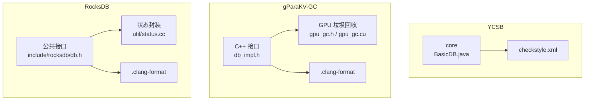
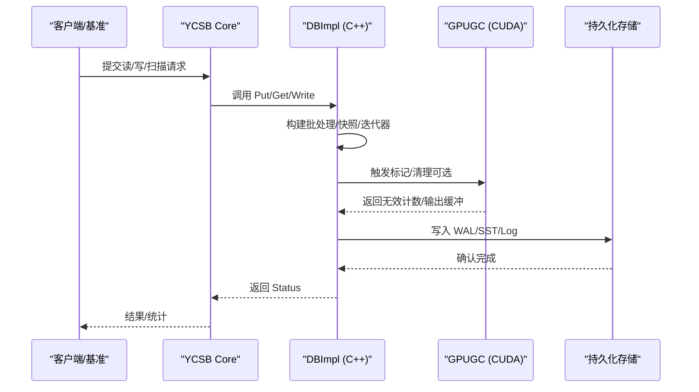
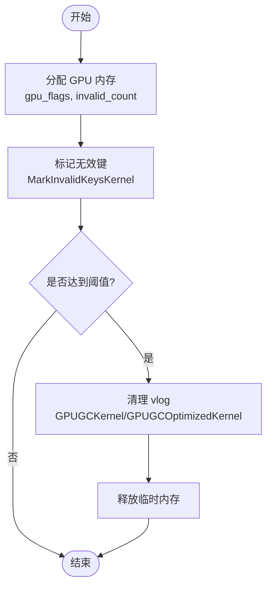
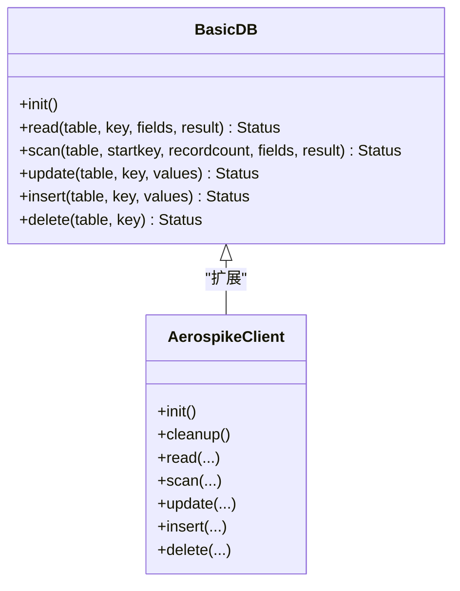
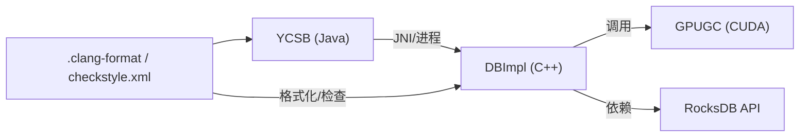

# 编码规范和风格

<cite>
**本文引用的文件**   
- [source/YCSB/checkstyle.xml](file://source/YCSB/checkstyle.xml)
- [source/gParaKV-GC-master/.clang-format](file://source/gParaKV-GC-master/.clang-format)
- [source/rocksdb/.clang-format](file://source/rocksdb/.clang-format)
- [source/gParaKV-GC-master/db/gpu_gc.h](file://source/gParaKV-GC-master/db/gpu_gc.h)
- [source/gParaKV-GC-master/db/gpu_gc.cu](file://source/gParaKV-GC-master/db/gpu_gc.cu)
- [source/gParaKV-GC-master/db/db_impl.h](file://source/gParaKV-GC-master/db/db_impl.h)
- [source/rocksdb/include/rocksdb/db.h](file://source/rocksdb/include/rocksdb/db.h)
- [source/rocksdb/util/status.cc](file://source/rocksdb/util/status.cc)
- [source/YCSB/core/src/main/java/site/ycsb/BasicDB.java](file://source/YCSB/core/src/main/java/site/ycsb/BasicDB.java)
- [source/YCSB/aerospike/src/main/java/site/ycsb/db/AerospikeClient.java](file://source/YCSB/aerospike/src/main/java/site/ycsb/db/AerospikeClient.java)
</cite>

## 目录
1. [引言](#引言)
2. [项目结构](#项目结构)
3. [核心组件](#核心组件)
4. [架构总览](#架构总览)
5. [详细组件分析](#详细组件分析)
6. [依赖关系分析](#依赖关系分析)
7. [性能考量](#性能考量)
8. [故障排查指南](#故障排查指南)
9. [结论](#结论)
10. [附录](#附录)

## 引言
本规范旨在为仓库中的 C++、CUDA 与 Java（YCSB）代码建立统一的编码标准与风格指南，覆盖命名约定、格式化、注释、错误处理模式、CUDA 内核编写与内存管理、线程组织与性能优化、代码检查工具使用（clang-format、checkstyle），以及重构建议与最佳实践。通过统一标准，提升可读性、可维护性与性能表现，确保所有开发者遵循一致的编码规范。

## 项目结构
仓库包含多个存储引擎与基准测试模块：
- YCSB：Java 基准框架，提供多种数据库绑定与核心运行逻辑
- gParaKV-GC：基于 LevelDB 的 GPU 加速垃圾回收实现，含 CUDA 内核
- RocksDB 及其衍生版本：高性能嵌入式键值存储库，具备完善的 C++ API 与工具链

**图表来源** 
- [source/YCSB/core/src/main/java/site/ycsb/BasicDB.java:1-200](file://source/YCSB/core/src/main/java/site/ycsb/BasicDB.java#L1-L200)
- [source/YCSB/checkstyle.xml:1-194](file://source/YCSB/checkstyle.xml#L1-L194)
- [source/gParaKV-GC-master/db/db_impl.h:1-200](file://source/gParaKV-GC-master/db/db_impl.h#L1-L200)
- [source/gParaKV-GC-master/db/gpu_gc.h:1-53](file://source/gParaKV-GC-master/db/gpu_gc.h#L1-L53)
- [source/gParaKV-GC-master/db/gpu_gc.cu:1-256](file://source/gParaKV-GC-master/db/gpu_gc.cu#L1-L256)
- [source/gParaKV-GC-master/.clang-format:1-19](file://source/gParaKV-GC-master/.clang-format#L1-L19)
- [source/rocksdb/include/rocksdb/db.h:1-200](file://source/rocksdb/include/rocksdb/db.h#L1-L200)
- [source/rocksdb/util/status.cc:1-167](file://source/rocksdb/util/status.cc#L1-L167)
- [source/rocksdb/.clang-format:1-6](file://source/rocksdb/.clang-format#L1-L6)

**章节来源**
- [source/YCSB/core/src/main/java/site/ycsb/BasicDB.java:1-200](file://source/YCSB/core/src/main/java/site/ycsb/BasicDB.java#L1-L200)
- [source/YCSB/checkstyle.xml:1-194](file://source/YCSB/checkstyle.xml#L1-L194)
- [source/gParaKV-GC-master/db/db_impl.h:1-200](file://source/gParaKV-GC-master/db/db_impl.h#L1-L200)
- [source/gParaKV-GC-master/db/gpu_gc.h:1-53](file://source/gParaKV-GC-master/db/gpu_gc.h#L1-L53)
- [source/gParaKV-GC-master/db/gpu_gc.cu:1-256](file://source/gParaKV-GC-master/db/gpu_gc.cu#L1-L256)
- [source/gParaKV-GC-master/.clang-format:1-19](file://source/gParaKV-GC-master/.clang-format#L1-L19)
- [source/rocksdb/include/rocksdb/db.h:1-200](file://source/rocksdb/include/rocksdb/db.h#L1-L200)
- [source/rocksdb/util/status.cc:1-167](file://source/rocksdb/util/status.cc#L1-L167)
- [source/rocksdb/.clang-format:1-6](file://source/rocksdb/.clang-format#L1-L6)

## 核心组件
- C++ 编码标准
  - 命名约定：类名采用大驼峰，成员变量小写前缀或下划线分隔；常量全大写；函数名动词+名词组合
  - 格式化：基于 Google 风格的 clang-format，统一缩进、行宽、括号位置与包含顺序
  - 注释：关键类与公共方法需 Javadoc/C++ 风格注释；复杂算法附流程图说明
  - 错误处理：统一 Status 类型返回，避免异常泛滥；对失败路径进行明确日志与清理
- CUDA 编程规范
  - 内核编写：显式线程索引计算、边界检查、原子操作与流同步；避免共享内存竞争
  - 内存管理：cudaMalloc/cudaFree 成对出现；Host-Device 数据拷贝最小化；合理使用 stream
  - 线程组织：按任务粒度划分 block/grid；合理设置 threadsPerBlock 与 blocksPerGrid
  - 性能优化：合并访问、减少分支发散、利用并行归约与批量拷贝
- Java 代码规范（YCSB）
  - 类设计：继承 site.ycsb.DB，实现 read/scan/update/insert/delete；配置通过 Properties 注入
  - 异常处理：捕获第三方异常并转换为 DBException；保持 Status.OK/ERROR 语义一致
  - 命名与格式：遵循 checkstyle 规则（行宽、缩进、导入、Javadoc）

**章节来源**
- [source/gParaKV-GC-master/.clang-format:1-19](file://source/gParaKV-GC-master/.clang-format#L1-L19)
- [source/rocksdb/.clang-format:1-6](file://source/rocksdb/.clang-format#L1-L6)
- [source/YCSB/checkstyle.xml:1-194](file://source/YCSB/checkstyle.xml#L1-L194)
- [source/gParaKV-GC-master/db/gpu_gc.cu:1-256](file://source/gParaKV-GC-master/db/gpu_gc.cu#L1-L256)
- [source/YCSB/core/src/main/java/site/ycsb/BasicDB.java:1-200](file://source/YCSB/core/src/main/java/site/ycsb/BasicDB.java#L1-L200)
- [source/YCSB/aerospike/src/main/java/site/ycsb/db/AerospikeClient.java:1-184](file://source/YCSB/aerospike/src/main/java/site/ycsb/db/AerospikeClient.java#L1-L184)

## 架构总览
整体架构由上层基准（YCSB）、中间层存储引擎（LevelDB/RocksDB）与底层 GPU 加速（CUDA）组成。C++ 层暴露稳定接口，CUDA 层负责热点计算与内存搬运，Java 层驱动工作负载并对接不同后端。

**图表来源** 
- [source/gParaKV-GC-master/db/db_impl.h:1-200](file://source/gParaKV-GC-master/db/db_impl.h#L1-L200)
- [source/gParaKV-GC-master/db/gpu_gc.cu:1-256](file://source/gParaKV-GC-master/db/gpu_gc.cu#L1-L256)
- [source/rocksdb/include/rocksdb/db.h:1-200](file://source/rocksdb/include/rocksdb/db.h#L1-L200)
- [source/YCSB/core/src/main/java/site/ycsb/BasicDB.java:1-200](file://source/YCSB/core/src/main/java/site/ycsb/BasicDB.java#L1-L200)

## 详细组件分析

### C++ 编码标准与风格
- 命名约定
  - 类与结构体：大驼峰（如 DBImpl、CompactionStats）
  - 成员变量：小写下划线或前缀区分（如 dbname_、table_cache_）
  - 常量：全大写（如 kDefaultColumnFamilyName）
  - 函数：动词+名词（如 Open、Put、Delete、NewIterator）
- 格式化
  - 基于 Google 风格，统一缩进、行宽、括号位置与包含顺序
  - IncludeCategories 控制头文件分组排序
- 注释
  - 公共接口与方法需清晰描述参数、返回值与副作用
  - 复杂逻辑（如压缩、恢复）附加流程说明
- 错误处理
  - 使用 Status 类型返回错误，避免异常传播
  - 对失败路径进行日志记录与资源释放

**章节来源**
- [source/gParaKV-GC-master/db/db_impl.h:1-200](file://source/gParaKV-GC-master/db/db_impl.h#L1-L200)
- [source/rocksdb/include/rocksdb/db.h:1-200](file://source/rocksdb/include/rocksdb/db.h#L1-L200)
- [source/rocksdb/util/status.cc:1-167](file://source/rocksdb/util/status.cc#L1-L167)
- [source/gParaKV-GC-master/.clang-format:1-19](file://source/gParaKV-GC-master/.clang-format#L1-L19)

### CUDA 编程规范与实践
- 内核编写标准
  - 显式线程索引与边界检查，避免越界访问
  - 原子操作用于并发更新（如 atomicAdd、atomicCAS）
  - 流同步确保执行顺序（CHECK(cudaStreamSynchronize(stream))）
- 内存管理
  - cudaMalloc/cudaFree 成对出现，析构函数中释放
  - Host-Device 数据拷贝最小化，批量传输
  - 合理使用全局计数器与标志位（如 invalid_count、gpu_flags）
- 线程组织
  - threadsPerBlock=1024，blocksPerGrid=(n + threadsPerBlock - 1)/threadsPerBlock
  - 优化内核中每个线程处理多个元素（process_num_per_thread）
- 性能优化
  - 合并内存访问，减少分支发散
  - 使用 thrust/自定义核函数进行高效归约与过滤
  - 统计数据传输时间以评估优化效果

**图表来源** 
- [source/gParaKV-GC-master/db/gpu_gc.cu:1-256](file://source/gParaKV-GC-master/db/gpu_gc.cu#L1-L256)

**章节来源**
- [source/gParaKV-GC-master/db/gpu_gc.h:1-53](file://source/gParaKV-GC-master/db/gpu_gc.h#L1-L53)
- [source/gParaKV-GC-master/db/gpu_gc.cu:1-256](file://source/gParaKV-GC-master/db/gpu_gc.cu#L1-L256)

### Java 代码规范（YCSB）
- 类设计
  - 继承 site.ycsb.DB，实现核心 CRUD 方法
  - 配置通过 Properties 注入，支持默认值与校验
  - 使用 ThreadLocal 与静态计数器优化性能
- 异常处理
  - 捕获第三方异常并转换为 DBException
  - 返回 Status.OK/ERROR 保持一致性
- 命名与格式
  - 遵循 checkstyle 规则：行宽 120、缩进 2、导入顺序、Javadoc 要求

**图表来源** 
- [source/YCSB/core/src/main/java/site/ycsb/BasicDB.java:1-200](file://source/YCSB/core/src/main/java/site/ycsb/BasicDB.java#L1-L200)
- [source/YCSB/aerospike/src/main/java/site/ycsb/db/AerospikeClient.java:1-184](file://source/YCSB/aerospike/src/main/java/site/ycsb/db/AerospikeClient.java#L1-L184)

**章节来源**
- [source/YCSB/core/src/main/java/site/ycsb/BasicDB.java:1-200](file://source/YCSB/core/src/main/java/site/ycsb/BasicDB.java#L1-L200)
- [source/YCSB/aerospike/src/main/java/site/ycsb/db/AerospikeClient.java:1-184](file://source/YCSB/aerospike/src/main/java/site/ycsb/db/AerospikeClient.java#L1-L184)
- [source/YCSB/checkstyle.xml:1-194](file://source/YCSB/checkstyle.xml#L1-L194)

## 依赖关系分析
- C++ 层依赖 LevelDB/RocksDB 接口，CUDA 层通过 nvcc 编译并与 C++ 链接
- YCSB 通过 Java 绑定调用 C++ 接口或独立进程通信
- 配置文件（.clang-format、checkstyle.xml）在构建阶段强制执行风格检查

**图表来源** 
- [source/gParaKV-GC-master/db/db_impl.h:1-200](file://source/gParaKV-GC-master/db/db_impl.h#L1-L200)
- [source/gParaKV-GC-master/db/gpu_gc.cu:1-256](file://source/gParaKV-GC-master/db/gpu_gc.cu#L1-L256)
- [source/rocksdb/include/rocksdb/db.h:1-200](file://source/rocksdb/include/rocksdb/db.h#L1-L200)
- [source/YCSB/core/src/main/java/site/ycsb/BasicDB.java:1-200](file://source/YCSB/core/src/main/java/site/ycsb/BasicDB.java#L1-L200)
- [source/YCSB/checkstyle.xml:1-194](file://source/YCSB/checkstyle.xml#L1-L194)
- [source/gParaKV-GC-master/.clang-format:1-19](file://source/gParaKV-GC-master/.clang-format#L1-L19)

**章节来源**
- [source/gParaKV-GC-master/db/db_impl.h:1-200](file://source/gParaKV-GC-master/db/db_impl.h#L1-L200)
- [source/gParaKV-GC-master/db/gpu_gc.cu:1-256](file://source/gParaKV-GC-master/db/gpu_gc.cu#L1-L256)
- [source/rocksdb/include/rocksdb/db.h:1-200](file://source/rocksdb/include/rocksdb/db.h#L1-L200)
- [source/YCSB/core/src/main/java/site/ycsb/BasicDB.java:1-200](file://source/YCSB/core/src/main/java/site/ycsb/BasicDB.java#L1-L200)
- [source/YCSB/checkstyle.xml:1-194](file://source/YCSB/checkstyle.xml#L1-L194)
- [source/gParaKV-GC-master/.clang-format:1-19](file://source/gParaKV-GC-master/.clang-format#L1-L19)

## 性能考量
- C++ 层
  - 避免不必要的对象复制，使用引用与移动语义
  - 批量操作减少系统调用开销
  - 缓存热点数据，减少磁盘 I/O
- CUDA 层
  - 合并内存访问，提高带宽利用率
  - 减少线程分支发散，提升指令吞吐
  - 异步流重叠计算与数据传输
- Java 层
  - 复用对象（如 StringBuilder、ThreadLocal）
  - 避免频繁 GC，控制对象生命周期
  - 使用连接池与超时配置

[本节为通用指导，无需特定文件来源]

## 故障排查指南
- C++ 错误处理
  - 检查 Status 返回值，记录错误上下文
  - 使用断言与日志定位问题（如 assert(false)）
- CUDA 调试
  - 使用 cuda-memcheck 检测内存错误
  - 打印线程索引与边界条件
  - 逐步验证 kernel 输出与主机端同步
- Java 异常
  - 捕获并记录第三方异常堆栈
  - 验证配置参数与网络连接

**章节来源**
- [source/rocksdb/util/status.cc:1-167](file://source/rocksdb/util/status.cc#L1-L167)
- [source/YCSB/aerospike/src/main/java/site/ycsb/db/AerospikeClient.java:1-184](file://source/YCSB/aerospike/src/main/java/site/ycsb/db/AerospikeClient.java#L1-L184)

## 结论
本规范为仓库中的 C++、CUDA 与 Java 代码提供了统一的编码标准与最佳实践。通过遵循命名约定、格式化规则、错误处理模式与性能优化策略，可显著提升代码质量与系统稳定性。建议将 clang-format 与 checkstyle 集成到 CI/CD 流程中，确保每次提交都符合规范。

[本节为总结性内容，无需特定文件来源]

## 附录
- 代码检查工具使用
  - clang-format：基于 .clang-format 自动格式化 C++ 代码
  - checkstyle：基于 checkstyle.xml 检查 Java 代码风格
- 重构建议
  - 拆分长函数，提取公共逻辑
  - 使用智能指针与 RAII 管理资源
  - 增加单元测试覆盖关键路径

[本节为补充信息，无需特定文件来源]