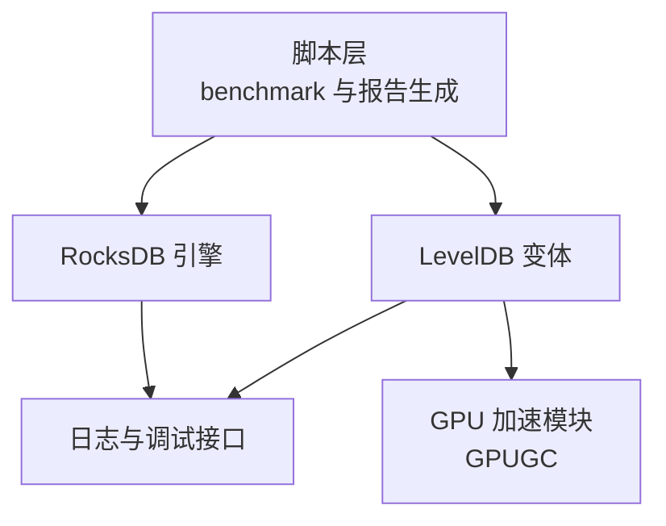
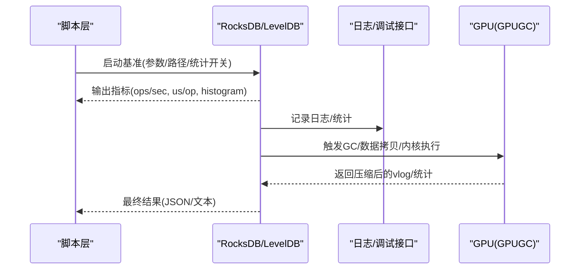
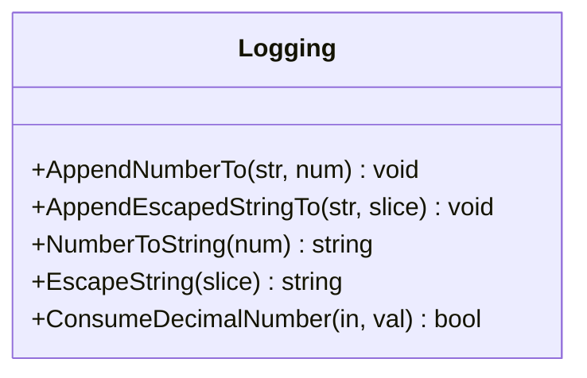
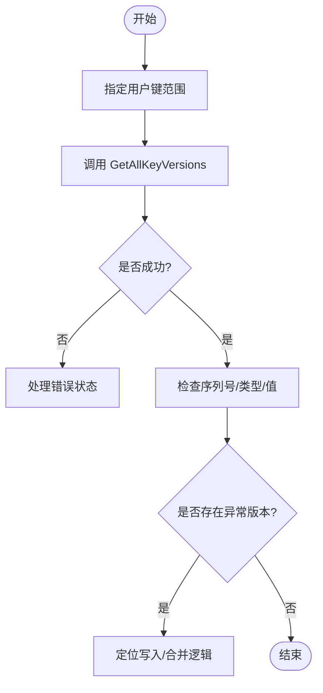
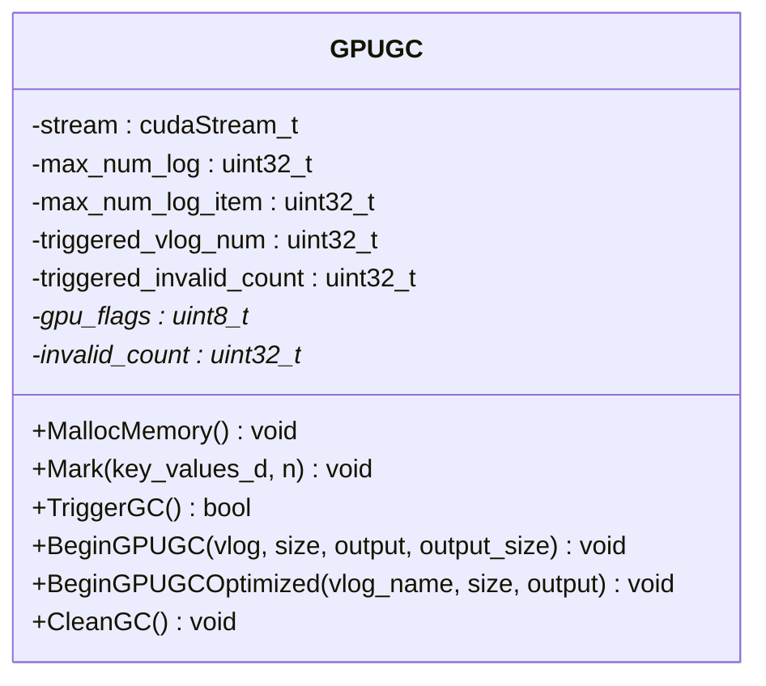
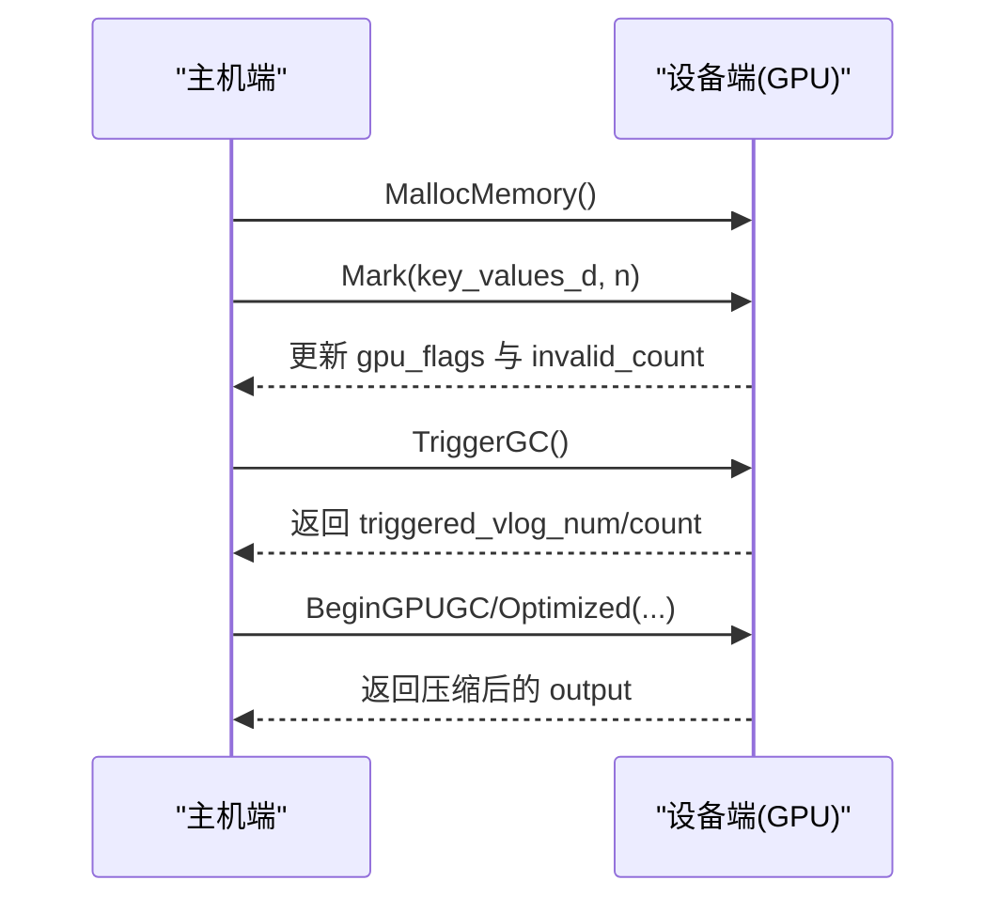
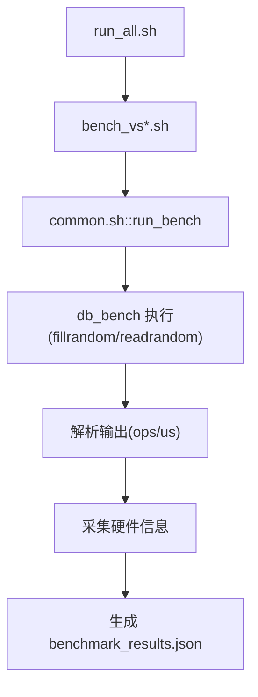
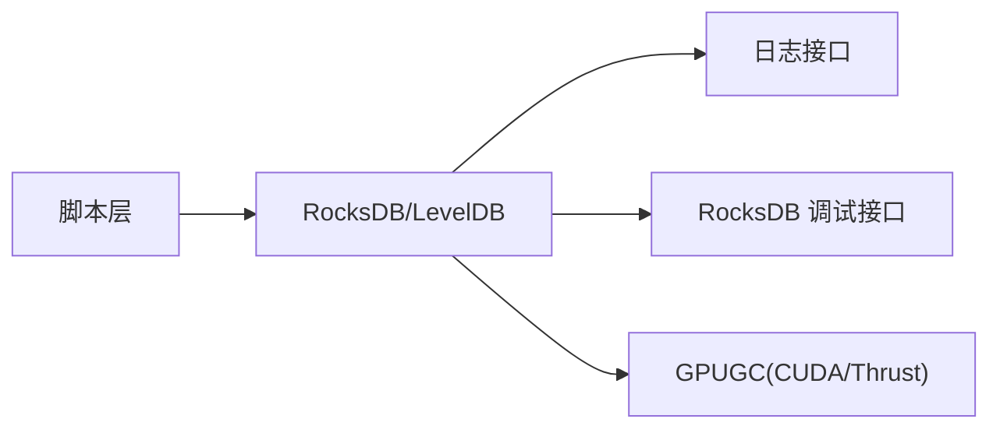

# 调试技巧和工具

<cite>
**本文引用的文件**   
- [common.sh](file://script/common.sh)
- [run_all.sh](file://script/run_all.sh)
- [logging.h](file://source/gParaKV-GC-master/util/logging.h)
- [logging.cc](file://source/gParaKV-GC-master/util/logging.cc)
- [debug.h](file://source/rocksdb/include/rocksdb/utilities/debug.h)
- [gpu_gc.h](file://source/gParaKV-GC-master/db/gpu_gc.h)
- [gpu_gc.cu](file://source/gParaKV-GC-master/db/gpu_gc.cu)
</cite>

## 目录
1. [简介](#简介)
2. [项目结构](#项目结构)
3. [核心组件](#核心组件)
4. [架构总览](#架构总览)
5. [详细组件分析](#详细组件分析)
6. [依赖关系分析](#依赖关系分析)
7. [性能注意事项](#性能注意事项)
8. [故障排查指南](#故障排查指南)
9. [结论](#结论)
10. [附录](#附录)

## 简介
本指南面向开发者与运维人员，提供针对本项目（含 RocksDB、LevelDB 变体与 GPU 加速 GC）的完整调试技巧与工具使用手册。内容覆盖：
- GDB 断点、变量查看、调用栈分析与内存调试
- 日志系统配置与自定义输出、日志文件分析
- 性能分析工具（perf、valgrind、CUDA Profiler）使用方法
- 常见问题定位（内存泄漏、死锁、性能瓶颈、GPU 相关问题）
- 自动化诊断脚本与实战案例流程

目标是帮助读者快速定位并解决开发与运行中的问题。

## 项目结构
本项目包含多个子工程与脚本：
- script：基准测试与结果收集脚本，统一环境变量与输出格式
- source：包含 RocksDB、LevelDB 及其衍生版本，以及 GPU 加速相关代码
- 其他：YCSB、文档、输出等

图表来源
- [common.sh:1-196](file://script/common.sh#L1-L196)
- [run_all.sh:1-19](file://script/run_all.sh#L1-L19)
- [logging.h:1-45](file://source/gParaKV-GC-master/util/logging.h#L1-L45)
- [debug.h:1-45](file://source/rocksdb/include/rocksdb/utilities/debug.h#L1-L45)
- [gpu_gc.h:1-53](file://source/gParaKV-GC-master/db/gpu_gc.h#L1-L53)

章节来源
- [common.sh:1-196](file://script/common.sh#L1-L196)
- [run_all.sh:1-19](file://script/run_all.sh#L1-L19)

## 核心组件
- 日志子系统（LevelDB 风格）
  - 提供数字/字符串格式化、转义与解析能力，便于构造可读日志与统计输出
  - 关键接口位于 util/logging.{h,cc}
- RocksDB 调试接口
  - 提供键版本查询等调试能力，便于定位数据一致性与版本问题
  - 关键头文件 include/rocksdb/utilities/debug.h
- GPU 垃圾回收（GPUGC）
  - 在 GPU 上标记无效 KV、触发 GC、压缩 vlog，减少无效写入
  - 关键实现位于 db/gpu_gc.{h,cu}
- 基准与自动化脚本
  - common.sh 封装了参数、硬件信息采集、结果 JSON 生成
  - run_all.sh 顺序执行不同 value_size 的基准

章节来源
- [logging.h:1-45](file://source/gParaKV-GC-master/util/logging.h#L1-L45)
- [logging.cc:1-83](file://source/gParaKV-GC-master/util/logging.cc#L1-L83)
- [debug.h:1-45](file://source/rocksdb/include/rocksdb/utilities/debug.h#L1-L45)
- [gpu_gc.h:1-53](file://source/gParaKV-GC-master/db/gpu_gc.h#L1-L53)
- [gpu_gc.cu:1-200](file://source/gParaKV-GC-master/db/gpu_gc.cu#L1-L200)
- [common.sh:1-196](file://script/common.sh#L1-L196)
- [run_all.sh:1-19](file://script/run_all.sh#L1-L19)

## 架构总览
下图展示从脚本到引擎与 GPU 模块的交互关系，以及日志与调试接口的接入点。

图表来源
- [common.sh:1-196](file://script/common.sh#L1-L196)
- [logging.h:1-45](file://source/gParaKV-GC-master/util/logging.h#L1-L45)
- [debug.h:1-45](file://source/rocksdb/include/rocksdb/utilities/debug.h#L1-L45)
- [gpu_gc.cu:1-200](file://source/gParaKV-GC-master/db/gpu_gc.cu#L1-L200)

## 详细组件分析

### 日志子系统（LevelDB 风格）
- 功能要点
  - 数字与字符串格式化、转义，保证日志可读性
  - 十进制数解析，用于日志/统计字段提取
- 使用建议
  - 将关键路径（如 GC 触发、数据拷贝、内核同步）加入日志
  - 结合脚本输出的 JSON 与日志时间戳进行关联分析

图表来源
- [logging.h:1-45](file://source/gParaKV-GC-master/util/logging.h#L1-L45)
- [logging.cc:1-83](file://source/gParaKV-GC-master/util/logging.cc#L1-L83)

章节来源
- [logging.h:1-45](file://source/gParaKV-GC-master/util/logging.h#L1-L45)
- [logging.cc:1-83](file://source/gParaKV-GC-master/util/logging.cc#L1-L83)

### RocksDB 调试接口
- 功能要点
  - 提供按用户键范围获取所有版本的能力，便于定位重复/过期键
- 使用建议
  - 在出现数据不一致或异常时，限定 key 范围调用接口，检查 sequence/type 变化
  - 配合日志与监控指标缩小问题范围

图表来源
- [debug.h:1-45](file://source/rocksdb/include/rocksdb/utilities/debug.h#L1-L45)

章节来源
- [debug.h:1-45](file://source/rocksdb/include/rocksdb/utilities/debug.h#L1-L45)

### GPU 垃圾回收（GPUGC）
- 功能要点
  - 在 GPU 上标记无效 KV、原子计数、触发阈值判断、压缩 vlog
  - 支持基础版与优化版两种内核路径
- 关键流程
  - 分配 GPU 内存与流
  - Mark：比较相邻 KV，标记无效位图并原子计数
  - TriggerGC：基于阈值选择待清理 vlog
  - BeginGPUGC/Optimized：根据标志过滤并复制有效项

图表来源
- [gpu_gc.h:1-53](file://source/gParaKV-GC-master/db/gpu_gc.h#L1-L53)
- [gpu_gc.cu:1-200](file://source/gParaKV-GC-master/db/gpu_gc.cu#L1-L200)

图表来源
- [gpu_gc.cu:1-200](file://source/gParaKV-GC-master/db/gpu_gc.cu#L1-L200)

章节来源
- [gpu_gc.h:1-53](file://source/gParaKV-GC-master/db/gpu_gc.h#L1-L53)
- [gpu_gc.cu:1-200](file://source/gParaKV-GC-master/db/gpu_gc.cu#L1-L200)

### 基准与自动化脚本
- 功能要点
  - 统一环境变量（LD_LIBRARY_PATH）、默认参数（key/value size、线程、缓存等）
  - 采集硬件信息（CPU/GPU/OS），生成结构化 JSON 结果
  - 顺序执行多组 value_size 的基准
- 使用建议
  - 通过修改 common.sh 的参数快速切换场景
  - 结合 perf/CUDA profiler 对 fillrandom/readrandom 阶段进行热点分析

图表来源
- [run_all.sh:1-19](file://script/run_all.sh#L1-L19)
- [common.sh:1-196](file://script/common.sh#L1-L196)

章节来源
- [run_all.sh:1-19](file://script/run_all.sh#L1-L19)
- [common.sh:1-196](file://script/common.sh#L1-L196)

## 依赖关系分析
- 脚本层依赖 RocksDB/LevelDB 可执行与库路径（LD_LIBRARY_PATH）
- LevelDB 风格日志被多处复用；RocksDB 调试接口独立于日志
- GPU 模块依赖 CUDA 运行时与 Thrust，与主机端通过显式拷贝与流同步交互

图表来源
- [common.sh:1-196](file://script/common.sh#L1-L196)
- [logging.h:1-45](file://source/gParaKV-GC-master/util/logging.h#L1-L45)
- [debug.h:1-45](file://source/rocksdb/include/rocksdb/utilities/debug.h#L1-L45)
- [gpu_gc.cu:1-200](file://source/gParaKV-GC-master/db/gpu_gc.cu#L1-L200)

章节来源
- [common.sh:1-196](file://script/common.sh#L1-L196)
- [logging.h:1-45](file://source/gParaKV-GC-master/util/logging.h#L1-L45)
- [debug.h:1-45](file://source/rocksdb/include/rocksdb/utilities/debug.h#L1-L45)
- [gpu_gc.cu:1-200](file://source/gParaKV-GC-master/db/gpu_gc.cu#L1-L200)

## 性能注意事项
- 基准参数调优
  - 调整 write_buffer_size、cache_size、threads 以匹配工作负载
  - 开启 statistics/histogram 以便后续分析
- GPU 路径
  - 关注数据拷贝时间与内核执行时间，避免频繁同步
  - 合理设置 clean_threshold 控制 GC 触发频率
- 日志开销
  - 生产环境降低日志级别，仅在问题复现时提升级别

[本节为通用指导，不直接分析具体文件]

## 故障排查指南

### GDB 调试
- 启动与基本操作
  - gdb ./your_binary
  - break <函数名/行号>
  - run / r
  - continue / c
  - next / n，step / s
  - print / p 变量，display 自动打印
  - bt 查看调用栈，info locals 查看局部变量
- 多线程与信号
  - info threads，thread <id>
  - handle SIGXXX nostop noprint
- 内存调试
  - 启用 AddressSanitizer 编译选项（-fsanitize=address）
  - 使用 gcore 生成 core dump 后分析

章节来源
- [common.sh:1-196](file://script/common.sh#L1-L196)
- [run_all.sh:1-19](file://script/run_all.sh#L1-L19)

### 日志系统使用
- 级别与输出
  - 在关键路径插入日志，结合 NumberToString/EscapedString 构建可读输出
  - 将日志与 JSON 结果的时间戳对齐，便于关联
- 日志分析
  - 使用 grep/awk/sed 提取关键字段（如 ops/sec、us/op、GC 触发）
  - 结合脚本生成的 benchmark_results.json 做横向对比

章节来源
- [logging.h:1-45](file://source/gParaKV-GC-master/util/logging.h#L1-L45)
- [logging.cc:1-83](file://source/gParaKV-GC-master/util/logging.cc#L1-L83)
- [common.sh:1-196](file://script/common.sh#L1-L196)

### 性能分析工具
- perf
  - 火焰图：perf record -g -F 99 -- ./your_binary；perf report；perf script | stackcollapse-perf.pl | flamegraph.pl > out.svg
  - 热点函数：perf top -p <pid>
- valgrind
  - 内存检测：valgrind --tool=memcheck --leak-check=full ./your_binary
  - 耗时分析：valgrind --tool=callgrind ./your_binary；kcachegrind 查看
- CUDA Profiler
  - nvprof/nvprof 替代工具：nvprof ./your_binary
  - 关注 memcpy H2D/D2H、kernel 执行时长、stream 同步点

章节来源
- [gpu_gc.cu:1-200](file://source/gParaKV-GC-master/db/gpu_gc.cu#L1-L200)
- [common.sh:1-196](file://script/common.sh#L1-L196)

### 常见问题定位
- 内存泄漏
  - 使用 ASan/Valgrind 定位未释放内存；检查 GPU 内存分配/释放配对
- 死锁
  - 使用 perf/strace 观察阻塞；检查原子操作与 stream 同步顺序
- 性能瓶颈
  - 使用 perf/Callgrind 定位热点；评估 I/O、CPU、GPU 利用率
- GPU 相关问题
  - 检查核函数边界条件、索引计算、原子竞争；确认 stream 同步与错误码

章节来源
- [gpu_gc.cu:1-200](file://source/gParaKV-GC-master/db/gpu_gc.cu#L1-L200)
- [common.sh:1-196](file://script/common.sh#L1-L196)

### 调试脚本与自动化诊断
- 一键运行多场景
  - bash script/run_all.sh 顺序执行不同 value_size 的基准
- 结果采集与分析
  - 读取 output/vs*/benchmark_results.json 汇总吞吐、延迟、空间放大率
  - 结合 nvidia-smi 采样 GPU 利用率与显存占用

章节来源
- [run_all.sh:1-19](file://script/run_all.sh#L1-L19)
- [common.sh:1-196](file://script/common.sh#L1-L196)

### 实际调试案例与流程
- 案例一：GC 触发频繁导致吞吐下降
  - 现象：fillrandom 阶段 ops/sec 波动大
  - 步骤：
    - 提升日志级别，观察 GC 触发次数与无效计数
    - 调整 clean_threshold，减少不必要的 GC
    - 使用 perf 定位 Mark/TriggerGC 热点
- 案例二：数据不一致
  - 现象：读回值与预期不符
  - 步骤：
    - 使用 RocksDB 调试接口按 key 范围拉取版本
    - 比对 sequence/type，定位写入/合并逻辑问题
    - 结合日志与 perf 验证修复效果

[本节为方法论与流程说明，不直接引用具体代码片段]

## 结论
通过结合 GDB、日志系统、性能分析工具与自动化脚本，可以高效定位与解决 RocksDB/LevelDB 及 GPU 加速模块中的问题。建议在开发中常态化开启统计与日志，在问题复现场景下按需提升级别，并结合 perf/Valgrind/CUDA Profiler 形成闭环。

[本节为总结，不直接分析具体文件]

## 附录
- 常用命令速查
  - GDB：break、run、bt、print、info threads
  - Perf：record/report/top/script
  - Valgrind：memcheck/callgrind
  - CUDA：nvprof/nvtx 标注关键区间
- 脚本参数参考
  - key_size、value_size、threads、write_buffer_size、cache_size、statistics/histogram
  - LD_LIBRARY_PATH 指向 rocksdb/build

[本节为补充信息，不直接分析具体文件]