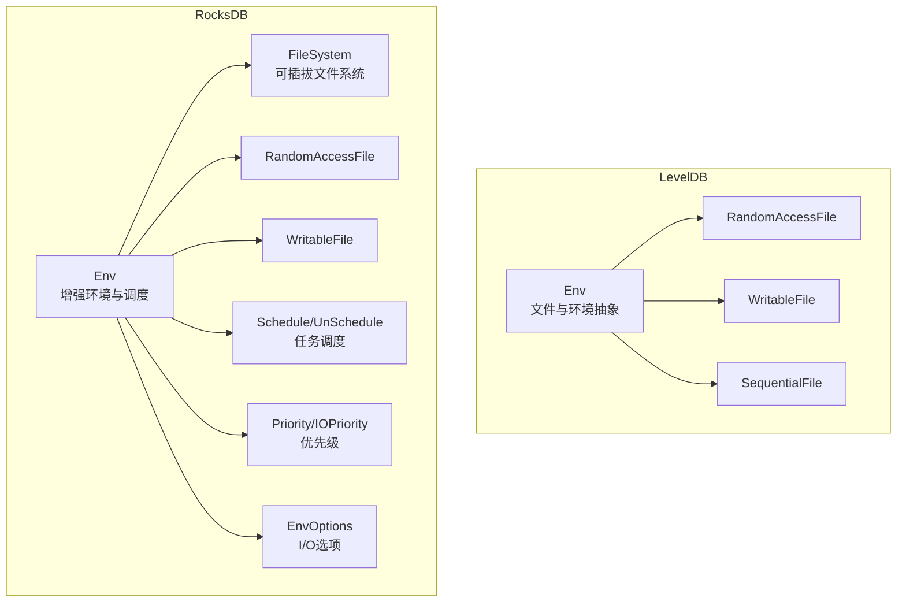
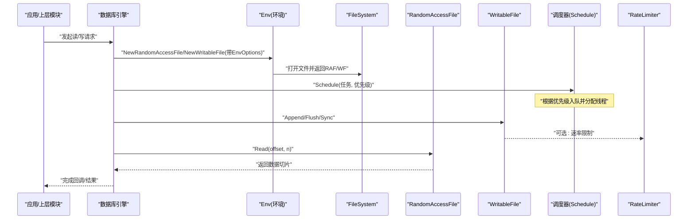
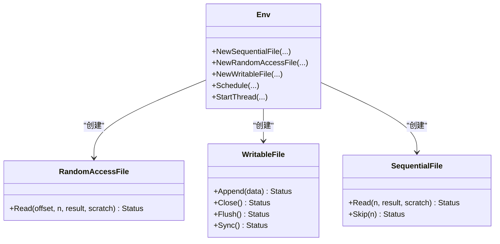
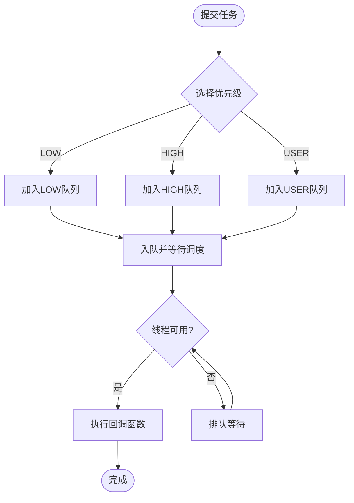
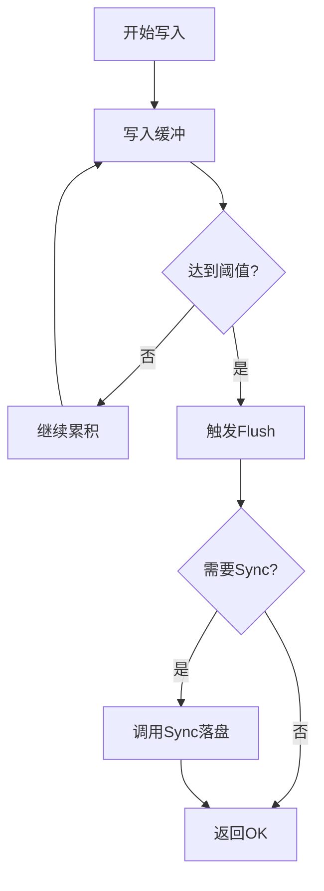
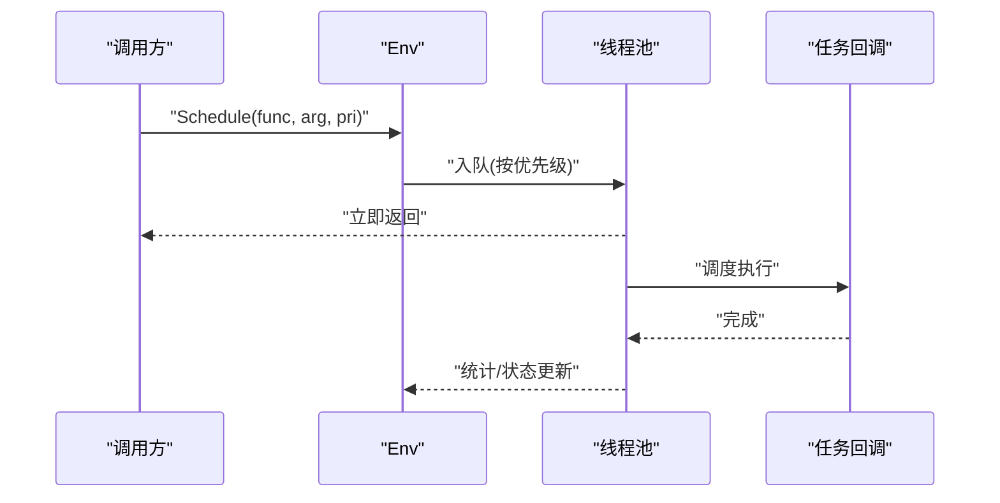
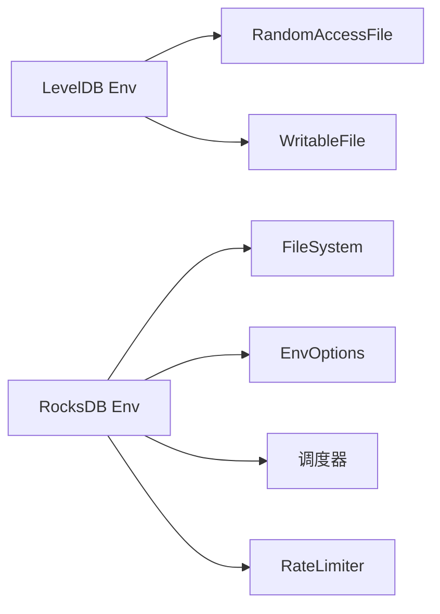

# I/O调度系统

<cite>
**本文引用的文件**   
- [leveldb/env.h](file://source/leveldb-main/include/leveldb/env.h)
- [rocksdb/env.h](file://source/rocksdb/include/rocksdb/env.h)
</cite>

## 目录
1. [简介](#简介)
2. [项目结构](#项目结构)
3. [核心组件](#核心组件)
4. [架构总览](#架构总览)
5. [详细组件分析](#详细组件分析)
6. [依赖关系分析](#依赖关系分析)
7. [性能考量](#性能考量)
8. [故障排查指南](#故障排查指南)
9. [结论](#结论)
10. [附录](#附录)

## 简介
本文件面向I/O调度系统的架构与实现，聚焦异步I/O模型、文件读写抽象层、请求队列与并发控制策略，以及RandomAccessFile与WritableFile接口的关键特性（预读、写缓冲、批量优化）。同时解释IO Dispatcher的任务调度、优先级管理与资源限制机制，并提供监控调优方法、不同存储介质的适配策略与自定义后端扩展指南。

## 项目结构
仓库包含多个数据库与工具子项目，其中与I/O调度直接相关的接口定义集中在：
- LevelDB的Env与文件抽象接口
- RocksDB的Env、文件系统与线程池调度接口

图表来源
- [leveldb/env.h:51-290](file://source/leveldb-main/include/leveldb/env.h#L51-L290)
- [rocksdb/env.h:151-800](file://source/rocksdb/include/rocksdb/env.h#L151-L800)

章节来源
- [leveldb/env.h:51-290](file://source/leveldb-main/include/leveldb/env.h#L51-L290)
- [rocksdb/env.h:151-800](file://source/rocksdb/include/rocksdb/env.h#L151-L800)

## 核心组件
- Env抽象层
  - LevelDB Env提供基础的文件系统操作与线程调度接口，包括创建顺序/随机访问/可写文件、目录操作、锁、日志、时间等。
  - RocksDB Env在LevelDB基础上扩展了EnvOptions、优先级调度、线程池管理、文件系统抽象、速率限制器集成等。
- 文件抽象
  - RandomAccessFile：支持多线程并发读取，按偏移读取数据。
  - WritableFile：支持Append/Close/Flush/Sync，要求内部缓冲以合并小写入。
  - SequentialFile：顺序读取与Skip跳过。
- 调度与并发
  - Schedule/StartThread：后台任务与新线程。
  - Priority/IOPriority：区分线程池与I/O优先级。
  - UnSchedule/ReserveThreads/ReleaseThreads：队列管理与资源预留。
- 选项与优化
  - EnvOptions：mmap/O_DIRECT/fallocate/bytes_per_sync/compaction_readahead_size/writable_file_max_buffer_size/rate_limiter等。

章节来源
- [leveldb/env.h:51-290](file://source/leveldb-main/include/leveldb/env.h#L51-L290)
- [rocksdb/env.h:76-141](file://source/rocksdb/include/rocksdb/env.h#L76-L141)
- [rocksdb/env.h:432-444](file://source/rocksdb/include/rocksdb/env.h#L432-L444)
- [rocksdb/env.h:598-652](file://source/rocksdb/include/rocksdb/env.h#L598-L652)

## 架构总览
下图展示从上层调用到文件抽象与调度器的整体流程，体现异步I/O与优先级控制。

图表来源
- [rocksdb/env.h:233-267](file://source/rocksdb/include/rocksdb/env.h#L233-L267)
- [rocksdb/env.h:598-618](file://source/rocksdb/include/rocksdb/env.h#L598-L618)
- [leveldb/env.h:74-96](file://source/leveldb-main/include/leveldb/env.h#L74-L96)

## 详细组件分析

### 文件抽象接口与实现要点
- RandomAccessFile
  - 并发安全：允许多线程并发读取。
  - 读取语义：按offset+n读取，返回Slice；底层可实现预读、缓存、零拷贝等优化。
- WritableFile
  - 缓冲合并：对多次小Append进行合并，减少系统调用次数。
  - 持久化：Flush与Sync分别用于刷新缓冲区与落盘保证。
- SequentialFile
  - 顺序读取与Skip：适合WAL/日志扫描场景。

图表来源
- [leveldb/env.h:221-290](file://source/leveldb-main/include/leveldb/env.h#L221-L290)
- [rocksdb/env.h:233-267](file://source/rocksdb/include/rocksdb/env.h#L233-L267)

章节来源
- [leveldb/env.h:221-290](file://source/leveldb-main/include/leveldb/env.h#L221-L290)
- [rocksdb/env.h:233-267](file://source/rocksdb/include/rocksdb/env.h#L233-L267)

### 异步I/O与调度器(IO Dispatcher)
- 任务调度
  - Schedule：将函数与参数提交到指定优先级的线程池执行。
  - StartThread：创建新线程执行一次性任务。
  - UnSchedule：尝试从队列移除未执行的作业。
- 优先级管理
  - Priority：BOTTOM/LOW/HIGH/USER/TOTAL。
  - IOPriority：IO_LOW/IO_MID/IO_HIGH/IO_USER。
- 资源限制
  - ReserveThreads/ReleaseThreads：动态调整线程池规模。
  - GetThreadPoolQueueLen：观察队列长度，辅助背压与限流。
  - RateLimiter：通过EnvOptions.rate_limiter接入带宽/延迟限制。

图表来源
- [rocksdb/env.h:598-652](file://source/rocksdb/include/rocksdb/env.h#L598-L652)
- [rocksdb/env.h:432-444](file://source/rocksdb/include/rocksdb/env.h#L432-L444)

章节来源
- [rocksdb/env.h:598-652](file://source/rocksdb/include/rocksdb/env.h#L598-L652)
- [rocksdb/env.h:432-444](file://source/rocksdb/include/rocksdb/env.h#L432-L444)

### 写缓冲与批量优化
- 写缓冲
  - WritableFile内部聚合多次Append，降低系统调用开销。
  - bytes_per_sync控制周期性刷盘频率，平衡吞吐与持久化。
- 预分配与直写
  - allow_fallocate与fallocate_with_keep_size提升大文件写入稳定性与性能。
  - use_direct_reads/use_direct_writes绕过内核页缓存，适用于高吞吐场景。
- 内存映射
  - use_mmap_reads/use_mmap_writes利用mmap提升随机读写效率（注意32位系统限制）。

图表来源
- [rocksdb/env.h:76-141](file://source/rocksdb/include/rocksdb/env.h#L76-L141)
- [leveldb/env.h:277-290](file://source/leveldb-main/include/leveldb/env.h#L277-L290)

章节来源
- [rocksdb/env.h:76-141](file://source/rocksdb/include/rocksdb/env.h#L76-L141)
- [leveldb/env.h:277-290](file://source/leveldb-main/include/leveldb/env.h#L277-L290)

### 预读机制与读取优化
- compaction_readahead_size：压缩阶段预读大小，提升顺序扫描吞吐。
- mmap与direct I/O：根据工作负载选择合适模式。
- 并发读取：RandomAccessFile允许并发访问，避免锁竞争。

章节来源
- [rocksdb/env.h:76-141](file://source/rocksdb/include/rocksdb/env.h#L76-L141)
- [leveldb/env.h:252-272](file://source/leveldb-main/include/leveldb/env.h#L252-L272)

### IO Dispatcher工作机制
- 任务入队：根据优先级选择队列，支持UnSchedule取消未执行任务。
- 线程池管理：SetBackgroundThreads/IncBackgroundThreadsIfNeeded动态扩缩容。
- 优先级隔离：不同优先级任务互不影响，保障关键路径延迟。
- 资源限制：结合RateLimiter限制I/O带宽或请求数。

图表来源
- [rocksdb/env.h:598-618](file://source/rocksdb/include/rocksdb/env.h#L598-L618)
- [rocksdb/env.h:638-652](file://source/rocksdb/include/rocksdb/env.h#L638-L652)

章节来源
- [rocksdb/env.h:598-652](file://source/rocksdb/include/rocksdb/env.h#L598-L652)

## 依赖关系分析
- LevelDB Env为轻量级抽象，主要暴露文件与环境能力。
- RocksDB Env在LevelDB基础上引入：
  - EnvOptions：细粒度I/O行为控制。
  - FileSystem：可插拔文件系统抽象。
  - 线程池与优先级调度：更完善的后台任务管理。
  - RateLimiter：统一的速率限制入口。

图表来源
- [leveldb/env.h:51-290](file://source/leveldb-main/include/leveldb/env.h#L51-L290)
- [rocksdb/env.h:151-800](file://source/rocksdb/include/rocksdb/env.h#L151-L800)

章节来源
- [leveldb/env.h:51-290](file://source/leveldb-main/include/leveldb/env.h#L51-L290)
- [rocksdb/env.h:151-800](file://source/rocksdb/include/rocksdb/env.h#L151-L800)

## 性能考量
- 选择合适的I/O模式
  - 高吞吐顺序写：启用use_direct_writes与allow_fallocate，合理设置bytes_per_sync。
  - 随机读密集：use_mmap_reads配合compaction_readahead_size提升命中与吞吐。
- 写缓冲与同步策略
  - 增大writable_file_max_buffer_size以减少系统调用，但需权衡内存占用。
  - strict_bytes_per_sync确保写回进度可控，避免积压。
- 调度与资源
  - 根据工作负载调整背景线程数量与优先级，避免关键路径被低优先级任务阻塞。
  - 使用GetThreadPoolQueueLen监控队列长度，必要时限流或扩容。
- 速率限制
  - 配置rate_limiter限制flush/compaction的I/O带宽，避免影响在线查询。

[本节为通用指导，不直接分析具体文件]

## 故障排查指南
- 常见问题定位
  - 写入延迟高：检查writable_file_max_buffer_size与bytes_per_sync是否过小；确认是否启用了strict_bytes_per_sync导致阻塞。
  - 读取抖动：评估use_mmap_reads与use_direct_reads的选择；查看compaction_readahead_size是否匹配热点访问模式。
  - 调度拥塞：观察GetThreadPoolQueueLen与优先级设置；必要时增加背景线程或调整优先级。
  - 速率限制瓶颈：检查rate_limiter配置与IOPriority分配。
- 诊断手段
  - 使用NowMicros/NowNanos进行耗时测量。
  - 通过Logger记录关键路径事件，便于回溯。

章节来源
- [rocksdb/env.h:76-141](file://source/rocksdb/include/rocksdb/env.h#L76-L141)
- [rocksdb/env.h:598-652](file://source/rocksdb/include/rocksdb/env.h#L598-L652)
- [leveldb/env.h:213-218](file://source/leveldb-main/include/leveldb/env.h#L213-L218)

## 结论
I/O调度系统以Env为核心抽象，向上屏蔽操作系统差异，向下对接文件系统与硬件特性。通过RandomAccessFile与WritableFile提供统一读写语义，借助EnvOptions精细控制I/O行为，并通过Schedule与优先级机制实现高效异步调度。结合速率限制与线程池管理，可在不同存储介质上取得稳定且高性能的I/O表现。

[本节为总结性内容，不直接分析具体文件]

## 附录
- 自定义文件系统后端
  - 继承并实现Env接口，按需覆盖NewRandomAccessFile/NewWritableFile等方法，注入自定义缓存、预读或批处理逻辑。
  - 在RocksDB中可通过FileSystem插件机制替换默认实现，结合EnvOptions进行行为定制。
- 自定义I/O策略
  - 基于EnvOptions组合use_mmap_*、use_direct_*、allow_fallocate、bytes_per_sync等开关，形成针对不同负载的策略集。
  - 结合RateLimiter与优先级调度，构建自适应的I/O治理方案。

[本节为概念性指导，不直接分析具体文件]