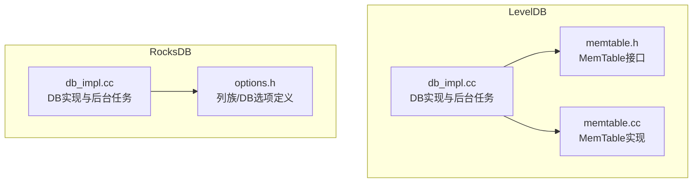
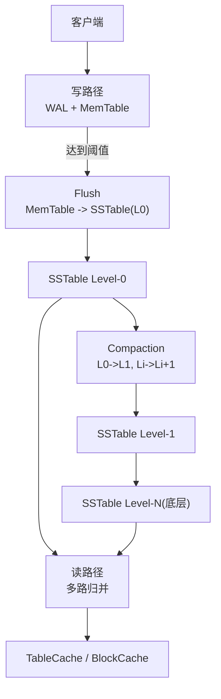
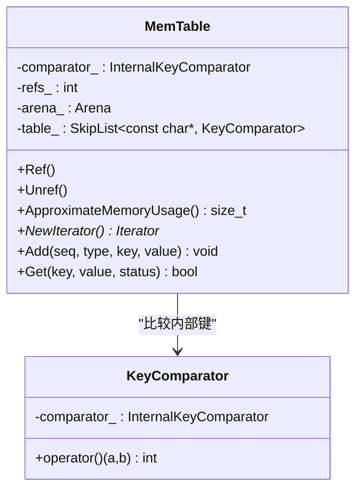
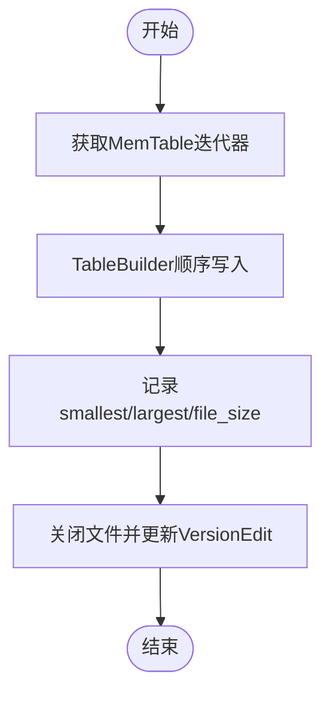
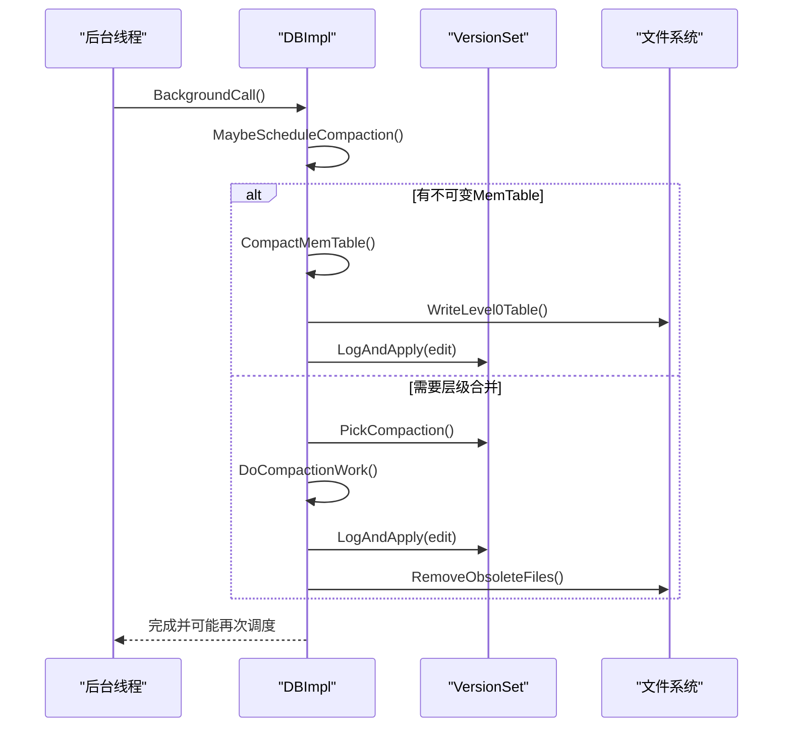
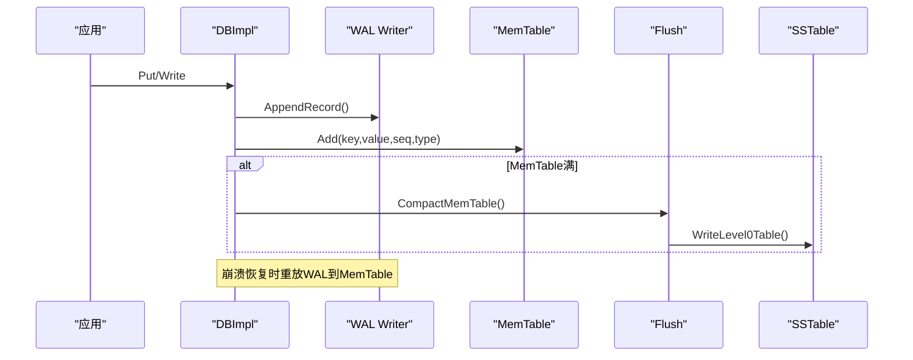
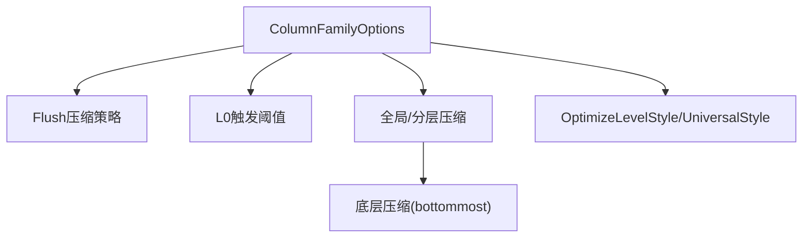
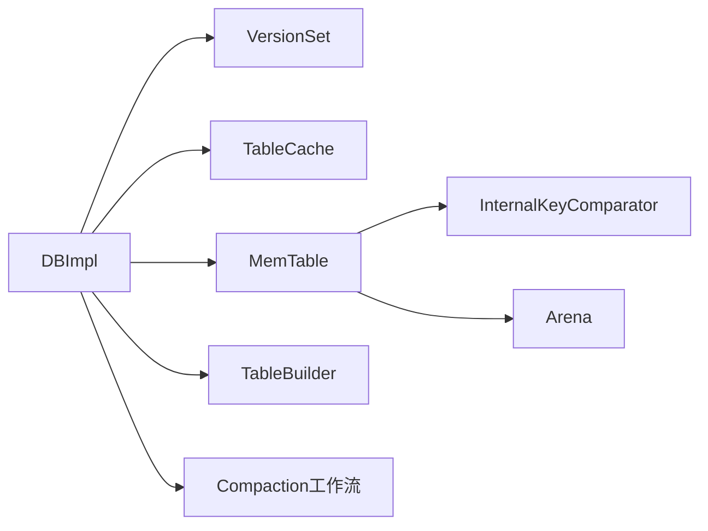

# LSM树架构详解

<cite>
**本文引用的文件**   
- [db_impl.cc](file://source/leveldb-main/db/db_impl.cc)
- [memtable.h](file://source/leveldb-main/db/memtable.h)
- [memtable.cc](file://source/leveldb-main/db/memtable.cc)
- [db_impl.cc（RocksDB）](file://source/rocksdb/db/db_impl/db_impl.cc)
- [options.h（RocksDB）](file://source/rocksdb/include/rocksdb/options.h)
</cite>

## 目录
1. [简介](#简介)
2. [项目结构](#项目结构)
3. [核心组件](#核心组件)
4. [架构总览](#架构总览)
5. [详细组件分析](#详细组件分析)
6. [依赖关系分析](#依赖关系分析)
7. [性能考量](#性能考量)
8. [故障排查指南](#故障排查指南)
9. [结论](#结论)
10. [附录：参数配置与优化示例](#附录参数配置与优化示例)

## 简介
本技术文档围绕LSM树（Log-Structured Merge Tree）架构，系统阐述其核心原理与实现要点，重点覆盖：
- MemTable的内存管理与迭代器模型
- SSTable的磁盘存储格式与构建流程
- Compaction（合并）策略与优化
- 数据从WAL到MemTable、再到Flush生成SSTable、最终通过Compaction合并的完整流转路径
- 各组件职责边界与交互接口
- 关键参数的配置与调优建议
- 压缩级别对性能的影响及Compaction策略选择
- 常见问题定位与排障方法

## 项目结构
仓库包含多个数据库内核与基准测试代码，其中与本LSM文档直接相关的核心实现位于LevelDB与RocksDB两个子项目中。LevelDB提供简洁清晰的LSM实现原型，RocksDB则在功能完备性、可配置性与生产级特性上进行了大幅增强。

图表来源
- [db_impl.cc:1-120](file://source/leveldb-main/db/db_impl.cc#L1-L120)
- [memtable.h:1-88](file://source/leveldb-main/db/memtable.h#L1-L88)
- [memtable.cc:1-139](file://source/leveldb-main/db/memtable.cc#L1-L139)
- [db_impl.cc（RocksDB）:1-120](file://source/rocksdb/db/db_impl/db_impl.cc#L1-L120)
- [options.h（RocksDB）:1-120](file://source/rocksdb/include/rocksdb/options.h#L1-L120)

章节来源
- [db_impl.cc:1-120](file://source/leveldb-main/db/db_impl.cc#L1-L120)
- [db_impl.cc（RocksDB）:1-120](file://source/rocksdb/db/db_impl/db_impl.cc#L1-L120)

## 核心组件
- WAL（Write-Ahead Log）：持久化写入日志，保证崩溃恢复能力
- MemTable：内存中的有序表（跳表），承载最近写入
- SSTable：不可变、按Key有序的磁盘文件，支持块级索引与布隆过滤器
- VersionSet/Manifest：描述当前版本的文件集合与元数据
- TableCache：缓存已打开的SSTable句柄
- Compaction：后台合并过程，减少读放大、空间放大并清理过期数据
- Flush：将MemTable落盘为SSTable的过程

章节来源
- [db_impl.cc:120-220](file://source/leveldb-main/db/db_impl.cc#L120-L220)
- [memtable.h:20-88](file://source/leveldb-main/db/memtable.h#L20-L88)
- [memtable.cc:20-139](file://source/leveldb-main/db/memtable.cc#L20-L139)
- [db_impl.cc（RocksDB）:170-284](file://source/rocksdb/db/db_impl/db_impl.cc#L170-L284)

## 架构总览
下图展示了LevelDB/RocksDB中LSM的关键组件及其交互关系，包括写路径（WAL→MemTable→Flush→SSTable）与读路径（多级SSTable合并）、以及后台Compaction流程。

图表来源
- [db_impl.cc:500-580](file://source/leveldb-main/db/db_impl.cc#L500-L580)
- [db_impl.cc（RocksDB）:170-284](file://source/rocksdb/db/db_impl/db_impl.cc#L170-L284)

## 详细组件分析

### MemTable：内存管理、数据结构与迭代器
- 数据结构：基于跳表的有序表，键为内部键（用户键+序列号+类型），值为用户值或空（删除标记）
- 内存分配：使用Arena进行批量分配，降低碎片与分配开销
- 迭代器：提供前向/后向遍历，用于Flush时顺序扫描写入SSTable
- 查找：根据LookupKey在MemTable内定位最新条目，返回NotFound表示删除

图表来源
- [memtable.h:20-88](file://source/leveldb-main/db/memtable.h#L20-L88)
- [memtable.cc:20-139](file://source/leveldb-main/db/memtable.cc#L20-L139)

章节来源
- [memtable.h:20-88](file://source/leveldb-main/db/memtable.h#L20-L88)
- [memtable.cc:20-139](file://source/leveldb-main/db/memtable.cc#L20-L139)

### SSTable：磁盘存储格式与构建
- 存储格式：按Key排序的不可变文件，包含数据块、元数据块、索引块与布隆过滤器等
- 构建过程：由Builder读取MemTable迭代器，顺序写入SSTable；记录最小/最大Key、文件大小等元信息
- 缓存：TableCache缓存SSTable句柄，BlockCache缓存数据块

图表来源
- [db_impl.cc:505-547](file://source/leveldb-main/db/db_impl.cc#L505-L547)

章节来源
- [db_impl.cc:505-547](file://source/leveldb-main/db/db_impl.cc#L505-L547)

### Compaction：合并策略与后台执行
- 触发条件：MemTable不可变（imm_非空）、L0文件数超过阈值、层级间重叠等
- 执行流程：后台线程调度BackgroundCompaction，优先处理MemTable转SSTable，再进行层级合并
- 输出：生成新的SSTable，更新VersionSet，清理旧文件

图表来源
- [db_impl.cc:668-787](file://source/leveldb-main/db/db_impl.cc#L668-L787)

章节来源
- [db_impl.cc:668-787](file://source/leveldb-main/db/db_impl.cc#L668-L787)

### 写路径与恢复：WAL→MemTable→Flush→SSTable
- 写路径：写入先追加WAL，再插入MemTable；当MemTable大小达到阈值或显式刷新时，转为不可变MemTable并触发Flush
- 恢复：Recover阶段重放WAL至MemTable，必要时即时Flush生成SSTable，确保一致性

图表来源
- [db_impl.cc:425-503](file://source/leveldb-main/db/db_impl.cc#L425-L503)
- [db_impl.cc:549-580](file://source/leveldb-main/db/db_impl.cc#L549-L580)

章节来源
- [db_impl.cc:425-503](file://source/leveldb-main/db/db_impl.cc#L425-L503)
- [db_impl.cc:549-580](file://source/leveldb-main/db/db_impl.cc#L549-L580)

### RocksDB增强：压缩与选项
- 压缩策略：Flush与Compaction可使用不同压缩算法；Universal风格下默认禁用压缩以优化顺序加载
- 选项体系：ColumnFamilyOptions提供大量可调参数，如write_buffer_size、level0_file_num_compaction_trigger、compression等

图表来源
- [db_impl.cc（RocksDB）:130-147](file://source/rocksdb/db/db_impl/db_impl.cc#L130-L147)
- [options.h（RocksDB）:170-300](file://source/rocksdb/include/rocksdb/options.h#L170-L300)

章节来源
- [db_impl.cc（RocksDB）:130-147](file://source/rocksdb/db/db_impl/db_impl.cc#L130-L147)
- [options.h（RocksDB）:170-300](file://source/rocksdb/include/rocksdb/options.h#L170-L300)

## 依赖关系分析
- DBImpl依赖VersionSet维护文件集合与版本编辑，依赖TableCache缓存SSTable句柄
- MemTable依赖InternalKeyComparator与Arena，提供迭代器供Builder使用
- Compaction依赖PickCompaction策略与DoCompactionWork执行逻辑，最终通过VersionSet提交变更

图表来源
- [db_impl.cc:120-180](file://source/leveldb-main/db/db_impl.cc#L120-L180)
- [memtable.h:20-88](file://source/leveldb-main/db/memtable.h#L20-L88)

章节来源
- [db_impl.cc:120-180](file://source/leveldb-main/db/db_impl.cc#L120-L180)
- [memtable.h:20-88](file://source/leveldb-main/db/memtable.h#L20-L88)

## 性能考量
- 写放大与读放大权衡：增大write_buffer_size可减少Flush频率，提升吞吐但增加恢复时间；合理设置L0触发阈值控制读放大
- 压缩影响：高压缩比降低I/O但增加CPU开销；Universal风格下顺序加载场景建议禁用压缩以提升吞吐
- 并发与后台任务：后台Compaction与Flush需避免阻塞前台写入；可通过并行度与限流控制资源占用
- 缓存命中率：合理配置TableCache与BlockCache容量，提升热点数据命中

[本节为通用指导，不直接分析具体文件]

## 故障排查指南
- 恢复失败：检查WAL完整性与MANIFEST一致性；确认RecoverLogFile是否成功重放
- 后台错误：关注RecordBackgroundError与ResumeImpl流程，确保错误状态被正确传播与恢复
- 文件泄漏：RemoveObsoleteFiles未清理旧文件时，检查live文件集合与pending_outputs_状态
- 压缩异常：确认CompressionType支持与CompressionOptions配置，避免不兼容算法

章节来源
- [db_impl.cc:225-290](file://source/leveldb-main/db/db_impl.cc#L225-L290)
- [db_impl.cc（RocksDB）:285-474](file://source/rocksdb/db/db_impl/db_impl.cc#L285-L474)

## 结论
LSM树通过“写放大换读性能”的设计思想，结合WAL、MemTable、SSTable与Compaction机制，实现了高吞吐写入与高效范围查询。LevelDB提供了清晰的核心实现，RocksDB在此基础上增强了可配置性、压缩策略与生产级特性。合理配置参数与选择合适的Compaction策略是获得稳定性能的关键。

[本节为总结，不直接分析具体文件]

## 附录：参数配置与优化示例
- LevelDB基础参数
  - write_buffer_size：控制MemTable大小，影响Flush频率与恢复时间
  - max_open_files：限制打开文件数，预留部分给TableCache与其他用途
  - block_size：SSTable块大小，影响随机读性能与内存占用
- RocksDB高级参数
  - compression：全局压缩算法，可按层配置compression_per_level
  - level0_file_num_compaction_trigger：L0触发阈值，平衡写放大与读放大
  - bottommost_compression：底层压缩，适合冷数据归档
  - OptimizeLevelStyleCompaction/OptimizeUniversalStyleCompaction：快速调优入口

章节来源
- [db_impl.cc:94-124](file://source/leveldb-main/db/db_impl.cc#L94-L124)
- [options.h（RocksDB）:170-300](file://source/rocksdb/include/rocksdb/options.h#L170-L300)