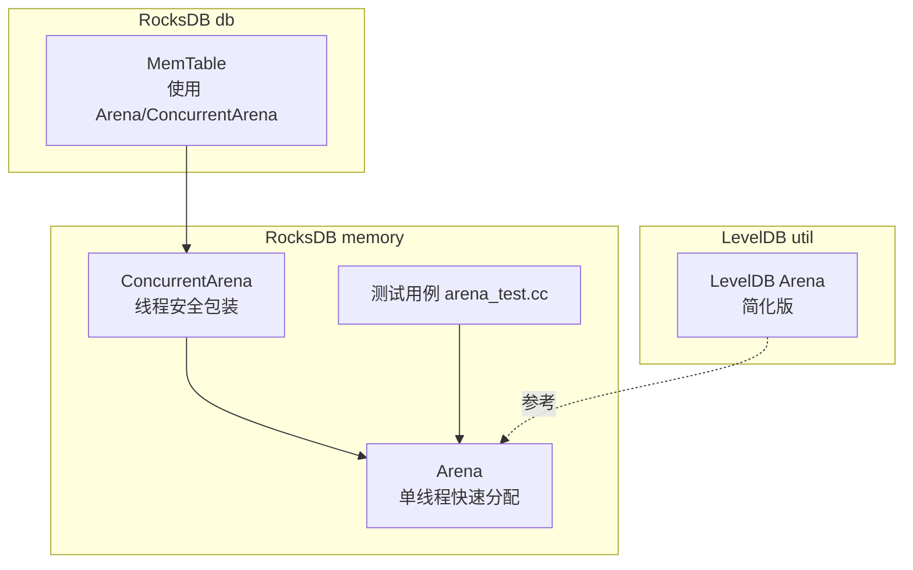
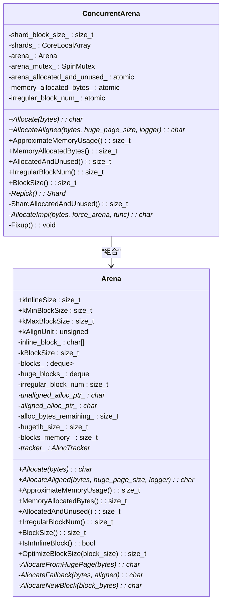
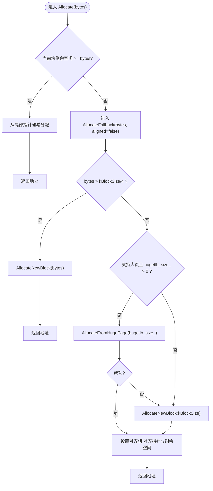
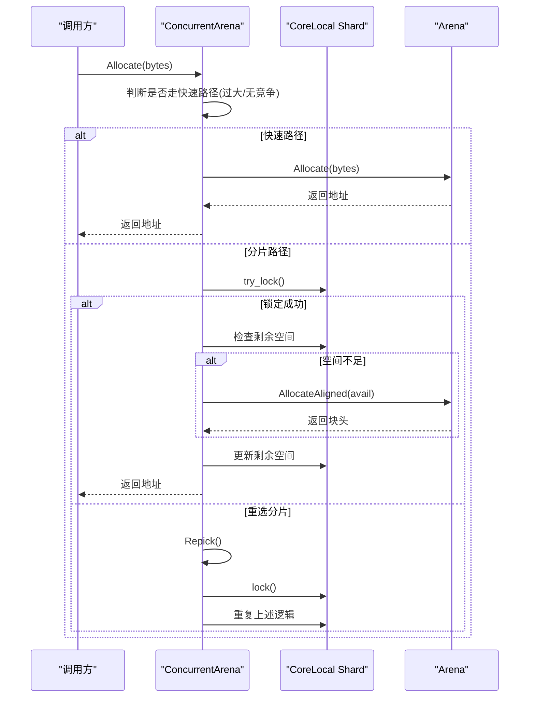
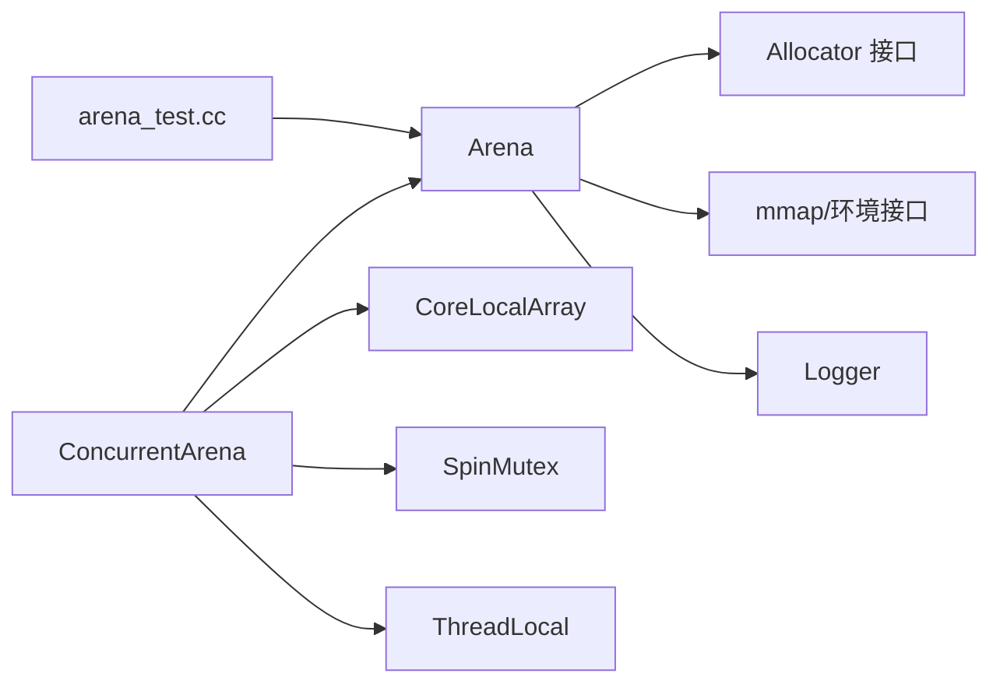

# Arena内存分配器

<cite>
**本文引用的文件**
- [arena.h](file://source/rocksdb/memory/arena.h)
- [arena.cc](file://source/rocksdb/memory/arena.cc)
- [concurrent_arena.h](file://source/rocksdb/memory/concurrent_arena.h)
- [concurrent_arena.cc](file://source/rocksdb/memory/concurrent_arena.cc)
- [arena_test.cc](file://source/rocksdb/memory/arena_test.cc)
- [arena.h（LevelDB）](file://source/leveldb-main/util/arena.h)
- [arena.cc（LevelDB）](file://source/leveldb-main/util/arena.cc)
- [memtable.h](file://source/rocksdb/db/memtable.h)
</cite>

## 目录
1. [简介](#简介)
2. [项目结构](#项目结构)
3. [核心组件](#核心组件)
4. [架构总览](#架构总览)
5. [详细组件分析](#详细组件分析)
6. [依赖关系分析](#依赖关系分析)
7. [性能考量](#性能考量)
8. [故障排查指南](#故障排查指南)
9. [结论](#结论)
10. [附录](#附录)

## 简介
本技术文档围绕 RocksDB 中的 Arena 内存分配器展开，系统阐述其设计原理与实现细节，包括：
- 内存池管理策略：内联块、固定大小块、大对象直分、可选的大页支持。
- 块分配算法：从两端分配以兼顾对齐与非对齐请求，减少碎片与浪费。
- 内存对齐机制：按最大对齐单位对齐，保证高性能访问。
- 生命周期管理：初始化、分配、回收与销毁流程。
- 内存块组织结构：页大小配置、碎片化控制、使用统计接口。
- 配置参数：块大小优化、最大内存限制、增长策略、线程安全机制。
- 性能优化：预分配、复用、垃圾回收时机与并发优化。
- 使用最佳实践与常见陷阱。

## 项目结构
Arena 相关代码主要位于 RocksDB 的 memory 模块，另有 LevelDB 的简化版本作为参考。ConcurrentArena 提供线程安全的包装层。MemTable 等上层组件通过 Arena/ConcurrentArena 进行内存分配。

图表来源
- [arena.h:25-120](file://source/rocksdb/memory/arena.h#L25-L120)
- [concurrent_arena.h:42-114](file://source/rocksdb/memory/concurrent_arena.h#L42-L114)
- [arena_test.cc:25-100](file://source/rocksdb/memory/arena_test.cc#L25-L100)
- [arena.h（LevelDB）:16-53](file://source/leveldb-main/util/arena.h#L16-L53)
- [memtable.h:26-27](file://source/rocksdb/db/memtable.h#L26-L27)

章节来源
- [arena.h:25-120](file://source/rocksdb/memory/arena.h#L25-L120)
- [concurrent_arena.h:42-114](file://source/rocksdb/memory/concurrent_arena.h#L42-L114)
- [arena_test.cc:25-100](file://source/rocksdb/memory/arena_test.cc#L25-L100)
- [arena.h（LevelDB）:16-53](file://source/leveldb-main/util/arena.h#L16-L53)
- [memtable.h:26-27](file://source/rocksdb/db/memtable.h#L26-L27)

## 核心组件
- Arena：单线程高效内存分配器，支持内联块、固定块与大对象直分，可选大页分配，提供对齐与非对齐分配接口与统计方法。
- ConcurrentArena：基于 Arena 的线程安全封装，采用每核分片缓存与轻量自旋锁，降低小对象分配的竞争。
- LevelDB Arena：简化版实现，便于理解基础思路。

关键能力概览
- 分配接口：Allocate（非对齐）、AllocateAligned（对齐）。
- 统计接口：ApproximateMemoryUsage、MemoryAllocatedBytes、AllocatedAndUnused、IrregularBlockNum、BlockSize。
- 配置接口：OptimizeBlockSize（块大小优化）。
- 大页支持：在可用时优先尝试大页映射，失败回退到普通分配。

章节来源
- [arena.h:25-120](file://source/rocksdb/memory/arena.h#L25-L120)
- [arena.cc:23-54](file://source/rocksdb/memory/arena.cc#L23-L54)
- [concurrent_arena.h:42-114](file://source/rocksdb/memory/concurrent_arena.h#L42-L114)
- [arena.h（LevelDB）:16-53](file://source/leveldb-main/util/arena.h#L16-L53)

## 架构总览
Arena 的核心思想是“批量分配 + 局部复用”：
- 初始化阶段预留一个内联块，避免频繁系统调用。
- 小对象分配优先从当前块的剩余空间分配；若不足则申请新块。
- 大对象直接单独分配，避免大块内部碎片。
- 对齐分配从块头开始，非对齐从块尾开始，双向推进以减少对齐浪费。
- 可选大页分配用于大对象或特定场景，提升 TLB 命中率。

图表来源
- [arena.h:25-120](file://source/rocksdb/memory/arena.h#L25-L120)
- [concurrent_arena.h:42-114](file://source/rocksdb/memory/concurrent_arena.h#L42-L114)

章节来源
- [arena.h:25-120](file://source/rocksdb/memory/arena.h#L25-L120)
- [concurrent_arena.h:42-114](file://source/rocksdb/memory/concurrent_arena.h#L42-L114)

## 详细组件分析

### Arena 设计与实现
- 内存组织
  - 内联块：构造时预留固定大小的连续内存，避免首次分配的系统调用开销。
  - 固定块：按需分配固定大小的块，维护两个指针分别从头和尾推进，兼顾对齐与非对齐。
  - 大对象：超过阈值（如块大小的四分之一）直接单独分配，减少内部碎片。
  - 大页：在支持的情况下优先使用大页映射，失败回退。
- 分配算法
  - Allocate：先检查当前块剩余空间，足够则从尾部递减分配；否则进入回退路径。
  - AllocateAligned：计算对齐偏移，优先从头部对齐分配；不足则回退到 AllocateFallback。
  - AllocateFallback：判断是否为大对象，若是则单独分配；否则尝试大页或固定块分配。
- 统计与配置
  - ApproximateMemoryUsage：估算已使用的数据占用（排除未用空间）。
  - MemoryAllocatedBytes：实际分配的总字节数。
  - AllocatedAndUnused：当前块中尚未使用的字节数。
  - IrregularBlockNum：大对象单独分配的块计数。
  - OptimizeBlockSize：将用户配置的块大小约束到合理范围并对齐。

图表来源
- [arena.cc:63-93](file://source/rocksdb/memory/arena.cc#L63-L93)
- [arena.cc:95-106](file://source/rocksdb/memory/arena.cc#L95-L106)
- [arena.cc:145-168](file://source/rocksdb/memory/arena.cc#L145-L168)

章节来源
- [arena.h:25-120](file://source/rocksdb/memory/arena.h#L25-L120)
- [arena.cc:23-54](file://source/rocksdb/memory/arena.cc#L23-L54)
- [arena.cc:63-93](file://source/rocksdb/memory/arena.cc#L63-L93)
- [arena.cc:95-106](file://source/rocksdb/memory/arena.cc#L95-L106)
- [arena.cc:108-143](file://source/rocksdb/memory/arena.cc#L108-L143)
- [arena.cc:145-168](file://source/rocksdb/memory/arena.cc#L145-L168)

### ConcurrentArena 并发优化
- 设计目标：在高并发场景下降低锁竞争，提高小对象分配吞吐。
- 核心机制
  - 每核分片（Shard）：每个核心拥有独立的缓存区与原子计数器，减少跨核竞争。
  - 延迟实例化：仅在检测到并发使用时才创建分片，避免无谓内存占用。
  - 自适应块大小：根据主 Arena 的剩余空间动态调整分片块大小，避免浪费。
  - 快速路径：当分配过大或未发生过 Repick 且主 Arena 锁可获取时，直接走主 Arena。
- 统计同步：通过 Fixup 定期更新原子变量，保持近似一致。

图表来源
- [concurrent_arena.h:128-200](file://source/rocksdb/memory/concurrent_arena.h#L128-L200)
- [concurrent_arena.cc:29-43](file://source/rocksdb/memory/concurrent_arena.cc#L29-L43)

章节来源
- [concurrent_arena.h:42-114](file://source/rocksdb/memory/concurrent_arena.h#L42-L114)
- [concurrent_arena.h:128-200](file://source/rocksdb/memory/concurrent_arena.h#L128-L200)
- [concurrent_arena.cc:29-43](file://source/rocksdb/memory/concurrent_arena.cc#L29-L43)

### LevelDB Arena（简化版）
- 特点：结构简单，固定块大小，单指针推进，适合理解基础思路。
- 适用场景：教学与对比，便于把握 Arena 的核心思想。

章节来源
- [arena.h（LevelDB）:16-53](file://source/leveldb-main/util/arena.h#L16-L53)
- [arena.cc（LevelDB）:20-36](file://source/leveldb-main/util/arena.cc#L20-L36)

### 与 MemTable 的集成
- MemTable 通过 Arena/ConcurrentArena 进行节点与缓冲区的分配，确保高写入吞吐与低分配开销。
- 配置项包含 arena_block_size、memtable_huge_page_size 等，影响分配行为与内存使用。

章节来源
- [memtable.h:26-27](file://source/rocksdb/db/memtable.h#L26-L27)
- [memtable.h:49-72](file://source/rocksdb/db/memtable.h#L49-L72)

## 依赖关系分析
- Arena 依赖 Allocator 接口、mmap 工具、日志与环境接口。
- ConcurrentArena 依赖 CoreLocalArray、SpinMutex、ThreadLocal 等并发原语。
- 测试用例覆盖内存统计、对齐、大页、零分配边界等场景。

图表来源
- [arena.h:19-22](file://source/rocksdb/memory/arena.h#L19-L22)
- [concurrent_arena.h:15-21](file://source/rocksdb/memory/concurrent_arena.h#L15-L21)
- [arena_test.cc:10-18](file://source/rocksdb/memory/arena_test.cc#L10-L18)

章节来源
- [arena.h:19-22](file://source/rocksdb/memory/arena.h#L19-L22)
- [concurrent_arena.h:15-21](file://source/rocksdb/memory/concurrent_arena.h#L15-L21)
- [arena_test.cc:10-18](file://source/rocksdb/memory/arena_test.cc#L10-L18)

## 性能考量
- 预分配策略
  - 内联块避免首次分配的系统调用。
  - 固定块批量分配，减少 malloc/new 调用次数。
- 内存复用机制
  - 双向指针推进减少对齐浪费。
  - 大对象单独分配避免内部碎片。
- 垃圾回收时机
  - Arena 本身不主动释放单个对象，析构时统一释放所有块。
  - 建议将 Arena 的生命周期与批处理任务绑定，任务结束时整体释放。
- 并发优化
  - ConcurrentArena 的分片缓存与快速路径显著降低锁竞争。
  - 自适应块大小避免过度分配。
- 大页支持
  - 在系统支持且配置开启时，优先使用大页映射，提升 TLB 命中。
  - 注意大页可能失败，需做好回退与日志记录。

[本节为通用指导，不直接分析具体文件]

## 故障排查指南
- 常见问题
  - 分配失败：检查系统资源与大页配置，确认日志输出。
  - 内存泄漏：确保 Arena 正确析构，避免提前释放。
  - 对齐错误：确认使用 AllocateAligned 而非 Allocate 进行对齐需求。
  - 碎片化过高：评估对象大小分布，调整块大小或启用大对象直分。
- 调试技巧
  - 使用 ApproximateMemoryUsage 与 MemoryAllocatedBytes 对比，定位未用空间。
  - 观察 IrregularBlockNum，判断大对象比例。
  - 在测试中验证零分配边界与对齐行为。

章节来源
- [arena.cc:108-143](file://source/rocksdb/memory/arena.cc#L108-L143)
- [arena_test.cc:90-141](file://source/rocksdb/memory/arena_test.cc#L90-L141)

## 结论
Arena 通过批量分配、双向推进与可选大页支持，实现了高效、低碎片的内存管理。ConcurrentArena 在此基础上提供线程安全与高并发优化，适用于 RocksDB 的高吞吐写入场景。合理配置块大小、利用大页、遵循生命周期管理，可显著提升性能并避免常见陷阱。

[本节为总结性内容，不直接分析具体文件]

## 附录
- 配置参数说明
  - block_size：块大小，经 OptimizeBlockSize 约束到最小/最大范围并对齐。
  - huge_page_size：大页大小，大于 0 时尝试大页分配。
  - tracker：分配跟踪器，用于外部统计。
- 使用示例要点
  - 短生命周期任务：创建 Arena，分配对象，任务结束析构。
  - 长生命周期服务：使用 ConcurrentArena，关注分片与锁竞争。
  - 对齐需求：使用 AllocateAligned，避免手动对齐。
- 最佳实践
  - 避免 0 字节分配。
  - 合理设置块大小，平衡碎片与分配频率。
  - 监控内存使用，及时调整配置。

[本节为补充信息，不直接分析具体文件]