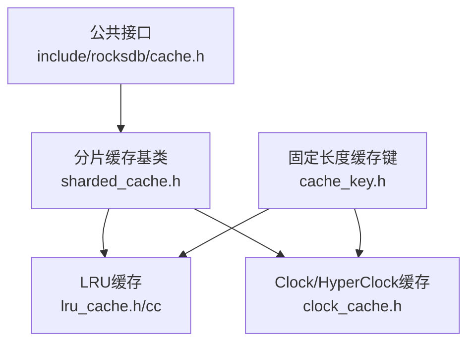
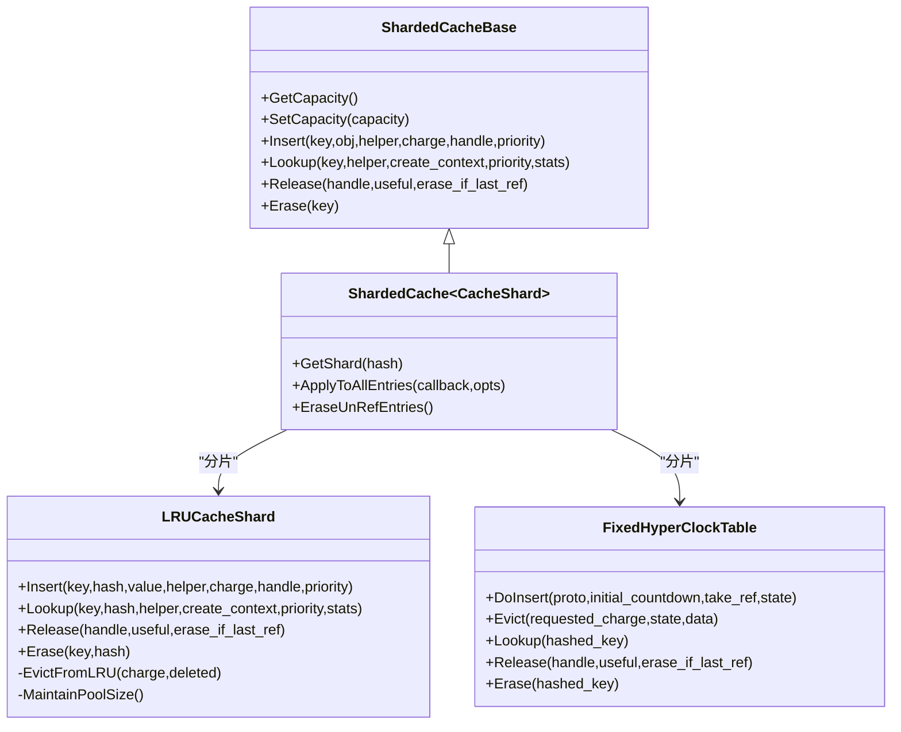
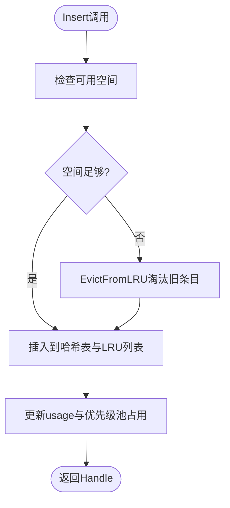
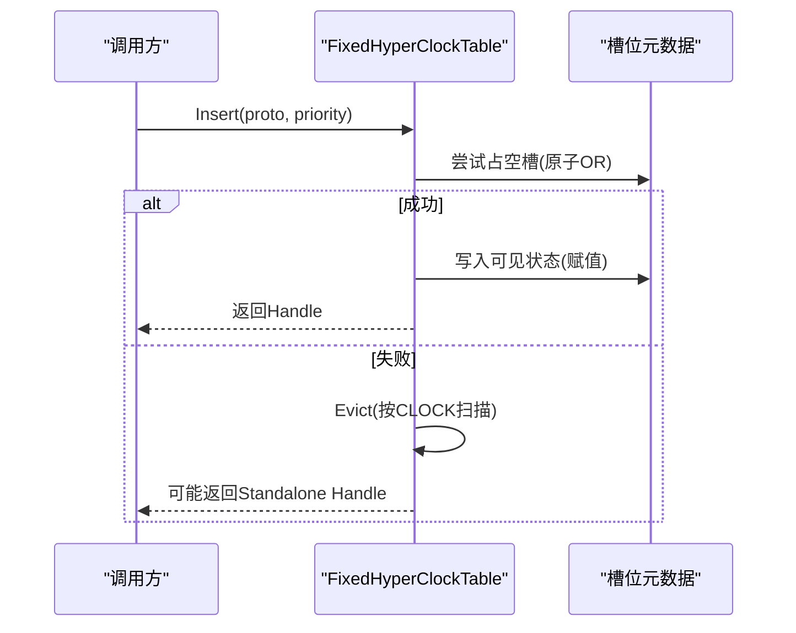
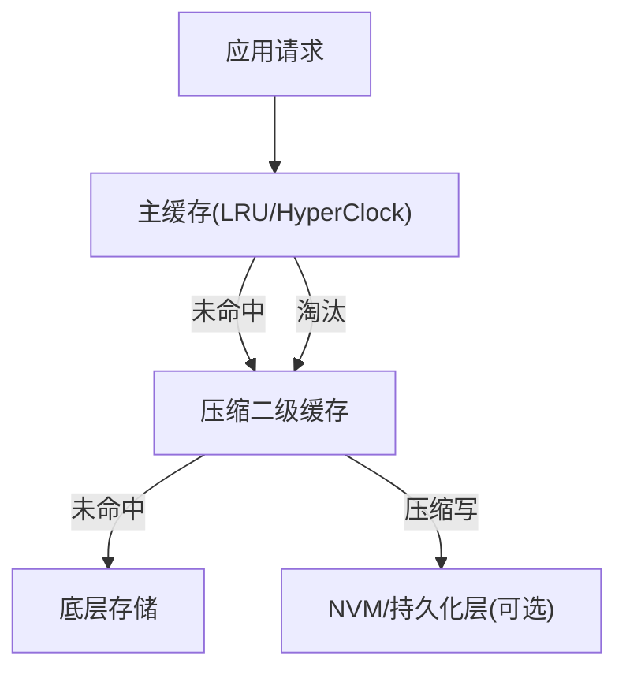
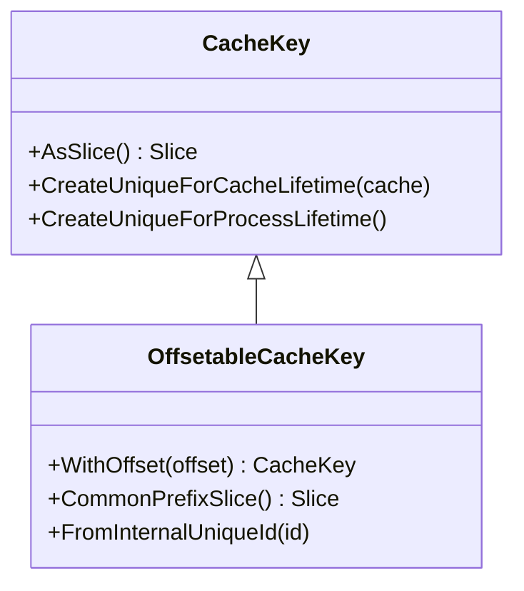
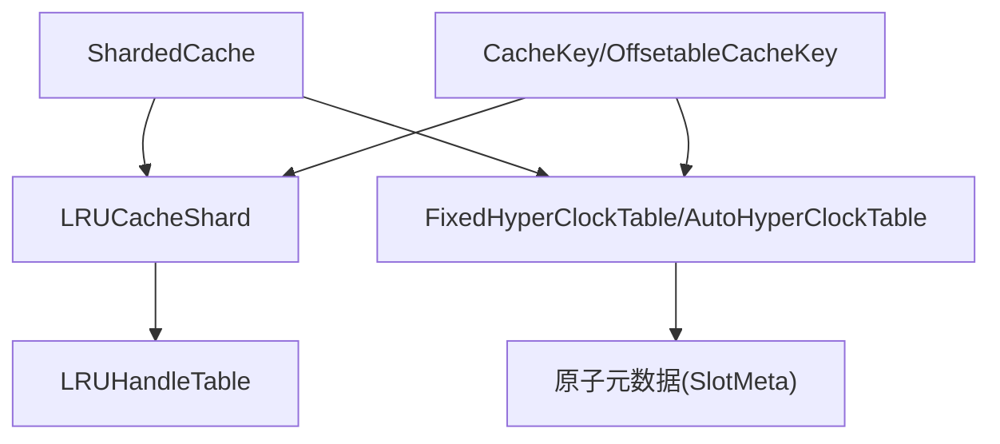

# Block缓存机制

<cite>
**本文引用的文件**   
- [rocksdb/include/rocksdb/cache.h](file://source/rocksdb/include/rocksdb/cache.h)
- [rocksdb/cache/lru_cache.h](file://source/rocksdb/cache/lru_cache.h)
- [rocksdb/cache/lru_cache.cc](file://source/rocksdb/cache/lru_cache.cc)
- [rocksdb/cache/clock_cache.h](file://source/rocksdb/cache/clock_cache.h)
- [rocksdb/cache/sharded_cache.h](file://source/rocksdb/cache/sharded_cache.h)
- [rocksdb/cache/cache_key.h](file://source/rocksdb/cache/cache_key.h)
</cite>

## 目录
1. [简介](#简介)
2. [项目结构](#项目结构)
3. [核心组件](#核心组件)
4. [架构总览](#架构总览)
5. [详细组件分析](#详细组件分析)
6. [依赖关系分析](#依赖关系分析)
7. [性能考量](#性能考量)
8. [故障排查指南](#故障排查指南)
9. [结论](#结论)
10. [附录](#附录)

## 简介
本技术文档围绕Block缓存机制展开，重点解析LRU与Clock（HyperClock）两种缓存算法的实现原理、多级缓存架构设计、键值管理机制以及性能调优方法。文档面向不同技术背景的读者，既提供高层概览，也深入到代码级结构与数据流，帮助理解并优化RocksDB中的Block Cache。

## 项目结构
本项目中Block缓存相关实现集中在RocksDB的cache目录与公共接口定义中：
- 公共接口与选项：include/rocksdb/cache.h
- LRU缓存实现：cache/lru_cache.{h,cc}
- Clock/HyperClock缓存实现：cache/clock_cache.h
- 分片缓存基类：cache/sharded_cache.h
- 固定长度缓存键：cache/cache_key.h

**图表来源** 
- [rocksdb/include/rocksdb/cache.h:1-563](file://source/rocksdb/include/rocksdb/cache.h#L1-L563)
- [rocksdb/cache/sharded_cache.h:1-323](file://source/rocksdb/cache/sharded_cache.h#L1-L323)
- [rocksdb/cache/lru_cache.h:1-474](file://source/rocksdb/cache/lru_cache.h#L1-L474)
- [rocksdb/cache/clock_cache.h:1-800](file://source/rocksdb/cache/clock_cache.h#L1-L800)
- [rocksdb/cache/cache_key.h:1-144](file://source/rocksdb/cache/cache_key.h#L1-L144)

**章节来源**
- [rocksdb/include/rocksdb/cache.h:1-563](file://source/rocksdb/include/rocksdb/cache.h#L1-L563)
- [rocksdb/cache/sharded_cache.h:1-323](file://source/rocksdb/cache/sharded_cache.h#L1-L323)

## 核心组件
- LRUCache：基于分片的LRU淘汰策略，支持高/低优先级池与命中优先插入，适合通用场景。
- HyperClockCache（Clock）：近似LRU的无锁/等待自由实现，针对高并发读优化，具备CLOCK风格淘汰与计数倒计时机制。
- ShardedCache：按Key哈希分片，降低互斥锁竞争，提升并行度。
- CacheKey：固定16字节键，用于Block缓存的高效定位与去重。

**章节来源**
- [rocksdb/cache/lru_cache.h:25-203](file://source/rocksdb/cache/lru_cache.h#L25-L203)
- [rocksdb/cache/clock_cache.h:295-417](file://source/rocksdb/cache/clock_cache.h#L295-L417)
- [rocksdb/cache/sharded_cache.h:127-323](file://source/rocksdb/cache/sharded_cache.h#L127-L323)
- [rocksdb/cache/cache_key.h:33-67](file://source/rocksdb/cache/cache_key.h#L33-L67)

## 架构总览
Block缓存采用“分片+具体实现”的架构：ShardedCache将容量均分到多个Shard，每个Shard由具体算法（LRU或Clock）管理。LRU使用双向链表维护可淘汰序列，结合哈希表快速查找；Clock通过原子元数据与CLOCK指针进行近似LRU淘汰，减少锁竞争。

**图表来源** 
- [rocksdb/cache/sharded_cache.h:133-316](file://source/rocksdb/cache/sharded_cache.h#L133-L316)
- [rocksdb/cache/lru_cache.h:265-441](file://source/rocksdb/cache/lru_cache.h#L265-L441)
- [rocksdb/cache/clock_cache.h:585-743](file://source/rocksdb/cache/clock_cache.h#L585-L743)

**章节来源**
- [rocksdb/cache/sharded_cache.h:133-316](file://source/rocksdb/cache/sharded_cache.h#L133-L316)
- [rocksdb/cache/lru_cache.h:265-441](file://source/rocksdb/cache/lru_cache.h#L265-L441)
- [rocksdb/cache/clock_cache.h:585-743](file://source/rocksdb/cache/clock_cache.h#L585-L743)

## 详细组件分析

### LRU缓存组件分析
LRU通过哈希表与双向链表组合实现：
- 条目状态：外部引用计数refs与是否在缓存内in_cache决定是否进入LRU列表。
- 优先级池：支持high-pri与low-pri池，命中项优先插入高优先级池，溢出时向低优先级池迁移。
- 淘汰策略：当usage超过capacity时，从LRU尾部淘汰不可引用条目。

**图表来源** 
- [rocksdb/cache/lru_cache.cc:323-336](file://source/rocksdb/cache/lru_cache.cc#L323-L336)
- [rocksdb/cache/lru_cache.cc:372-400](file://source/rocksdb/cache/lru_cache.cc#L372-L400)
- [rocksdb/cache/lru_cache.h:256-296](file://source/rocksdb/cache/lru_cache.h#L256-L296)

**章节来源**
- [rocksdb/cache/lru_cache.h:50-203](file://source/rocksdb/cache/lru_cache.h#L50-L203)
- [rocksdb/cache/lru_cache.cc:232-296](file://source/rocksdb/cache/lru_cache.cc#L232-L296)
- [rocksdb/cache/lru_cache.cc:323-336](file://source/rocksdb/cache/lru_cache.cc#L323-L336)

### Clock/HyperClock缓存组件分析
Clock/HyperClock以原子元数据与CLOCK指针为核心：
- 元数据编码：acquire/release计数器与状态位（Empty/Construction/Visible/Invisible）统一在单字中，Lookup/Release为单次原子操作。
- 倒计时淘汰：未引用条目根据优先级设置初始countdown，CLOCK扫描时递减或直接淘汰。
- 表结构：FixedHyperClockTable固定大小，AutoHyperClockTable动态扩容（mmap），两者均使用开放定址与双哈希探测。

**图表来源** 
- [rocksdb/cache/clock_cache.h:295-417](file://source/rocksdb/cache/clock_cache.h#L295-L417)
- [rocksdb/cache/clock_cache.h:585-743](file://source/rocksdb/cache/clock_cache.h#L585-L743)

**章节来源**
- [rocksdb/cache/clock_cache.h:295-417](file://source/rocksdb/cache/clock_cache.h#L295-L417)
- [rocksdb/cache/clock_cache.h:585-743](file://source/rocksdb/cache/clock_cache.h#L585-L743)

### 多级缓存架构（Tiered Cache）
RocksDB提供两级缓存：主缓存（LRU或HyperClock）与压缩二级缓存（CompressedSecondaryCache）。通过TieredCacheOptions配置总容量与分配比例，支持自动/占位符/三队列等准入策略。

**图表来源** 
- [rocksdb/include/rocksdb/cache.h:526-547](file://source/rocksdb/include/rocksdb/cache.h#L526-L547)

**章节来源**
- [rocksdb/include/rocksdb/cache.h:526-547](file://source/rocksdb/include/rocksdb/cache.h#L526-L547)

### 缓存键值管理机制
- 固定长度键：CacheKey为16字节，包含文件号等信息，WithOffset生成偏移键，保证同文件键前缀一致。
- 哈希冲突处理：LRU使用链地址法，Clock使用开放定址与双哈希探测。
- 内存占用计算：metadata_charge_policy控制是否计入元开销，LRUHandle与ClockHandle分别计算total_charge。

**图表来源** 
- [rocksdb/cache/cache_key.h:33-67](file://source/rocksdb/cache/cache_key.h#L33-L67)
- [rocksdb/cache/cache_key.h:83-141](file://source/rocksdb/cache/cache_key.h#L83-L141)

**章节来源**
- [rocksdb/cache/cache_key.h:33-67](file://source/rocksdb/cache/cache_key.h#L33-L67)
- [rocksdb/cache/cache_key.h:83-141](file://source/rocksdb/cache/cache_key.h#L83-L141)

## 依赖关系分析
- ShardedCache作为模板基类，聚合多个CacheShard实例，按哈希选择分片执行操作。
- LRUCacheShard依赖LRUHandleTable进行键值映射，维护LRU链表与优先级池。
- Clock/HyperClock依赖原子元数据结构与CLOCK指针，避免细粒度锁。
- CacheKey为固定长度键，确保高效比较与哈希。

**图表来源** 
- [rocksdb/cache/sharded_cache.h:133-316](file://source/rocksdb/cache/sharded_cache.h#L133-L316)
- [rocksdb/cache/lru_cache.h:210-262](file://source/rocksdb/cache/lru_cache.h#L210-L262)
- [rocksdb/cache/clock_cache.h:320-402](file://source/rocksdb/cache/clock_cache.h#L320-L402)
- [rocksdb/cache/cache_key.h:83-141](file://source/rocksdb/cache/cache_key.h#L83-L141)

**章节来源**
- [rocksdb/cache/sharded_cache.h:133-316](file://source/rocksdb/cache/sharded_cache.h#L133-L316)
- [rocksdb/cache/lru_cache.h:210-262](file://source/rocksdb/cache/lru_cache.h#L210-L262)
- [rocksdb/cache/clock_cache.h:320-402](file://source/rocksdb/cache/clock_cache.h#L320-L402)
- [rocksdb/cache/cache_key.h:83-141](file://source/rocksdb/cache/cache_key.h#L83-L141)

## 性能考量
- 命中率优化：LRU命中项优先插入高优先级池；Clock通过countdown与优先级初始化提升热点保留。
- 淘汰策略选择：LRU严格容量限制下立即淘汰；Clock允许短暂超限以避免CPU抖动。
- 监控指标：关注GetUsage、GetOccupancyCount、GetPinnedUsage与命中率统计。
- 热点分析：观察大对象导致的分片倾斜，调整num_shard_bits与estimated_entry_charge。

[本节为通用指导，不直接分析具体文件]

## 故障排查指南
- 容量不足：检查strict_capacity_limit与capacity配置，确认EvictionCallback是否接管释放。
- 锁竞争：LRU在高并发下存在分片锁竞争，考虑切换到HyperClock以减少等待。
- 内存泄漏：确认Release(useful=false)与Erase路径正确触发清理，避免standalone handle堆积。
- 命中率低：分析工作负载访问模式，调整优先级池比例与CLOCK参数。

**章节来源**
- [rocksdb/cache/lru_cache.cc:338-352](file://source/rocksdb/cache/lru_cache.cc#L338-L352)
- [rocksdb/cache/clock_cache.h:219-283](file://source/rocksdb/cache/clock_cache.h#L219-L283)

## 结论
Block缓存通过LRU与Clock两种算法满足不同场景需求：LRU适用于通用读写混合负载，Clock在高并发读场景表现更优。结合分片架构与固定长度键，系统在吞吐与延迟间取得平衡。多级缓存进一步扩展了容量与持久化能力。合理配置参数与监控指标是优化性能的关键。

[本节为总结性内容，不直接分析具体文件]

## 附录
- 配置建议：根据平均块大小设置estimated_entry_charge，调整eviction_effort_cap防止抖动。
- 最佳实践：对热点数据启用高优先级池，对冷数据使用低优先级池；定期评估命中率与淘汰率。

[本节为补充信息，不直接分析具体文件]