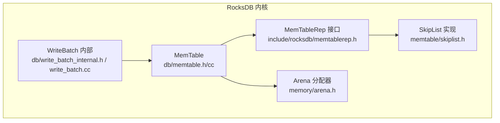
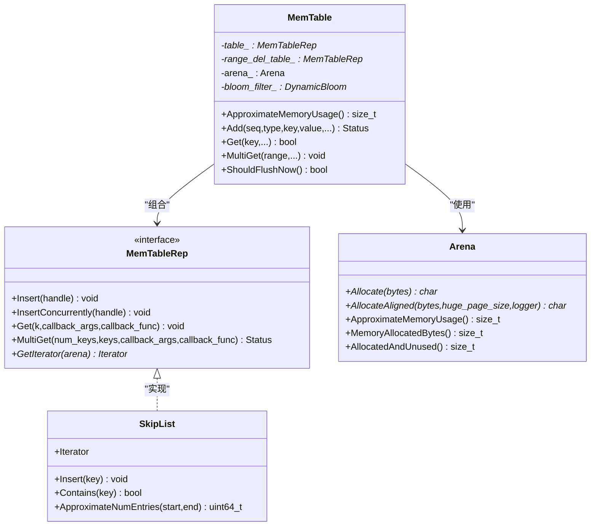
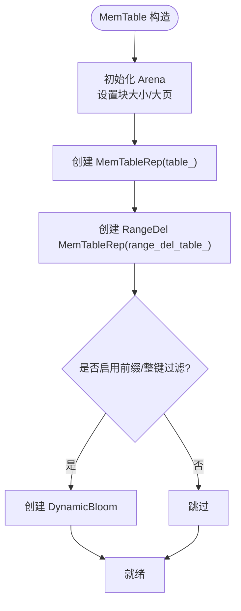
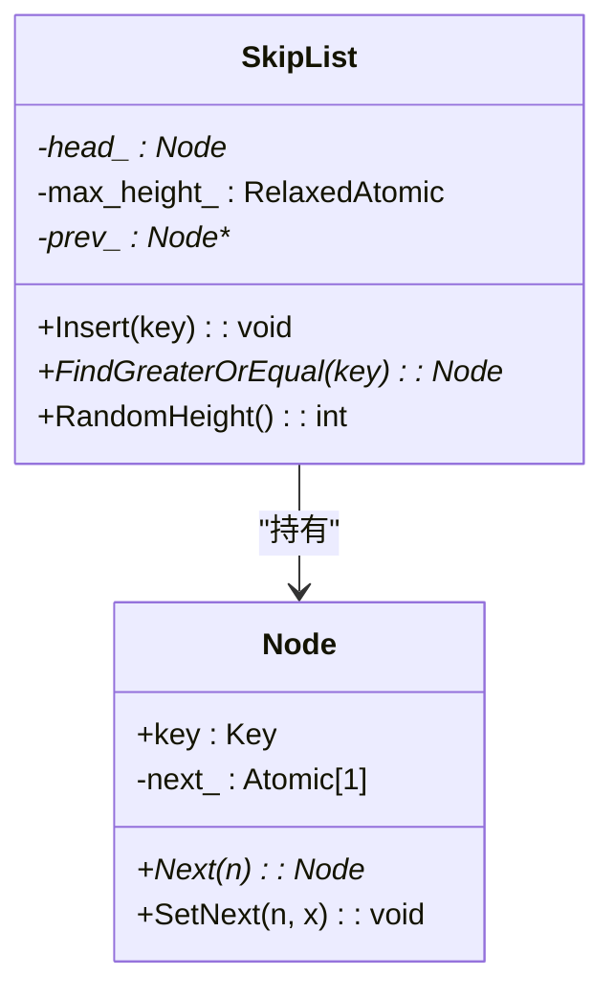
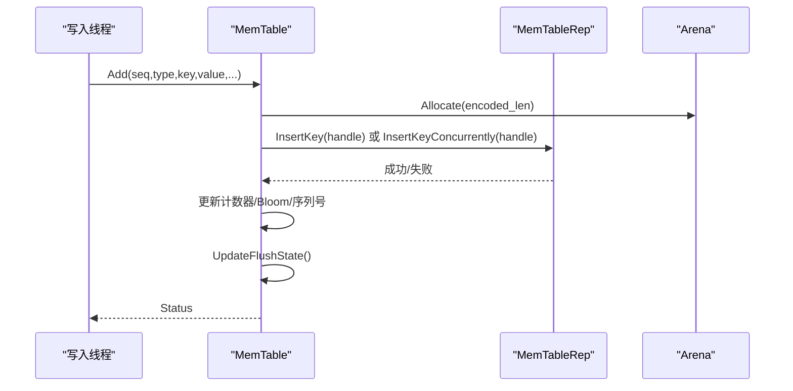
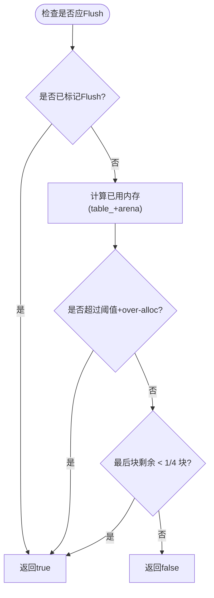
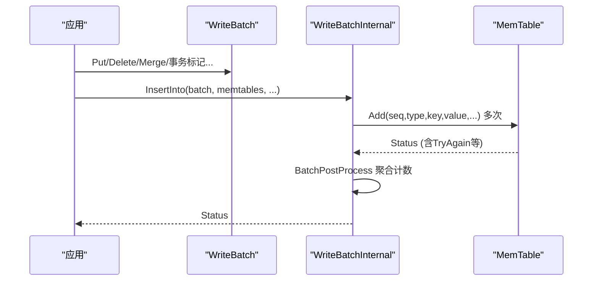
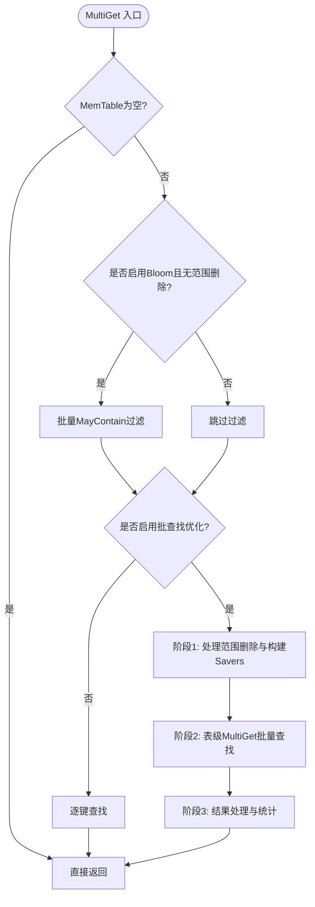
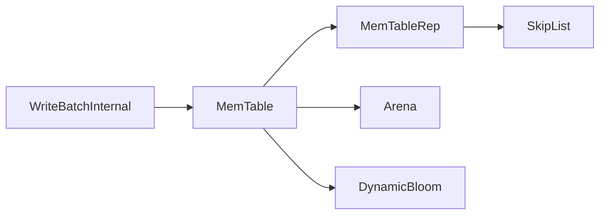

# MemTable内存结构

<cite>
**本文引用的文件**   
- [memtable.h](file://source/rocksdb/db/memtable.h)
- [memtable.cc](file://source/rocksdb/db/memtable.cc)
- [skiplist.h](file://source/rocksdb/memtable/skiplist.h)
- [memtablerep.h](file://source/rocksdb/include/rocksdb/memtablerep.h)
- [arena.h](file://source/rocksdb/memory/arena.h)
- [write_batch_internal.h](file://source/rocksdb/db/write_batch_internal.h)
- [write_batch.cc](file://source/rocksdb/db/write_batch.cc)
</cite>

## 目录
1. [简介](#简介)
2. [项目结构](#项目结构)
3. [核心组件](#核心组件)
4. [架构总览](#架构总览)
5. [详细组件分析](#详细组件分析)
6. [依赖关系分析](#依赖关系分析)
7. [性能考虑](#性能考虑)
8. [故障排查指南](#故障排查指南)
9. [结论](#结论)
10. [附录](#附录)

## 简介
本技术文档聚焦于 RocksDB 中 MemTable 的内存结构与实现，系统性阐述以下方面：
- 内存布局与数据结构：跳表（SkipList）作为默认表示、范围删除表、Bloom 过滤器、Arena 分配器。
- 并发访问控制：无锁读、写路径的并发插入支持、细粒度锁、原子状态机。
- 内存增长与回收：容量阈值、Over-allocation 策略、Flush 触发条件、引用计数与生命周期。
- WriteBatch 批量写入：事务性语义、批内校验与保护信息、并发插入优化。
- 性能调优：跳表层级与分支因子、哈希桶大小、Bloom 配置、内存监控指标。
- 内存泄漏检测与调试：校验位、断言、统计与日志、常见工作负载优化建议。

## 项目结构
MemTable 相关代码主要分布在 db 与 memtable 子目录，以及公共接口定义与内存分配器：
- db/memtable.{h,cc}：MemTable 主实现，封装 MemTableRep、迭代器、Get/MultiGet、范围删除、Bloom 过滤、Flush 决策等。
- memtable/skiplist.h：通用 SkipList 模板实现，提供无锁读、有序插入、随机高度、近似计数等。
- include/rocksdb/memtablerep.h：MemTableRep 抽象接口与工厂（SkipListFactory、VectorRepFactory、Hash* 系列）。
- memory/arena.h：Arena 块式分配器，支持对齐、大页、统计与估算使用量。
- db/write_batch_internal.h 与 write_batch.cc：WriteBatch 内部操作、序列号、事务标记、批量插入到 MemTable。

**图表来源** 
- [memtable.h:111-572](file://source/rocksdb/db/memtable.h#L111-L572)
- [memtablerep.h:62-355](file://source/rocksdb/include/rocksdb/memtablerep.h#L62-L355)
- [skiplist.h:44-164](file://source/rocksdb/memtable/skiplist.h#L44-L164)
- [arena.h:25-120](file://source/rocksdb/memory/arena.h#L25-L120)
- [write_batch_internal.h:76-266](file://source/rocksdb/db/write_batch_internal.h#L76-L266)

**章节来源**
- [memtable.h:111-572](file://source/rocksdb/db/memtable.h#L111-L572)
- [memtablerep.h:62-355](file://source/rocksdb/include/rocksdb/memtablerep.h#L62-L355)
- [skiplist.h:44-164](file://source/rocksdb/memtable/skiplist.h#L44-L164)
- [arena.h:25-120](file://source/rocksdb/memory/arena.h#L25-L120)
- [write_batch_internal.h:76-266](file://source/rocksdb/db/write_batch_internal.h#L76-L266)

## 核心组件
- ReadOnlyMemTable/MemTable：统一只读接口与可写实现，维护条目数、数据大小、删除计数、最早/最晚序列号、Flush 状态、Bloom 过滤器、范围删除表缓存等。
- MemTableRep 抽象：定义 Insert/InsertConcurrently/MultiGet/Iterator 等接口，支持多种后端（SkipList、Vector、Hash*）。
- SkipList：线程安全读、无锁遍历；插入需外部同步或使用并发插入接口；节点按随机高度分布，头节点与 prev_ 数组加速顺序插入。
- Arena：块式分配，支持对齐与大页，提供 ApproximateMemoryUsage/MemoryAllocatedBytes/AllocatedAndUnused 等统计。
- WriteBatchInternal：提供 Put/Delete/Merge/事务标记等静态方法，支持并发插入与批处理优化。

**章节来源**
- [memtable.h:111-572](file://source/rocksdb/db/memtable.h#L111-L572)
- [memtablerep.h:62-355](file://source/rocksdb/include/rocksdb/memtablerep.h#L62-L355)
- [skiplist.h:44-164](file://source/rocksdb/memtable/skiplist.h#L44-L164)
- [arena.h:25-120](file://source/rocksdb/memory/arena.h#L25-L120)
- [write_batch_internal.h:76-266](file://source/rocksdb/db/write_batch_internal.h#L76-L266)

## 架构总览
MemTable 以 MemTableRep 为抽象层，默认由 SkipList 提供高性能有序存储；范围删除通过独立的 SkipList-backed 表管理；读取路径结合 Bloom 过滤器与可选前缀提取器进行快速过滤；写入路径支持非并发与并发两种模式，后者通过 MemTableRep::InsertKeyConcurrently 提升吞吐。

**图表来源** 
- [memtable.h:574-800](file://source/rocksdb/db/memtable.h#L574-L800)
- [memtablerep.h:62-355](file://source/rocksdb/include/rocksdb/memtablerep.h#L62-L355)
- [skiplist.h:44-164](file://source/rocksdb/memtable/skiplist.h#L44-L164)
- [arena.h:25-120](file://source/rocksdb/memory/arena.h#L25-L120)

## 详细组件分析

### MemTable 内存布局与数据结构
- 主数据表 table_：由 MemTableRep 提供，默认 SkipList，键为“长度前缀的内部键+值”，支持动态前缀迭代器。
- 范围删除表 range_del_table_：独立 SkipList-backed 表，用于高效合并与覆盖点键。
- Bloom 过滤器 bloom_filter_：支持整键与前缀两种过滤，减少不必要的扫描。
- Arena arena_：集中分配 MemTable 内部对象与键值缓冲，避免频繁 malloc/free。
- 统计与元数据：num_entries_/data_size_/num_deletes_/num_range_deletes_、first_seqno_/earliest_seqno_、oldest_key_time_、approximate_memory_usage_ 等。

**图表来源** 
- [memtable.cc:150-231](file://source/rocksdb/db/memtable.cc#L150-L231)

**章节来源**
- [memtable.h:574-800](file://source/rocksdb/db/memtable.h#L574-L800)
- [memtable.cc:150-231](file://source/rocksdb/db/memtable.cc#L150-L231)

### 跳表数据结构与节点内存分配
- SkipList 节点 Node：包含 key 与 next_[height] 原子指针数组，使用 Release/Acquire 语义保证可见性。
- 节点分配：通过 Allocator 对齐分配，连续内存存放 key 与 next 数组，减少碎片。
- 插入优化：prev_ 数组缓存前驱，顺序插入走快速路径；随机高度控制层级分布。
- 并发读：读取无需锁，仅要求列表不被销毁；插入需外部同步或并发插入接口。

**图表来源** 
- [skiplist.h:167-201](file://source/rocksdb/memtable/skiplist.h#L167-L201)
- [skiplist.h:430-506](file://source/rocksdb/memtable/skiplist.h#L430-L506)

**章节来源**
- [skiplist.h:44-164](file://source/rocksdb/memtable/skiplist.h#L44-L164)
- [skiplist.h:167-201](file://source/rocksdb/memtable/skiplist.h#L167-L201)
- [skiplist.h:430-506](file://source/rocksdb/memtable/skiplist.h#L430-L506)

### 并发访问控制机制
- 读路径：MemTableIterator 与 Get/MultiGet 在无锁条件下遍历，依赖 MemTableRep 的并发读保证。
- 写路径：
  - 非并发 Add：序列化插入，更新计数器与 Bloom，可能触发 Flush 状态变更。
  - 并发 InsertKeyConcurrently：通过 MemTableRep 提供的并发插入接口，避免全局锁竞争。
  - 范围删除：使用独立表与 per-core 缓存，必要时加 range_del_mutex_ 保护。
- 原子状态：flush_state_ 使用 CAS 从 FLUSH_NOT_REQUESTED -> FLUSH_REQUESTED -> FLUSH_SCHEDULED。
- 细粒度锁：inplace_update_support 开启时，对热点 key 使用分片锁（locks_）降低冲突。

**图表来源** 
- [memtable.cc:1037-1201](file://source/rocksdb/db/memtable.cc#L1037-L1201)

**章节来源**
- [memtable.cc:1037-1201](file://source/rocksdb/db/memtable.cc#L1037-L1201)
- [memtable.h:627-643](file://source/rocksdb/db/memtable.h#L627-L643)

### 内存增长机制与扩容策略
- 容量阈值：write_buffer_size_ 决定目标大小；ShouldFlushNow 综合 Arena 剩余空间、已分配内存与 over-allocation 比率判断。
- Over-allocation：允许最多约 0.6 * kArenaBlockSize 的额外分配，避免频繁 Flush。
- 最后块策略：当最后一个块利用率低于 1/4 时触发 Flush，防止过度浪费。
- 动态调整：UpdateWriteBufferSize 可在持有 DB mutex 时调整阈值（受限于 Bloom 不可扩容）。

**图表来源** 
- [memtable.cc:257-329](file://source/rocksdb/db/memtable.cc#L257-L329)

**章节来源**
- [memtable.cc:257-329](file://source/rocksdb/db/memtable.cc#L257-L329)
- [memtable.h:766-771](file://source/rocksdb/db/memtable.h#L766-L771)

### WriteBatch 的内存处理与事务性写入
- 批格式：固定头部（序列号+计数）+ 记录序列，支持 Put/Delete/Merge/事务标记等。
- 保护信息：ProtectionInfo 每键 8 字节校验，支持在批内更新与验证。
- 插入流程：WriteBatchInternal::InsertInto 支持并发 MemTable 写入，调用 MemTable::Add 并聚合 PostProcess 信息。
- 事务语义：BeginPrepare/EndPrepare/Commit/Rollback 标记，配合 WriteThread 与 WAL 保证一致性。

**图表来源** 
- [write_batch.cc:10-38](file://source/rocksdb/db/write_batch.cc#L10-L38)
- [write_batch_internal.h:196-226](file://source/rocksdb/db/write_batch_internal.h#L196-L226)
- [memtable.cc:1037-1201](file://source/rocksdb/db/memtable.cc#L1037-L1201)

**章节来源**
- [write_batch.cc:10-38](file://source/rocksdb/db/write_batch.cc#L10-L38)
- [write_batch_internal.h:196-226](file://source/rocksdb/db/write_batch_internal.h#L196-L226)

### 读取路径与 MultiGet 优化
- Get：先检查空表，再根据范围删除迭代器确定覆盖序列号，随后通过 Bloom 过滤与表查找定位最新值。
- MultiGet：支持批量查找，优先使用表级 MultiGet 接口减少迭代开销；若启用 batch_lookup_optimization，则并行构建 Savers 并批量回调。
- 范围删除处理：惰性构建 FragmentedRangeTombstoneList 缓存，避免重复构造。

**图表来源** 
- [memtable.cc:1618-1837](file://source/rocksdb/db/memtable.cc#L1618-L1837)

**章节来源**
- [memtable.cc:1618-1837](file://source/rocksdb/db/memtable.cc#L1618-L1837)

## 依赖关系分析
- MemTable 依赖 MemTableRep 抽象，默认实现为 SkipList，也可替换为 Vector/Hash* 变体。
- Arena 被 MemTable 用于集中分配，减少系统调用与碎片。
- WriteBatchInternal 与 MemTable 紧密耦合，负责将批操作转换为 MemTable::Add 调用。
- Bloom 过滤器与 PrefixExtractor 协同，提升查找命中率。

**图表来源** 
- [memtable.h:574-800](file://source/rocksdb/db/memtable.h#L574-L800)
- [memtablerep.h:62-355](file://source/rocksdb/include/rocksdb/memtablerep.h#L62-L355)
- [arena.h:25-120](file://source/rocksdb/memory/arena.h#L25-L120)

**章节来源**
- [memtable.h:574-800](file://source/rocksdb/db/memtable.h#L574-L800)
- [memtablerep.h:62-355](file://source/rocksdb/include/rocksdb/memtablerep.h#L62-L355)
- [arena.h:25-120](file://source/rocksdb/memory/arena.h#L25-L120)

## 性能考虑
- 跳表层级配置：默认 max_height=12，branching_factor=4；可根据热点键分布调整以提升查找效率。
- 哈希表大小：HashSkipListRepFactory/NewHashLinkListRepFactory 的 bucket_count 与 threshold_use_skiplist 影响冲突率与切换行为。
- Bloom 过滤器：memtable_prefix_bloom_bits 与 memtable_whole_key_filtering 平衡误判率与内存占用。
- 内存监控：使用 ApproximateMemoryUsage/MemoryAllocatedBytes/AllocatedAndUnused 跟踪趋势，结合 statistics 中的 MEMTABLE_HIT/NUMBER_KEYS_UPDATED 等指标。
- 工作负载优化：
  - 高并发写：启用 MemTableRep::IsInsertConcurrentlySupported 的实现（如 SkipList），并使用 WriteBatch 批量提交。
  - 前缀扫描多：启用 prefix_extractor 与 DynamicPrefixIterator，利用 Bloom 前缀过滤。
  - 范围删除密集：关注 range_del_table_ 的缓存命中与 FragmentedRangeTombstoneList 的构建时机。

[本节为通用指导，不直接分析具体文件]

## 故障排查指南
- 校验与断言：
  - VerifyEntryChecksum/ValidateKey：每键校验位确保数据完整性，错误时记录 Corruption 并可选择 allow_data_in_errors 继续。
  - 断言：如 ShouldScheduleFlush 初始不应请求 Flush、refs_ 归零释放等。
- 日志与统计：
  - info_log 记录关键错误（如 Bloom 命中/未命中、Corruption 详情）。
  - statistics 中 MEMTABLE_HIT、NUMBER_KEYS_WRITTEN、seek_on_memtable_count 等帮助定位瓶颈。
- 常见问题：
  - TryAgain：key+seq 重复，需递增 seq 重试。
  - MergeInProgress：合并未完成，上层需等待或回退。
  - Bloom 失效：范围删除存在时禁用部分优化，确保正确性。

**章节来源**
- [memtable.cc:357-405](file://source/rocksdb/db/memtable.cc#L357-L405)
- [memtable.cc:1613-1616](file://source/rocksdb/db/memtable.cc#L1613-L1616)
- [memtable.cc:1037-1201](file://source/rocksdb/db/memtable.cc#L1037-L1201)

## 结论
MemTable 通过 MemTableRep 抽象与 SkipList 默认实现，提供了高性能、可扩展的内存索引结构。其设计兼顾了并发读写的效率与数据一致性，借助 Arena 与 Bloom 过滤器优化内存与查找性能。WriteBatch 的批处理与事务性语义进一步提升了吞吐与可靠性。通过合理配置跳表层级、哈希桶大小、Bloom 参数与内存阈值，可针对不同工作负载获得最佳性能。

[本节为总结，不直接分析具体文件]

## 附录
- 术语表：
  - MemTableRep：MemTable 的后端表示抽象。
  - Arena：块式内存分配器。
  - Bloom 过滤器：概率型数据结构，用于快速排除不存在键。
  - FragmentedRangeTombstoneList：范围删除的碎片化列表，支持高效合并。
- 参考实现路径：
  - MemTable 构造与初始化：[memtable.cc:150-231](file://source/rocksdb/db/memtable.cc#L150-L231)
  - SkipList 插入与节点分配：[skiplist.h:430-506](file://source/rocksdb/memtable/skiplist.h#L430-L506)
  - WriteBatch 插入流程：[write_batch_internal.h:196-226](file://source/rocksdb/db/write_batch_internal.h#L196-L226)

[本节为补充信息，不直接分析具体文件]