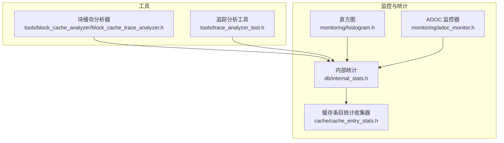
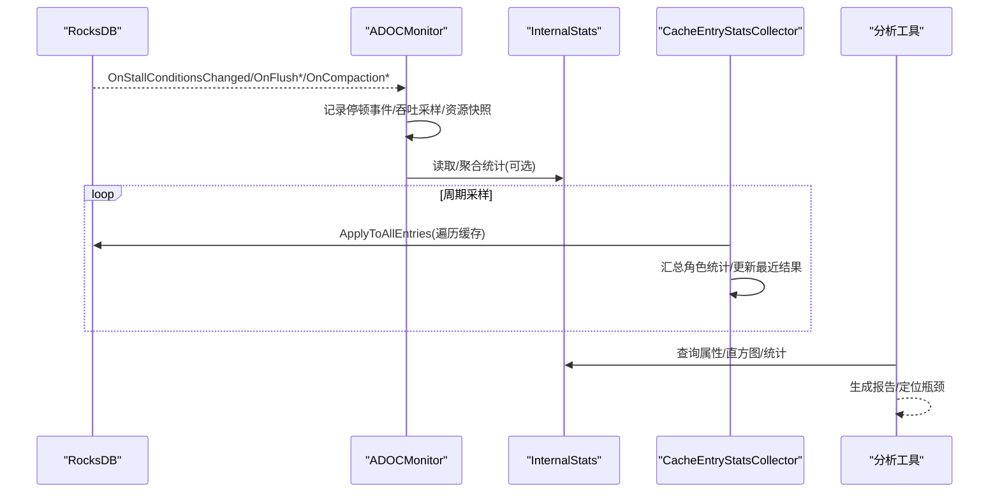
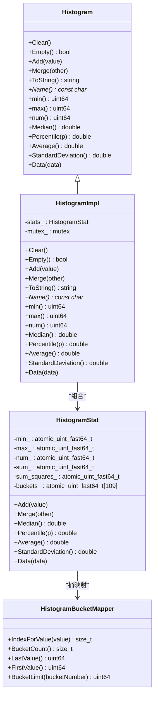
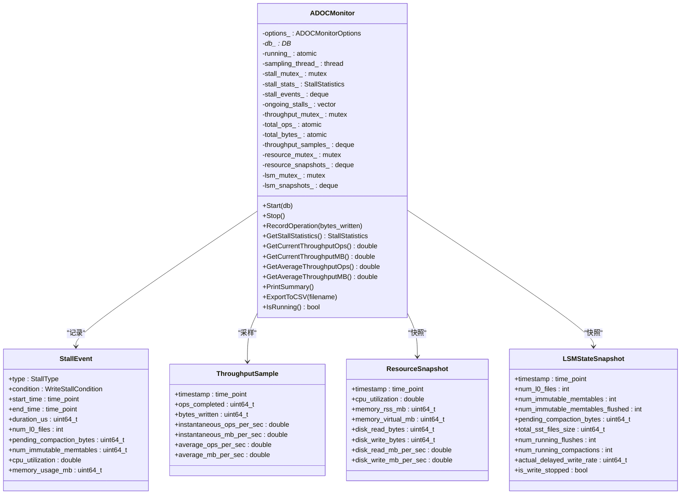
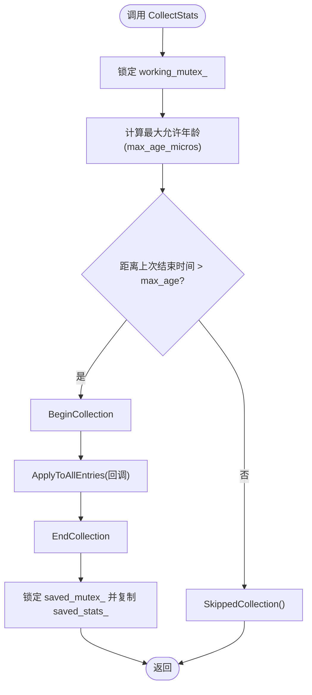
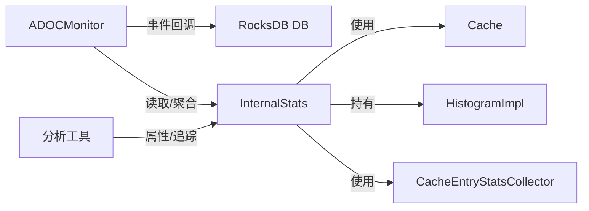

# 内存监控与分析

<cite>
**本文引用的文件**   
- [adoc_monitor.h](file://source/rocksdb_adoc_monitor/monitoring/adoc_monitor.h)
- [histogram.h](file://source/rocksdb/monitoring/histogram.h)
- [cache_entry_stats.h](file://source/rocksdb/cache/cache_entry_stats.h)
- [internal_stats.h](file://source/rocksdb/db/internal_stats.h)
- [block_cache_trace_analyzer.h](file://source/rocksdb/tools/block_cache_analyzer/block_cache_trace_analyzer.h)
- [trace_analyzer_tool.h](file://source/rocksdb/tools/trace_analyzer_tool.h)
</cite>

## 目录
1. [简介](#简介)
2. [项目结构](#项目结构)
3. [核心组件](#核心组件)
4. [架构总览](#架构总览)
5. [详细组件分析](#详细组件分析)
6. [依赖关系分析](#依赖关系分析)
7. [性能考量](#性能考量)
8. [故障排查指南](#故障排查指南)
9. [结论](#结论)
10. [附录](#附录)

## 简介
本文件面向“内存监控与分析”的完整工具链，覆盖以下目标：
- 内存使用统计系统的实现与聚合（计数器、直方图、窗口化指标）
- 关键监控工具的使用方法（block_cache_analyzer、内存使用分析器、性能分析工具）
- 关键内存指标的获取与分析方法（缓存命中率、内存分配频率、碎片化程度）
- 内存泄漏检测与调试技巧（堆栈跟踪、内存快照分析、问题定位）
- 性能分析流程（基准测试执行、结果解读、瓶颈识别）
- 内存优化实战案例与最佳实践
- 生产环境监控部署方案

## 项目结构
仓库包含多个 RocksDB 分支与工具集。与内存监控和分析相关的核心代码集中在以下位置：
- monitoring：直方图与 ADOC 监控器
- cache：缓存条目统计收集器
- db：内部统计与压缩/写入停顿等指标
- tools：块缓存分析与追踪分析工具

图表来源
- [adoc_monitor.h:1-205](file://source/rocksdb_adoc_monitor/monitoring/adoc_monitor.h#L1-L205)
- [histogram.h:1-144](file://source/rocksdb/monitoring/histogram.h#L1-L144)
- [cache_entry_stats.h:1-183](file://source/rocksdb/cache/cache_entry_stats.h#L1-L183)
- [internal_stats.h:1-800](file://source/rocksdb/db/internal_stats.h#L1-L800)
- [block_cache_trace_analyzer.h](file://source/rocksdb/tools/block_cache_analyzer/block_cache_trace_analyzer.h)
- [trace_analyzer_tool.h](file://source/rocksdb/tools/trace_analyzer_tool.h)

章节来源
- [adoc_monitor.h:1-205](file://source/rocksdb_adoc_monitor/monitoring/adoc_monitor.h#L1-L205)
- [histogram.h:1-144](file://source/rocksdb/monitoring/histogram.h#L1-L144)
- [cache_entry_stats.h:1-183](file://source/rocksdb/cache/cache_entry_stats.h#L1-L183)
- [internal_stats.h:1-800](file://source/rocksdb/db/internal_stats.h#L1-L800)
- [block_cache_trace_analyzer.h](file://source/rocksdb/tools/block_cache_analyzer/block_cache_trace_analyzer.h)
- [trace_analyzer_tool.h](file://source/rocksdb/tools/trace_analyzer_tool.h)

## 核心组件
- 直方图统计（Histogram/HistogramImpl/HistogramStat）
  - 提供计数、最小/最大、中位数、百分位、均值、标准差等统计能力，用于延迟、大小分布等指标
- ADOC 监控器（ADOCMonitor）
  - 基于 EventListener 采集写停顿、刷新/压缩事件、吞吐采样、资源快照（CPU/RSS/虚拟内存/磁盘IO）、LSM 状态快照，并输出 CSV
- 缓存条目统计收集器（CacheEntryStatsCollector）
  - 对 Cache 进行周期性全量扫描，按角色汇总容量、使用量、占用、条目数等，支持时间窗口复用结果以降低开销
- 内部统计（InternalStats）
  - 维护 DB/CF 级统计、压缩统计、文件读取延迟直方图、后台错误计数、属性查询接口等

章节来源
- [histogram.h:1-144](file://source/rocksdb/monitoring/histogram.h#L1-L144)
- [adoc_monitor.h:1-205](file://source/rocksdb_adoc_monitor/monitoring/adoc_monitor.h#L1-L205)
- [cache_entry_stats.h:1-183](file://source/rocksdb/cache/cache_entry_stats.h#L1-L183)
- [internal_stats.h:1-800](file://source/rocksdb/db/internal_stats.h#L1-L800)

## 架构总览
下图展示监控数据流：RocksDB 事件驱动 ADOCMonitor；InternalStats 聚合各子系统指标；CacheEntryStatsCollector 定期扫描缓存；外部工具通过属性接口或追踪文件进行分析。

图表来源
- [adoc_monitor.h:1-205](file://source/rocksdb_adoc_monitor/monitoring/adoc_monitor.h#L1-L205)
- [internal_stats.h:1-800](file://source/rocksdb/db/internal_stats.h#L1-L800)
- [cache_entry_stats.h:1-183](file://source/rocksdb/cache/cache_entry_stats.h#L1-L183)

## 详细组件分析

### 直方图统计（Histogram/HistogramImpl/HistogramStat）
- 设计要点
  - HistogramStat 以原子变量维护 min/max/num/sum/sum_squares 及桶计数，线程安全且无动态分配
  - HistogramImpl 对外暴露统一接口，支持 Clear/Add/Merge/Percentile/Average/StandardDeviation/Data
  - 桶映射由 HistogramBucketMapper 管理，支持将值映射到桶索引
- 复杂度与性能
  - Add 为 O(1)，统计计算如 Percentile/Average 为 O(BucketCount)
  - 适合高频插入、低频查询的场景
- 典型用途
  - 文件读取延迟、对象大小分布、写入批次大小分布等

图表来源
- [histogram.h:1-144](file://source/rocksdb/monitoring/histogram.h#L1-L144)

章节来源
- [histogram.h:1-144](file://source/rocksdb/monitoring/histogram.h#L1-L144)

### ADOC 监控器（ADOCMonitor）
- 功能概览
  - 监听写停顿条件变化、刷新/压缩开始与完成、MemTable 密封等事件
  - 定时采样吞吐（ops/sec、MB/sec）、系统资源（CPU、RSS、虚拟内存、磁盘 IO）、LSM 状态（L0 文件数、不可变 MemTable、待压缩字节、运行中的 flush/compaction、实际延迟写速率、是否停止写入）
  - 输出 CSV 文件，支持打印周期摘要
- 数据结构
  - StallEvent/ThroughputSample/ResourceSnapshot/LSMStateSnapshot/StallStatistics/ADOCMonitorOptions
- 并发与存储
  - 使用多把互斥锁保护 stall/throughput/resource/lsm 等独立数据集
  - 使用 deque 限制最大样本数量，避免无限增长
- 使用建议
  - 合理设置 sampling_interval_ms、max_stall_events、max_throughput_samples
  - 根据需求开启 record_stall_events/record_throughput/record_resources/record_lsm_state

图表来源
- [adoc_monitor.h:1-205](file://source/rocksdb_adoc_monitor/monitoring/adoc_monitor.h#L1-L205)

章节来源
- [adoc_monitor.h:1-205](file://source/rocksdb_adoc_monitor/monitoring/adoc_monitor.h#L1-L205)

### 缓存条目统计收集器（CacheEntryStatsCollector）
- 设计要点
  - 模板类，针对任意 Stats 类型进行缓存条目遍历与汇总
  - 通过 Cache::ApplyToAllEntries 遍历所有条目，BeginCollection/EndCollection/SkippedCollection 控制生命周期
  - 使用 saved/working 双缓冲与互斥锁保证并发安全
  - 支持时间窗口复用结果（min_interval_seconds/min_interval_factor），降低频繁扫描带来的开销
- 共享实例
  - GetShared 在 Cache 中以固定键保存 Collector 实例，避免重复创建与竞争
- 适用场景
  - 多 ColumnFamily/多 DB 共享同一 Cache 时，避免多个收集器互相干扰

图表来源
- [cache_entry_stats.h:1-183](file://source/rocksdb/cache/cache_entry_stats.h#L1-L183)

章节来源
- [cache_entry_stats.h:1-183](file://source/rocksdb/cache/cache_entry_stats.h#L1-L183)

### 内部统计（InternalStats）
- 功能概览
  - 维护 DB/CF 级别统计、压缩统计、文件读取延迟直方图、后台错误计数
  - 提供属性查询接口（GetStringProperty/GetIntProperty/GetMapProperty）
  - 集成 CacheEntryStatsCollector 获取缓存角色统计（容量、使用量、占用、条目数等）
- 关键成员
  - CompactionStats/CompactionStatsFull、file_read_latency_、blob_file_read_latency_
  - db_stats_/cf_stats_value_/cf_stats_count_
  - cache_entry_stats_collector_（绑定到 Cache）
- 使用建议
  - 通过属性接口导出统计，结合直方图与窗口化统计进行综合分析

章节来源
- [internal_stats.h:1-800](file://source/rocksdb/db/internal_stats.h#L1-L800)

### 块缓存分析器与追踪分析工具
- block_cache_analyzer
  - 用于分析块缓存的访问模式、命中率、热点键、淘汰策略效果等
  - 通常配合 RocksDB 的追踪/属性接口使用
- trace_analyzer_tool
  - 解析 RocksDB 追踪输出，辅助定位 IO/压缩/写入路径的性能瓶颈

章节来源
- [block_cache_trace_analyzer.h](file://source/rocksdb/tools/block_cache_analyzer/block_cache_trace_analyzer.h)
- [trace_analyzer_tool.h](file://source/rocksdb/tools/trace_analyzer_tool.h)

## 依赖关系分析
- ADOCMonitor 依赖 RocksDB EventListener 与 DB 接口，间接依赖 InternalStats 提供的统计
- InternalStats 依赖 Cache 与 CacheEntryStatsCollector，同时持有直方图统计
- 工具层通过属性接口或追踪文件与 InternalStats/Cache 交互

图表来源
- [adoc_monitor.h:1-205](file://source/rocksdb_adoc_monitor/monitoring/adoc_monitor.h#L1-L205)
- [internal_stats.h:1-800](file://source/rocksdb/db/internal_stats.h#L1-L800)
- [cache_entry_stats.h:1-183](file://source/rocksdb/cache/cache_entry_stats.h#L1-L183)
- [histogram.h:1-144](file://source/rocksdb/monitoring/histogram.h#L1-L144)

章节来源
- [adoc_monitor.h:1-205](file://source/rocksdb_adoc_monitor/monitoring/adoc_monitor.h#L1-L205)
- [internal_stats.h:1-800](file://source/rocksdb/db/internal_stats.h#L1-L800)
- [cache_entry_stats.h:1-183](file://source/rocksdb/cache/cache_entry_stats.h#L1-L183)
- [histogram.h:1-144](file://source/rocksdb/monitoring/histogram.h#L1-L144)

## 性能考量
- 直方图
  - 高频 Add、低频查询；注意桶数量与计算成本平衡
- ADOCMonitor
  - 采样间隔与最大样本数需权衡精度与内存占用；CSV 输出可能带来 IO 压力
- CacheEntryStatsCollector
  - 合理设置 min_interval_seconds/min_interval_factor，避免频繁全量扫描
- InternalStats
  - 属性查询与直方图导出应避免在高并发路径上阻塞

## 故障排查指南
- 写停顿（Write Stall）
  - 关注 L0 文件过多、不可变 MemTable 过多、待压缩字节过大、CPU/内存/磁盘 IO 瓶颈
  - 使用 ADOCMonitor 的停顿事件与资源快照定位根因
- 缓存命中率低
  - 检查块缓存大小、LRU 策略、热点键分布；使用 block_cache_analyzer 分析访问模式
- 内存增长与泄漏
  - 观察 RSS/虚拟内存趋势；结合 InternalStats 的后台错误计数与直方图异常
  - 使用追踪分析工具解析慢路径与热点
- 压缩与刷新
  - 监控运行中的 flush/compaction 数量与耗时；调整参数缓解背压

章节来源
- [adoc_monitor.h:1-205](file://source/rocksdb_adoc_monitor/monitoring/adoc_monitor.h#L1-L205)
- [internal_stats.h:1-800](file://source/rocksdb/db/internal_stats.h#L1-L800)
- [cache_entry_stats.h:1-183](file://source/rocksdb/cache/cache_entry_stats.h#L1-L183)
- [block_cache_trace_analyzer.h](file://source/rocksdb/tools/block_cache_analyzer/block_cache_trace_analyzer.h)
- [trace_analyzer_tool.h](file://source/rocksdb/tools/trace_analyzer_tool.h)

## 结论
通过直方图统计、ADOC 监控器、缓存条目统计收集器与内部统计的组合，可以构建完整的内存监控与分析体系。结合块缓存分析器与追踪分析工具，能够高效定位瓶颈、指导参数调优与内存优化。在生产环境中，应合理配置采样与输出策略，确保监控开销可控、数据可用性强。

## 附录

### 关键内存指标获取与分析方法
- 缓存命中率
  - 通过块缓存分析器与属性接口统计命中/未命中次数，结合访问模式优化缓存大小与策略
- 内存分配频率
  - 利用 InternalStats 的 DB/CF 统计与直方图观察分配规模与频率，识别异常峰值
- 碎片化程度
  - 通过 RSS/虚拟内存差异、缓存使用率与条目数对比，评估碎片化影响

### 内存泄漏检测与调试技巧
- 堆栈跟踪
  - 启用 RocksDB 追踪，结合 trace_analyzer_tool 解析调用链
- 内存快照分析
  - 使用 ADOCMonitor 的资源快照与 InternalStats 的缓存角色统计，定位持续增长的对象类别
- 问题定位方法
  - 从写停顿事件入手，关联 CPU/内存/磁盘 IO 指标，逐步缩小范围

### 性能分析流程
- 基准测试执行
  - 使用 YCSB 或 RocksDB 自带 benchmark，设定不同 workload 与并发度
- 结果解读
  - 关注吞吐、延迟分布（直方图 P50/P95/P99）、停顿事件密度、缓存命中率
- 瓶颈识别
  - 若 L0 堆积：增大 L0 目标文件大小/减少 L0 文件数上限
  - 若压缩慢：调整压缩级别/并行度/线程优先级
  - 若缓存命中率低：增大缓存/调整分片/预热热点数据

### 内存优化实战案例与最佳实践
- 案例一：高写入吞吐下的 L0 膨胀
  - 现象：L0 文件数激增，写停顿频繁
  - 措施：增大 L0 目标文件大小、提升 L0 压缩优先级、适当增加内存预算
  - 验证：观察停顿事件下降、吞吐稳定、延迟分布改善
- 案例二：缓存命中率低导致读放大
  - 现象：P99 延迟升高，CPU 利用率偏高
  - 措施：增大块缓存、启用二级缓存、热点数据预取
  - 验证：命中率提升、读延迟下降、CPU 利用率回落

### 生产环境监控部署方案
- 采集策略
  - ADOCMonitor 采样间隔 1~5 秒，限制最大样本数，CSV 落盘至独立磁盘
  - InternalStats 属性导出周期化，避免高频阻塞
- 告警规则
  - 写停顿持续时间/次数阈值、RSS/虚拟内存突增、缓存命中率低于阈值
- 可视化与归档
  - 将 CSV 导入时序数据库，绘制吞吐、延迟、资源使用曲线，保留历史用于回溯