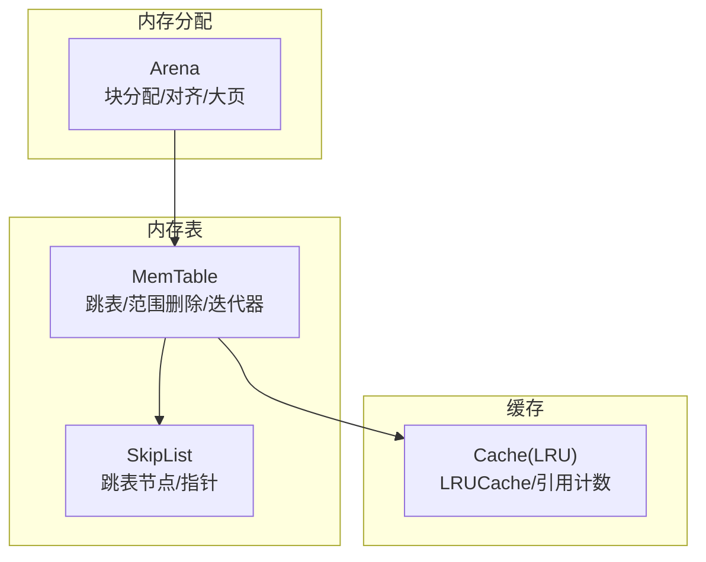
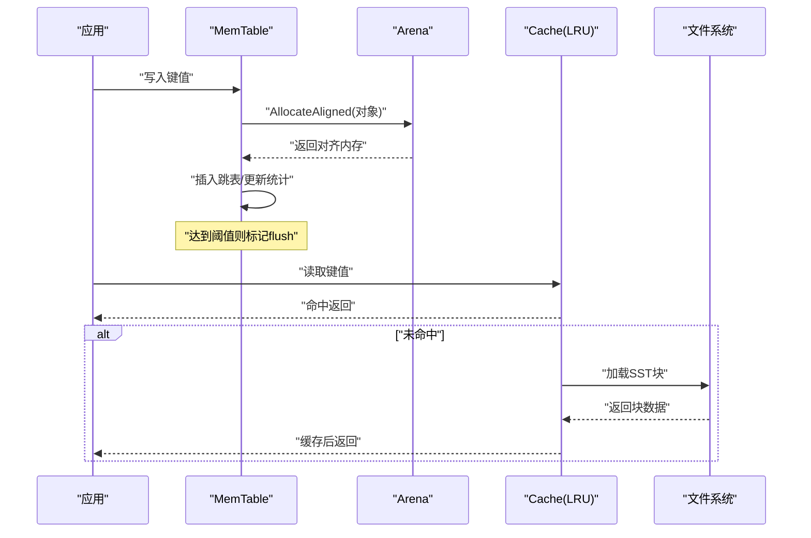
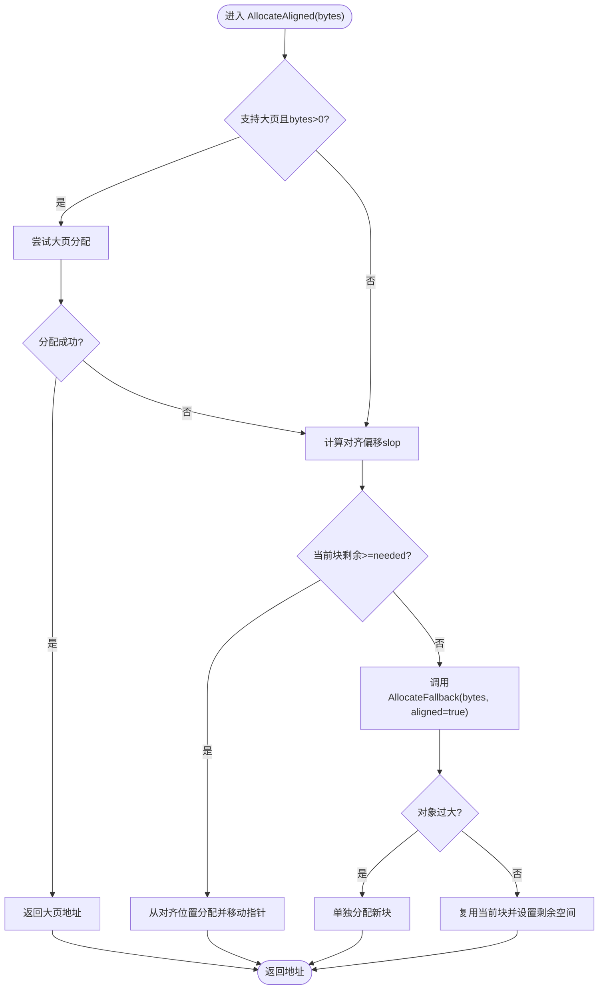
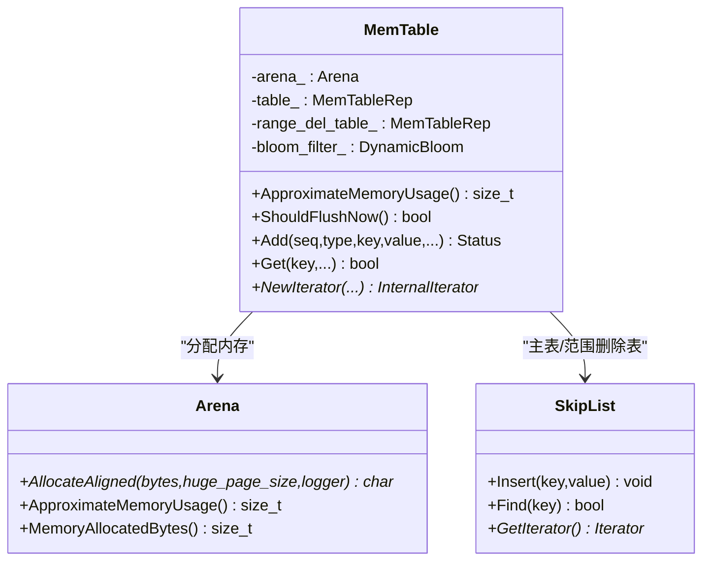
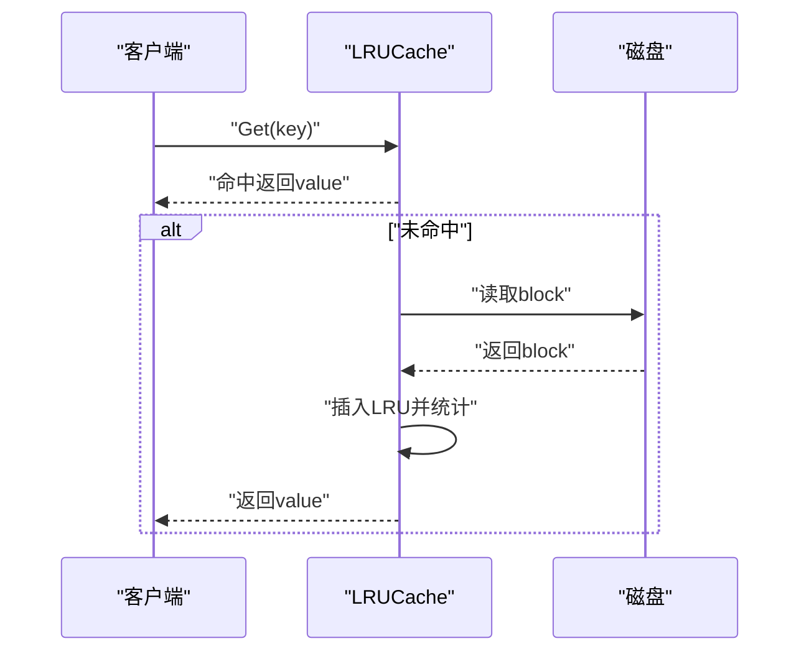
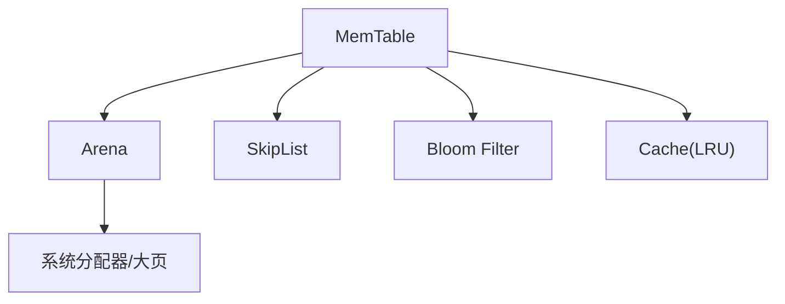

# 内存管理机制

<cite>
**本文引用的文件**   
- [arena.h](file://source/rocksdb/memory/arena.h)
- [arena.cc](file://source/rocksdb/memory/arena.cc)
- [memtable.h](file://source/rocksdb/db/memtable.h)
- [memtable.cc](file://source/rocksdb/db/memtable.cc)
- [cache.h](file://source/rocksdb/include/rocksdb/cache.h)
- [cache.cc](file://source/rocksdb/cache/cache.cc)
- [skiplist.h](file://source/rocksdb/memtable/skiplist.h)
</cite>

## 目录
1. [简介](#简介)
2. [项目结构](#项目结构)
3. [核心组件](#核心组件)
4. [架构总览](#架构总览)
5. [详细组件分析](#详细组件分析)
6. [依赖关系分析](#依赖关系分析)
7. [性能考量](#性能考量)
8. [故障排查指南](#故障排查指南)
9. [结论](#结论)
10. [附录](#附录)

## 简介
本文件面向 RocksDB 的内存管理机制，系统性阐述 Arena 内存分配器、MemTable 内存布局与并发控制、Block Cache（LRU）工作原理与优化策略，并提供内存使用监控、泄漏检测、性能分析与调优实践，以及按场景配置参数的建议。文档以源码为依据，结合可视化图示帮助读者快速理解设计与实现。

## 项目结构
围绕内存管理的核心代码主要分布在以下模块：
- memory/arena.*：Arena 内存分配器，负责小块对象的批量分配与大对象直分，支持对齐与大页分配。
- db/memtable.{h,cc}：MemTable 接口与实现，封装跳表等底层表示、迭代器、统计与刷新决策。
- include/rocksdb/cache.h 与 cache/cache.cc：Cache 抽象与 LRU 缓存实现。
- memtable/skiplist.h：跳表数据结构定义，用于 MemTable 的键值存储。

**图表来源** 
- [arena.h:25-120](file://source/rocksdb/memory/arena.h#L25-L120)
- [arena.cc:36-106](file://source/rocksdb/memory/arena.cc#L36-L106)
- [memtable.h:574-700](file://source/rocksdb/db/memtable.h#L574-L700)
- [memtable.cc:150-231](file://source/rocksdb/db/memtable.cc#L150-L231)
- [cache.h:1-200](file://source/rocksdb/include/rocksdb/cache.h#L1-L200)
- [cache.cc:1-200](file://source/rocksdb/cache/cache.cc#L1-L200)
- [skiplist.h:1-200](file://source/rocksdb/memtable/skiplist.h#L1-L200)

**章节来源**
- [arena.h:25-120](file://source/rocksdb/memory/arena.h#L25-L120)
- [arena.cc:36-106](file://source/rocksdb/memory/arena.cc#L36-L106)
- [memtable.h:574-700](file://source/rocksdb/db/memtable.h#L574-L700)
- [memtable.cc:150-231](file://source/rocksdb/db/memtable.cc#L150-L231)
- [cache.h:1-200](file://source/rocksdb/include/rocksdb/cache.h#L1-L200)
- [cache.cc:1-200](file://source/rocksdb/cache/cache.cc#L1-L200)
- [skiplist.h:1-200](file://source/rocksdb/memtable/skiplist.h#L1-L200)

## 核心组件
- Arena 内存分配器
  - 固定大小块管理：维护一个或多个块，从两端分别分配对齐与非对齐内存，减少碎片。
  - 大对象直分：超过阈值的大对象直接单独分配，避免浪费。
  - 大页支持：优先尝试大页分配，失败回退到普通分配。
  - 统计与跟踪：近似内存使用、已分配未使用字节、不规则块计数、块大小等。
- MemTable
  - 内存布局：内部通过 Arena 分配数据；主表与范围删除表均基于跳表；可选前缀 Bloom 过滤。
  - 并发访问：写路径支持并发插入（由具体 MemTableRep 实现），读路径提供迭代器；外部同步保证不可变状态。
  - 刷新决策：根据写入缓冲大小、Arena 剩余空间与比例阈值判断是否触发 flush。
- Block Cache（LRU）
  - 缓存抽象：统一 Cache 接口，支持 Get/Set/Release 等操作。
  - LRU 实现：维护双向链表与哈希表，按最近使用顺序淘汰。
  - 命中率优化：合理设置容量、条目大小、预取策略与多级缓存。

**章节来源**
- [arena.h:25-120](file://source/rocksdb/memory/arena.h#L25-L120)
- [arena.cc:63-143](file://source/rocksdb/memory/arena.cc#L63-L143)
- [memtable.h:49-120](file://source/rocksdb/db/memtable.h#L49-L120)
- [memtable.cc:238-329](file://source/rocksdb/db/memtable.cc#L238-L329)
- [cache.h:1-200](file://source/rocksdb/include/rocksdb/cache.h#L1-L200)
- [cache.cc:1-200](file://source/rocksdb/cache/cache.cc#L1-L200)

## 架构总览
RocksDB 的内存管理由三层构成：
- 分配层（Arena）：为小对象提供高效、低碎片的分配，为大对象提供独立分配，并支持对齐与大页。
- 存储层（MemTable）：在内存中以跳表组织键值，支持并发读写与范围删除，配合 Bloom 过滤加速查找。
- 缓存层（Cache/LRU）：对 SST 块进行缓存，提升热点数据的读取性能。

**图表来源** 
- [memtable.cc:150-231](file://source/rocksdb/db/memtable.cc#L150-L231)
- [arena.cc:108-143](file://source/rocksdb/memory/arena.cc#L108-L143)
- [cache.cc:1-200](file://source/rocksdb/cache/cache.cc#L1-L200)

## 详细组件分析

### Arena 内存分配器
设计要点：
- 块大小优化：将请求的块大小限制在最小与最大之间，并对齐到系统最大对齐单位。
- 双端分配：当前块内从两端分别分配对齐与非对齐内存，降低对齐开销。
- 大对象处理：超过块大小四分之一时单独分配，避免浪费。
- 大页分配：若系统支持且配置启用，优先尝试大页分配，失败回退。
- 统计接口：近似内存使用、已分配未使用字节、不规则块数量、块大小等。

**图表来源** 
- [arena.cc:108-143](file://source/rocksdb/memory/arena.cc#L108-L143)
- [arena.cc:63-93](file://source/rocksdb/memory/arena.cc#L63-L93)
- [arena.cc:145-168](file://source/rocksdb/memory/arena.cc#L145-L168)

关键实现细节：
- OptimizeBlockSize：确保块大小在合法范围内且对齐。
- AllocateFromHugePage：通过 MemMapping 分配大页并记录统计。
- AllocateNewBlock：为新块分配内存并更新 blocks_memory_ 与 tracker。
- ApproximateMemoryUsage：估算已用内存（排除未使用的剩余空间）。

**章节来源**
- [arena.h:25-120](file://source/rocksdb/memory/arena.h#L25-L120)
- [arena.cc:23-54](file://source/rocksdb/memory/arena.cc#L23-L54)
- [arena.cc:63-106](file://source/rocksdb/memory/arena.cc#L63-L106)
- [arena.cc:108-143](file://source/rocksdb/memory/arena.cc#L108-L143)
- [arena.cc:145-168](file://source/rocksdb/memory/arena.cc#L145-L168)

### MemTable 内存布局与并发控制
内存布局：
- 主表与范围删除表均为跳表，使用 Arena 分配节点与键值。
- 可选前缀 Bloom 过滤器，加速前缀查询。
- 迭代器可在 Arena 上构造，生命周期与 Arena 绑定。

并发访问：
- 写路径支持并发插入（由具体 MemTableRep 实现），读路径提供迭代器。
- 外部同步保证不可变状态（MarkImmutable 后不应再写入）。
- 刷新决策：根据 write_buffer_size、Arena 剩余空间与阈值判断是否触发 flush。

**图表来源** 
- [memtable.h:574-700](file://source/rocksdb/db/memtable.h#L574-L700)
- [memtable.cc:150-231](file://source/rocksdb/db/memtable.cc#L150-L231)
- [skiplist.h:1-200](file://source/rocksdb/memtable/skiplist.h#L1-L200)

关键实现细节：
- ImmutableMemTableOptions：包含 arena_block_size、huge_page_size、inplace_update_support 等。
- ShouldFlushNow：综合 write_buffer_size、Arena 剩余空间与比例阈值决定是否 flush。
- MemTableIterator：支持前缀 Bloom 过滤、校验与时间戳剥离等。

**章节来源**
- [memtable.h:49-120](file://source/rocksdb/db/memtable.h#L49-L120)
- [memtable.cc:238-329](file://source/rocksdb/db/memtable.cc#L238-L329)
- [memtable.cc:446-693](file://source/rocksdb/db/memtable.cc#L446-L693)

### Block Cache（LRU）工作原理
缓存抽象：
- Cache 接口提供 Get/Set/Release 等方法，支持引用计数与统计。
- LRUCache 实现维护双向链表与哈希表，按最近使用顺序淘汰。

命中率优化：
- 合理设置缓存容量与条目大小，避免频繁淘汰。
- 使用预取与合并读取减少随机 IO。
- 多级缓存策略：热数据常驻内存，冷数据下沉至磁盘或 SSD。

**图表来源** 
- [cache.h:1-200](file://source/rocksdb/include/rocksdb/cache.h#L1-L200)
- [cache.cc:1-200](file://source/rocksdb/cache/cache.cc#L1-L200)

**章节来源**
- [cache.h:1-200](file://source/rocksdb/include/rocksdb/cache.h#L1-L200)
- [cache.cc:1-200](file://source/rocksdb/cache/cache.cc#L1-L200)

## 依赖关系分析
- MemTable 依赖 Arena 进行内存分配，依赖跳表作为底层存储，依赖 Bloom 过滤器优化前缀查询。
- Cache 被上层读取路径使用，减少对磁盘的访问。
- Arena 依赖系统 malloc/mmap 与大页支持，提供高效分配。

**图表来源** 
- [memtable.cc:150-231](file://source/rocksdb/db/memtable.cc#L150-L231)
- [arena.cc:108-143](file://source/rocksdb/memory/arena.cc#L108-L143)
- [cache.cc:1-200](file://source/rocksdb/cache/cache.cc#L1-L200)

**章节来源**
- [memtable.cc:150-231](file://source/rocksdb/db/memtable.cc#L150-L231)
- [arena.cc:108-143](file://source/rocksdb/memory/arena.cc#L108-L143)
- [cache.cc:1-200](file://source/rocksdb/cache/cache.cc#L1-L200)

## 性能考量
- Arena 块大小选择：过大会导致浪费，过小会增加分配次数。应结合写入模式与对象大小分布调整。
- 大页分配：在高延迟或高吞吐场景下可显著降低 TLB 缺失，但需预留足够大页资源。
- MemTable 刷新阈值：合理设置 write_buffer_size 与比例阈值，避免频繁 flush 或过度占用内存。
- Cache 容量与命中率：根据热点数据规模与访问模式调整，避免抖动与频繁淘汰。
- 并发插入与迭代器：利用并发插入提升写吞吐，迭代器尽量复用以减少分配。

[本节为通用指导，不直接分析具体文件]

## 故障排查指南
常见问题与定位方法：
- 内存泄漏：检查 Arena 与 MemTable 的生命周期，确认析构函数释放 tracker 与块。
- 高内存占用：查看 ApproximateMemoryUsage 与 MemoryAllocatedBytes，分析 Arena 与 MemTable 的使用。
- 缓存命中率低：检查 Cache 容量、条目大小与访问模式，考虑预热与预取。
- 大页分配失败：确认系统大页预留与权限，必要时回退到普通分配。

**章节来源**
- [arena.cc:56-61](file://source/rocksdb/memory/arena.cc#L56-L61)
- [memtable.cc:238-255](file://source/rocksdb/db/memtable.cc#L238-L255)
- [cache.cc:1-200](file://source/rocksdb/cache/cache.cc#L1-L200)

## 结论
RocksDB 的内存管理通过 Arena、MemTable 与 Cache 三层协作，实现了高效、低碎片、高吞吐的内存分配与访问。合理配置参数与监控指标，可显著提升性能与稳定性。

[本节为总结，不直接分析具体文件]

## 附录
- 内存使用监控与分析工具：
  - 使用 ApproximateMemoryUsage 与 MemoryAllocatedBytes 监控 Arena 与 MemTable 的内存使用。
  - 通过 Statistics 与 Logger 输出缓存命中率与分配统计。
- 内存泄漏检测最佳实践：
  - 确保析构函数中释放 tracker 与块，避免悬挂指针。
  - 使用单元测试覆盖边界条件与异常路径。
- 性能分析与调优：
  - 调整 Arena 块大小、大页配置与 MemTable 刷新阈值。
  - 优化 Cache 容量与预取策略，减少随机 IO。
- 按场景配置参数建议：
  - 高写吞吐：增大 write_buffer_size，启用并发插入，适当增加 Arena 块大小。
  - 高读热点：增大 Cache 容量，启用预取与多级缓存。
  - 低延迟：启用大页分配，减少分配开销与 TLB 缺失。

[本节为补充信息，不直接分析具体文件]