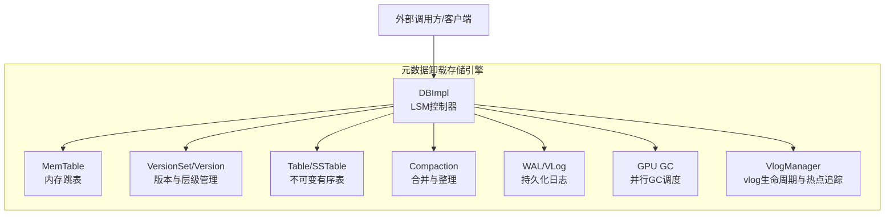
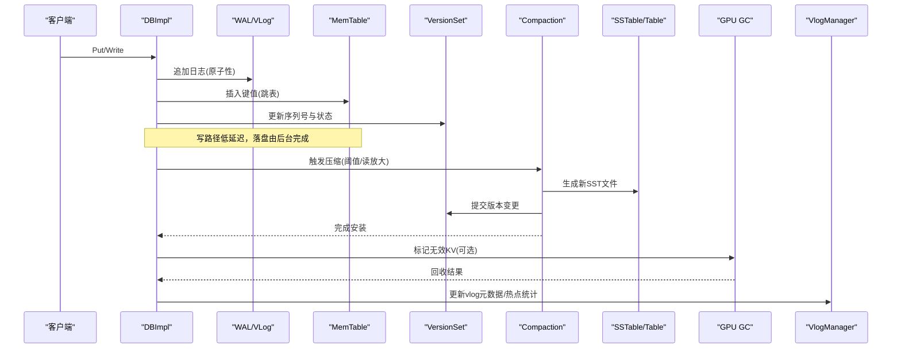
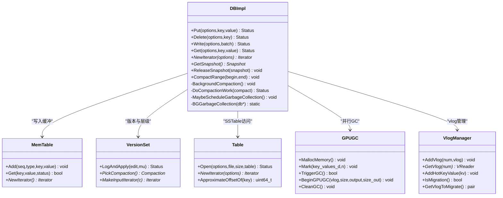
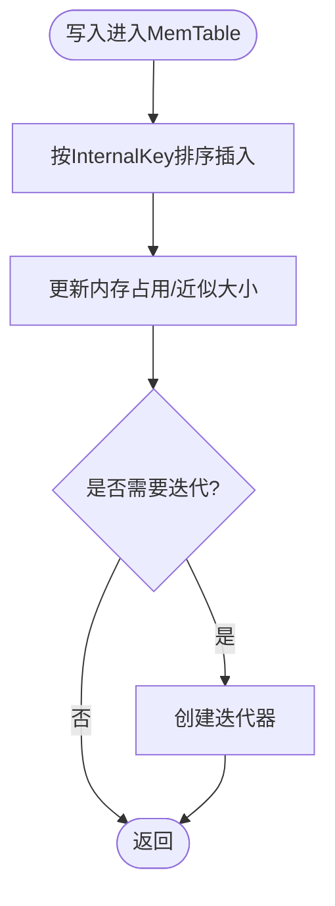
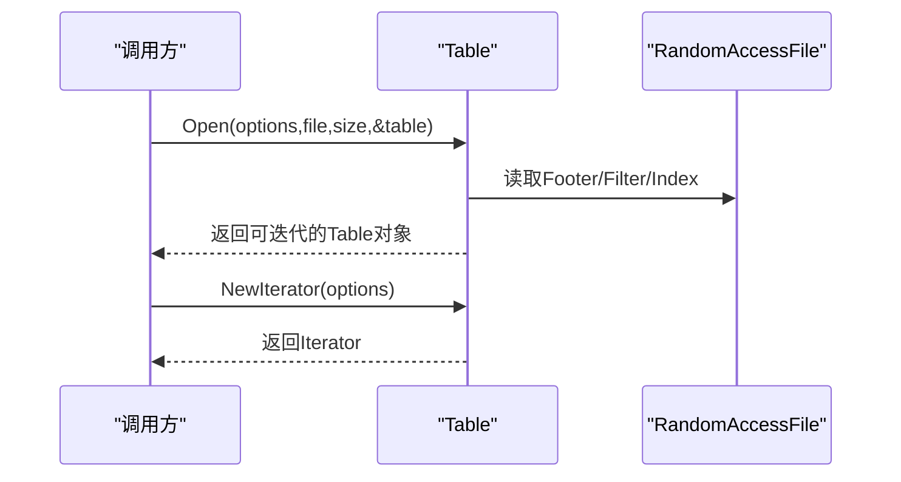
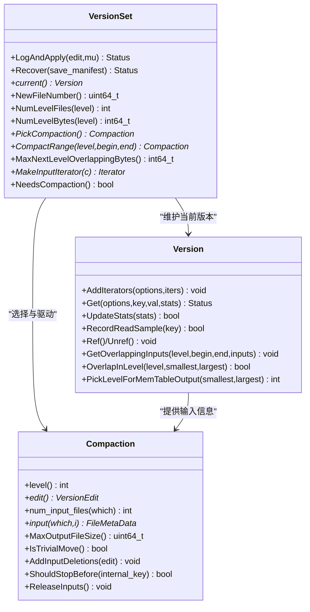
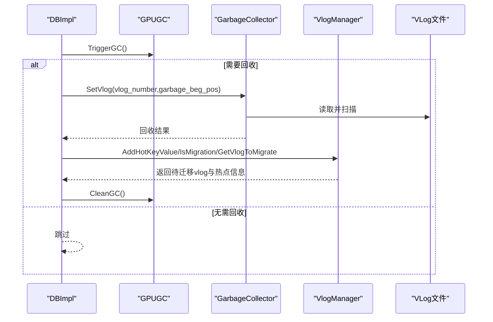
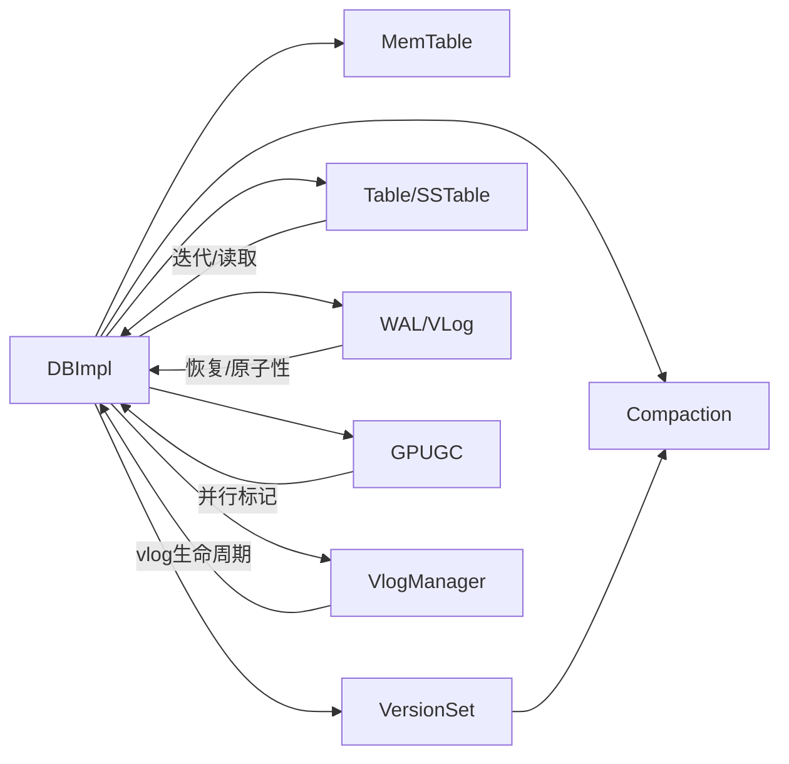
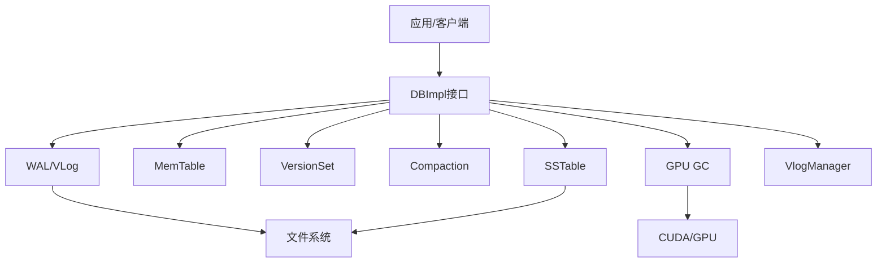

# 核心架构设计

<cite>
**本文引用的文件**   
- [source/leveldb-main/README.md](file://source/leveldb-main/README.md)
- [source/gParaKV-GC-master/README.md](file://source/gParaKV-GC-master/README.md)
- [source/leveldb-main/db/db_impl.h](file://source/leveldb-main/db/db_impl.h)
- [source/gParaKV-GC-master/db/db_impl.h](file://source/gParaKV-GC-master/db/db_impl.h)
- [source/leveldb-main/db/memtable.h](file://source/leveldb-main/db/memtable.h)
- [source/gParaKV-GC-master/db/memtable.h](file://source/gParaKV-GC-master/db/memtable.h)
- [source/leveldb-main/include/leveldb/table.h](file://source/leveldb-main/include/leveldb/table.h)
- [source/leveldb-main/db/version_set.h](file://source/leveldb-main/db/version_set.h)
- [source/gParaKV-GC-master/db/gpu_gc.h](file://source/gParaKV-GC-master/db/gpu_gc.h)
- [source/gParaKV-GC-master/db/garbage_collector.h](file://source/gParaKV-GC-master/db/garbage_collector.h)
- [source/gParaKV-GC-master/db/vlog_manager.h](file://source/gParaKV-GC-master/db/vlog_manager.h)
</cite>

## 目录
1. [简介](#简介)
2. [项目结构](#项目结构)
3. [核心组件](#核心组件)
4. [架构总览](#架构总览)
5. [详细组件分析](#详细组件分析)
6. [依赖关系分析](#依赖关系分析)
7. [性能考量](#性能考量)
8. [故障排查指南](#故障排查指南)
9. [结论](#结论)
10. [附录](#附录)

## 简介
本架构文档围绕 metadata_offload 项目的核心存储引擎展开，重点描述基于 LSM 树的高层设计、关键组件（MemTable、SSTable、Compaction）及其交互模式，并补充 gParaKV-GC 的 GPU 加速垃圾回收与 vlog 管理扩展。文档涵盖系统边界、数据流、集成点、技术决策与权衡、基础设施要求、可扩展性与部署拓扑，以及横切关注点（安全性、监控、灾难恢复），并提供系统上下文图与组件分解图，帮助读者从概念到代码实现全面理解。

## 项目结构
仓库包含多个子工程：
- leveldb-main：标准 LevelDB 源码，提供 LSM 树基础能力（MemTable、SSTable、版本集、后台压缩等）。
- gParaKV-GC-master：在 LevelDB 基础上引入 GPU 加速 GC、vlog（可变日志）管理与相关工具链。
- rocksdb 系列：用于对比或扩展的 RocksDB 分支（不在本次核心架构范围内）。
- YCSB：基准测试客户端集合。
- script：基准脚本与报告生成工具。

图表来源 
- [source/leveldb-main/db/db_impl.h](file://source/leveldb-main/db/db_impl.h)
- [source/gParaKV-GC-master/db/db_impl.h](file://source/gParaKV-GC-master/db/db_impl.h)
- [source/leveldb-main/db/memtable.h](file://source/leveldb-main/db/memtable.h)
- [source/leveldb-main/include/leveldb/table.h](file://source/leveldb-main/include/leveldb/table.h)
- [source/leveldb-main/db/version_set.h](file://source/leveldb-main/db/version_set.h)
- [source/gParaKV-GC-master/db/gpu_gc.h](file://source/gParaKV-GC-master/db/gpu_gc.h)
- [source/gParaKV-GC-master/db/vlog_manager.h](file://source/gParaKV-GC-master/db/vlog_manager.h)

章节来源
- [source/leveldb-main/README.md](file://source/leveldb-main/README.md)
- [source/gParaKV-GC-master/README.md](file://source/gParaKV-GC-master/README.md)

## 核心组件
- DBImpl：LSM 树的对外接口实现，协调 MemTable、WAL/VLog、版本集、压缩与后台任务。
- MemTable：基于跳表的内存有序表，支持高并发写入与迭代。
- Table/SSTable：不可变的有序表文件，支持高效随机读取与近似偏移定位。
- VersionSet/Version：维护多版本状态与层级文件布局，决定 Compaction 策略。
- Compaction：将小文件合并为大文件，清理过期键值，降低读放大。
- VLog/WAL：追加式日志，保证崩溃恢复与原子性。
- GPU GC：利用 CUDA 并行标记无效 KV 对，提升空间回收效率。
- VlogManager：管理 vlog 生命周期、热点 KV 统计与迁移触发。

章节来源
- [source/leveldb-main/db/db_impl.h](file://source/leveldb-main/db/db_impl.h)
- [source/gParaKV-GC-master/db/db_impl.h](file://source/gParaKV-GC-master/db/db_impl.h)
- [source/leveldb-main/db/memtable.h](file://source/leveldb-main/db/memtable.h)
- [source/gParaKV-GC-master/db/memtable.h](file://source/gParaKV-GC-master/db/memtable.h)
- [source/leveldb-main/include/leveldb/table.h](file://source/leveldb-main/include/leveldb/table.h)
- [source/leveldb-main/db/version_set.h](file://source/leveldb-main/db/version_set.h)
- [source/gParaKV-GC-master/db/gpu_gc.h](file://source/gParaKV-GC-master/db/gpu_gc.h)
- [source/gParaKV-GC-master/db/vlog_manager.h](file://source/gParaKV-GC-master/db/vlog_manager.h)

## 架构总览
下图展示 LSM 树在写入与读取路径中的主要组件交互，以及后台压缩与 GPU GC 的协作。

图表来源 
- [source/leveldb-main/db/db_impl.h](file://source/leveldb-main/db/db_impl.h)
- [source/gParaKV-GC-master/db/db_impl.h](file://source/gParaKV-GC-master/db/db_impl.h)
- [source/leveldb-main/db/version_set.h](file://source/leveldb-main/db/version_set.h)
- [source/leveldb-main/include/leveldb/table.h](file://source/leveldb-main/include/leveldb/table.h)
- [source/gParaKV-GC-master/db/gpu_gc.h](file://source/gParaKV-GC-master/db/gpu_gc.h)
- [source/gParaKV-GC-master/db/vlog_manager.h](file://source/gParaKV-GC-master/db/vlog_manager.h)

## 详细组件分析

### DBImpl：LSM 控制器与流程编排
- 职责：封装 Put/Delete/Write/Get/Iterator/Snapshot/CompactRange 等接口；协调 WAL/VLog、MemTable、版本集与压缩；调度后台任务（压缩、GC）。
- 关键方法：
  - Write/Put/Delete：先写 WAL/VLog，再入 MemTable，必要时触发 MakeRoomForWrite 与后台压缩。
  - Get：按层级顺序查找（MemTable→imm→SSTable），使用快照一致性。
  - BackgroundCompaction/DoCompactionWork：选择输入文件、合并输出、安装新版本。
  - MaybeScheduleGarbageCollection/BGGarbageCollection：触发 GPU GC 与 vlog 回收。
- 线程模型：主线程处理请求，后台线程执行压缩与 GC；通过互斥量与条件变量协调。

图表来源 
- [source/leveldb-main/db/db_impl.h](file://source/leveldb-main/db/db_impl.h)
- [source/gParaKV-GC-master/db/db_impl.h](file://source/gParaKV-GC-master/db/db_impl.h)
- [source/leveldb-main/db/memtable.h](file://source/leveldb-main/db/memtable.h)
- [source/leveldb-main/include/leveldb/table.h](file://source/leveldb-main/include/leveldb/table.h)
- [source/leveldb-main/db/version_set.h](file://source/leveldb-main/db/version_set.h)
- [source/gParaKV-GC-master/db/gpu_gc.h](file://source/gParaKV-GC-master/db/gpu_gc.h)
- [source/gParaKV-GC-master/db/vlog_manager.h](file://source/gParaKV-GC-master/db/vlog_manager.h)

章节来源
- [source/leveldb-main/db/db_impl.h](file://source/leveldb-main/db/db_impl.h)
- [source/gParaKV-GC-master/db/db_impl.h](file://source/gParaKV-GC-master/db/db_impl.h)

### MemTable：内存跳表与迭代器
- 数据结构：内部使用跳表（SkipList）组织 InternalKey，支持 O(logN) 插入与查找。
- 特性：引用计数管理生命周期；Arena 分配减少碎片；近似内存占用估算。
- 迭代：提供正向/反向迭代器，供上层合并与查询使用。

图表来源 
- [source/leveldb-main/db/memtable.h](file://source/leveldb-main/db/memtable.h)
- [source/gParaKV-GC-master/db/memtable.h](file://source/gParaKV-GC-master/db/memtable.h)

章节来源
- [source/leveldb-main/db/memtable.h](file://source/leveldb-main/db/memtable.h)
- [source/gParaKV-GC-master/db/memtable.h](file://source/gParaKV-GC-master/db/memtable.h)

### Table/SSTable：不可变有序表
- 特点：只读、多线程安全；支持按 Key 快速定位与块级读取；提供 ApproximateOffsetOf 优化随机读。
- 打开流程：解析 Footer、Filter、索引，构建 Rep 结构以便后续查询。

图表来源 
- [source/leveldb-main/include/leveldb/table.h](file://source/leveldb-main/include/leveldb/table.h)

章节来源
- [source/leveldb-main/include/leveldb/table.h](file://source/leveldb-main/include/leveldb/table.h)

### VersionSet/Version：版本与层级管理
- Version：维护每层文件列表、最近一次 compaction 目标、重叠范围查询、迭代器拼接。
- VersionSet：当前版本、Manifest 持久化、文件号分配、Compaction 选择、输入迭代器构造。
- Compaction：定义输入层级与输出目标，计算最大输出文件大小，判断是否 trivial move。

图表来源 
- [source/leveldb-main/db/version_set.h](file://source/leveldb-main/db/version_set.h)

章节来源
- [source/leveldb-main/db/version_set.h](file://source/leveldb-main/db/version_set.h)

### GPU GC 与 VLog 管理：空间回收与热数据迁移
- GPU GC：通过 CUDA 并行标记无效 KV 对，减少 CPU 开销；支持 BeginGPUGC/BeginGPUGCOptimized 两种模式；维护 gpu_flags 与 invalid_count 统计。
- GarbageCollector：封装 vlog 读取与回收位置跟踪，配合 DBImpl 进行后台回收。
- VlogManager：管理 vlog 生命周期、热点 KV 统计、迁移阈值判断与批量迁移。

图表来源 
- [source/gParaKV-GC-master/db/gpu_gc.h](file://source/gParaKV-GC-master/db/gpu_gc.h)
- [source/gParaKV-GC-master/db/garbage_collector.h](file://source/gParaKV-GC-master/db/garbage_collector.h)
- [source/gParaKV-GC-master/db/vlog_manager.h](file://source/gParaKV-GC-master/db/vlog_manager.h)
- [source/gParaKV-GC-master/db/db_impl.h](file://source/gParaKV-GC-master/db/db_impl.h)

章节来源
- [source/gParaKV-GC-master/db/gpu_gc.h](file://source/gParaKV-GC-master/db/gpu_gc.h)
- [source/gParaKV-GC-master/db/garbage_collector.h](file://source/gParaKV-GC-master/db/garbage_collector.h)
- [source/gParaKV-GC-master/db/vlog_manager.h](file://source/gParaKV-GC-master/db/vlog_manager.h)
- [source/gParaKV-GC-master/db/db_impl.h](file://source/gParaKV-GC-master/db/db_impl.h)

## 依赖关系分析
- 组件耦合：
  - DBImpl 强依赖 MemTable、VersionSet、TableCache、WAL/VLog、Compaction。
  - VersionSet 依赖 Compaction 与 FileMetaData，负责层级布局与版本演进。
  - GPU GC 与 VlogManager 作为扩展模块，被 DBImpl 按需调用。
- 外部依赖：
  - 操作系统环境抽象（Env）、锁与线程原语（port/port.h）。
  - 可选压缩库（Snappy/Zstd）。
  - CUDA 工具链（gParaKV-GC 分支）。

图表来源 
- [source/leveldb-main/db/db_impl.h](file://source/leveldb-main/db/db_impl.h)
- [source/gParaKV-GC-master/db/db_impl.h](file://source/gParaKV-GC-master/db/db_impl.h)
- [source/leveldb-main/db/version_set.h](file://source/leveldb-main/db/version_set.h)
- [source/leveldb-main/include/leveldb/table.h](file://source/leveldb-main/include/leveldb/table.h)
- [source/gParaKV-GC-master/db/gpu_gc.h](file://source/gParaKV-GC-master/db/gpu_gc.h)
- [source/gParaKV-GC-master/db/vlog_manager.h](file://source/gParaKV-GC-master/db/vlog_manager.h)

章节来源
- [source/leveldb-main/db/db_impl.h](file://source/leveldb-main/db/db_impl.h)
- [source/gParaKV-GC-master/db/db_impl.h](file://source/gParaKV-GC-master/db/db_impl.h)
- [source/leveldb-main/db/version_set.h](file://source/leveldb-main/db/version_set.h)

## 性能考量
- 写路径优化：WAL 顺序写 + MemTable 跳表插入，避免随机 IO；后台异步压缩降低写放大。
- 读路径优化：多层级合并迭代、过滤器（Bloom Filter，若启用）、近似偏移定位减少磁盘访问。
- Compaction 策略：基于层级大小与重叠度选择输入，控制输出文件大小，避免过大的读放大。
- GPU GC：利用并行标记减少无效 KV 对的空间放大，提高回收吞吐。
- 缓存与压缩：合理配置内存缓存与压缩算法，平衡 CPU 与 IO 资源。

[本节为通用指导，不直接分析具体文件]

## 故障排查指南
- 常见问题定位：
  - 写放大过高：检查 Compaction 阈值与层级大小配置，观察 MaxNextLevelOverlappingBytes。
  - 读延迟抖动：确认缓存命中率与过滤器有效性，查看 ApproximateOffsetOf 命中情况。
  - 空间膨胀：检查 GC 触发频率与 GPU 标记效果，关注 invalid_count 与迁移阈值。
  - 崩溃恢复：验证 WAL/VLog 完整性与 Manifest 一致性，确保 Recover 流程正确。
- 调试建议：
  - 开启 info_log 与统计属性（GetProperty），采集 CompactionStats 与近似大小。
  - 使用 TEST_CompactRange/TEST_CompactMemTable 进行可控压测。
  - 针对 vlog 问题，使用 VlogManager 与 GarbageCollector 的接口定位异常 vlog。

章节来源
- [source/leveldb-main/db/db_impl.h](file://source/leveldb-main/db/db_impl.h)
- [source/gParaKV-GC-master/db/db_impl.h](file://source/gParaKV-GC-master/db/db_impl.h)
- [source/leveldb-main/db/version_set.h](file://source/leveldb-main/db/version_set.h)

## 结论
metadata_offload 的核心以 LevelDB 的 LSM 树为基础，结合 gParaKV-GC 的 GPU 加速 GC 与 vlog 管理，形成高性能、可扩展的元数据存储引擎。通过清晰的组件边界与数据流设计，系统在写放大、读延迟与空间利用率之间取得良好平衡。建议在部署时根据工作负载调优 Compaction 与 GC 参数，并结合监控指标持续优化。

[本节为总结，不直接分析具体文件]

## 附录

### 系统上下文图

[此图为概念性上下文图，不映射到具体源文件]

### 基础设施要求与兼容性
- 操作系统：POSIX/Linux（Ubuntu 22.04 已验证）。
- 编译器：gcc/g++ ≥ 11，C++17。
- 构建系统：CMake ≥ 3.26。
- GPU（可选）：NVIDIA 驱动 ≥ 550.xx，CUDA Toolkit 12.3。
- 压缩库：libsnappy-dev（推荐）。

章节来源
- [source/gParaKV-GC-master/README.md](file://source/gParaKV-GC-master/README.md)
- [source/leveldb-main/README.md](file://source/leveldb-main/README.md)

### 部署拓扑建议
- 单节点部署：适用于中小规模元数据服务，CPU+SSD 即可满足；如需更高吞吐，增加 GPU 加速 GC。
- 多副本/分片：通过外部协调器（如 ZooKeeper）管理元数据分片与路由，每个节点运行独立 LSM 实例。
- 监控与告警：采集 CompactionStats、缓存命中率、GC 回收率、vlog 大小与迁移次数，设置阈值告警。

[本节为通用指导，不直接分析具体文件]