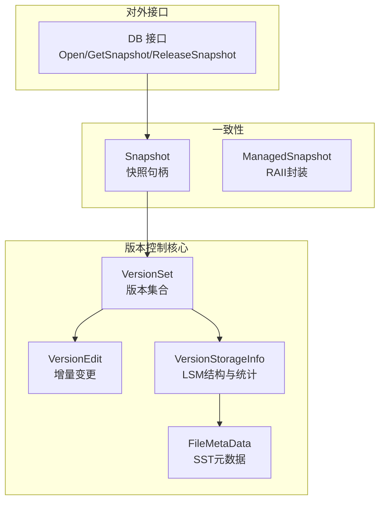
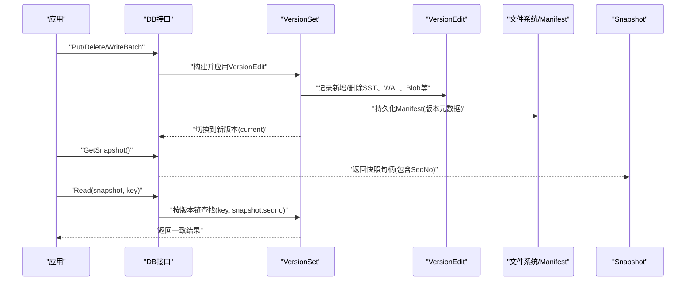
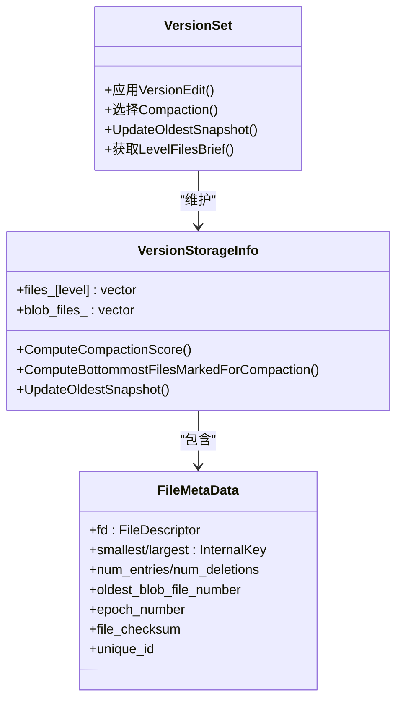
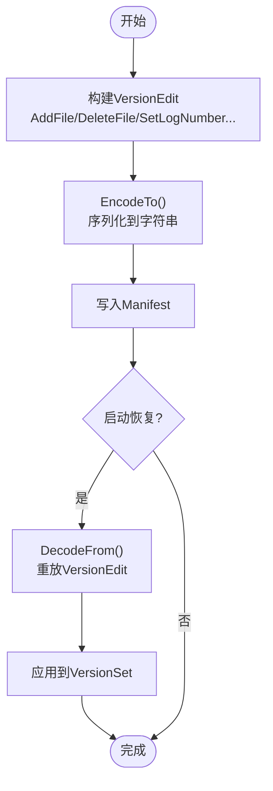
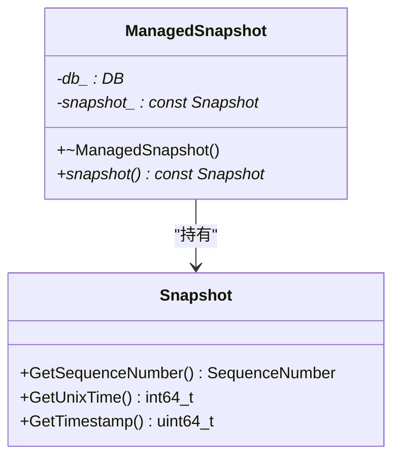
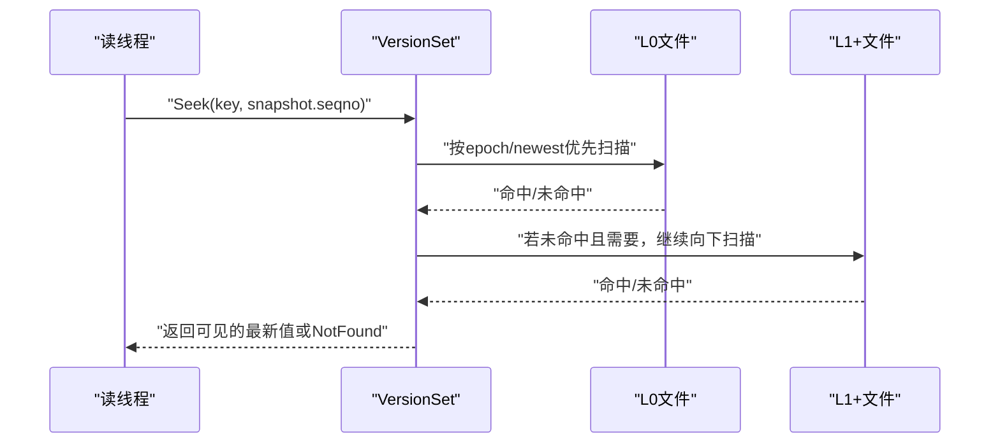
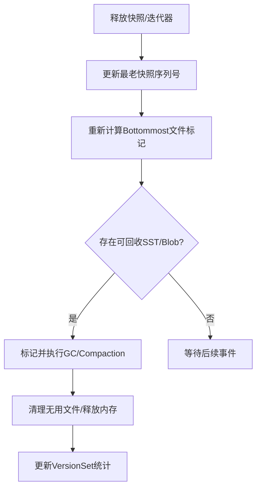
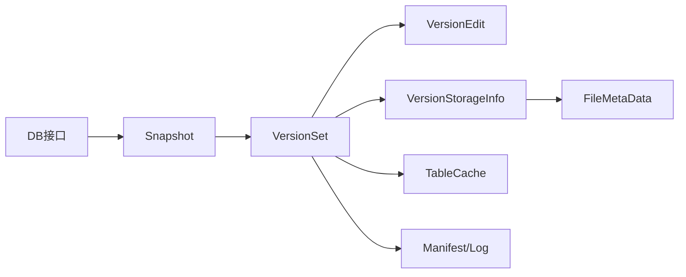

# 版本控制系统

<cite>
**本文引用的文件**   
- [version_set.h](file://source/rocksdb/db/version_set.h)
- [version_set.cc](file://source/rocksdb/db/version_set.cc)
- [version_edit.h](file://source/rocksdb/db/version_edit.h)
- [version_edit.cc](file://source/rocksdb/db/version_edit.cc)
- [snapshot.h](file://source/rocksdb/include/rocksdb/snapshot.h)
- [db.h](file://source/rocksdb/include/rocksdb/db.h)
</cite>

## 目录
1. [引言](#引言)
2. [项目结构](#项目结构)
3. [核心组件](#核心组件)
4. [架构总览](#架构总览)
5. [详细组件分析](#详细组件分析)
6. [依赖关系分析](#依赖关系分析)
7. [性能考量](#性能考量)
8. [故障排查指南](#故障排查指南)
9. [结论](#结论)
10. [附录](#附录)

## 引言
本文件面向RocksDB的版本控制与MVCC（多版本并发控制）机制，系统性阐述VersionSet的设计模式、VersionEdit的增量更新策略、Snapshot的一致性保证，以及垃圾回收、空间清理与元数据同步等版本链管理策略。同时提供API使用示例与最佳实践，并给出版本损坏恢复、一致性验证与性能优化的指导。

## 项目结构
围绕版本控制的核心代码集中在以下模块：
- 版本集合与存储信息：version_set.h/.cc
- 版本编辑与持久化：version_edit.h/.cc
- 快照抽象与RAII封装：snapshot.h
- 数据库对外接口（含快照创建/释放）：db.h

图表来源
- [version_set.h:130-800](file://source/rocksdb/db/version_set.h#L130-L800)
- [version_edit.h:695-800](file://source/rocksdb/db/version_edit.h#L695-L800)
- [snapshot.h:14-54](file://source/rocksdb/include/rocksdb/snapshot.h#L14-L54)
- [db.h:126-200](file://source/rocksdb/include/rocksdb/db.h#L126-L200)

章节来源
- [version_set.h:1-120](file://source/rocksdb/db/version_set.h#L1-L120)
- [version_edit.h:1-120](file://source/rocksdb/db/version_edit.h#L1-L120)
- [snapshot.h:1-54](file://source/rocksdb/include/rocksdb/snapshot.h#L1-L54)
- [db.h:126-200](file://source/rocksdb/include/rocksdb/db.h#L126-L200)

## 核心组件
- VersionSet：维护当前及历史版本，协调版本切换、Compaction选择、快照可见性阈值等。
- VersionEdit：描述一次版本的增量变更（新增/删除SST/Blob/WAL等），用于Manifest持久化与回放。
- VersionStorageInfo：描述每个Version的LSM树结构、文件分布、压缩评分、过期TTL标记等。
- FileMetaData：单个SST文件的元数据（键范围、时间戳、校验和、Epoch等）。
- Snapshot/ManagedSnapshot：快照隔离语义的句柄与RAII封装，确保读操作在一致时间点可见。

章节来源
- [version_set.h:130-800](file://source/rocksdb/db/version_set.h#L130-L800)
- [version_edit.h:695-800](file://source/rocksdb/db/version_edit.h#L695-L800)
- [snapshot.h:14-54](file://source/rocksdb/include/rocksdb/snapshot.h#L14-L54)

## 架构总览
RocksDB通过“版本+快照”实现MVCC：
- 写路径：MemTable写入后Flush生成SST，产生VersionEdit；VersionSet应用VersionEdit得到新版本，并持久化到Manifest。
- 读路径：基于Snapshot的SequenceNumber，按版本链从新到旧合并查找，遇到冲突或不可见则继续回溯。
- Compaction：依据VersionStorageInfo的评分与标记，将多层SST合并，减少读取放大与空间放大。
- 垃圾回收：根据最老活跃快照序列号与Blob引用，判定可回收的SST/Blob并清理。

图表来源
- [version_set.cc:1-200](file://source/rocksdb/db/version_set.cc#L1-L200)
- [version_edit.cc:112-200](file://source/rocksdb/db/version_edit.cc#L112-L200)
- [snapshot.h:14-54](file://source/rocksdb/include/rocksdb/snapshot.h#L14-L54)
- [db.h:126-200](file://source/rocksdb/include/rocksdb/db.h#L126-L200)

## 详细组件分析

### VersionSet：版本集合与LSM视图
- 职责
  - 维护current版本与历史版本，供迭代器与读路径访问。
  - 计算Compaction优先级与候选文件，驱动Compaction。
  - 维护最老快照序列号，影响Bottommost文件标记与垃圾回收。
- 关键数据结构
  - VersionStorageInfo：每层文件列表、索引、压缩评分、过期TTL、强制Blob GC标记等。
  - FileMetaData：SST元数据（键范围、seqno、epoch、checksum、unique_id等）。
- 线程模型
  - Version/VersionSet为线程兼容，但外部需加锁保护所有访问。

图表来源
- [version_set.h:130-800](file://source/rocksdb/db/version_set.h#L130-L800)
- [version_edit.h:245-493](file://source/rocksdb/db/version_edit.h#L245-L493)

章节来源
- [version_set.h:130-800](file://source/rocksdb/db/version_set.h#L130-L800)
- [version_set.cc:1-200](file://source/rocksdb/db/version_set.cc#L1-L200)

### VersionEdit：增量更新与持久化
- 设计要点
  - 以Tag区分字段（如kNewFile4、kDeletedFile、kBlobFileAddition等），支持向前兼容。
  - 编码/解码SST/Blob/WAL的增删，最小化Manifest体积。
  - 支持子压缩进度(SubcompactionProgress)增量持久化，避免重复持久化全部输出文件。
- 典型流程
  - 构建VersionEdit（添加新SST、删除旧SST、更新WAL/Blob等）。
  - 序列化到Manifest，崩溃恢复时重放以重建版本状态。

图表来源
- [version_edit.cc:112-200](file://source/rocksdb/db/version_edit.cc#L112-L200)
- [version_edit.h:33-124](file://source/rocksdb/db/version_edit.h#L33-L124)

章节来源
- [version_edit.h:33-124](file://source/rocksdb/db/version_edit.h#L33-L124)
- [version_edit.cc:112-200](file://source/rocksdb/db/version_edit.cc#L112-L200)

### Snapshot：快照隔离与一致性
- 语义
  - Snapshot是不可变对象，跨线程安全，持有特定时刻的SequenceNumber。
  - ManagedSnapshot提供RAII自动释放。
- 一致性保证
  - 读操作仅看到小于等于Snapshot序列号的提交。
  - 版本链回溯时，忽略晚于Snapshot的新版本。

图表来源
- [snapshot.h:14-54](file://source/rocksdb/include/rocksdb/snapshot.h#L14-L54)

章节来源
- [snapshot.h:14-54](file://source/rocksdb/include/rocksdb/snapshot.h#L14-L54)

### MVCC：快照隔离、事务可见性与冲突检测
- 快照隔离
  - 读路径基于Snapshot的SequenceNumber过滤版本，只可见已提交的早期版本。
- 事务可见性
  - 内部通过SequenceNumber与版本链顺序决定可见性；对Merge场景，按最新优先合并。
- 冲突检测
  - 单实例RocksDB无全局事务管理器，冲突检测由上层（如Transaction）结合WriteBufferManager与Locking实现；底层通过版本链与序列号保障一致性。

图表来源
- [version_set.cc:100-200](file://source/rocksdb/db/version_set.cc#L100-L200)
- [version_set.cc:200-400](file://source/rocksdb/db/version_set.cc#L200-L400)

章节来源
- [version_set.cc:100-200](file://source/rocksdb/db/version_set.cc#L100-L200)
- [version_set.cc:200-400](file://source/rocksdb/db/version_set.cc#L200-L400)

### 版本链管理与垃圾回收
- 版本链
  - current指向最新版本，历史版本保留给活跃迭代器与快照。
  - UpdateOldestSnapshot更新最老快照序列号，触发Bottommost文件标记与回收评估。
- 垃圾回收
  - SST：当文件不再被任何活跃快照引用且无Compaction输入时，可删除。
  - Blob：基于BlobFileMetaData的garbage字节与引用计数进行GC。
- 空间清理
  - Compaction评分与标记（过期TTL、周期压缩、强制Blob GC、读触发压缩）协同降低空间放大。

图表来源
- [version_set.h:260-270](file://source/rocksdb/db/version_set.h#L260-L270)
- [version_set.h:452-477](file://source/rocksdb/db/version_set.h#L452-L477)

章节来源
- [version_set.h:260-270](file://source/rocksdb/db/version_set.h#L260-L270)
- [version_set.h:452-477](file://source/rocksdb/db/version_set.h#L452-L477)

## 依赖关系分析
- VersionSet依赖
  - VersionEdit：解析与应用增量变更。
  - FileMetaData/LevelFilesBrief：描述SST元数据与层级概览。
  - Manifest/LogReader/Writer：持久化与恢复。
  - TableCache/TableReader：表级缓存与读取。
- 对外接口
  - DB接口负责Open/Close、快照创建与释放，向上暴露一致的MVCC语义。

图表来源
- [db.h:126-200](file://source/rocksdb/include/rocksdb/db.h#L126-L200)
- [version_set.h:130-800](file://source/rocksdb/db/version_set.h#L130-L800)
- [version_edit.h:695-800](file://source/rocksdb/db/version_edit.h#L695-L800)

章节来源
- [db.h:126-200](file://source/rocksdb/include/rocksdb/db.h#L126-L200)
- [version_set.h:130-800](file://source/rocksdb/db/version_set.h#L130-L800)

## 性能考量
- 读路径优化
  - Level-0按epoch排序，快速定位最新版本；Level-n使用二分与分数级联缩小搜索范围。
  - MultiGet批量查询复用文件范围与索引，减少重复扫描。
- 写路径优化
  - 批量构建VersionEdit，减少Manifest写入次数。
  - 合理设置Compaction策略与阈值，降低写放大与读放大。
- 缓存与预取
  - TableReader预取与PinnedTableReader避免频繁缓存查找。
- 统计与自适应
  - VersionStorageInfo维护压缩评分、过期TTL、强制GC标记，动态调整Compaction。

章节来源
- [version_set.cc:100-200](file://source/rocksdb/db/version_set.cc#L100-L200)
- [version_set.cc:200-400](file://source/rocksdb/db/version_set.cc#L200-L400)
- [version_edit.cc:112-200](file://source/rocksdb/db/version_edit.cc#L112-L200)

## 故障排查指南
- 版本损坏恢复
  - 检查Manifest完整性，必要时回滚到上一个有效版本。
  - 使用Replay机制重放VersionEdit，重建VersionSet状态。
- 一致性验证
  - 对比不同Snapshot下的读结果，确认可见性符合预期。
  - 检查最老快照序列号是否推进，避免长期不释放导致无法回收。
- 常见问题
  - L0文件过多引发读放大：调整L0阈值与Compaction策略。
  - Blob垃圾未回收：检查Blob引用与GC阈值配置。
  - Manifest过大：优化VersionEdit粒度与SubcompactionProgress增量持久化。

章节来源
- [version_edit.cc:112-200](file://source/rocksdb/db/version_edit.cc#L112-L200)
- [version_set.h:260-270](file://source/rocksdb/db/version_set.h#L260-L270)

## 结论
RocksDB通过VersionSet与VersionEdit构建了稳健的版本控制体系，结合Snapshot实现MVCC与快照隔离。VersionStorageInfo与FileMetaData为Compaction与垃圾回收提供了精确的元数据支撑。通过合理的配置与监控，可在高并发场景下获得稳定一致的性能表现。

## 附录
- API使用示例与最佳实践
  - 创建与释放快照：使用DB::GetSnapshot()与DB::ReleaseSnapshot()，推荐用ManagedSnapshot自动管理生命周期。
  - 读操作：传入Snapshot参数，确保读一致性；避免长时间持有快照导致回收延迟。
  - 写操作：批量WriteBatch减少日志与Manifest压力；合理设置flush与compaction阈值。
  - 监控与调优：关注最老快照序列号、L0文件数、Blob垃圾比例与Compaction评分。

章节来源
- [snapshot.h:14-54](file://source/rocksdb/include/rocksdb/snapshot.h#L14-L54)
- [db.h:126-200](file://source/rocksdb/include/rocksdb/db.h#L126-L200)