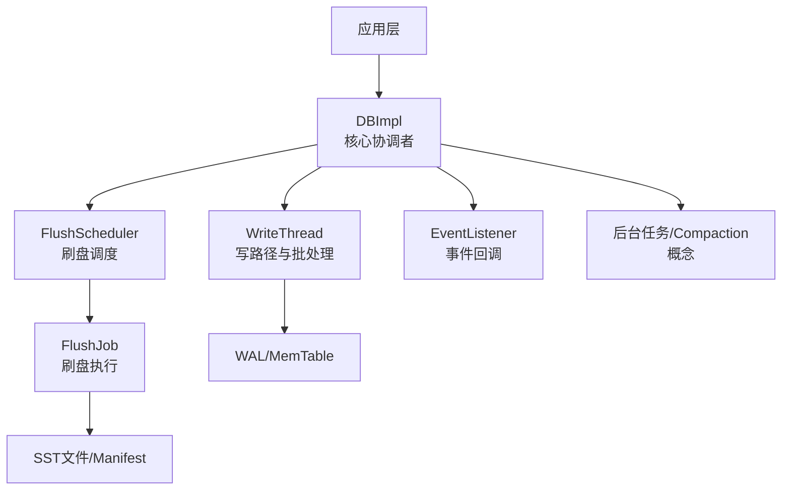
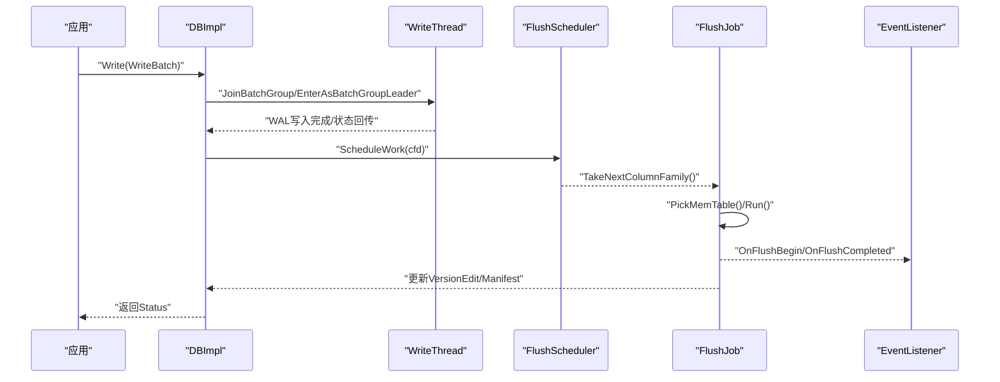
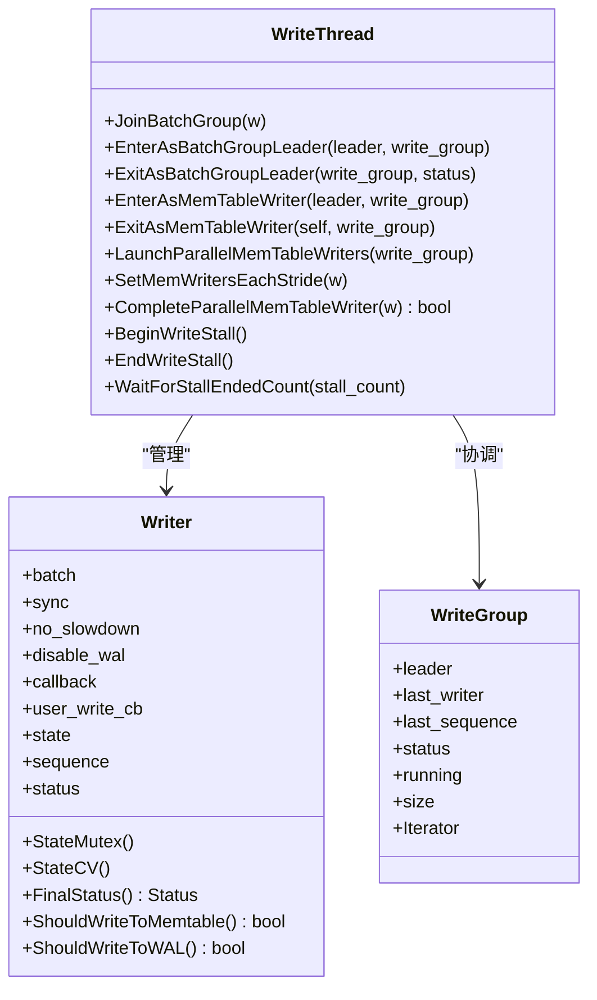
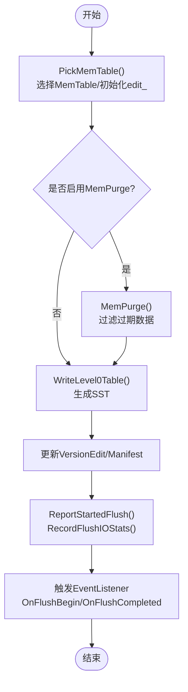
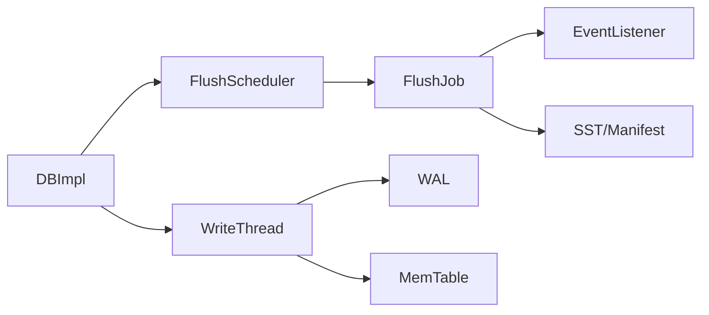

# 组件交互模式

<cite>
**本文引用的文件**   
- [listener.h](file://source/rocksdb/include/rocksdb/listener.h)
- [write_thread.h](file://source/rocksdb/db/write_thread.h)
- [flush_job.h](file://source/rocksdb/db/flush_job.h)
- [db_impl.h](file://source/rocksdb/db/db_impl/db_impl.h)
- [flush_scheduler.h](file://source/rocksdb/db/flush_scheduler.h)
</cite>

## 目录
1. [简介](#简介)
2. [项目结构](#项目结构)
3. [核心组件](#核心组件)
4. [架构总览](#架构总览)
5. [详细组件分析](#详细组件分析)
6. [依赖关系分析](#依赖关系分析)
7. [性能考量](#性能考量)
8. [故障排查指南](#故障排查指南)
9. [结论](#结论)
10. [附录](#附录)

## 简介
本文面向RocksDB内部组件交互模式，聚焦以下目标：
- DBImpl作为核心协调者的角色与职责
- WriteThread的写路径处理机制（批分组、并行写入、停写控制）
- FlushJob的生命周期管理（选择MemTable、落盘、版本更新、事件上报）
- 事件驱动模式（EventListener回调、状态同步、后台任务触发）
- 数据流在组件间的传递（写操作完整路径、读操作查询流程、后台任务触发）
- 扩展与自定义开发指南（监听器、回调、后台任务）
- 性能分析与调试技巧（指标、追踪、常见瓶颈定位）

## 项目结构
本仓库包含多个RocksDB相关分支与工具集。本文重点围绕RocksDB源码中的核心头文件进行分析，以理解组件间交互与数据流。关键文件包括：
- DB接口实现入口与协调者：db_impl.h
- 写线程与批处理：write_thread.h
- 刷盘任务：flush_job.h
- 刷盘调度：flush_scheduler.h
- 事件监听与回调：listener.h

图表来源
- [db_impl.h:195-210](file://source/rocksdb/db/db_impl/db_impl.h#L195-L210)
- [write_thread.h:32-82](file://source/rocksdb/db/write_thread.h#L32-L82)
- [flush_scheduler.h:23-40](file://source/rocksdb/db/flush_scheduler.h#L23-L40)
- [flush_job.h:57-77](file://source/rocksdb/db/flush_job.h#L57-L77)
- [listener.h:618-640](file://source/rocksdb/include/rocksdb/listener.h#L618-L640)

章节来源
- [db_impl.h:195-210](file://source/rocksdb/db/db_impl/db_impl.h#L195-L210)
- [write_thread.h:32-82](file://source/rocksdb/db/write_thread.h#L32-L82)
- [flush_scheduler.h:23-40](file://source/rocksdb/db/flush_scheduler.h#L23-L40)
- [flush_job.h:57-77](file://source/rocksdb/db/flush_job.h#L57-L77)
- [listener.h:618-640](file://source/rocksdb/include/rocksdb/listener.h#L618-L640)

## 核心组件
- DBImpl：对外DB接口的实际实现，协调写路径、读路径、后台任务（压缩、清理）、事件上报、版本管理等。
- WriteThread：负责将用户写请求组织为批组，支持串行或并行写入MemTable，维护序列号、停写信号、回调执行。
- FlushScheduler：维护需要刷盘的ColumnFamily队列，供后台刷盘线程消费。
- FlushJob：具体执行一次刷盘任务，从MemTable生成SST，更新VersionEdit/Manifest，并触发事件回调。
- EventListener：定义一系列回调钩子，用于统计、监控、外部集成等。

章节来源
- [db_impl.h:195-210](file://source/rocksdb/db/db_impl/db_impl.h#L195-L210)
- [write_thread.h:32-82](file://source/rocksdb/db/write_thread.h#L32-L82)
- [flush_scheduler.h:23-40](file://source/rocksdb/db/flush_scheduler.h#L23-L40)
- [flush_job.h:57-77](file://source/rocksdb/db/flush_job.h#L57-L77)
- [listener.h:618-640](file://source/rocksdb/include/rocksdb/listener.h#L618-L640)

## 架构总览
RocksDB的写路径由DBImpl统一编排：用户调用DB::Write后进入DBImpl::WriteImpl，随后通过WriteThread进行批分组与并发控制；WAL持久化与MemTable写入完成后，根据阈值与策略触发FlushScheduler调度FlushJob执行刷盘；刷盘完成后更新版本信息并触发EventListener回调。读路径则基于Snapshot与多版本合并迭代器访问MemTable与SST。后台任务（压缩、垃圾回收、TrimHistory等）由DBImpl统一调度。

图表来源
- [db_impl.h:195-210](file://source/rocksdb/db/db_impl/db_impl.h#L195-L210)
- [write_thread.h:322-390](file://source/rocksdb/db/write_thread.h#L322-L390)
- [flush_scheduler.h:29-38](file://source/rocksdb/db/flush_scheduler.h#L29-L38)
- [flush_job.h:83-92](file://source/rocksdb/db/flush_job.h#L83-L92)
- [listener.h:636-647](file://source/rocksdb/include/rocksdb/listener.h#L636-L647)

## 详细组件分析

### DBImpl：核心协调者
- 职责
  - 暴露DB接口，封装事务、快照、范围删除、外部SST导入等上层能力
  - 协调写路径（WriteImpl）、读路径（GetImpl）、后台任务（压缩、清理、TrimHistory）
  - 管理ColumnFamily、VersionSet、WAL、MemTable、TableCache等子系统
  - 触发并管理FlushScheduler与FlushJob生命周期
  - 注册并分发EventListener回调
- 关键点
  - 多线程安全：使用InstrumentedMutex保护关键状态
  - 事件驱动：在关键阶段（如FlushBegin/Completed、CompactionBegin/Completed）调用EventListener
  - 资源管理：目录、文件句柄、内存池、统计与追踪

章节来源
- [db_impl.h:195-210](file://source/rocksdb/db/db_impl/db_impl.h#L195-L210)
- [listener.h:618-640](file://source/rocksdb/include/rocksdb/listener.h#L618-L640)

### WriteThread：写路径处理
- 职责
  - 将用户写请求组织为Writer，形成批组（WriteGroup），支持串行或并行写入MemTable
  - 维护Writer状态机（STATE_INIT、STATE_GROUP_LEADER、STATE_MEMTABLE_WRITER_LEADER、STATE_PARALLEL_MEMTABLE_WRITER、STATE_COMPLETED等）
  - 提供停写控制（BeginWriteStall/EndWriteStall）与等待机制
  - 执行回调（WriteCallback、UserWriteCallback）与WAL/MemTable写入决策
- 关键方法
  - JoinBatchGroup：加入批组并等待成为leader或follower
  - EnterAsBatchGroupLeader/ExitAsBatchGroupLeader：构建/退出批组
  - EnterAsMemTableWriter/ExitAsMemTableWriter：进入/退出MemTable写入阶段
  - LaunchParallelMemTableWriters/SetMemWritersEachStride：并行写入优化
  - CompleteParallelMemTableWriter：汇总并行结果并推进序列号
- 数据结构
  - Writer：保存批次、选项、回调、状态、序列号、链接指针等
  - WriteGroup：记录leader、last_writer、running计数、size等

图表来源
- [write_thread.h:32-82](file://source/rocksdb/db/write_thread.h#L32-L82)
- [write_thread.h:124-210](file://source/rocksdb/db/write_thread.h#L124-L210)
- [write_thread.h:322-390](file://source/rocksdb/db/write_thread.h#L322-L390)

章节来源
- [write_thread.h:32-82](file://source/rocksdb/db/write_thread.h#L32-L82)
- [write_thread.h:124-210](file://source/rocksdb/db/write_thread.h#L124-L210)
- [write_thread.h:322-390](file://source/rocksdb/db/write_thread.h#L322-L390)

### FlushScheduler：刷盘调度
- 职责
  - 维护需要刷盘的ColumnFamily链表，支持并发插入与单线程取出
  - 过滤已丢弃的ColumnFamily，确保只调度有效CF
- 关键方法
  - ScheduleWork(cfd)：将CF加入待刷盘队列
  - TakeNextColumnFamily()：取出下一个待处理的CF
  - Empty()/Clear()：检查是否为空或清空队列

章节来源
- [flush_scheduler.h:23-40](file://source/rocksdb/db/flush_scheduler.h#L23-L40)

### FlushJob：刷盘生命周期
- 职责
  - 选择待刷MemTable（PickMemTable）
  - 执行刷盘（Run）：生成SST、更新VersionEdit、可选写入Manifest
  - 处理Blob文件添加/垃圾信息（与Integrated BlobDB协作）
  - 收集FlushJobInfo并触发EventListener回调（OnFlushBegin/OnFlushCompleted）
- 关键方法
  - PickMemTable()：初始化edit_、mems_、base_等
  - Run(prep_tracker, file_meta, switched_to_mempurge, skipped_since_bg_error, error_handler)：主流程
  - Cancel()：取消刷盘
  - GetCommittedFlushJobsInfo()：获取已提交刷盘信息列表
- 重要字段
  - dbname_/cfd_/versions_/db_mutex_/shutting_down_
  - mems_/edit_/base_
  - committed_flush_jobs_info_：用于批量上报已完成刷盘事件

图表来源
- [flush_job.h:83-92](file://source/rocksdb/db/flush_job.h#L83-L92)
- [flush_job.h:133-162](file://source/rocksdb/db/flush_job.h#L133-L162)
- [listener.h:636-647](file://source/rocksdb/include/rocksdb/listener.h#L636-L647)

章节来源
- [flush_job.h:83-92](file://source/rocksdb/db/flush_job.h#L83-L92)
- [flush_job.h:133-162](file://source/rocksdb/db/flush_job.h#L133-L162)

### EventListener：事件驱动与回调
- 职责
  - 定义一系列回调钩子，用于统计、监控、外部集成
  - 在关键阶段（FlushBegin/Completed、CompactionBegin/Completed、TableFileCreated/Deleted、MemTableSealed等）被调用
- 关键回调
  - OnFlushBegin/OnFlushCompleted
  - OnCompactionBegin/OnCompactionCompleted
  - OnSubcompactionBegin/OnSubcompactionCompleted
  - OnTableFileCreated/OnTableFileCreationStarted/OnTableFileDeleted
  - OnMemTableSealed
  - OnExternalFileIngested
  - BackgroundError回调（可修改背景错误状态）
- 注意事项
  - 回调应在无锁环境下执行，避免阻塞与死锁
  - 不要在回调中执行长时间阻塞操作，建议使用异步或轻量逻辑

章节来源
- [listener.h:618-640](file://source/rocksdb/include/rocksdb/listener.h#L618-L640)
- [listener.h:668-790](file://source/rocksdb/include/rocksdb/listener.h#L668-L790)

## 依赖关系分析
- DBImpl依赖WriteThread进行写路径批处理与并发控制
- DBImpl依赖FlushScheduler进行刷盘调度
- FlushScheduler输出ColumnFamily给FlushJob执行刷盘
- FlushJob在执行过程中触发EventListener回调
- WriteThread与FlushJob通过WAL/MemTable/SST等底层存储组件交互

图表来源
- [db_impl.h:195-210](file://source/rocksdb/db/db_impl/db_impl.h#L195-L210)
- [write_thread.h:32-82](file://source/rocksdb/db/write_thread.h#L32-L82)
- [flush_scheduler.h:23-40](file://source/rocksdb/db/flush_scheduler.h#L23-L40)
- [flush_job.h:57-77](file://source/rocksdb/db/flush_job.h#L57-L77)
- [listener.h:618-640](file://source/rocksdb/include/rocksdb/listener.h#L618-L640)

章节来源
- [db_impl.h:195-210](file://source/rocksdb/db/db_impl/db_impl.h#L195-L210)
- [write_thread.h:32-82](file://source/rocksdb/db/write_thread.h#L32-L82)
- [flush_scheduler.h:23-40](file://source/rocksdb/db/flush_scheduler.h#L23-L40)
- [flush_job.h:57-77](file://source/rocksdb/db/flush_job.h#L57-L77)
- [listener.h:618-640](file://source/rocksdb/include/rocksdb/listener.h#L618-L640)

## 性能考量
- 写路径优化
  - 批分组与并行写入：WriteThread支持并行MemTable写入，减少锁竞争
  - 停写控制：BeginWriteStall/EndWriteStall防止L0文件过多导致写放大
  - 回调与WAL/MemTable写入决策：根据WriteOptions动态决定写入路径
- 刷盘优化
  - MemPurge：针对重写密集型负载过滤过期数据，减少SSD写入
  - 速率限制优先级：FlushJob动态调整I/O优先级，平衡后台任务
- 事件与监控
  - EventListener回调应轻量，避免阻塞关键路径
  - 利用统计与追踪（Statistics、IOTracer）定位瓶颈

[本节为通用指导，不直接分析具体文件]

## 故障排查指南
- 常见问题
  - 写停滞：检查WriteThread的stall_mu_/stall_cv_与BeginWriteStall/EndWriteStall调用
  - 刷盘失败：查看FlushJob的Run返回值与committed_flush_jobs_info_
  - 事件回调阻塞：确认EventListener实现未执行阻塞操作
- 调试技巧
  - 启用详细日志与统计：通过DBOptions配置日志级别与统计开关
  - 使用IOTracer：追踪文件操作延迟与错误
  - 监控BackgroundJobPressure：评估压缩与刷盘压力

章节来源
- [write_thread.h:421-470](file://source/rocksdb/db/write_thread.h#L421-L470)
- [flush_job.h:126-128](file://source/rocksdb/db/flush_job.h#L126-L128)
- [listener.h:618-640](file://source/rocksdb/include/rocksdb/listener.h#L618-L640)

## 结论
RocksDB通过DBImpl统一协调各组件，WriteThread负责高效写路径，FlushScheduler与FlushJob协同完成刷盘，EventListener提供事件驱动扩展点。理解这些组件的交互模式有助于优化性能、定制功能与快速定位问题。

[本节为总结性内容，不直接分析具体文件]

## 附录
- 扩展与自定义开发指南
  - 实现EventListener：在关键事件中添加统计、监控或外部集成逻辑
  - 自定义WriteCallback/UserWriteCallback：在WAL/MemTable写入前后执行自定义逻辑
  - 后台任务扩展：通过DBImpl的调度接口注册自定义任务
- 性能分析工具
  - 启用Statistics与Histogram：分析延迟分布与热点
  - 使用IOTracer：追踪文件操作与错误
  - 监控BackgroundJobPressure：评估系统压力

[本节为通用指导，不直接分析具体文件]