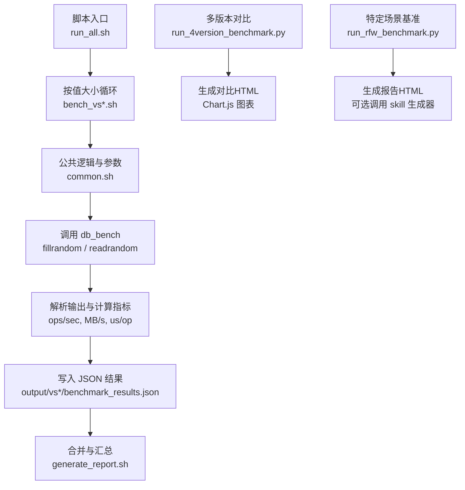
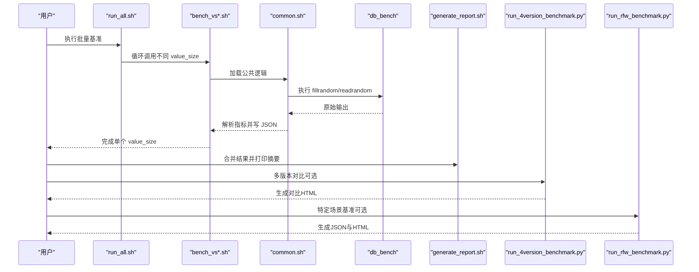
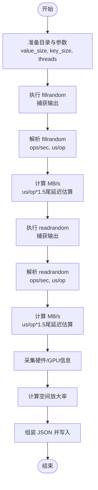
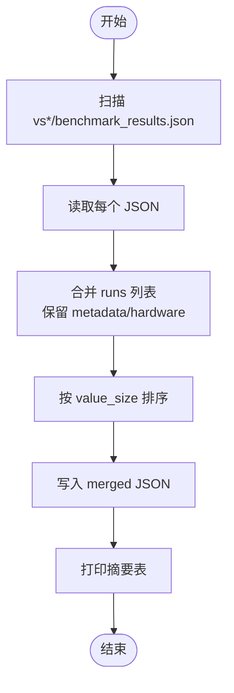
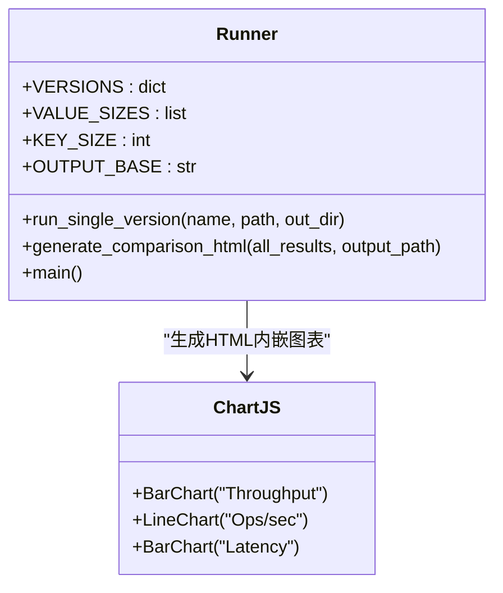
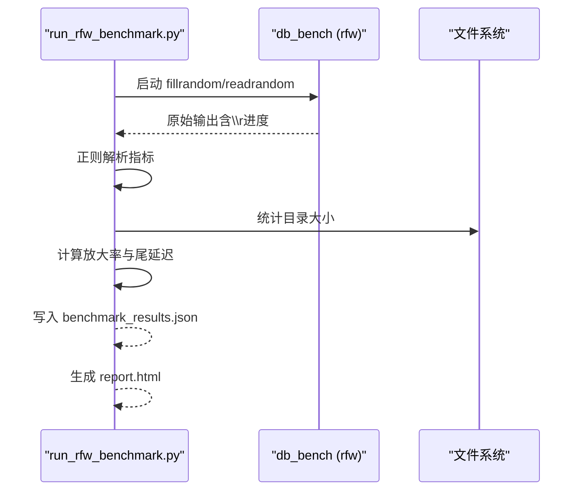
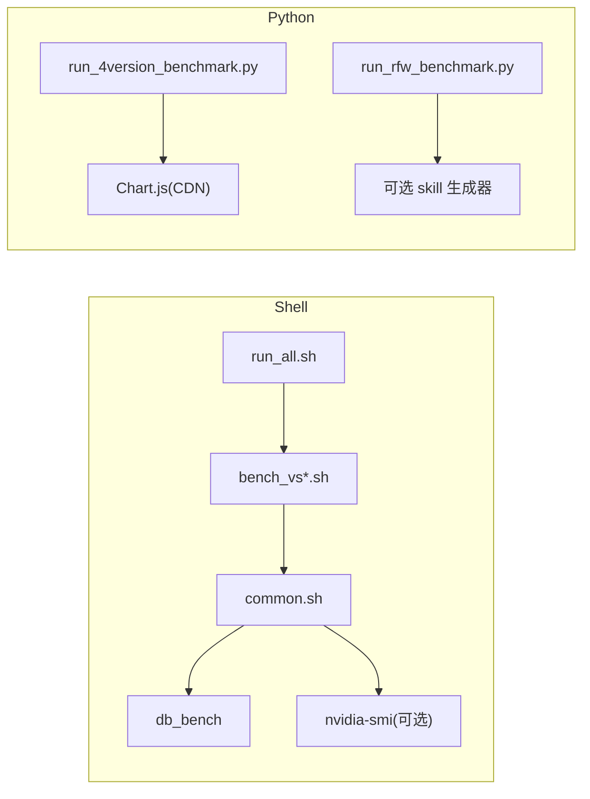

# 可视化报告

<cite>
**本文引用的文件**   
- [script/generate_report.sh](file://script/generate_report.sh)
- [script/run_all.sh](file://script/run_all.sh)
- [script/common.sh](file://script/common.sh)
- [script/bench_vs32.sh](file://script/bench_vs32.sh)
- [script/bench_vs1024.sh](file://script/bench_vs1024.sh)
- [script/run_4version_benchmark.py](file://script/run_4version_benchmark.py)
- [script/run_rfw_benchmark.py](file://script/run_rfw_benchmark.py)
</cite>

## 目录
1. [引言](#引言)
2. [项目结构](#项目结构)
3. [核心组件](#核心组件)
4. [架构总览](#架构总览)
5. [详细组件分析](#详细组件分析)
6. [依赖关系分析](#依赖关系分析)
7. [性能考虑](#性能考虑)
8. [故障排查指南](#故障排查指南)
9. [结论](#结论)
10. [附录](#附录)

## 引言
本文件面向数据分析师与系统管理员，系统化阐述自动化报告生成系统的原理与实践。内容覆盖数据采集、格式转换与图表渲染全流程；详解性能趋势分析、资源使用率可视化与对比分析报告的生成方法；提供来自 generate_report.sh、run_all.sh 等脚本的实际使用示例；并给出自定义报告模板创建、样式配置与数据源绑定的指导。同时说明与 Web 仪表板（如 Grafana、Kibana）的集成思路，以及大规模数据的可视化优化与实时刷新机制。

## 项目结构
本项目围绕 RocksDB 基准测试与多版本对比展开，脚本层负责编排执行、结果采集与报告生成：
- script/ 下包含通用工具、单值大小基准脚本、批量运行脚本、多版本对比与特定场景（rocksdb-flush-wal）基准脚本。
- output/ 用于存放各次运行的 benchmark_results.json 与生成的 HTML 报告。
- source/ 为第三方源码与构建产物（RocksDB、gParaKV-GC 等），由脚本通过路径引用 db_bench 二进制。

**图示来源** 
- [script/run_all.sh:1-19](file://script/run_all.sh#L1-L19)
- [script/common.sh:68-196](file://script/common.sh#L68-L196)
- [script/generate_report.sh:1-59](file://script/generate_report.sh#L1-L59)
- [script/run_4version_benchmark.py:75-292](file://script/run_4version_benchmark.py#L75-L292)
- [script/run_rfw_benchmark.py:199-311](file://script/run_rfw_benchmark.py#L199-L311)

**章节来源**
- [script/run_all.sh:1-19](file://script/run_all.sh#L1-L19)
- [script/common.sh:1-196](file://script/common.sh#L1-L196)
- [script/generate_report.sh:1-59](file://script/generate_report.sh#L1-L59)

## 核心组件
- 批量运行器 run_all.sh：顺序执行不同 value_size 的基准任务，产出 per-value-size 的 JSON 结果。
- 公共逻辑 common.sh：封装 db_bench 参数、指标解析、MB/s 换算、硬件信息采集、GPU 采样与 JSON 结果组装。
- 报告合并 generate_report.sh：聚合多个 value_size 的结果，打印摘要并输出合并后的 JSON。
- 多版本对比 run_4version_benchmark.py：对多个 RocksDB 变体统一执行基准，生成对比 HTML（Chart.js）。
- 特定场景基准 run_rfw_benchmark.py：针对 rocksdb-flush-wal 的多场景（随机/顺序/混合读写）基准，输出 JSON 与 HTML。

**章节来源**
- [script/run_all.sh:1-19](file://script/run_all.sh#L1-L19)
- [script/common.sh:1-196](file://script/common.sh#L1-L196)
- [script/generate_report.sh:1-59](file://script/generate_report.sh#L1-L59)
- [script/run_4version_benchmark.py:1-358](file://script/run_4version_benchmark.py#L1-L358)
- [script/run_rfw_benchmark.py:1-311](file://script/run_rfw_benchmark.py#L1-L311)

## 架构总览
下图展示从“触发执行”到“结果可视化”的端到端流程，涵盖 Shell 脚本与 Python 脚本的职责边界与数据流转。

**图示来源** 
- [script/run_all.sh:1-19](file://script/run_all.sh#L1-L19)
- [script/common.sh:68-196](file://script/common.sh#L68-L196)
- [script/generate_report.sh:1-59](file://script/generate_report.sh#L1-L59)
- [script/run_4version_benchmark.py:75-292](file://script/run_4version_benchmark.py#L75-L292)
- [script/run_rfw_benchmark.py:199-311](file://script/run_rfw_benchmark.py#L199-L311)

## 详细组件分析

### 组件A：批量基准与结果生成（Shell）
- run_all.sh 顺序遍历 value_size，调用 bench_vs*.sh。
- bench_vs32.sh / bench_vs1024.sh 仅设置 db_bench 路径并调用 run_bench。
- common.sh 的 run_bench 函数：
  - 构造 db_bench 参数（key/value size、threads、cache、statistics、histogram 等）。
  - 解析 fillrandom/readrandom 输出，得到 ops/sec、us/op，并换算 MB/s。
  - 采集 GPU 利用率与显存占用（nvidia-smi）。
  - 计算空间放大率（磁盘大小/逻辑字节数）。
  - 输出结构化 JSON（metadata、hardware、runs）。

**图示来源** 
- [script/common.sh:68-196](file://script/common.sh#L68-L196)
- [script/bench_vs32.sh:1-10](file://script/bench_vs32.sh#L1-L10)
- [script/bench_vs1024.sh:1-10](file://script/bench_vs1024.sh#L1-L10)

**章节来源**
- [script/run_all.sh:1-19](file://script/run_all.sh#L1-L19)
- [script/bench_vs32.sh:1-10](file://script/bench_vs32.sh#L1-L10)
- [script/bench_vs1024.sh:1-10](file://script/bench_vs1024.sh#L1-L10)
- [script/common.sh:1-196](file://script/common.sh#L1-L196)

### 组件B：结果合并与摘要（Shell）
- generate_report.sh 将 output/vs{32,128,512,1024,4096,16384}/benchmark_results.json 合并为单一 JSON。
- 保留 metadata/hardware，并按 value_size 排序 runs。
- 打印摘要表格（Value Size、Fill/Read ops/s、MB/s、us/op）。

**图示来源** 
- [script/generate_report.sh:1-59](file://script/generate_report.sh#L1-L59)

**章节来源**
- [script/generate_report.sh:1-59](file://script/generate_report.sh#L1-L59)

### 组件C：多版本对比（Python）
- run_4version_benchmark.py 定义多个 RocksDB 变体的 db_bench 路径与环境变量（LD_LIBRARY_PATH）。
- 对每个版本执行基准（调用内部 runner），收集 benchmark_results.json。
- 生成对比 HTML：
  - 折线/柱状图：Fill/Read Throughput、Ops/sec、Latency。
  - 表格：按 value_size 列出各版本关键指标。
  - 元数据：硬件信息与版本二进制路径。

**图示来源** 
- [script/run_4version_benchmark.py:1-358](file://script/run_4version_benchmark.py#L1-L358)

**章节来源**
- [script/run_4version_benchmark.py:1-358](file://script/run_4version_benchmark.py#L1-L358)

### 组件D：特定场景基准（Python）
- run_rfw_benchmark.py 针对 rocksdb-flush-wal 执行三类场景：
  - fillrandom + readrandom（随机读写）
  - fillseq + readseq（顺序读写）
  - fillrandom + readwhilewriting（混合读写）
- 解析 RocksDB 输出行，支持带/不带 MB/s 的格式。
- 采集 GPU 指标与空间放大率，输出 JSON 与 HTML（可调用 skill 生成器）。

**图示来源** 
- [script/run_rfw_benchmark.py:1-311](file://script/run_rfw_benchmark.py#L1-L311)

**章节来源**
- [script/run_rfw_benchmark.py:1-311](file://script/run_rfw_benchmark.py#L1-L311)

## 依赖关系分析
- Shell 层依赖：
  - bash、python3、bc、awk、sed、grep、du、uname、nvidia-smi（可选）。
  - RocksDB 构建产物 db_bench 与共享库（通过 LD_LIBRARY_PATH 指定）。
- Python 层依赖：
  - 标准库（json、os、subprocess、re、pathlib、datetime、collections）。
  - 外部命令 nvidia-smi（可选）。
  - 生成 HTML 时依赖浏览器渲染 Chart.js（CDN 引入）。

**图示来源** 
- [script/run_all.sh:1-19](file://script/run_all.sh#L1-L19)
- [script/common.sh:1-196](file://script/common.sh#L1-L196)
- [script/run_4version_benchmark.py:1-358](file://script/run_4version_benchmark.py#L1-L358)
- [script/run_rfw_benchmark.py:1-311](file://script/run_rfw_benchmark.py#L1-L311)

**章节来源**
- [script/common.sh:1-196](file://script/common.sh#L1-L196)
- [script/run_4version_benchmark.py:1-358](file://script/run_4version_benchmark.py#L1-L358)
- [script/run_rfw_benchmark.py:1-311](file://script/run_rfw_benchmark.py#L1-L311)

## 性能考虑
- 指标口径
  - MB/s = ops/sec × (key_size + value_size) / (1024×1024)。
  - 尾延迟估算：us/op × 1.5（作为近似上限参考）。
- 并发与缓存
  - 默认线程数为 1，便于隔离差异；可通过 common.sh 调整。
  - cache_size 固定，避免缓存命中差异影响对比。
- 存储放大
  - 空间放大率 = 实际磁盘大小 / 逻辑字节数，反映压缩与索引开销。
- 大数据量可视化
  - 建议按 value_size 维度聚合，减少点数量。
  - 使用 Chart.js 的缩放与交互，避免一次性渲染过多数据集。
- 实时刷新
  - 可将 JSON 结果推送到时序数据库（如 InfluxDB/TimescaleDB），再由 Grafana/Kibana 拉取。
  - 或采用 WebSocket/Server-Sent Events 推送增量 JSON 至前端。

[本节为通用指导，不直接分析具体文件]

## 故障排查指南
- 缺少 db_bench 二进制
  - 现象：脚本报错找不到 db_bench。
  - 处理：确认构建产物路径与 LD_LIBRARY_PATH 设置正确。
- nvidia-smi 不可用
  - 现象：GPU 指标为空或为 0。
  - 处理：安装驱动与工具，或忽略 GPU 字段继续运行。
- 输出解析失败
  - 现象：ops/sec 或 MB/s 为 0。
  - 处理：检查 RocksDB 输出格式是否变化，更新正则解析逻辑。
- 内存不足或磁盘空间不足
  - 现象：基准中断或无法写入结果。
  - 处理：降低 num_ops 或清理临时目录。
- HTML 报告未生成
  - 现象：report.html 缺失。
  - 处理：检查 Python 脚本权限与依赖，确保 Chart.js CDN 可达。

**章节来源**
- [script/common.sh:1-196](file://script/common.sh#L1-L196)
- [script/run_rfw_benchmark.py:1-311](file://script/run_rfw_benchmark.py#L1-L311)
- [script/run_4version_benchmark.py:1-358](file://script/run_4version_benchmark.py#L1-L358)

## 结论
本系统以 Shell 脚本为主干，结合 Python 脚本实现多场景、多版本的基准测试与报告生成。通过统一的 JSON 数据结构，既便于人类阅读，也易于对接 Web 仪表板与自动化工具链。对于数据分析人员，可直接基于 JSON 进行二次分析；对于系统管理员，可将其纳入持续集成与监控体系，形成闭环的性能回归与容量规划能力。

[本节为总结性内容，不直接分析具体文件]

## 附录

### 使用示例
- 运行全部 value_size 基准
  - 在 script 目录下执行：bash run_all.sh
  - 结果位于 output/vs*/benchmark_results.json
- 合并结果并打印摘要
  - 在 script 目录下执行：bash generate_report.sh
  - 输出合并 JSON 与终端摘要表
- 多版本对比
  - 执行：python3 script/run_4version_benchmark.py
  - 生成 combined_results.json 与 comparison_report.html
- 特定场景基准（rocksdb-flush-wal）
  - 执行：python3 script/run_rfw_benchmark.py
  - 生成 benchmark_results.json 与 report.html（若 skill 生成器可用）

**章节来源**
- [script/run_all.sh:1-19](file://script/run_all.sh#L1-L19)
- [script/generate_report.sh:1-59](file://script/generate_report.sh#L1-L59)
- [script/run_4version_benchmark.py:295-358](file://script/run_4version_benchmark.py#L295-L358)
- [script/run_rfw_benchmark.py:199-311](file://script/run_rfw_benchmark.py#L199-L311)

### 自定义报告模板与样式配置
- 模板位置
  - 多版本对比 HTML 由 run_4version_benchmark.py 内联生成，可在 generate_comparison_html 中修改布局与配色。
  - 特定场景报告可由 run_rfw_benchmark.py 调用 skill 生成器（若存在）或自行扩展。
- 样式定制
  - 修改 Chart.js 配置项（标题、坐标轴、颜色、缩放等）。
  - 在 HTML 中调整 CSS 主题与网格布局。
- 数据源绑定
  - 将 benchmark_results.json 作为输入源，映射到图表 datasets。
  - 如需动态刷新，可将 JSON 转为 API 返回，前端定时轮询或订阅事件。

**章节来源**
- [script/run_4version_benchmark.py:75-292](file://script/run_4version_benchmark.py#L75-L292)
- [script/run_rfw_benchmark.py:263-277](file://script/run_rfw_benchmark.py#L263-L277)

### 与 Web 仪表板集成（Grafana/Kibana）
- 数据接入
  - 将 benchmark_results.json 转换为时序格式（时间戳、指标名、数值、标签）。
  - 导入到 InfluxDB/TimescaleDB/Elasticsearch。
- 可视化
  - Grafana：创建面板，选择对应数据源，绘制吞吐量、延迟、放大率曲线。
  - Kibana：建立索引模式，使用 Discover/Lens 探索与可视化。
- 实时刷新
  - 使用日志采集（Filebeat/Fluent Bit）或 Agent 定期抓取 JSON，写入后端。
  - 前端通过 API 获取最新结果，或使用 SSE/WebSocket 推送增量。

[本节为通用指导，不直接分析具体文件]

### 大规模数据可视化优化
- 数据侧
  - 预聚合：按 value_size 或时间窗口聚合，减少点数。
  - 降采样：对长时序数据进行 downsample（平均/最大/最小）。
- 渲染侧
  - 启用 Chart.js 的交互缩放与区域选择。
  - 分页/懒加载，避免一次性渲染大量数据集。
- 存储侧
  - 使用列式存储与时序数据库，提升查询性能。
  - 合理设置 TTL，控制历史数据规模。

[本节为通用指导，不直接分析具体文件]