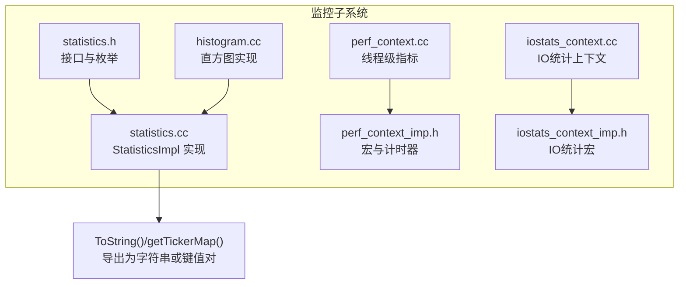
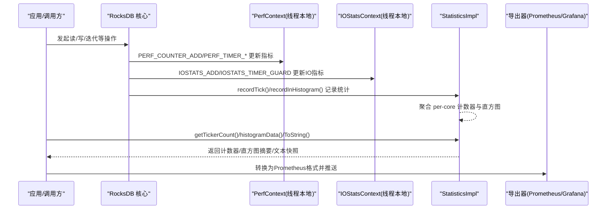
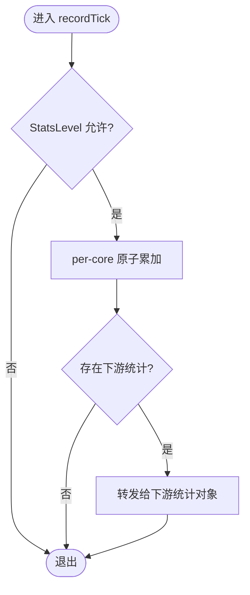
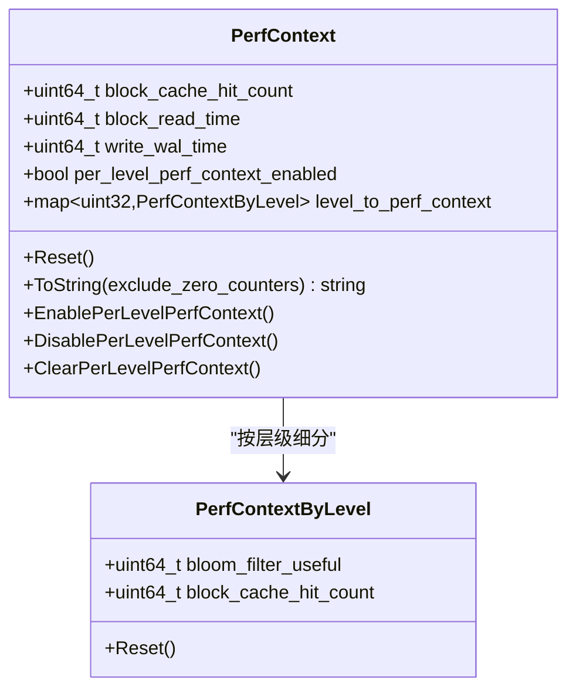
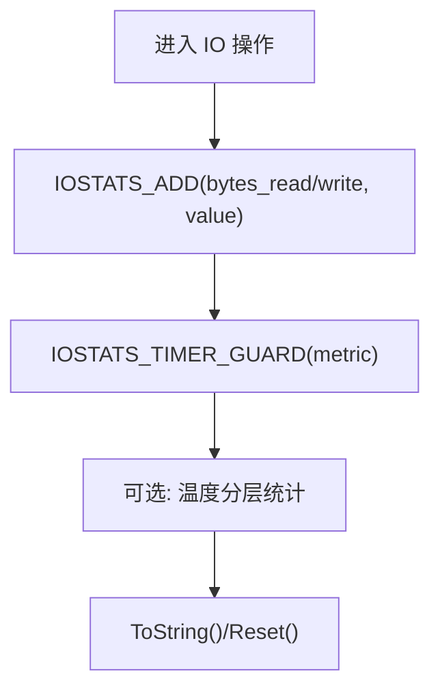
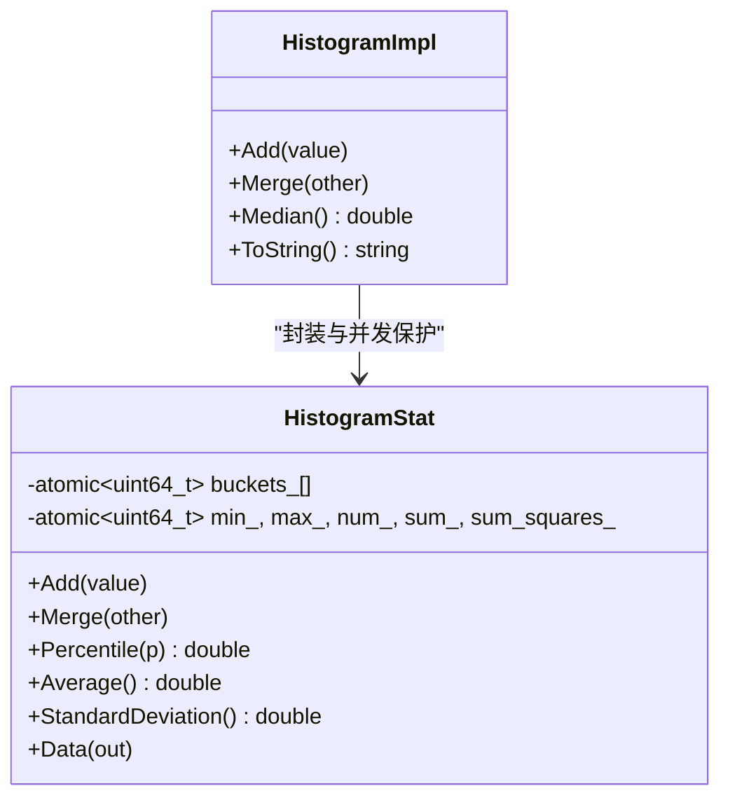
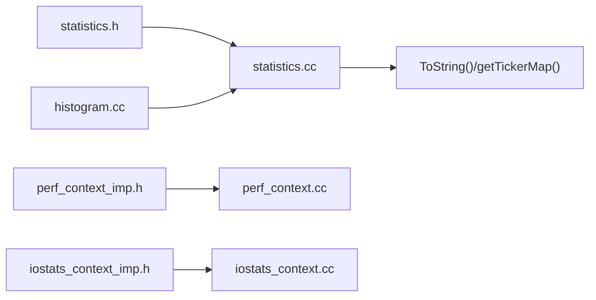

# 实时监控工具

<cite>
**本文引用的文件**
- [statistics.cc](file://source/rocksdb/monitoring/statistics.cc)
- [statistics.h](file://source/rocksdb/include/rocksdb/statistics.h)
- [perf_context.cc](file://source/rocksdb/monitoring/perf_context.cc)
- [perf_context_imp.h](file://source/rocksdb/monitoring/perf_context_imp.h)
- [histogram.cc](file://source/rocksdb/monitoring/histogram.cc)
- [iostats_context.cc](file://source/rocksdb/monitoring/iostats_context.cc)
- [iostats_context_imp.h](file://source/rocksdb/monitoring/iostats_context_imp.h)
</cite>

## 目录
1. [简介](#简介)
2. [项目结构](#项目结构)
3. [核心组件](#核心组件)
4. [架构总览](#架构总览)
5. [详细组件分析](#详细组件分析)
6. [依赖关系分析](#依赖关系分析)
7. [性能与内存优化](#性能与内存优化)
8. [故障排查指南](#故障排查指南)
9. [结论](#结论)
10. [附录：监控集成与可视化](#附录监控集成与可视化)

## 简介
本文件面向运维与研发人员，系统性阐述 RocksDB 监控统计体系在仓库中的实现原理与使用方式，重点覆盖：
- 性能计数器（Tickers）与直方图统计的采集、聚合与导出机制
- 线程级上下文（PerfContext、IOStatsContext）的工作原理与扩展方法
- 监控配置选项、采样频率与内存占用优化策略
- 与 Prometheus/Grafana 等外部系统的集成思路与数据导出格式转换
- 实时可视化展示的最佳实践

## 项目结构
RocksDB 的监控子系统集中在 monitoring 与 include/rocksdb 头文件中，核心文件如下：
- statistics.cc / statistics.h：定义 Tickers/Histograms 枚举、Statistics 抽象接口及默认实现 StatisticsImpl
- perf_context.cc / perf_context_imp.h：线程本地 PerfContext 指标收集与按层级细分
- histogram.cc：无锁直方图统计实现
- iostats_context.cc / iostats_context_imp.h：线程本地 IO 统计上下文

**图表来源**
- [statistics.h:800-885](file://source/rocksdb/include/rocksdb/statistics.h#L800-L885)
- [statistics.cc:384-416](file://source/rocksdb/monitoring/statistics.cc#L384-L416)
- [perf_context.cc:173-204](file://source/rocksdb/monitoring/perf_context.cc#L173-L204)
- [perf_context_imp.h:37-101](file://source/rocksdb/monitoring/perf_context_imp.h#L37-L101)
- [histogram.cc:23-56](file://source/rocksdb/monitoring/histogram.cc#L23-L56)
- [iostats_context.cc:13-21](file://source/rocksdb/monitoring/iostats_context.cc#L13-L21)
- [iostats_context_imp.h:10-32](file://source/rocksdb/monitoring/iostats_context_imp.h#L10-L32)

**章节来源**
- [statistics.h:800-885](file://source/rocksdb/include/rocksdb/statistics.h#L800-L885)
- [statistics.cc:384-416](file://source/rocksdb/monitoring/statistics.cc#L384-L416)
- [perf_context.cc:173-204](file://source/rocksdb/monitoring/perf_context.cc#L173-L204)
- [histogram.cc:23-56](file://source/rocksdb/monitoring/histogram.cc#L23-L56)
- [iostats_context.cc:13-21](file://source/rocksdb/monitoring/iostats_context.cc#L13-L21)

## 核心组件
- 统计接口与枚举
  - Tickers：累计型计数器（如缓存命中/缺失、压缩次数、WAL同步等）
  - Histograms：延迟/大小分布直方图（如 Get/Write/Compaction 耗时、SST读写字节数等）
  - StatsLevel：控制统计粒度与开销（从禁用到全量开启）
- 默认实现
  - StatisticsImpl：线程安全聚合 per-core 计数器与直方图，提供 ToString() 与 getTickerMap() 导出
- 线程级上下文
  - PerfContext：线程本地性能计数与时序指标，支持按层级（level）细分
  - IOStatsContext：线程本地 IO 统计（读/写字节、各阶段耗时、温度分层统计等）
- 直方图
  - HistogramStat/HistogramImpl：无锁桶化统计，支持合并、百分位计算、标准差等

**章节来源**
- [statistics.h:31-604](file://source/rocksdb/include/rocksdb/statistics.h#L31-L604)
- [statistics.h:621-756](file://source/rocksdb/include/rocksdb/statistics.h#L621-L756)
- [statistics.h:774-797](file://source/rocksdb/include/rocksdb/statistics.h#L774-L797)
- [statistics.cc:424-542](file://source/rocksdb/monitoring/statistics.cc#L424-L542)
- [perf_context.cc:167-204](file://source/rocksdb/monitoring/perf_context.cc#L167-L204)
- [iostats_context.cc:23-40](file://source/rocksdb/monitoring/iostats_context.cc#L23-L40)
- [histogram.cc:58-102](file://source/rocksdb/monitoring/histogram.cc#L58-L102)

## 架构总览
下图展示了统计数据的采集、聚合与导出路径。

**图表来源**
- [perf_context_imp.h:79-99](file://source/rocksdb/monitoring/perf_context_imp.h#L79-L99)
- [iostats_context_imp.h:15-32](file://source/rocksdb/monitoring/iostats_context_imp.h#L15-L32)
- [statistics.cc:505-529](file://source/rocksdb/monitoring/statistics.cc#L505-L529)
- [statistics.cc:551-583](file://source/rocksdb/monitoring/statistics.cc#L551-L583)

## 详细组件分析

### 性能计数器（Tickers）与直方图（Histograms）
- 计数器映射与名称
  - TickersNameMap/HistogramsNameMap 将枚举映射为可读字符串名，便于导出与可视化
- 采集与聚合
  - recordTick()：根据 StatsLevel 决定是否记录；per-core 原子累加后由聚合层汇总
  - recordInHistogram()：按类型写入对应直方图；支持 HistEnabledForType 过滤
- 导出
  - getTickerCount()/getAndResetTickerCount()：获取累计或清零后的计数
  - histogramData()/getHistogramString()：输出分位数、均值、标准差、计数与总和
  - ToString()：统一输出所有 Tickers 与 Histograms 的摘要

**图表来源**
- [statistics.cc:505-518](file://source/rocksdb/monitoring/statistics.cc#L505-L518)

**章节来源**
- [statistics.cc:22-305](file://source/rocksdb/monitoring/statistics.cc#L22-L305)
- [statistics.cc:307-382](file://source/rocksdb/monitoring/statistics.cc#L307-L382)
- [statistics.cc:505-529](file://source/rocksdb/monitoring/statistics.cc#L505-L529)
- [statistics.cc:551-583](file://source/rocksdb/monitoring/statistics.cc#L551-L583)
- [statistics.h:31-604](file://source/rocksdb/include/rocksdb/statistics.h#L31-L604)
- [statistics.h:621-756](file://source/rocksdb/include/rocksdb/statistics.h#L621-L756)

### PerfContext 工作原理与扩展
- 线程本地存储
  - 通过 thread_local 变量保存当前线程的 PerfContext，避免跨线程竞争
- 指标集合
  - 包含块缓存命中/缺失、Bloom 过滤器、MemTable/SST 访问、WAL/Flush、锁等待、CPU 时间等大量细粒度指标
  - 可选按层级（level）细分，便于定位具体 SST 层的热点
- 计时与计数宏
  - PERF_TIMER_* 系列用于自动起止计时并累加到对应字段
  - PERF_COUNTER_ADD/PERF_COUNTER_BY_LEVEL_ADD 用于计数与按层计数
- 扩展方法
  - 新增指标需在宏 DEF_PERF_CONTEXT_METRICS/DEF_PERF_CONTEXT_LEVEL_METRICS 中声明，并通过静态断言保证与外部接口对齐

**图表来源**
- [perf_context.cc:35-39](file://source/rocksdb/monitoring/perf_context.cc#L35-L39)
- [perf_context.cc:167-171](file://source/rocksdb/monitoring/perf_context.cc#L167-L171)
- [perf_context.cc:276-303](file://source/rocksdb/monitoring/perf_context.cc#L276-L303)
- [perf_context.cc:305-323](file://source/rocksdb/monitoring/perf_context.cc#L305-L323)
- [perf_context_imp.h:79-99](file://source/rocksdb/monitoring/perf_context_imp.h#L79-L99)

**章节来源**
- [perf_context.cc:173-204](file://source/rocksdb/monitoring/perf_context.cc#L173-L204)
- [perf_context.cc:276-303](file://source/rocksdb/monitoring/perf_context.cc#L276-L303)
- [perf_context_imp.h:37-101](file://source/rocksdb/monitoring/perf_context_imp.h#L37-L101)

### IOStatsContext 线程状态监控
- 线程本地 IO 统计
  - 记录读/写字节、打开/读取/写入/同步等阶段耗时，以及 CPU 时间
  - 支持按文件温度（热/温/冷/冰）统计读字节与次数
- 重置与导出
  - Reset() 清空所有字段；ToString() 输出非零项以便快速定位问题

**图表来源**
- [iostats_context.cc:23-40](file://source/rocksdb/monitoring/iostats_context.cc#L23-L40)
- [iostats_context.cc:47-78](file://source/rocksdb/monitoring/iostats_context.cc#L47-L78)
- [iostats_context_imp.h:15-32](file://source/rocksdb/monitoring/iostats_context_imp.h#L15-L32)

**章节来源**
- [iostats_context.cc:13-21](file://source/rocksdb/monitoring/iostats_context.cc#L13-L21)
- [iostats_context.cc:47-78](file://source/rocksdb/monitoring/iostats_context.cc#L47-L78)
- [iostats_context_imp.h:15-32](file://source/rocksdb/monitoring/iostats_context_imp.h#L15-L32)

### 直方图统计实现
- 无锁桶化设计
  - 基于固定桶边界（近似对数尺度），Add() 无锁原子更新，适合高频路径
  - Merge() 在外部锁保护下合并多个线程/分片的数据
- 统计能力
  - 支持中位数、百分位、平均、标准差、最小/最大、计数与总和
  - Data() 输出结构化摘要，便于外部系统消费

**图表来源**
- [histogram.cc:58-102](file://source/rocksdb/monitoring/histogram.cc#L58-L102)
- [histogram.cc:104-126](file://source/rocksdb/monitoring/histogram.cc#L104-L126)
- [histogram.cc:130-182](file://source/rocksdb/monitoring/histogram.cc#L130-L182)
- [histogram.cc:231-242](file://source/rocksdb/monitoring/histogram.cc#L231-L242)

**章节来源**
- [histogram.cc:23-56](file://source/rocksdb/monitoring/histogram.cc#L23-L56)
- [histogram.cc:104-126](file://source/rocksdb/monitoring/histogram.cc#L104-L126)
- [histogram.cc:130-182](file://source/rocksdb/monitoring/histogram.cc#L130-L182)
- [histogram.cc:231-242](file://source/rocksdb/monitoring/histogram.cc#L231-L242)

## 依赖关系分析
- 模块耦合
  - statistics.cc 依赖 statistics.h 定义的枚举与接口，并提供默认实现
  - perf_context.cc 依赖 perf_context_imp.h 的宏与计时器，实现线程本地指标
  - histogram.cc 提供无锁统计基础，被 StatisticsImpl 复用
  - iostats_context.cc 依赖 iostats_context_imp.h 的宏进行 IO 统计
- 可能的循环依赖
  - 通过头文件分离与宏展开避免运行时循环依赖
- 外部依赖点
  - ObjectLibrary/Customizable 用于动态创建 Statistics 实例
  - Env/I/O 接口被 IOStatsContext 间接使用

**图表来源**
- [statistics.h:800-885](file://source/rocksdb/include/rocksdb/statistics.h#L800-L885)
- [statistics.cc:384-416](file://source/rocksdb/monitoring/statistics.cc#L384-L416)
- [perf_context_imp.h:37-101](file://source/rocksdb/monitoring/perf_context_imp.h#L37-L101)
- [iostats_context_imp.h:10-32](file://source/rocksdb/monitoring/iostats_context_imp.h#L10-L32)
- [histogram.cc:23-56](file://source/rocksdb/monitoring/histogram.cc#L23-L56)

**章节来源**
- [statistics.cc:384-416](file://source/rocksdb/monitoring/statistics.cc#L384-L416)
- [perf_context_imp.h:37-101](file://source/rocksdb/monitoring/perf_context_imp.h#L37-L101)
- [iostats_context_imp.h:10-32](file://source/rocksdb/monitoring/iostats_context_imp.h#L10-L32)
- [histogram.cc:23-56](file://source/rocksdb/monitoring/histogram.cc#L23-L56)

## 性能与内存优化
- 统计级别（StatsLevel）
  - kExceptDetailedTimers/kExceptTimeForMutex/kAll 等可显著降低高并发下的额外开销
  - 建议生产环境使用较保守级别，仅在诊断时提升
- 直方图与计数器
  - 无锁 Add() 与原子更新减少锁竞争；按需启用 HistEnabledForType() 关闭不需要的直方图
- 线程本地上下文
  - PerfContext/IOStatsContext 使用 thread_local，避免跨线程共享带来的锁与拷贝
- 内存占用
  - 直方图桶数量固定，内存稳定；聚合层仅持有每 core 一份副本
  - ToString() 生成大字符串时应谨慎调用频率，避免频繁 GC/分配

**章节来源**
- [statistics.h:774-797](file://source/rocksdb/include/rocksdb/statistics.h#L774-L797)
- [statistics.cc:505-529](file://source/rocksdb/monitoring/statistics.cc#L505-L529)
- [histogram.cc:58-102](file://source/rocksdb/monitoring/histogram.cc#L58-L102)
- [perf_context.cc:173-204](file://source/rocksdb/monitoring/perf_context.cc#L173-L204)

## 故障排查指南
- 常见问题定位
  - 使用 ToString() 一次性输出所有 Tickers/Histograms，快速发现异常峰值
  - 借助 PerfContext::ToString(true) 排除零值，聚焦活跃指标
  - 通过 IOStatsContext 的温度分层统计识别热点文件与读放大
- 常见原因
  - 过高的 StatsLevel 导致 CPU 开销上升
  - 未启用的 HistEnabledForType() 导致关键直方图缺失
  - 频繁调用 ToString() 造成内存抖动

**章节来源**
- [statistics.cc:551-583](file://source/rocksdb/monitoring/statistics.cc#L551-L583)
- [perf_context.cc:276-303](file://source/rocksdb/monitoring/perf_context.cc#L276-L303)
- [iostats_context.cc:47-78](file://source/rocksdb/monitoring/iostats_context.cc#L47-L78)

## 结论
RocksDB 的监控子系统以“轻量、可扩展、线程安全”为核心目标，通过 Tickers/Histograms 提供丰富的性能视图，配合 PerfContext/IOStatsContext 实现细粒度的线程级观测。合理设置 StatsLevel、按需启用直方图、利用线程本地上下文与无锁统计，可在保障性能的前提下获得高质量的监控数据，为后续与 Prometheus/Grafana 等系统集成奠定基础。

## 附录：监控集成与可视化
- 数据导出
  - 使用 Statistics::ToString() 或 getTickerMap() 获取文本/键值对，再转换为 Prometheus Text 格式
  - 直方图可通过 histogramData() 获取分位数与统计摘要，推送到时序数据库
- 采样频率
  - 建议周期性拉取（如每秒/每五秒），避免高频调用 ToString()
  - 结合 StatsLevel 与 HistEnabledForType() 控制采样粒度
- 可视化
  - Grafana 面板推荐：P95/P99 延迟、缓存命中率、压缩率、WAL 同步频率、IO 温度分布
  - 告警规则：基于阈值（如 P99 > X ms、miss > Y%）触发

[本节为概念性内容，不直接分析具体文件]